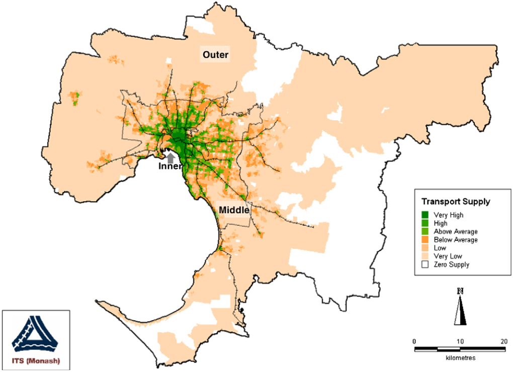
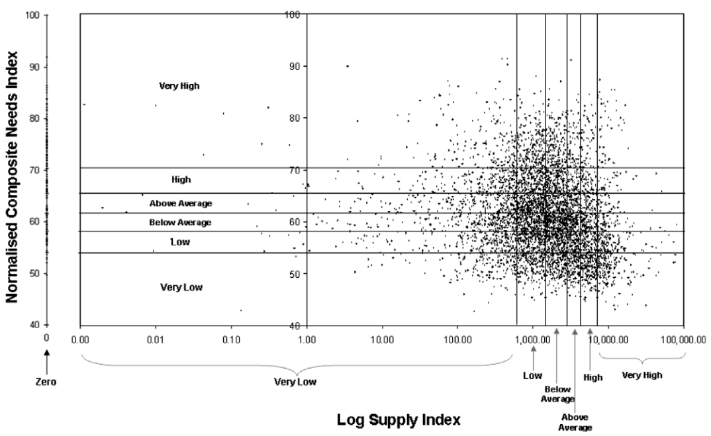
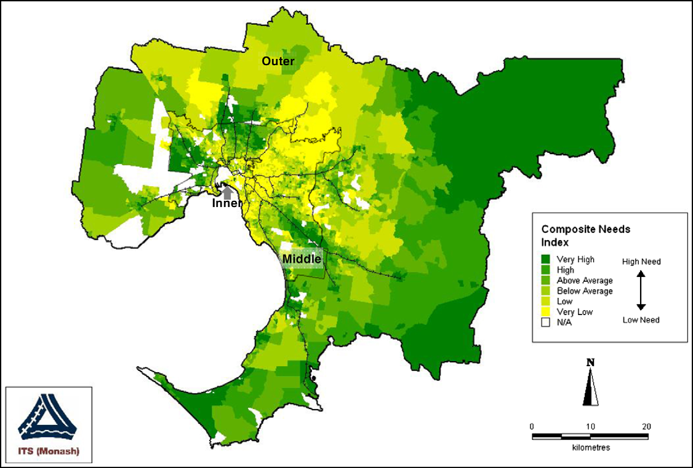

```{r setup, include=FALSE}
library(tidyverse)
library(tidytransit)
library(sp)
library(strayr)
library(ptinpoly)
library(magrittr)
library(ggplot2)
library(sf)
library(ASGS.foyer)
library(raster)
library(ggmap)
library(units)
library(janitor)
library(mapview)
library(ggstatsplot)
library(gtsummary)
library(moments)
library(scales)
library(gtfstools)
library(lubridate)
library(kableExtra)
library(knitr)
library(readxl)
library(readr)
library(dplyr)
library(devtools)
library(gtfssupplyindex)
library(readabs)
library(gglorenz)
library(DescTools)
library(RColorBrewer)
library(lsr)
library(ggpubr)
library(viridis)
library(geosphere)


# invalidate cache when the tufte version changes
#knitr::opts_chunk$set(cache.extra = packageVersion('tufte'))

```


# Introduction
Providing basic mobility 
for those who cannot otherwise drive 
is a key purpose for transit 
in many places [@Currie:2016aa].
Age, 
disability, 
socio-economic status, 
lack of a driver's license 
or vehicle, 
and many other factors 
might make someone
reliant on 
transit services 
for some or all of their travel. 
An approach for identifying 
spatial gaps in transit supply, 
where is a high or very high social need 
yet little or no service, was reported in
@Currie2003Hobart, 
@Currie2004Gap,
@Currie2007Identifying and @currie2010identifying. 
However, there does not appear to have been 
much further use or development 
of this approach. 
As well, it is unclear if
the spatial patterns 
identified in this previous research 
are representative of 
transit supply and social need 
in other places,
or whether the location of gaps have changed in the intervening years.

This may in part be because until recently schedule data 
was not readily available in 
consistent, electronic formats, 
meaning that assessing transit supply was a 
large task. 
Nowadays, 
more than 10,000 transit agencies 
publicly release data 
in the General Transit Feed Specification (GTFS)
format [@GTFS].
However, software tools
for examining spatial 
patterns and gaps 
in transit supply 
with respect to 
social needs for transport
do not appear to be readily available.
This gap, and the lack of 
direct follow up 
to @Currie2003Hobart, 
@Currie2004Gap, 
@Currie2007Identifying 
and @currie2010identifying, 
provide the motivation 
for this paper.

The three main objectives of this research are: 
(1) to develop tools for undertaking needs-gap analysis 
using GTFS datasets; 
(2) to explore whether such gaps in Melbourne have changed since the publication 
of @Currie2007Identifying 
and @currie2010identifying; 
and (3) to better understand whether spatial patterns in 
Melbourne are representative of those in other places.
Outcomes of this research reported in this paper include 
the development of a new R package (gtfssupplyindex) 
with software tools 
that facilitate the 
use of the 
@Currie2003Hobart, 
@Currie2004Gap, 
@Currie2007Identifying 
and @currie2010identifying
approach, 
in particular the calculation of
transit Supply Index (SI) scores 
from GTFS datasets. 
Also presented in this paper 
are results for Australian cities in 2016 and 2021, 
matching the most recent censuses, 
which are compared across locations 
and to the 2006 analysis
of Melbourne reported in @currie2010identifying.

The remainder of this paper is structured as follows:
the next section outlines the background to this research. 
Section 3 describes the study methodology, 
followed by presentation of results in Section 4 
and discussion in Section 5. 
Limitations of this study, 
directions for future research and 
a brief conclusion are provided in Section 6. 

# Background
## Transit metrics
There are 
many metrics 
available for benchmarking transit services. 
These include those in 
the Transit Cooperative Research Program (TCRP) Report 88, a guidebook 
for developing performance-measurement systems [@Ryus:2003aa]; 
and those
used across benchmarking databases and programs such as @Florida-Transit-Information-System:2018aa, @UITP:2015aa and @Imperial-College-London:2023aa.
The Fielding Triangle [@FieldingGordonJ1987Mpts] 
provides a framework 
for combining indicators of 
service inputs, 
outputs 
and consumption 
to describe cost efficiency, 
cost effectiveness and
service effectiveness. 
More broadly: @Litman:2003ab 
and @Litman:2016aa 
discuss some of the traffic, 
mobility, 
accessibility, 
social equity, 
strategic planning 
and other rational decision-making-based
perspectives underlying many transport indicators; 
@Reynolds:2017ah extends 
these into models of how 
institutionalism, 
incrementalism 
and other public policy analysis concepts 
might apply to decision-making processes 
relating to transit prioritization; 
@GuzmanLuisA.2017Aeit developed a measure of accessibility 
in the context of policy development 
and social equity 
for Latin American Bus Rapid Transit (BRT) networks; and 
@Creutzig2020streetspaceallocation
introduced street space allocation metrics 
based around ten ethical principles. 

However, 
many of these metrics 
may be difficult to calculate, 
explain or understand, 
especially for those who are not planners, engineers 
or other technical specialists. 
Where pre-calculated transit metrics 
are immediately available, 
such as on a website or 
other online platform, 
it may not be possible
to independently generate scores, 
for instance to assess proposed system changes. 
Contrasting examples are provided by:

- Transit Scores[@WalkScore:2023tg], which 
are readily available online 
for locations with a published GTFS feed. 
The meaning of the metric
also appears easy to explain, 
with the highest possible score of 100 
representing the sort of transit accessibility 
experienced in the center of New York. 
However, 
the Transit Score algorithm 
is secret, 
and scores cannot be calculated independently
or generated 
for proposed changes to networks. 

- The Transit Capacity and Quality of Service Manual (TCQSM),
whic provides a wide range of metrics 
for measuring different aspects of a transit system. 
The TCQSM scores themselves appear easy to understand or explain, 
ranging from A (good) to F (bad), 
although the large number of metrics 
might be somewhat overwhelming for some users.
The scores, however, 
can be calculated independently, given sufficient data. 

The widespread availability of GTFS datasets 
in recent years has facilitated the development of tools, 
such as the Transit Score, 
that apply the same metric to many transit systems. 
@Wong:2013aa provides another example of what can be done 
with GTFS data, 
open metrics and coding,
by reporting the distribution of
various TCQSM metrics 
across 50 USA transit operators. 
Code used in the 
@Wong:2013aa analysis 
is available 
for those who might wish 
to produce a similar study 
for other locations and systems. 
Developing a similar code base, but 
for calculating metrics associated with 
spatial gaps in transit supply based on social needs, 
is the subject of this paper. 

## The Transit Suppy Index
An objective of this study is to 
produce code that 
facilitates calculation of the SI metric
from GTFS data. 
A generalized form of the SI equation, 
adapted from @currie2010identifying, 
is: 

  $$SI_{area, time} = \sum{\frac{Area_{Bn}}{Area_{area}}*SL_{n, time}}$$

where:

- $SI_{area, time}$ is the Supply Index for the area of interest 
and a given period of time;

- $Area_{Bn}$ is the buffer area for each stop (n) within the area of interest 
(in @currie2010identifying this was based on 
a radius of 400 metres for bus and tram stops, 
and 800 metres for railway stations);

- $Area_{area}$ is the area of the area of interest; and

- $SL_{n,time}$ is the number of transit arrivals for each stop 
for a given time period.

```{r Currie_map_SI, fig.cap = "Distribution of supply measure scores – Metropolitan Melbourne (2006), Source: Currie (2010)",  echo = FALSE, warning=FALSE, message=FALSE, cache=FALSE, out.width='100%'}



```

@currie2010identifying reported SI scores 
for Census Collection Districts (CCDs) 
across Greater Melbourne in 2006, 
as shown in 
Figure \ref{fig:Currie_map_SI}.
General patterns were identified, being:
more transit supply 
in the middle and inner suburbs,
and along passenger railway lines; and 
outer areas tending to have very low SI scores 
or no transit supply at all. 

## Social need and needs gap


```{r Currie_chart_gap, fig.cap = "Log supply score and need index values – Melbourne needs-gap study, Source: Currie (2010)",  echo = FALSE, warning=FALSE, message=FALSE, cache=FALSE, out.width='100%'}

#

```


```{r Currie_map_needs, fig.cap = "Distribution of categories of composite social need index scores in 2006. Source: Currie (2010.)",  echo = FALSE, warning=FALSE, message=FALSE, cache=FALSE, out.width='100%'}



```

As well as measuring transit supply, @currie2010identifying 
assessed the social need for transit 
across Greater Melbourne using: 
the Australian Bureaus of Statistics' Index of Related Socio-Economic Advantage/Disadvantage (IRSAD) and 
a transport needs index derived 
from eight weighted indicators.
The spatial distribution of this 
composite social needs index in 2006, 
reproduced in Figure \ref{fig:Currie_map_needs), 
showed that areas of 
above average, 
high and
very high 
social needs 
in 2006 were located in: 
some outer areas, 
particularly in the east and south-east; 
and in some middle areas in the south-east,
north and west. 

As the final step in the spatial needs-gap analysis, 
@currie2010identifying identified 
areas with very high transport needs, 
but very low or no transit supply,
as reproduced in Figure \ref{fig:Currie_map_gap}. 
These areas were identified as being those where service gaps 
might be of particular concern. 
Most of these were located in outer parts of Melbourne 
in the north-east, south-east and south, 
although there were also some pockets 
in the middle suburbs in the west, north and south east.
Overall, @currie2010identifying found that 
"8.2% of Melbourne residents have ‘very high’ needs 
but ‘zero’, ‘low’ or ‘very low’ public transport supply."


```{r Currie_map_gap, fig.cap = "Melbourne needs-gap in 2006 – very high transport need areas with zero or very low public transport supply, Source: Currie (2010)",  echo = FALSE, warning=FALSE, message=FALSE, cache=FALSE, out.width='100%'}

knitr::include_graphics("graphics/Currie2010gap.png")

```
 

Using this methodology in transit planning 
was suggested as
"substantially more useful than the presentation of anecdotal evidence, 
which is the most common means 
of identifying transport needs 
in local transport studies throughout the world"[@currie2010identifying].
However, it does not appear that this approach 
has been widely adopted 
in practice or by researchers. 
Our suspicion is that while the SI has a relatively simple formula 
and requires only geographic and timetable data to calculate, 
the lack of software tools 
may be partly why it has not been more widely adopted.

It is also unclear 
whether the patterns in Melbourne 
identified in @currie2010identifying 
have changed 
since the 2006 analysis, 
or if Melbourne is representative of other locations. 
Developing a software tool 
to calculate SI tools from GTFS data, 
and then using it to comparing current conditions and other locations 
to the findings of @currie2010identifying, 
therefore, provides the motivation 
for this research.


# Methodology
## Code development

This study developed
a package of tools 
for calculating the SI from GTFS data 
using the R programming language [@R-base].
The recommendations of @wickham2023r 
informed the package setup and 
development approach. 
Various existing packages 
and code examples
were relied upon including: 
the sf package [@R-sf] for geospatial analysis; 
the tidyverse [@tidyverse2019]; 
gtfstools [@R-gtfstools]; and 
tidytransit [@R-tidytransit]. 
Australian Bureau of Statistics (ABS) data was also used, sourced via the strayr 
and absmapsdata packages [@r-strayr].

Code was developed and tested on 
the Mornington Peninsula Tourist Railway GTFS feed. 
This was selected primarily for convenience, 
given that the authors are familiar with 
the surrounding geography 
and that the feed covers 
a small number of trips across 
just three stations.  

## Changes since 2006: Greater Melbourne
Much has changed since 2006, 
including the spatial geography used by the 
Australian Bureau of Statistics (ABS) to collect census data. 
To allow direct comparison between 2006 and the most recent census, therefore, 
this study calculated SI scores 
using the same 
Census Collection Districts (CCDs) used by 
@currie2010identifying for the week starting the day of the 2021 census.
The Victorian GTFS feed, 
published by Public Transport Victoria (PTV), 
was used with historical feeds sourced via @transitfeeds_victoria:2023aa. 


```{r fix_ptv_data_Victoria_210805, eval = FALSE, echo = FALSE}

ptv_210805 <- tidytransit::read_gtfs("data/ptv_210805/gtfs.zip")
# This results in "Warning: Duplicated ids found in: stops The returned object is not a tidygtfs object, you can use as_tidygtfs() after fixing the issue."

#So, remove the duplicated stops 
#identify duplicate stops
ptv_210805_duplicated_stops <- tabyl(ptv_210805$stops$stop_id) %>% filter (n>1)
names(ptv_210805_duplicated_stops) <- c("stop_id", "n", "percent")
ptv_210805_duplicated_stops <- left_join(ptv_210805_duplicated_stops, ptv_210805$stops)

##discard duplicates
ptv_210805$stops <- ptv_210805$stops[!duplicated(ptv_210805$stops$stop_id),]

## Write gtfs back to file
ptv_210805 <- as_tidygtfs(ptv_210805)
tidytransit::write_gtfs(ptv_210805, "data/ptv_210805/gtfs_duplicate_stops_removed.zip")

## convert to list of tidygtfs objects
ptv_210805_list_gtfs <- gtfssupplyindex::gtfs_by_route_type("data/ptv_210805/gtfs_duplicate_stops_removed.zip")

```

```{r run_for_all_modes_Victoria_210810_CCD, eval = FALSE, echo = FALSE}
list_gtfs = ptv_210805_list_gtfs

#ccd_vic_2006 <- st_read("data/1259030002_cd06avic_shape/CD06aVIC.shp")

asgc2006 <- st_read("data/asgc2006.gpkg", layer = "census_collection_district_2006")
st_geometry(asgc2006) <- "geometry"

melbourne <- asgc2006 %>% 
  filter(MSR_NAME_2006 == "Melbourne") %>%
  select(CD_CODE_2006)

#Load Greater Melbourne CCD codes
areas_of_interest <- load_areas_of_interest(melbourne,  
  area_id_field = "CD_CODE_2006")

buffer_distance <- gtfssupplyindex:::load_buffer_zones()

stops_in_or_near_areas <- gtfssupplyindex:::stops_in_walk_dist(
  list_gtfs = list_gtfs, 
  areas_of_interest = areas_of_interest,
  EPSG_for_transform = 28355,
  verbose = FALSE
)


si_CCD2006_21_census_week <- SI_by_day_hour_and_route_type(
     list_gtfs = list_gtfs, 
stops_in_or_near_areas = stops_in_or_near_areas,
 start_date_ymd = "2021-08-10", 
 end_date_ymd = "2021-08-16",
verbose = TRUE)

write.csv(si_CCD2006_21_census_week, "results/Greater_Melbourne/si_CCD2006_21_census_week.csv")

si_CCD2006_21_census_week <- read_csv("results/Greater_Melbourne/si_CCD2006_21_census_week.csv")

si_CCD2006_21_census_week_aggregated <- si_CCD2006_21_census_week %>% 
           group_by(area_id) %>%    
           summarize(SI = sum(SI))

write.csv(si_CCD2006_21_census_week_aggregated, "results/Greater_Melbourne/si_CCD2006_21_census_week_aggregated.csv")


```


Unfortunately, it is not possible to obtain 
2016 or 2021 social disadvantage data for 
CCDs, as the ABS no longer uses this geographic scheme. 
Population and other statistics are now released for 
Statistical Area 1 (SA1) zones, 
and so SI scores and needs-gap analysis was completed for Greater Melbourne 
in 2021 using these boundaries instead. 

## Variation in spatial patterns across location and time. 
SI scores were also calculated for other
capital cities in Australia, for the weeks starting on the days
of the 2016 and 2021 censuses.
Historical GTFS data was again sourced via the Transit Feeds website. 
Unfortunately it was not possible to locate 
2021 GTFS data for Greater Sydney 
or Greater Darwin, 
so SI scores were calculated for 2024 using the 
latest data sets, sourced directly 
from the relevant transit authorities. 

The ABS' statistical geography boundaries can change from one census to the next 
as populations and spatial distributions change. The 2021 SA1 boundaries are used 
where direct comparisons of SI scores are made between 2016 and 2021, with the ABS' correspondence files used to adjust 2016 populations to the 2021 boundaries. For the assessment of social needs and needs-gaps in 2016, however, this study makes use of the 2016 SA1 boundaries so that census reported data can be 
directly matched to geographical location. 

```{r run_for_all_modes_Greater_Melbourne_210810_SA1, eval = FALSE, echo = FALSE}
list_gtfs = ptv_210805_list_gtfs

areas_of_interest <- load_areas_of_interest(
  absmapsdata::sa12021 %>% 
    filter(gcc_name_2021 == "Greater Melbourne") %>%
    select(sa1_code_2021),  
  area_id_field = "sa1_code_2021")

buffer_distance <- gtfssupplyindex:::load_buffer_zones()

stops_in_or_near_areas <- gtfssupplyindex:::stops_in_walk_dist(
  list_gtfs = list_gtfs, 
  areas_of_interest = areas_of_interest,
  EPSG_for_transform = 28355,
  verbose = FALSE
)


si_SA12021_21_census_week <- SI_by_day_hour_and_route_type(
     list_gtfs = list_gtfs, 
stops_in_or_near_areas = stops_in_or_near_areas,
 start_date_ymd = "2021-08-10", 
 end_date_ymd = "2021-08-16",
verbose = TRUE)

write.csv(si_SA12021_21_census_week, "results/Greater_Melbourne/si_SA12021_21_census_week.csv")

si_SA12021_21_census_week <- read_csv("results/Greater_Melbourne/si_SA12021_21_census_week.csv")

si_SA12021_21_census_week_aggregated <- si_SA12021_21_census_week %>% 
           group_by(area_id) %>%    
           summarize(SI = sum(SI))

write.csv(si_SA12021_21_census_week_aggregated, "results/si_SA12021_21_census_week_aggregated.csv")


```


```{r run_for_all_modes_Greater_Brisbane_210810_SA1, eval = FALSE, echo = FALSE}

###The gtfs agency.txt file has been manually edited to add an agency_id field, so that the tidygtfs functions will worl

## convert to list of tidygtfs objects
translink_seq_210805_list_gtfs <- gtfssupplyindex::gtfs_by_route_type("data/translink_seq_210805/gtfs_edited.zip")


list_gtfs = translink_seq_210805_list_gtfs

areas_of_interest <- load_areas_of_interest(
  absmapsdata::sa12021 %>% 
    filter(gcc_name_2021 == "Greater Brisbane") %>%
    select(sa1_code_2021),  
  area_id_field = "sa1_code_2021")

buffer_distance <- gtfssupplyindex:::load_buffer_zones()

stops_in_or_near_areas <- gtfssupplyindex:::stops_in_walk_dist(
  list_gtfs = list_gtfs, 
  areas_of_interest = areas_of_interest,
  EPSG_for_transform = 28355,
  verbose = FALSE
)


brisbane_si_SA12021_21_census_week <- SI_by_day_hour_and_route_type(
     list_gtfs = list_gtfs, 
stops_in_or_near_areas = stops_in_or_near_areas,
 start_date_ymd = "2021-08-10", 
 end_date_ymd = "2021-08-16",
verbose = TRUE)

write.csv(brisbane_si_SA12021_21_census_week, "results/Greater_Brisbane/brisbane_si_SA12021_21_census_week.csv")

brisbane_si_SA12021_21_census_week <- read_csv("results/Greater_Brisbane/brisbane_si_SA12021_21_census_week")

brisbane_si_SA12021_21_census_week_aggregated <- brisbane_si_SA12021_21_census_week %>% 
           group_by(area_id) %>%    
           summarize(SI = sum(SI))

write.csv(brisbane_si_SA12021_21_census_week_aggregated, "results/Greater_Brisbane/brisbane_si_SA12021_21_census_week_aggregated.csv")


```


```{r run_for_all_modes_Greater_Adelaide_210810_SA1, eval = FALSE, echo = FALSE}

###The gtfs agency.txt file has been manually edited to add an agency_id field, so that the tidygtfs functions will worl

## convert to list of tidygtfs objects
adelaide_metro_210716_list_gtfs <- gtfssupplyindex::gtfs_by_route_type("data/adelaide_metro_210716/gtfs.zip")


list_gtfs = adelaide_metro_210716_list_gtfs

areas_of_interest <- load_areas_of_interest(
  absmapsdata::sa12021 %>% 
    filter(gcc_name_2021 == "Greater Adelaide") %>%
    select(sa1_code_2021),  
  area_id_field = "sa1_code_2021")

buffer_distance <- gtfssupplyindex:::load_buffer_zones()

stops_in_or_near_areas <- gtfssupplyindex:::stops_in_walk_dist(
  list_gtfs = list_gtfs, 
  areas_of_interest = areas_of_interest,
  EPSG_for_transform = 28355,
  verbose = FALSE
)


adelaide_si_SA12021_21_census_week <- SI_by_day_hour_and_route_type(
     list_gtfs = list_gtfs, 
stops_in_or_near_areas = stops_in_or_near_areas,
 start_date_ymd = "2021-08-10", 
 end_date_ymd = "2021-08-16",
verbose = TRUE)

write.csv(adelaide_si_SA12021_21_census_week, "results/Greater_Adelaide/adelaide_si_SA12021_21_census_week.csv")

#adelaide_si_SA12021_21_census_week <- read_csv("results/Greater_Adelaide/adelaide_si_SA12021_21_census_week")

adelaide_si_SA12021_21_census_week_aggregated <- adelaide_si_SA12021_21_census_week %>% 
           group_by(area_id) %>%    
           summarize(SI = sum(SI))

write.csv(adelaide_si_SA12021_21_census_week_aggregated, "results/Greater_Adelaide/adelaide_si_SA12021_21_census_week_aggregated.csv")


```
```{r run_for_all_modes_Greater_Hobart_210810_SA1, eval = FALSE, echo = FALSE}

###The gtfs agency.txt file has been manually edited to add an agency_id field, so that the tidygtfs functions will worl

## convert to list of tidygtfs objects
metrotas_hobart_210726_list_gtfs <- gtfssupplyindex::gtfs_by_route_type("data/metrotas_hobart_210726/gtfs.zip")


list_gtfs = metrotas_hobart_210726_list_gtfs

areas_of_interest <- load_areas_of_interest(
  absmapsdata::sa12021 %>% 
    filter(gcc_name_2021 == "Greater Hobart") %>%
    select(sa1_code_2021),  
  area_id_field = "sa1_code_2021")

buffer_distance <- gtfssupplyindex:::load_buffer_zones()

stops_in_or_near_areas <- gtfssupplyindex:::stops_in_walk_dist(
  list_gtfs = list_gtfs, 
  areas_of_interest = areas_of_interest,
  EPSG_for_transform = 28355,
  verbose = FALSE
)


hobart_si_SA12021_21_census_week <- SI_by_day_hour_and_route_type(
     list_gtfs = list_gtfs, 
stops_in_or_near_areas = stops_in_or_near_areas,
 start_date_ymd = "2021-08-10", 
 end_date_ymd = "2021-08-16",
verbose = TRUE)

write.csv(hobart_si_SA12021_21_census_week, "results/Greater_Hobart/hobart_si_SA12021_21_census_week.csv")

#hobart_si_SA12021_21_census_week <- read_csv("results/Greater_Hobart/hobart_si_SA12021_21_census_week")

hobart_si_SA12021_21_census_week_aggregated <- hobart_si_SA12021_21_census_week %>% 
           group_by(area_id) %>%    
           summarize(SI = sum(SI))

write.csv(hobart_si_SA12021_21_census_week_aggregated, "results/Greater_Hobart/hobart_si_SA12021_21_census_week_aggregated.csv")


```

```{r run_for_all_modes_Greater_Perth_210810_SA1, eval = FALSE, echo = FALSE}

###The gtfs agency.txt file has been manually edited to add an agency_id field, so that the tidygtfs functions will worl

## convert to list of tidygtfs objects
transperth_210805_list_gtfs <- gtfssupplyindex::gtfs_by_route_type("data/transperth_210805/gtfs.zip")


list_gtfs = transperth_210805_list_gtfs

areas_of_interest <- load_areas_of_interest(
  absmapsdata::sa12021 %>% 
    filter(gcc_name_2021 == "Greater Perth") %>%
    select(sa1_code_2021),  
  area_id_field = "sa1_code_2021")

buffer_distance <- gtfssupplyindex:::load_buffer_zones()

stops_in_or_near_areas <- gtfssupplyindex:::stops_in_walk_dist(
  list_gtfs = list_gtfs, 
  areas_of_interest = areas_of_interest,
  EPSG_for_transform = 28355,
  verbose = FALSE
)


perth_si_SA12021_21_census_week <- SI_by_day_hour_and_route_type(
     list_gtfs = list_gtfs, 
stops_in_or_near_areas = stops_in_or_near_areas,
 start_date_ymd = "2021-08-10", 
 end_date_ymd = "2021-08-16",
verbose = TRUE)

write.csv(perth_si_SA12021_21_census_week, "results/Greater_Perth/perth_si_SA12021_21_census_week.csv")

#perth_si_SA12021_21_census_week <- read_csv("results/Greater_Perth/perth_si_SA12021_21_census_week")

perth_si_SA12021_21_census_week_aggregated <- perth_si_SA12021_21_census_week %>% 
           group_by(area_id) %>%    
           summarize(SI = sum(SI))

write.csv(perth_si_SA12021_21_census_week_aggregated, "results/Greater_Perth/perth_si_SA12021_21_census_week_aggregated.csv")


```


```{r run_for_all_modes_Greater_Canberra_210810_SA1, eval = FALSE, echo = FALSE}

#Load gtfs for bus and LRT and merge
action_buses_210701 <- gtfstools::read_gtfs("data/action_buses_210701/gtfs.zip") 
canberra_light_rail_210709 <- gtfstools::read_gtfs("data/canberra_light_rail_210709/gtfs.zip") 

canberra_gtfs_merged_2107 <- gtfstools::merge_gtfs(action_buses_210701, canberra_light_rail_210709)

gtfstools::write_gtfs(canberra_gtfs_merged_2107, "data/canberra_gtfs_merge_2107/gtfs.zip")

## convert to list of tidygtfs objects
canberra_merged_2107_list_gtfs <- gtfssupplyindex::gtfs_by_route_type("data/canberra_gtfs_merge_2107/gtfs.zip")


list_gtfs = canberra_merged_2107_list_gtfs

areas_of_interest <- load_areas_of_interest(
  absmapsdata::sa12021 %>% 
    filter(state_name_2021 == "Australian Capital Territory") %>%
    select(sa1_code_2021),  
  area_id_field = "sa1_code_2021")

buffer_distance <- gtfssupplyindex:::load_buffer_zones()

stops_in_or_near_areas <- gtfssupplyindex:::stops_in_walk_dist(
  list_gtfs = list_gtfs, 
  areas_of_interest = areas_of_interest,
  EPSG_for_transform = 28355,
  verbose = FALSE
)


canberra_si_SA12021_21_census_week <- SI_by_day_hour_and_route_type(
     list_gtfs = list_gtfs, 
stops_in_or_near_areas = stops_in_or_near_areas,
 start_date_ymd = "2021-08-10", 
 end_date_ymd = "2021-08-16",
verbose = TRUE)

write.csv(canberra_si_SA12021_21_census_week, "results/Greater_Canberra/canberra_si_SA12021_21_census_week.csv")

#canberra_si_SA12021_21_census_week <- read_csv("results/Greater_Canberra/canberra_si_SA12021_21_census_week")

canberra_si_SA12021_21_census_week_aggregated <- canberra_si_SA12021_21_census_week %>% 
           group_by(area_id) %>%    
           summarize(SI = sum(SI))

write.csv(canberra_si_SA12021_21_census_week_aggregated, "results/Greater_Canberra/canberra_si_SA12021_21_census_week_aggregated.csv")


```


```{r run_for_all_modes_Darwin_240806_SA1, eval = FALSE, echo = FALSE}

## convert to list of tidygtfs objects
darwin_240607_list_gtfs <- gtfssupplyindex::gtfs_by_route_type("data/darwin_240607/google-transit-darwin-20240607.zip")


list_gtfs = darwin_240607_list_gtfs 

areas_of_interest <- load_areas_of_interest(
  absmapsdata::sa12021 %>% 
    filter(gcc_name_2021 == "Greater Darwin") %>%
    select(sa1_code_2021),  
  area_id_field = "sa1_code_2021")

buffer_distance <- gtfssupplyindex:::load_buffer_zones()

stops_in_or_near_areas <- gtfssupplyindex:::stops_in_walk_dist(
  list_gtfs = list_gtfs, 
  areas_of_interest = areas_of_interest,
  EPSG_for_transform = 28355,
  verbose = FALSE
)


darwin_si_SA12021_240806_week <- SI_by_day_hour_and_route_type(
     list_gtfs = list_gtfs, 
stops_in_or_near_areas = stops_in_or_near_areas,
 start_date_ymd = "2024-08-06", 
 end_date_ymd = "2024-08-12",
verbose = TRUE)

write.csv(darwin_si_SA12021_240806_week, "results/Greater_Darwin/darwin_si_SA12021_240806_week.csv")


darwin_si_SA12021_240806_week_aggregated <- darwin_si_SA12021_240806_week %>% 
           group_by(area_id) %>%    
           summarize(SI = sum(SI))

write.csv(darwin_si_SA12021_240806_week_aggregated, "results/Greater_Darwin/darwin_si_SA12021_240806_week_aggregated.csv")


```

```{r run_for_all_modes_Sydney_240806_SA1, eval = FALSE, echo = FALSE}
# Revise routes.txt to remove extended route types
# Outside of R extracted the gtfs.zip
routes <- read_csv("data/sydney_240607/full_greater_sydney_gtfs_static_0/routes.csv")

routes_revised <- routes %>% 
    mutate(route_type = replace(route_type, route_type == 714, 3)) %>% 
    mutate(route_type = replace(route_type, route_type == 700, 3)) %>% 
    mutate(route_type = replace(route_type, route_type == 712, 3)) %>% 
    mutate(route_type = replace(route_type, route_type == 401, 1)) %>% 
    mutate(route_type = replace(route_type, route_type == 204, 3)) %>% 
    mutate(route_type = replace(route_type, route_type == 106, 2)) %>% 
    mutate(route_type = replace(route_type, route_type == 205, 3)) %>% 
    mutate(route_type = replace(route_type, route_type == 900, 0)) 


write.csv(routes_revised, "data/sydney_240607/full_greater_sydney_gtfs_static_0/routes.csv")

# Outside of R renamed routes.csv to routes.txt and zipped the gtfs feed back up again
  

## convert to list of tidygtfs objects
sydney_240607_list_gtfs <- gtfssupplyindex::gtfs_by_route_type("data/sydney_240607/gtfs_revised.zip")


list_gtfs = sydney_240607_list_gtfs

areas_of_interest <- load_areas_of_interest(
  absmapsdata::sa12021 %>% 
    filter(gcc_name_2021 == "Greater Sydney") %>%
    select(sa1_code_2021),  
  area_id_field = "sa1_code_2021")

buffer_distance <- gtfssupplyindex:::load_buffer_zones()

stops_in_or_near_areas <- gtfssupplyindex:::stops_in_walk_dist(
  list_gtfs = list_gtfs, 
  areas_of_interest = areas_of_interest,
  EPSG_for_transform = 28355,
  verbose = FALSE
)


sydney_si_SA12021_240806_week <- SI_by_day_hour_and_route_type(
     list_gtfs = list_gtfs, 
stops_in_or_near_areas = stops_in_or_near_areas,
 start_date_ymd = "2024-08-06", 
 end_date_ymd = "2024-08-12",
verbose = TRUE)

write.csv(sydney_si_SA12021_240806_week, "results/Greater_Sydney/sydney_si_SA12021_240806_week.csv")


sydney_si_SA12021_240806_week_aggregated <- sydney_si_SA12021_240806_week %>% 
           group_by(area_id) %>%    
           summarize(SI = sum(SI))

write.csv(sydney_si_SA12021_240806_week_aggregated, "results/Greater_Sydney/sydney_si_SA12021_240806_week_aggregated.csv")


```


```{r fix_ptv_data_Victoria_160804, eval = FALSE, echo = FALSE}
 

ptv_160804 <- tidytransit::read_gtfs("data/ptv_160804/gtfs.zip")
# This results in "Warning: Duplicated ids found in: stops The returned object is not a tidygtfs object, you can use as_tidygtfs() after fixing the issue."

#So, remove the duplicated stops 
#identify duplicate stops
ptv_160804_duplicated_stops <- tabyl(ptv_160804$stops$stop_id) %>% filter (n>1)
names(ptv_160804_duplicated_stops) <- c("stop_id", "n", "percent")
ptv_160804_duplicated_stops <- left_join(ptv_160804_duplicated_stops, ptv_160804$stops)

##discard duplicates
ptv_160804$stops <- ptv_160804$stops[!duplicated(ptv_160804$stops$stop_id),]

## Write gtfs back to file
ptv_160804 <- as_tidygtfs(ptv_160804)
tidytransit::write_gtfs(ptv_160804, "data/ptv_160804/gtfs_duplicate_stops_removed.zip")

## convert to list of tidygtfs objects
ptv_160804_list_gtfs <- gtfssupplyindex::gtfs_by_route_type("data/ptv_160804/gtfs_duplicate_stops_removed.zip")

```


```{r run_for_all_modes_Victoria_160809, eval = FALSE, echo = FALSE}
list_gtfs = ptv_160804_list_gtfs

areas_of_interest <- load_areas_of_interest(
  absmapsdata::sa12021 %>% 
    filter(gcc_name_2021 == "Greater Melbourne") %>%
    select(sa1_code_2021),  
  area_id_field = "sa1_code_2021")

stops_in_or_near_areas <- gtfssupplyindex:::stops_in_walk_dist(
  list_gtfs = list_gtfs, 
  areas_of_interest = areas_of_interest,
  EPSG_for_transform = 28355,
  verbose = FALSE
)


si_SA12021_16_census_week <- SI_by_day_hour_and_route_type(
     list_gtfs = list_gtfs, 
stops_in_or_near_areas = stops_in_or_near_areas,
 start_date_ymd = "2016-08-09", 
 end_date_ymd = "2021-08-15",
verbose = TRUE)

write.csv(si_SA12021_16_census_week, "results/Greater_Melbourne/si_SA12021_16_census_week")

```


## Measuring social disadvantage
This study adopts a similar approach to measuring social disadvantage 
as used in @currie2010identifying, using: 
the ABS' Index of Relative Socio-Economic Advantage/Disadvantage (IRSAD); and
a transport needs index^[The same need indicators and weightings used in @currie2010identifying were adopted, although
\$799 or lower per week was used
as the  threshold for low income households 
rather than \$499 
to account for inflation 
(as per Reserve Bank of Australia's online inflation calculator).].
A composite needs indicator was derived 
based on the IRSAD and the transport needs index, 
again as per the @currie2010identifying approach^[However, 
changes to the ABS reporting systems mean
that the composite needs indicator 
had to based on weighting both the IRSAD index and the transport need index 
by the total population of each SA1 zone, 
which were then added, standardised and split into six groups.]. 


```{r read_ABS_data, fig.show="hold", echo = FALSE, warning=FALSE, message=FALSE, cache=TRUE, fig.fullwidth = TRUE, fig.cap="SI scores by SA3, census day 2016 and 2021"}

#read IRSAD 2021 and remove non-data rows
sa1_irsad_2021 <- read_excel("data/Statistical Area Level 1, Indexes, SEIFA 2021.xlsx", 
    sheet = "Table 3", skip = 5)
sa1_irsad_2021 <- sa1_irsad_2021 %>% filter(row_number() <= n()-3)
sa1_irsad_2021 <- sa1_irsad_2021 %>% 
  clean_names()

#read students 2021 and remove non-data rows
sa1_students_2021 <- read_csv("data/sa1_students.csv", 
    skip = 8)
sa1_students_2021 <- sa1_students_2021[-1,]
sa1_students_2021 <- sa1_students_2021 %>% filter(row_number() <= n()-5)

#read not in labour force in 2021 and remove non-data rows
#this dataset contains a single 'wafer', 
# being those people not in the labour force, separated by age and sa1
sa1_not_in_labour_force_2021 <- read_csv("data/sa1_not_in_labour_force_2021.csv", 
    skip = 10)
sa1_not_in_labour_force_2021 <- sa1_not_in_labour_force_2021[-1,]
#not_in_labour_force csv from ABS repeats the entire dataset, hence only read in first set
sa1_not_in_labour_force_2021 <- sa1_not_in_labour_force_2021 %>% filter(row_number() <= n()-61844)


#calculate number of adults not in labour force (ie 18+)
sa1_not_in_labour_force_2021$adult_not_labour_force <- rowSums (sa1_not_in_labour_force_2021[,20:117])
  


#read no car in 2021 and remove non-data rows
#this dataset contains a single 'wafer', 
# being those people living in a household with no car, separated by age and sa1
sa1_no_car_2021 <- read_csv("data/sa1_no_car_2021.csv", 
    skip = 8)
sa1_no_car_2021 <- sa1_no_car_2021[-1,]
sa1_no_car_2021 <- sa1_no_car_2021 %>% filter(row_number() <= n()-5)
#calculate number of adults with no car (ie 18+)
sa1_no_car_2021$adult_no_car <- rowSums(sa1_no_car_2021[,20:117])


#read low income in 2021 and remove non-data rows
sa1_low_income_2021 <- read_csv("data/sa1_low_income.csv", 
    skip = 8)
sa1_low_income_2021 <- sa1_low_income_2021[-1,]
sa1_low_income_2021 <- sa1_low_income_2021 %>% filter(row_number() <= n()-5)

#read disability support pension in 2021 and remove non-data rows
sa1_disability_support_pension_2021 <- read_csv("data/sa1_disability_2021.csv", 
    skip = 8)
sa1_disability_support_pension_2021 <- sa1_disability_support_pension_2021[-1,]
sa1_disability_support_pension_2021 <- sa1_disability_support_pension_2021 %>% filter(row_number() <= n()-5)


#read age in 2021 and remove non-data rows
sa1_age_2021 <- read_csv("data/sa1_age.csv", 
    skip = 8)
sa1_age_2021 <- sa1_age_2021[-1,]
sa1_age_2021 <- sa1_age_2021 %>% filter(row_number() <= n()-5)

#calculate number of people over 60.
sa1_age_2021$over_60 <- rowSums(sa1_age_2021[,63:117])

#calculate number of persons 5 to 9 years old.
sa1_age_2021$persons_5_to_9 <- rowSums(sa1_age_2021[,7:11]) 
#move age-related indicators into social indicators table. 
social_2021_sa1 <- sa1_age_2021 %>% 
  select(`AGEP Age`, over_60, persons_5_to_9)
names(social_2021_sa1) <- c("sa1_code_2021", "over_60", "five_to_nine")

#join Adults without Cars
social_2021_sa1 <- full_join(social_2021_sa1, 
                             sa1_no_car_2021 %>% 
                               select("AGEP Age", "adult_no_car"), 
                             by = join_by( "sa1_code_2021" == "AGEP Age"))

#join disability pension 
sa1_disability_support_pension_2021 <-  sa1_disability_support_pension_2021 %>% 
  clean_names()
  
social_2021_sa1 <- full_join(social_2021_sa1, 
                             sa1_disability_support_pension_2021 %>% 
                               select(
                                 "igap_main_type_of_personal_government_benefit_payment_administrative_data", 
                                      "disability_support_pension"),
                             by = join_by(
                               "sa1_code_2021" == "igap_main_type_of_personal_government_benefit_payment_administrative_data"))


#join low income households
sa1_low_income_2021$low_income_families <- rowSums(sa1_low_income_2021[,2:9])
social_2021_sa1 <- full_join(social_2021_sa1, 
                             sa1_low_income_2021 %>% 
                               select("FINASF Total Family Income as Stated (weekly)", "low_income_families"), 
                             by = join_by( "sa1_code_2021" == "FINASF Total Family Income as Stated (weekly)"))


#join adults not in labour force
social_2021_sa1 <- full_join(social_2021_sa1 %>% na.omit(), 
                             sa1_not_in_labour_force_2021 %>% 
                               select("AGEP Age", "adult_not_labour_force") %>%
                               na.omit(), 
                             by = join_by("sa1_code_2021" == "AGEP Age"))

#join students
sa1_students_2021$students <- sa1_students_2021$Total
social_2021_sa1 <- full_join(social_2021_sa1, 
                             sa1_students_2021 %>% 
                               select("STUP Full-Time/Part-Time Student Status", "students"), 
                             by = join_by( "sa1_code_2021" == "STUP Full-Time/Part-Time Student Status"))

#join IRSAD scores
sa1_irsad_2021$x2021_statistical_area_level_1_sa1 <- sa1_irsad_2021$x2021_statistical_area_level_1_sa1 %>% 
  as.character()
names(sa1_irsad_2021) <- c("sa1_code_2021", 
                           "usual_resident_population",
                           "IRSAD", 
                           "x4", 
                           "rank_in_australia", 
                           "decile_in_australia",
                           "percentile_in_australia", 
                           "x8", 
                           "state", 
                           "rank_in_state",
                           "decile_in_state",
                           "percentile_in_state")

social_2021_sa1 <- full_join(social_2021_sa1, 
                             sa1_irsad_2021 %>% 
                               select("sa1_code_2021", "IRSAD"))


#join SA1 enumerated population
social_2021_sa1 <- full_join(social_2021_sa1, 
                             sa1_age_2021 %>% 
                               select("AGEP Age", "Total"), 
                             by = join_by("sa1_code_2021" == "AGEP Age"))

names(social_2021_sa1) <- c("sa1_code_2021", 
                            "over_60", "age_five_to_nine", 
                            "adult_no_car", 
                            "disability_support_pension",
                            "low_income_families",
                            "adult_not_labour_force",
                            "students", 
                            "IRSAD", 
                            "population")

##Rescaling to 0-100 and adding the accessibility indicator needs to be done on a areas_of_interest by areas_of_interest bias, as which areas are included will matter. 

```


# Results
## The gtfssupplyindex Package
Code developed to calculate SI scores 
is available as an R package on github (see @gtfssupplyindex_github).
Included in the package 
is a vignette that outlines 
the structure of the calculations, 
the developed functions (LINK HERE), 
and step-by-step calculations for the 
Mornington Peninsula Railway 
as a worked example 
and comparison to SI scores calculated manually.  

## Greater Melbourne in 2021: changes since 2006

### SI scores 

Figure \ref{fig:Greater_Melbourne_SA1_2021_plot} shows Transit Supply groupings based on SI scores for SA1 zones within Greater Melbourne for the week starting the day of the 2021 census. The 2006 boundary of Greater Melbourne and the inner, middle and outer suburban boundaries used by @currie2010identifying are also shown so as to facilitate comparison to Figure \ref{fig:Currie_map_SI}. 


```{r Greater_Melbourne_CCD_2021, fig.show="hold", out.width="100%", echo = FALSE, warning=FALSE, message=FALSE, cache=FALSE, fig.cap="Greater Melbourne (2006 extents), Transport Supply by CCD, week starting the day of the 2021 census"}

## FUNCTION to define thresholds and return Very High, High etc. 
# as per Currie2010 Table 3 and page 34. 
# the approach appears to be to first identify zones that have zero supply 
# the remainder are then split into those above and below the average SI value
# these two groups are then each split into three groups of roughly equal size. 
set_thresholds <-function(si_by_area_dataframe){ 

## Define Very High, High etc thresholds
cuts_lower_groups <- si_by_area_dataframe %>% 
  st_drop_geometry() %>% 
  filter(SI !=0) %>%
  filter(SI <= SI %>% mean()) %>% 
  select(SI) %>% unlist() %>% 
  as.vector() %>% 
  quantileCut(3)

cuts_upper_groups <- si_by_area_dataframe %>% 
  st_drop_geometry() %>% 
  filter(SI !=0) %>%
  filter(SI > SI %>% mean()) %>%
  select(SI) %>% unlist() %>% 
  as.vector() %>% 
  quantileCut(3)

# Recode lower_group factors
allocation_lower_groups <- cuts_lower_groups %>% fct_recode(
  "Very Low" = levels(cuts_lower_groups)[1], 
  "Low" = levels(cuts_lower_groups)[2], 
  "Below average" = levels(cuts_lower_groups)[3])

# Recode upper_group factors
allocation_upper_groups <- cuts_upper_groups %>% fct_recode(
  "Above average" = levels(cuts_upper_groups)[1], 
  "High" = levels(cuts_upper_groups)[2], 
  "Very High" = levels(cuts_upper_groups)[3])


# Join back to lower_group SIs and areas_of_interest
si_by_area_dataframe_below_average <- si_by_area_dataframe %>% 
  st_drop_geometry() %>% 
  filter(SI !=0) %>%
  filter(SI <= SI %>% mean()) 
si_by_area_dataframe_below_average$transit_supply <- allocation_lower_groups

# Join back to upper_group SIs and areas_of_interest
si_by_area_dataframe_above_average <- si_by_area_dataframe %>% 
  st_drop_geometry() %>% 
  filter(SI !=0) %>%
  filter(SI > SI %>% mean()) 
si_by_area_dataframe_above_average$transit_supply <- allocation_upper_groups

# combine upper and lower groups
  
si_by_area_dataframe_non_zero <- add_row(si_by_area_dataframe_below_average, 
                                         si_by_area_dataframe_above_average)

#join back to dataframe, and put "Zero" in N/A
si_by_area_dataframe <- full_join(
  si_by_area_dataframe %>% 
    st_drop_geometry(), 
  si_by_area_dataframe_non_zero
)

si_by_area_dataframe$transit_supply <- si_by_area_dataframe$transit_supply %>% 
  fct_explicit_na(na_level = "Zero Supply") %>% 
  fct_shift(n = -1)

#return dataframe and information about level cut offs
si_by_area_dataframe_and_cuts_dataframe <- list(
  si_by_area_dataframe,
  c(levels(cuts_lower_groups), levels(cuts_upper_groups))
  )
return(si_by_area_dataframe_and_cuts_dataframe)
}
# END FUNCTION

## FUNCTION to set thresholds and return tibble, plot output and thresholds
si_thresholds_and_plot_function <- function(si_by_area, areas_of_interest){
# Set column names
names(si_by_area) <- c("area_id", "SI")
names(areas_of_interest) <- c("area_id", "geometry")
  
si_by_area$area_id <- si_by_area$area_id %>% 
  as.character()


##Join to areas_of_interest so as to identify (and enumerate as zero) 
# those areas of interest that have no SI score 

si_by_area <- full_join(
  areas_of_interest,
  si_by_area)
si_by_area[is.na(si_by_area)] <- 0

si_by_area_thresholds <- set_thresholds(si_by_area_dataframe = si_by_area)
si_by_area <- si_by_area_thresholds[[1]]


si_by_area <- left_join(
  areas_of_interest, 
  si_by_area)

output_plot <- ggplot()+ 
  geom_sf(data=si_by_area %>% na.omit(),
          aes(fill = transit_supply), colour=NA) +
  theme(axis.text.x=element_blank(), #remove x axis labels
        axis.ticks.x=element_blank(), #remove x axis ticks
        axis.text.y=element_blank(),  #remove y axis labels
        axis.ticks.y=element_blank(), #remove y axis ticks
        legend.position="bottom",
        legend.text = element_text(size = 4), 
        legend.title = element_text(size = 5)) + 
  scale_fill_manual(values = c("#FFFFFF", "#F9D8B1", "#F7C387", "#F29C33", "#5DB000", "#53A212", "#407F0B")) 


###NEED TO ADD SCALE, NORTH ARROW AND INNER, MIDDLE, OUTER boundaries.  CONSIDER ADDING TRAIN LINES AND 2006 GREATER MELBOURNE BOUNDARY

  outputs <- list("si_by_area" = si_by_area, 
                  "output_plot" = output_plot, 
                  "thresholds" = si_by_area_thresholds[[2]])
  return(outputs)
}

si_by_area <- read.csv("results/Greater_Melbourne/si_CCD2006_21_census_week_aggregated.csv") %>% 
  as_tibble()
si_by_area <- si_by_area[,2:3]

asgc2006 <- st_read("data/asgc2006.gpkg", layer = "census_collection_district_2006", quiet = TRUE)
st_geometry(asgc2006) <- "geometry"

melbourne_CCD <- asgc2006 %>% 
  filter(MSR_NAME_2006 == "Melbourne") %>%
  select(CD_CODE_2006)
areas_of_interest <- melbourne_CCD

si_CCD2006_21_census_week_aggregated <- si_thresholds_and_plot_function(si_by_area, areas_of_interest)

# Load 2006 Melbourne boundary
melbourne_sd07aust_region <- st_read("data/1259030001sd07 aust/", quiet = TRUE) %>% 
  filter(SDNAME07 == "Melbourne")

# Load 2006 LGA boundaries
vic_lga07aust_region <- st_read("data/1259030001lga07 aust/", quiet = TRUE) %>% 
                                  filter(STATE07 == 2)

# Set boundaries between around middle suburbs       
middle_lga07aust_region <- vic_lga07aust_region[
  vic_lga07aust_region$LGANAME07 %in% 
    c("Banyule (C)", "Bayside (C)", "Boroondara (C)", "Brimbank (C)", 
      "Darebin (C)", "Glen Eira (C)", "Greater Dandenong (C)", 
      "Hobsons Bay (C)", "Kingston (C)", "Manningham (C)", 
      "Maribyrnong (C)", "Monash (C)", "Moonee Valley (C)", 
      "Moreland (C)", "Stonnington (C)","Whitehorse (C)"), ] 
middle_lga07aust_region <- st_union(middle_lga07aust_region)

# plot with inner, middle and outer boundaries
#si_CCD2006_21_census_week_aggregated$output_plot + 
#  geom_sf(data=melbourne_sd07aust_region, fill = NA, linewidth = 0.5) +
#  geom_sf(data=middle_lga07aust_region, fill = NA, linewidth = 0.25)
```

<!---
Figure \ref{fig:Greater_Melbourne_CCD_2021} shows SI scores 
for Melbourne in the week of the 2021 census, 
using the same (2006) CCD boundaries as in Figure \ref{fig:Currie_map_SI}.

--->

```{r Greater_Melbourne_SA1_2021_plot, fig.show= "hold", out.width = "100%", echo = FALSE, warning = FALSE, message = FALSE, cache = FALSE, fig.fullwidth = TRUE, fig.cap = "Greater Melbourne, Transit Supply by SA1 for week starting the date of 2021 census, overlayed with: 2006 Greater Melbourne boundary (black); middle/outer and inner/middle suburb boundaries (grey); and suburban railway lines (dashed)."}


## 2021 Greater Melbourne
si_by_area <-  read.csv( "results/Greater_Melbourne/si_SA12021_21_census_week_aggregated.csv") %>% 
  as_tibble()
si_by_area <- si_by_area[,2:3]

areas_of_interest <-  absmapsdata::sa12021 %>% 
    filter(gcc_name_2021 == "Greater Melbourne") %>% 
    select(sa1_code_2021)

melbourne_si_SA12021_21_census_week_aggregated <- si_thresholds_and_plot_function(si_by_area, areas_of_interest)


### Load railway locations
# convert to list of tidygtfs objects
#ptv_210805_list_gtfs <- gtfssupplyindex::gtfs_by_route_type("data/ptv_210805/gtfs_duplicate_stops_removed.zip")

#melbourne_railway_trips_shape <- ptv_210805_list_gtfs [[2]] %>% 
#  tidytransit::gtfs_as_sf() %>%
#  tidytransit::get_trip_geometry(trip_ids = c(
#    "1936.UJ.2-PKM-F-mjp-1.3.H", 
#    "4568.T6.2-ALM-B-mjp-1.2.H",
#    "8658.T6.2-B31-B-mjp-1.3.H", 
#    "5233.T6.2-BEL-C-mjp-1.5.H",
#    "2127.T2.2-CRB-F-mjp-1.1.H",
#    "7310.UJ.2-FKN-D-mjp-1.2.H",
#    "4193.T6.2-GLW-C-mjp-1.1.H",
#    "3589.T6.2-HBG-B-mjp-1.1.H",
#    "1673.T0.2-LIL-G-mjp-1.21.H",
#   "3263.T2.2-MER-B-mjp-1.4.R",
#    "3044.T6.2-SDM-B-mjp-1.1.H",
#    "3044.T6.2-SDM-B-mjp-1.1.H",
#    "1164.UJ.2-SPT-C-mjp-1.1.H",
#    "1005.T6.2-SYM-B-mjp-1.8.H",
#    "2959.UJ.2-UFD-C-mjp-1.6.H",
#    "238.T6.2-WBE-E-mjp-1.4.H", 
#    "1.T2.2-WMN-D-mjp-1.2.H"))

# st_write(melbourne_railway_trips_shape, "results/melbourne_railway_trips_shape.shp", append = FALSE)

melbourne_railway_trips_shape <- st_read("results/melbourne_railway_trips_shape.shp", quiet = TRUE)

melbourne_si_SA12021_21_census_week_aggregated$output_plot + 
  geom_sf(data=melbourne_sd07aust_region, fill = NA, linewidth = 0.5) +
  geom_sf(data=middle_lga07aust_region, fill = NA, linewidth = 0.4) +
  geom_sf(data=melbourne_sd07aust_region, 
          colour="black", 
          fill=NA) +
  geom_sf(data=melbourne_railway_trips_shape, linetype = "twodash", size = 0.1) 

```
The overall spatial patterns appear generally similar in 2021 as they were in 2006, with higher levels of transit supply in inner areas and close to most railway lines. Greater Melbourne, however, now covers a larger spatial area than it did in 2006, and the SA1 zones now used by the ABS are different to the CCDs used by  @currie2010identifying. To allow direct comparison of the 2006 and 2021 results, 2021 SI scores were also generated for Greater Melbourne using the 2006 CCDs and boundary. Table \ref{tab:Greater_Melbourne_SA1_2021_table} and Figure \ref{fig:Greater_Melbourne_SA1_2021_table} compare these results as well as the distribution of population to Transit Supply groups. 


```{r Greater_Melbourne_SA1_2021_table, fig.show="hold", echo = FALSE, warning=FALSE, message=FALSE, cache=FALSE, fig.fullwidth = TRUE, fig.cap="Greater Melbourne: distribution of Transit Supply, 2006 CCDs, 2021 CCDs and 2021 SA1s, population 2006 and 2021. Sources: 2006 values - Currie (2010), 2021 values - authors"}


# create comparison table
melbourne_comparison_2006_2021 <- si_CCD2006_21_census_week_aggregated$si_by_area %>% 
  st_drop_geometry() %>%
  tabyl(transit_supply) %>%
  select(transit_supply)

melbourne_comparison_2006_2021$ccds_2006 <- c(
  189, 
  1314, 
  1310,
  1294,
  608,
  535,
  589)

melbourne_comparison_2006_2021$population_2006 <- c(
  85423,
  793046,
  865330, 
  774521,
  324546,
  260411,
  263832)
  
melbourne_comparison_2006_2021$ccds_2021 <- 
  si_CCD2006_21_census_week_aggregated$si_by_area %>% 
  st_drop_geometry() %>% 
  select(transit_supply) %>% 
  table() %>% 
  as_tibble() %>%
  select(n) %>%
  unlist() %>%
  as.numeric()
  
names(melbourne_comparison_2006_2021) <- c(
"transit_supply",
"ccds_2006", 
"population_2006", 
"ccds_2021")

melbourne_comparison_2006_2021$sa1s_2021 <- melbourne_si_SA12021_21_census_week_aggregated$si_by_area %>% 
  st_drop_geometry() %>% 
  select(transit_supply) %>% 
  table() %>% 
  as_tibble() %>%
  select(n) %>%
  unlist() %>%
  as.numeric()

names(melbourne_comparison_2006_2021) <- c(
"transit_supply",
"ccds_2006", 
"population_2006", 
"ccds_2021", 
"sa1s_2021")

# load and cleanup 2021 population by sa1
sa1_ur_agep_2021 <- read_csv("data/sa1_ur_agep_2021.csv", 
    skip = 8)
sa1_ur_agep_2021 <- sa1_ur_agep_2021[-1,]
sa1_ur_agep_2021 <- sa1_ur_agep_2021[1:61845,1:118] 
sa1_ur_agep_2021 <- sa1_ur_agep_2021%>% type.convert(as.is = T)
sa1_ur_agep_2021 <- sa1_ur_agep_2021 %>% clean_names()
colnames(sa1_ur_agep_2021)[colnames(sa1_ur_agep_2021) == "agep_age"] <- "sa1_code_2021"
#check variable types
#lapply(sa1_ur_agep_2021, class) %>% as_vector() %>% tabyl()

# connect population to transit supply
population_sa1_greater_melbourne <- left_join(
  areas_of_interest %>% st_drop_geometry(), 
  sa1_ur_agep_2021 %>% select(sa1_code_2021, total))

population_sa1_greater_melbourne <- left_join(
  melbourne_si_SA12021_21_census_week_aggregated$si_by_area %>% 
    st_drop_geometry() %>%
    select(area_id, transit_supply), 
  population_sa1_greater_melbourne, 
  join_by(area_id == sa1_code_2021)
  )
names(population_sa1_greater_melbourne) <- c("sa1_code_2021", 
                                             "transit_supply", 
                                             "population")


# add to comparison table
melbourne_comparison_2006_2021$population_2021 <- population_sa1_greater_melbourne %>% aggregate(population ~ transit_supply, sum) %>% 
  select(population) %>% 
  as_tibble() %>%
  unlist() %>%
  as.numeric()

names(melbourne_comparison_2006_2021) <- c(
"transit_supply",
"ccds_2006", 
"population_2006", 
"ccds_2021", 
"sa1s_2021", 
"population_2021")


melbourne_comparison_2006_2021 %>% 
  select(transit_supply, ccds_2006, ccds_2021, sa1s_2021, population_2006, population_2021) %>%
  as_tibble() %>% 
  adorn_totals() %>%
  adorn_percentages(denominator = "col") %>% 
  adorn_pct_formatting() %>% 
  adorn_ns() %>% 
  kable( 
      caption = "Greater Melbourne: Distribution of supply index scores and resident population. Sources: 2006 values - Currie (2010), 2021 values - authors",
      align = "lrrrrr",
      col.names = c("category", 
                   "2006", "2021", "2021",
                   "2006", "2021")
      ) %>% 
  add_header_above(c("Transit Supply" =1, "CCDs" = 2, "SA1s" = 1, "Population" = 2))

ccds_sa1s_pop <- melbourne_comparison_2006_2021 %>% 
             select(transit_supply, ccds_2006, ccds_2021, sa1s_2021, population_2006, population_2021) %>% 
             pivot_longer(
    cols = 2:6,
    names_to = "category", 
    values_to = "counts")

ccds_sa1s_pop$category<- factor(
  ccds_sa1s_pop$category, levels = c("ccds_2006", "ccds_2021", "sa1s_2021", "population_2006", "population_2021"))


ggbarstats(ccds_sa1s_pop,
  x = transit_supply, 
  y = category, 
  counts = "counts") +
  theme(legend.position = "bottom")

  
  
    
```

Figure \ref{fig:Greater_Melbourne_SA1_2021_plot} shows that there are still many areas with very low or zero transit supply, especially in outer areas. Within the 2006 Greater Melbourne boundary there are only `r si_CCD2006_21_census_week_aggregated[["si_by_area"]] %>%  filter(transit_supply == "Zero Supply") %>% nrow()` CCDs with Zero Supply in 2021, compared to the 186 reported in @currie2010identifying for 2006. When including the new parts of Greater Melbourne, however, there are `r melbourne_si_SA12021_21_census_week_aggregated[["si_by_area"]] %>%  filter(transit_supply == "Zero Supply") %>% nrow()` SA1s with Zero Supply in 2021, making up `r percent_format(accuracy = 0.1)((melbourne_si_SA12021_21_census_week_aggregated[["si_by_area"]] %>%  filter(transit_supply == "Zero Supply") %>% nrow()/melbourne_si_SA12021_21_census_week_aggregated[["si_by_area"]] %>% nrow()))` of the total number of SA1s in Greater Melbourne, compared to the 3.2% of CCDs with Zero Supply in 2006 reported in @currie2010identifying. Table \ref{tab:Greater_Melbourne_SA1_2021_table} and Figure \ref{fig:Greater_Melbourne_SA1_2021_table} also show that more of the population of Greater Melbourne are within areas with Zero Supply in 2021 (`r percent_format(accuracy = 0.1)((ccds_sa1s_pop %>% filter(transit_supply == "Zero Supply") %>% filter(category == "population_2021") %>% select(counts) %>% as.numeric()) / (ccds_sa1s_pop %>% filter(category == "population_2021") %>% select(counts) %>% sum()))`) than in 2006 (`r percent_format(accuracy = 0.1)((ccds_sa1s_pop %>% filter(transit_supply == "Zero Supply") %>% filter(category == "population_2006") %>% select(counts) %>% as.numeric()) / (ccds_sa1s_pop %>% filter(category == "population_2006") %>% select(counts) %>% sum()))`)


```{r Greater_Melbourne_CCD_2021_by_suburbs_SI_scores, fig.show="hold", out.width="100%", echo = FALSE, warning=FALSE, message=FALSE, cache=FALSE, fig.cap="Greater Melbourne (2006 extents), SI score by CCD, week starting the day of the 2021 census, inner, middle and outer suburbs"}

#build table with inner, middle and outer
si_CCD2006_21_census_week_aggregated_middle_suburbs <- si_CCD2006_21_census_week_aggregated$si_by_area %>% st_filter(middle_lga07aust_region, .predicate = st_intersects)
si_CCD2006_21_census_week_aggregated_middle_suburbs$suburbs <- "middle"


outer_lga07aust_region <- vic_lga07aust_region[
  vic_lga07aust_region$LGANAME07 %in% c(
    "Cardinia (S)", "Casey (C)", "Frankston (C)", "Hume (C)", "Knox (C)", 
    "Mornington Peninsula (S)", "Maroondah (C)", "Melton (S)", "Nillumbik (S)", 
    "Whittlesea (C)", "Wyndham (C)", "Yarra Ranges (S)"),] 
outer_lga07aust_region <- st_union(outer_lga07aust_region)
si_CCD2006_21_census_week_aggregated_outer_suburbs <- si_CCD2006_21_census_week_aggregated$si_by_area %>% st_filter(outer_lga07aust_region, .predicate = st_intersects)
si_CCD2006_21_census_week_aggregated_outer_suburbs$suburbs <- "outer"

# Set boundaries between around inner suburbs       
inner_lga07aust_region <- vic_lga07aust_region[
  vic_lga07aust_region$LGANAME07 %in% 
    c("Melbourne (C)", "Yarra (C)", "Port Phillip (C)"),]
inner_lga07aust_region <- st_union(inner_lga07aust_region)


inner_lga07aust_region <- st_union(inner_lga07aust_region)
si_CCD2006_21_census_week_aggregated_inner_suburbs <- si_CCD2006_21_census_week_aggregated$si_by_area %>% st_filter(inner_lga07aust_region, .predicate = st_intersects)
si_CCD2006_21_census_week_aggregated_inner_suburbs$suburbs <- "inner"


# combine outer and middle
si_CCD2006_21_census_week_aggregated_outer_and_middle_suburbs <- add_row(
  si_CCD2006_21_census_week_aggregated_outer_suburbs,
  si_CCD2006_21_census_week_aggregated_middle_suburbs)
  
# CCDs that are within both the middle and outer suburbs (ie. on the boundary) 
# Lets assign them to the out
# so drop the duplicated rows
si_CCD2006_21_census_week_aggregated_outer_and_middle_suburbs <- si_CCD2006_21_census_week_aggregated_outer_and_middle_suburbs %>%
  arrange(area_id, rev(suburbs)) %>%
  filter(duplicated(area_id) == FALSE)


# combine inner with outer and middle
si_CCD2006_21_census_week_aggregated$si_by_area <- add_row(
  si_CCD2006_21_census_week_aggregated_outer_and_middle_suburbs,
  si_CCD2006_21_census_week_aggregated_inner_suburbs)
  
# CCDs that are within both the inner and middle suburbs (ie. on the boundary) 
# Lets assign them to the inner
# so drop the duplicated rows
si_CCD2006_21_census_week_aggregated_outer_and_middle_suburbs <- si_CCD2006_21_census_week_aggregated_outer_and_middle_suburbs %>%
  arrange(area_id, suburbs) %>%
  filter(duplicated(area_id) == FALSE)


#ggplot() +
#  geom_sf(data=si_CCD2006_21_census_week_aggregated$si_by_area, 
#aes(fill = suburbs)) +
#  geom_sf(data=middle_lga07aust_region, fill = NA, linewidth = 0.75)


#ggbetweenstats(data = si_CCD2006_21_census_week_aggregated$si_by_area,
#               x = suburbs,
#               y = SI) +
#  scale_y_continuous(labels=label_number(accuracy = 1, big.mark = ","))
  
```


The average SI value has also increased to `r si_CCD2006_21_census_week_aggregated[["si_by_area"]] %>% select(SI) %>% st_drop_geometry() %>% unlist()%>% mean() %>% format(big.mark = ",", digits = 5)` from the value of 2,886.9 in 2006 reported in @currie2010identifying, indicating that the overall transit service supply score has increased by approximately `r percent_format(accuracy = 1)((si_CCD2006_21_census_week_aggregated[["si_by_area"]] %>% select(SI) %>% st_drop_geometry() %>% unlist() %>% mean() * si_CCD2006_21_census_week_aggregated[["si_by_area"]] %>% nrow()) / (2886.9 * 5839)-1)`. SI scores average `r si_CCD2006_21_census_week_aggregated$si_by_area %>% st_drop_geometry() %>% filter(suburbs == "inner") %>% select(SI) %>% unlist() %>% mean() %>% format(big.mark = ",", digits = 6)`, `r si_CCD2006_21_census_week_aggregated$si_by_area %>% st_drop_geometry() %>% filter(suburbs == "middle") %>% select(SI) %>% unlist() %>% mean() %>% format(big.mark = ",", digits = 5)` and `r si_CCD2006_21_census_week_aggregated$si_by_area %>% st_drop_geometry() %>% filter(suburbs == "outer") %>% select(SI) %>% unlist() %>% mean() %>% format(big.mark = ",", digits = 4)` for the inner, middle and outer suburbs respectively^[The same grouping of LGAs to inner, middle and outer suburb groups as used in @currie2010identifying was used for this analysis, although here the City of Stonnington was allocated entirely to the middle grouping, whereas @currie2010identifying allocated part of this LGA to the inner group.], compared to 10,922.7, 2,694.9 and 764.3, respectively, reported for 2006 in @currie2010identifying.


```{r Greater_Melbourne_CCD_2021_by_suburbs, fig.show="hold", out.width="100%", echo = FALSE, warning=FALSE, message=FALSE, cache=FALSE, eval = FALSE, fig.cap="Greater Melbourne (2006 extents), Distribution of CCDs by Transit Supply grouping, week starting the day of the 2021 census, for the inner, middle and outer suburbs"}
 


si_CCD2006_21_census_week_aggregated$si_by_area %>%
  st_drop_geometry() %>%
  tabyl(transit_supply, suburbs) %>% 
  adorn_totals(where = c("row", "col")) %>% 
  adorn_percentages() %>% 
  adorn_pct_formatting() %>% 
  adorn_ns() %>% 
  kable(
    caption = "Distribtuion of CCDs by Transit Supply grouping across inner, middle and outer suburbs",
    align = "lrrr"
  )

si_CCD2006_21_census_week_aggregated$si_by_area %>%
  st_drop_geometry() %>%
  tabyl(transit_supply, suburbs) %>%
  pivot_longer(
    cols = 2:4,
    names_to = "suburb",
    values_to = "CCDs"
  ) %>% 
  ggbarstats(
    y = suburb, 
    x = transit_supply,
    counts = CCDs
  )

```

<!---
Table \ref{tab:Greater_Melbourne_CCD_2021_by_suburbs} and Figure \ref{fig:Greater_Melbourne_CCD_2021_by_suburbs}  compares the distribution of Transport Supply groupings across the inner, middle and outer suburbs. In general, the results meet expectations, with a greater proportion of CCDs having higher transit supply in inner and (then) middle suburbs. 
--->


### Social needs
Figure \ref{fig:Greater_Melbourne_2021_social_needs} shows the distribution of categories of social need index scores across Greater Melbourne for 2021. This figure is analogous to the 2006 value from @currie2010identifying shown in Figure \ref{fig:Currie_map_needs} although, as discussed in the methodology section above, it was not possible to exactly replicate the @currie2010identifying approach due to changes in the way census results are reported. 

```{r Greater_Melbourne_2021_social_needs, out.width="90%", echo = FALSE, warning=FALSE, message=FALSE, cache=FALSE,  fig.cap="Distribution of categories of composite social need index scores, overlayed with: 2006 Greater Melbourne boundary (black); middle/outer and inner/middle suburb boundaries (grey); and suburban railway lines (dashed)."}

#join to sa1 data, including lat and long of each sa1
social_2021_sa1_greater_melbourne <- left_join(
  absmapsdata::sa12021 %>% 
    filter(gcc_name_2021 == "Greater Melbourne") %>% 
    select(sa1_code_2021, sa3_name_2021, cent_lat, cent_long) %>%
    st_drop_geometry(),
  social_2021_sa1 
)

# from https://stackoverflow.com/questions/36817423/how-to-efficiently-calculate-distance-between-pair-of-coordinates-using-data-tab/42014364#42014364
dt.haversine <- function(lat_from, lon_from, lat_to, lon_to, r = 6378137){
  radians <- pi/180
  lat_to <- lat_to * radians
  lat_from <- lat_from * radians
  lon_to <- lon_to * radians
  lon_from <- lon_from * radians
  dLat <- (lat_to - lat_from)
  dLon <- (lon_to - lon_from)
  a <- (sin(dLat/2)^2) + (cos(lat_from) * cos(lat_to)) * (sin(dLon/2)^2)
  return(2 * atan2(sqrt(a), sqrt(1 - a)) * r)
}

social_2021_sa1_greater_melbourne$distance_m_to_GPO <- 
 dt.haversine(-37.813840, 
              144.963028,
              social_2021_sa1_greater_melbourne$cent_lat,
              social_2021_sa1_greater_melbourne$cent_long)


calculate_IRSAD_and_need_index <- function(social_dataset) {
  # scale all to 0 to 100
  social_dataset$IRSAD_100 <- rescale_max(
     social_dataset$IRSAD, to = c(0, 100))
  social_dataset$adult_no_car_100 <- rescale_max(
    social_dataset$adult_no_car, to = c(0, 100))
   social_dataset$accessibility_100 <- rescale_max(
     social_dataset$distance_m_to_GPO, to = c(0, 100))
   social_dataset$over_60_100 <- rescale_max(
     social_dataset$over_60, to = c(0, 100))
   social_dataset$disability_pension_100 <- rescale_max(
     social_dataset$disability_support_pension, to = c(0, 100))
   social_dataset$low_income_families_100 <- rescale_max(
     social_dataset$low_income_families, to = c(0, 100))
  social_dataset$adult_not_labour_force_100 <- rescale_max(
     social_dataset$adult_not_labour_force, to = c(0, 100))
  social_dataset$students_100 <- rescale_max(
     social_dataset$students, to = c(0, 100))
  social_dataset$age_five_to_nine_100 <- rescale_max(
     social_dataset$age_five_to_nine, to = c(0, 100))
  
  # calculate needs scores and scale to 100
  social_dataset$needs_score <- social_dataset$adult_no_car_100 * 0.19 +
    social_dataset$accessibility_100 * 0.15 + 
    social_dataset$over_60_100 * 0.14 + 
    social_dataset$disability_pension_100 * 0.12 + 
    social_dataset$low_income_families_100 * 0.10 + 
    social_dataset$adult_not_labour_force_100 * 0.09 + 
    social_dataset$students_100 * 0.09 + 
    social_dataset$age_five_to_nine_100 * 0.12
  social_dataset$needs_score_100 <- rescale_max(
     social_dataset$needs_score, to = c(0, 100))
  
  # weight IRSAD and needs score by total population
  social_dataset$total_need_IRSAD <- social_dataset$IRSAD *
    social_dataset$population
  social_dataset$total_transport_need <- social_dataset$needs_score * 
    social_dataset$population
  
  # create combined indicator 0 to 100
  social_dataset$combined_needs_index <- social_dataset$total_need_IRSAD + 
    social_dataset$total_transport_need 
  social_dataset$combined_needs_index <- rescale_max(
     social_dataset$combined_needs_index, to = c(0, 100))
  
  
  return(social_dataset %>% 
           select(sa1_code_2021, combined_needs_index, population, sa3_name_2021)) 
}

combined_needs_index_2021_sa1_greater_melbourne <- calculate_IRSAD_and_need_index(
  social_2021_sa1_greater_melbourne)

# Reuse the set thresholds function (but cheat by switching name of column two to SIs)
thresholds_holding <- combined_needs_index_2021_sa1_greater_melbourne %>%
  st_drop_geometry() %>% 
  select(sa1_code_2021, combined_needs_index) 
names(thresholds_holding) <- c("area_id", "SI")  

thresholds_holding <- set_thresholds(thresholds_holding)
names(thresholds_holding[[1]]) <- c("sa1_code_2021", "combined_needs_index", "composite_needs")
thresholds_holding[[1]]$composite_needs <- thresholds_holding[[1]]$composite_needs %>% fct_other(keep = c("Very Low", "Low", "Below average", "Above average", "High", "Very High"), other_level = "NA")

#join to sa1 geometry data
combined_needs_index_2021_sa1_greater_melbourne <- left_join(
  absmapsdata::sa12021 %>% 
    filter(gcc_name_2021 == "Greater Melbourne") %>% 
    select(sa1_code_2021),
  thresholds_holding[[1]] 
)


ggplot()+ 
  geom_sf(data=combined_needs_index_2021_sa1_greater_melbourne %>% na.omit(),
          aes(fill =  composite_needs), colour=NA) +
  theme(axis.text.x=element_blank(), #remove x axis labels
        axis.ticks.x=element_blank(), #remove x axis ticks
        axis.text.y=element_blank(),  #remove y axis labels
        axis.ticks.y=element_blank(), #remove y axis ticks
        legend.position="bottom",
        legend.text = element_text(size = 4), 
        legend.title = element_text(size = 5)) + 
  scale_fill_manual(values = c("#FFFB07", "#CEE102", "#A3CF07", "#61AE09", "#2EA105", "#0A7B01")) + 
  geom_sf(data=melbourne_sd07aust_region, fill = NA, linewidth = 0.5) +
  geom_sf(data=middle_lga07aust_region, fill = NA, linewidth = 0.4) +
  geom_sf(data=melbourne_sd07aust_region, 
          colour="black", 
          fill=NA) +
  geom_sf(data=melbourne_railway_trips_shape, linetype = "twodash", size = 0.1) 


```


Comparing Figure \ref{fig:Greater_Melbourne_2021_social_needs} and Figure \ref{fig:Currie_map_needs} suggests that in 2021, compared to 2006: the spatial grouping of different levels of social need is less consistent; middle eastern suburbs have higher relative needs; and outer suburbs, particularly in the north-east and south-east, have lower relative needs. However, this may be an artifact of: the differences in the composite needs scores used in this analysis (due to the lack of data to assess relative needs) compared to the @currie2010identifying analysis; and the shift of the ABS from using CCDs to SA1s^[CCDs were originally devised to group the approximately 200 dwellings allocated to each individual census collector, whereas SA1s were introduced in be consistent in population (200 to 800 people, averaging 400) and character[@ABS_SA1s_CCDs]].

### Needs-gap analysis


```{r Greater_Melbourne_2021_needs_gap, fig.show="hold", eval = TRUE, echo = FALSE, warning=FALSE, message=FALSE, cache=FALSE, fig.fullwidth = TRUE, fig.cap="Greater Melbourne 2021, SI and Combined Needs Index scores"}

melbourne_needs_gap_sa1_2021 <- 
  left_join(combined_needs_index_2021_sa1_greater_melbourne %>% 
              st_drop_geometry() %>%
              na.omit(), 
            melbourne_si_SA12021_21_census_week_aggregated$si_by_area %>% 
              st_drop_geometry() %>% 
              na.omit(),
            by = join_by(sa1_code_2021 == area_id)
  )

ggscatterstats(data = melbourne_needs_gap_sa1_2021, 
               y = "combined_needs_index", 
               x = "SI"
  ) + 
  scale_x_log10()


```

Figure \ref{fig:Greater_Melbourne_2021_needs_gap} compares SI and Combined Needs Index scores for SA1s in 2021. There is a significant, but only weakly positive relationship.   
  

```{r Greater_Melbourne_2021_needs_gap_zones, fig.show="hold", eval = TRUE, echo = FALSE, warning=FALSE, message=FALSE, cache=FALSE, fig.fullwidth = TRUE, fig.cap="Greater Melbourne 2021, SA1s within each SI and Combined Needs Index grouping"}


melbourne_sa1_need_gap_crosstable <- melbourne_needs_gap_sa1_2021 %>% 
  tabyl(transit_supply,composite_needs, show_na = FALSE)

melbourne_sa1_need_gap_crosstable[,1:7] %>% as_tibble() %>%
  adorn_totals(where = c("row", "col")) %>%
  adorn_percentages(denominator = "col") %>%
  adorn_pct_formatting() %>% 
  adorn_ns() %>% 
  kable(align = "lrrrrrrr", caption = "Greater Melbourne 2021, SA1s within each SI and Combined Needs Index grouping") %>%
  kable_styling(font_size = 8)

melbourne_sa1_need_gap_crosstable_longer <- melbourne_sa1_need_gap_crosstable[,1:7] %>% 
  as_tibble() %>%
  pivot_longer(cols = 2:7, 
               names_to = "composite_needs", 
               values_to = "SA1s") 
melbourne_sa1_need_gap_crosstable_longer$composite_needs <- factor(
  melbourne_sa1_need_gap_crosstable_longer$composite_needs, 
  levels = c("Very Low", "Low", "Below average", "Above average", "High", "Very High"))
melbourne_sa1_need_gap_crosstable_longer %>%
  ggbarstats(x = transit_supply, 
             y = composite_needs, 
             counts = "SA1s"
             )

```

Figure \ref{fig:Greater_Melbourne_2021_needs_gap_zones} and Table \ref{tab:Greater_Melbourne_2021_needs_gap_zones} compares the SI and Combined Needs Index groupings for 2021. There is a statistically significant relationship, although this appears to be weak. `r melbourne_sa1_need_gap_crosstable_longer %>% filter(transit_supply %in% c("Zero Supply","Very Low")) %>% filter(composite_needs == "Very High") %>% select(SA1s) %>% sum()` SA1s have zero or very low transit supply, but very high social needs. This represents `r label_percent(accuracy = 0.1)((melbourne_sa1_need_gap_crosstable_longer %>% filter(transit_supply %in% c("Zero Supply","Very Low")) %>% filter(composite_needs == "Very High") %>% select(SA1s) %>% sum())/(melbourne_sa1_need_gap_crosstable_longer %>% select(SA1s) %>% sum()))` of the `r format(melbourne_sa1_need_gap_crosstable_longer %>% select(SA1s) %>% sum(), big.mark = ",")` SA1s within Greater Melbourne, and is a higher proportion than that reported for 2006 (85 of 5,720 CCDs (1.6%)).  


```{r Greater_Melbourne_2021_needs_gap_population, fig.show="hold", eval = TRUE, echo = FALSE, warning=FALSE, message=FALSE, cache=FALSE, fig.fullwidth = TRUE, fig.cap="Greater Melbourne 2021, Populations within each SI and Combined Needs Index grouping"}

melbourne_needs_gap_sa1_2021 <- left_join(melbourne_needs_gap_sa1_2021, 
          population_sa1_greater_melbourne %>% 
            select(sa1_code_2021, population))

melbourne_sa1_need_gap_population_crosstable <- melbourne_needs_gap_sa1_2021 %>% aggregate(population ~ transit_supply + composite_needs, sum)


melbourne_sa1_need_gap_population_crosstable %>% 
  pivot_wider(names_from = composite_needs, values_from = population) %>%
  adorn_totals(where = c("row", "col")) %>%
  adorn_percentages(denominator = "col") %>%
  adorn_pct_formatting() %>% 
  adorn_ns() %>% 
  kable(align = "lrrrrrrr", caption = "Greater Melbourne 2021, Population in each SI and Combined Needs Index grouping") %>% 
  kable_styling(font_size = 8)

melbourne_sa1_need_gap_population_crosstable$composite_needs <- factor(
  melbourne_sa1_need_gap_population_crosstable$composite_needs, 
  levels = c("Very Low", "Low", "Below average", "Above average", "High", "Very High"))
melbourne_sa1_need_gap_population_crosstable$transit_supply <- factor(
  melbourne_sa1_need_gap_population_crosstable$transit_supply, 
  levels = c("Zero Supply", "Very Low", "Low", "Below average", "Above average", "High", "Very High"))
melbourne_sa1_need_gap_population_crosstable %>%
  ggbarstats(x = transit_supply, 
             y = composite_needs, 
             counts = "population"
             )

```

Figure \ref{fig:Greater_Melbourne_2021_needs_gap_population} and Table \ref{tab:Greater_Melbourne_2021_needs_gap_population} compares the populations within each SI and Combined Needs Index grouping for 2021. There is a statistically significant relationship, although this appears to be weak. `r melbourne_sa1_need_gap_population_crosstable %>% filter(transit_supply %in% c("Zero Supply","Very Low")) %>% filter(composite_needs == "Very High") %>% select(population) %>% sum()` people live within SA1s that have zero or very low transit supply, but very high social needs. This represents `r label_percent(accuracy = 0.1)((melbourne_sa1_need_gap_population_crosstable %>% filter(transit_supply %in% c("Zero Supply","Very Low")) %>% filter(composite_needs == "Very High") %>% select(population) %>% sum())/(melbourne_sa1_need_gap_population_crosstable %>% select(population) %>% sum()))` of the `r format(melbourne_sa1_need_gap_population_crosstable %>% select(population) %>% sum(), big.mark = ",")` people within Greater Melbourne, and is a lower proportion than that reported for 2006 (37,699 of 3.3 million people (8.2%)).

```{r Greater_Melbourne_2021_needs_gap_map, fig.show="hold", eval = TRUE, echo = FALSE, warning=FALSE, message=FALSE, cache=TRUE, out.width="100%", fig.cap="Greater Melbourne 2021 SI groupings, overlayed with SA1s with very high transport need areas with zero or very low public transport supply (red)."}

very_high_needs_very_low_zero_supply <- melbourne_needs_gap_sa1_2021 %>% filter(transit_supply %in% c("Zero Supply","Very Low")) %>% filter(composite_needs == "Very High") 

very_high_needs_very_low_zero_supply <- right_join(areas_of_interest, very_high_needs_very_low_zero_supply)

melbourne_si_SA12021_21_census_week_aggregated$output_plot + 
  geom_sf(data=very_high_needs_very_low_zero_supply, fill = "red") +
  geom_sf(data=melbourne_sd07aust_region, fill = NA, linewidth = 0.5) +
  geom_sf(data=middle_lga07aust_region, fill = NA, linewidth = 0.4) +
  geom_sf(data=melbourne_sd07aust_region, 
          colour="black", 
          fill=NA) +
  geom_sf(data=melbourne_railway_trips_shape, linetype = "twodash", size = 0.1) 


```

Figure \ref{fig:Greater_Melbourne_2021_needs_gap_map} shows SA1 zones in Greater Melbourne with Very High transport needs, but Very Low or Zero transit supply for 2021. Comparison to the 2006 spatial distribution shown in Figrue \ref{fig:Currie_map_gap} suggests that now areas with social needs gaps are: still mostly in outer suburbs; more widely distributed across Greater Melbourne; and cover smaller geographical areas. This last change, however, may again be an artefact of the shift from CCDs to SA1s, given that SA1s tend to cover smaller areas and be concentrated on population centres^[For example, Figure \ref{fig:Currie_map_gap} shows a large area of very high transport need but very low or zero supply in the north-east of Greater Melbourne consisting of around 10 CCDs. However, most of this area is in the Yarra Ranges National Park or adjoining non-populated areas.  In contrast, the 2021 map shows only a few small SA1s in the outer north-east of Greater Melbourne as having very high social needs but very low or zero transit supply (these include SA1s around Heasleville and Gembrook), as the SA1 boundaries more closely align to populated areas.]


## Greater Melbourne: 2016 and 2021

### SI scores

```{r Greater_Melbourne_2016_2021, fig.show="hold", echo = FALSE, warning=FALSE, message=FALSE, cache=FALSE, fig.fullwidth = TRUE, fig.cap="SI scores, census day 2021"}

areas_of_interest <-  absmapsdata::sa12021 %>% 
    filter(gcc_name_2021 == "Greater Melbourne") %>% 
    select(sa1_code_2021)

#####NEEED TO REPLACE THE ONE DAY SIs WITH FULL WEEK
###2016
###Load results from CSV (Precalculated above) and make first column character
si_by_area_and_hour_160809 <- read.csv("results/Greater_Melbourne/si_by_SA12021area_and_hour_160809")
si_by_area_and_hour_160809 <- si_by_area_and_hour_160809[,2:4]
si_by_area_and_hour_160809$area_id <- as.character(si_by_area_and_hour_160809$area_id)

si_by_area_160809 <- si_by_area_and_hour_160809 %>% 
           group_by(area_id) %>%    
           summarize(SI = sum(SI))


##Join to absmaps so as to identify (and enumerate as zero) those SA1 zones 
# that have no SI score
si_by_area_160809  <- full_join(
  absmapsdata::sa12021 %>% 
    filter(gcc_name_2021 == "Greater Melbourne") %>% 
    select(sa1_code_2021) %>%
    st_drop_geometry(),
  si_by_area_160809 , 
  by = join_by(sa1_code_2021  == area_id))
si_by_area_160809[is.na(si_by_area_160809)] <- 0

names(si_by_area_160809) <- c("area_id", "SI")

si_by_area_160809$Year <- 2016

si_by_area_160809_thresholds <- set_thresholds(si_by_area_dataframe = si_by_area_160809)
si_by_area_160809 <- si_by_area_160809_thresholds[[1]]

melbourne_si_SA12021_21_census_week_aggregated$si_by_area$Year <- 2021


si_by_area_2016_2021 <- add_row(
  si_by_area_160809, 
  melbourne_si_SA12021_21_census_week_aggregated$si_by_area %>% 
    st_drop_geometry())
names(si_by_area_2016_2021) <- c("sa1_code_2021", "SI", "Year", "transit_supply")

si_by_area_2016_2021  <- left_join(
  absmapsdata::sa12021 %>% 
    filter(gcc_name_2021 == "Greater Melbourne") %>% 
    select(sa1_code_2021),
  si_by_area_2016_2021)

plot_2016_2021_comparison <- ggplot()+ 
  geom_sf(data=si_by_area_2016_2021 %>% na.omit(),
          aes(fill = transit_supply), colour=NA) +
  facet_wrap(vars(Year), nrow = 1) +
  theme(axis.text.x=element_blank(), #remove x axis labels
        axis.ticks.x=element_blank(), #remove x axis ticks
        axis.text.y=element_blank(),  #remove y axis labels
        axis.ticks.y=element_blank(),
        legend.position="bottom") + #remove y axis ticks
  scale_fill_manual(values = c("#FFFFFF", "#F9D8B1", "#F7C387", "#F29C33", "#5DB000", "#53A212", "#407F0B")) + 
  geom_sf(data=melbourne_sd07aust_region, fill = NA, linewidth = 0.5) +
  geom_sf(data=middle_lga07aust_region, fill = NA, linewidth = 0.4) +
  geom_sf(data=melbourne_sd07aust_region, 
          colour="black", 
          fill=NA) +
  geom_sf(data=melbourne_railway_trips_shape, linetype = "twodash", size = 0.1) 


### Obtain and Plot 2016 results using SA1_2016 boundaries


#si_by_area <-  read.csv( "results/Greater_Melbourne/si_SA12016_16_census_week_aggregated.csv") %>% 
#  as_tibble()
#si_by_area <- si_by_area[,2:3]

#areas_of_interest <-  absmapsdata::sa12016 %>% 
#    filter(gcc_name_2016 == "Greater Melbourne") %>% 
#    select(sa1_code_2016)

#melbourne_si_SA12016_16_census_week_aggregated <- si_thresholds_and_plot_function(si_by_area, areas_of_interest)


#melbourne_si_SA12016_16_census_week_aggregated[[output_plot]] / plot_2016_2021_comparison


```


```{r Greater_Melbourne_2016_2021_scatterplot, fig.show="hold", echo = FALSE, warning=FALSE, message=FALSE, cache=TRUE, include = TRUE, fig.fullwidth = TRUE, fig.cap="SI scores by SA1_2021, census day 2016 and 2021"}

si_by_area_2016_2021 %>% 
  st_drop_geometry() %>%
  na.omit() %>% 
  select(sa1_code_2021, Year, SI) %>%
  pivot_wider(names_from = "Year", 
              values_from = "SI") %>%
  ggscatterstats( 
  x = "2016", 
  y = "2021", 
  type = "nonparametric",
  ) +   
  scale_x_continuous(trans = "log", breaks = c(0.0001, 0.001, 0.01, 0.1, 1, 10, 100, 1000, 10000)) +
  scale_y_continuous(trans = "log", breaks = c(0.0001, 0.001, 0.01, 0.1, 1, 10, 100, 1000, 10000))

```


Figure \ref{fig:Greater_Melbourne_2016_2021} shows Transit Supply for the weeks starting the day of the census  in 2016 and 2021. Comparing 2016 and 2021 suggests that INSERT TEXT HERE

Figure \ref{fig:Greater_Melbourne_2016_2021_year_SI} compares SI scores 
for Greater Melbourne across 2016 and 2021. 
Results indicate INSERT TEXT HERE

```{r Greater_Melbourne_SA1_2016_2021, fig.show="hold", echo = FALSE, warning=FALSE, message=FALSE, cache=FALSE, fig.fullwidth = TRUE, fig.cap="Greater Melbourne: distribution of Transit Supply to SA1s and population, 2016 (SA1_2016 boundaries), and 2016 and 2021 (SA1_2021 boundaries)"}
### 2016 analysis using SA1_2016 boundaries
### TODO


### 2016 analysis using SA1_2021 boundaries
si_by_area_2016_2021_transit_supply_wider <- si_by_area_2016_2021 %>% 
  st_drop_geometry() %>%
  na.omit() %>% 
  select(sa1_code_2021, Year, transit_supply) %>%
  pivot_wider(names_from = "Year", 
              values_from = "transit_supply") %>% 
  clean_names()

#2016 population
# load and cleanup 2016 population by sa1
sa1_ur_agep_2016 <- read_csv("data/sa1_ur_agep_2016.csv", 
    skip = 8)
sa1_ur_agep_2016 <- sa1_ur_agep_2016[-1,]
sa1_ur_agep_2016 <- sa1_ur_agep_2016[1:57523,1:118] 
sa1_ur_agep_2016 <- sa1_ur_agep_2016%>% type.convert(as.is = T)
sa1_ur_agep_2016 <- sa1_ur_agep_2016 %>% clean_names()
colnames(sa1_ur_agep_2016)[colnames(sa1_ur_agep_2016) == "agep_age"] <- "sa1_7dig_2016"
#check variable types
#lapply(sa1_ur_agep_2016, class) %>% as_vector() %>% tabyl()
sa1_ur_agep_2016$sa1_7dig_2016 <- sa1_ur_agep_2016$sa1_7dig_2016 %>%
  as.character()

# Convert to 11 digit SA1 codes 
sa1_ur_agep_2016 <- right_join(absmapsdata::sa12016 %>% 
             st_drop_geometry() %>% 
             select(sa1_code_2016, sa1_7dig_2016), 
           sa1_ur_agep_2016) %>% 
  as_tibble()
          
#Import and join to 2016 to 2021 correspondence data
CG_SA1_2016_SA1_2021 <- read_csv("data/CG_SA1_2016_SA1_2021.csv")
CG_SA1_2016_SA1_2021 <- CG_SA1_2016_SA1_2021[-(nrow(CG_SA1_2016_SA1_2021)),]
CG_SA1_2016_SA1_2021$SA1_MAINCODE_2016 <- CG_SA1_2016_SA1_2021$SA1_MAINCODE_2016 %>% 
  as.character()
CG_SA1_2016_SA1_2021 <- CG_SA1_2016_SA1_2021 %>% 
  clean_names()
colnames(CG_SA1_2016_SA1_2021)[colnames(CG_SA1_2016_SA1_2021) == "sa1_maincode_2016"] <- "sa1_code_2016"

sa1_ur_agep_2016 <- right_join(
  sa1_ur_agep_2016, 
  CG_SA1_2016_SA1_2021
)
#multiply 2016 sa1_code_2016 populations by correspondence to get sa1_code_2021 populations
sa1_ur_agep_2016$population_SA12021s_2016 <- sa1_ur_agep_2016$total * sa1_ur_agep_2016$ratio_from_to
#aggregate by sa1_code_2021
sa1_ur_agep_2016 <- sa1_ur_agep_2016 %>% aggregate(population_SA12021s_2016 ~ sa1_code_2021, sum)
sa1_ur_agep_2016$population_SA12021s_2016 <-  sa1_ur_agep_2016$population_SA12021s_2016 %>% 
  round(digits = 0)

population_transit_supply_sa1_2016_2021 <- left_join(
  si_by_area_2016_2021_transit_supply_wider %>% 
    st_drop_geometry() %>%
    select(sa1_code_2021, x2016, x2021), 
  sa1_ur_agep_2016
)

names(population_transit_supply_sa1_2016_2021) <- c(
  "sa1_code_2021",
  "transit_supply_2016", 
  "transit_supply_2021",
  "population_SA12021s_2016")

#Add 2021 population
population_transit_supply_sa1_2016_2021 <- left_join( 
  population_transit_supply_sa1_2016_2021, 
  left_join(
    areas_of_interest %>% st_drop_geometry(), 
    sa1_ur_agep_2021 %>% select(sa1_code_2021, total)) %>% 
    as_tibble()
  )

names(population_transit_supply_sa1_2016_2021) <- c("sa1_code_2021", 
                                             "transit_supply_2016", 
                                             "transit_supply_2021",
                                             "population_SA12021s_2016",
                                             "population_2021")


comparison_2016_2021 <-
  tabyl(population_transit_supply_sa1_2016_2021, transit_supply_2016) %>%
  untabyl() %>% 
  select(transit_supply_2016, n)
names(comparison_2016_2021) <- c("transit_supply", "SA12021s_2016")
  
comparison_2016_2021 <- comparison_2016_2021 %>% 
  add_column(
    aggregate(
      population_transit_supply_sa1_2016_2021, 
      population_SA12021s_2016 ~ transit_supply_2016, sum) %>% 
      select(population_SA12021s_2016))

comparison_2016_2021$SA1s_2021 <-
  tabyl(population_transit_supply_sa1_2016_2021, transit_supply_2021) %>%
  untabyl() %>% 
  select(n) %>%
  unlist()

comparison_2016_2021 <- comparison_2016_2021 %>% 
  add_column(
    aggregate(
      population_transit_supply_sa1_2016_2021, 
      population_2021 ~ transit_supply_2021, sum) %>%
      select(population_2021)
  )


comparison_2016_2021 %>%
  adorn_totals(where = "row") %>%
  adorn_percentages(denominator = "col") %>% 
  adorn_pct_formatting() %>% 
  adorn_ns() %>% 
  kable( 
      caption = "Greater Melbourne: Distribution of SA1s and resident population to Transit Supply categories, 2016 and 2021, using the 2021 SA1 boundaries",
      align = "lrrrr",
      col.names = c("category", 
                   "SA1s", "Population", 
                   "SA1s", "Population"
                   )
      ) %>% 
  add_header_above(c("Transit Supply" =1, "2016" = 2, "2021" = 2))

sa1s_pop_comparison_2016_2021 <- comparison_2016_2021 %>% 
  pivot_longer(
    cols = 2:5,
    names_to = "category", 
    values_to = "counts")

sa1s_pop_comparison_2016_2021$category<- factor(
  sa1s_pop_comparison_2016_2021$category, levels = c("SA12021s_2016", "population_SA12021s_2016", "SA1s_2021", "population_2021"))


ggbarstats(sa1s_pop_comparison_2016_2021,
  x = transit_supply, 
  y = category, 
  counts = "counts") +
  theme(legend.position = "bottom")

  
  
    
```

Figure \ref{fig:Greater_Melbourne_SA1_2016_2021} and Table \ref{tab:Greater_Melbourne_SA1_2016_2021} indicate INSERT TEXT HERE


# Discussion

## Limitations 

## Directions for furture research

# Conclusions

# References {-}


```{r, include=FALSE}
knitr::write_bib(file = 'packages.bib')
```

# Appendix A - GCCSA maps by SA1

# Holding for spare stuff 

```{r Greater_Melbourne_2006_needs_gap_zones, fig.show="hold", eval = FALSE, echo = FALSE, warning=FALSE, message=FALSE, cache=FALSE, fig.fullwidth = TRUE, fig.cap="Greater Melbourne 2021, SI and Combined Needs Index groupings"}

Greater_Melbourne_2006_needs_gap_SA1_count <- tibble(
  "Supply Index category" = c(
    "Zero", 
    "Very low", 
    "Low", 
    "Below average", 
    "Above average",  
    "High",
    "Very high"), 
  "Very high" = c(89, 190, 209, 189, 74, 53, 53),
  "High" = c(32, 212, 214, 205, 61, 66, 39), 
  "Above average" = c(16, 230, 256, 191, 81, 62, 43), 
  "Below average" = c(18, 245, 221, 261, 121, 92, 75), 
  "Low" = c(25, 218, 217, 237, 116, 98, 146), 
  "Very low" = c(6, 164, 176, 206, 147, 161, 205)
)

#Greater_Melbourne_2006_needs_gap_SA1_count %>% 
#  adorn_totals(where = c("row", "col")) %>%
#  kable()

Greater_Melbourne_2006_needs_gap_SA1_count_longer <- Greater_Melbourne_2006_needs_gap_SA1_count %>% 
  pivot_longer( 
    cols = 2:7, 
    values_to = "Zones",
    names_to = "Social/transport needs"
  )


Greater_Melbourne_2006_needs_gap_SA1_count_longer$Year <- 2006

names(Greater_Melbourne_2021_needs_gap_SA1_count_longer) <- c(
  "Supply Index category",
  "Social/transport needs", 
  "Zones", 
  "Year")

Greater_Melbourne_2006_2021_needs_gap_SA1_count_longer  <- 
  add_row(
    Greater_Melbourne_2006_needs_gap_SA1_count_longer,
    Greater_Melbourne_2021_needs_gap_SA1_count_longer)

Greater_Melbourne_2006_2021_needs_gap_SA1_count_longer$`Supply Index` <- Greater_Melbourne_2006_2021_needs_gap_SA1_count_longer$`Supply Index category` %>% 
  factor(levels = c(
    "Zero", 
    "Very low", 
    "Low", 
    "Below average", 
    "Above average",  
    "High",
    "Very high"
  ))


Greater_Melbourne_2006_2021_needs_gap_SA1_count_longer$`Social/transport needs` <- Greater_Melbourne_2006_2021_needs_gap_SA1_count_longer$`Social/transport needs` %>% 
  factor(levels = c(
    "Very low", 
    "Low", 
    "Below average", 
    "Above average",  
    "High",
    "Very high"
  ))

Greater_Melbourne_2006_2021_needs_gap_SA1_count_longer$`Social/transport needs`

Greater_Melbourne_2006_2021_needs_gap_SA1_count_longer$Year <- Greater_Melbourne_2006_2021_needs_gap_SA1_count_longer$Year %>% as_factor()

grouped_ggbarstats(
  data = Greater_Melbourne_2006_2021_needs_gap_SA1_count_longer,
  x = `Social/transport needs`,
  y = Year,
  counts = Zones,
  grouping.var = `Supply Index category`
)

```


```{r Greater_Melbourne_2006_2021_needs_gap_population, fig.show="hold", eval = FALSE, echo = FALSE, warning=FALSE, message=FALSE, cache=FALSE, fig.fullwidth = TRUE, fig.cap="Population by SI and social/transport need category, comparison between 2006 and 2021"}


Greater_Melbourne_2006_needs_gap_SA1_population <- tibble(
  "Supply Index category" = c(
    "Zero", 
    "Very low", 
    "Low", 
    "Below average", 
    "Above average",  
    "High",
    "Very high"), 
  "Very high" = c(37699, 101305, 137735, 120934, 41702, 27149, 24691),
  "High" = c(14338, 131554, 141273, 119981, 33000, 33314, 16563), 
  "Above average" = c(7985, 140757, 169648, 113281, 43622, 30694, 20393), 
  "Below average" = c(9416, 154876, 146209, 153874, 62783, 42802, 35865), 
  "Low" = c(13263, 140874, 148078, 140390, 60952, 48912, 61719), 
  "Very low" = c(2722, 118926, 119906, 126061, 79117, 76597, 90181)
)


#Greater_Melbourne_2006_needs_gap_SA1_population %>% 
#  adorn_totals(where = c("row", "col")) %>%
#  adorn_percentages(denominator = "all") %>%
#  adorn_pct_formatting() %>% 
#  adorn_ns() %>%
#  kable()


Greater_Melbourne_2006_needs_gap_SA1_population_longer <- Greater_Melbourne_2006_needs_gap_SA1_population %>% 
  pivot_longer( 
    cols = 2:7, 
    values_to = "Population",
    names_to = "Social/transport needs"
  )

Greater_Melbourne_2006_needs_gap_SA1_population_longer$Year <- 2006

Greater_Melbourne_2006_2021_needs_gap_SA1_population_longer  <- 
  add_row(
    Greater_Melbourne_2006_needs_gap_SA1_population_longer,
    Greater_Melbourne_2021_needs_gap_SA1_population_longer)

Greater_Melbourne_2006_2021_needs_gap_SA1_population_longer$`Supply Index category` <- Greater_Melbourne_2006_2021_needs_gap_SA1_population_longer$`Supply Index category` %>% 
  factor(levels = c(
    "Zero", 
    "Very low", 
    "Low", 
    "Below average", 
    "Above average",  
    "High",
    "Very high"
  ))


Greater_Melbourne_2006_2021_needs_gap_SA1_population_longer$`Social/transport needs` <- Greater_Melbourne_2006_2021_needs_gap_SA1_population_longer$`Social/transport needs` %>% 
  factor(levels = c(
    "Very low", 
    "Low", 
    "Below average", 
    "Above average",  
    "High",
    "Very high"
  ))


Greater_Melbourne_2006_2021_needs_gap_SA1_population_longer$Year <- Greater_Melbourne_2006_2021_needs_gap_SA1_population_longer$Year %>% as_factor()

Greater_Melbourne_2006_2021_needs_gap_SA1_population_longer$`Supply Index category` <- Greater_Melbourne_2006_2021_needs_gap_SA1_population_longer$`Supply Index category`%>% 
  as.character()


grouped_ggbarstats(
  data = Greater_Melbourne_2006_2021_needs_gap_SA1_population_longer,
  x = `Social/transport needs`,
  y = Year,
  counts = Population,
  grouping.var = `Supply Index category`
)


```

