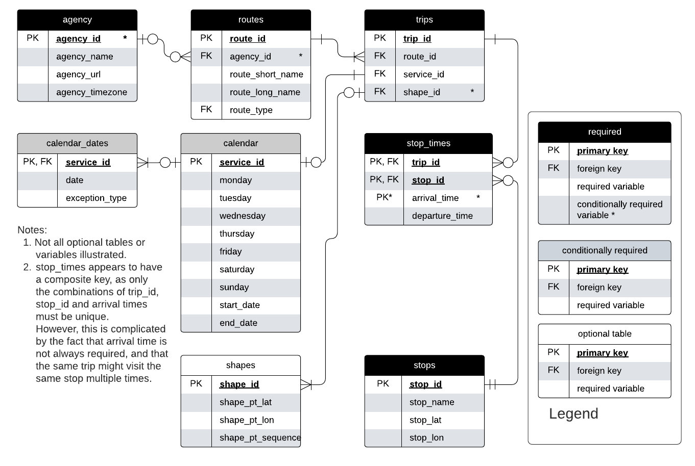
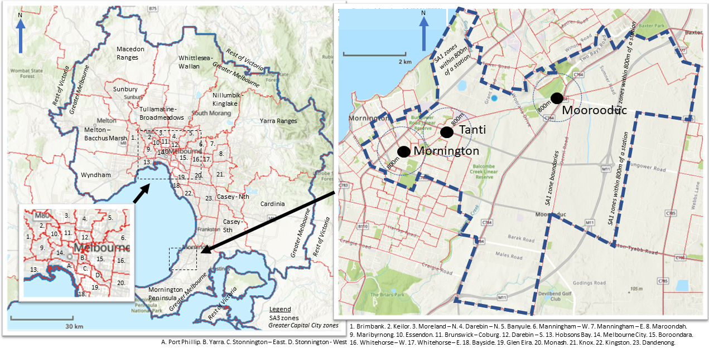
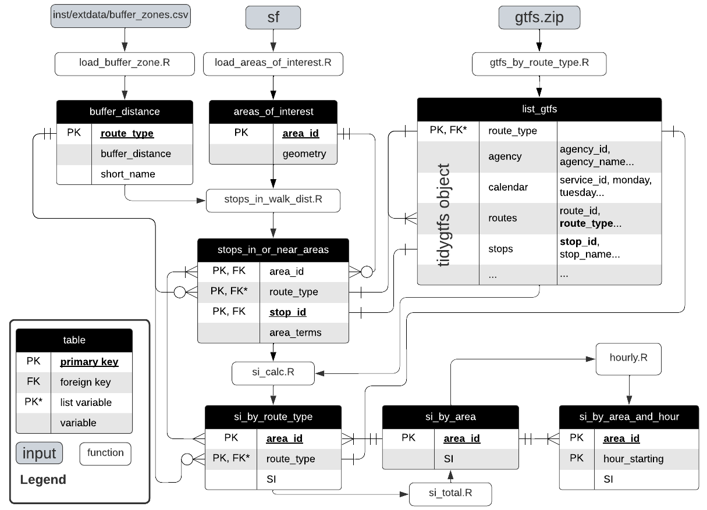

```{r setup, include=FALSE}
library(tidyverse)
library(tidytransit)
library(sp)
library(strayr)
library(ptinpoly)
library(magrittr)
library(ggplot2)
library(sf)
library(ASGS.foyer)
library(raster)
library(ggmap)
library(units)
library(janitor)
library(mapview)
library(ggstatsplot)
library(gtsummary)
library(moments)
library(scales)
library(gtfstools)
library(lubridate)
library(kableExtra)
library(knitr)
library(readxl)
library(dplyr)
library(devtools)
library(gtfssupplyindex)
library(readabs)
library(gglorenz)
library(DescTools)
library(RColorBrewer)
# invalidate cache when the tufte version changes
#knitr::opts_chunk$set(cache.extra = packageVersion('tufte'))

```


# Introduction
In *Quantifying spatial gaps in public transport supply based on social needs* 
@currie2010identifying introduced transit Supply Index (SI) 
and demonstrated how it could be used to assess gaps where
between public transport supply and social need. 
The SI provides a score based 
on the number of transit arrivals 
at stops within an area of interest,   
adjusted to account 
the walking distance catchment of each stop. 
Combining the SI scores 
with census data, 
@currie2010identifying mapped areas of 
Greater Melbourne in Victoria, Australia, 
where in 2006 there was a very high social need for transit 
but very low or zero supply.  

Unfortunately, 
this approach does not appear to have been widely used,
perhaps in part because at the time it was first published
calculating the transit Supply Index (SI) 
was not an easy task.  
Timetable data was not typically available 
in a standardized 
and machine-readable format, 
and the @currie2010identifying 
analysis was based on combining 
multiple operator databases and
service frequency data manually extracted from 
agency websites. 
While extending the analysis to other cities might have allowed the needs-gap analysis for Melbourne to have been compared to other cases, clearly this would have been a large task due to the need to obtain and process data for other places. 

Nowadays, 
the development of the General Transit Feed Specification (GTFS) 
means that timetable data is widely published in a standardized format, 
with more than 10,000 agencies 
providing feeds[@GTFS]. 
Historical timetable data is now also available (see [https://transitfeeds.com/]), meaning that longitudinal comparisons are more readily feasible. 
Many visualization, processing and analysis tools 
that accept GTFS data are now available.
A gap, however, is that 
there is not yet a tool to calculate SI scores directly from 
GTFS datasets. 
It is also unclear whether the gaps between social needs and transit supply identified in @currie2010identifying in Greater Melbourne have gotten better in the almost two decades since the original analysis, or whether the spatial patterns in Melbourne are representative of other cities. 

This provides the motivation 
for the research reported in this paper, 
in which a new R package (gtfssupplyindex) 
specifically developed to calculate SI scores 
is presented. 
The paper also reports results for Greater Melbourne in 2016 and 2021, matching the most recent censuses and allowing comparison to the 2006 result reported in  @currie2010identifying.  Comparisons are also made to other parts of Australia, so as to explore whether findings about Greater Melbourne can be confidently generalized to other places. 


The remainder of this paper is structured as follows:
the next section outlines the background to this research,
including the original formulation of the Transit Supply Index, 
and an explanation of the GTFS. 
Section 3 then describes the study methodology, 
followed by presentation of results in Section 4. 
Section 5 discusses the results, 
outlines directions for future research 
and provides a brief conclusion. 

# Background

## Transit metrics
Even a brief search reveals 
many metrics 
available for benchmarking transit services. 
Examples include: 
(1) those in the Transit Cooperative Research Program (TCRP) Report 88, 
which is an extensive guidebook 
on developing a performance-measurement system [@Ryus:2003aa]; 
(2) online databases provided by 
the Florida Transit Information System (FTIS) 
[@Florida-Transit-Information-System:2018aa] 
and @UITP:2015aa; 
(3) those used in the extensive annual benchmarking program
undertaken yearly by the Transport Strategy Centre in the United Kingdom, 
including over 100 transit providers around the world [@Imperial-College-London:2023aa]; and
(4) a recently developed methodology to calculate 'blank spots', 
beyond typical walking access distances 
to/from transit stops[@AlamriSultan2023GAoA]. 
  
  
The Fielding Triangle [@FieldingGordonJ1987Mpts] 
provides a framework 
for combining indicators of 
service inputs, 
outputs 
and consumption 
to describe cost efficiency, 
cost effectiveness and
service effectiveness. 
More broadly: 

- @Litman:2003ab 
and @Litman:2016aa 
discuss some of the traffic, 
mobility, 
accessibility, 
social equity, 
strategic planning 
and other rational decision-making-based
perspectives underling transport indicators;

- @Reynolds:2017ah extends 
these into models of how 
institutionalism, 
incrementalism 
and other public policy analysis concepts 
might apply to decision-making processes 
relating to transit prioritization; 

- @GuzmanLuisA.2017Aeit, 
developed a measure of accessibility 
in the context of policy development 
and social equity 
for Latin American Bus Rapid Transit (BRT) networks; and 

- @Creutzig2020streetspaceallocation
introduced street space allocation metrics 
based around 10 ethical principles 

However, 
many of these metrics appear difficult to calculate, 
complex to explain or understand, 
and likely not well suited to communication 
with those who are not planners or engineers, 
or other technical specialists. 
Where pre-calculated metrics 
are immediately available 
it may not be possible for practitioners, 
researchers 
or advocates 
to independently generate metrics 
for proposed system changes. 
Sometimes it is not even possible 
to know precisely how scores for the existing services levels are calculated. 
For example, 
Transit Scores 
for locations with a published GTFS feed 
are readily available on the @WalkScore:2023tg website, 
eliminating the need for any calculations. 
The meaning of these Transit Scores 
appears easy to explain, 
as the highest possible score of 100 
represents what might be experienced in the centre of New York. 
However, 
the Transit Score algorithm 
is patented 
and effectively a black box. 
Transit Scores cannot be calculated independently
or generated 
for proposed changes to networks. 

## GTFS
The General Transit Feed Specification (GTFS)
is an open, 
text-based format 
developed originally to allow transit 
to be included in the Google Maps navigation platform [@GTFS]. 
Figure \@ref(fig:GTFS_ERD) shows 
an Entity Relationship Diagram (ERD) 
of the GTFS data structure. 
This indicates how GTFS data 
is stored as a series of tables 
(agency, routes, trips etc.)
with primary and foreign keys (agency_id, route_id, trip_id etc.) 
providing links.


```{r GTFS_ERD, crop = TRUE, fig.cap = "GTFS entity relationship diagram. Source: adapted by author from Alamri et al (2023) and the GTFS Schedule Reference (16/11/2023 revision).", echo = FALSE, warning=FALSE, message=FALSE, cache=TRUE, out.width='100%'}


```

GTFS allows individual transit systems 
to be included in many online products and analysis, 
including the Transit Score metric itself. 
@Wong:2013aa provides another example of what can be done with GTFS data, 
having developed code to calculate of some of the TCQSM metrics 
and compared these
across 50 transit operators.

## The Transit Suppy Index
A generalized form of the Transit Supply Index (SI) , adapted from @currie2010identifying is: 

  $$SI_{area, time} = \sum{\frac{Area_{Bn}}{Area_{area}}*SL_{n, time}}$$

where:
(1) $SI_{area, time}$ is the Supply Index for the area of interest 
and a given period of time;
(2) $Area_{Bn}$ is the buffer area for each stop (n) within the area of interest. 
In @currie2010identifying this was based on 
a radius of 400 metres for bus and tram stops, 
and 800 metres for railway stations;
(3) $Area_{area}$ is the area of the area of interest; and
(4) $SL_{n,time}$ is the number of transit arrivals for each stop 
for a given time period.

The SI score does not incorporate 
service span, 
speed 
or other elements of a transit service. 
While these can be important 
to passenger experience, 
they might add complexity. 
Simplicity is also helped 
by the way 
that the SI is additive, 
in that $SI_{area, time}$ scores can be aggregated 
to calculate an overall score 
across multiple time periods 
or for a region encompassing multiple areas of interest. 

@currie2010identifying presented 


# Methodology
This study 
developed a package 
with tools for calculating the SI from GTFS data. 
The R programming language [@R-base] 
was adopted for code development. 
Package development setup and workflow 
as described by @wickham2023r 
was adopted. 
Various existing packages 
were relied upon including: 
the sf package [@R-sf] for geospatial analysis; 
the tidyverse [@tidyverse2019]; 
gtfstools [@R-gtfstools]; and 
tidytransit [@R-tidytransit]. 
Some code was adapted from 
examples, vignettes and other documentation 
in the tidytransit, gtfstools and other packages.

Two cases where used during the code development and testing, 
such that results might be generated for real GTFS data: 
the Mornington Peninsula Tourist Railway GTFS feed 
and the Public Transport Victoria (PTV) GTFS feed, 
both in Victoria, Australia. 
Both were selected primarily for convenience, 
given that the authors are familiar with 
the typical service patterns and geography.
The Mornington Peninsula Tourist Railway network, consisting of only three stations, also facilitated hand calculation of the SI as a cross-check of the results produced by the developed package. 

Figure \@ref(Melbourne_map)) shows the areas of interest 
relevant to the code development and testing, 
and selected railway stations. 
Statistical Area (SA) zones from the Australian Bureau of Statistics [@ABSmaps] 
Areas of interest included Greater Melbourne (main) 
and SA1 zones within 800 metres of the Mornington Penninsula railway (right). SA1 zones are the smallest geographical areas for which results are reported in the Australian census, while the main image of Figure \@ref(Melbourne_map)) shows the boundary of the Greater Melbourne Greater Capital City (GCC) zone and SA3 zone boundaries, which are generally similar to Local Government Area (LGA) boundaries (albeit with some LGAs split into two zones). 


```{r Melbourne_map, fig.cap = "Areas of interest",  echo = FALSE, warning=FALSE, message=FALSE, cache=FALSE, out.width='100%'}



```
## Mornington Penninsula Tourist Railway

The Morning Peninsula Tourist Railway 
is in the outer south-east of Melbourne, 
running on Sundays and Wednesdays 
between Mornington and Moorooduc, 
with an intermediate stop at Tanti Park 
(see https://transitfeeds.com/p/mornington-railway/806/latest/stops). 
A GTFS feed from 2018 
was selected for the purposes of tests and demonstrating the code and output.
Australian Bureau of Statistics (ABS) data was also used, 
sources via the strayr 
and absmapsdata packages [@r-strayr].
The Mornington Peninsular Statistical Area 3 (SA3) zone 
and the Statistical Area 1 (SA1) zones contained within it 
were adopted as the areas of interest. 

```{r mornington_calc, crop = TRUE, fig.cap = "SA1 zones (red), location of Mornington Tourist Railway Stations (black) and boundary of zones within 800m catchment (blue)", fig.width = 3, echo = FALSE, warning=FALSE, message=FALSE, cache=TRUE}
### ---------------- get abs data for Mornington Peninsula
#options(timeout = 1000)
#remotes::install_github("wfmackey/absmapsdata")

#get_mornington_sa1 <- function(){
#  mornington_sa12021 <- absmapsdata::sa12021 %>% filter(sa3_name_2021 == "Mornington Peninsula") %>% select(sa1_code_2021)
#  sf::st_write(mornington_sa12021, "inst/extdata/mornington_sa12021.geojson", append=FALSE)
#  return(mornington_sa12021)
#}
#get_mornington_sa3 <- function(){
#  mornington_sa32021 <- absmapsdata::sa32021 %>% filter(sa3_name_2021 == "Mornington Peninsula") %>% select(sa3_code_2021)
#  sf::st_write(mornington_sa32021, "inst/extdata/mornington_sa32021.geojson", append=FALSE)
#  return(mornington_sa32021)
#}

### ---------------- load SA3 abs maps data for just mornington peninsula
areas_of_interest <- load_areas_of_interest(areas_of_interest = absmapsdata::sa12021 %>% filter(sa3_name_2021 == "Mornington Peninsula") %>% select(sa1_code_2021), 
  area_id_field = "sa1_code_2021")

# map the areas_of_interest
map <- areas_of_interest %>% 
  ggplot() +
  geom_sf(aes(geometry = geometry))
#map
#set the EPSG to transform from lat/lon to metres
EPSG_for_transform = 28355

#load the revised mornington GTFS data
list_gtfs = gtfssupplyindex:::gtfs_by_route_type(system.file(
  "extdata/mornington180109",
  "gtfs.zip", 
  package = "gtfssupplyindex", 
  mustWork = TRUE))
stops_as_sf_mornington <-  list_gtfs[[1]]$stops %>% 
  tidytransit::stops_as_sf()

#map the stops on the ABS data
#map + 
#  geom_sf(data = stops_as_sf_mornington, aes(geometry = geometry))


stops_in_or_near_areas <- gtfssupplyindex:::stops_in_walk_dist(
  list_gtfs = list_gtfs, 
  areas_of_interest = areas_of_interest,
  EPSG_for_transform = 28355
)

```

## Public Transport Victoria (PTV)
The Victorian GTFS feed, 
published by Public Transport Victoria (PTV) and 
with historical feeds sourced via @transitfeeds_victoria:2023aa, was used for analysis of Victoria. SI scores were obtained for the weeks starting on the day of the census in 2016 and 2021, which were on Tuesday 9th and 10th of August respectively. 

```{r fix_ptv_data_Victoria_230804, eval = FALSE, echo = FALSE}


ptv_230804 <- tidytransit::read_gtfs("data/ptv_230804/gtfs.zip")
# This results in "Warning: Duplicated ids found in: stops The returned object is not a tidygtfs object, you can use as_tidygtfs() after fixing the issue."

#So, remove the duplicated stops 
#identify duplicate stops
ptv_230804_duplicated_stops <- tabyl(ptv_230804$stops$stop_id) %>% filter (n>1)
names(ptv_230804_duplicated_stops) <- c("stop_id", "n", "percent")
ptv_230804_duplicated_stops <- left_join(ptv_230804_duplicated_stops, ptv_230804$stops)

##discard duplicates
ptv_230804$stops <- ptv_230804$stops[!duplicated(ptv_230804$stops$stop_id),]

## Write gtfs back to file
ptv_230804 <- as_tidygtfs(ptv_230804)
tidytransit::write_gtfs(ptv_230804, "data/ptv_230804/gtfs_duplicate_stops_removed.zip")


```

```{r run_for_all_modes_all_of_Victoria_230808, eval = FALSE, echo = FALSE}


## convert to list of tidygtfs objects
ptv_230804_list_gtfs <- gtfssupplyindex::gtfs_by_route_type("data/ptv_230804/gtfs_duplicate_stops_removed.zip")

list_gtfs = ptv_230804_list_gtfs

areas_of_interest <- load_areas_of_interest(absmapsdata::sa12021 %>% 
                                              filter(state_name_2021 == "Victoria") %>%
                                              select(sa1_code_2021),  
                                            area_id_field = "sa1_code_2021")

buffer_distance <- gtfssupplyindex:::load_buffer_zones()

stops_in_or_near_areas <- gtfssupplyindex:::stops_in_walk_dist(
  list_gtfs = list_gtfs, 
  areas_of_interest = areas_of_interest,
  EPSG_for_transform = 28355,
  verbose = FALSE
)


si_by_area_and_hour_230808 <- hourly(
  list_gtfs = list_gtfs, 
  stops_in_or_near_areas = stops_in_or_near_areas, 
  date_ymd = "2023-08-08",
  verbose = TRUE)

write.csv(si_by_area_and_hour_230808, "results/Greater_Melbourne/si_by_SA12021area_and_hour_230808")

si_by_area_and_hour_230808_tram <- hourly(
  list_gtfs = list_gtfs[1], 
  stops_in_or_near_areas = stops_in_or_near_areas[1], 
  date_ymd = "2023-08-08",
  verbose = TRUE)

write.csv(si_by_area_and_hour_230808_tram, "results/Greater_Melbourne/si_by_SA12021area_and_hour_230808_tram")

si_by_area_and_hour_230808_rail <- hourly(
  list_gtfs = list_gtfs[2], 
  stops_in_or_near_areas = stops_in_or_near_areas[2], 
  date_ymd = "2023-08-08",
  verbose = TRUE)

write.csv(si_by_area_and_hour_230808_rail, "results/Greater_Melbourne/si_by_SA12021area_and_hour_230808_rail")

si_by_area_and_hour_230808_bus <- hourly(
  list_gtfs = list_gtfs[3], 
  stops_in_or_near_areas = stops_in_or_near_areas[3], 
  date_ymd = "2023-08-08",
  verbose = TRUE)

write.csv(si_by_area_and_hour_230808_bus, "results/Greater_Melbourne/si_by_SA12021area_and_hour_230808_bus")

```


```{r fix_ptv_data_Victoria_220804, eval = FALSE, echo = FALSE}


ptv_220804 <- tidytransit::read_gtfs("data/ptv_220804/gtfs.zip")
# This results in "Warning: Duplicated ids found in: stops The returned object is not a tidygtfs object, you can use as_tidygtfs() after fixing the issue."

#So, remove the duplicated stops 
#identify duplicate stops
ptv_220804_duplicated_stops <- tabyl(ptv_220804$stops$stop_id) %>% filter (n>1)
names(ptv_220804_duplicated_stops) <- c("stop_id", "n", "percent")
ptv_220804_duplicated_stops <- left_join(ptv_220804_duplicated_stops, ptv_220804$stops)

##discard duplicates
ptv_220804$stops <- ptv_220804$stops[!duplicated(ptv_220804$stops$stop_id),]

## Write gtfs back to file
ptv_220804 <- as_tidygtfs(ptv_220804)
tidytransit::write_gtfs(ptv_220804, "data/ptv_220804/gtfs_duplicate_stops_removed.zip")

```

```{r run_for_all_modes_Victoria_200809, eval = FALSE, echo = FALSE}

## convert to list of tidygtfs objects
ptv_220804_list_gtfs <- gtfssupplyindex::gtfs_by_route_type("data/ptv_220804/gtfs_duplicate_stops_removed.zip")

list_gtfs = ptv_220804_list_gtfs

stops_in_or_near_areas <- gtfssupplyindex:::stops_in_walk_dist(
  list_gtfs = list_gtfs, 
  areas_of_interest = areas_of_interest,
  EPSG_for_transform = 28355,
  verbose = FALSE
)

si_by_area_and_hour_200809 <- hourly(
  list_gtfs = list_gtfs, 
  stops_in_or_near_areas = stops_in_or_near_areas, 
  date_ymd = "2022-08-09",
  verbose = TRUE)

write.csv(si_by_area_and_hour_200809, "results/Greater_Melbourne/si_by_SA12021area_and_hour_200809")

si_by_area_and_hour_200809_tram <- hourly(
  list_gtfs = list_gtfs[1], 
  stops_in_or_near_areas = stops_in_or_near_areas[1], 
  date_ymd = "2022-08-09",
  verbose = TRUE)

write.csv(si_by_area_and_hour_200809_tram, "results/Greater_Melbourne/si_by_SA12021area_and_hour_200809_tram")

si_by_area_and_hour_200809_rail <- hourly(
  list_gtfs = list_gtfs[2], 
  stops_in_or_near_areas = stops_in_or_near_areas[2], 
  date_ymd = "2022-08-09",
  verbose = TRUE)

write.csv(si_by_area_and_hour_200809_rail, "results/Greater_Melbourne/si_by_SA12021area_and_hour_200809_rail")

si_by_area_and_hour_200809_bus <- hourly(
  list_gtfs = list_gtfs[3], 
  stops_in_or_near_areas = stops_in_or_near_areas[3], 
  date_ymd = "2022-08-09",
  verbose = TRUE)

write.csv(si_by_area_and_hour_200809_bus, "results/Greater_Melbourne/si_by_SA12021area_and_hour_200809_bus")

```

```{r fix_ptv_data_Victoria_210805, eval = FALSE, echo = FALSE}


ptv_210805 <- tidytransit::read_gtfs("data/ptv_210805/gtfs.zip")
# This results in "Warning: Duplicated ids found in: stops The returned object is not a tidygtfs object, you can use as_tidygtfs() after fixing the issue."

#So, remove the duplicated stops 
#identify duplicate stops
ptv_210805_duplicated_stops <- tabyl(ptv_210805$stops$stop_id) %>% filter (n>1)
names(ptv_210805_duplicated_stops) <- c("stop_id", "n", "percent")
ptv_210805_duplicated_stops <- left_join(ptv_210805_duplicated_stops, ptv_210805$stops)

##discard duplicates
ptv_210805$stops <- ptv_210805$stops[!duplicated(ptv_210805$stops$stop_id),]

## Write gtfs back to file
ptv_210805 <- as_tidygtfs(ptv_210805)
tidytransit::write_gtfs(ptv_210805, "data/ptv_210805/gtfs_duplicate_stops_removed.zip")

## convert to list of tidygtfs objects
ptv_210805_list_gtfs <- gtfssupplyindex::gtfs_by_route_type("data/ptv_210805/gtfs_duplicate_stops_removed.zip")


```

```{r run_for_all_modes_Victoria_210810, eval = FALSE, echo = FALSE}
list_gtfs = ptv_210805_list_gtfs

stops_in_or_near_areas <- gtfssupplyindex:::stops_in_walk_dist(
  list_gtfs = list_gtfs, 
  areas_of_interest = areas_of_interest,
  EPSG_for_transform = 28355,
  verbose = FALSE
)


si_by_area_and_hour_210810 <- hourly(
  list_gtfs = list_gtfs, 
  stops_in_or_near_areas = stops_in_or_near_areas, 
  date_ymd = "2021-08-10",
  verbose = TRUE)

write.csv(si_by_area_and_hour_210810, "results/Greater_Melbourne/si_by_SA12021area_and_hour_210810")

si_by_area_and_hour_210810_tram <- hourly(
  list_gtfs = list_gtfs[1], 
  stops_in_or_near_areas = stops_in_or_near_areas[1], 
  date_ymd = "2021-08-10",
  verbose = TRUE)

write.csv(si_by_area_and_hour_210810_tram, "results/Greater_Melbourne/si_by_SA12021area_and_hour_210810_tram")

si_by_area_and_hour_210810_rail <- hourly(
  list_gtfs = list_gtfs[2], 
  stops_in_or_near_areas = stops_in_or_near_areas[2], 
  date_ymd = "2021-08-10",
  verbose = TRUE)

write.csv(si_by_area_and_hour_210810_rail, "results/Greater_Melbourne/si_by_SA12021area_and_hour_210810_rail")

si_by_area_and_hour_210810_bus <- hourly(
  list_gtfs = list_gtfs[3], 
  stops_in_or_near_areas = stops_in_or_near_areas[3], 
  date_ymd = "2021-08-10",
  verbose = TRUE)

write.csv(si_by_area_and_hour_210810_bus, "results/Greater_Melbourne/si_by_SA12021area_and_hour_210810_bus")

```

```{r fix_ptv_data_Victoria_200729, eval = FALSE, echo = FALSE}


ptv_200729 <- tidytransit::read_gtfs("data/ptv_200729/gtfs.zip")
# This results in "Warning: Duplicated ids found in: stops The returned object is not a tidygtfs object, you can use as_tidygtfs() after fixing the issue."

#So, remove the duplicated stops 
#identify duplicate stops
ptv_200729_duplicated_stops <- tabyl(ptv_200729$stops$stop_id) %>% filter (n>1)
names(ptv_200729_duplicated_stops) <- c("stop_id", "n", "percent")
ptv_200729_duplicated_stops <- left_join(ptv_200729_duplicated_stops, ptv_200729$stops)

##discard duplicates
ptv_200729$stops <- ptv_200729$stops[!duplicated(ptv_200729$stops$stop_id),]

## Write gtfs back to file
ptv_200729 <- as_tidygtfs(ptv_200729)
tidytransit::write_gtfs(ptv_200729, "data/ptv_200729/gtfs_duplicate_stops_removed.zip")

## convert to list of tidygtfs objects
ptv_200729_list_gtfs <- gtfssupplyindex::gtfs_by_route_type("data/ptv_200729/gtfs_duplicate_stops_removed.zip")

```

```{r run_for_all_modes_Victoria_200811, eval = FALSE, echo = FALSE}

list_gtfs = ptv_200729_list_gtfs

stops_in_or_near_areas <- gtfssupplyindex:::stops_in_walk_dist(
  list_gtfs = list_gtfs, 
  areas_of_interest = areas_of_interest,
  EPSG_for_transform = 28355,
  verbose = FALSE
)

si_by_area_and_hour_200811 <- hourly(
  list_gtfs = list_gtfs, 
  stops_in_or_near_areas = stops_in_or_near_areas, 
  date_ymd = "2020-08-11",
  verbose = TRUE)

write.csv(si_by_area_and_hour_200811, "results/Greater_Melbourne/si_by_SA12021area_and_hour_200811")

si_by_area_and_hour_200811_tram <- hourly(
  list_gtfs = list_gtfs[1], 
  stops_in_or_near_areas = stops_in_or_near_areas[1], 
  date_ymd = "2020-08-11",
  verbose = TRUE)

write.csv(si_by_area_and_hour_200811_tram, "results/Greater_Melbourne/si_by_SA12021area_and_hour_200811_tram")

si_by_area_and_hour_200811_rail <- hourly(
  list_gtfs = list_gtfs[2], 
  stops_in_or_near_areas = stops_in_or_near_areas[2], 
  date_ymd = "2020-08-11",
  verbose = TRUE)

write.csv(si_by_area_and_hour_200811_rail, "results/Greater_Melbourne/si_by_SA12021area_and_hour_200811_rail")

si_by_area_and_hour_200811_bus <- hourly(
  list_gtfs = list_gtfs[3], 
  stops_in_or_near_areas = stops_in_or_near_areas[3], 
  date_ymd = "2020-08-11",
  verbose = TRUE)

write.csv(si_by_area_and_hour_200811_bus, "results/Greater_Melbourne/si_by_SA12021area_and_hour_200811_bus")

```

```{r fix_ptv_data_Victoria_190802, eval = FALSE, echo = FALSE}
ptv_190802 <- tidytransit::read_gtfs("data/ptv_190802/gtfs.zip")
# This results in "Warning: Duplicated ids found in: stops The returned object is not a tidygtfs object, you can use as_tidygtfs() after fixing the issue."

#So, remove the duplicated stops 
#identify duplicate stops
ptv_190802_duplicated_stops <- tabyl(ptv_190802$stops$stop_id) %>% filter (n>1)
names(ptv_190802_duplicated_stops) <- c("stop_id", "n", "percent")
ptv_190802_duplicated_stops <- left_join(ptv_190802_duplicated_stops, ptv_190802$stops)

##discard duplicates
ptv_190802$stops <- ptv_190802$stops[!duplicated(ptv_190802$stops$stop_id),]

## Write gtfs back to file
ptv_190802 <- as_tidygtfs(ptv_190802)
tidytransit::write_gtfs(ptv_190802, "data/ptv_190802/gtfs_duplicate_stops_removed.zip")

## convert to list of tidygtfs objects
ptv_190802_list_gtfs <- gtfssupplyindex::gtfs_by_route_type("data/ptv_190802/gtfs_duplicate_stops_removed.zip")


```

```{r run_for_all_modes_Victoria_190813, eval = FALSE, echo = FALSE}

list_gtfs = ptv_190802_list_gtfs

stops_in_or_near_areas <- gtfssupplyindex:::stops_in_walk_dist(
  list_gtfs = list_gtfs, 
  areas_of_interest = areas_of_interest,
  EPSG_for_transform = 28355,
  verbose = FALSE
)

si_by_area_and_hour_190813 <- hourly(
  list_gtfs = list_gtfs, 
  stops_in_or_near_areas = stops_in_or_near_areas, 
  date_ymd = "2019-08-13",
  verbose = TRUE)

write.csv(si_by_area_and_hour_190813, "results/Greater_Melbourne/si_by_SA12021area_and_hour_190813")

si_by_area_and_hour_190813_tram <- hourly(
  list_gtfs = list_gtfs[1], 
  stops_in_or_near_areas = stops_in_or_near_areas[1], 
  date_ymd = "2019-08-13",
  verbose = TRUE)

write.csv(si_by_area_and_hour_190813_tram, "results/Greater_Melbourne/si_by_SA12021area_and_hour_190813_tram")

si_by_area_and_hour_190813_rail <- hourly(
  list_gtfs = list_gtfs[2], 
  stops_in_or_near_areas = stops_in_or_near_areas[2], 
  date_ymd = "2019-08-13",
  verbose = TRUE)

write.csv(si_by_area_and_hour_190813_rail, "results/Greater_Melbourne/si_by_SA12021area_and_hour_190813_rail")

si_by_area_and_hour_190813_bus <- hourly(
  list_gtfs = list_gtfs[3], 
  stops_in_or_near_areas = stops_in_or_near_areas[3], 
  date_ymd = "2019-08-13",
  verbose = TRUE)

write.csv(si_by_area_and_hour_190813_bus, "results/Greater_Melbourne/si_by_SA12021area_and_hour_190813_bus")

```

```{r fix_ptv_data_Victoria_180803, eval = FALSE, echo = FALSE}


ptv_180803 <- tidytransit::read_gtfs("data/ptv_180803/gtfs.zip")
# This results in "Warning: Duplicated ids found in: stops The returned object is not a tidygtfs object, you can use as_tidygtfs() after fixing the issue."

#So, remove the duplicated stops 
#identify duplicate stops
ptv_180803_duplicated_stops <- tabyl(ptv_180803$stops$stop_id) %>% filter (n>1)
names(ptv_180803_duplicated_stops) <- c("stop_id", "n", "percent")
ptv_180803_duplicated_stops <- left_join(ptv_180803_duplicated_stops, ptv_180803$stops)

##discard duplicates
ptv_180803$stops <- ptv_180803$stops[!duplicated(ptv_180803$stops$stop_id),]

## Write gtfs back to file
ptv_180803 <- as_tidygtfs(ptv_180803)
tidytransit::write_gtfs(ptv_180803, "data/ptv_180803/gtfs_duplicate_stops_removed.zip")

## convert to list of tidygtfs objects
ptv_180803_list_gtfs <- gtfssupplyindex::gtfs_by_route_type("data/ptv_180803/gtfs_duplicate_stops_removed.zip")


```


```{r run_for_all_modes_Victoria_180814, eval = FALSE, echo = FALSE}


list_gtfs = ptv_180803_list_gtfs

stops_in_or_near_areas <- gtfssupplyindex:::stops_in_walk_dist(
  list_gtfs = list_gtfs, 
  areas_of_interest = areas_of_interest,
  EPSG_for_transform = 28355,
  verbose = FALSE
)
si_by_area_and_hour_180814 <- hourly(
  list_gtfs = list_gtfs, 
  stops_in_or_near_areas = stops_in_or_near_areas, 
  date_ymd = "2018-08-14",
  verbose = TRUE)

write.csv(si_by_area_and_hour_180814, "results/Greater_Melbourne/si_by_SA12021area_and_hour_180814")

si_by_area_and_hour_180814_tram <- hourly(
  list_gtfs = list_gtfs[1], 
  stops_in_or_near_areas = stops_in_or_near_areas[1], 
  date_ymd = "2018-08-14",
  verbose = TRUE)

write.csv(si_by_area_and_hour_180814_tram, "results/Greater_Melbourne/si_by_SA12021area_and_hour_180814_tram")

si_by_area_and_hour_180814_rail <- hourly(
  list_gtfs = list_gtfs[2], 
  stops_in_or_near_areas = stops_in_or_near_areas[2], 
  date_ymd = "2018-08-14",
  verbose = TRUE)

write.csv(si_by_area_and_hour_180814_rail, "results/Greater_Melbourne/si_by_SA12021area_and_hour_180814_rail")

si_by_area_and_hour_180814_bus <- hourly(
  list_gtfs = list_gtfs[3], 
  stops_in_or_near_areas = stops_in_or_near_areas[3], 
  date_ymd = "2018-08-14",
  verbose = TRUE)

write.csv(si_by_area_and_hour_180814_bus, "results/Greater_Melbourne/si_by_SA12021area_and_hour_180814_bus")

```

```{r fix_ptv_data_Victoria_170804, eval = FALSE, echo = FALSE}


ptv_170804 <- tidytransit::read_gtfs("data/ptv_170804/gtfs.zip")
# This results in "Warning: Duplicated ids found in: stops The returned object is not a tidygtfs object, you can use as_tidygtfs() after fixing the issue."

#So, remove the duplicated stops 
#identify duplicate stops
ptv_170804_duplicated_stops <- tabyl(ptv_170804$stops$stop_id) %>% filter (n>1)
names(ptv_170804_duplicated_stops) <- c("stop_id", "n", "percent")
ptv_170804_duplicated_stops <- left_join(ptv_170804_duplicated_stops, ptv_170804$stops)

##discard duplicates
ptv_170804$stops <- ptv_170804$stops[!duplicated(ptv_170804$stops$stop_id),]

## Write gtfs back to file
ptv_170804 <- as_tidygtfs(ptv_170804)
tidytransit::write_gtfs(ptv_170804, "data/ptv_170804/gtfs_duplicate_stops_removed.zip")

## convert to list of tidygtfs objects
ptv_170804_list_gtfs <- gtfssupplyindex::gtfs_by_route_type("data/ptv_170804/gtfs_duplicate_stops_removed.zip")

```


```{r run_for_all_modes_Victoria_170808, eval = FALSE, echo = FALSE}


list_gtfs = ptv_170804_list_gtfs

stops_in_or_near_areas <- gtfssupplyindex:::stops_in_walk_dist(
  list_gtfs = list_gtfs, 
  areas_of_interest = areas_of_interest,
  EPSG_for_transform = 28355,
  verbose = FALSE
)

si_by_area_and_hour_170808 <- hourly(
  list_gtfs = list_gtfs, 
  stops_in_or_near_areas = stops_in_or_near_areas, 
  date_ymd = "2017-08-08",
  verbose = TRUE)

write.csv(si_by_area_and_hour_170808, "results/Greater_Melbourne/si_by_SA12021area_and_hour_170808")

si_by_area_and_hour_170808_tram <- hourly(
  list_gtfs = list_gtfs[1], 
  stops_in_or_near_areas = stops_in_or_near_areas[1], 
  date_ymd = "2017-08-08",
  verbose = TRUE)

write.csv(si_by_area_and_hour_170808_tram, "results/Greater_Melbourne/si_by_SA12021area_and_hour_170808_tram")

si_by_area_and_hour_170808_rail <- hourly(
  list_gtfs = list_gtfs[2], 
  stops_in_or_near_areas = stops_in_or_near_areas[2], 
  date_ymd = "2017-08-08",
  verbose = TRUE)

write.csv(si_by_area_and_hour_170808_rail, "results/Greater_Melbourne/si_by_SA12021area_and_hour_170808_rail")

si_by_area_and_hour_170808_bus <- hourly(
  list_gtfs = list_gtfs[3], 
  stops_in_or_near_areas = stops_in_or_near_areas[3], 
  date_ymd = "2017-08-08",
  verbose = TRUE)

write.csv(si_by_area_and_hour_170808_bus, "results/Greater_Melbourne/si_by_SA12021area_and_hour_170808_bus")

```

```{r fix_ptv_data_Victoria_160804, eval = FALSE, echo = FALSE}
 

ptv_160804 <- tidytransit::read_gtfs("data/ptv_160804/gtfs.zip")
# This results in "Warning: Duplicated ids found in: stops The returned object is not a tidygtfs object, you can use as_tidygtfs() after fixing the issue."

#So, remove the duplicated stops 
#identify duplicate stops
ptv_160804_duplicated_stops <- tabyl(ptv_160804$stops$stop_id) %>% filter (n>1)
names(ptv_160804_duplicated_stops) <- c("stop_id", "n", "percent")
ptv_160804_duplicated_stops <- left_join(ptv_160804_duplicated_stops, ptv_160804$stops)

##discard duplicates
ptv_160804$stops <- ptv_160804$stops[!duplicated(ptv_160804$stops$stop_id),]

## Write gtfs back to file
ptv_160804 <- as_tidygtfs(ptv_160804)
tidytransit::write_gtfs(ptv_160804, "data/ptv_160804/gtfs_duplicate_stops_removed.zip")

## convert to list of tidygtfs objects
ptv_160804_list_gtfs <- gtfssupplyindex::gtfs_by_route_type("data/ptv_160804/gtfs_duplicate_stops_removed.zip")

```

```{r run_for_all_modes_Victoria_160809, eval = FALSE, echo = FALSE}
list_gtfs = ptv_160804_list_gtfs

stops_in_or_near_areas <- gtfssupplyindex:::stops_in_walk_dist(
  list_gtfs = list_gtfs, 
  areas_of_interest = areas_of_interest,
  EPSG_for_transform = 28355,
  verbose = FALSE
)


si_by_area_and_hour_160809 <- hourly(
  list_gtfs = list_gtfs, 
  stops_in_or_near_areas = stops_in_or_near_areas, 
  date_ymd = "2016-08-09",
  verbose = TRUE)

write.csv(si_by_area_and_hour_160809, "results/Greater_Melbourne/si_by_SA12021area_and_hour_160809")

si_by_area_and_hour_160809_tram <- hourly(
  list_gtfs = list_gtfs[1], 
  stops_in_or_near_areas = stops_in_or_near_areas[1], 
  date_ymd = "2016-08-09",
  verbose = TRUE)

write.csv(si_by_area_and_hour_160809_tram, "results/Greater_Melbourne/si_by_SA12021area_and_hour_160809_tram")

si_by_area_and_hour_160809_rail <- hourly(
  list_gtfs = list_gtfs[2], 
  stops_in_or_near_areas = stops_in_or_near_areas[2], 
  date_ymd = "2016-08-09",
  verbose = TRUE)

write.csv(si_by_area_and_hour_160809_rail, "results/Greater_Melbourne/si_by_SA12021area_and_hour_160809_rail")

si_by_area_and_hour_160809_bus <- hourly(
  list_gtfs = list_gtfs[3], 
  stops_in_or_near_areas = stops_in_or_near_areas[3], 
  date_ymd = "2016-08-09",
  verbose = TRUE)

write.csv(si_by_area_and_hour_160809_bus, "results/Greater_Melbourne/si_by_SA12021area_and_hour_160809_bus")

```

```{r fix_ptv_data_Victoria_150729, eval = FALSE, echo = FALSE}


ptv_150729 <- tidytransit::read_gtfs("data/ptv_150729/gtfs.zip")
# This results in "Warning: Duplicated ids found in: stops The returned object is not a tidygtfs object, you can use as_tidygtfs() after fixing the issue."

#So, remove the duplicated stops 
#identify duplicate stops
ptv_150729_duplicated_stops <- tabyl(ptv_150729$stops$stop_id) %>% filter (n>1)
names(ptv_150729_duplicated_stops) <- c("stop_id", "n", "percent")
ptv_150729_duplicated_stops <- left_join(ptv_150729_duplicated_stops, ptv_150729$stops)

##discard duplicates
ptv_150729$stops <- ptv_150729$stops[!duplicated(ptv_150729$stops$stop_id),]

## Write gtfs back to file
ptv_150729 <- as_tidygtfs(ptv_150729)
tidytransit::write_gtfs(ptv_150729, "data/ptv_150729/gtfs_duplicate_stops_removed.zip")

## convert to list of tidygtfs objects
ptv_150729_list_gtfs <- gtfssupplyindex::gtfs_by_route_type("data/ptv_150729/gtfs_duplicate_stops_removed.zip")


```

```{r run_for_all_modes_Victoria_150811, eval = FALSE, echo = FALSE}

list_gtfs = ptv_150729_list_gtfs

stops_in_or_near_areas <- gtfssupplyindex:::stops_in_walk_dist(
  list_gtfs = list_gtfs, 
  areas_of_interest = areas_of_interest,
  EPSG_for_transform = 28355,
  verbose = FALSE
)

si_by_area_and_hour_150811 <- hourly(
  list_gtfs = list_gtfs, 
  stops_in_or_near_areas = stops_in_or_near_areas, 
  date_ymd = "2015-08-11",
  verbose = TRUE)

write.csv(si_by_area_and_hour_150811, "results/Greater_Melbourne/si_by_SA12021area_and_hour_150811")

si_by_area_and_hour_150811_tram <- hourly(
  list_gtfs = list_gtfs[1], 
  stops_in_or_near_areas = stops_in_or_near_areas[1], 
  date_ymd = "2015-08-11",
  verbose = TRUE)

write.csv(si_by_area_and_hour_150811_tram, "results/Greater_Melbourne/si_by_SA12021area_and_hour_150811_tram")

si_by_area_and_hour_150811_rail <- hourly(
  list_gtfs = list_gtfs[2], 
  stops_in_or_near_areas = stops_in_or_near_areas[2], 
  date_ymd = "2015-08-11",
  verbose = TRUE)

write.csv(si_by_area_and_hour_150811_rail, "results/Greater_Melbourne/si_by_SA12021area_and_hour_150811_rail")

si_by_area_and_hour_150811_bus <- hourly(
  list_gtfs = list_gtfs[3], 
  stops_in_or_near_areas = stops_in_or_near_areas[3], 
  date_ymd = "2015-08-11",
  verbose = TRUE)

write.csv(si_by_area_and_hour_150811_bus, "results/Greater_Melbourne/si_by_SA12021area_and_hour_150811_bus")

```


# Results
## Code structure and functionality


Developed code is available and documented on github [@gtfssupplyindex_github]. 
The structure of the package, 
functions developed, 
and data tables are shown in Figure \@ref(fig:SI_ERD). 
This shows  
how the package takes input from three files: 
a gtfs feed (gtfs.zip); 
a sf object describing the geometry of the areas 
for which the SI is to be calculated; and 
a csv file (included in the package) 
defining the buffer zone distances
for each route type. The ultimate output 
is a si_by_area_and_hour table (bottom-right), 
which reports the SI score for each hour of the day 
across dates specified by the user. 


```{r SI_ERD, crop = TRUE, fig.cap = "Entity Relationship Diagram (ERD) showing the data structure and functions related to the gtfssupplyindex package", echo = FALSE, warning=FALSE, message=FALSE, cache=TRUE, out.width='100%'}


```

Various functions and their output 
are explained in the following, 
using the Mornington Peninsula GTFS for December 30th, 2018, 
and SA1 zone boundaries as a worked example. 
Individual steps are:

(1) loading the gtfs.zip file: 
the gtfs_by_route_type function loads the gtfs data 
and splits it into a list (by route_type) of tidygtfs objects, 
using the filter_by_route_type function from the gtfstools package [@filter_GTFS_by_mode].

```{r load_mornington_GTFS data, echo = FALSE, warning=FALSE, message=FALSE, cache=TRUE, out.width='100%'}
#load the revised mornington GTFS data
list_gtfs = gtfssupplyindex:::gtfs_by_route_type(system.file(
  "extdata/mornington180109",
  "gtfs.zip", 
  package = "gtfssupplyindex", 
  mustWork = TRUE))

```

(2) loading geometry information about the areas of interest: 
geographical data about the areas of interest are loaded 
by the load_areas_of_interest.R function into an sf object, 
using the sf package [@R-sf]. 
The resultant areas_of_interest table 
contains each area_id and its associated geometry. 
Data about buffer zones, 
specifically the walking distance threshold assigned to each route_type (mode)
is then loaded, 
again through a function (load_buffer_zone.R).

```{r load_ABS data, echo = FALSE, error = FALSE, include = FALSE, results='hide', warning=FALSE, message=FALSE, cache=TRUE, out.width='100%'}

suppressWarnings({
areas_of_interest <- load_areas_of_interest(areas_of_interest = sf::st_read(system.file(
  "extdata",
  "mornington_sa12021.geojson", 
  package = "gtfssupplyindex", 
  mustWork = TRUE)), 
  area_id_field = "sa1_code_2021")
})

#head(areas_of_interest) %>% kable(caption = "First 6 entries in areas of interest table")
```

```{r load_buffer_distance_data, echo = FALSE, warning=FALSE, message=FALSE, cache=TRUE, out.width='100%'}
buffer_distance <- gtfssupplyindex:::load_buffer_zones()
#head(buffer_distance) %>% kable(caption = "First six entries in buffer distance definitions")
```

(3) calculating which stops are within the catchment walking distance of which areas: 
using the stops_in_walk_dist function. Figure \@ref(fig:calculate_stop_in_or_near_areas_verbose)) shows how this function identified
SA1 areas within the 800 metre catchment of the three Mornington stations.


```{r calculate_stop_in_or_near_areas_verbose, echo = FALSE, warning=FALSE, message=FALSE, cache=TRUE, out.width='100%', fig.keep = "first", crop = TRUE, fig.cap= "Step 3, stop catchments for the Mornington Penninsula Tourist Railway, showing intersections with SA1 zones"}
stops_in_or_near_areas <- gtfssupplyindex:::stops_in_walk_dist(
  list_gtfs = list_gtfs, 
  areas_of_interest = areas_of_interest,
  EPSG_for_transform = 28355, 
  verbose = TRUE
)

```

(4) Calculating SI scores for a given time period: 
The si_calc.R function calculates the number of arrivals in a given time period, 
using code adapted from an article included in the tidytransit package
[@tidytransit_departure_timetable],
and combines this with the calculated area components. 
The si_total.R and hourly.R functions provided aggregation, 
giving the results mapped in Figure \@ref(fig:SI_mornington_20181230_output). 

```{r arrivals_mornington_20181230, echo = FALSE, eval=FALSE, warning=FALSE, message=FALSE, cache=TRUE}

stop_ids <- list_gtfs[[1]]$stops %>%
 dplyr::select(stop_id)

arrivals_by_stop_id <- gtfssupplyindex::arrivals(
 gtfs = list_gtfs[[1]],
 stop_ids = stop_ids,
 date_ymd = "2018-12-30",
 start_hms = lubridate::hms("10:30:00"),
 end_hms = lubridate::hms("16:00:00")
)

#arrivals_by_stop_id %>% kable(caption = "Arrivals at each stop for Sunday December 30th 2018, Mornington Peninsula tourist railway.")

```
<!--- This matches the number of trips shown in the Mornington Railway GTFS feed, being 4 in each direction^[https://transitfeeds.com/p/mornington-railway/806/latest/stop/1388695887/20181230]. 

```{r SI_Mornington_arrivals, fig.margin = FALSE, crop = TRUE, fig.cap = "Arrivals at Mornington Station (stop id 1388695887) for 30/12/2018", echo = FALSE, warning=FALSE, message=FALSE, cache=TRUE, out.width='100%'}
knitr::include_graphics("graphics/1388695887_inbound.png")

```

All the inputs to calculate the si are now available. Hence, the SI.calc function can be run, resulting in the si_by_route_type list (by route_type) of tables showing the area_id corresponding SI values

```{r SI_mornington_20181230, echo = FALSE, warning=FALSE, message=FALSE, cache=TRUE}
####-----first load all the inputs

#load the revised mornington GTFS data
list_gtfs = gtfssupplyindex:::gtfs_by_route_type(system.file(
  "extdata/mornington180109",
  "gtfs.zip", 
  package = "gtfssupplyindex", 
  mustWork = TRUE))

areas_of_interest <- load_areas_of_interest(absmapsdata::sa22021 %>% filter(sa3_name_2021 == "Mornington Peninsula") %>% select(sa2_code_2021),  area_id_field = "sa2_code_2021")

buffer_distance <- gtfssupplyindex:::load_buffer_zones()

stops_in_or_near_areas <- gtfssupplyindex:::stops_in_walk_dist(
  list_gtfs = list_gtfs, 
  areas_of_interest = areas_of_interest,
  EPSG_for_transform = 28355,
  verbose = FALSE
)

####----run SI.calc function to build si_by_mode_and_time list (by route_type) of tables

si_by_route_type <- si_calc(
    list_gtfs = list_gtfs,
    stops_in_or_near_areas = stops_in_or_near_areas, 
    date_ymd = lubridate::ymd("2018-12-30"), 
    start_hms = lubridate::hms("10:30:00"),
    end_hms = lubridate::hms("16:00:00"),
    verbose = TRUE)

si_by_route_type %>% kable(caption = "SI values for Mornington Penninsula Railway services on 30/12/2018 (full day)")

```

The si_total function aggregates the si_by_route_type tables so that values are no longer separated by mode. Although in the case of the Mornington Penninsula Railway there is only one route_type.  

Finally, the hourly function runs the si_calc and si_total functions for every hour in a single day. It outputs a table showing the SI scores for each area for each hour of the day^[Across the service span]. The below table shows this output, together with row and column totals.  

```{r SI_hourly_mornington_20181230, echo = FALSE, warning=FALSE, message=FALSE, cache=TRUE}

si_by_area_and_hour_wider <- hourly(list_gtfs, stops_in_or_near_areas, "2018-12-30")

si_by_area_and_hour_wider %>% adorn_totals(where = c("row", "col")) %>% kable(caption = "Mornington Penninsula Tourist Railway hourly SI values for December 30, 2018, for SA1 zones")

```
--->

```{r SI_mornington_20181230_output, echo = FALSE, warning=FALSE, message=FALSE, cache=TRUE, crop = TRUE, fig.cap = "Mornington Penninsula Tourist Railway hourly SI values for December 30, 2018"}
####-----first load all the inputs

#load the revised mornington GTFS data
list_gtfs = gtfssupplyindex:::gtfs_by_route_type(system.file(
  "extdata/mornington180109",
  "gtfs.zip", 
  package = "gtfssupplyindex", 
  mustWork = TRUE))

areas_of_interest <- load_areas_of_interest(absmapsdata::sa12021 %>% filter(sa3_name_2021 == "Mornington Peninsula") %>% select(sa1_code_2021),  area_id_field = "sa1_code_2021")

buffer_distance <- gtfssupplyindex:::load_buffer_zones()

stops_in_or_near_areas <- gtfssupplyindex:::stops_in_walk_dist(
  list_gtfs = list_gtfs, 
  areas_of_interest = areas_of_interest,
  EPSG_for_transform = 28355,
  verbose = FALSE
)


si_by_area_and_hour <- hourly(list_gtfs, stops_in_or_near_areas, "2018-12-30")


si_by_area_and_hour_wider <- pivot_wider(si_by_area_and_hour, names_from = hour_starting, values_from = SI)

#si_by_area_and_hour_wider %>% 
#  head() %>%
#  adorn_rounding() %>%
#  kable(caption = "Mornington Peninsula Tourist Railway hourly SI values for December 30, 2018")

map_areas_of_interest <- load_areas_of_interest(absmapsdata::sa12021 %>% filter(sa3_name_2021 == "Mornington Peninsula") %>% select(sa1_code_2021),  area_id_field = "sa1_code_2021")

#Join SI to map data
map_si_by_area_and_hour <- merge(map_areas_of_interest, si_by_area_and_hour)

map_si_by_area_and_hour <- na.omit(map_si_by_area_and_hour)

ggplot() + 
  geom_sf(data=map_si_by_area_and_hour,
          aes(fill = SI)) +
            facet_wrap(vars(hour_starting)) +
  theme(axis.text.x=element_blank(), #remove x axis labels
        axis.ticks.x=element_blank(), #remove x axis ticks
        axis.text.y=element_blank(),  #remove y axis labels
        axis.ticks.y=element_blank()  #remove y axis ticks
  )


```


## SI scores
```{r Greater_Melbourne_2016_2021, fig.show="hold", echo = FALSE, warning=FALSE, message=FALSE, cache=TRUE, fig.fullwidth = TRUE, fig.cap="SI scores, census day 2016 and 2021"}


###2021
###Load results from CSV (Precalculated above) and make first column character
si_by_area_and_hour_210810 <- read.csv("results/Greater_Melbourne/si_by_SA12021area_and_hour_210810")
si_by_area_and_hour_210810 <- si_by_area_and_hour_210810[,2:4]
si_by_area_and_hour_210810$area_id <- as.character(si_by_area_and_hour_210810$area_id)


si_by_area_210810 <- si_by_area_and_hour_210810 %>% 
           group_by(area_id) %>%    
           summarize(SI = sum(SI))

si_by_area_210810$Year <- 2021

###2016
###Load results from CSV (Precalculated above) and make first column character
si_by_area_and_hour_160809 <- read.csv("results/Greater_Melbourne/si_by_SA12021area_and_hour_160809")
si_by_area_and_hour_160809 <- si_by_area_and_hour_160809[,2:4]
si_by_area_and_hour_160809$area_id <- as.character(si_by_area_and_hour_160809$area_id)

si_by_area_160809 <- si_by_area_and_hour_160809 %>% 
           group_by(area_id) %>%    
           summarize(SI = sum(SI))


si_by_area_160809$Year <- 2016

si_by_area_2016_2021 <- add_row(si_by_area_160809, si_by_area_210810)

names(si_by_area_2016_2021) <- c("sa1_code_2021", "SI", "Year")

si_by_area_2016_2021_wider <- si_by_area_2016_2021 %>% 
  pivot_wider( 
              names_from = "Year", 
              values_from = "SI")

si_by_area_2016_2021_wider <- left_join(
  absmapsdata::sa12021 %>% 
    filter(gcc_name_2021 == "Greater Melbourne") %>% 
    select(sa1_code_2021, sa3_name_2021) %>%
    st_drop_geometry(),
  si_by_area_2016_2021_wider 
)
  


si_by_area_2016_2021_wider_sa3 <- si_by_area_2016_2021_wider %>% 
  na.omit() %>% 
   group_by(sa3_name_2021) %>%    
           summarize(sum(`2016`), sum(`2021`))

names(si_by_area_2016_2021_wider_sa3) <- c("sa3_name_2021", "2016", "2021")


si_by_area_2016_2021_sa3 <- si_by_area_2016_2021_wider_sa3 %>%
  pivot_longer(
    cols = 2:3, 
    names_to = "Year",
    values_to = "SI"
  )


#si_by_area_2016_2021_sa3 %>% ggwithinstats( 
#  x = Year, 
#  y = SI,
#  ) + 
#  scale_y_continuous(trans = "log", breaks = c(1000, 10000, 100000, 1000000))


si_by_area_2016_2021 <- left_join(
  absmapsdata::sa12021 %>% 
    filter(gcc_name_2021 == "Greater Melbourne") %>% 
    select(sa1_code_2021),
  si_by_area_2016_2021 
)
  

plot_2016_2021_comparison <- ggplot() + 
  geom_sf(data=si_by_area_2016_2021 %>% na.omit(),
          aes(fill = SI), lwd=0) +
  facet_wrap(vars(Year), ncol = 1) +
  theme(axis.text.x=element_blank(), #remove x axis labels
        axis.ticks.x=element_blank(), #remove x axis ticks
        axis.text.y=element_blank(),  #remove y axis labels
        axis.ticks.y=element_blank()  #remove y axis ticks
  ) +
  scale_fill_distiller(palette = "Spectral", trans = "log10", direction = 1)

#Calculate difference
si_by_area_2016_2021_wider <- si_by_area_2016_2021_wider %>% na.omit()
si_by_area_2016_2021_wider$Difference <- si_by_area_2016_2021_wider$`2021` - si_by_area_2016_2021_wider$`2016`

si_by_area_2016_2021_wider$`Percent Difference` <- si_by_area_2016_2021_wider$Difference / si_by_area_2016_2021_wider$`2016`

si_by_area_2016_2021_wider <- si_by_area_2016_2021_wider %>% na.omit()


si_by_area_2016_2021_wider <- left_join(
  absmapsdata::sa12021 %>% 
    filter(gcc_name_2021 == "Greater Melbourne") %>% 
    select(sa1_code_2021),
  si_by_area_2016_2021_wider 
)
  


plot_2016_2021_difference_increase <- ggplot() + 
  geom_sf(data=(si_by_area_2016_2021_wider %>% na.omit() %>% filter(Difference > 0)),
          aes(fill = Difference), lwd=0) +
  theme(axis.text.x=element_blank(), #remove x axis labels
        axis.ticks.x=element_blank(), #remove x axis ticks
        axis.text.y=element_blank(),  #remove y axis labels
        axis.ticks.y=element_blank()  #remove y axis ticks
  ) +
  scale_fill_distiller(palette = "Spectral", trans = "log10", direction = 1)

plot_2016_2021_difference_decrease <- ggplot() + 
  geom_sf(data=(si_by_area_2016_2021_wider %>% na.omit() %>% filter(Difference < 0)),
          aes(fill = -Difference), lwd=0) +
  theme(axis.text.x=element_blank(), #remove x axis labels
        axis.ticks.x=element_blank(), #remove x axis ticks
        axis.text.y=element_blank(),  #remove y axis labels
        axis.ticks.y=element_blank()  #remove y axis ticks
  ) +
  scale_fill_distiller(palette = "Spectral", trans = "log10", direction = -1)


plot_2016_2021_percent_difference_less_than_2x <- ggplot() + 
  geom_sf(data=(si_by_area_2016_2021_wider %>% na.omit() %>% filter(`2016` != 0) %>% filter(`Percent Difference` < 2)),
          aes(fill = `Percent Difference`), lwd=0) +
  theme(axis.text.x=element_blank(), #remove x axis labels
        axis.ticks.x=element_blank(), #remove x axis ticks
        axis.text.y=element_blank(),  #remove y axis labels
        axis.ticks.y=element_blank()  #remove y axis ticks
  ) +
  scale_fill_distiller(palette = "Spectral", direction = 1, labels = scales::percent_format())


plot_2016_2021_percent_difference_more_than_2x <- ggplot() + 
  geom_sf(data=(si_by_area_2016_2021_wider %>% na.omit() %>% filter(`2016` != 0) %>% filter(`Percent Difference` >= 2)),
          aes(fill = `Percent Difference`), lwd=0) +
  theme(axis.text.x=element_blank(), #remove x axis labels
        axis.ticks.x=element_blank(), #remove x axis ticks
        axis.text.y=element_blank(),  #remove y axis labels
        axis.ticks.y=element_blank()  #remove y axis ticks
  ) +
  scale_fill_distiller(palette = "Spectral", direction = 1, labels = scales::percent_format())


#plot_2016_2021_comparison 
#plot_2016_2021_difference_increase 
#plot_2016_2021_difference_decrease 
#plot_2016_2021_percent_difference_less_than_2x 
#plot_2016_2021_percent_difference_more_than_2x

si_by_area_2016_2021 <- si_by_area_2016_2021 %>% 
  na.omit() %>% 
  mutate( = cut(variable_name, breaks=c(0, 10, 20, 30)))
###7 BINS PLUS ZERO BIN


plot_2016_2021_comparison <- ggplot() + 
  geom_sf(data=si_by_area_2016_2021 %>% na.omit(),
          aes(fill = SI), lwd=0) +
  facet_wrap(vars(Year), ncol = 1) +
  theme(axis.text.x=element_blank(), #remove x axis labels
        axis.ticks.x=element_blank(), #remove x axis ticks
        axis.text.y=element_blank(),  #remove y axis labels
        axis.ticks.y=element_blank()  #remove y axis ticks
  ) +
  scale_fill_distiller(palette = "Spectral", trans = "log10", direction = 1)


```


### IMRAD


## Comparing cases


### Population and equality

## Purpose of transit in the city's transport policy

## Indexes and comparing cities


# Discussion and conclusions


# References {-}


```{r, include=FALSE}
knitr::write_bib(file = 'packages.bib')
```

