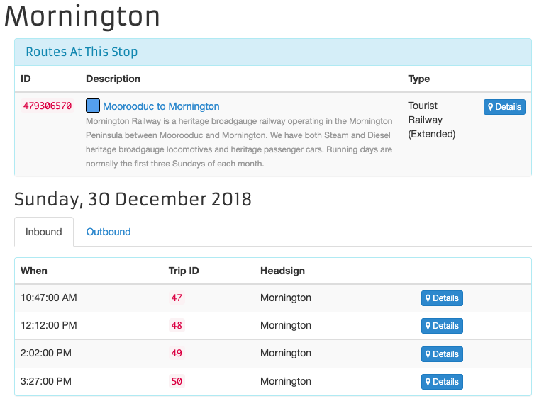

```{r setup, include=FALSE}
library(tidyverse)
library(tidytransit)
library(sp)
library(strayr)
library(ptinpoly)
library(magrittr)
library(ggplot2)
library(sf)
library(ASGS.foyer)
library(raster)
library(ggmap)
library(units)
library(janitor)
library(mapview)
library(ggstatsplot)
library(gtsummary)
library(moments)
library(scales)
library(gtfstools)
library(lubridate)
library(kableExtra)
library(knitr)
library(readxl)
library(dplyr)
library(devtools)
library(gtfssupplyindex)
# invalidate cache when the tufte version changes
#knitr::opts_chunk$set(cache.extra = packageVersion('tufte'))

knitr::knit_hooks$set(crop = knitr::hook_pdfcrop)
```


# Introduction
"If you can't measure it, you can't manage it" 
is often miss-attributed to @Deming1993new, 
who was trying to
make the opposite point [@Berenson2016in]. 
Regardless,
service level indicators 
are important in
researching, 
managing 
and seeking to improve transit operations 
[@FieldingGordonJ1987Mpts; @Ryus:2003aa]. 
Many indicators already exist 
including, for example: 
those in the Transit Capacity and Quality of Service Manual (TCQSM)[@TCQSM:2013] and
the Transit Score metric [@WalkScore:2023tg].

However, practitioners, 
researchers 
and advocates 
using such metrics 
may face two inter-related challenges: 
(1) calculating the metrics themselves 
for a specific location 
and service pattern; and
(2) explaining the metrics, 
their meaning 
and importance 
to those who 
are not specialists in transit
For example:
the TCQSM metrics 
might be 
difficult to calculate 
without specialist software and data, 
but, they use an A to F scoring system 
and there is an entire guidebook 
explaining each;  
in contrast, 
entering an address into the Transit Score website 
will return a score out of 100 
reflecting the quantity of transit available, but 
the methodolgy and algorithm is 
not publicly available, 
so these cannot be calculated independently.


Previous research by @currie2007identifying 
developed a transit Supply Index (SI) 
that appears to be both 
relatively easy to calculate and 
explain to non-transport professionals. 
It is obtained by calculating 
the number of transit arrivals 
at each stop within an area of interest, 
with an adjustment made to account for 
the typical walking distance catchment 
of transit stops and stations. 
Higher SI scores indicate 
areas with higher frequency services 
and/or better coverage. 

Unfortunately, 
the SI does not appear to have been widely used,
perhaps in part because at the time it was first published 
timetable data was not publicly available 
in a standardized 
and machine-readable format. 
The scores reported in Currie and Senbergs (2007)
were calculated directly from a database of services 
provided by the transit authority 
in Melbourne, Australia. 
Since then, however, 
the General Transit Feed Specification (GTFS) 
has developed 
as a way to publish timetable data 
in a standardized format.  
More than 10,000 agencies 
are now providing GTFS feeds^[There are two forms: 
GTFS-static consisting of the timetable data (the scheduled services); 
and GTFS-realtime, which includes vehicle arrivals and departure times based on real-world position data. 
This paper and project uses only the GTFS-static (timetable) format.] 
[@GTFS], 
and many visualization, processing and analysis tools 
are now available. 

A gap, however, is that 
there is not yet a tool to calculate SI scores directly from 
GTFS datasets.
This provides the motivation 
for the research reported in this paper, 
in which a new R package (gtfssupplyindex) 
specifically developed to calculate SI scores 
is presented. 
The remainder of this paper is structured as follows:
the next seciton outlines the background to this research,
including the original formulation of the Transit Supply Index, 
and an explanation of the GTFS. 
Section 3 then describes the study methodology, 
followed by a brief presentation of results in Section 4. 
Section 5 discusses the results, 
outlines directions for future research 
and provides a conclusion. 

# Background

## Transit metrics
Even a brief search reveals 
many metrics 
available for benchmarking transit services. 
Examples include: 
(1) those in the Transit Cooperative Research Program (TCRP) Report 88, which is an extensive guidebook on developing a performance-measurement system [@Ryus:2003aa]; 
(2) online databases provided by 
the Florida Transit Information System (FTIS) [@Florida-Transit-Information-System:2018aa] 
and @UITP:2015aa; 
(3) those used in the extensive annual benchmarking program
undertaken yearly by the Transport Strategy Centre, 
which includes over 100 transit providers around the world [@Imperial-College-London:2023aa]; and
(4) a recently developed methodology to calculate 'blank spots' within an area, 
being those places beyond 400/800 metre walking distances to/from bus and tram stops/train stations [@AlamriSultan2023GAoA]. 
  
  
The Fielding Triangle [@FieldingGordonJ1987Mpts] provides a framework 
for understanding how such metrics combine 
service inputs, 
outputs 
and consumption.  
to describe cost efficiency 
and effectiveness; and
service effectiveness. 
At a larger scale, 
@Litman:2003ab 
and @Litman:2016aa 
discuss some of the traffic, 
mobility, 
accessibility, 
social equity, 
strategic planning 
and other rational decision-making-based
perspectives underling such transit metrics, 
while @Reynolds:2017ah extends 
these into models of how 
institutionalism, 
incrementalism 
and other public policy analysis concepts 
might apply to decision-making processes. 
Further examples include:
(1) @GuzmanLuisA.2017Aeit, 
who develop a measure of accessibility 
in the context of policy development 
and social equity 
for Latin American Bus Rapid Transit (BRT) networks; and 
(2) the street space allocation metrics 
based around 10 ethical principles 
introduced by @Creutzig2020streetspaceallocation. 

However, 
many of these metrics appear difficult to calculate, 
complex to explain or understand, 
and likely not well suited to communication 
with those who are not transit planners or engineers, 
or other technical specialists. 
Where pre-calculated metrics 
are immediately available 
it may not be possible for  practitioners, 
researchers 
or advocates 
to independently generate metrics 
for proposed system changes. 
Sometimes it is not even possible 
to know precisely how scores for the existing services levels are calculated. 

For example, 
Transit Scores 
for locations with a published GTFS feed 
are readily available on the @WalkScore:2023tg website, 
eliminating the need for any calculations. 
The meaning of these Transit Scores 
appears easy to explain, 
as the highest possible score of 100 
represents what might be experienced in the centre of New York. 
However, 
the Transit Score algorithm 
is patented 
and effectively a black box. 
It is not possible to calculate Transit Scores scores independently. 
Nor can Transit Scores to be generated 
for proposed changes to networks. 
The Transit Score metric, therefore, 
fails the first of the aforementioned challenges, 
as practitioners, researchers and advocates 
can only use those scores provided online.
The metric is simple to explain: 
the closer to 100, the better; but, 
because it is based on 
a patented algorithm it may not be easy to understand or explain 
the connection between real-world conditions 
and the Transit Score, 
or what might need to be done 
to improve the score (and service levels). 
As such, it might partially 
pass the second of the aforementioned challenges, 
as it is simple to understand, 
yet may not withstand scrutiny.  


In contrast, the TCQSM, 
specifies Levels of Service (LOS) 
between A and F 
across a range of factors^[
Including service span, 
frequency, 
speed, 
the proportion of the population serviced, 
competitiveness of travel times to car-based travel, 
and many more.]. 
This scoring scheme appears relatively simple to explain^[
A is good and F is bad.] and matches 
that often used in traffic capacity analysis. 
Detail within @TCQSM:2013 
provides a resource for anyone wanting to better understand what the scores mean. 
However, 
calculation of many of TCQSM metrics may need specialised software 
and datasets^[
For example, 
the Service Coverage Area metric in the TCQSM (pp. 5-8 to 5-21) 
may require GIS or other analysis, 
on top of accurate data about population densities, 
stop locations 
and service schedules.] 
and it might be challenging to explain 
the detail of these measures 
or how to improve them 
to non-technical decision-makers, 
stakeholders 
or others involved in transit management or advocacy. 

## GTFS
The introduction of the General Transit Feed Specification (GTFS) 
and widespread release of schedule data in this format, 
however, 
has helped towards making transit metrics more broadly available and usable. 
GTFS is an open, 
text-based format 
that was developed originally to allow transit information to be included in the Google Maps navigation platform [@GTFS]. 

```{r GTFS_ERD, fig.cap = "GTFS entity relationship diagram. Source: adapted by author from Alamri et al (2023) and the GTFS Schedule Reference (16/11/2023 revision).", echo = FALSE, warning=FALSE, message=FALSE, cache=TRUE, out.width='100%'}
knitr::include_graphics("graphics/GTFS.png")

```

Figure \@ref(fig:GTFS_ERD) shows 
an Entity Relationship Diargram (ERD) 
of the GTFS data structure. 
Each box represents 
a database table 
in the GTFS, 
with table rows 
indicating the variables (columns) 
included in each^[
For example, 
each record in the 'stops' table 
includes a value for stop_id, 
stop_name, 
stop_lat and 
stop_lon.]. 
Relationships between the tables 
are indicated by the connecting lines, 
and Primary Key (PK) and Foreign Key (FK) designations^[
For example, 
stop_id appears in the 'stops' and 'stop_times' tables as a 
Primary Key and Foreign Key.]. 
`Crow's feet' 
indicate the relationships between each table^[
See https://i.stack.imgur.com/fxaAq.png for guide to the symbols. 
But, for example, 
the stops table is required, 
with the stop_id field providing a unique (primary) key 
for every stop. 
Within the stop_times table (which is also required) 
the stop_id field is a foreign key. 
Each unique stop_id 
can appear many times in the stop_times table, 
but can appear only once in the stops table. 
In the stop_times table 
each combination of 
trip_id, 
stop_id and 
arrival time 
must be unique (although see note 2!) 
meaning that these fields 
together represent a composite key.].


GTFS now provides a mechanism 
for including individual transit systems 
in many online products and analysis, 
including the Transit Score metric itself. 
@Wong:2013aa provides another example of what can be done with GTFS data, 
having developed code to calculate of some of the TCQSM metrics^[
Daily average headways, 
route length 
and stop numbers.] 
for 50 transit operators.
While the @Wong:2013aa open-source code is readily available^[
https://github.com/jcwong86/GTFS_Explore_Tool] 
this is now 11 years old 
and does not appear to be currently maintained. 
Future research may involve 
reviewing this code 
and using it to analyse modern GTFS feeds. 
However, 
in this paper the aim is more modest, 
being to use GTFS data to calculate Currie and Senbergs' (2007) SI.   


## The Transit Suppy Index
A generalized form of the Transit Supply Index (SI) is shown in Equation 1^[
Currie and Senbergs' (2007) focus 
was the context of Melbourne's Census Collection Districts (CCD) 
and calculations based on a week of transit service. 
CCDs predate the introduction of 
Statistical Areas 1, 2, 3, and 4 (SA1, SA2, SA3, SA4), 
and other geographical divisions 
currently used by the Australian Bureau of Statistics (ABS), 
which may be more familiar to readers from down under.]. 

  $$SI_{area, time} = \sum{\frac{Area_{Bn}}{Area_{area}}*SL_{n, time}}$$
 In Equation 1:
 
(1) $SI_{area, time}$ is the Supply Index for the area of interest 
and a given period of time;
(2) $Area_{Bn}$ is the buffer area for each stop (n) within the area of interest. 
In Currie and Senbergs (2007) this was based on 
a radius of 400 metres for bus and tram stops, 
and 800 metres for railway stations;
(3) $Area_{area}$ is the area of the area of interest; and
(4) $SL_{n,time}$ is the number of transit arrivals for each stop 
for a given time period.

An advantage of the SI is 
that it is a relatively simple number 
to calculate, 
understand 
and explain. 
It describes 
the number of transit arrivals 
at stops within 
an area of interest 
and time frame, 
multiplied by a factor 
accounting for the proportion of the area of interest 
within typical walking distances of each stop. 
Hence, 
more services, 
more stops 
and higher frequencies 
increase the score. 
However, the SI does not incorporate 
service span, 
speed 
or other elements of a transit service. 
While these may be important 
to passenger experience, 
they might add considerable complexity. 

Simplicity is also helped 
by the way 
that the SI is additive, 
in that $SI_{area, time}$ scores can be aggregated 
to calculate an overall score 
across multiple time periods 
or for a region encompassing multiple areas of interest. 


# Methodology
This study 
developed a package 
with tools for calculating the SI from GTFS data. 
R [@R-base], 
a widely used and readily available statistical programming language, 
was adopted for code development. 
The package development setup and workflow described by @wickham2023r 
was adopted in this study. 
Various existing packages 
were relied upon including: 
the sf package [@R-sf] for geospatial analysis; 
the tidyverse [@tidyverse2019]; 
gtfstools [@R-gtfstools]; and 
tidytransit [@R-tidytransit]. 
Some code was adapted from 
examples, vignettes and other documentation 
in the tidytransit, gtfstools and other packages.

Two cases where used during the code development and testing 
such that results might be generated for real GTFS data.  
These cases were the Mornington Peninsula Tourist Railway GTFS feed 
and the Public Transport Victoria (PTV) GTFS feed, 
both in Victoria, Australia. 
Both were selected primarily for convenience, 
given that the authors are familiar with 
the typical service patterns and geography.
Further cases were selected as 
leading, 
representative 
and contrasting examples 
for the results reported here. 


## Mornington Penninsula Tourist Railway

The Morning Peninsula Tourist Railway 
is located in the outer south-eastern suburbs of Greater Melbourne. 
It runs on Sundays and Wednesdays 
between Mornington (southwestern-most station) 
and Moorooduc, with an intermediate stop at Tanti Park^[https://transitfeeds.com/p/mornington-railway/806/latest/stops]. 
A GTFS feed from 2018 
was selected for the purposes of tests and demonstrating the code and output.
Australian Bureau of Statistics (ABS) data was also used, 
primarily through the strayr 
and absmapsdata packages [@r-strayr].
The Mornington Peninsular Statistical Area 3 (SA3) zone 
and the Statistical Area 1 (SA1) zones contained within it 
were adopted as the areas of interest. 
These are shown in Figure \@ref(fig:mornington_map_ABS), 
together with the locations of the three railway stations.  

```{r mornington_map_SA3, fig.cap = "SA1 zones (red), location of Mornington Tourist Railway Stations (black) and boundary of zones within 800m catchment (blue)", fig.width = 3, echo = FALSE, warning=FALSE, message=FALSE, cache=TRUE}
### ---------------- get abs data for Mornington Peninsula
#options(timeout = 1000)
#remotes::install_github("wfmackey/absmapsdata")

#get_mornington_sa1 <- function(){
#  mornington_sa12021 <- absmapsdata::sa12021 %>% filter(sa3_name_2021 == "Mornington Peninsula") %>% select(sa1_code_2021)
#  sf::st_write(mornington_sa12021, "inst/extdata/mornington_sa12021.geojson", append=FALSE)
#  return(mornington_sa12021)
#}
#get_mornington_sa3 <- function(){
#  mornington_sa32021 <- absmapsdata::sa32021 %>% filter(sa3_name_2021 == "Mornington Peninsula") %>% select(sa3_code_2021)
#  sf::st_write(mornington_sa32021, "inst/extdata/mornington_sa32021.geojson", append=FALSE)
#  return(mornington_sa32021)
#}

### ---------------- load SA3 abs maps data for just mornington peninsula
areas_of_interest <- load_areas_of_interest(areas_of_interest = absmapsdata::sa12021 %>% filter(sa3_name_2021 == "Mornington Peninsula") %>% select(sa1_code_2021), 
  area_id_field = "sa1_code_2021")

# map the areas_of_interest
map <- areas_of_interest %>% 
  ggplot() +
  geom_sf(aes(geometry = geometry))
#map
#set the EPSG to transform from lat/lon to metres
EPSG_for_transform = 28355

#load the revised mornington GTFS data
list_gtfs = gtfssupplyindex:::gtfs_by_route_type(system.file(
  "extdata/mornington180109",
  "gtfs.zip", 
  package = "gtfssupplyindex", 
  mustWork = TRUE))
stops_as_sf_mornington <-  list_gtfs[[1]]$stops %>% 
  tidytransit::stops_as_sf()

#map the stops on the ABS data
#map + 
#  geom_sf(data = stops_as_sf_mornington, aes(geometry = geometry))


stops_in_or_near_areas <- gtfssupplyindex:::stops_in_walk_dist(
  list_gtfs = list_gtfs, 
  areas_of_interest = areas_of_interest,
  EPSG_for_transform = 28355
)

```

```{r mornington_map_ABS, fig.cap = "SA1 zones and location of Mornington Tourist Railway Stations.",  echo = FALSE, warning=FALSE, message=FALSE, cache=FALSE, out.width='100%'}

knitr::include_graphics("graphics/mornington.png")

```

## Public Transport Victoria (PTV)
Larger scale testing was performed using the Victorian GTFS feed, 
published by Public Transport Victoria (PTV), 
sourced via @transitfeeds_victoria:2023aa for historical feeds. 
Again, ABS data was used for the areas of interest. 


## Extensions?? 
Hourly
"Manhattan- and London-ised Indexes"


Tidytransit includes a sample GTFS feed from New York's MTA
(including the subway!), 
and so this was used for code tests were appropriate. 
<MORE DETAILS ABOUT THIS>


# Results
## Code structure and output
Developed code is available and documented on github [@gtfssupplyindex_github]. 
The structure of the package 
and the functions developed 
to generate each table are shown in Figure \@ref(fig:SI_ERD). 
This indicates how the package takes input from three files: 
a gtfs feed (gtfs.zip); 
a sf object describing the geometry of the areas 
for which the SI is to be calculated; and 
a csv file defining the buffer zone distances (in metres) 
for each route type^[This file is included in the package.]. 

```{r SI_ERD, fig.cap = "Entity Relationship Diagram (ERD) showing the data structure and functions related to the gtfssupplyindex package", echo = FALSE, warning=FALSE, message=FALSE, cache=TRUE, out.width='100%'}


```

The ultimate output 
is a si_by_area_and_hour table 
(Figure \@ref(fig:SI_ERD), bottom right), 
which reports the SI score for each hour of the day 
across dates specified by the user. 
The various functions and their output 
and explained in the following, 
using the Mornington Peninsula GTFS 
as an example.

## Step-by-step: Mornington Peninsula

This section presents 
outputs of the various functions 
for December 30th, 2018, 
using the Mornington Penninsula Tourist Railway GTFS feed 
and SA1 zone boundaries. 
The individual steps involved in using the gtfssupplyindex package are:

(1) loading the gtfs.zip file - the gtfs_by_route_type function loads the gtfs data and splits it into a list (by route_type) of tidygtfs objects, using the filter_by_route_type function from the gtfstools package [@filter_GTFS_by_mode].

```{r load_mornington_GTFS data, echo = FALSE, warning=FALSE, message=FALSE, cache=TRUE, out.width='100%'}
#load the revised mornington GTFS data
list_gtfs = gtfssupplyindex:::gtfs_by_route_type(system.file(
  "extdata/mornington180109",
  "gtfs.zip", 
  package = "gtfssupplyindex", 
  mustWork = TRUE))

```

(2) loading geometry information about the areas of interest - geographical data about the areas of interest are loaded by the load_areas_of_interest.R function into an sf object, using the sf package [@R-sf] . The resultant areas_of_interest table contains each area_id and its associated geometry. 
Data about buffer zones, specifically the walking distance threshold assigned to each route_type (mode) is then loaded, again through a function (load_buffer_zone.R). The package includes this information in a csv file, in which the buffer zone is defined in metres. 
  

```{r load_ABS data, echo = FALSE, error = FALSE, include = FALSE, results='hide', warning=FALSE, message=FALSE, cache=TRUE, out.width='100%'}

suppressWarnings({
areas_of_interest <- load_areas_of_interest(areas_of_interest = sf::st_read(system.file(
  "extdata",
  "mornington_sa12021.geojson", 
  package = "gtfssupplyindex", 
  mustWork = TRUE)), 
  area_id_field = "sa1_code_2021")
})

#head(areas_of_interest) %>% kable(caption = "First 6 entries in areas of interest table")
```

```{r load_buffer_distance_data, echo = FALSE, warning=FALSE, message=FALSE, cache=TRUE, out.width='100%'}
buffer_distance <- gtfssupplyindex:::load_buffer_zones()
#head(buffer_distance) %>% kable(caption = "First six entries in buffer distance definitions")
```

(3) calculating which stops are within the catchment walking distance of which areas, which is achieved using the stops_in_walk_dist function. However, this is complicated by the need to have different buffer distances for each route_type, and to only include those parts of the walking catchment that are within each area of interest. The calculation involves: (1) looking up the buffer_distance_length specific to each route_type; (2) transforming from latitude and longitude into metres and determining the area; (3) drawing circles around each stop, with the radius equal to the buffer distance, and intersecting these with the areas_of_interest (see Figure \@ref(fig:calculate_stop_in_or_near_areas_verbose)); (4) calculating the $area_{Bn}$ terms are for each combination of stop_id and area_id; and then reporting the overall area terms for each area_of_interest ($Area_{Bn} / Area_{Area}$), as shown in Table \ref@(tab:calculate_stop_in_or_near_areas).

```{r calculate_stop_in_or_near_areas_verbose, echo = TRUE, warning=FALSE, message=FALSE, cache=TRUE, out.width='100%', fig.keep = "first", fig.cap= "Step 3, part 4, stop catchments for the Mornington Penninsula Tourist Railway, showing intersections with SA1 zones"}
stops_in_or_near_areas <- gtfssupplyindex:::stops_in_walk_dist(
  list_gtfs = list_gtfs, 
  areas_of_interest = areas_of_interest,
  EPSG_for_transform = 28355, 
  verbose = TRUE
)

```

```{r calculate_stop_in_or_near_areas, echo = FALSE, warning=FALSE, message=FALSE, cache=TRUE, out.width='100%'}
stops_in_or_near_areas <- gtfssupplyindex:::stops_in_walk_dist(
  list_gtfs = list_gtfs, 
  areas_of_interest = areas_of_interest,
  EPSG_for_transform = 28355, 
  verbose = FALSE
)

head(stops_in_or_near_areas[[1]]) %>% kable(caption = "'Rail' element of the stops in or near areas list for the Mornington Pennisula datasets, first six entries")
```

<!-- The variables passed to the stop_in_or_near_areas function are list_gtfs^[The list of tidygtfs objects ouput by the gtfs_by_route_type function], the areas_of_interest table^[Which is the output of the load_areas_of_interest function], the buffer_distance table^[Output by the load_buffer_zones function], and an EPSG_for_transform variable. This last variable is the Coordinate Reference System (CRS) value relevant to the geographic location. It is used to project the latitude and longitude values included in the GTFS data and area_of_interest data into metres, in this case relating to the GDA94 / MGA zone 55 relevant to Australia^[https://epsg.io/28355].  

--->


(4) Calculating SI scores for a given time period, using the si_calc.R function. This adapts code from an article included in the tidytransit package [@tidytransit_departure_timetable] to calculate the number of arrivals in a given time period, and then combines this with the area terms to calculate the SI score. The si_total.R function aggregates the SI scores across all modes, although the Mornington Penninsula example presented here only includes rail services. Hourly values can likewise be generated using the hourly.R function which runs , giving the results shown in Table \@ref(tab:SI_mornington_20181230_output)and mapped in Figure \@ref(fig:SI_mornington_20181230_output). 

```{r arrivals_mornington_20181230, echo = FALSE, eval=FALSE, warning=FALSE, message=FALSE, cache=TRUE}

stop_ids <- list_gtfs[[1]]$stops %>%
 dplyr::select(stop_id)

arrivals_by_stop_id <- gtfssupplyindex::arrivals(
 gtfs = list_gtfs[[1]],
 stop_ids = stop_ids,
 date_ymd = "2018-12-30",
 start_hms = lubridate::hms("10:30:00"),
 end_hms = lubridate::hms("16:00:00")
)

arrivals_by_stop_id %>% kable(caption = "Arrivals at each stop for Sunday December 30th 2018, Mornington Peninsula tourist railway.")

```
<!--- This matches the number of trips shown in the Mornington Railway GTFS feed, being 4 in each direction^[https://transitfeeds.com/p/mornington-railway/806/latest/stop/1388695887/20181230]. 

```{r SI_Mornington_arrivals, fig.margin = FALSE, fig.cap = "Arrivals at Mornington Station (stop id 1388695887) for 30/12/2018", echo = FALSE, warning=FALSE, message=FALSE, cache=TRUE, out.width='100%'}
knitr::include_graphics("graphics/1388695887_inbound.png")

```

All the inputs to calculate the si are now available. Hence, the SI.calc function can be run, resulting in the si_by_route_type list (by route_type) of tables showing the area_id corresponding SI values

```{r SI_mornington_20181230, echo = FALSE, warning=FALSE, message=FALSE, cache=TRUE}
####-----first load all the inputs

#load the revised mornington GTFS data
list_gtfs = gtfssupplyindex:::gtfs_by_route_type(system.file(
  "extdata/mornington180109",
  "gtfs.zip", 
  package = "gtfssupplyindex", 
  mustWork = TRUE))

areas_of_interest <- load_areas_of_interest(absmapsdata::sa22021 %>% filter(sa3_name_2021 == "Mornington Peninsula") %>% select(sa2_code_2021),  area_id_field = "sa2_code_2021")

buffer_distance <- gtfssupplyindex:::load_buffer_zones()

stops_in_or_near_areas <- gtfssupplyindex:::stops_in_walk_dist(
  list_gtfs = list_gtfs, 
  areas_of_interest = areas_of_interest,
  EPSG_for_transform = 28355,
  verbose = FALSE
)

####----run SI.calc function to build si_by_mode_and_time list (by route_type) of tables

si_by_route_type <- si_calc(
    list_gtfs = list_gtfs,
    stops_in_or_near_areas = stops_in_or_near_areas, 
    date_ymd = lubridate::ymd("2018-12-30"), 
    start_hms = lubridate::hms("10:30:00"),
    end_hms = lubridate::hms("16:00:00"),
    verbose = TRUE)

si_by_route_type %>% kable(caption = "SI values for Mornington Penninsula Railway services on 30/12/2018 (full day)")

```

The si_total function aggregates the si_by_route_type tables so that values are no longer separated by mode. Although in the case of the Mornington Penninsula Railway there is only one route_type.  

Finally, the hourly function runs the si_calc and si_total functions for every hour in a single day. It outputs a table showing the SI scores for each area for each hour of the day^[Across the service span]. The below table shows this output, together with row and column totals.  

```{r SI_hourly_mornington_20181230, echo = FALSE, warning=FALSE, message=FALSE, cache=TRUE}

si_by_area_and_hour_wider <- hourly(list_gtfs, stops_in_or_near_areas, "2018-12-30")

si_by_area_and_hour_wider %>% adorn_totals(where = c("row", "col")) %>% kable(caption = "Mornington Penninsula Tourist Railway hourly SI values for December 30, 2018, for SA1 zones")

```
--->


The ultimate output, 
showing the SI scores for each hour,
isshown in Table \@ref(tab:SI_mornington_20181230_output)
and mapped in Figure \@ref(fig:SI_mornington_20181230_output). 


```{r SI_mornington_20181230_output, echo = FALSE, warning=FALSE, message=FALSE, cache=TRUE, fig.cap = "Mornington Penninsula Tourist Railway hourly SI values for December 30, 2018"}
####-----first load all the inputs

#load the revised mornington GTFS data
list_gtfs = gtfssupplyindex:::gtfs_by_route_type(system.file(
  "extdata/mornington180109",
  "gtfs.zip", 
  package = "gtfssupplyindex", 
  mustWork = TRUE))

areas_of_interest <- load_areas_of_interest(absmapsdata::sa12021 %>% filter(sa3_name_2021 == "Mornington Peninsula") %>% select(sa1_code_2021),  area_id_field = "sa1_code_2021")

buffer_distance <- gtfssupplyindex:::load_buffer_zones()

stops_in_or_near_areas <- gtfssupplyindex:::stops_in_walk_dist(
  list_gtfs = list_gtfs, 
  areas_of_interest = areas_of_interest,
  EPSG_for_transform = 28355,
  verbose = FALSE
)


si_by_area_and_hour <- hourly(list_gtfs, stops_in_or_near_areas, "2018-12-30")


si_by_area_and_hour_wider <- pivot_wider(si_by_area_and_hour, names_from = hour_starting, values_from = SI)

si_by_area_and_hour_wider %>% 
  head() %>%
  adorn_rounding() %>%
  kable(caption = "Mornington Penninsula Tourist Railway hourly SI values for December 30, 2018, for first 6 SA1 zones")

map_areas_of_interest <- load_areas_of_interest(absmapsdata::sa12021 %>% filter(sa3_name_2021 == "Mornington Peninsula") %>% select(sa1_code_2021),  area_id_field = "sa1_code_2021")

#Join SI to map data
map_si_by_area_and_hour <- merge(map_areas_of_interest, si_by_area_and_hour)

map_si_by_area_and_hour <- na.omit(map_si_by_area_and_hour)

ggplot() + 
  geom_sf(data=map_si_by_area_and_hour,
          aes(fill = SI)) +
            facet_wrap(vars(hour_starting)) +
  theme(axis.text.x=element_blank(), #remove x axis labels
        axis.ticks.x=element_blank(), #remove x axis ticks
        axis.text.y=element_blank(),  #remove y axis labels
        axis.ticks.y=element_blank()  #remove y axis ticks
  )


```

The results meet expectations, with higher scores for SA1 zones closer to the three stations. Hand calculation for SA1 21402159136, which is close to the Mornington Station, to confirm the results is relatively trivial. By inspection, all of SA1 21402159136 (shown in purple in Figure \@ref(fig:calculate_stop_in_or_near_areas_verbose) is within an 800 metre walking distance of Mornington Station, meaning that $Area_{Bn} / Area_{area} = 1$.  The SI scores for each hour are therefore equal to the number of arrivals in each hour.  Table \@ref(tab:mornington_hand_check) shows the scores calculated by the function, which matches the pattern of arrivals at 10:47am, 12:12pm, 2:02pm and 3:27pm^[See  https://transitfeeds.com/p/mornington-railway/806/latest/stops].

```{r mornington_hand_check, fig.cap = "Mornington Penninsula Railway GTFS summary", echo = FALSE, warning=FALSE, message=FALSE, cache=TRUE, out.width='100%'}


si_by_area_and_hour_wider %>% 
  filter(area_id == "21402159136") %>%
  adorn_rounding() %>%
  kable(caption = "Mornington Penninsula Tourist Railway hourly SI values for December 30, 2018, for SA1 zone 21402159136")


#


```


## Greater Melbourne - October 2023
As a further example, hourly SI scores were calculated  for all SA1 2021 zones within Greater Melbourne on Tuesday 10th, Saturday 14th and Sunday 15th October, 2023. These dates were selected so as to match the typical census timing of a Tuesday early in October, although 2023 is not actually a census year. GTFS data was obtained from @transitfeeds_victoria:2023aa, with the October 6, 2023 dataset selected^[Minor adjustments were made to this dataset to remove duplicate stop_ids from the stops.txt file]. SI scores by hour for SA1 zones in the centre of Melbourne (shown in Figure \@ref(CBD_map)) on Tuesday 10th October are shown in Figure \@ref(Melbourne_CBD_map_231010), 

```{r CBD_map, fig.cap = "SA1 zones and location of Mornington Tourist Railway Stations.",  echo = FALSE, warning=FALSE, message=FALSE, cache=FALSE, out.width='100%'}


```


```{r fix_ptv_data_Victoria_231006, eval = FALSE, echo = FALSE}
#eval is false, so as to not overwrite saved file

ptv_231006 <- tidytransit::read_gtfs("data/ptv_231006/gtfs.zip")
# This results in "Warning: Duplicated ids found in: stops The returned object is not a tidygtfs object, you can use as_tidygtfs() after fixing the issue."

#So, remove the duplicated stops 
#identify duplicate stops
ptv_231006_duplicated_stops <- tabyl(ptv_231006$stops$stop_id) %>% filter (n>1)
names(ptv_231006_duplicated_stops) <- c("stop_id", "n", "percent")
ptv_231006_duplicated_stops <- left_join(ptv_231006_duplicated_stops, ptv_231006$stops)

##discard duplicates
ptv_231006$stops <- ptv_231006$stops[!duplicated(ptv_231006$stops$stop_id),]

## Write gtfs back to file
ptv_231006 <- as_tidygtfs(ptv_231006)
tidytransit::write_gtfs(ptv_231006, "data/ptv_231006/gtfs_duplicate_stops_removed.zip")


## convert to list of tidygtfs objects
ptv_231006_list_gtfs <- gtfssupplyindex::gtfs_by_route_type("data/ptv_231006/gtfs_duplicate_stops_removed.zip")

list_gtfs = ptv_231006_list_gtfs

areas_of_interest <- load_areas_of_interest(absmapsdata::sa12021 %>% filter(gcc_name_2021 == "Greater Melbourne") %>% select(sa1_code_2021),  area_id_field = "sa1_code_2021")

buffer_distance <- gtfssupplyindex:::load_buffer_zones()

stops_in_or_near_areas <- gtfssupplyindex:::stops_in_walk_dist(
  list_gtfs = list_gtfs, 
  areas_of_interest = areas_of_interest,
  EPSG_for_transform = 28355,
  verbose = FALSE
)

```


```{r run_for_all_modes_Victoria_231006, eval = FALSE, echo = FALSE}
#eval is false, so as to not overwrite saved file

si_by_area_and_hour_231010 <- hourly(
  list_gtfs = list_gtfs, 
  stops_in_or_near_areas = stops_in_or_near_areas, 
  date_ymd = "2023-10-10",
  verbose = TRUE)

write.csv(si_by_area_and_hour_231010, "results/Greater_Melbourne/si_by_SA12021area_and_hour_231010")


si_by_area_and_hour_231014 <- hourly(
  list_gtfs = list_gtfs, 
  stops_in_or_near_areas = stops_in_or_near_areas, 
  date_ymd = "2023-10-14",
  verbose = TRUE)

write.csv(si_by_area_and_hour_231014, "results/Greater_Melbourne/si_by_SA12021area_and_hour_231014")


si_by_area_and_hour_231015 <- hourly(
  list_gtfs = list_gtfs, 
  stops_in_or_near_areas = stops_in_or_near_areas, 
  date_ymd = "2023-10-15",
  verbose = TRUE)

write.csv(si_by_area_and_hour_231015, "results/Greater_Melbourne/si_by_SA12021area_and_hour_231015")

```


```{r Melbourne_231010, echo = FALSE, warning=FALSE, message=FALSE, cache=TRUE}

###Load results from CSV (Precalculated above) and make first column character
si_by_area_and_hour_231010 <- read.csv("results/Greater_Melbourne/si_by_SA12021area_and_hour_231010")
si_by_area_and_hour_231010 <- si_by_area_and_hour_231010[,2:4]
si_by_area_and_hour_231010$area_id <- as.character(si_by_area_and_hour_231010$area_id)

#pivot to wider for display as table
si_by_area_and_hour_231010_wider <- si_by_area_and_hour_231010 %>% pivot_wider(names_from = hour_starting, values_from = SI)

#si_by_area_and_hour_231010_wider %>% select(1, 6:25) %>% head() %>% adorn_rounding(digits = 0) %>% kable(caption = "Victorian GTFS and SA1 zones within the Greater Melbourne GCCSA, hourly SI values for October 10, 2023, first 6 SA1 zones, 4am to 11pm only" )


```

```{r Melbourne_231014, echo = FALSE, warning=FALSE, message=FALSE, cache=TRUE}

###Load results from CSV (Precalculated above) and make first column character
si_by_area_and_hour_231014 <- read.csv("results/Greater_Melbourne/si_by_SA12021area_and_hour_231014")
si_by_area_and_hour_231014 <- si_by_area_and_hour_231014[,2:4]
si_by_area_and_hour_231014$area_id <- as.character(si_by_area_and_hour_231014$area_id)

#pivot to wider for display as table
si_by_area_and_hour_231014_wider <- si_by_area_and_hour_231014 %>% pivot_wider(names_from = hour_starting, values_from = SI)

##Skip printing table
#si_by_area_and_hour_231014_wider %>% select(1, 6:28) %>% head(n=75) %>% adorn_rounding(digits = 0) %>% kable(caption = "Victorian GTFS and SA1 zones within the Greater Melbourne GCCSA, hourly SI values for October 10, 2023, first 75 SA1 zones, 4am to 2am only" )


```


```{r Melbourne_231015, echo = FALSE, warning=FALSE, message=FALSE, cache=TRUE}

###Load results from CSV (Precalculated above) and make first column character
si_by_area_and_hour_231015 <- read.csv("results/Greater_Melbourne/si_by_SA12021area_and_hour_231015")
si_by_area_and_hour_231015 <- si_by_area_and_hour_231015[,2:4]
si_by_area_and_hour_231015$area_id <- as.character(si_by_area_and_hour_231015$area_id)

#pivot to wider for display as table
si_by_area_and_hour_231015_wider <- si_by_area_and_hour_231015 %>% pivot_wider(names_from = hour_starting, values_from = SI)

## Skip table
#si_by_area_and_hour_231015_wider %>% select(1, 6:28) %>% head(n=75) %>% adorn_rounding(digits = 0) %>% kable(caption = "Victorian GTFS and SA1 zones within the Greater Melbourne GCCSA, hourly SI values for October 10, 2023, first 75 SA1 zones, 4am to 2am only" )


```

```{r Melbourne_CBD_map_231010, echo = FALSE, warning=FALSE, message=FALSE, cache=TRUE, fig.fullwidth = TRUE, fig.cap="Victorian GTFS and SA1 zones near the Melbourne CBD, SI values for October 10, 2023, by hour between 5am and 1am"}

map_areas_of_interest <- load_areas_of_interest(absmapsdata::sa12021 %>% filter(sa4_name_2021 == "Melbourne - Inner") %>% select(sa1_code_2021),  area_id_field = "sa1_code_2021")

#Join SI to map data
map_si_by_area_and_hour_231010 <- inner_join(map_areas_of_interest, si_by_area_and_hour_231010)

#convert hour starting to numeric
map_si_by_area_and_hour_231010$hour_starting <- hm(map_si_by_area_and_hour_231010$hour_starting)
map_si_by_area_and_hour_231010$hour_starting <- hour(map_si_by_area_and_hour_231010$hour_starting)

xlim <- c(144.93343289587824,  144.9946369676684)
ylim <- c(-37.80347733938971, -37.82753754010771)


#plot only 5am to 1am
ggplot() + 
  geom_sf(data=map_si_by_area_and_hour_231010 %>% filter(hour_starting %in% (5:24)),
          aes(fill = SI)) +
            facet_wrap(vars(hour_starting)) +
  theme(axis.text.x=element_blank(), #remove x axis labels
        axis.ticks.x=element_blank(), #remove x axis ticks
        axis.text.y=element_blank(),  #remove y axis labels
        axis.ticks.y=element_blank()  #remove y axis ticks
  ) +
  coord_sf(xlim = xlim, ylim = ylim)  
```

The results shown in Figure \@ref(Melbourne_CBD_map_231010) meet expectations, with higher SI scores shown in the Central Business District (CBD), where there are the five stations that make up the City Loop^[Flinders Street Station, Southern Cross Station, Flagstaff Station, Melbourne Central Station and Parliament Station.], and where many tram and bus routes converge. The SI scores are highest during the day, especially in the morning and afternoon peak periods around 7-9am and 4-7pm, reflecting the typical service peaks. 

### By mode

SI scores were also obtained for each mode separately. Scores for the whole day on Tuesday October 10th, 2023 are shown in Figure \@ref(Melbourne_231010_by_mode).

```{r run_for_tram_Victoria_231006, eval = FALSE, echo = FALSE}

### eval = FALSE so this chunk will not run
si_by_area_and_hour_231010 <- hourly(
  
list_gtfs = ptv_231006_list_gtfs[[1]], 
  stops_in_or_near_areas = stops_in_or_near_areas, 
  date_ymd = "2023-10-10",
  verbose = TRUE)

write.csv(si_by_area_and_hour_231010, "results/Greater_Melbourne/si_by_SA12021area_and_hour_231010_tram")


si_by_area_and_hour_231014 <- hourly(
  list_gtfs = ptv_231006_list_gtfs[[1]], 
  stops_in_or_near_areas = stops_in_or_near_areas, 
  date_ymd = "2023-10-14",
  verbose = TRUE)

write.csv(si_by_area_and_hour_231014, "results/Greater_Melbourne/si_by_SA12021area_and_hour_231014_tram")


si_by_area_and_hour_231015 <- hourly(
  list_gtfs = ptv_231006_list_gtfs[[1]], 
  stops_in_or_near_areas = stops_in_or_near_areas, 
  date_ymd = "2023-10-15",
  verbose = TRUE)

write.csv(si_by_area_and_hour_231015, "results/Greater_Melbourne/si_by_SA12021area_and_hour_231015_tram")
```


```{r run_for_rail_Victoria_231006, eval = FALSE, echo = FALSE}

#### eval = FALSE so this chunk will not run
si_by_area_and_hour_231010_rail <- hourly(
list_gtfs = ptv_231006_list_gtfs[2], 
  stops_in_or_near_areas = stops_in_or_near_areas[2], 
  date_ymd = "2023-10-10",
  verbose = TRUE)

write.csv(si_by_area_and_hour_231010_rail, "results/Greater_Melbourne/si_by_SA12021area_and_hour_231010_rail")

si_by_area_and_hour_231014_rail <- hourly(
  list_gtfs = ptv_231006_list_gtfs[2], 
  stops_in_or_near_areas = stops_in_or_near_areas[2], 
  date_ymd = "2023-10-14",
  verbose = TRUE)

write.csv(si_by_area_and_hour_231014_rail, "results/Greater_Melbourne/si_by_SA12021area_and_hour_231014_rail")

si_by_area_and_hour_231015_rail <- hourly(
  list_gtfs = ptv_231006_list_gtfs[2], 
  stops_in_or_near_areas = stops_in_or_near_areas[2], 
  date_ymd = "2023-10-15",
  verbose = TRUE)

write.csv(si_by_area_and_hour_231015_rail, "results/Greater_Melbourne/si_by_SA12021area_and_hour_231015_rail")

```


```{r run_for_bus_Victoria_231006, eval = FALSE, echo = FALSE}

### eval = FALSE so this chunk will not run
si_by_area_and_hour_231010_bus <- hourly(
list_gtfs = ptv_231006_list_gtfs[3], 
  stops_in_or_near_areas = stops_in_or_near_areas[3], 
  date_ymd = "2023-10-10",
  verbose = TRUE)

write.csv(si_by_area_and_hour_231010_bus, "results/Greater_Melbourne/si_by_SA12021area_and_hour_231010_bus")

si_by_area_and_hour_231014_bus <- hourly(
  list_gtfs = ptv_231006_list_gtfs[3], 
  stops_in_or_near_areas = stops_in_or_near_areas[3], 
  date_ymd = "2023-10-14",
  verbose = TRUE)

write.csv(si_by_area_and_hour_231014_bus, "results/Greater_Melbourne/si_by_SA12021area_and_hour_231014_bus")

si_by_area_and_hour_231015_bus <- hourly(
  list_gtfs = ptv_231006_list_gtfs[3], 
  stops_in_or_near_areas = stops_in_or_near_areas[3], 
  date_ymd = "2023-10-15",
  verbose = TRUE)

write.csv(si_by_area_and_hour_231015_bus, "results/Greater_Melbourne/si_by_SA12021area_and_hour_231015_bus")

```


```{r Melbourne_231010_by_mode, fig.cap = "Victorian GTFS and SA1 zones near the Melbourne CBD, SI values for October 10, 2023, by mode", echo = FALSE, warning=FALSE, message=FALSE, cache=TRUE}


###Load results from CSV (Precalculated above) and make first column character
si_by_area_and_hour_231010_tram <- read.csv("results/Greater_Melbourne/si_by_SA12021area_and_hour_231010_tram")
si_by_area_and_hour_231010_tram <- si_by_area_and_hour_231010_tram[,2:4]
si_by_area_and_hour_231010_tram$area_id <- as.character(si_by_area_and_hour_231010_tram$area_id)

si_by_area_and_hour_231010_rail <- read.csv("results/Greater_Melbourne/si_by_SA12021area_and_hour_231010_rail")
si_by_area_and_hour_231010_rail <- si_by_area_and_hour_231010_rail[,2:4]
si_by_area_and_hour_231010_rail$area_id <- as.character(si_by_area_and_hour_231010_rail$area_id)

si_by_area_and_hour_231010_bus <- read.csv("results/Greater_Melbourne/si_by_SA12021area_and_hour_231010_bus")
si_by_area_and_hour_231010_bus <- si_by_area_and_hour_231010_bus[,2:4]
si_by_area_and_hour_231010_bus$area_id <- as.character(si_by_area_and_hour_231010_bus$area_id)

### merge dataframes
si_by_area_and_hour_231010_tram$mode <- "Tram"
si_by_area_and_hour_231010_rail$mode <- "Rail"
si_by_area_and_hour_231010_bus$mode <- "Bus"

si_by_area_and_hour_231010_all_modes <- merge(si_by_area_and_hour_231010_tram, si_by_area_and_hour_231010_rail, all = TRUE)
si_by_area_and_hour_231010_all_modes <- merge(si_by_area_and_hour_231010_all_modes, si_by_area_and_hour_231010_bus,  all = TRUE)


#Join SI to map data
map_si_by_area_and_hour_231010_all_modes <- inner_join(map_areas_of_interest, si_by_area_and_hour_231010_all_modes)

#convert hour starting to numeric
map_si_by_area_and_hour_231010_all_modes$hour_starting <- hm(map_si_by_area_and_hour_231010_all_modes$hour_starting)
map_si_by_area_and_hour_231010_all_modes$hour_starting <- hour(map_si_by_area_and_hour_231010_all_modes$hour_starting)


#plot bus, tram and rail
#ggplot() + 
#  geom_sf(data=map_si_by_area_and_hour_231010_all_modes,
#          aes(fill = SI)) +
#            facet_wrap(vars(mode)) +
#  theme(axis.text.x=element_blank(), #remove x axis labels
#        axis.ticks.x=element_blank(), #remove x axis ticks
#        axis.text.y=element_blank(),  #remove y axis labels
#        axis.ticks.y=element_blank()  #remove y axis ticks
#  ) +
#  coord_sf(xlim = xlim, ylim = ylim) 
```

Figure \@ref(Melbourne_231010_by_mode) indicates how the central city is serviced by:
 - buses that mostly travel along the Latrobe and Queen Street corridors, many of which travel east-west along Victoria Street to/from the north-east; 
 - rail services stopping at City Loop stations; and 
 - tram services, most of which running north-south along the Swanston Street corridor.  
  

```{r Melbourne_231014_by_mode, fig.cap = "Victorian GTFS and SA1 zones near the Melbourne CBD, SI values for Sunday October 15, 2023, by mode", echo = FALSE, warning=FALSE, message=FALSE, cache=TRUE}


###Load results from CSV (Precalculated above) and make first column character
si_by_area_and_hour_231014_tram <- read.csv("results/Greater_Melbourne/si_by_SA12021area_and_hour_231014_tram")
si_by_area_and_hour_231014_tram <- si_by_area_and_hour_231014_tram[,2:4]
si_by_area_and_hour_231014_tram$area_id <- as.character(si_by_area_and_hour_231014_tram$area_id)

si_by_area_and_hour_231014_rail <- read.csv("results/Greater_Melbourne/si_by_SA12021area_and_hour_231014_rail")
si_by_area_and_hour_231014_rail <- si_by_area_and_hour_231014_rail[,2:4]
si_by_area_and_hour_231014_rail$area_id <- as.character(si_by_area_and_hour_231014_rail$area_id)

si_by_area_and_hour_231014_bus <- read.csv("results/Greater_Melbourne/si_by_SA12021area_and_hour_231014_bus")
si_by_area_and_hour_231014_bus <- si_by_area_and_hour_231014_bus[,2:4]
si_by_area_and_hour_231014_bus$area_id <- as.character(si_by_area_and_hour_231014_bus$area_id)

### merge dataframes
si_by_area_and_hour_231014_tram$mode <- "Tram"
si_by_area_and_hour_231014_rail$mode <- "Rail"
si_by_area_and_hour_231014_bus$mode <- "Bus"

si_by_area_and_hour_231014_all_modes <- merge(si_by_area_and_hour_231014_tram, si_by_area_and_hour_231014_rail, all = TRUE)
si_by_area_and_hour_231014_all_modes <- merge(si_by_area_and_hour_231014_all_modes, si_by_area_and_hour_231014_bus,  all = TRUE)


#Join SI to map data
map_si_by_area_and_hour_231014_all_modes <- inner_join(map_areas_of_interest, si_by_area_and_hour_231014_all_modes)

#convert hour starting to numeric
map_si_by_area_and_hour_231014_all_modes$hour_starting <- hm(map_si_by_area_and_hour_231014_all_modes$hour_starting)
map_si_by_area_and_hour_231014_all_modes$hour_starting <- hour(map_si_by_area_and_hour_231014_all_modes$hour_starting)

#plot bus, tram and rail
#ggplot() + 
#  geom_sf(data=map_si_by_area_and_hour_231014_all_modes,
#          aes(fill = (SI))) +
#            facet_wrap(vars(mode)) +
#  theme(axis.text.x=element_blank(), #remove x axis labels
#        axis.ticks.x=element_blank(), #remove x axis ticks
#        axis.text.y=element_blank(),  #remove y axis labels
#        axis.ticks.y=element_blank()  #remove y axis ticks
#  ) +
#  coord_sf(xlim = xlim, ylim = ylim) 

```
  

```{r Melbourne_231015_by_mode, fig.cap = c( "Victorian GTFS and SA1 zones near the Melbourne CBD, SI values for Tuesday October 10, 2023, by mode", "Victorian GTFS and SA1 zones near the Melbourne CBD, SI values for Saturday October 14, 2023, by mode", "Victorian GTFS and SA1 zones near the Melbourne CBD, SI values for Sunday October 15, 2023, by mode"), crop = TRUE, echo = FALSE, warning=FALSE, message=FALSE, cache=TRUE}


###Load results from CSV (Precalculated above) and make first column character
si_by_area_and_hour_231015_tram <- read.csv("results/Greater_Melbourne/si_by_SA12021area_and_hour_231015_tram")
si_by_area_and_hour_231015_tram <- si_by_area_and_hour_231015_tram[,2:4]
si_by_area_and_hour_231015_tram$area_id <- as.character(si_by_area_and_hour_231015_tram$area_id)

si_by_area_and_hour_231015_rail <- read.csv("results/Greater_Melbourne/si_by_SA12021area_and_hour_231015_rail")
si_by_area_and_hour_231015_rail <- si_by_area_and_hour_231015_rail[,2:4]
si_by_area_and_hour_231015_rail$area_id <- as.character(si_by_area_and_hour_231015_rail$area_id)

si_by_area_and_hour_231015_bus <- read.csv("results/Greater_Melbourne/si_by_SA12021area_and_hour_231015_bus")
si_by_area_and_hour_231015_bus <- si_by_area_and_hour_231015_bus[,2:4]
si_by_area_and_hour_231015_bus$area_id <- as.character(si_by_area_and_hour_231015_bus$area_id)

### merge dataframes
si_by_area_and_hour_231015_tram$mode <- "Tram"
si_by_area_and_hour_231015_rail$mode <- "Rail"
si_by_area_and_hour_231015_bus$mode <- "Bus"

si_by_area_and_hour_231015_all_modes <- merge(si_by_area_and_hour_231015_tram, si_by_area_and_hour_231015_rail, all = TRUE)
si_by_area_and_hour_231015_all_modes <- merge(si_by_area_and_hour_231015_all_modes, si_by_area_and_hour_231015_bus,  all = TRUE)


#Join SI to map data
map_si_by_area_and_hour_231015_all_modes <- inner_join(map_areas_of_interest, si_by_area_and_hour_231015_all_modes)

#convert hour starting to numeric
map_si_by_area_and_hour_231015_all_modes$hour_starting <- hm(map_si_by_area_and_hour_231015_all_modes$hour_starting)
map_si_by_area_and_hour_231015_all_modes$hour_starting <- hour(map_si_by_area_and_hour_231015_all_modes$hour_starting)


#plot bus, tram and rail by date
ggplot() + 
  geom_sf(data=map_si_by_area_and_hour_231010_all_modes,
          aes(fill = (SI))) +
            facet_wrap(vars(mode)) +
  theme(axis.text.x=element_blank(), #remove x axis labels
        axis.ticks.x=element_blank(), #remove x axis ticks
        axis.text.y=element_blank(),  #remove y axis labels
        axis.ticks.y=element_blank()  #remove y axis ticks
  ) +
  coord_sf(xlim = xlim, ylim = ylim) 

#plot bus, tram and rail by date
ggplot() + 
  geom_sf(data=map_si_by_area_and_hour_231014_all_modes,
          aes(fill = (SI))) +
            facet_wrap(vars(mode)) +
  theme(axis.text.x=element_blank(), #remove x axis labels
        axis.ticks.x=element_blank(), #remove x axis ticks
        axis.text.y=element_blank(),  #remove y axis labels
        axis.ticks.y=element_blank()  #remove y axis ticks
  ) +
  coord_sf(xlim = xlim, ylim = ylim) 


#plot bus, tram and rail by date
ggplot() + 
  geom_sf(data=map_si_by_area_and_hour_231015_all_modes,
          aes(fill = (SI))) +
            facet_wrap(vars(mode)) +
  theme(axis.text.x=element_blank(), #remove x axis labels
        axis.ticks.x=element_blank(), #remove x axis ticks
        axis.text.y=element_blank(),  #remove y axis labels
        axis.ticks.y=element_blank()  #remove y axis ticks
  ) +
  coord_sf(xlim = xlim, ylim = ylim) 

```


Figure \@ref(Melbourne_231015_by_mode) shows a similar plot, but for Sunday October 15th, 2023. However, in this case the bus scores appear very low. While Sunday bus services in the CBD are generally much less frequent on Sundays than on other days, further investigation suggests that strike action had been planned around that time by transit workers[@Hannaford_2023]. While it is unclear what normal services had been officially cancelled around that time, it appears likely that Sunday bus services may have been cut so as to have some replacement bus capacity available on other days. Regardless, this suggests that the October 2023 services reported above may not actually be representative of typical conditions in Melbourne. Hence, in the following section a similar analysis is shown for July 2023 instead.  


## Greater Melbourne - July 2023


### Central Business District (CBD)


### Clayton

### Local Government Areas

### Patterns

### Trends


# Extensions
## Melbourne CBD Index

## New York Index

## London Index


# Discussion and conclusions


# References {-}


```{r, include=FALSE}
knitr::write_bib(file = 'packages.bib')
```

