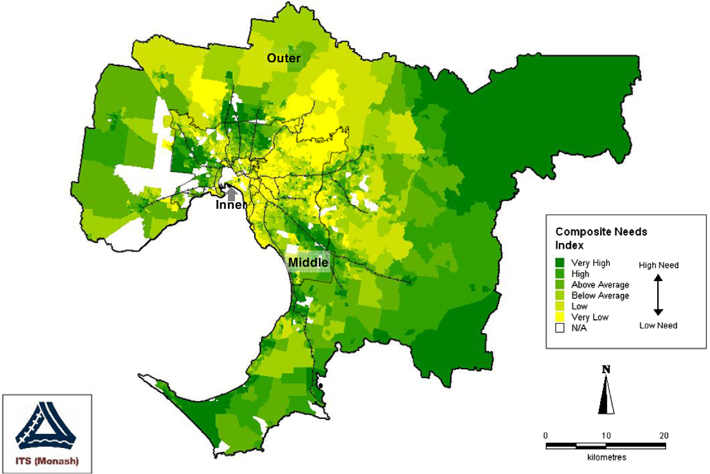

```{r setup, include=FALSE}
library(tidyverse)
library(tidytransit)
library(sp)
library(strayr)
library(ptinpoly)
library(magrittr)
library(ggplot2)
library(sf)
library(ASGS.foyer)
library(raster)
library(ggmap)
library(units)
library(janitor)
library(mapview)
library(ggstatsplot)
library(gtsummary)
library(moments)
library(scales)
library(gtfstools)
library(lubridate)
library(kableExtra)
library(knitr)
library(readxl)
library(readr)
library(dplyr)
library(devtools)
library(gtfssupplyindex)
library(readabs)
library(gglorenz)
library(DescTools)
library(RColorBrewer)
library(lsr)
library(ggpubr)
library(viridis)
library(geosphere)


# invalidate cache when the tufte version changes
#knitr::opts_chunk$set(cache.extra = packageVersion('tufte'))

```


# Introduction
A need to provide at least some motorised mobility 
for those who cannot otherwise drive 
themselves influences transit service levels
in many places [@Currie:2016aa].
Age, 
disability, 
socio-economic status, 
lack of a driver's license 
or vehicle, 
and many other factors 
might make someone
reliant on 
transit services 
for some or all of their travel. 
Social-equity perspectives on transport policy-making, 
especially the desire to improve vertical equity 
so as to better support those who are disadvantaged 
(c.f. @Litman:2016aa), 
might therefore suggest providing at least some transit, 
and probably more than just a minimum, 
to places that have the highest social need for transport.


@Currie2003Hobart, 
@Currie2004Gap,
@Currie2007Identifying and @currie2010identifying 
developed an approach for identifying 
spatial gaps in transit supply related to social needs for transport.
This involves identifying areas with very high needs for transport, 
yet little or no service, and was applied to a case study of 2006 transit service levels in Greater Melbourne, Australia. 
However, there does not appear to have been 
much further use or development 
of this approach. 
As well, it is unclear if
the spatial patterns 
identified in this previous research,
are representative of 
transit supply and social needs 
in other places,
or whether the location of gaps in Melbourne itself have changed in the intervening years.
This may in part be because until recently transit schedule data 
was not readily available in 
consistent, electronic formats, 
meaning that assessing transit supply was a 
large task. 

Nowadays, 
more than 10,000 transit agencies 
publicly release timetable data 
in the General Transit Feed Specification (GTFS)
format [@GTFS]. 
Such standardisation allows Google Maps and 
other online platforms to provide outputs 
for any place with a GTFS feed, 
and has facilitated research 
and other analysis of transit services.
However, tools
for using GTFS data 
to examine spatial 
patterns and gaps 
in transit supply 
with respect to 
social needs for transport
do not appear to be readily available.
This gap, and the lack of 
direct follow up 
to @Currie2003Hobart, 
@Currie2004Gap, 
@Currie2007Identifying 
and @currie2010identifying, 
provide the motivation 
for this paper.

The three main objectives of this research are: 
(1) to develop tools for undertaking needs-gap analysis 
using GTFS datasets; 
(2) to explore whether such gaps in Melbourne have changed since the publication 
of @Currie2007Identifying 
and @currie2010identifying; 
and (3) to better understand whether spatial patterns in 
Melbourne are representative of those in other places.
Research outcomes that are reported in this paper include 
the development of a new R package (gtfssupplyindex) 
with software tools 
that facilitate the 
use of the 
@Currie2003Hobart, 
@Currie2004Gap, 
@Currie2007Identifying 
and @currie2010identifying
approach, 
in particular the calculation of
transit Supply Index (SI) scores 
from GTFS datasets. 
Also presented in this paper 
are results for Australian cities in 2016 and 2021, 
matching the most recent censuses, 
which are compared across locations 
and to the 2006 analysis
of Melbourne reported in @currie2010identifying.

The remainder of this paper is structured as follows:
the next section outlines the background to this research. 
Section 3 describes the study methodology, 
followed by presentation of results in Section 4 
and discussion in Section 5. 
Limitations of this study, 
directions for future research and 
a brief conclusion are provided in Section 6. 

# Research context
## Transit metrics
There are 
many metrics 
available for benchmarking transit services. 
These include those in 
the Transit Cooperative Research Program (TCRP) Report 88, a guidebook 
for developing performance-measurement systems [@Ryus:2003aa]; 
and those
used across benchmarking databases and programs such as @Florida-Transit-Information-System:2018aa, @UITP:2015aa and @Imperial-College-London:2023aa.
The Fielding Triangle [@FieldingGordonJ1987Mpts] 
provides a framework 
for combining indicators of 
service inputs, 
outputs 
and consumption 
to describe cost efficiency, 
cost effectiveness and
service effectiveness. 
More broadly: @Litman:2003ab 
and @Litman:2016aa 
discuss some of the traffic, 
mobility, 
accessibility, 
social equity, 
strategic planning 
and other rational decision-making-based
perspectives underlying many transport indicators; 
@Reynolds:2017ah extends 
these into models of how 
institutionalism, 
incrementalism 
and other public policy analysis concepts 
might apply to decision-making processes 
relating to transit prioritization; 
@GuzmanLuisA.2017Aeit developed a measure of accessibility 
in the context of policy development 
and social equity 
for Latin American Bus Rapid Transit (BRT) networks; and 
@Creutzig2020streetspaceallocation
introduced street space allocation metrics 
based around ten ethical principles. 

However, 
many of these metrics 
may be difficult to calculate, 
explain or understand, 
especially for those who are not planners, engineers 
or other technical specialists. 
Where pre-calculated transit metrics 
are immediately available, 
such as on a website or 
other online platform, 
it may not be possible
to independently generate scores, 
for instance to assess proposed system changes. 
Contrasting examples are provided by:

- Transit Scores [@WalkScore:2023tg], which 
are readily available online 
for locations with a published GTFS feed. 
The meaning of the metric
appears easy to explain, 
with the highest possible score of 100 
representing the sort of transit accessibility 
experienced in the center of New York. 
However, 
the Transit Score algorithm 
is secret, 
and scores cannot be calculated independently
or generated 
for proposed changes to networks. 

- The Transit Capacity and Quality of Service Manual (TCQSM),
which provides a wide range of metrics 
for measuring different aspects of a transit system. 
The TCQSM scores themselves appear easy to understand or explain, 
ranging from A (good) to F (bad), 
although the large number of metrics 
might be somewhat overwhelming for some users.
The scores, however, 
can be calculated independently, given sufficient data. 

The widespread availability of GTFS datasets 
in recent years has facilitated the development of tools, 
such as the Transit Score, 
that apply the same metric to many transit systems. 
@Wong:2013aa provides an example of what can be done 
with GTFS data, 
open metrics and coding,
by reporting the distribution of
various TCQSM metrics 
across 50 USA transit operators. 
Code used in the 
@Wong:2013aa analysis 
is available 
for those who might wish 
to produce a similar study 
for other locations and systems. 
Developing a similar code base, but 
for calculating metrics associated with 
spatial gaps in transit supply based on social needs, 
is the subject of this paper. 

## The Transit Suppy Index
An objective of this study is to 
produce code that 
facilitates calculation of the SI metric
from GTFS data. 
A generalized form of the SI equation, 
adapted from @currie2010identifying, 
is: 

  $$SI_{area, time} = \sum{\frac{Area_{Bn}}{Area_{area}}SL_{n, time}}$$

where:

- $SI_{area, time}$ is the Supply Index for the area of interest 
and a given period of time;

- $Area_{Bn}$ is the buffer area for each stop (n) within the area of interest 
(in @currie2010identifying this was based on 
a radius of 400 metres for bus and tram stops, 
and 800 metres for railway stations);

- $Area_{area}$ is the area of the area of interest; and

- $SL_{n,time}$ is the number of transit arrivals for each stop 
for a given time period.

```{r Currie_map_SI, fig.cap = "Distribution of supply measure scores – Metropolitan Melbourne (2006), Source: Currie (2010)",  echo = FALSE, warning=FALSE, message=FALSE, cache=FALSE, out.width='100%'}

knitr::include_graphics("graphics/Currie2010SI.png")

```

@currie2010identifying reported SI scores 
for Census Collection Districts (CCDs) 
across Metropolitan Melbourne in 2006, 
as shown in 
Figure \ref{fig:Currie_map_SI}.
General patterns were identified, being:
more transit supply 
in the middle and inner suburbs,
and along passenger railway lines; and 
outer areas tending to have very low SI scores 
or no transit supply at all. 

## Social need and needs-gap
As well as measuring transit supply, @currie2010identifying 
assessed the social need for transport 
across Metropolitan Melbourne using: 
the Australian Bureaus of Statistics' Index of Related Socio-Economic Advantage/Disadvantage (IRSAD) and 
a transport needs index derived 
from eight weighted indicators. The spatial distribution of this 
composite social needs index in 2006, 
reproduced in Figure \ref{fig:Currie_map_needs), 
showed that areas of 
above average, 
high and
very high 
social needs 
in 2006 were located in: 
some outer areas, 
particularly in the east and south-east; 
and in some middle areas in the south-east,
north and west.


```{r Currie_chart_gap, fig.cap = "Log supply score and need index values – Melbourne needs-gap study, Source: Currie (2010)",  echo = FALSE, warning=FALSE, message=FALSE, cache=FALSE, out.width='100%'}

#knitr::include_graphics("graphics/Currie2010chart.png")

```


```{r Currie_map_needs, fig.cap = "Distribution of categories of composite social need index scores - Metropolitan Melbourne (2006). Source: Currie (2010.)",  echo = FALSE, warning=FALSE, message=FALSE, cache=FALSE, out.width='100%'}



```


As the final step in the spatial needs-gap analysis, 
@currie2010identifying identified 
areas with very high transport needs, 
but very low or no transit supply,
as reproduced in Figure \ref{fig:Currie_map_gap}. 
These areas were identified as being those where service gaps 
might be of particular concern. 
Most of these were located in outer parts of Melbourne 
in the north-east, south-east and south, 
although there were also some pockets 
in the middle suburbs in the west, north and south east.
Overall, @currie2010identifying found that 
"8.2% of Melbourne residents have ‘very high’ needs 
but ‘zero’, ‘low’ or ‘very low’ public transport supply."


```{r Currie_map_gap, fig.cap = "Distribution of CCDs with very high transport needs and with zero or very low public transport supply - Metropolitan Melbourne (2006). Source: Currie (2010)",  echo = FALSE, warning=FALSE, message=FALSE, cache=FALSE, out.width='100%'}

knitr::include_graphics("graphics/Currie2010gap.png")

```
 

Using this methodology in transit planning 
was suggested as
"substantially more useful than the presentation of anecdotal evidence, 
which is the most common means 
of identifying transport needs 
in local transport studies throughout the world"[@currie2010identifying].
However, it does not appear that this approach 
has been widely adopted 
in practice or by researchers. 
Our suspicion is that while the SI has a relatively simple formula 
and requires only geographic and timetable data to calculate, 
a lack of software tools 
may be partly why it has not been more widely adopted.

It is also unclear 
whether the patterns in Melbourne 
identified in @currie2010identifying 
have changed 
since the 2006 analysis, 
or if Melbourne is representative of other locations. 
Developing a software tool 
to calculate SI tools from GTFS data, 
and then using it to comparing current conditions and other locations 
to the findings of @currie2010identifying, 
therefore, provides the motivation 
for this research.


# Methodology
## Code development

This study developed
a package of tools 
for calculating the SI from GTFS data 
using the R programming language [@R-base].
The recommendations of @wickham2023r 
informed the package setup and 
development approach. 
Various existing packages 
and code examples
were relied upon including: 
the sf package [@R-sf] for geospatial analysis; 
the tidyverse [@tidyverse2019]; 
gtfstools [@R-gtfstools]; and 
tidytransit [@R-tidytransit]. 
Australian Bureau of Statistics (ABS) data was also used, sourced via the strayr 
and absmapsdata packages [@r-strayr].

Code was developed and tested on 
the Mornington Peninsula Tourist Railway GTFS feed. 
This was selected primarily for convenience, 
given that the authors are familiar with 
the surrounding geography 
and that the feed covers 
a small number of trips across 
just three stations.  

## Changes since 2006 in Melbourne
Much has changed since 2006, 
including the spatial geography used by the 
Australian Bureau of Statistics (ABS) to collect census data. 
To allow direct comparison between 2006 and the most recent census, therefore, 
this study calculated SI scores 
using the same 
Census Collection Districts (CCDs) used by 
@currie2010identifying for the week starting the day of the 2021 census.
The Victorian GTFS feed, 
published by Public Transport Victoria (PTV), 
was used with historical feeds sourced via @transitfeeds_victoria:2023aa. 


```{r fix_ptv_data_Victoria_210805, eval = FALSE, echo = FALSE}

ptv_210805 <- tidytransit::read_gtfs("data/ptv_210805/gtfs.zip")
# This results in "Warning: Duplicated ids found in: stops The returned object is not a tidygtfs object, you can use as_tidygtfs() after fixing the issue."

#So, remove the duplicated stops 
#identify duplicate stops
ptv_210805_duplicated_stops <- tabyl(ptv_210805$stops$stop_id) %>% filter (n>1)
names(ptv_210805_duplicated_stops) <- c("stop_id", "n", "percent")
ptv_210805_duplicated_stops <- left_join(ptv_210805_duplicated_stops, ptv_210805$stops)

##discard duplicates
ptv_210805$stops <- ptv_210805$stops[!duplicated(ptv_210805$stops$stop_id),]

## Write gtfs back to file
ptv_210805 <- as_tidygtfs(ptv_210805)
tidytransit::write_gtfs(ptv_210805, "data/ptv_210805/gtfs_duplicate_stops_removed.zip")

## convert to list of tidygtfs objects
ptv_210805_list_gtfs <- gtfssupplyindex::gtfs_by_route_type("data/ptv_210805/gtfs_duplicate_stops_removed.zip")

```

```{r run_for_all_modes_Victoria_210810_CCD, eval = FALSE, echo = FALSE}
list_gtfs = ptv_210805_list_gtfs

#ccd_vic_2006 <- st_read("data/1259030002_cd06avic_shape/CD06aVIC.shp")

asgc2006 <- st_read("data/asgc2006.gpkg", layer = "census_collection_district_2006")
st_geometry(asgc2006) <- "geometry"

melbourne <- asgc2006 %>% 
  filter(MSR_NAME_2006 == "Melbourne") %>%
  select(CD_CODE_2006)

#Load Greater Melbourne CCD codes
areas_of_interest <- load_areas_of_interest(melbourne,  
  area_id_field = "CD_CODE_2006")

buffer_distance <- gtfssupplyindex:::load_buffer_zones()

stops_in_or_near_areas <- gtfssupplyindex:::stops_in_walk_dist(
  list_gtfs = list_gtfs, 
  areas_of_interest = areas_of_interest,
  EPSG_for_transform = 28355,
  verbose = FALSE
)


si_CCD2006_21_census_week <- SI_by_day_hour_and_route_type(
     list_gtfs = list_gtfs, 
stops_in_or_near_areas = stops_in_or_near_areas,
 start_date_ymd = "2021-08-10", 
 end_date_ymd = "2021-08-16",
verbose = TRUE)

write.csv(si_CCD2006_21_census_week, "results/Greater_Melbourne/si_CCD2006_21_census_week.csv")

si_CCD2006_21_census_week <- read_csv("results/Greater_Melbourne/si_CCD2006_21_census_week.csv")

si_CCD2006_21_census_week_aggregated <- si_CCD2006_21_census_week %>% 
           group_by(area_id) %>%    
           summarize(SI = sum(SI))

write.csv(si_CCD2006_21_census_week_aggregated, "results/Greater_Melbourne/si_CCD2006_21_census_week_aggregated.csv")

## Add areas north east of Warburton 2190709 and 2190710 ?
## remove water area around French Island (Western Port) this is CCD 2341923. 

```


```{r fix_ptv_data_Victoria_160804, eval = FALSE, echo = FALSE}
 

ptv_160804 <- tidytransit::read_gtfs("data/ptv_160804/gtfs.zip")
# This results in "Warning: Duplicated ids found in: stops The returned object is not a tidygtfs object, you can use as_tidygtfs() after fixing the issue."

#So, remove the duplicated stops 
#identify duplicate stops
ptv_160804_duplicated_stops <- tabyl(ptv_160804$stops$stop_id) %>% filter (n>1)
names(ptv_160804_duplicated_stops) <- c("stop_id", "n", "percent")
ptv_160804_duplicated_stops <- left_join(ptv_160804_duplicated_stops, ptv_160804$stops)

##discard duplicates
ptv_160804$stops <- ptv_160804$stops[!duplicated(ptv_160804$stops$stop_id),]

## Write gtfs back to file
ptv_160804 <- as_tidygtfs(ptv_160804)
tidytransit::write_gtfs(ptv_160804, "data/ptv_160804/gtfs_duplicate_stops_removed.zip")

```


```{r run_for_all_modes_Victoria_160809_CCD2006, eval = FALSE, echo = FALSE}

## convert to list of tidygtfs objects
ptv_160804_list_gtfs <- gtfssupplyindex::gtfs_by_route_type("data/ptv_160804/gtfs_duplicate_stops_removed.zip")

list_gtfs = ptv_160804_list_gtfs


asgc2006 <- st_read("data/asgc2006.gpkg", layer = "census_collection_district_2006")
st_geometry(asgc2006) <- "geometry"

melbourne <- asgc2006 %>% 
  filter(MSR_NAME_2006 == "Melbourne") %>%
  select(CD_CODE_2006)

#Load Greater Melbourne CCD codes
areas_of_interest <- load_areas_of_interest(melbourne,  
  area_id_field = "CD_CODE_2006")


stops_in_or_near_areas <- gtfssupplyindex:::stops_in_walk_dist(
  list_gtfs = list_gtfs, 
  areas_of_interest = areas_of_interest,
  EPSG_for_transform = 28355,
  verbose = FALSE
)


si_CCD2006_16_census_week <- SI_by_day_hour_and_route_type(
     list_gtfs = list_gtfs, 
stops_in_or_near_areas = stops_in_or_near_areas,
 start_date_ymd = "2016-08-09", 
 end_date_ymd = "2016-08-15",
verbose = TRUE)

write.csv(si_CCD2006_16_census_week, "results/Greater_Melbourne/si_CCD2006_16_census_week")


si_CCD2006_16_census_week_aggregated <- si_CCD2006_16_census_week %>% 
           group_by(area_id) %>%    
           summarize(SI = sum(SI))

write.csv(si_CCD2006_16_census_week_aggregated, "results/Greater_Melbourne/si_CCD2006_16_census_week_aggregated.csv")


```


```{r run_for_all_modes_Victoria_210810_CCD, eval = FALSE, echo = FALSE}
list_gtfs = ptv_210805_list_gtfs

#ccd_vic_2006 <- st_read("data/1259030002_cd06avic_shape/CD06aVIC.shp")

asgc2006 <- st_read("data/asgc2006.gpkg", layer = "census_collection_district_2006")
st_geometry(asgc2006) <- "geometry"

melbourne <- asgc2006 %>% 
  filter(MSR_NAME_2006 == "Melbourne") %>%
  select(CD_CODE_2006)

#Load Greater Melbourne CCD codes
areas_of_interest <- load_areas_of_interest(melbourne,  
  area_id_field = "CD_CODE_2006")

buffer_distance <- gtfssupplyindex:::load_buffer_zones()

stops_in_or_near_areas <- gtfssupplyindex:::stops_in_walk_dist(
  list_gtfs = list_gtfs, 
  areas_of_interest = areas_of_interest,
  EPSG_for_transform = 28355,
  verbose = FALSE
)


si_CCD2006_21_census_week <- SI_by_day_hour_and_route_type(
     list_gtfs = list_gtfs, 
stops_in_or_near_areas = stops_in_or_near_areas,
 start_date_ymd = "2021-08-10", 
 end_date_ymd = "2021-08-16",
verbose = TRUE)

write.csv(si_CCD2006_21_census_week, "results/Greater_Melbourne/si_CCD2006_21_census_week.csv")

si_CCD2006_21_census_week <- read_csv("results/Greater_Melbourne/si_CCD2006_21_census_week.csv")

si_CCD2006_21_census_week_aggregated <- si_CCD2006_21_census_week %>% 
           group_by(area_id) %>%    
           summarize(SI = sum(SI))

write.csv(si_CCD2006_21_census_week_aggregated, "results/Greater_Melbourne/si_CCD2006_21_census_week_aggregated.csv")

## Add areas north east of Warburton 2190709 and 2190710 ?
## remove water area around French Island (Western Port) this is CCD 2341923. 

```


Unfortunately, it is not possible to obtain 
2016 or 2021 social disadvantage data for 
CCDs, as the ABS no longer releases data using this geographic scheme. 
Instead, population and other statistics are now released for 
Statistical Area 1 (SA1) zones, which have been adopted as the areas-of-interest in this study.

## Variation in spatial patterns across location and time. 
SI scores were also calculated for other
capital cities in Australia, for the weeks starting on the days
of the 2016 and 2021 censuses.
Historical GTFS data was again sourced via the Transit Feeds website. 
Unfortunately it was not possible to locate 
2021 GTFS data for Greater Sydney 
or Greater Darwin, 
so SI scores were calculated for 2024 using the 
latest data sets, sourced directly 
from the relevant transit authorities. 

```{r run_for_all_modes_Greater_Melbourne_210810_SA1, eval = FALSE, echo = FALSE}
list_gtfs = ptv_210805_list_gtfs

areas_of_interest <- load_areas_of_interest(
  absmapsdata::sa12021 %>% 
    filter(gcc_name_2021 == "Greater Melbourne") %>%
    select(sa1_code_2021),  
  area_id_field = "sa1_code_2021")

buffer_distance <- gtfssupplyindex:::load_buffer_zones()

stops_in_or_near_areas <- gtfssupplyindex:::stops_in_walk_dist(
  list_gtfs = list_gtfs, 
  areas_of_interest = areas_of_interest,
  EPSG_for_transform = 28355,
  verbose = FALSE
)


si_SA12021_21_census_week <- SI_by_day_hour_and_route_type(
     list_gtfs = list_gtfs, 
stops_in_or_near_areas = stops_in_or_near_areas,
 start_date_ymd = "2021-08-10", 
 end_date_ymd = "2021-08-16",
verbose = TRUE)

write.csv(si_SA12021_21_census_week, "results/Greater_Melbourne/si_SA12021_21_census_week.csv")

si_SA12021_21_census_week <- read_csv("results/Greater_Melbourne/si_SA12021_21_census_week.csv")

si_SA12021_21_census_week_aggregated <- si_SA12021_21_census_week %>% 
           group_by(area_id) %>%    
           summarize(SI = sum(SI))

write.csv(si_SA12021_21_census_week_aggregated, "results/si_SA12021_21_census_week_aggregated.csv")


```


```{r run_for_all_modes_Greater_Brisbane_210810_SA1, eval = FALSE, echo = FALSE}

###The gtfs agency.txt file has been manually edited to add an agency_id field, so that the tidygtfs functions will worl

## convert to list of tidygtfs objects
translink_seq_210805_list_gtfs <- gtfssupplyindex::gtfs_by_route_type("data/translink_seq_210805/gtfs_edited.zip")


list_gtfs = translink_seq_210805_list_gtfs

areas_of_interest <- load_areas_of_interest(
  absmapsdata::sa12021 %>% 
    filter(gcc_name_2021 == "Greater Brisbane") %>%
    select(sa1_code_2021),  
  area_id_field = "sa1_code_2021")

buffer_distance <- gtfssupplyindex:::load_buffer_zones()

stops_in_or_near_areas <- gtfssupplyindex:::stops_in_walk_dist(
  list_gtfs = list_gtfs, 
  areas_of_interest = areas_of_interest,
  EPSG_for_transform = 28355,
  verbose = FALSE
)


brisbane_si_SA12021_21_census_week <- SI_by_day_hour_and_route_type(
     list_gtfs = list_gtfs, 
stops_in_or_near_areas = stops_in_or_near_areas,
 start_date_ymd = "2021-08-10", 
 end_date_ymd = "2021-08-16",
verbose = TRUE)

write.csv(brisbane_si_SA12021_21_census_week, "results/Greater_Brisbane/brisbane_si_SA12021_21_census_week.csv")

brisbane_si_SA12021_21_census_week <- read_csv("results/Greater_Brisbane/brisbane_si_SA12021_21_census_week")

brisbane_si_SA12021_21_census_week_aggregated <- brisbane_si_SA12021_21_census_week %>% 
           group_by(area_id) %>%    
           summarize(SI = sum(SI))

write.csv(brisbane_si_SA12021_21_census_week_aggregated, "results/Greater_Brisbane/brisbane_si_SA12021_21_census_week_aggregated.csv")


```


```{r run_for_all_modes_Greater_Adelaide_210810_SA1, eval = FALSE, echo = FALSE}

###The gtfs agency.txt file has been manually edited to add an agency_id field, so that the tidygtfs functions will worl

## convert to list of tidygtfs objects
adelaide_metro_210716_list_gtfs <- gtfssupplyindex::gtfs_by_route_type("data/adelaide_metro_210716/gtfs.zip")


list_gtfs = adelaide_metro_210716_list_gtfs

areas_of_interest <- load_areas_of_interest(
  absmapsdata::sa12021 %>% 
    filter(gcc_name_2021 == "Greater Adelaide") %>%
    select(sa1_code_2021),  
  area_id_field = "sa1_code_2021")

buffer_distance <- gtfssupplyindex:::load_buffer_zones()

stops_in_or_near_areas <- gtfssupplyindex:::stops_in_walk_dist(
  list_gtfs = list_gtfs, 
  areas_of_interest = areas_of_interest,
  EPSG_for_transform = 28355,
  verbose = FALSE
)


adelaide_si_SA12021_21_census_week <- SI_by_day_hour_and_route_type(
     list_gtfs = list_gtfs, 
stops_in_or_near_areas = stops_in_or_near_areas,
 start_date_ymd = "2021-08-10", 
 end_date_ymd = "2021-08-16",
verbose = TRUE)

write.csv(adelaide_si_SA12021_21_census_week, "results/Greater_Adelaide/adelaide_si_SA12021_21_census_week.csv")

#adelaide_si_SA12021_21_census_week <- read_csv("results/Greater_Adelaide/adelaide_si_SA12021_21_census_week")

adelaide_si_SA12021_21_census_week_aggregated <- adelaide_si_SA12021_21_census_week %>% 
           group_by(area_id) %>%    
           summarize(SI = sum(SI))

write.csv(adelaide_si_SA12021_21_census_week_aggregated, "results/Greater_Adelaide/adelaide_si_SA12021_21_census_week_aggregated.csv")


```
```{r run_for_all_modes_Greater_Hobart_210810_SA1, eval = FALSE, echo = FALSE}

###The gtfs agency.txt file has been manually edited to add an agency_id field, so that the tidygtfs functions will worl

## convert to list of tidygtfs objects
metrotas_hobart_210726_list_gtfs <- gtfssupplyindex::gtfs_by_route_type("data/metrotas_hobart_210726/gtfs.zip")


list_gtfs = metrotas_hobart_210726_list_gtfs

areas_of_interest <- load_areas_of_interest(
  absmapsdata::sa12021 %>% 
    filter(gcc_name_2021 == "Greater Hobart") %>%
    select(sa1_code_2021),  
  area_id_field = "sa1_code_2021")

buffer_distance <- gtfssupplyindex:::load_buffer_zones()

stops_in_or_near_areas <- gtfssupplyindex:::stops_in_walk_dist(
  list_gtfs = list_gtfs, 
  areas_of_interest = areas_of_interest,
  EPSG_for_transform = 28355,
  verbose = FALSE
)


hobart_si_SA12021_21_census_week <- SI_by_day_hour_and_route_type(
     list_gtfs = list_gtfs, 
stops_in_or_near_areas = stops_in_or_near_areas,
 start_date_ymd = "2021-08-10", 
 end_date_ymd = "2021-08-16",
verbose = TRUE)

write.csv(hobart_si_SA12021_21_census_week, "results/Greater_Hobart/hobart_si_SA12021_21_census_week.csv")

#hobart_si_SA12021_21_census_week <- read_csv("results/Greater_Hobart/hobart_si_SA12021_21_census_week")

hobart_si_SA12021_21_census_week_aggregated <- hobart_si_SA12021_21_census_week %>% 
           group_by(area_id) %>%    
           summarize(SI = sum(SI))

write.csv(hobart_si_SA12021_21_census_week_aggregated, "results/Greater_Hobart/hobart_si_SA12021_21_census_week_aggregated.csv")


```

```{r run_for_all_modes_Greater_Perth_210810_SA1, eval = FALSE, echo = FALSE}

###The gtfs agency.txt file has been manually edited to add an agency_id field, so that the tidygtfs functions will worl

## convert to list of tidygtfs objects
transperth_210805_list_gtfs <- gtfssupplyindex::gtfs_by_route_type("data/transperth_210805/gtfs.zip")


list_gtfs = transperth_210805_list_gtfs

areas_of_interest <- load_areas_of_interest(
  absmapsdata::sa12021 %>% 
    filter(gcc_name_2021 == "Greater Perth") %>%
    select(sa1_code_2021),  
  area_id_field = "sa1_code_2021")

buffer_distance <- gtfssupplyindex:::load_buffer_zones()

stops_in_or_near_areas <- gtfssupplyindex:::stops_in_walk_dist(
  list_gtfs = list_gtfs, 
  areas_of_interest = areas_of_interest,
  EPSG_for_transform = 28355,
  verbose = FALSE
)


perth_si_SA12021_21_census_week <- SI_by_day_hour_and_route_type(
     list_gtfs = list_gtfs, 
stops_in_or_near_areas = stops_in_or_near_areas,
 start_date_ymd = "2021-08-10", 
 end_date_ymd = "2021-08-16",
verbose = TRUE)

write.csv(perth_si_SA12021_21_census_week, "results/Greater_Perth/perth_si_SA12021_21_census_week.csv")

#perth_si_SA12021_21_census_week <- read_csv("results/Greater_Perth/perth_si_SA12021_21_census_week")

perth_si_SA12021_21_census_week_aggregated <- perth_si_SA12021_21_census_week %>% 
           group_by(area_id) %>%    
           summarize(SI = sum(SI))

write.csv(perth_si_SA12021_21_census_week_aggregated, "results/Greater_Perth/perth_si_SA12021_21_census_week_aggregated.csv")


```


```{r run_for_all_modes_Greater_Canberra_210810_SA1, eval = FALSE, echo = FALSE}

#Load gtfs for bus and LRT and merge
action_buses_210701 <- gtfstools::read_gtfs("data/action_buses_210701/gtfs.zip") 
canberra_light_rail_210709 <- gtfstools::read_gtfs("data/canberra_light_rail_210709/gtfs.zip") 

canberra_gtfs_merged_2107 <- gtfstools::merge_gtfs(action_buses_210701, canberra_light_rail_210709)

gtfstools::write_gtfs(canberra_gtfs_merged_2107, "data/canberra_gtfs_merge_2107/gtfs.zip")

## convert to list of tidygtfs objects
canberra_merged_2107_list_gtfs <- gtfssupplyindex::gtfs_by_route_type("data/canberra_gtfs_merge_2107/gtfs.zip")


list_gtfs = canberra_merged_2107_list_gtfs

areas_of_interest <- load_areas_of_interest(
  absmapsdata::sa12021 %>% 
    filter(state_name_2021 == "Australian Capital Territory") %>%
    select(sa1_code_2021),  
  area_id_field = "sa1_code_2021")

buffer_distance <- gtfssupplyindex:::load_buffer_zones()

stops_in_or_near_areas <- gtfssupplyindex:::stops_in_walk_dist(
  list_gtfs = list_gtfs, 
  areas_of_interest = areas_of_interest,
  EPSG_for_transform = 28355,
  verbose = FALSE
)


canberra_si_SA12021_21_census_week <- SI_by_day_hour_and_route_type(
     list_gtfs = list_gtfs, 
stops_in_or_near_areas = stops_in_or_near_areas,
 start_date_ymd = "2021-08-10", 
 end_date_ymd = "2021-08-16",
verbose = TRUE)

write.csv(canberra_si_SA12021_21_census_week, "results/Greater_Canberra/canberra_si_SA12021_21_census_week.csv")

#canberra_si_SA12021_21_census_week <- read_csv("results/Greater_Canberra/canberra_si_SA12021_21_census_week")

canberra_si_SA12021_21_census_week_aggregated <- canberra_si_SA12021_21_census_week %>% 
           group_by(area_id) %>%    
           summarize(SI = sum(SI))

write.csv(canberra_si_SA12021_21_census_week_aggregated, "results/Greater_Canberra/canberra_si_SA12021_21_census_week_aggregated.csv")


```


```{r run_for_all_modes_Darwin_240806_SA1, eval = FALSE, echo = FALSE}

## convert to list of tidygtfs objects
darwin_240607_list_gtfs <- gtfssupplyindex::gtfs_by_route_type("data/darwin_240607/google-transit-darwin-20240607.zip")


list_gtfs = darwin_240607_list_gtfs 

areas_of_interest <- load_areas_of_interest(
  absmapsdata::sa12021 %>% 
    filter(gcc_name_2021 == "Greater Darwin") %>%
    select(sa1_code_2021),  
  area_id_field = "sa1_code_2021")

buffer_distance <- gtfssupplyindex:::load_buffer_zones()

stops_in_or_near_areas <- gtfssupplyindex:::stops_in_walk_dist(
  list_gtfs = list_gtfs, 
  areas_of_interest = areas_of_interest,
  EPSG_for_transform = 28355,
  verbose = FALSE
)


darwin_si_SA12021_240806_week <- SI_by_day_hour_and_route_type(
     list_gtfs = list_gtfs, 
stops_in_or_near_areas = stops_in_or_near_areas,
 start_date_ymd = "2024-08-06", 
 end_date_ymd = "2024-08-12",
verbose = TRUE)

write.csv(darwin_si_SA12021_240806_week, "results/Greater_Darwin/darwin_si_SA12021_240806_week.csv")


darwin_si_SA12021_240806_week_aggregated <- darwin_si_SA12021_240806_week %>% 
           group_by(area_id) %>%    
           summarize(SI = sum(SI))

write.csv(darwin_si_SA12021_240806_week_aggregated, "results/Greater_Darwin/darwin_si_SA12021_240806_week_aggregated.csv")


```

```{r run_for_all_modes_Sydney_240806_SA1, eval = FALSE, echo = FALSE}
# Revise routes.txt to remove extended route types
# Outside of R extracted the gtfs.zip
routes <- read_csv("data/sydney_240607/full_greater_sydney_gtfs_static_0/routes.csv")

routes_revised <- routes %>% 
    mutate(route_type = replace(route_type, route_type == 714, 3)) %>% 
    mutate(route_type = replace(route_type, route_type == 700, 3)) %>% 
    mutate(route_type = replace(route_type, route_type == 712, 3)) %>% 
    mutate(route_type = replace(route_type, route_type == 401, 1)) %>% 
    mutate(route_type = replace(route_type, route_type == 204, 3)) %>% 
    mutate(route_type = replace(route_type, route_type == 106, 2)) %>% 
    mutate(route_type = replace(route_type, route_type == 205, 3)) %>% 
    mutate(route_type = replace(route_type, route_type == 900, 0)) 


write.csv(routes_revised, "data/sydney_240607/full_greater_sydney_gtfs_static_0/routes.csv")

# Outside of R renamed routes.csv to routes.txt and zipped the gtfs feed back up again
  

## convert to list of tidygtfs objects
sydney_240607_list_gtfs <- gtfssupplyindex::gtfs_by_route_type("data/sydney_240607/gtfs_revised.zip")


list_gtfs = sydney_240607_list_gtfs

areas_of_interest <- load_areas_of_interest(
  absmapsdata::sa12021 %>% 
    filter(gcc_name_2021 == "Greater Sydney") %>%
    select(sa1_code_2021),  
  area_id_field = "sa1_code_2021")

buffer_distance <- gtfssupplyindex:::load_buffer_zones()

stops_in_or_near_areas <- gtfssupplyindex:::stops_in_walk_dist(
  list_gtfs = list_gtfs, 
  areas_of_interest = areas_of_interest,
  EPSG_for_transform = 28355,
  verbose = FALSE
)


sydney_si_SA12021_240806_week <- SI_by_day_hour_and_route_type(
     list_gtfs = list_gtfs, 
stops_in_or_near_areas = stops_in_or_near_areas,
 start_date_ymd = "2024-08-06", 
 end_date_ymd = "2024-08-12",
verbose = TRUE)

write.csv(sydney_si_SA12021_240806_week, "results/Greater_Sydney/sydney_si_SA12021_240806_week.csv")


sydney_si_SA12021_240806_week_aggregated <- sydney_si_SA12021_240806_week %>% 
           group_by(area_id) %>%    
           summarize(SI = sum(SI))

write.csv(sydney_si_SA12021_240806_week_aggregated, "results/Greater_Sydney/sydney_si_SA12021_240806_week_aggregated.csv")


```


```{r run_for_all_modes_Greater_Adelaide_160809_SA1, eval = FALSE, echo = FALSE}

## convert to list of tidygtfs objects
adelaide_metro_160802_list_gtfs <- gtfssupplyindex::gtfs_by_route_type("data/adelaide_metro_160802/gtfs.zip")

list_gtfs = adelaide_metro_160802_list_gtfs

areas_of_interest <- load_areas_of_interest(
  absmapsdata::sa12021 %>% 
    filter(gcc_name_2021 == "Greater Adelaide") %>%
    select(sa1_code_2021),  
  area_id_field = "sa1_code_2021")

buffer_distance <- gtfssupplyindex:::load_buffer_zones()

stops_in_or_near_areas <- gtfssupplyindex:::stops_in_walk_dist(
  list_gtfs = list_gtfs, 
  areas_of_interest = areas_of_interest,
  EPSG_for_transform = 28355,
  verbose = FALSE
)

adelaide_si_SA12021_16_census_week <- SI_by_day_hour_and_route_type(
     list_gtfs = list_gtfs, 
stops_in_or_near_areas = stops_in_or_near_areas,
 start_date_ymd = "2016-08-09", 
 end_date_ymd = "2016-08-15",
verbose = TRUE)

write.csv(adelaide_si_SA12021_16_census_week, "results/Greater_Adelaide/adelaide_si_SA12021_16_census_week.csv")

#adelaide_si_SA12021_16_census_week <- read_csv("results/Greater_Adelaide/adelaide_si_SA12021_16_census_week")

adelaide_si_SA12021_16_census_week_aggregated <- adelaide_si_SA12021_16_census_week %>% 
           group_by(area_id) %>%    
           summarize(SI = sum(SI))

write.csv(adelaide_si_SA12021_16_census_week_aggregated, "results/Greater_Adelaide/adelaide_si_SA12021_16_census_week_aggregated.csv")


```


```{r run_for_all_modes_Greater_Hobart_160809_SA1, eval = FALSE, echo = FALSE}

###The gtfs agency.txt file has been manually edited to add an agency_id field, so that the tidygtfs functions will worl

## convert to list of tidygtfs objects
metrotas_hobart_160713_list_gtfs <- gtfssupplyindex::gtfs_by_route_type("data/metrotas_hobart_160713/gtfs.zip")


list_gtfs = metrotas_hobart_160713_list_gtfs

areas_of_interest <- load_areas_of_interest(
  absmapsdata::sa12021 %>% 
    filter(gcc_name_2021 == "Greater Hobart") %>%
    select(sa1_code_2021),  
  area_id_field = "sa1_code_2021")

buffer_distance <- gtfssupplyindex:::load_buffer_zones()

stops_in_or_near_areas <- gtfssupplyindex:::stops_in_walk_dist(
  list_gtfs = list_gtfs, 
  areas_of_interest = areas_of_interest,
  EPSG_for_transform = 28355,
  verbose = FALSE
)


hobart_si_SA12021_16_census_week <- SI_by_day_hour_and_route_type(
     list_gtfs = list_gtfs, 
stops_in_or_near_areas = stops_in_or_near_areas,
 start_date_ymd = "2016-08-09", 
 end_date_ymd = "2016-08-15",
verbose = TRUE)

write.csv(hobart_si_SA12021_16_census_week, "results/Greater_Hobart/hobart_si_SA12021_16_census_week.csv")

#hobart_si_SA12021_16_census_week <- read_csv("results/Greater_Hobart/hobart_si_SA12021_16_census_week")

hobart_si_SA12021_16_census_week_aggregated <- hobart_si_SA12021_16_census_week %>% 
           group_by(area_id) %>%    
           summarize(SI = sum(SI))

write.csv(hobart_si_SA12021_16_census_week_aggregated, "results/Greater_Hobart/hobart_si_SA12021_16_census_week_aggregated.csv")


```

```{r run_for_all_modes_Greater_Perth_160809_SA1, eval = FALSE, echo = FALSE}

## convert to list of tidygtfs objects
transperth_160804_list_gtfs <- gtfssupplyindex::gtfs_by_route_type("data/transperth_160804/gtfs.zip")


list_gtfs = transperth_160804_list_gtfs

areas_of_interest <- load_areas_of_interest(
  absmapsdata::sa12021 %>% 
    filter(gcc_name_2021 == "Greater Perth") %>%
    select(sa1_code_2021),  
  area_id_field = "sa1_code_2021")

buffer_distance <- gtfssupplyindex:::load_buffer_zones()

stops_in_or_near_areas <- gtfssupplyindex:::stops_in_walk_dist(
  list_gtfs = list_gtfs, 
  areas_of_interest = areas_of_interest,
  EPSG_for_transform = 28355,
  verbose = FALSE
)


perth_si_SA12021_16_census_week <- SI_by_day_hour_and_route_type(
     list_gtfs = list_gtfs, 
stops_in_or_near_areas = stops_in_or_near_areas,
 start_date_ymd = "2016-08-09", 
 end_date_ymd = "2016-08-15",
verbose = TRUE)

write.csv(perth_si_SA12021_16_census_week, "results/Greater_Perth/perth_si_SA12021_16_census_week.csv")

#perth_si_SA12021_16_census_week <- read_csv("results/Greater_Perth/perth_si_SA12021_16_census_week")

perth_si_SA12021_16_census_week_aggregated <- perth_si_SA12021_16_census_week %>% 
           group_by(area_id) %>%    
           summarize(SI = sum(SI))

write.csv(perth_si_SA12021_16_census_week_aggregated, "results/Greater_Perth/perth_si_SA12021_16_census_week_aggregated.csv")


```


```{r run_for_all_modes_Darwin_160809_SA1, eval = FALSE, echo = FALSE}

## convert to list of tidygtfs objects
darwin_160203_list_gtfs <- gtfssupplyindex::gtfs_by_route_type("data/darwin_160203/gtfs.zip")

list_gtfs = darwin_160203_list_gtfs

areas_of_interest <- load_areas_of_interest(
  absmapsdata::sa12021 %>% 
    filter(gcc_name_2021 == "Greater Darwin") %>%
    select(sa1_code_2021),  
  area_id_field = "sa1_code_2021")

buffer_distance <- gtfssupplyindex:::load_buffer_zones()

stops_in_or_near_areas <- gtfssupplyindex:::stops_in_walk_dist(
  list_gtfs = list_gtfs, 
  areas_of_interest = areas_of_interest,
  EPSG_for_transform = 28355,
  verbose = FALSE
)


darwin_si_SA12021_16_week <- SI_by_day_hour_and_route_type(
     list_gtfs = list_gtfs, 
stops_in_or_near_areas = stops_in_or_near_areas,
 start_date_ymd = "2016-08-09", 
 end_date_ymd = "2016-08-15",
verbose = TRUE)

write.csv(darwin_si_SA12021_16_week, "results/Greater_Darwin/darwin_si_SA12021_16_week.csv")


darwin_si_SA12021_16_week_aggregated <- darwin_si_SA12021_16_week %>% 
           group_by(area_id) %>%    
           summarize(SI = sum(SI))

write.csv(darwin_si_SA12021_16_week_aggregated, "results/Greater_Darwin/darwin_si_SA12021_16_week_aggregated.csv")


```


```{r run_for_all_modes_Sydney_160809_SA1, eval = FALSE, echo = FALSE}


## convert to list of tidygtfs objects
sydney_160805_list_gtfs <- gtfssupplyindex::gtfs_by_route_type("data/sydney_160805/gtfs.zip")


list_gtfs = sydney_160805_list_gtfs

areas_of_interest <- load_areas_of_interest(
  absmapsdata::sa12021 %>% 
    filter(gcc_name_2021 == "Greater Sydney") %>%
    select(sa1_code_2021),  
  area_id_field = "sa1_code_2021")

buffer_distance <- gtfssupplyindex:::load_buffer_zones()

stops_in_or_near_areas <- gtfssupplyindex:::stops_in_walk_dist(
  list_gtfs = list_gtfs, 
  areas_of_interest = areas_of_interest,
  EPSG_for_transform = 28355,
  verbose = FALSE
)


sydney_si_SA12021_16_week <- SI_by_day_hour_and_route_type(
     list_gtfs = list_gtfs, 
stops_in_or_near_areas = stops_in_or_near_areas,
 start_date_ymd = "2016-08-09", 
 end_date_ymd = "2016-08-15",
verbose = TRUE)

write.csv(sydney_si_SA12021_16_week, "results/Greater_Sydney/sydney_si_SA12021_16_week.csv")


sydney_si_SA12021_16_week_aggregated <- sydney_si_SA12021_16_week %>% 
           group_by(area_id) %>%    
           summarize(SI = sum(SI))

write.csv(sydney_si_SA12021_16_week_aggregated, "results/Greater_Sydney/sydney_si_SA12021_16_week_aggregated.csv")


```


```{r run_for_all_modes_Victoria_160809_SA12021, eval = FALSE, echo = FALSE}

## convert to list of tidygtfs objects
ptv_160804_list_gtfs <- gtfssupplyindex::gtfs_by_route_type("data/ptv_160804/gtfs_duplicate_stops_removed.zip")


list_gtfs = ptv_160804_list_gtfs

areas_of_interest <- load_areas_of_interest(
  absmapsdata::sa12021 %>% 
    filter(gcc_name_2021 == "Greater Melbourne") %>%
    select(sa1_code_2021),  
  area_id_field = "sa1_code_2021")

stops_in_or_near_areas <- gtfssupplyindex:::stops_in_walk_dist(
  list_gtfs = list_gtfs, 
  areas_of_interest = areas_of_interest,
  EPSG_for_transform = 28355,
  verbose = FALSE
)


si_SA12021_16_census_week <- SI_by_day_hour_and_route_type(
     list_gtfs = list_gtfs, 
stops_in_or_near_areas = stops_in_or_near_areas,
 start_date_ymd = "2016-08-09", 
 end_date_ymd = "2016-08-15",
verbose = TRUE)

write.csv(si_SA12021_16_census_week, "results/Greater_Melbourne/si_SA12021_16_census_week")


si_SA12021_16_census_week_aggregated <- si_SA12021_16_census_week %>% 
           group_by(area_id) %>%    
           summarize(SI = sum(SI))

write.csv(si_SA12021_16_census_week_aggregated, "results/Greater_Melbourne/si_SA12021_16_census_week_aggregated.csv")


```

```{r run_for_all_modes_Victoria_160809_2016SA1s, eval = FALSE, echo = FALSE}
list_gtfs = ptv_160804_list_gtfs

areas_of_interest <- load_areas_of_interest(
  absmapsdata::sa12016 %>% 
    filter(gcc_name_2021 == "Greater Melbourne") %>%
    select(sa1_code_2021),  
  area_id_field = "sa1_code_2021")

stops_in_or_near_areas <- gtfssupplyindex:::stops_in_walk_dist(
  list_gtfs = list_gtfs, 
  areas_of_interest = areas_of_interest,
  EPSG_for_transform = 28355,
  verbose = FALSE
)


si_SA12016_16_census_week <- SI_by_day_hour_and_route_type(
     list_gtfs = list_gtfs, 
stops_in_or_near_areas = stops_in_or_near_areas,
 start_date_ymd = "2016-08-09", 
 end_date_ymd = "2016-08-15",
verbose = TRUE)

write.csv(si_SA12016_16_census_week, "results/Greater_Melbourne/si_SA12016_16_census_week")


si_SA12016_16_census_week_aggregated <- si_SA12016_16_census_week %>% 
           group_by(area_id) %>%    
           summarize(SI = sum(SI))

write.csv(si_SA12016_16_census_week_aggregated, "results/Greater_Melbourne/si_SA12016_16_census_week_aggregated.csv")


```


```{r run_for_all_modes_Greater_Brisbane_160809_2021SA1, eval = FALSE, echo = FALSE}

## convert to list of tidygtfs objects
translink_seq_160808_list_gtfs <- gtfssupplyindex::gtfs_by_route_type("data/translink_seq_160808/gtfs_edited.zip")

list_gtfs = translink_seq_160808_list_gtfs

areas_of_interest <- load_areas_of_interest(
  absmapsdata::sa12021 %>% 
    filter(gcc_name_2021 == "Greater Brisbane") %>%
    select(sa1_code_2021),  
  area_id_field = "sa1_code_2021")

buffer_distance <- gtfssupplyindex:::load_buffer_zones()

stops_in_or_near_areas <- gtfssupplyindex:::stops_in_walk_dist(
  list_gtfs = list_gtfs, 
  areas_of_interest = areas_of_interest,
  EPSG_for_transform = 28355,
  verbose = FALSE
)


brisbane_si_SA12021_16_census_week <- SI_by_day_hour_and_route_type(
     list_gtfs = list_gtfs, 
stops_in_or_near_areas = stops_in_or_near_areas,
 start_date_ymd = "2016-08-09", 
 end_date_ymd = "2016-08-15",
verbose = TRUE)

write.csv(brisbane_si_SA12021_16_census_week, "results/Greater_Brisbane/brisbane_si_SA12021_16_census_week.csv")

#brisbane_si_SA12021_16_census_week <- read_csv("results/Greater_Brisbane/brisbane_si_SA12021_16_census_week.csv")

brisbane_si_SA12021_16_census_week_aggregated <- brisbane_si_SA12021_16_census_week %>% 
           group_by(area_id) %>%    
           summarize(SI = sum(SI))

write.csv(brisbane_si_SA12021_16_census_week_aggregated, "results/Greater_Brisbane/brisbane_si_SA12021_16_census_week_aggregated.csv")


```


```{r run_for_all_modes_Greater_Brisbane_160809_SA12016, eval = FALSE, echo = FALSE}


###The gtfs agency.txt file has been manually edited to add an agency_id field, so that the tidygtfs functions will worl

## convert to list of tidygtfs objects
translink_seq_160808_list_gtfs <- gtfssupplyindex::gtfs_by_route_type("data/translink_seq_160808/gtfs_edited.zip")


list_gtfs = translink_seq_160808_list_gtfs

areas_of_interest <- load_areas_of_interest(
  absmapsdata::sa12016 %>% 
    filter(gcc_name_2016 == "Greater Brisbane") %>%
    select(sa1_code_2016),  
  area_id_field = "sa1_code_2016")

buffer_distance <- gtfssupplyindex:::load_buffer_zones()

stops_in_or_near_areas <- gtfssupplyindex:::stops_in_walk_dist(
  list_gtfs = list_gtfs, 
  areas_of_interest = areas_of_interest,
  EPSG_for_transform = 28355,
  verbose = FALSE
)


brisbane_si_SA12016_16_census_week <- SI_by_day_hour_and_route_type(
     list_gtfs = list_gtfs, 
stops_in_or_near_areas = stops_in_or_near_areas,
 start_date_ymd = "2016-08-09", 
 end_date_ymd = "2016-08-15",
verbose = TRUE)

write.csv(brisbane_si_SA12016_16_census_week, "results/Greater_Brisbane/brisbane_si_SA12016_16_census_week.csv")

#brisbane_si_SA12016_16_census_week <- read_csv("results/Greater_Brisbane/brisbane_si_SA12016_16_census_week.csv")

brisbane_si_SA12016_16_census_week_aggregated <- brisbane_si_SA12016_16_census_week %>% 
           group_by(area_id) %>%    
           summarize(SI = sum(SI))

write.csv(brisbane_si_SA12016_16_census_week_aggregated, "results/Greater_Brisbane/brisbane_si_SA12016_16_census_week_aggregated.csv")


```


```{r run_for_all_modes_Greater_Adelaide_160809_SA12016, eval = FALSE, echo = FALSE}

## convert to list of tidygtfs objects
adelaide_metro_160802_list_gtfs <- gtfssupplyindex::gtfs_by_route_type("data/adelaide_metro_160802/gtfs.zip")

list_gtfs = adelaide_metro_160802_list_gtfs

areas_of_interest <- load_areas_of_interest(
  absmapsdata::sa12016 %>% 
    filter(gcc_name_2016 == "Greater Adelaide") %>%
    select(sa1_code_2016),  
  area_id_field = "sa1_code_2016")

buffer_distance <- gtfssupplyindex:::load_buffer_zones()

stops_in_or_near_areas <- gtfssupplyindex:::stops_in_walk_dist(
  list_gtfs = list_gtfs, 
  areas_of_interest = areas_of_interest,
  EPSG_for_transform = 28355,
  verbose = FALSE
)

adelaide_si_SA12016_16_census_week <- SI_by_day_hour_and_route_type(
     list_gtfs = list_gtfs, 
stops_in_or_near_areas = stops_in_or_near_areas,
 start_date_ymd = "2016-08-09", 
 end_date_ymd = "2016-08-15",
verbose = TRUE)

write.csv(adelaide_si_SA12016_16_census_week, "results/Greater_Adelaide/adelaide_si_SA12016_16_census_week.csv")

#adelaide_si_SA12016_16_census_week <- read_csv("results/Greater_Adelaide/adelaide_si_SA12016_16_census_week")

adelaide_si_SA12016_16_census_week_aggregated <- adelaide_si_SA12016_16_census_week %>% 
           group_by(area_id) %>%    
           summarize(SI = sum(SI))

write.csv(adelaide_si_SA12016_16_census_week_aggregated, "results/Greater_Adelaide/adelaide_si_SA12016_16_census_week_aggregated.csv")


```


```{r run_for_all_modes_Greater_Hobart_160809_SA12016, eval = FALSE, echo = FALSE}

###The gtfs agency.txt file has been manually edited to add an agency_id field, so that the tidygtfs functions will worl

## convert to list of tidygtfs objects
metrotas_hobart_160713_list_gtfs <- gtfssupplyindex::gtfs_by_route_type("data/metrotas_hobart_160713/gtfs.zip")


list_gtfs = metrotas_hobart_160713_list_gtfs

areas_of_interest <- load_areas_of_interest(
  absmapsdata::sa12016 %>% 
    filter(gcc_name_2016 == "Greater Hobart") %>%
    select(sa1_code_2016),  
  area_id_field = "sa1_code_2016")

buffer_distance <- gtfssupplyindex:::load_buffer_zones()

stops_in_or_near_areas <- gtfssupplyindex:::stops_in_walk_dist(
  list_gtfs = list_gtfs, 
  areas_of_interest = areas_of_interest,
  EPSG_for_transform = 28355,
  verbose = FALSE
)


hobart_si_SA12016_16_census_week <- SI_by_day_hour_and_route_type(
     list_gtfs = list_gtfs, 
stops_in_or_near_areas = stops_in_or_near_areas,
 start_date_ymd = "2016-08-09", 
 end_date_ymd = "2016-08-15",
verbose = TRUE)

write.csv(hobart_si_SA12016_16_census_week, "results/Greater_Hobart/hobart_si_SA12016_16_census_week.csv")

#hobart_si_SA12016_16_census_week <- read_csv("results/Greater_Hobart/hobart_si_SA12016_16_census_week")

hobart_si_SA12016_16_census_week_aggregated <- hobart_si_SA12016_16_census_week %>% 
           group_by(area_id) %>%    
           summarize(SI = sum(SI))

write.csv(hobart_si_SA12016_16_census_week_aggregated, "results/Greater_Hobart/hobart_si_SA12016_16_census_week_aggregated.csv")


```

```{r run_for_all_modes_Greater_Perth_160809_SA12016, eval = FALSE, echo = FALSE}

## convert to list of tidygtfs objects
transperth_160804_list_gtfs <- gtfssupplyindex::gtfs_by_route_type("data/transperth_160804/gtfs.zip")


list_gtfs = transperth_160804_list_gtfs

areas_of_interest <- load_areas_of_interest(
  absmapsdata::sa12016 %>% 
    filter(gcc_name_2016 == "Greater Perth") %>%
    select(sa1_code_2016),  
  area_id_field = "sa1_code_2016")

buffer_distance <- gtfssupplyindex:::load_buffer_zones()

stops_in_or_near_areas <- gtfssupplyindex:::stops_in_walk_dist(
  list_gtfs = list_gtfs, 
  areas_of_interest = areas_of_interest,
  EPSG_for_transform = 28355,
  verbose = FALSE
)


perth_si_SA12016_16_census_week <- SI_by_day_hour_and_route_type(
     list_gtfs = list_gtfs, 
stops_in_or_near_areas = stops_in_or_near_areas,
 start_date_ymd = "2016-08-09", 
 end_date_ymd = "2016-08-15",
verbose = TRUE)

write.csv(perth_si_SA12016_16_census_week, "results/Greater_Perth/perth_si_SA12016_16_census_week.csv")

#perth_si_SA12016_16_census_week <- read_csv("results/Greater_Perth/perth_si_SA12016_16_census_week")

perth_si_SA12016_16_census_week_aggregated <- perth_si_SA12016_16_census_week %>% 
           group_by(area_id) %>%    
           summarize(SI = sum(SI))

write.csv(perth_si_SA12016_16_census_week_aggregated, "results/Greater_Perth/perth_si_SA12016_16_census_week_aggregated.csv")


```


```{r run_for_all_modes_Greater_Canberra_160809_SA12021, eval = FALSE, echo = FALSE}
# edited GTFS to add agency_id field


## convert to list of tidygtfs objects
act_160803_list_gtfs <- gtfssupplyindex::gtfs_by_route_type("data/act_160803/gtfs_edited.zip")


list_gtfs = act_160803_list_gtfs

areas_of_interest <- load_areas_of_interest(
  absmapsdata::sa12021 %>% 
    filter(state_name_2021 == "Australian Capital Territory") %>%
    select(sa1_code_2021),  
  area_id_field = "sa1_code_2021")

buffer_distance <- gtfssupplyindex:::load_buffer_zones()

stops_in_or_near_areas <- gtfssupplyindex:::stops_in_walk_dist(
  list_gtfs = list_gtfs, 
  areas_of_interest = areas_of_interest,
  EPSG_for_transform = 28355,
  verbose = FALSE
)


canberra_si_SA12021_16_census_week <- SI_by_day_hour_and_route_type(
     list_gtfs = list_gtfs, 
stops_in_or_near_areas = stops_in_or_near_areas,
 start_date_ymd = "2016-08-09", 
 end_date_ymd = "2016-08-15",
verbose = TRUE)

write.csv(canberra_si_SA12021_16_census_week, "results/Greater_Canberra/canberra_si_SA12021_16_census_week.csv")

#canberra_si_SA12021_16_census_week <- read_csv("results/Greater_Canberra/canberra_si_SA12021_16_census_week")

canberra_si_SA12021_16_census_week_aggregated <- canberra_si_SA12021_16_census_week %>% 
           group_by(area_id) %>%    
           summarize(SI = sum(SI))

write.csv(canberra_si_SA12021_16_census_week_aggregated, "results/Greater_Canberra/canberra_si_SA12021_16_census_week_aggregated.csv")


```


```{r run_for_all_modes_Greater_Canberra_160809_SA12016, eval = FALSE, echo = FALSE}

## convert to list of tidygtfs objects
act_160803_list_gtfs <- gtfssupplyindex::gtfs_by_route_type("data/act_160803/gtfs_edited.zip")


list_gtfs = act_160803_list_gtfs

areas_of_interest <- load_areas_of_interest(
  absmapsdata::sa12016 %>% 
    filter(state_name_2016 == "Australian Capital Territory") %>%
    select(sa1_code_2016),  
  area_id_field = "sa1_code_2016")

buffer_distance <- gtfssupplyindex:::load_buffer_zones()

stops_in_or_near_areas <- gtfssupplyindex:::stops_in_walk_dist(
  list_gtfs = list_gtfs, 
  areas_of_interest = areas_of_interest,
  EPSG_for_transform = 28355,
  verbose = FALSE
)


canberra_si_SA12016_16_census_week <- SI_by_day_hour_and_route_type(
     list_gtfs = list_gtfs, 
stops_in_or_near_areas = stops_in_or_near_areas,
 start_date_ymd = "2016-08-09", 
 end_date_ymd = "2016-08-15",
verbose = TRUE)

write.csv(canberra_si_SA12016_16_census_week, "results/Greater_Canberra/canberra_si_SA12016_16_census_week.csv")

#canberra_si_SA12016_16_census_week <- read_csv("results/Greater_Canberra/canberra_si_SA12016_16_census_week")

canberra_si_SA12016_16_census_week_aggregated <- canberra_si_SA12016_16_census_week %>% 
           group_by(area_id) %>%    
           summarize(SI = sum(SI))

write.csv(canberra_si_SA12016_16_census_week_aggregated, "results/Greater_Canberra/canberra_si_SA12016_16_census_week_aggregated.csv")


```


```{r run_for_all_modes_Darwin_160809_SA12016, eval = FALSE, echo = FALSE}

## convert to list of tidygtfs objects
darwin_160203_list_gtfs <- gtfssupplyindex::gtfs_by_route_type("data/darwin_160203/gtfs.zip")

list_gtfs = darwin_160203_list_gtfs

areas_of_interest <- load_areas_of_interest(
  absmapsdata::sa12016 %>% 
    filter(gcc_name_2016 == "Greater Darwin") %>%
    select(sa1_code_2016),  
  area_id_field = "sa1_code_2016")

buffer_distance <- gtfssupplyindex:::load_buffer_zones()

stops_in_or_near_areas <- gtfssupplyindex:::stops_in_walk_dist(
  list_gtfs = list_gtfs, 
  areas_of_interest = areas_of_interest,
  EPSG_for_transform = 28355,
  verbose = FALSE
)


darwin_si_SA12016_16_week <- SI_by_day_hour_and_route_type(
     list_gtfs = list_gtfs, 
stops_in_or_near_areas = stops_in_or_near_areas,
 start_date_ymd = "2016-08-09", 
 end_date_ymd = "2016-08-15",
verbose = TRUE)

write.csv(darwin_si_SA12016_16_week, "results/Greater_Darwin/darwin_si_SA12016_16_week.csv")


darwin_si_SA12016_16_week_aggregated <- darwin_si_SA12016_16_week %>% 
           group_by(area_id) %>%    
           summarize(SI = sum(SI))

write.csv(darwin_si_SA12016_16_week_aggregated, "results/Greater_Darwin/darwin_si_SA12016_16_week_aggregated.csv")


```


```{r run_for_all_modes_Sydney_160809_SA12016, eval = FALSE, echo = FALSE}


## convert to list of tidygtfs objects
sydney_160805_list_gtfs <- gtfssupplyindex::gtfs_by_route_type("data/sydney_160805/gtfs.zip")


list_gtfs = sydney_160805_list_gtfs

areas_of_interest <- load_areas_of_interest(
  absmapsdata::sa12016 %>% 
    filter(gcc_name_2016 == "Greater Sydney") %>%
    select(sa1_code_2016),  
  area_id_field = "sa1_code_2016")

buffer_distance <- gtfssupplyindex:::load_buffer_zones()

stops_in_or_near_areas <- gtfssupplyindex:::stops_in_walk_dist(
  list_gtfs = list_gtfs, 
  areas_of_interest = areas_of_interest,
  EPSG_for_transform = 28355,
  verbose = FALSE
)


sydney_si_SA12016_16_week <- SI_by_day_hour_and_route_type(
     list_gtfs = list_gtfs, 
stops_in_or_near_areas = stops_in_or_near_areas,
 start_date_ymd = "2016-08-09", 
 end_date_ymd = "2016-08-15",
verbose = TRUE)

write.csv(sydney_si_SA12016_16_week, "results/Greater_Sydney/sydney_si_SA12016_16_week.csv")


sydney_si_SA12016_16_week_aggregated <- sydney_si_SA12016_16_week %>% 
           group_by(area_id) %>%    
           summarize(SI = sum(SI))

write.csv(sydney_si_SA12016_16_week_aggregated, "results/Greater_Sydney/sydney_si_SA12016_16_week_aggregated.csv")


```


## Measuring social disadvantage
This study adopts a similar approach to measuring social disadvantage 
as used in @currie2010identifying, using: 
the ABS' Index of Relative Socio-Economic Advantage/Disadvantage (IRSAD); and
a transport needs index^[The same need indicators and weightings used in @currie2010identifying were adopted, although
\$799 or lower per week was used
as the  threshold for low income households 
rather than \$499 
to account for inflation 
(as per the Reserve Bank of Australia's online inflation calculator).].
A composite needs indicator was derived 
based on the IRSAD and the transport needs index, 
again as per the @currie2010identifying approach. However, 
changes to the ABS reporting systems mean
that the composite needs indicator 
had to be based on weighting both the IRSAD index and the transport need index 
by the total population of each SA1 zone, 
which were then added, standardised and split into six groups^[This contrasts to the method used by @currie2010identifying, where the composite needs index also included relative need components, being the IRSAD and the transport needs indexes weighted by the population within the various needs groups in each area of interest (for a total of four indicators included in the composite needs indicator, compared to only two in the 2016 and 2021 results presented here.]. 


```{r read_ABS_data_2021, fig.show="hold", echo = FALSE, warning=FALSE, message=FALSE, cache=TRUE, fig.fullwidth = TRUE, fig.cap="SI scores by SA3, census day 2016 and 2021"}

#read IRSAD 2021 and remove non-data rows
sa1_irsad_2021 <- read_excel("data/Statistical Area Level 1, Indexes, SEIFA 2021.xlsx", 
    sheet = "Table 3", skip = 5)
sa1_irsad_2021 <- sa1_irsad_2021 %>% filter(row_number() <= n()-3)
sa1_irsad_2021 <- sa1_irsad_2021 %>% 
  clean_names()

#read students 2021 and remove non-data rows
sa1_students_2021 <- read_csv("data/sa1_students.csv", 
    skip = 8)
sa1_students_2021 <- sa1_students_2021[-1,]
sa1_students_2021 <- sa1_students_2021 %>% filter(row_number() <= n()-5)

#read not in labour force in 2021 and remove non-data rows
#this dataset contains a single 'wafer', 
# being those people not in the labour force, separated by age and sa1
sa1_not_in_labour_force_2021 <- read_csv("data/sa1_not_in_labour_force_2021.csv", 
    skip = 10)
sa1_not_in_labour_force_2021 <- sa1_not_in_labour_force_2021[-1,]
#not_in_labour_force csv from ABS repeats the entire dataset, hence only read in first set
sa1_not_in_labour_force_2021 <- sa1_not_in_labour_force_2021 %>% filter(row_number() <= n()-61844)


#calculate number of adults not in labour force (ie 18+)
sa1_not_in_labour_force_2021$adult_not_labour_force <- rowSums (sa1_not_in_labour_force_2021[,20:117])
  


#read no car in 2021 and remove non-data rows
#this dataset contains a single 'wafer', 
# being those people living in a household with no car, separated by age and sa1
sa1_no_car_2021 <- read_csv("data/sa1_no_car_2021.csv", 
    skip = 8)
sa1_no_car_2021 <- sa1_no_car_2021[-1,]
sa1_no_car_2021 <- sa1_no_car_2021 %>% filter(row_number() <= n()-5)
#calculate number of adults with no car (ie 18+)
sa1_no_car_2021$adult_no_car <- rowSums(sa1_no_car_2021[,20:117])


#read low income in 2021 and remove non-data rows
sa1_low_income_2021 <- read_csv("data/sa1_low_income.csv", 
    skip = 8)
sa1_low_income_2021 <- sa1_low_income_2021[-1,]
sa1_low_income_2021 <- sa1_low_income_2021 %>% filter(row_number() <= n()-5)

#read disability support pension in 2021 and remove non-data rows
sa1_disability_support_pension_2021 <- read_csv("data/sa1_disability_2021.csv", 
    skip = 8)
sa1_disability_support_pension_2021 <- sa1_disability_support_pension_2021[-1,]
sa1_disability_support_pension_2021 <- sa1_disability_support_pension_2021 %>% filter(row_number() <= n()-5)


#read age in 2021 and remove non-data rows
sa1_age_2021 <- read_csv("data/sa1_age.csv", 
    skip = 8)
sa1_age_2021 <- sa1_age_2021[-1,]
sa1_age_2021 <- sa1_age_2021 %>% filter(row_number() <= n()-5)

#calculate number of people over 60.
sa1_age_2021$over_60 <- rowSums(sa1_age_2021[,63:117])

#calculate number of persons 5 to 9 years old.
sa1_age_2021$persons_5_to_9 <- rowSums(sa1_age_2021[,7:11]) 
#move age-related indicators into social indicators table. 
social_2021_sa1 <- sa1_age_2021 %>% 
  select(`AGEP Age`, over_60, persons_5_to_9)
names(social_2021_sa1) <- c("sa1_code_2021", "over_60", "five_to_nine")

#join Adults without Cars
social_2021_sa1 <- full_join(social_2021_sa1, 
                             sa1_no_car_2021 %>% 
                               select("AGEP Age", "adult_no_car"), 
                             by = join_by( "sa1_code_2021" == "AGEP Age"))

#join disability pension 
sa1_disability_support_pension_2021 <-  sa1_disability_support_pension_2021 %>% 
  clean_names()
  
social_2021_sa1 <- full_join(social_2021_sa1, 
                             sa1_disability_support_pension_2021 %>% 
                               select(
                                 "igap_main_type_of_personal_government_benefit_payment_administrative_data", 
                                      "disability_support_pension"),
                             by = join_by(
                               "sa1_code_2021" == "igap_main_type_of_personal_government_benefit_payment_administrative_data"))


#join low income households
sa1_low_income_2021$low_income_families <- rowSums(sa1_low_income_2021[,2:9])
social_2021_sa1 <- full_join(social_2021_sa1, 
                             sa1_low_income_2021 %>% 
                               select("FINASF Total Family Income as Stated (weekly)", "low_income_families"), 
                             by = join_by( "sa1_code_2021" == "FINASF Total Family Income as Stated (weekly)"))


#join adults not in labour force
social_2021_sa1 <- full_join(social_2021_sa1 %>% na.omit(), 
                             sa1_not_in_labour_force_2021 %>% 
                               select("AGEP Age", "adult_not_labour_force") %>%
                               na.omit(), 
                             by = join_by("sa1_code_2021" == "AGEP Age"))

#join students
sa1_students_2021$students <- sa1_students_2021$Total
social_2021_sa1 <- full_join(social_2021_sa1, 
                             sa1_students_2021 %>% 
                               select("STUP Full-Time/Part-Time Student Status", "students"), 
                             by = join_by( "sa1_code_2021" == "STUP Full-Time/Part-Time Student Status"))

#join IRSAD scores
sa1_irsad_2021$x2021_statistical_area_level_1_sa1 <- sa1_irsad_2021$x2021_statistical_area_level_1_sa1 %>% 
  as.character()
names(sa1_irsad_2021) <- c("sa1_code_2021", 
                           "usual_resident_population",
                           "IRSAD", 
                           "x4", 
                           "rank_in_australia", 
                           "decile_in_australia",
                           "percentile_in_australia", 
                           "x8", 
                           "state", 
                           "rank_in_state",
                           "decile_in_state",
                           "percentile_in_state")

social_2021_sa1 <- full_join(social_2021_sa1, 
                             sa1_irsad_2021 %>% 
                               select("sa1_code_2021", "IRSAD"))


#join SA1 enumerated population
social_2021_sa1 <- full_join(social_2021_sa1, 
                             sa1_age_2021 %>% 
                               select("AGEP Age", "Total"), 
                             by = join_by("sa1_code_2021" == "AGEP Age"))

names(social_2021_sa1) <- c("sa1_code_2021", 
                            "over_60", "age_five_to_nine", 
                            "adult_no_car", 
                            "disability_support_pension",
                            "low_income_families",
                            "adult_not_labour_force",
                            "students", 
                            "IRSAD", 
                            "population")

##Rescaling to 0-100 and adding the accessibility indicator needs to be done on a areas_of_interest by areas_of_interest bias, as which areas are included will matter. 

```


```{r read_ABS_data_2016, fig.show="hold", echo = FALSE, warning=FALSE, message=FALSE, cache=TRUE, fig.fullwidth = TRUE, fig.cap="SI scores by SA3, census day 2016 and 2021"}

#read IRSAD 2016 and remove non-data rows
sa1_irsad_2016 <- read_excel("data/2033055001 - sa1 indexes.xls", 
    sheet = "Table 3", skip = 4)
names(sa1_irsad_2016) <- c("sa1_code_2016", 
                           "sa1_code_2016_11_digit", 
                           "usual_resident_population", 
                           "IRSAD",
                           "x4",
                           "rank_in_australia",
                           "decile_in_australia",
                           "percentile_in_australia",
                           "x8",
                           "state", 
                           "rank_in_state", 
                           "decile_in_state", 
                           "percentile_in_state")

sa1_irsad_2016 <- sa1_irsad_2016[-1,]
sa1_irsad_2016 <- sa1_irsad_2016 %>% filter(row_number() <= n()-2)

#read students 2016 and remove non-data rows
sa1_students_2016 <- read_csv("data/sa1_students_ur_2016.csv", 
    skip = 8)
sa1_students_2016 <- sa1_students_2016[-1,]
sa1_students_2016 <- sa1_students_2016 %>% filter(row_number() <= n()-5)

#read not in labour force in 2016 and remove non-data rows
#this dataset contains a single 'wafer', 
# being those people not in the labour force, separated by age and sa1
sa1_not_in_labour_force_2016 <- read_csv("data/sa1_not_in_labour_force_2016.csv", 
    skip = 10)
sa1_not_in_labour_force_2016 <- sa1_not_in_labour_force_2016[-1,]
#not_in_labour_force csv from ABS repeats the entire dataset, hence only read in first set
sa1_not_in_labour_force_2016 <- sa1_not_in_labour_force_2016 %>% filter(row_number() <= n()-5)


#calculate number of adults not in labour force (ie 18+)
sa1_not_in_labour_force_2016$adult_not_labour_force <- rowSums (sa1_not_in_labour_force_2016[,20:117])
  


#read no car in 2016 and remove non-data rows
#this dataset contains a single 'wafer', 
# being those people living in a household with no car, separated by age and sa1
sa1_no_car_2016 <- read_csv("data/sa1_no_vehices_2016.csv", 
    skip = 8)
sa1_no_car_2016 <- sa1_no_car_2016[-1,]
sa1_no_car_2016 <- sa1_no_car_2016 %>% filter(row_number() <= n()-5)
#calculate number of adults with no car (ie 18+)
sa1_no_car_2016$adult_no_car <- rowSums(sa1_no_car_2016[,20:117])


#read low income in 2016 and remove non-data rows
sa1_low_income_2016 <- read_csv("data/sa1_family_income_2016.csv", 
    skip = 8)
sa1_low_income_2016 <- sa1_low_income_2016[-1,]
sa1_low_income_2016 <- sa1_low_income_2016 %>% filter(row_number() <= n()-5)

#read disability support pension DISABILITY SUPPORT PENSION DATA NOT REPORTED IN 2016


#read age in 2016 and remove non-data rows
sa1_age_2016 <- read_csv("data/sa1_ur_agep_2016.csv", 
    skip = 8)
sa1_age_2016 <- sa1_age_2016[-1,]
sa1_age_2016 <- sa1_age_2016 %>% filter(row_number() <= n()-5)

#calculate number of people over 60.
sa1_age_2016$over_60 <- rowSums(sa1_age_2016[,63:117])

#calculate number of persons 5 to 9 years old.
sa1_age_2016$age_five_to_nine <- rowSums(sa1_age_2016[,7:11]) 


## create social indiators table
social_2016_sa1 <- sa1_irsad_2016 %>% 
  select(sa1_code_2016, 
         sa1_code_2016_11_digit,
         usual_resident_population,
         IRSAD)

social_2016_sa1$sa1_code_2016 <- social_2016_sa1$sa1_code_2016 %>% as.character()
social_2016_sa1$sa1_code_2016_11_digit <- social_2016_sa1$sa1_code_2016_11_digit %>% as.character()

#move age-related indicators into social indicators table. 
social_2016_sa1 <- left_join(
  social_2016_sa1,
  sa1_age_2016 %>% 
  select(`AGEP Age`, over_60, age_five_to_nine),
by = join_by( "sa1_code_2016" == "AGEP Age")
)


#join Adults without Cars
social_2016_sa1 <- full_join(social_2016_sa1, 
                             sa1_no_car_2016 %>% 
                               select("AGEP Age", "adult_no_car"), 
                             by = join_by( "sa1_code_2016" == "AGEP Age"))

#join disability pension NOT PRESENT IN THE DATA


#join low income households
sa1_low_income_2016$low_income_families <- rowSums(sa1_low_income_2016[,2:9])
social_2016_sa1 <- full_join(social_2016_sa1, 
                             sa1_low_income_2016 %>% 
                               select("FINASF Total Family Income as Stated (weekly)", "low_income_families"), 
                             by = join_by( "sa1_code_2016" == "FINASF Total Family Income as Stated (weekly)"))


#join adults not in labour force
social_2016_sa1 <- full_join(social_2016_sa1 %>% na.omit(), 
                             sa1_not_in_labour_force_2016 %>% 
                               select("AGEP Age", "adult_not_labour_force") %>%
                               na.omit(), 
                             by = join_by("sa1_code_2016" == "AGEP Age"))

#join students
sa1_students_2016$students <- sa1_students_2016$Total - sa1_students_2016$`Not attending`
social_2016_sa1 <- full_join(social_2016_sa1, 
                             sa1_students_2016 %>% 
                               select("STUP Full-Time/Part-Time Student Status", "students"), 
                             by = join_by( "sa1_code_2016" == "STUP Full-Time/Part-Time Student Status"))


#join SA1 enumerated population
social_2016_sa1 <- full_join(social_2016_sa1, 
                             sa1_age_2016 %>% 
                               select("AGEP Age", "Total"), 
                             by = join_by("sa1_code_2016" == "AGEP Age"))

social_2016_sa1 <- social_2016_sa1 %>% select(
  sa1_code_2016, 
  over_60, 
  age_five_to_nine,
  adult_no_car,
  low_income_families,
  adult_not_labour_force,
  students,
  IRSAD,
  usual_resident_population,
  sa1_code_2016_11_digit
)

names(social_2016_sa1) <- c("sa1_code_2016", 
                            "over_60", "age_five_to_nine", 
                            "adult_no_car", 
                            "low_income_families",
                            "adult_not_labour_force",
                            "students", 
                            "IRSAD", 
                            "population",
                            "sa1_code_2016_11_digit")

social_2016_sa1$IRSAD <- social_2016_sa1$IRSAD %>% as.numeric()

##Rescaling to 0-100 and adding the accessibility indicator needs to be done on a areas_of_interest by areas_of_interest bias, as which areas are included will matter. 

```

# Results
## The gtfssupplyindex Package
Code developed to calculate SI scores 
is available as an R package on github (see @gtfssupplyindex_github).
Included in the package 
is a vignette (INCLUDE LINK) that outlines 
the structure of the calculations, 
the developed functions. 
Also included in the vignette are 
step-by-step calculations for the 
Mornington Peninsula Railway 
as a worked example, and 
comparison to SI scores calculated manually.  

## Melbourne

### Transport Supply Categories 


```{r Greater_Melbourne_CCD_2016, fig.show="hold", out.width="100%", echo = FALSE, warning=FALSE, message=FALSE, cache=FALSE}

## FUNCTION to define thresholds and return Very High, High etc. 
# as per Currie2010 Table 3 and page 34. 
# the approach appears to be to first identify zones that have zero supply 
# the remainder are then split into those above and below the average SI value
# these two groups are then each split into three groups of roughly equal size. 
set_thresholds <-function(si_by_area_dataframe){ 

## Define Very High, High etc thresholds
cuts_lower_groups <- si_by_area_dataframe %>% 
  st_drop_geometry() %>% 
  filter(SI !=0) %>%
  filter(SI <= SI %>% mean()) %>% 
  select(SI) %>% unlist() %>% 
  as.vector() %>% 
  quantileCut(3)

cuts_upper_groups <- si_by_area_dataframe %>% 
  st_drop_geometry() %>% 
  filter(SI !=0) %>%
  filter(SI > SI %>% mean()) %>%
  select(SI) %>% unlist() %>% 
  as.vector() %>% 
  quantileCut(3)

# Recode lower_group factors
allocation_lower_groups <- cuts_lower_groups %>% fct_recode(
  "Very Low" = levels(cuts_lower_groups)[1], 
  "Low" = levels(cuts_lower_groups)[2], 
  "Below average" = levels(cuts_lower_groups)[3])

# Recode upper_group factors
allocation_upper_groups <- cuts_upper_groups %>% fct_recode(
  "Above average" = levels(cuts_upper_groups)[1], 
  "High" = levels(cuts_upper_groups)[2], 
  "Very High" = levels(cuts_upper_groups)[3])


# Join back to lower_group SIs and areas_of_interest
si_by_area_dataframe_below_average <- si_by_area_dataframe %>% 
  st_drop_geometry() %>% 
  filter(SI !=0) %>%
  filter(SI <= SI %>% mean()) 
si_by_area_dataframe_below_average$transit_supply <- allocation_lower_groups

# Join back to upper_group SIs and areas_of_interest
si_by_area_dataframe_above_average <- si_by_area_dataframe %>% 
  st_drop_geometry() %>% 
  filter(SI !=0) %>%
  filter(SI > SI %>% mean()) 
si_by_area_dataframe_above_average$transit_supply <- allocation_upper_groups

# combine upper and lower groups
  
si_by_area_dataframe_non_zero <- add_row(si_by_area_dataframe_below_average, 
                                         si_by_area_dataframe_above_average)

#join back to dataframe, and put "Zero" in N/A
si_by_area_dataframe <- full_join(
  si_by_area_dataframe %>% 
    st_drop_geometry(), 
  si_by_area_dataframe_non_zero
)

si_by_area_dataframe$transit_supply <- si_by_area_dataframe$transit_supply %>% 
  fct_explicit_na(na_level = "Zero Supply") %>% 
  fct_shift(n = -1)

#return dataframe and information about level cut offs
si_by_area_dataframe_and_cuts_dataframe <- list(
  si_by_area_dataframe,
  c(levels(cuts_lower_groups), levels(cuts_upper_groups))
  )
return(si_by_area_dataframe_and_cuts_dataframe)
}
# END FUNCTION

## FUNCTION to set thresholds and return tibble, plot output and thresholds
si_thresholds_and_plot_function <- function(si_by_area, areas_of_interest){
# Set column names
names(si_by_area) <- c("area_id", "SI")
names(areas_of_interest) <- c("area_id", "geometry")
  
si_by_area$area_id <- si_by_area$area_id %>% 
  as.character()


##Join to areas_of_interest so as to identify (and enumerate as zero) 
# those areas of interest that have no SI score 

si_by_area <- full_join(
  areas_of_interest,
  si_by_area)
si_by_area[is.na(si_by_area)] <- 0

si_by_area_thresholds <- set_thresholds(si_by_area_dataframe = si_by_area)
si_by_area <- si_by_area_thresholds[[1]]


si_by_area <- left_join(
  areas_of_interest, 
  si_by_area)

output_plot <- ggplot()+ 
  geom_sf(data=si_by_area %>% na.omit(),
          aes(fill = transit_supply), colour=NA) +
  theme(axis.text.x=element_blank(), #remove x axis labels
        axis.ticks.x=element_blank(), #remove x axis ticks
        axis.text.y=element_blank(),  #remove y axis labels
        axis.ticks.y=element_blank(), #remove y axis ticks
        legend.position="bottom",
        legend.text = element_text(size = 4), 
        legend.title = element_text(size = 5), 
        legend.key.size = unit(0.08, 'cm')) + 
  scale_fill_manual(values = c("#FFFFFF", "#F9D8B1", "#F7C387", "#F29C33", "#5DB000", "#53A212", "#407F0B")) 


###NEED TO ADD SCALE, NORTH ARROW AND INNER, MIDDLE, OUTER boundaries.  CONSIDER ADDING TRAIN LINES AND 2006 GREATER MELBOURNE BOUNDARY

  outputs <- list("si_by_area" = si_by_area, 
                  "output_plot" = output_plot, 
                  "thresholds" = si_by_area_thresholds[[2]])
  return(outputs)
}

### Load 2016 CCD results
si_by_area <- read.csv("results/Greater_Melbourne/si_CCD2006_16_census_week_aggregated.csv") %>% 
  as_tibble()
si_by_area <- si_by_area[,2:3]
#Remove Western Port CCD 
si_by_area <- si_by_area %>% filter(area_id != 2341923)
asgc2006 <- st_read("data/asgc2006.gpkg", layer = "census_collection_district_2006", quiet = TRUE)
st_geometry(asgc2006) <- "geometry"

melbourne_CCD <- asgc2006 %>% 
  filter(MSR_NAME_2006 == "Melbourne") %>% 
  filter(CD_CODE_2006 != "2341923") %>% #Remove Western Port water area
  select(CD_CODE_2006)
areas_of_interest <- melbourne_CCD

si_CCD2006_16_census_week_aggregated <- si_thresholds_and_plot_function(si_by_area, areas_of_interest)

# Load 2006 Melbourne boundary
melbourne_sd07aust_region <- st_read("data/1259030001sd07 aust/", quiet = TRUE) %>% 
  filter(SDNAME07 == "Melbourne")

# Load 2006 LGA boundaries
vic_lga07aust_region <- st_read("data/1259030001lga07 aust/", quiet = TRUE) %>% 
                                  filter(STATE07 == 2)

# Set boundaries between around middle suburbs       
middle_lga07aust_region <- vic_lga07aust_region[
  vic_lga07aust_region$LGANAME07 %in% 
    c("Banyule (C)", "Bayside (C)", "Boroondara (C)", "Brimbank (C)", 
      "Darebin (C)", "Glen Eira (C)", "Greater Dandenong (C)", 
      "Hobsons Bay (C)", "Kingston (C)", "Manningham (C)", 
      "Maribyrnong (C)", "Monash (C)", "Moonee Valley (C)", 
      "Moreland (C)", "Stonnington (C)","Whitehorse (C)"), ] 
middle_lga07aust_region <- st_union(middle_lga07aust_region)


### Load 2016 railway locations
# convert to list of tidygtfs objects
#ptv_160804_list_gtfs <- gtfssupplyindex::gtfs_by_route_type("data/ptv_160804/gtfs_duplicate_stops_removed.zip")

#melbourne_railway_trips_shape_2016 <- ptv_160804_list_gtfs [[2]] %>% 
# tidytransit::gtfs_as_sf() %>%
#  tidytransit::get_route_geometry(route_ids = c("2-WMN-N-mjp-1", "2-WBE-O-mjp-1", "2-UFD-I-mjp-1", "2-SYM-F-mjp-1", "2-SPT-G-mjp-1", "2-SDM-G-mjp-1", "2-PKM-D-mjp-1", "2-CRB-E-mjp-1", "2-MER-F-mjp-1", "2-LIL-G-mjp-1", "2-HBG-F-mjp-1", "2-GLW-G-mjp-1", "2-FKN-N-mjp-1", "2-ain-D-mjp-1", "2-B31-G-mjp-1", "2-BEL-G-mjp-1", "2-ALM-F-mjp-1", "2-WBE-E-mjp-1", "2-WMN-E-mjp-1",  "2-UFD-B-mjp-1",  "2-EPP-B-mjp-1", "2-SDM-C-mjp-1", "2-LIL-C-mjp-1", "2-GLW-D-mjp-1", "2-FKN-D-mjp-1", "2-BEL-D-mjp-1", "2-ALM-C-mjp-1", "2-B31-E-mjp-1"))


#st_write(melbourne_railway_trips_shape_2016, "results/melbourne_railway_trips_shape_2016.shp", append = FALSE)

melbourne_railway_trips_shape_2016 <- st_read("results/melbourne_railway_trips_shape_2016.shp", quiet = TRUE)


### Load 2021 railway locations
# convert to list of tidygtfs objects
#ptv_210805_list_gtfs <- gtfssupplyindex::gtfs_by_route_type("data/ptv_210805/gtfs_duplicate_stops_removed.zip")

#melbourne_railway_trips_shape <- ptv_210805_list_gtfs [[2]] %>% 
# tidytransit::gtfs_as_sf() %>%
#  tidytransit::get_route_geometry(route_ids = c("2-WMN-N-mjp-1", "2-WBE-O-mjp-1", "2-UFD-I-mjp-1", "2-SYM-F-mjp-1", "2-SPT-G-mjp-1", "2-SDM-G-mjp-1", "2-PKM-D-mjp-1", "2-CRB-E-mjp-1", "2-MER-F-mjp-1", "2-LIL-G-mjp-1", "2-HBG-F-mjp-1", "2-GLW-G-mjp-1", "2-FKN-N-mjp-1", "2-ain-D-mjp-1", "2-B31-G-mjp-1", "2-BEL-G-mjp-1", "2-ALM-F-mjp-1", "2-WBE-E-mjp-1"))

#st_write(melbourne_railway_trips_shape, "results/melbourne_railway_trips_shape.shp", append = FALSE)

melbourne_railway_trips_shape_2021 <- st_read("results/melbourne_railway_trips_shape.shp", quiet = TRUE)


# plot with inner, middle and outer boundaries
si_CCD2006_16_plot <- si_CCD2006_16_census_week_aggregated$output_plot + 
  geom_sf(data=melbourne_sd07aust_region, fill = NA, linewidth = 0.5) +
  geom_sf(data=middle_lga07aust_region, fill = NA, linewidth = 0.25) +
  geom_sf(data=melbourne_railway_trips_shape_2016, linetype = "twodash", size = 0.1) + 
  ggspatial::annotation_scale(location = 'br') + 
  ggspatial::annotation_north_arrow()

```


```{r Greater_Melbourne_CCD_2021, fig.show="hold", out.width="100%", echo = FALSE, warning=FALSE, message=FALSE, cache=FALSE, fig.cap="Melbourne (2006 extents), Transport Supply by CCD, week starting the day of the 2016 (left) and 2021 (right) censuses"}

si_by_area <- read.csv("results/Greater_Melbourne/si_CCD2006_21_census_week_aggregated.csv") %>% 
  as_tibble()
si_by_area <- si_by_area[,2:3]
#Remove Western Port CCD 
si_by_area <- si_by_area %>% filter(area_id != 2341923)
asgc2006 <- st_read("data/asgc2006.gpkg", layer = "census_collection_district_2006", quiet = TRUE)
st_geometry(asgc2006) <- "geometry"

areas_of_interest <- melbourne_CCD

si_CCD2006_21_census_week_aggregated <- si_thresholds_and_plot_function(si_by_area, areas_of_interest)


# plot with inner, middle and outer boundaries
si_CCD2006_16_plot +
si_CCD2006_21_census_week_aggregated$output_plot + 
  geom_sf(data=melbourne_sd07aust_region, fill = NA, linewidth = 0.5) +
  geom_sf(data=middle_lga07aust_region, fill = NA, linewidth = 0.25) +
  geom_sf(data=melbourne_railway_trips_shape_2021, linetype = "twodash", size = 0.1)  + 
  ggspatial::annotation_scale(location = 'br') + 
  ggspatial::annotation_north_arrow()


# join into one 
si_CCD2006_16_census_week_aggregated$si_by_area$Year <- 2016
si_CCD2006_21_census_week_aggregated$si_by_area$Year <- 2021

si_by_area_CCD2006_2016_2021 <- add_row(
  si_CCD2006_16_census_week_aggregated$si_by_area, 
  si_CCD2006_21_census_week_aggregated$si_by_area %>% 
    select(area_id, SI, transit_supply, geometry, Year)
)

#plot_CCD2006_2016_2021_comparison <- ggplot()+ 
#  geom_sf(data=si_by_area_CCD2006_2016_2021 %>% na.omit(),
#          aes(fill = transit_supply), colour=NA) +
#  facet_wrap(vars(Year), nrow = 1) +
#  theme(axis.text.x=element_blank(), #remove x axis labels
#        axis.ticks.x=element_blank(), #remove x axis ticks
#        axis.text.y=element_blank(),  #remove y axis labels
#        axis.ticks.y=element_blank(), #remove y axis ticks
#        legend.position="bottom") + 
#  scale_fill_manual(values = c("#FFFFFF", "#F9D8B1", "#F7C387", "#F29C33", "#5DB000", "#53A212", "#407F0B")) +
#  geom_sf(data=melbourne_railway_trips_shape, linetype = "twodash", size = 0.1) 


# plot_CCD2006_2016_2021_comparison + 
#    geom_sf(data=middle_lga07aust_region, fill = NA, linewidth = 0.4) +
# ggspatial::annotation_scale(location = 'br') + 
# ggspatial::annotation_north_arrow() 
 
```
 
```{r Greater_Melbourne_CCD_2021_rail_extents, fig.show="hold", out.width="100%", echo = FALSE, warning=FALSE, message=FALSE, cache=FALSE, fig.cap="Melbourne, extent of suburban rail network (except Stony Point line)), Transport Supply by CCD, week starting the day of the 2016 (left) and 2021 (right) censuses"} 
 
# generate plot to extents of rail suburban rail network only
si_CCD2006_16_plot +
  coord_sf(ylim = c(-37.590, -38.153), 
           xlim = c(144.670, 145.471)) +
si_CCD2006_21_census_week_aggregated$output_plot + 
  geom_sf(data=melbourne_sd07aust_region, fill = NA, linewidth = 0.5) +
  geom_sf(data=middle_lga07aust_region, fill = NA, linewidth = 0.25) +
  geom_sf(data=melbourne_railway_trips_shape_2021, linetype = "twodash", size = 0.1) +
  coord_sf(ylim = c(-37.590, -38.153), 
           xlim = c(144.670, 145.471)) + 
  ggspatial::annotation_scale(location = 'br') + 
  ggspatial::annotation_north_arrow()


```


Figures \ref{fig:Greater_Melbourne_CCD_2021} shows the distribution of Transport Supply categories^[The same Transport Supply categorizations have been used as in @currie2010identifying, 
with those CCDs that have above average SI scores split evenly into three groups, those that have below average SIs also split evenly into three groups, and those CCDs without SI scores of zero placed in their own category. Hence, both Figure \ref{fig:Currie_map_SI} and Figure \ref{fig:Greater_Melbourne_CCD_2021} show relative service levels in each CCD compared to the rest of  Greater Melbourne for that year.] across Melbourne in the weeks of the 2016 and 2021 censuses,
using the same (2006) CCD boundaries^[Note, however, that there are some inconsistencies in the CCDs included in Metropolitan Melbourne in @currie2010identifying (5,839) and the number included in ABS dataset used for this analysis (6,325).] as in Figure \ref{fig:Currie_map_SI}. Figure \ref{fig:Greater_Melbourne_CCD_2021_rail_extents} shows the same data, but at a higher scale so as to zoom in on parts of Melbourne within the extents of the suburban rail network. 

The overall spatial patterns appear generally similar in 2016 and 2021 as they were in 2006, with higher levels of transit supply in inner areas and close to most railway lines. However, clear differences include: 

- areas in the outer west (around Melton) that had above average supply in 2006 had below average supply in 2016 and 2021. 
- some middle south-eastern suburbs along the bay (vicinty of Black Rock) and outer eastern suburbs (Ferntree Gully) have dropped below average, while a small area in the middle to outer south has moved from being below average in 2006 to above average in 2016 (Kananook, immediately north of Frankston) and 2021 (Kananook and Bonbeach).
- there have been suburban railway extensions to the north-west (Sunbury) and north-east (to South Morang in 2013 and to Mernda in 2018). The former involved electrification to incorporate existing line segments (already served by country services) into the surburban network. Transport Supply to Sunbury, however, appears to still be below average, suggesting that not much has changed following the shift from service by regional trains to suburban trains.  For Mernda in contrast, there has been increases in service levels, with some areas now having Above Average supply. 
- Some areas, away from railway lines, have also shifted from below average supply in 2006 to above average supplies in 2016 and 2021, including in the middle north-west (Greenvale) and middle to outer south east (Narre Warren South).
- Services appear to have been introduced to some outer eastern (east of Gembrook), south-eastern (Koo Wee Rup, Lang Lang, Nar Nar Goon, Garfield, Bunyip and others) and southern (St Andrews Beach) areas.  

```{r Greater_Melbourne_2016_2021_plot, fig.show="hold", echo = FALSE, warning=FALSE, message=FALSE, cache=FALSE, fig.fullwidth = TRUE, fig.cap="Greater Melbourne, Transit Supply by SA1 for the weeks starting the date of 2016 and 2021 census, overlayed with: 2006 Greater Melbourne boundary (black); 2021 SA4 boundaries (grey); and suburban railway lines (dashed)"}


#obtain SA4 boundaries
sa4_boundaries <- absmapsdata::sa42021 %>% filter(gcc_name_2021 == "Greater Melbourne")


## 2016 SA12016 Greater Melbourne
si_by_area <-  read.csv( "results/Greater_Melbourne/si_SA12016_16_census_week_aggregated.csv") %>% 
  as_tibble()
si_by_area <- si_by_area[,2:3]

areas_of_interest <-  absmapsdata::sa12016 %>% 
    filter(gcc_name_2016 == "Greater Melbourne") %>% 
    select(sa1_code_2016)

melbourne_si_SA12016_16_census_week_aggregated <- si_thresholds_and_plot_function(si_by_area, areas_of_interest)

melbourne_si_SA12016_16_plot <- melbourne_si_SA12016_16_census_week_aggregated$output_plot + 
  geom_sf(data=melbourne_sd07aust_region, fill = NA, linewidth = 0.5) +
  #geom_sf(data=middle_lga07aust_region, fill = NA, linewidth = 0.4) +
  geom_sf(data=sa4_boundaries, fill = NA, colour="blue") +
  geom_sf(data=melbourne_sd07aust_region, 
          colour="black", 
          fill=NA) +
  geom_sf(data=melbourne_railway_trips_shape_2016, linetype = "twodash", size = 0.1) +
  ggspatial::annotation_scale(location = 'br') + 
  ggspatial::annotation_north_arrow()


## SA12021 2016 Greater Melbourne
si_by_area <-  read.csv( "results/Greater_Melbourne/si_SA12021_16_census_week_aggregated.csv") %>% 
  as_tibble()
si_by_area <- si_by_area[,2:3]

areas_of_interest <-  absmapsdata::sa12021 %>% 
    filter(gcc_name_2021 == "Greater Melbourne") %>% 
    select(sa1_code_2021)

melbourne_si_SA12021_16_census_week_aggregated <- si_thresholds_and_plot_function(si_by_area, areas_of_interest)


## 2021 SA12021 Greater Melbourne
si_by_area <-  read.csv( "results/Greater_Melbourne/si_SA12021_21_census_week_aggregated.csv") %>% 
  as_tibble()
si_by_area <- si_by_area[,2:3]

areas_of_interest <-  absmapsdata::sa12021 %>% 
    filter(gcc_name_2021 == "Greater Melbourne") %>% 
    select(sa1_code_2021)

melbourne_si_SA12021_21_census_week_aggregated <- si_thresholds_and_plot_function(si_by_area, areas_of_interest)


melbourne_si_SA12021_21_plot <- melbourne_si_SA12021_21_census_week_aggregated$output_plot + 
  geom_sf(data=melbourne_sd07aust_region, fill = NA, linewidth = 0.5) +
  #geom_sf(data=middle_lga07aust_region, fill = NA, linewidth = 0.4) +
  geom_sf(data=sa4_boundaries, fill = NA, colour="blue") +
  geom_sf(data=melbourne_sd07aust_region, 
          colour="black", 
          fill=NA) +
  geom_sf(data=melbourne_railway_trips_shape_2021, linetype = "twodash", size = 0.1) +
  ggspatial::annotation_scale(location = 'br') + 
  ggspatial::annotation_north_arrow()


melbourne_si_SA12021_16_census_week_aggregated$si_by_area$Year <- 2016

melbourne_si_SA12021_21_census_week_aggregated$si_by_area$Year <- 2021


si_by_area_2016_2021 <- add_row(
  melbourne_si_SA12021_16_census_week_aggregated$si_by_area %>% 
    st_drop_geometry(), 
  melbourne_si_SA12021_21_census_week_aggregated$si_by_area %>% 
    st_drop_geometry())
names(si_by_area_2016_2021) <- c("sa1_code_2021", "SI", "transit_supply", "Year")

si_by_area_2016_2021  <- left_join(
  absmapsdata::sa12021 %>% 
    filter(gcc_name_2021 == "Greater Melbourne") %>% 
    select(sa1_code_2021),
  si_by_area_2016_2021)

plot_2016_2021_comparison <- ggplot()+ 
  geom_sf(data=si_by_area_2016_2021 %>% na.omit(),
          aes(fill = transit_supply), colour=NA) +
  facet_wrap(vars(Year), nrow = 1) +
  theme(axis.text.x=element_blank(), #remove x axis labels
        axis.ticks.x=element_blank(), #remove x axis ticks
        axis.text.y=element_blank(),  #remove y axis labels
        axis.ticks.y=element_blank(), #remove y axis ticks
        legend.position="bottom") + 
  scale_fill_manual(values = c("#FFFFFF", "#F9D8B1", "#F7C387", "#F29C33", "#5DB000", "#53A212", "#407F0B")) 


# plot_2016_2021_comparison + 
#  geom_sf(data=melbourne_sd07aust_region, fill = NA, linewidth = 0.5) +
  #geom_sf(data=middle_lga07aust_region, fill = NA, linewidth = 0.4) +
#  geom_sf(data=melbourne_sd07aust_region, 
#          colour="black", 
#          fill=NA) +
#  geom_sf(data=sa4_boundaries, fill = NA, colour="grey") +
# ggspatial::annotation_scale(location = 'br') + 
# ggspatial::annotation_north_arrow()

melbourne_si_SA12016_16_plot +
  melbourne_si_SA12021_21_plot 

```


```{r Greater_Melbourne_2016_2021_plot_railway_extents, fig.show="hold", echo = FALSE, warning=FALSE, message=FALSE, cache=FALSE, fig.fullwidth = TRUE, fig.cap="Greater Melbourne (extents of suburban railway network), Transit Supply by SA1 for the weeks starting the date of 2016 and 2021 census, overlayed with: 2021 SA4 boundaries (grey); and suburban railway lines (dashed)"}


melbourne_si_SA12016_16_plot +
  coord_sf(ylim = c(-37.590, -38.153), 
           xlim = c(144.670, 145.471)) +
  melbourne_si_SA12021_21_plot +
  coord_sf(ylim = c(-37.590, -38.153), 
           xlim = c(144.670, 145.471))


```


```{r Greater_Melbourne_CCDs_SA1_table, fig.show="hold", echo = FALSE, fig.height=8, warning=FALSE, message=FALSE, cache=FALSE, fig.fullwidth = TRUE, fig.cap="Distribution of 2006, 2016 and 2021 Transit Supply to 2006 CCDs. Sources: 2006 values - Currie (2010), 2016  and 2021 values - authors"}

# create comparison table
melbourne_comparison_2006_2021 <- si_CCD2006_21_census_week_aggregated$si_by_area %>% 
  st_drop_geometry() %>%
  tabyl(transit_supply) %>%
  select(transit_supply)

melbourne_comparison_2006_2021$ccds_2006 <- c(
  189, 
  1314, 
  1310,
  1294,
  608,
  535,
  589)

melbourne_comparison_2006_2021$population_2006 <- c(
  85423,
  793046,
  865330, 
  774521,
  324546,
  260411,
  263832)
  
  
melbourne_comparison_2006_2021$ccds_2016 <- 
  si_CCD2006_16_census_week_aggregated$si_by_area %>% 
  st_drop_geometry() %>% 
  select(transit_supply) %>% 
  table() %>% 
  as_tibble() %>%
  select(n) %>%
  unlist() %>%
  as.numeric()
  

melbourne_comparison_2006_2021$ccds_2021 <- 
  si_CCD2006_21_census_week_aggregated$si_by_area %>% 
  st_drop_geometry() %>% 
  select(transit_supply) %>% 
  table() %>% 
  as_tibble() %>%
  select(n) %>%
  unlist() %>%
  as.numeric()
  
names(melbourne_comparison_2006_2021) <- c(
"transit_supply",
"ccds_2006", 
"population_2006", 
"ccds_2016",
"ccds_2021")

melbourne_comparison_2006_2021$sa1s_2016 <- melbourne_si_SA12016_16_census_week_aggregated$si_by_area %>% 
  st_drop_geometry() %>% 
  select(transit_supply) %>% 
  table() %>% 
  as_tibble() %>%
  select(n) %>%
  unlist() %>%
  as.numeric()

melbourne_comparison_2006_2021$sa1s_2021 <- melbourne_si_SA12021_21_census_week_aggregated$si_by_area %>% 
  st_drop_geometry() %>% 
  select(transit_supply) %>% 
  table() %>% 
  as_tibble() %>%
  select(n) %>%
  unlist() %>%
  as.numeric()

names(melbourne_comparison_2006_2021) <- c(
"transit_supply",
"ccds_2006", 
"population_2006", 
"ccds_2016",
"ccds_2021", 
"sa1s_2016",
"sa1s_2021")

#2016 population
# load and cleanup 2016 population by sa1
sa1_ur_agep_2016 <- read_csv("data/sa1_ur_agep_2016.csv", 
    skip = 8)
sa1_ur_agep_2016 <- sa1_ur_agep_2016[-1,]
sa1_ur_agep_2016 <- sa1_ur_agep_2016[1:57523,1:118] 
sa1_ur_agep_2016 <- sa1_ur_agep_2016%>% type.convert(as.is = T)
sa1_ur_agep_2016 <- sa1_ur_agep_2016 %>% clean_names()
colnames(sa1_ur_agep_2016)[colnames(sa1_ur_agep_2016) == "agep_age"] <- "sa1_7dig_2016"
#check variable types
#lapply(sa1_ur_agep_2016, class) %>% as_vector() %>% tabyl()
sa1_ur_agep_2016$sa1_7dig_2016 <- sa1_ur_agep_2016$sa1_7dig_2016 %>%
  as.character()

# Convert to 11 digit SA1 codes 
sa1_ur_agep_2016 <- right_join(absmapsdata::sa12016 %>% 
             st_drop_geometry() %>% 
             select(sa1_code_2016, sa1_7dig_2016), 
           sa1_ur_agep_2016) %>% 
  as_tibble()
    
# connect population to transit supply
areas_of_interest <-  absmapsdata::sa12016 %>% 
    filter(gcc_name_2016 == "Greater Melbourne") %>% 
    select(sa1_code_2016)

population_sa1_greater_melbourne_2016 <- left_join(
  areas_of_interest %>% st_drop_geometry(), 
  sa1_ur_agep_2016 %>% select(sa1_code_2016, total))

population_sa1_greater_melbourne_2016 <- left_join(
  melbourne_si_SA12016_16_census_week_aggregated$si_by_area %>% 
    st_drop_geometry() %>%
    select(area_id, transit_supply), 
  population_sa1_greater_melbourne_2016, 
  join_by(area_id == sa1_code_2016)
  )
names(population_sa1_greater_melbourne_2016) <- c("sa1_code_2016", 
                                             "transit_supply", 
                                             "population")


# add to comparison table
melbourne_comparison_2006_2021$population_2016 <- population_sa1_greater_melbourne_2016 %>% aggregate(population ~ transit_supply, sum) %>% 
  select(population) %>% 
  as_tibble() %>%
  unlist() %>%
  as.numeric()

names(melbourne_comparison_2006_2021) <- c(
"transit_supply",
"ccds_2006", 
"population_2006", 
"ccds_2021", 
"sa1s_2021", 
"population_2016")


# load and cleanup 2021 population by sa1
sa1_ur_agep_2021 <- read_csv("data/sa1_ur_agep_2021.csv", 
    skip = 8)
sa1_ur_agep_2021 <- sa1_ur_agep_2021[-1,]
sa1_ur_agep_2021 <- sa1_ur_agep_2021[1:61845,1:118] 
sa1_ur_agep_2021 <- sa1_ur_agep_2021%>% type.convert(as.is = T)
sa1_ur_agep_2021 <- sa1_ur_agep_2021 %>% clean_names()
colnames(sa1_ur_agep_2021)[colnames(sa1_ur_agep_2021) == "agep_age"] <- "sa1_code_2021"
#check variable types
#lapply(sa1_ur_agep_2021, class) %>% as_vector() %>% tabyl()

# connect population to transit supply
areas_of_interest <-  absmapsdata::sa12021 %>% 
    filter(gcc_name_2021 == "Greater Melbourne") %>% 
    select(sa1_code_2021)
population_sa1_greater_melbourne_2021 <- left_join(
  areas_of_interest %>% st_drop_geometry(), 
  sa1_ur_agep_2021 %>% select(sa1_code_2021, total))

population_sa1_greater_melbourne_2021 <- left_join(
  melbourne_si_SA12021_21_census_week_aggregated$si_by_area %>% 
    st_drop_geometry() %>%
    select(area_id, transit_supply), 
  population_sa1_greater_melbourne_2021, 
  join_by(area_id == sa1_code_2021)
  )
names(population_sa1_greater_melbourne_2021) <- c("sa1_code_2021", 
                                             "transit_supply", 
                                             "population")


# add to comparison table
melbourne_comparison_2006_2021$population_2021 <- population_sa1_greater_melbourne_2021 %>% aggregate(population ~ transit_supply, sum) %>% 
  select(population) %>% 
  as_tibble() %>%
  unlist() %>%
  as.numeric()

names(melbourne_comparison_2006_2021) <- c(
"transit_supply",
"ccds_2006", 
"population_2006", 
"ccds_2016",
"ccds_2021", 
"sa1s_2016",
"sa1s_2021", 
"population_2016",
"population_2021")


melbourne_comparison_2006_2021 %>% 
  select(transit_supply, ccds_2006, ccds_2016, ccds_2021, sa1s_2016, sa1s_2021) %>%
  as_tibble() %>% 
  adorn_totals() %>%
  adorn_percentages(denominator = "col") %>% 
  adorn_pct_formatting() %>% 
  adorn_ns() %>% 
  kable( 
      caption = "Distribution of 2006, 2016 and 2021 Transport Supply to Melbourne CCDs (2006 boundaries), 2016 Transport Supply to Greater Melbourne (2016 SA1s) and 2021 Transport Supply to Greater Melbourne (2021 SA1s). Sources: 2006 values, Currie (2010); 2016 and 2021 values, authors' analysis",
      align = "lrrrrr",
      col.names = c("Supply", 
                   "2006", "2016", "2021",
                   "2016", "2021")
      ) %>% 
  add_header_above(c("Transport" =1, "CCDs" = 3, "2016 SA1s" = 1, "2021 SA1s" = 1))

ccds_comparison <- melbourne_comparison_2006_2021 %>% 
             select(transit_supply, ccds_2006, ccds_2016, ccds_2021) %>% 
             pivot_longer(
    cols = 2:4,
    names_to = "category", 
    values_to = "counts")

ccds_comparison$category<- factor(
  ccds_comparison$category, levels = c("ccds_2006", "ccds_2016", "ccds_2021"))

ccds_comparison$transit_supply <- ccds_comparison$transit_supply %>% 
  factor(
    levels = c("Very High", 
               "High",
               "Above average", 
               "Below average", 
               "Low", 
               "Very Low",
               "Zero Supply"))


ccds_comparison$transit_supply <- ccds_comparison$transit_supply %>%
  fct_rev()

ggbarstats(ccds_comparison,
  x = transit_supply, 
  y = category, 
  counts = "counts") +
  theme(legend.position = "bottom") +
scale_fill_manual(values = c(
  "#407F0B", 
  "#53A212",
  "#5DB000", 
  "#F29C33", 
  "#F7C387", 
  "#F9D8B1", 
  "#FFFFFF" 
  )) 

 
```

```{r Greater_Melbourne_SA1s_bar_stats, fig.show="hold", echo = FALSE, fig.height=8, warning=FALSE, message=FALSE, cache=FALSE, fig.fullwidth = TRUE, fig.cap="Distribution of Transit Supply to 2006 CCDs, 2021 CCDs and 2021 SA1s, population 2006 and 2021. Sources: 2006 values - Currie (2010), 2021 values - authors"}


sa1_comparison <- melbourne_comparison_2006_2021 %>% 
             select(transit_supply, ccds_2006, sa1s_2016, sa1s_2021) %>% 
             pivot_longer(
    cols = 2:4,
    names_to = "category", 
    values_to = "counts")

sa1_comparison$category<- factor(
  sa1_comparison$category, levels = c("ccds_2006", "sa1s_2016", "sa1s_2021"))


sa1_comparison$transit_supply <- sa1_comparison$transit_supply %>% 
  factor(
    levels = c("Very High", 
               "High",
               "Above average", 
               "Below average", 
               "Low", 
               "Very Low",
               "Zero Supply"))


sa1_comparison$transit_supply <- sa1_comparison$transit_supply %>%
  fct_rev()

ggbarstats(sa1_comparison,
  x = transit_supply, 
  y = category, 
  counts = "counts") +
  theme(legend.position = "bottom") +
scale_fill_manual(values = c(
  "#407F0B", 
  "#53A212",
  "#5DB000", 
  "#F29C33", 
  "#F7C387", 
  "#F9D8B1", 
  "#FFFFFF" 
  )) 

```


Table \ref{tab:Greater_Melbourne_SA1_2021_table} summarises the distribution of CCDs and SA1s across different Transport Supply categories in 2006, 2016 and 2021. Figure \ref{fig:Greater_Melbourne_CCDs_SA1_table} compares the shares of CCDs in each category in 2006, 2016 and 2021, for which differences are statistically significant (`r prmisc::print_chi2(melbourne_comparison_2006_2021 %>% select(ccds_2006, ccds_2016, ccds_2021) %>% as.matrix())`), with only `r si_CCD2006_21_census_week_aggregated[["si_by_area"]] %>%  filter(transit_supply == "Zero Supply") %>% nrow()` in 2021 (`r percent_format(accuracy = 0.1)((si_CCD2006_21_census_week_aggregated[["si_by_area"]] %>%  filter(transit_supply == "Zero Supply") %>% nrow()/si_CCD2006_21_census_week_aggregated[["si_by_area"]] %>% nrow()))`) of the CCDs in Melbourne having Zero Supply in 2021, compared to the 189 (3.2%) reported by @currie2010identifying for 2006. Differences are also statistically significant when comparing each pair separately (2006 vs 2016, `r prmisc::print_chi2(melbourne_comparison_2006_2021 %>% select(ccds_2006, ccds_2016) %>% as.matrix())`; 2006 vs 2021 `r prmisc::print_chi2(melbourne_comparison_2006_2021 %>% select(ccds_2006, ccds_2021) %>% as.matrix())`; and 2016 vs 2021 `r prmisc::print_chi2(melbourne_comparison_2006_2021 %>% select(ccds_2016, ccds_2021) %>% as.matrix())`).

These values, however, are for CCDs within the 2006 extents of Melbourne. The ABS' statistical boundary of "Greater Melbourne" now includes areas up to around 30 kilometers further to the north of the 2006 boundary, as shown in Figures \ref{fig:Greater_Melbourne_2016_2021_plot} and \ref{fig:Greater_Melbourne_2016_2021_plot_railway_extents}. These figures indicate that the new parts of Melbourne, beyond the 2006 statistical boundary, generally have Very Low or Zero Transport Supply levels. There are many minor differences between the 2016 and 2021 spatial distributions, but the overall patterns remain generally similar. The fifth and sixth columns in Table  \ref{tab:Greater_Melbourne_SA1_2021_table} report the distribution of Transport Supply category across all of Greater Melbourne, adopting the 2016 and 2021 SA1 zones.  Again, the differences between 2006 (CCDs), 2016 and 2021 (SA1s) are statistically significant (`r prmisc::print_chi2(melbourne_comparison_2006_2021 %>% select(ccds_2006, sa1s_2016, sa1s_2021) %>% as.matrix())`) as are the difference when comparing each pair (2006 vs 2016, `r prmisc::print_chi2(melbourne_comparison_2006_2021 %>% select(ccds_2006, sa1s_2016) %>% as.matrix())`; 2006 vs 2021 `r prmisc::print_chi2(melbourne_comparison_2006_2021 %>% select(ccds_2006, sa1s_2021) %>% as.matrix())`; and 2016 vs 2021 `r prmisc::print_chi2(melbourne_comparison_2006_2021 %>% select(sa1s_2016, sa1s_2021) %>% as.matrix())`). There are a greater proportion of SA1s with Zero Supply in 2021 (`r percent_format(accuracy = 0.1)((melbourne_si_SA12021_21_census_week_aggregated[["si_by_area"]] %>%  filter(transit_supply == "Zero Supply") %>% nrow()/melbourne_si_SA12021_21_census_week_aggregated[["si_by_area"]] %>% nrow()))`) than there were CCDs in 2006. The share of SA1s with supply below the average (i.e. Zero, Very Low, Low or Below Average) is also larger in 2021 (`r percent_format(accuracy = 0.1)(1-(melbourne_si_SA12021_21_census_week_aggregated[["si_by_area"]] %>%  filter(transit_supply == "Very High" | transit_supply == "High" | transit_supply == "Above average")) %>% nrow()/melbourne_si_SA12021_21_census_week_aggregated[["si_by_area"]] %>% nrow())`) compared to the share of CCDs in 2006 (70.3%). 


```{r Greater_Melbourne_CCDs_SA1_population, fig.show="hold", echo = FALSE, fig.height=8, warning=FALSE, message=FALSE, cache=FALSE, fig.fullwidth = TRUE, fig.cap="Distribution of Transit Supply to population in 2006 (CCDs), 2016 and 2021 (SA1s). Sources: 2006 values - Currie (2010), 2021 values - authors"}


melbourne_comparison_2006_2021 %>% 
  select(transit_supply, population_2006, population_2016, population_2021) %>%
  as_tibble() %>% 
  adorn_totals() %>%
  adorn_percentages(denominator = "col") %>% 
  adorn_pct_formatting() %>% 
  adorn_ns() %>% 
  kable( 
      caption = "Distribution of 2006, 2016 and 2021 Transport Supply to population in Melbourne. Sources: 2006 values, Currie (2010); 2016 and 2021 values, authors' analysis",
      align = "lrrr",
      col.names = c("Supply", 
                   "2006", "2016", "2021")
  )
      
pop_comparison <- melbourne_comparison_2006_2021 %>% 
             select(transit_supply, population_2006, population_2016, population_2021) %>% 
             pivot_longer(
    cols = 2:4,
    names_to = "category", 
    values_to = "population")

pop_comparison$category<- factor(
  pop_comparison$category, levels = c("population_2006", "population_2016", "population_2021"))

pop_comparison$transit_supply <- pop_comparison$transit_supply %>% 
  factor(
    levels = c("Very High", 
               "High",
               "Above average", 
               "Below average", 
               "Low", 
               "Very Low",
               "Zero Supply"))


pop_comparison$transit_supply <- pop_comparison$transit_supply %>%
  fct_rev()

ggbarstats(pop_comparison,
  x = transit_supply, 
  y = category, 
  counts = "population") +
  theme(legend.position = "bottom") +
scale_fill_manual(values = c(
  "#407F0B", 
  "#53A212",
  "#5DB000", 
  "#F29C33", 
  "#F7C387", 
  "#F9D8B1", 
  "#FFFFFF" 
  )) 


```


Table \ref{tab:Greater_Melbourne_CCDs_SA1_population} and Figure \ref{fig:Greater_Melbourne_CCDs_SA1_population} compare the share of resident population in each transport supply category. Differences are statistically significant across 2006 and 2021 (`r prmisc::print_chi2(melbourne_comparison_2006_2021 %>% select(population_2006, population_2021) %>% as.matrix())`). The number of people with zero supply rose from `r format(sum(melbourne_comparison_2006_2021[1,3]), big.mark = ",")` (`r label_percent(accuracy=0.1)(sum(melbourne_comparison_2006_2021[1,3])/sum(melbourne_comparison_2006_2021[,3]))`) in 2006 to `r format(sum(melbourne_comparison_2006_2021[1,9]), big.mark = ",")` (`r label_percent(accuracy=0.1)(sum(melbourne_comparison_2006_2021[1,9])/sum(melbourne_comparison_2006_2021[,9]))`) in 2021. This represents a `r label_percent(accuracy=0.1)(sum(melbourne_comparison_2006_2021[1,9])/sum(melbourne_comparison_2006_2021[1,3])-1)` increase, compared to the population increase of `r label_percent(accuracy=0.1)(sum(melbourne_comparison_2006_2021[,9])/sum(melbourne_comparison_2006_2021[,3])-1)` across all of Greater Melbourne. The number of people with zero or very low supply rose from `r format(sum(melbourne_comparison_2006_2021[1:2,3]), big.mark = ",")` (`r label_percent(accuracy=0.1)(sum(melbourne_comparison_2006_2021[1:2,3])/sum(melbourne_comparison_2006_2021[,3]))`) in 2006 to `r format(sum(melbourne_comparison_2006_2021[1:2,9]), big.mark = ",")` (`r label_percent(accuracy=0.1)(sum(melbourne_comparison_2006_2021[1:2,9])/sum(melbourne_comparison_2006_2021[,9]))`) in 2021. This represents a `r label_percent(accuracy=0.1)(sum(melbourne_comparison_2006_2021[1:2,9])/sum(melbourne_comparison_2006_2021[1:2,3])-1)` increase. The number of people with a supply that was below the average (Zero, Very Low, Low or Below Average) rose from `r format(sum(melbourne_comparison_2006_2021[1:4,3]), big.mark = ",")` (`r label_percent(accuracy=0.1)(sum(melbourne_comparison_2006_2021[1:4,3])/sum(melbourne_comparison_2006_2021[,3]))`) in 2006 to `r format(sum(melbourne_comparison_2006_2021[1:4,9]), big.mark = ",")` (`r label_percent(accuracy=0.1)(sum(melbourne_comparison_2006_2021[1:4,9])/sum(melbourne_comparison_2006_2021[,9]))`) in 2021. This represents a `r label_percent(accuracy=0.1)(sum(melbourne_comparison_2006_2021[1:4,9])/sum(melbourne_comparison_2006_2021[1:4,3])-1)` increase.

Differences were also statistically significant between 2016 and 2021 (`r prmisc::print_chi2(melbourne_comparison_2006_2021 %>% select(population_2016, population_2021) %>% as.matrix())`). The number of people with zero supply rose from `r format(sum(melbourne_comparison_2006_2021[1,8]), big.mark = ",")` (`r label_percent(accuracy=0.1)(sum(melbourne_comparison_2006_2021[1,8])/sum(melbourne_comparison_2006_2021[,8]))`) in 2016 (+`r format(sum(melbourne_comparison_2006_2021[1,9])-sum(melbourne_comparison_2006_2021[1,8]), big.mark = ",")`, +`r label_percent(accuracy=0.1)(sum(melbourne_comparison_2006_2021[1,9])/sum(melbourne_comparison_2006_2021[1,8])-1)`, compared to the population increase of `r label_percent(accuracy=0.1)(sum(melbourne_comparison_2006_2021[,9])/sum(melbourne_comparison_2006_2021[,8])-1)` across all of Greater Melbourne. The number of people with zero or very low supply rose from `r format(sum(melbourne_comparison_2006_2021[1:2,8]), big.mark = ",")` (`r label_percent(accuracy=0.1)(sum(melbourne_comparison_2006_2021[1:2,8])/sum(melbourne_comparison_2006_2021[,8]))`) (+`r format(sum(melbourne_comparison_2006_2021[1:2,9])-sum(melbourne_comparison_2006_2021[1:2,8]), big.mark = ",")`, +`r label_percent(accuracy=0.1)(sum(melbourne_comparison_2006_2021[1:2,9])/sum(melbourne_comparison_2006_2021[1:2,8])-1)`). The number of people with a supply that was below the average (Zero, Very Low, Low or Below Average) rose from `r format(sum(melbourne_comparison_2006_2021[1:4,8]), big.mark = ",")` (`r label_percent(accuracy=0.1)(sum(melbourne_comparison_2006_2021[1:4,8])/sum(melbourne_comparison_2006_2021[,8]))`) in 2016 (+ `r format(sum(melbourne_comparison_2006_2021[1:4,9])-sum(melbourne_comparison_2006_2021[1:4,8]), big.mark = ",")`, `r label_percent(accuracy=0.1)(sum(melbourne_comparison_2006_2021[1:4,9])/sum(melbourne_comparison_2006_2021[1:4,8])-1)`).

```{r Greater_Melbourne_SA1_2016_by_SA4, fig.show="hold", echo = FALSE, fig.height=8, warning=FALSE, message=FALSE, cache=FALSE, fig.fullwidth = TRUE, fig.cap="Greater Melbourne 2016: Share of SA1s in each Transport Supply category for each SA4 region"}

melbourne_si_SA12016_16_census_week_aggregated$si_by_area <- left_join(
  melbourne_si_SA12016_16_census_week_aggregated$si_by_area,
  absmapsdata::sa12016 %>% 
    st_drop_geometry() %>%
    select(sa1_code_2016, sa4_name_2016),
  by = join_by(area_id == sa1_code_2016))

## Skip table as population more interesting
#melbourne_si_SA12016_16_census_week_aggregated$si_by_area %>%
#  st_drop_geometry() %>%
#  tabyl(sa4_name_2016, transit_supply) %>% 
#  adorn_totals(where = c("row", "col")) %>%
#  adorn_percentages(denominator = "row") %>% 
#  adorn_pct_formatting() %>%
#  adorn_ns() %>%
#  kable( 
#    caption = "Greater Melbourne 2016: Share of SA1s in each Transport Supply category for each SA4 region",
#      align = "lrrrrrrr")
  

melbourne_2016_transit_supply_by_SA4 <- melbourne_si_SA12016_16_census_week_aggregated$si_by_area %>%
  st_drop_geometry() %>%
  tabyl(sa4_name_2016, transit_supply) %>%
  pivot_longer(cols = 2:8,
    names_to = "transit_supply", 
    values_to = "SA1s") 

melbourne_2016_transit_supply_by_SA4$transit_supply <- factor(
  melbourne_2016_transit_supply_by_SA4$transit_supply, 
  levels = c(
    "Zero Supply",
    "Very Low",
    "Low",
    "Below average",
    "Above average",
    "High",
    "Very High")
)  


melbourne_2016_transit_supply_by_SA4$sa4_name_2016 <- if_else(
  melbourne_2016_transit_supply_by_SA4$sa4_name_2016 == "Melbourne - Inner", "Inner", 
  if_else(
    melbourne_2016_transit_supply_by_SA4$sa4_name_2016 == "Melbourne - Inner East", "Inner East",
    if_else(melbourne_2016_transit_supply_by_SA4$sa4_name_2016 == "Melbourne - Inner South", "Inner South", 
            if_else(melbourne_2016_transit_supply_by_SA4$sa4_name_2016 == "Melbourne - North East", 
                    "North East", 
                    if_else(melbourne_2016_transit_supply_by_SA4$sa4_name_2016 == "Melbourne - North West", "North West",
                            if_else(melbourne_2016_transit_supply_by_SA4$sa4_name_2016 == "Melbourne - Outer East", "Outer East", 
                                            if_else(melbourne_2016_transit_supply_by_SA4$sa4_name_2016 == "Melbourne - South East", "South East", 
                                                    if_else(melbourne_2016_transit_supply_by_SA4$sa4_name_2016 == "Melbourne - West", "West", 
                                                            melbourne_2016_transit_supply_by_SA4$sa4_name_2016))))))))


melbourne_2016_transit_supply_by_SA4$sa4_name_2016 <- factor(
  melbourne_2016_transit_supply_by_SA4$sa4_name_2016,
  levels = c("Mornington Peninsula",
             "West",
             "South East", 
             "Outer East", 
             "North West", 
             "North East", 
             "Inner South",
             "Inner East",
             "Inner"))

melbourne_2016_transit_supply_by_SA4$sa4_name_2016 <- melbourne_2016_transit_supply_by_SA4$sa4_name_2016 %>% fct_rev()

melbourne_2016_transit_supply_by_SA4$transit_supply <- melbourne_2016_transit_supply_by_SA4$transit_supply %>% 
  factor(
    levels = c("Very High", 
               "High",
               "Above average", 
               "Below average", 
               "Low", 
               "Very Low",
               "Zero Supply"))


melbourne_2016_transit_supply_by_SA4$transit_supply <-melbourne_2016_transit_supply_by_SA4$transit_supply %>%
  fct_rev()


##Don't show SA1s, as population is more interesting

#ggbarstats(melbourne_2016_transit_supply_by_SA4,
#  x = transit_supply, 
#  y = sa4_name_2016, 
#  counts = SA1s) +
#  theme(legend.position = "bottom") +
#scale_fill_manual(values = c(
#  "#407F0B", 
#  "#53A212",
#  "#5DB000", 
#  "#F29C33", 
#  "#F7C387", 
#  "#F9D8B1", 
#  "#FFFFFF" 
#  )) 


```

```{r Greater_Melbourne_SA1_2021_by_SA4, fig.show="hold", echo = FALSE, fig.height=8, warning=FALSE, message=FALSE, cache=FALSE, fig.fullwidth = TRUE, fig.cap="Greater Melbourne 2021: Share of SA1s in each Transport Supply category for each SA4 region"}


melbourne_si_SA12021_21_census_week_aggregated$si_by_area <- left_join(
  melbourne_si_SA12021_21_census_week_aggregated$si_by_area,
  absmapsdata::sa12021 %>% 
    st_drop_geometry() %>%
    select(sa1_code_2021, sa4_name_2021),
  by = join_by(area_id == sa1_code_2021))

## Skip table as population more interesting
#melbourne_si_SA12021_21_census_week_aggregated$si_by_area %>%
#  st_drop_geometry() %>%
#  tabyl(sa4_name_2021, transit_supply) %>% 
#  adorn_totals(where = c("row", "col")) %>%
#  adorn_percentages(denominator = "row") %>% 
#  adorn_pct_formatting() %>%
#  adorn_ns() %>%
#  kable( 
#    caption = "Greater Melbourne 2021: Share of SA1s in each Transport Supply category for each SA4 region",
#      align = "lrrrrrrr")
  


melbourne_2021_transit_supply_by_SA4 <- melbourne_si_SA12021_21_census_week_aggregated$si_by_area %>%
  st_drop_geometry() %>%
  tabyl(sa4_name_2021, transit_supply) %>%
  pivot_longer(cols = 2:8,
    names_to = "transit_supply", 
    values_to = "SA1s") 

melbourne_2021_transit_supply_by_SA4$transit_supply <- factor(
  melbourne_2021_transit_supply_by_SA4$transit_supply, 
  levels = c(
    "Zero Supply",
    "Very Low",
    "Low",
    "Below average",
    "Above average",
    "High",
    "Very High")
)  

melbourne_2021_transit_supply_by_SA4$sa4_name_2021 <- if_else(
  melbourne_2021_transit_supply_by_SA4$sa4_name_2021 == "Melbourne - Inner", "Inner", 
  if_else(
    melbourne_2021_transit_supply_by_SA4$sa4_name_2021 == "Melbourne - Inner East", "Inner East",
    if_else(melbourne_2021_transit_supply_by_SA4$sa4_name_2021 == "Melbourne - Inner South", "Inner South", 
            if_else(melbourne_2021_transit_supply_by_SA4$sa4_name_2021 == "Melbourne - North East", 
                    "North East", 
                    if_else(melbourne_2021_transit_supply_by_SA4$sa4_name_2021 == "Melbourne - North West", "North West",
                            if_else(melbourne_2021_transit_supply_by_SA4$sa4_name_2021 == "Melbourne - Outer East", "Outer East", 
                                            if_else(melbourne_2021_transit_supply_by_SA4$sa4_name_2021 == "Melbourne - South East", "South East", 
                                                    if_else(melbourne_2021_transit_supply_by_SA4$sa4_name_2021 == "Melbourne - West", "West", 
                                                            melbourne_2021_transit_supply_by_SA4$sa4_name_2021))))))))

melbourne_2021_transit_supply_by_SA4$sa4_name_2021 <- factor(
  melbourne_2021_transit_supply_by_SA4$sa4_name_2021,
  levels = c("Mornington Peninsula",
             "West",
             "South East", 
             "Outer East", 
             "North West", 
             "North East", 
             "Inner South",
             "Inner East",
             "Inner"))

melbourne_2021_transit_supply_by_SA4$sa4_name_2021 <- melbourne_2021_transit_supply_by_SA4$sa4_name_2021 %>% 
  fct_rev()


melbourne_2021_transit_supply_by_SA4$transit_supply <- melbourne_2021_transit_supply_by_SA4$transit_supply %>% 
  factor(
    levels = c("Very High", 
               "High",
               "Above average", 
               "Below average", 
               "Low", 
               "Very Low",
               "Zero Supply"))


melbourne_2021_transit_supply_by_SA4$transit_supply <- melbourne_2021_transit_supply_by_SA4$transit_supply %>%
  fct_rev()


##Don't show SA1s, as population is more interesting

#ggbarstats(melbourne_2021_transit_supply_by_SA4,
#  x = transit_supply, 
#  y = sa4_name_2021, 
#  counts = SA1s) +
#  theme(legend.position = "bottom") +
#scale_fill_manual(values = c(
#  "#407F0B", 
#  "#53A212",
#  "#5DB000", 
#  "#F29C33", 
#  "#F7C387", 
#  "#F9D8B1", 
#  "#FFFFFF" 
#  )) 

```


```{r Greater_Melbourne_population_2016_by_SA4, fig.show="hold", echo = FALSE, fig.height=8, warning=FALSE, message=FALSE, cache=FALSE, fig.fullwidth = TRUE, fig.cap="Greater Melbourne 2016: Share of SA1s in each Transport Supply category for each SA4 region"}

melbourne_si_SA12016_16_census_week_aggregated$si_by_area <- left_join(
  melbourne_si_SA12016_16_census_week_aggregated$si_by_area,
  population_sa1_greater_melbourne_2016 %>% 
    select(sa1_code_2016, population),
  by = join_by(area_id == sa1_code_2016))


melbourne_2016_population_transit_supply_by_SA4 <- 
  melbourne_si_SA12016_16_census_week_aggregated$si_by_area %>% 
  st_drop_geometry() %>% 
  aggregate(population ~ sa4_name_2016  + transit_supply, sum) 


melbourne_2016_population_transit_supply_by_SA4$transit_supply <- factor(
  melbourne_2016_population_transit_supply_by_SA4$transit_supply, 
  levels = c(
    "Zero Supply",
    "Very Low",
    "Low",
    "Below average",
    "Above average",
    "High",
    "Very High")
)  


melbourne_2016_population_transit_supply_by_SA4$sa4_name_2016 <- if_else(
  melbourne_2016_population_transit_supply_by_SA4$sa4_name_2016 == "Melbourne - Inner", "Inner", 
  if_else(
    melbourne_2016_population_transit_supply_by_SA4$sa4_name_2016 == "Melbourne - Inner East", "Inner East",
    if_else(melbourne_2016_population_transit_supply_by_SA4$sa4_name_2016 == "Melbourne - Inner South", "Inner South", 
            if_else(melbourne_2016_population_transit_supply_by_SA4$sa4_name_2016 == "Melbourne - North East", 
                    "North East", 
                    if_else(melbourne_2016_population_transit_supply_by_SA4$sa4_name_2016 == "Melbourne - North West", "North West",
                            if_else(melbourne_2016_population_transit_supply_by_SA4$sa4_name_2016 == "Melbourne - Outer East", "Outer East", 
                                            if_else(melbourne_2016_population_transit_supply_by_SA4$sa4_name_2016 == "Melbourne - South East", "South East", 
                                                    if_else(melbourne_2016_population_transit_supply_by_SA4$sa4_name_2016 == "Melbourne - West", "West", 
                                                            melbourne_2016_population_transit_supply_by_SA4$sa4_name_2016))))))))


melbourne_2016_population_transit_supply_by_SA4$sa4_name_2016 <- factor(
  melbourne_2016_population_transit_supply_by_SA4$sa4_name_2016,
  levels = c("Mornington Peninsula",
             "West",
             "South East", 
             "Outer East", 
             "North West", 
             "North East", 
             "Inner South",
             "Inner East",
             "Inner"))


melbourne_2016_population_transit_supply_by_SA4 %>% 
  pivot_wider(names_from = "sa4_name_2016",
              values_from = "population") %>% 
  select(transit_supply, Inner, `Inner East`, `Inner South`, `North East`, `North West`, `Outer East`, `South East`, `West`, `Mornington Peninsula`) %>%
  adorn_totals(where = c("row", "col")) %>%
  adorn_percentages(denominator = "all") %>% 
  adorn_pct_formatting() %>%
  adorn_ns() %>%
  kable( 
    caption = "Greater Melbourne 2016: Share of population in each Transport Supply category for each SA4 region",
      align = "lrrrrrrr")
  


melbourne_2016_population_transit_supply_by_SA4$sa4_name_2016 <- melbourne_2016_population_transit_supply_by_SA4$sa4_name_2016 %>% 
  fct_rev()

melbourne_2016_population_transit_supply_by_SA4$transit_supply <- melbourne_2016_population_transit_supply_by_SA4$transit_supply %>% 
  factor(
    levels = c("Very High", 
               "High",
               "Above average", 
               "Below average", 
               "Low", 
               "Very Low",
               "Zero Supply"))


melbourne_2016_population_transit_supply_by_SA4$transit_supply <- melbourne_2016_population_transit_supply_by_SA4$transit_supply %>%
  fct_rev()


ggbarstats(melbourne_2016_population_transit_supply_by_SA4,
  x = transit_supply, 
  y = sa4_name_2016, 
  counts = population) +
  scale_fill_manual(values = c(
  "#407F0B", 
  "#53A212",
  "#5DB000", 
  "#F29C33", 
  "#F7C387", 
  "#F9D8B1", 
  "#FFFFFF" 
  )) 


```


Figure \ref{fig:Greater_Melbourne_population_2016_by_SA4} and Table \ref{tab:Greater_Melbourne_population_2016_by_SA4} show the distribution of Transport Supply categories to the population in each SA4 zone in 2016.  


```{r Greater_Melbourne_population_2021_by_SA4, fig.show="hold", echo = FALSE, fig.height=8, warning=FALSE, message=FALSE, cache=FALSE, fig.fullwidth = TRUE, fig.cap="Greater Melbourne 2021: Share of SA1s in each Transport Supply category for each SA4 region"}

melbourne_si_SA12021_21_census_week_aggregated$si_by_area <- left_join(
  melbourne_si_SA12021_21_census_week_aggregated$si_by_area,
  population_sa1_greater_melbourne_2021 %>% 
    select(sa1_code_2021, population),
  by = join_by(area_id == sa1_code_2021))


melbourne_2021_population_transit_supply_by_SA4 <- 
  melbourne_si_SA12021_21_census_week_aggregated$si_by_area %>% 
  st_drop_geometry() %>% 
  aggregate(population ~ sa4_name_2021  + transit_supply, sum) 

melbourne_2021_population_transit_supply_by_SA4$transit_supply <- factor(
  melbourne_2021_population_transit_supply_by_SA4$transit_supply, 
  levels = c(
    "Zero Supply",
    "Very Low",
    "Low",
    "Below average",
    "Above average",
    "High",
    "Very High")
)  


melbourne_2021_population_transit_supply_by_SA4$sa4_name_2021 <- if_else(
  melbourne_2021_population_transit_supply_by_SA4$sa4_name_2021 == "Melbourne - Inner", "Inner", 
  if_else(
    melbourne_2021_population_transit_supply_by_SA4$sa4_name_2021 == "Melbourne - Inner East", "Inner East",
    if_else(melbourne_2021_population_transit_supply_by_SA4$sa4_name_2021 == "Melbourne - Inner South", "Inner South", 
            if_else(melbourne_2021_population_transit_supply_by_SA4$sa4_name_2021 == "Melbourne - North East", 
                    "North East", 
                    if_else(melbourne_2021_population_transit_supply_by_SA4$sa4_name_2021 == "Melbourne - North West", "North West",
                            if_else(melbourne_2021_population_transit_supply_by_SA4$sa4_name_2021 == "Melbourne - Outer East", "Outer East", 
                                            if_else(melbourne_2021_population_transit_supply_by_SA4$sa4_name_2021 == "Melbourne - South East", "South East", 
                                                    if_else(melbourne_2021_population_transit_supply_by_SA4$sa4_name_2021 == "Melbourne - West", "West", 
                                                            melbourne_2021_population_transit_supply_by_SA4$sa4_name_2021))))))))


melbourne_2021_population_transit_supply_by_SA4$sa4_name_2021 <- factor(
  melbourne_2021_population_transit_supply_by_SA4$sa4_name_2021,
  levels = c("Mornington Peninsula",
             "West",
             "South East", 
             "Outer East", 
             "North West", 
             "North East", 
             "Inner South",
             "Inner East",
             "Inner"))


melbourne_2021_population_transit_supply_by_SA4 %>% 
  pivot_wider(names_from = "sa4_name_2021",
              values_from = "population") %>%
  adorn_totals(where = c("row", "col")) %>%
  adorn_percentages(denominator = "row") %>% 
  adorn_pct_formatting() %>%
  adorn_ns() %>%
  kable( 
    caption = "Greater Melbourne 2021: Share of population in each Transport Supply category for each SA4 region",
      align = "lrrrrrrr")
  


melbourne_2021_population_transit_supply_by_SA4$sa4_name_2021 <- melbourne_2021_population_transit_supply_by_SA4$sa4_name_2021 %>% 
  fct_rev()

melbourne_2021_population_transit_supply_by_SA4 %>%
  ggbarstats(y = sa4_name_2021,
             x = transit_supply, 
             counts = population)  +
scale_fill_manual(values = c(
  "#407F0B", 
  "#53A212",
  "#5DB000", 
  "#F29C33", 
  "#F7C387", 
  "#F9D8B1", 
  "#FFFFFF" 
  )) 
  

```


### Supply Index scores

```{r Greater_Melbourne_2016_2021_scatterplot_SA12021, fig.show="hold", echo = FALSE, warning=FALSE, message=FALSE, cache=TRUE, include = TRUE, fig.fullwidth = TRUE, fig.height = 8, fig.cap="Greater Melbourne: SI scores in 2016 and 2021 by SA1 (2021 boundaries), adjusted to set those <1 equal to 1 (for visual clarity)"}

si_by_area_2016_2021_wider <- si_by_area_2016_2021 %>% 
  st_drop_geometry() %>%
  na.omit() %>% 
  select(sa1_code_2021, Year, SI) %>%
  pivot_wider(names_from = "Year", 
              values_from = "SI") %>% 
  clean_names()

# Join back to get 2016 Transit Supply categories in tibble
si_by_area_2016_2021_wider <- left_join(
  si_by_area_2016_2021_wider, 
  si_by_area_2016_2021 %>% 
    st_drop_geometry() %>%
    na.omit() %>% 
    filter (Year == 2016) %>%  
    select(sa1_code_2021, transit_supply)
)

names(si_by_area_2016_2021_wider) <- c(
  "sa1_code_2021", 
  "x2016", 
  "x2021", 
  "transit_supply_2016"
)

# Convert SI scores <1 to =1 to clean up graph
si_by_area_2016_2021_wider$x2016_one_plus <- 
  if_else(si_by_area_2016_2021_wider$x2016 < 1, 
          1, 
          si_by_area_2016_2021_wider$x2016)
si_by_area_2016_2021_wider$x2021_one_plus <- 
  if_else(si_by_area_2016_2021_wider$x2021 < 1, 
          1, 
          si_by_area_2016_2021_wider$x2021)


si_by_area_2016_2021_wider$ratio <- si_by_area_2016_2021_wider$x2021_one_plus / 
  si_by_area_2016_2021_wider$x2016_one_plus


si_by_area_2016_2021_wider$ratio_binned <- if_else(
  si_by_area_2016_2021_wider$x2021 == 0, 
  if_else(
    si_by_area_2016_2021_wider$x2016 == 0,
    "Never served", 
    "Service withdrawn"),
  if_else(
    si_by_area_2016_2021_wider$x2016 == 0, 
    "New service", 
    if_else(
      si_by_area_2016_2021_wider$ratio < 0.90, 
      "Reduced by more than 10%", 
      if_else(si_by_area_2016_2021_wider$ratio < 0.97, 
              "Reduced 3 to 10%", 
              if_else(si_by_area_2016_2021_wider$ratio < 0.99, 
                      "Reduced 1 to 3%", 
                      if_else(si_by_area_2016_2021_wider$ratio <1.01, 
                              "Within 1%", 
                              if_else(si_by_area_2016_2021_wider$ratio < 1.03, 
                                      "Increased 1 to 3%", 
                                      if_else(si_by_area_2016_2021_wider$ratio < 1.05, 
                                              "Increased 3 to 5%", 
                                              if_else(si_by_area_2016_2021_wider$ratio < 1.10, 
                                                      "Increased 5 to 10%", 
                                                  if_else(si_by_area_2016_2021_wider$ratio < 1.30, 
                                                      "Increased 10 to 30%", 
                                                      "Increased 30% or more")
                                              )
                                      )
                              )
                      )
              )
      )
    )
  )
)

si_by_area_2016_2021_wider$ratio_binned <- factor(
  si_by_area_2016_2021_wider$ratio_binned, 
   levels = c("Never served",
              "New service",
              "Increased 30% or more",
              "Increased 10 to 30%",
              "Increased 5 to 10%",
              "Increased 3 to 5%",
              "Increased 1 to 3%",
              "Within 1%",
              "Reduced 1 to 3%",
              "Reduced 3 to 10%",
              "Reduced by more than 10%",
              "Service withdrawn"
              )
  )
                                                     
  
scatterplot_si_sa12021_2016_2021 <- si_by_area_2016_2021_wider %>% 
  st_drop_geometry() %>% 
  filter(ratio_binned != "Never served") %>%
  ggscatterstats( 
  x = x2016_one_plus, 
  y = x2021_one_plus,
  point.args = list(aes(colour = ratio_binned))
  ) +   
  scale_x_continuous(trans = "log", breaks = c(0.0001, 0.001, 0.01, 0.1, 1, 10, 100, 1000, 10000)) +
  scale_y_continuous(trans = "log", breaks = c(0.0001, 0.001, 0.01, 0.1, 1, 10, 100, 1000, 10000)) +
  theme(legend.position = "bottom", 
        ) + 
  scale_color_brewer(palette = "RdYlGn", direction = -1)

scatterplot_si_sa12021_2016_2021


```


```{r Greater_Melbourne_2016_2021_ratio_table, fig.show="hold", out.width = "90%", echo = FALSE, warning=FALSE, message=FALSE, cache = FALSE, include = TRUE, fig.height = 8, fig.cap="Greater Melbourne: changes in SI between 2016 and 2021, number of SA1s by SA4"}


si_by_area_2016_2021_wider <- left_join(absmapsdata::sa12021 %>% 
    filter(gcc_name_2021 == "Greater Melbourne"),
    si_by_area_2016_2021_wider)
  

si_by_area_2016_2021_wider$ratio_binned <- si_by_area_2016_2021_wider$ratio_binned %>% 
  fct_shift()

si_by_area_2016_2021_wider %>% 
  st_drop_geometry() %>% 
  tabyl(ratio_binned, sa4_name_2021) %>% 
  adorn_totals(where = c("row", "col")) %>%
  adorn_percentages(denominator = "col") %>% 
  adorn_pct_formatting() %>%
  adorn_ns() %>%
  kable( 
    caption = "Greater Melbourne: hanges in SI score between 2016 and 2021 (column 1) by number of SA1 zones (2021 boundaries), summarised for each SA4 zone (columns 2 to 10) and Greater Melbourne as a whole (column 11)",
      align = "lrrrrrrrrrr",
      col.names = c("Change", 
                   "Inner", "Inner East", "Inner South",
                   "North East", "North West",
                   "Outer East", "South East", 
                   "West", "M'ton P'sula", "Total")
      ) %>%
  kable_styling(font_size = 8) %>%
  kableExtra::column_spec(1, width = "1.75cm") %>% 
  kableExtra::column_spec(2, width = "1cm") %>%
  kableExtra::column_spec(3, width = "1cm") %>%
  kableExtra::column_spec(4, width = "1cm") %>%
  kableExtra::column_spec(5, width = "1cm") %>%
  kableExtra::column_spec(6, width = "1cm") %>%
  kableExtra::column_spec(7, width = "1cm") %>%
  kableExtra::column_spec(8, width = "1cm") %>%
  kableExtra::column_spec(9, width = "1cm") %>%
  kableExtra::column_spec(10, width = "1cm") %>%
  kableExtra::column_spec(11, width = "1.25cm")

#shift factor for colours
si_by_area_2016_2021_wider$ratio_binned <- si_by_area_2016_2021_wider$ratio_binned %>% fct_shift(-1)

#si_by_area_2016_2021_wider %>% 
#  st_drop_geometry() %>% 
#  tabyl(ratio_binned, sa4_name_2021) %>%
#  pivot_longer(cols = 2:10, names_to = "sa4_name_2021", values_to = "SA1s") %>%
#  ggbarstats(
#    x = ratio_binned,
#    y = sa4_name_2021,
#    counts = SA1s,
#    palette = "RdYlGn",
#    direction = -1
#  ) + 
#  theme(legend.position="bottom")

# shift factor back
si_by_area_2016_2021_wider$ratio_binned <- si_by_area_2016_2021_wider$ratio_binned %>% fct_shift(1)

# Check expected values in chi-square
#janitor::chisq.test(si_by_area_2016_2021_wider %>% 
#  st_drop_geometry() %>% 
# tabyl(ratio_binned, sa4_name_2021))$expected
# <20% are less than 5, but "Service withdrawn" is all less than 5. So check without sevice withdrawn 

# drop Service withdrawn
#si_by_area_2016_2021_wider_no_withdrawn <- si_by_area_2016_2021_wider %>% filter(ratio_binned != "Service withdrawn")
#si_by_area_2016_2021_wider_no_withdrawn$ratio_binned <- #si_by_area_2016_2021_wider_no_withdrawn$ratio_binned %>% fct_drop()

#janitor::chisq.test(si_by_area_2016_2021_wider_no_withdrawn %>% 
#  st_drop_geometry() %>% 
#  tabyl(ratio_binned, sa4_name_2021))
# obtain effectively the same result, so all good


```

Figure \ref{fig:Greater_Melbourne_2016_2021_scatterplot_SA12021} compares SI scores across Greater Melbourne (2021 SA1 boundaries) for 2016 and 2021. There is a significant and strong correlation between the 2016 and 2021 SI scores (`r prmisc::print_cortest(cor.test(si_by_area_2016_2021_wider$x2016, si_by_area_2016_2021_wider$x2021))`). The average SI score for SA1s across Greater Melbourne increased from `r si_by_area_2016_2021_wider$x2016 %>% mean() %>% format(big.mark = ",", digits = 5)` in 2016 to `r si_by_area_2016_2021_wider$x2021 %>% mean() %>% format(big.mark = ",", digits = 5)` in 2021 (+`r percent_format(accuracy = 0.1)(si_by_area_2016_2021_wider$x2021 %>% mean()/si_by_area_2016_2021_wider$x2016 %>% mean()-1)`). 
Table \ref{tab:Greater_Melbourne_2016_2021_ratio_table} summarises changes in SI score between 2016 and 2021 (column 1) by number of SA1 zones (2021 boundaries), summarised for each SA4 zone (columns 2 to 10) and Greater Melbourne as a whole (column 11). `r si_by_area_2016_2021_wider %>% filter(ratio_binned == "Service withdrawn") %>% nrow()` SA1s in Greater Melbourne (`r label_percent(accuracy = 0.1)(si_by_area_2016_2021_wider %>% filter(ratio_binned == "Service withdrawn") %>% nrow()/si_by_area_2016_2021_wider %>% nrow())`) that had some service in 2016 had no service at all in 2016, while 
 `r si_by_area_2016_2021_wider %>% filter(ratio_binned == "Reduced by more than 10%") %>% nrow()` (`r label_percent(accuracy = 0.1)(si_by_area_2016_2021_wider %>% filter(ratio_binned == "Reduced by more than 10%") %>% nrow()/si_by_area_2016_2021_wider %>% nrow())`) had a fall in SI score of more than 10 percent. In contrast, `r si_by_area_2016_2021_wider %>% filter(ratio_binned == "New service") %>% nrow()` SA1s (`r label_percent(accuracy = 0.1)(si_by_area_2016_2021_wider %>% filter(ratio_binned == "New service") %>% nrow()/si_by_area_2016_2021_wider %>% nrow())`) with no service in 2016 received at least some service in 2021. `r format((si_by_area_2016_2021_wider %>% filter(ratio_binned == "Increased 30% or more" | ratio_binned == "Increased 10 to 30%") %>% nrow()), big.mark = ",")` SA1s (`r label_percent(accuracy = 0.1)((si_by_area_2016_2021_wider %>% filter(ratio_binned == "Increased 30% or more" | ratio_binned == "Increased 10 to 30%") %>% nrow())/si_by_area_2016_2021_wider %>% nrow())`) had SI scores increase by 10 percent or more. 


However, there was a statistically significant difference in the changes in service levels across different parts of Greater Melbourne (using SA4 boundaries)(`r prmisc::print_chi2(janitor::chisq.test(si_by_area_2016_2021_wider %>% st_drop_geometry() %>% tabyl(ratio_binned, sa4_name_2021)))`). SA1s with service levels increases or new service were more likely in the north west (`r label_percent(accuracy = 0.1)(si_by_area_2016_2021_wider %>% filter(sa4_name_2021 == "Melbourne - North West") %>% filter(ratio_binned == "Increased 1 to 3%" | ratio_binned == "Increased 3 to 5%" | ratio_binned == "Increased 5 to 10%" | ratio_binned == "Increased 10 to 30%" | ratio_binned == "Increased 30% or more" | ratio_binned == "New service") %>% nrow()/si_by_area_2016_2021_wider %>% filter(sa4_name_2021 == "Melbourne - North West") %>% nrow())`), west (`r label_percent(accuracy = 0.1)(si_by_area_2016_2021_wider %>% filter(sa4_name_2021 == "Melbourne - West") %>% filter(ratio_binned == "Increased 1 to 3%" | ratio_binned == "Increased 3 to 5%" | ratio_binned == "Increased 5 to 10%" | ratio_binned == "Increased 10 to 30%" | ratio_binned == "Increased 30% or more" | ratio_binned == "New service") %>% nrow()/si_by_area_2016_2021_wider %>% filter(sa4_name_2021 == "Melbourne - West") %>% nrow())`) and north east (`r label_percent(accuracy = 0.1)(si_by_area_2016_2021_wider %>% filter(sa4_name_2021 == "Melbourne - North East") %>% filter(ratio_binned == "Increased 1 to 3%" | ratio_binned == "Increased 3 to 5%" | ratio_binned == "Increased 5 to 10%" | ratio_binned == "Increased 10 to 30%" | ratio_binned == "Increased 30% or more" | ratio_binned == "New service") %>% nrow()/si_by_area_2016_2021_wider %>% filter(sa4_name_2021 == "Melbourne - North East") %>% nrow())`). Service levels were more likely to have remained with 1% of the 2016 levels in SA1s in the Inner East (`r label_percent(accuracy = 0.1)(si_by_area_2016_2021_wider %>% filter(sa4_name_2021 == "Melbourne - Inner East") %>% filter(ratio_binned == "Within 1%") %>% nrow()/si_by_area_2016_2021_wider %>% filter(sa4_name_2021 == "Melbourne - Inner East") %>% nrow())`), Outer East (`r label_percent(accuracy = 0.1)(si_by_area_2016_2021_wider %>% filter(sa4_name_2021 == "Melbourne - Outer East") %>% filter(ratio_binned == "Within 1%") %>% nrow()/si_by_area_2016_2021_wider %>% filter(sa4_name_2021 == "Melbourne - Outer East") %>% nrow())`) and Mornington Peninsula (`r label_percent(accuracy = 0.1)(si_by_area_2016_2021_wider %>% filter(sa4_name_2021 == "Mornington Peninsula") %>% filter(ratio_binned == "Within 1%") %>% nrow()/si_by_area_2016_2021_wider %>% filter(sa4_name_2021 == "Mornington Peninsula") %>% nrow())`). SA1s more likely to have had service reductions were in the Inner (`r label_percent(accuracy = 0.1)(1-si_by_area_2016_2021_wider %>% filter(sa4_name_2021 == "Melbourne - Inner") %>% filter(ratio_binned == "Never served" | ratio_binned == "Within 1%" | ratio_binned == "Increased 1 to 3%" | ratio_binned == "Increased 3 to 5%" | ratio_binned == "Increased 5 to 10%" | ratio_binned == "Increased 10 to 30%" | ratio_binned == "Increased 30% or more" | ratio_binned == "New service") %>% nrow()/si_by_area_2016_2021_wider %>% filter(sa4_name_2021 == "Melbourne - Inner") %>% nrow())`), Inner South (`r label_percent(accuracy = 0.1)(1-si_by_area_2016_2021_wider %>% filter(sa4_name_2021 == "Melbourne - Inner South") %>% filter(ratio_binned == "Never served" | ratio_binned == "Within 1%" | ratio_binned == "Increased 1 to 3%" | ratio_binned == "Increased 3 to 5%" | ratio_binned == "Increased 5 to 10%" | ratio_binned == "Increased 10 to 30%" | ratio_binned == "Increased 30% or more" | ratio_binned == "New service") %>% nrow()/si_by_area_2016_2021_wider %>% filter(sa4_name_2021 == "Melbourne - Inner South") %>% nrow())`) and Outer East (`r label_percent(accuracy = 0.1)(1-si_by_area_2016_2021_wider %>% filter(sa4_name_2021 == "Melbourne - Outer East") %>% filter(ratio_binned == "Never served" | ratio_binned == "Within 1%" | ratio_binned == "Increased 1 to 3%" | ratio_binned == "Increased 3 to 5%" | ratio_binned == "Increased 5 to 10%" | ratio_binned == "Increased 10 to 30%" | ratio_binned == "Increased 30% or more" | ratio_binned == "New service") %>% nrow()/si_by_area_2016_2021_wider %>% filter(sa4_name_2021 == "Melbourne - Outer East") %>% nrow())`).

```{r Greater_Melbourne_2016_2021_ratio_map, fig.show="hold", out.width = "90%", echo = FALSE, warning=FALSE, message=FALSE, cache = TRUE, include = TRUE, fig.cap="Greater Melbourne: changes in SI between 2016 and 2021, by SA1"}


Greater_Melbourne_2016_2021_ratio_map <- ggplot()+ 
  geom_sf(data=si_by_area_2016_2021_wider %>% 
            na.omit() %>%
            filter(ratio_binned != "Never served"),
          aes(fill = ratio_binned), colour=NA) + 
  scale_fill_brewer(, palette = "RdYlGn", direction = -1) +
  theme(axis.text.x=element_blank(), #remove x axis labels
        axis.ticks.x=element_blank(), #remove x axis ticks
        axis.text.y=element_blank(),  #remove y axis labels
        axis.ticks.y=element_blank(), #remove y axis ticks
        legend.position="bottom", 
        legend.text = element_text(size = 10), 
        legend.title = element_text(size = 10),
        legend.key.size = unit(0.15, 'cm')) + 
  guides(fill=guide_legend(nrow = 6)) +
  #geom_sf(data=melbourne_sd07aust_region, fill = NA, linewidth = 0.5) +
  #geom_sf(data=middle_lga07aust_region, fill = NA, linewidth = 0.4) +
  #geom_sf(data=melbourne_sd07aust_region, 
  #        colour="grey", 
  #        fill=NA) +
  geom_sf(data=melbourne_railway_trips_shape_2021, linetype = "twodash", size = 0.1) + 
  geom_sf(data=sa4_boundaries, fill = NA, colour="black") +
  ggspatial::annotation_scale(location = 'br') + 
  ggspatial::annotation_north_arrow()

Greater_Melbourne_2016_2021_ratio_map


```


```{r Greater_Melbourne_2016_2021_ratio_map_suburban_railway_extents, fig.show="hold", out.width = "90%", echo = FALSE, warning=FALSE, message=FALSE, cache = TRUE, include = TRUE, fig.cap="Greater Melbourne: changes in SI between 2016 and 2021, by SA1"}

Greater_Melbourne_2016_2021_ratio_map +
  coord_sf(ylim = c(-37.590, -38.153), 
           xlim = c(144.670, 145.471))


```


Figure \ref{fig:Greater_Melbourne_2016_2021_ratio_map} maps the changes in transit service levels. As well as the changes discussed above, the map suggests other areas that have seen increases, including: around the Dandenong, Cranbourne, Nar Nar Goon, Garfield and Bunyip areas (outer south-east); some parts of the Mornington Peninsula; Kinglake (outer north-east); and around Wallan (outer north). Decreased service levels, in contrast are also evident: along the Stoney Point Line and Koo Wee Rup (outer south-east); Heathcote Junction (north of Wallan); and around Taylors Lakes and Syndenham. 


Table \ref{tab:Greater_Melbourne_SA1_2021_table} also compares the share of population resident within areas that have each category of Transport Supply, with differences again being statistically significant  (`r prmisc::print_chi2(melbourne_comparison_2006_2021 %>% select(population_2006, population_2021) %>% as.matrix())`). Differences in the share of people living in areas with Zero Supply were also statistically significant (`r prmisc::print_chi2(tibble(x2006 = c(melbourne_comparison_2006_2021[1,3], melbourne_comparison_2006_2021[2:7,3] %>% sum()), x2021 = c(melbourne_comparison_2006_2021[1,6] %>% sum(), melbourne_comparison_2006_2021[2:7,6] %>% sum())) %>% as.matrix())`), increasing from the `r format(ccds_sa1s_pop %>% filter(transit_supply == "Zero Supply") %>% filter(category == "population_2006") %>% select(counts) %>% as.numeric(), big.mark=",")` residents (`r percent_format(accuracy = 0.1)((ccds_sa1s_pop %>% filter(transit_supply == "Zero Supply") %>% filter(category == "population_2006") %>% select(counts) %>% as.numeric()) / (ccds_sa1s_pop %>% filter(category == "population_2021") %>% select(counts) %>% sum()))`) in 2006 to `r format(ccds_sa1s_pop %>% filter(transit_supply == "Zero Supply") %>% filter(category == "population_2021") %>% select(counts) %>% as.numeric(), big.mark=",")` (`r percent_format(accuracy = 0.1)((ccds_sa1s_pop %>% filter(transit_supply == "Zero Supply") %>% filter(category == "population_2021") %>% select(counts) %>% as.numeric()) / (ccds_sa1s_pop %>% filter(category == "population_2021") %>% select(counts) %>% sum()))`) in 2021. This represents a `r percent_format(accuracy = 0.1)((ccds_sa1s_pop %>% filter(transit_supply == "Zero Supply") %>% filter(category == "population_2021") %>% select(counts) %>% as.numeric()) / (ccds_sa1s_pop %>% filter(transit_supply == "Zero Supply") %>% filter(category == "population_2006") %>% select(counts) %>% as.numeric())-1)` increase, compared to the Melbourne population increase of only `r percent_format(accuracy = 0.1)((ccds_sa1s_pop %>% filter(category == "population_2021") %>% select(counts) %>% sum()) / (ccds_sa1s_pop %>%  filter(category == "population_2006") %>% select(counts) %>% sum())-1)`. However, the share of people living in areas with supply that is below the average has decreased from `r percent_format(accuracy = 0.1)(melbourne_comparison_2006_2021[1:4,3] %>% sum() / melbourne_comparison_2006_2021[,3] %>% sum())` to `r percent_format(accuracy = 0.1)(melbourne_comparison_2006_2021[1:4,6] %>% sum() / melbourne_comparison_2006_2021[,6] %>% sum())`, with this deifference also being statistically significant 
(`r prmisc::print_chi2(tibble(x2006 = c(melbourne_comparison_2006_2021[1:4,3] %>% sum(), melbourne_comparison_2006_2021[5:7,3] %>% sum()), x2021 = c(melbourne_comparison_2006_2021[1:4,6] %>% sum(), melbourne_comparison_2006_2021[5:7,6] %>% sum())) %>% as.matrix())`).


```{r Greater_Melbourne_CCD_2021_by_suburbs_SI_scores, fig.show="hold", out.width="100%", echo = FALSE, warning=FALSE, message=FALSE, cache=FALSE, fig.cap="Greater Melbourne (2006 extents), SI score by CCD, week starting the day of the 2021 census, inner, middle and outer suburbs"}

#build table with inner, middle and outer
si_CCD2006_21_census_week_aggregated_middle_suburbs <- si_CCD2006_21_census_week_aggregated$si_by_area %>% st_filter(middle_lga07aust_region, .predicate = st_intersects)
si_CCD2006_21_census_week_aggregated_middle_suburbs$suburbs <- "middle"


outer_lga07aust_region <- vic_lga07aust_region[
  vic_lga07aust_region$LGANAME07 %in% c(
    "Cardinia (S)", "Casey (C)", "Frankston (C)", "Hume (C)", "Knox (C)", 
    "Mornington Peninsula (S)", "Maroondah (C)", "Melton (S)", "Nillumbik (S)", 
    "Whittlesea (C)", "Wyndham (C)", "Yarra Ranges (S)"),] 
outer_lga07aust_region <- st_union(outer_lga07aust_region)
si_CCD2006_21_census_week_aggregated_outer_suburbs <- si_CCD2006_21_census_week_aggregated$si_by_area %>% st_filter(outer_lga07aust_region, .predicate = st_intersects)
si_CCD2006_21_census_week_aggregated_outer_suburbs$suburbs <- "outer"

# Set boundaries between around inner suburbs       
inner_lga07aust_region <- vic_lga07aust_region[
  vic_lga07aust_region$LGANAME07 %in% 
    c("Melbourne (C)", "Yarra (C)", "Port Phillip (C)"),]
inner_lga07aust_region <- st_union(inner_lga07aust_region)


inner_lga07aust_region <- st_union(inner_lga07aust_region)
si_CCD2006_21_census_week_aggregated_inner_suburbs <- si_CCD2006_21_census_week_aggregated$si_by_area %>% st_filter(inner_lga07aust_region, .predicate = st_intersects)
si_CCD2006_21_census_week_aggregated_inner_suburbs$suburbs <- "inner"


# combine outer and middle
si_CCD2006_21_census_week_aggregated_outer_and_middle_suburbs <- add_row(
  si_CCD2006_21_census_week_aggregated_outer_suburbs,
  si_CCD2006_21_census_week_aggregated_middle_suburbs)
  
# CCDs that are within both the middle and outer suburbs (ie. on the boundary) 
# Lets assign them to the out
# so drop the duplicated rows
si_CCD2006_21_census_week_aggregated_outer_and_middle_suburbs <- si_CCD2006_21_census_week_aggregated_outer_and_middle_suburbs %>%
  arrange(area_id, rev(suburbs)) %>%
  filter(duplicated(area_id) == FALSE)


# combine inner with outer and middle
si_CCD2006_21_census_week_aggregated$si_by_area <- add_row(
  si_CCD2006_21_census_week_aggregated_outer_and_middle_suburbs,
  si_CCD2006_21_census_week_aggregated_inner_suburbs)
  
# CCDs that are within both the inner and middle suburbs (ie. on the boundary) 
# Lets assign them to the inner
# so drop the duplicated rows
si_CCD2006_21_census_week_aggregated_outer_and_middle_suburbs <- si_CCD2006_21_census_week_aggregated_outer_and_middle_suburbs %>%
  arrange(area_id, suburbs) %>%
  filter(duplicated(area_id) == FALSE)


#ggplot() +
#  geom_sf(data=si_CCD2006_21_census_week_aggregated$si_by_area, 
#aes(fill = suburbs), colour = NA) +
#  geom_sf(data=middle_lga07aust_region, fill = NA, linewidth = 0.75)


#ggbetweenstats(data = si_CCD2006_21_census_week_aggregated$si_by_area,
#             x = suburbs,
#            y = SI) +
#scale_y_continuous(labels=label_number(accuracy = 1, big.mark = ","))
  
```


The average SI value has also increased to `r si_CCD2006_21_census_week_aggregated[["si_by_area"]] %>% select(SI) %>% st_drop_geometry() %>% unlist()%>% mean() %>% format(big.mark = ",", digits = 5)` in from the value of 2,886.9 in 2006 reported in @currie2010identifying, indicating that the overall transit service supply score has increased by approximately `r percent_format(accuracy = 1)((si_CCD2006_21_census_week_aggregated[["si_by_area"]] %>% select(SI) %>% st_drop_geometry() %>% unlist() %>% mean() * si_CCD2006_21_census_week_aggregated[["si_by_area"]] %>% nrow()) / (2886.9 * 5839)-1)`. SI scores average `r si_CCD2006_21_census_week_aggregated$si_by_area %>% st_drop_geometry() %>% filter(suburbs == "inner") %>% select(SI) %>% unlist() %>% mean() %>% format(big.mark = ",", digits = 6)`, `r si_CCD2006_21_census_week_aggregated$si_by_area %>% st_drop_geometry() %>% filter(suburbs == "middle") %>% select(SI) %>% unlist() %>% mean() %>% format(big.mark = ",", digits = 5)` and `r si_CCD2006_21_census_week_aggregated$si_by_area %>% st_drop_geometry() %>% filter(suburbs == "outer") %>% select(SI) %>% unlist() %>% mean() %>% format(big.mark = ",", digits = 4)` for the inner, middle and outer suburbs respectively^[The same grouping of LGAs to inner, middle and outer suburb groups as used in @currie2010identifying was used for this analysis, although here the City of Stonnington was allocated entirely to the middle grouping, whereas @currie2010identifying allocated part of this LGA to the inner group.], compared to 10,922.7, 2,694.9 and 764.3, respectively, reported for 2006 in @currie2010identifying.


```{r Greater_Melbourne_CCD_2021_by_suburbs, fig.show="hold", out.width="100%", echo = FALSE, warning=FALSE, message=FALSE, cache=FALSE, eval = FALSE, fig.cap="Greater Melbourne (2006 extents), Distribution of CCDs by Transit Supply grouping, week starting the day of the 2021 census, for the inner, middle and outer suburbs"}
 


si_CCD2006_21_census_week_aggregated$si_by_area %>%
  st_drop_geometry() %>%
  tabyl(transit_supply, suburbs) %>% 
  adorn_totals(where = c("row", "col")) %>% 
  adorn_percentages() %>% 
  adorn_pct_formatting() %>% 
  adorn_ns() %>% 
  kable(
    caption = "Distribtuion of CCDs by Transit Supply grouping across inner, middle and outer suburbs",
    align = "lrrr"
  )

si_CCD2006_21_census_week_aggregated$si_by_area %>%
  st_drop_geometry() %>%
  tabyl(transit_supply, suburbs) %>%
  pivot_longer(
    cols = 2:4,
    names_to = "suburb",
    values_to = "CCDs"
  ) %>% 
  ggbarstats(
    y = suburb, 
    x = transit_supply,
    counts = CCDs
  ) + 
  theme(legend.position="bottom")

```

<!---
Table \ref{tab:Greater_Melbourne_CCD_2021_by_suburbs} and Figure \ref{fig:Greater_Melbourne_CCD_2021_by_suburbs}  compares the distribution of Transport Supply groupings across the inner, middle and outer suburbs. In general, the results meet expectations, with a greater proportion of CCDs having higher transit supply in inner and (then) middle suburbs. 
--->


### Social needs
Figure \ref{fig:Greater_Melbourne_2021_social_needs} shows the distribution of categories of social need index scores across Greater Melbourne for 2021. This figure is analogous to the 2006 value from @currie2010identifying shown in Figure \ref{fig:Currie_map_needs} although, as discussed in the methodology section above, it was not possible to exactly replicate the @currie2010identifying approach due to changes in the way census results are reported. 

```{r Greater_Melbourne_2021_social_needs, out.width="90%", echo = FALSE, warning=FALSE, message=FALSE, cache=FALSE,  fig.cap="Distribution of categories of composite social need index scores, overlayed with: 2006 Greater Melbourne boundary (black); middle/outer and inner/middle suburb boundaries (grey); and suburban railway lines (dashed)."}

#join to sa1 data, including lat and long of each sa1
social_2021_sa1_greater_melbourne <- left_join(
  absmapsdata::sa12021 %>% 
    filter(gcc_name_2021 == "Greater Melbourne") %>% 
    select(sa1_code_2021, sa3_name_2021, cent_lat, cent_long) %>%
    st_drop_geometry(),
  social_2021_sa1 
)

# from https://stackoverflow.com/questions/36817423/how-to-efficiently-calculate-distance-between-pair-of-coordinates-using-data-tab/42014364#42014364
dt.haversine <- function(lat_from, lon_from, lat_to, lon_to, r = 6378137){
  radians <- pi/180
  lat_to <- lat_to * radians
  lat_from <- lat_from * radians
  lon_to <- lon_to * radians
  lon_from <- lon_from * radians
  dLat <- (lat_to - lat_from)
  dLon <- (lon_to - lon_from)
  a <- (sin(dLat/2)^2) + (cos(lat_from) * cos(lat_to)) * (sin(dLon/2)^2)
  return(2 * atan2(sqrt(a), sqrt(1 - a)) * r)
}

social_2021_sa1_greater_melbourne$distance_m_to_GPO <- 
 dt.haversine(-37.813840, 
              144.963028,
              social_2021_sa1_greater_melbourne$cent_lat,
              social_2021_sa1_greater_melbourne$cent_long)


calculate_IRSAD_and_need_index <- function(social_dataset) {
  # scale all to 0 to 100
  social_dataset$IRSAD_100 <- rescale_max(
     social_dataset$IRSAD, to = c(0, 100))
  social_dataset$adult_no_car_100 <- rescale_max(
    social_dataset$adult_no_car, to = c(0, 100))
   social_dataset$accessibility_100 <- rescale_max(
     social_dataset$distance_m_to_GPO, to = c(0, 100))
   social_dataset$over_60_100 <- rescale_max(
     social_dataset$over_60, to = c(0, 100))
   social_dataset$disability_pension_100 <- rescale_max(
     social_dataset$disability_support_pension, to = c(0, 100))
   social_dataset$low_income_families_100 <- rescale_max(
     social_dataset$low_income_families, to = c(0, 100))
  social_dataset$adult_not_labour_force_100 <- rescale_max(
     social_dataset$adult_not_labour_force, to = c(0, 100))
  social_dataset$students_100 <- rescale_max(
     social_dataset$students, to = c(0, 100))
  social_dataset$age_five_to_nine_100 <- rescale_max(
     social_dataset$age_five_to_nine, to = c(0, 100))
  
  # calculate needs scores and scale to 100
  social_dataset$needs_score <- social_dataset$adult_no_car_100 * 0.19 +
    social_dataset$accessibility_100 * 0.15 + 
    social_dataset$over_60_100 * 0.14 + 
    social_dataset$disability_pension_100 * 0.12 + 
    social_dataset$low_income_families_100 * 0.10 + 
    social_dataset$adult_not_labour_force_100 * 0.09 + 
    social_dataset$students_100 * 0.09 + 
    social_dataset$age_five_to_nine_100 * 0.12
  social_dataset$needs_score_100 <- rescale_max(
     social_dataset$needs_score, to = c(0, 100))
  
  # weight IRSAD and needs score by total population
  social_dataset$total_need_IRSAD <- social_dataset$IRSAD *
    social_dataset$population
  social_dataset$total_transport_need <- social_dataset$needs_score * 
    social_dataset$population
  
  # create combined indicator 0 to 100
  social_dataset$combined_needs_index <- social_dataset$total_need_IRSAD + 
    social_dataset$total_transport_need 
  social_dataset$combined_needs_index <- rescale_max(
     social_dataset$combined_needs_index, to = c(0, 100))
  
  
  return(social_dataset %>% 
           select(sa1_code_2021, combined_needs_index, population, sa3_name_2021)) 
}

combined_needs_index_2021_sa1_greater_melbourne <- calculate_IRSAD_and_need_index(
  social_2021_sa1_greater_melbourne)

# Reuse the set thresholds function (but cheat by switching name of column two to SIs)
thresholds_holding <- combined_needs_index_2021_sa1_greater_melbourne %>%
  st_drop_geometry() %>% 
  select(sa1_code_2021, combined_needs_index) 
names(thresholds_holding) <- c("area_id", "SI")  

thresholds_holding <- set_thresholds(thresholds_holding)
names(thresholds_holding[[1]]) <- c("sa1_code_2021", "combined_needs_index", "composite_needs")
thresholds_holding[[1]]$composite_needs <- thresholds_holding[[1]]$composite_needs %>% fct_other(keep = c("Very Low", "Low", "Below average", "Above average", "High", "Very High"), other_level = "NA")

#join to sa1 geometry data
combined_needs_index_2021_sa1_greater_melbourne <- left_join(
  absmapsdata::sa12021 %>% 
    filter(gcc_name_2021 == "Greater Melbourne") %>% 
    select(sa1_code_2021),
  thresholds_holding[[1]] 
)


ggplot()+ 
  geom_sf(data=combined_needs_index_2021_sa1_greater_melbourne %>% na.omit(),
          aes(fill =  composite_needs), colour=NA) +
  theme(axis.text.x=element_blank(), #remove x axis labels
        axis.ticks.x=element_blank(), #remove x axis ticks
        axis.text.y=element_blank(),  #remove y axis labels
        axis.ticks.y=element_blank(), #remove y axis ticks
        legend.position="bottom",
        legend.text = element_text(size = 4), 
        legend.title = element_text(size = 5)) + 
  scale_fill_manual(values = c("#FFFB07", "#CEE102", "#A3CF07", "#61AE09", "#2EA105", "#0A7B01")) + 
  geom_sf(data=melbourne_sd07aust_region, fill = NA, linewidth = 0.5) +
  geom_sf(data=middle_lga07aust_region, fill = NA, linewidth = 0.6) +
  geom_sf(data=melbourne_sd07aust_region, 
          colour="black", 
          fill=NA) +
  geom_sf(data=melbourne_railway_trips_shape, linetype = "twodash", size = 0.1) +
  ggspatial::annotation_scale(location = 'br') + 
  ggspatial::annotation_north_arrow()


```


Comparing Figure \ref{fig:Greater_Melbourne_2021_social_needs} and Figure \ref{fig:Currie_map_needs} suggests that in 2021, compared to 2006: 

- the spatial grouping of different levels of social need is less consistent, although this may be an artefact of the shift to SA1s from  CCDs^[CCDs were originally devised to group the approximately 200 dwellings allocated to each individual census collector, whereas SA1s were introduced in be consistent in population (200 to 800 people, averaging 400) and character[@ABS_SA1s_CCDs]].; 
- Lower relative social needs through some parts of the middle northern suburbs (around Fawkner and Thornbury), and in the south-east (around Dandenong and Lang Lang)
- higher relative needs in some areas of the south-west (around Werribee), the northeast (HUrstbridge, Plenty, Bundoora and surrounds); and the east (near Gembrook, Maryknoll, and some areas around Officer, Beaconsfield and Carrum Downs).


```{r Greater_Melbourne_2016_social_needs, out.width="90%", echo = FALSE, warning=FALSE, message=FALSE, cache=FALSE,  fig.cap="Distribution of categories of composite social need index scores in 2016 (left) and 2021 (right), overlayed with: 2006 Greater Melbourne boundary (black); middle/outer and inner/middle suburb boundaries (grey); and suburban railway lines (dashed)."}

#join to sa1 data, including lat and long of each sa1
social_2016_sa1_greater_melbourne <- left_join(
  absmapsdata::sa12016 %>% 
    filter(gcc_name_2016 == "Greater Melbourne") %>% 
    select(sa1_code_2016, sa3_name_2016, cent_lat, cent_long) %>%
    st_drop_geometry(),
  social_2016_sa1,
  by = join_by(sa1_code_2016 == sa1_code_2016_11_digit)
  
)

# from https://stackoverflow.com/questions/36817423/how-to-efficiently-calculate-distance-between-pair-of-coordinates-using-data-tab/42014364#42014364

social_2016_sa1_greater_melbourne$distance_m_to_GPO <- 
 dt.haversine(-37.813840, 
              144.963028,
              social_2016_sa1_greater_melbourne$cent_lat,
              social_2016_sa1_greater_melbourne$cent_long)


calculate_IRSAD_and_need_index_no_disability_pension <- function(social_dataset, areas_of_interest) {
  # scale all to 0 to 100
  social_dataset$IRSAD_100 <- rescale_max(
     social_dataset$IRSAD, to = c(0, 100))
  social_dataset$adult_no_car_100 <- rescale_max(
    social_dataset$adult_no_car, to = c(0, 100))
   social_dataset$accessibility_100 <- rescale_max(
     social_dataset$distance_m_to_GPO, to = c(0, 100))
   social_dataset$over_60_100 <- rescale_max(
     social_dataset$over_60, to = c(0, 100))
   social_dataset$low_income_families_100 <- rescale_max(
     social_dataset$low_income_families, to = c(0, 100))
  social_dataset$adult_not_labour_force_100 <- rescale_max(
     social_dataset$adult_not_labour_force, to = c(0, 100))
  social_dataset$students_100 <- rescale_max(
     social_dataset$students, to = c(0, 100))
  social_dataset$age_five_to_nine_100 <- rescale_max(
     social_dataset$age_five_to_nine, to = c(0, 100))
  
  # calculate needs scores and scale to 100
  social_dataset$needs_score <- social_dataset$adult_no_car_100 * 0.19 +
    social_dataset$accessibility_100 * 0.15 + 
    social_dataset$over_60_100 * 0.14 + 
    social_dataset$low_income_families_100 * 0.10 + 
    social_dataset$adult_not_labour_force_100 * 0.09 + 
    social_dataset$students_100 * 0.09 + 
    social_dataset$age_five_to_nine_100 * 0.12
  social_dataset$needs_score_100 <- rescale_max(
     social_dataset$needs_score, to = c(0, 100))
  
  # weight IRSAD and needs score by total population
  social_dataset$total_need_IRSAD <- social_dataset$IRSAD *
    social_dataset$population
  social_dataset$total_transport_need <- social_dataset$needs_score * 
    social_dataset$population
  
  # create combined indicator 0 to 100
  social_dataset$combined_needs_index <- social_dataset$total_need_IRSAD + 
    social_dataset$total_transport_need 
  social_dataset$combined_needs_index <- rescale_max(
     social_dataset$combined_needs_index, to = c(0, 100))
  
  
  return(social_dataset %>% 
           select(areas_of_interest, combined_needs_index, population)) 
}

combined_needs_index_2021_sa1_greater_melbourne <- calculate_IRSAD_and_need_index_no_disability_pension(
  social_2021_sa1_greater_melbourne, areas_of_interest = "sa1_code_2021")

combined_needs_index_2016_sa1_greater_melbourne <- calculate_IRSAD_and_need_index_no_disability_pension(
  social_2016_sa1_greater_melbourne, areas_of_interest = "sa1_code_2016")


# 2021 Reuse the set thresholds function (but cheat by switching name of column two to SIs)
thresholds_holding <- combined_needs_index_2021_sa1_greater_melbourne %>%
  st_drop_geometry() %>% 
  select(sa1_code_2021, combined_needs_index) 
names(thresholds_holding) <- c("area_id", "SI")  

thresholds_holding <- set_thresholds(thresholds_holding)
names(thresholds_holding[[1]]) <- c("sa1_code_2021", "combined_needs_index", "composite_needs")
thresholds_holding[[1]]$composite_needs <- thresholds_holding[[1]]$composite_needs %>% fct_other(keep = c("Very Low", "Low", "Below average", "Above average", "High", "Very High"), other_level = "NA")

#join to sa1 geometry data
combined_needs_index_2021_sa1_greater_melbourne <- left_join(
  absmapsdata::sa12021 %>% 
    filter(gcc_name_2021 == "Greater Melbourne") %>% 
    select(sa1_code_2021),
  thresholds_holding[[1]] 
)


# 2016 Reuse the set thresholds function (but cheat by switching name of column two to SIs)
thresholds_holding <- combined_needs_index_2016_sa1_greater_melbourne %>%
  st_drop_geometry() %>% 
  select(sa1_code_2016, combined_needs_index) 
names(thresholds_holding) <- c("area_id", "SI")  

thresholds_holding <- set_thresholds(thresholds_holding)
names(thresholds_holding[[1]]) <- c("sa1_code_2016", "combined_needs_index", "composite_needs")
thresholds_holding[[1]]$composite_needs <- thresholds_holding[[1]]$composite_needs %>% fct_other(keep = c("Very Low", "Low", "Below average", "Above average", "High", "Very High"), other_level = "NA")

#join to sa1 geometry data
combined_needs_index_2016_sa1_greater_melbourne <- left_join(
  absmapsdata::sa12016 %>% 
    filter(gcc_name_2016 == "Greater Melbourne") %>% 
    select(sa1_code_2016),
  thresholds_holding[[1]] 
)


combined_needs_2021_plot <- ggplot()+ 
  geom_sf(data=combined_needs_index_2021_sa1_greater_melbourne %>% na.omit(),
          aes(fill =  composite_needs), colour=NA) +
  theme(axis.text.x=element_blank(), #remove x axis labels
        axis.ticks.x=element_blank(), #remove x axis ticks
        axis.text.y=element_blank(),  #remove y axis labels
        axis.ticks.y=element_blank(), #remove y axis ticks
        legend.position="bottom",
        legend.text = element_text(size = 4), 
        legend.title = element_text(size = 5)) + 
  scale_fill_manual(values = c("#FFFB07", "#CEE102", "#A3CF07", "#61AE09", "#2EA105", "#0A7B01")) + 
  geom_sf(data=melbourne_sd07aust_region, fill = NA, linewidth = 0.5) +
  geom_sf(data=middle_lga07aust_region, fill = NA, linewidth = 0.4) +
  geom_sf(data=melbourne_sd07aust_region, 
          colour="black", 
          fill=NA) +
  geom_sf(data=melbourne_railway_trips_shape, linetype = "twodash", size = 0.1) 

combined_needs_2016_plot <- ggplot()+ 
  geom_sf(data=combined_needs_index_2016_sa1_greater_melbourne %>% na.omit(),
          aes(fill =  composite_needs), colour=NA) +
  theme(axis.text.x=element_blank(), #remove x axis labels
        axis.ticks.x=element_blank(), #remove x axis ticks
        axis.text.y=element_blank(),  #remove y axis labels
        axis.ticks.y=element_blank(), #remove y axis ticks
        legend.position="none",
        legend.text = element_text(size = 4), 
        legend.title = element_text(size = 5)) + 
  scale_fill_manual(values = c("#FFFB07", "#CEE102", "#A3CF07", "#61AE09", "#2EA105", "#0A7B01")) + 
  geom_sf(data=melbourne_sd07aust_region, fill = NA, linewidth = 0.5) +
  geom_sf(data=middle_lga07aust_region, fill = NA, linewidth = 0.4) +
  geom_sf(data=melbourne_sd07aust_region, 
          colour="black", 
          fill=NA) +
  geom_sf(data=melbourne_railway_trips_shape, linetype = "twodash", size = 0.1) 
combined_needs_2016_plot + combined_needs_2021_plot +
  ggspatial::annotation_scale(location = 'br') + 
  ggspatial::annotation_north_arrow()

```

Figure \ref{fig:Greater_Melbourne_2016_social_needs} compares the spatial patterns of social needs in 2016 and 2021. Overall, the spatial patterns appear similar, with some areas in the north-west (Gisborne) and south-east (Carrum Downs, Stoney Point) having Very High needs in both. Some caution may be required in making direct comparisons of many outer suburbs where residential development has led to the introduction of new SA1s for the 2021 census. In many areas, including in the south-west (Werribee), north-west (Romsey), north (Wallan, Beveridge, Mickleham) and south-east (Clyde North and Beaconsfield South), it appears there are still Very High transport needs but the spatial area covered on the map is much smaller due to the redistricting of larger SA1s into multiple SA1s. That said, it appears that: 

- social needs fell in the southern parts of Bacchus Marsh and areas around Melton (outer west); 
- social needs rose in some outer northern (Lancefield), eastern (Gembrook East) and southern (end of the Mornington Penninsula) areas. 

```{r Greater_Melbourne_2016_social_needs_scatterplot, out.width="90%", echo = FALSE, eval = FALSE, warning=FALSE, message=FALSE, cache=FALSE,  fig.cap="Changes between social need index scores in 2016 and 2021."}

# join 2016 to correspondence file 
combined_needs_index_2016_2021_comparison <- left_join(
  combined_needs_index_2016_sa1_greater_melbourne %>% 
    st_drop_geometry(), 
  CG_SA1_2016_SA1_2021
) 
combined_needs_index_2016_2021_comparison$Year <- "x2016"

# join 2021 to correspondence file and add to comparison dataframe
combined_needs_index_2016_2021_comparison <- add_row(
  combined_needs_index_2016_2021_comparison, 
  left_join(
    combined_needs_index_2021_sa1_greater_melbourne %>% 
      st_drop_geometry(), 
    CG_SA1_2016_SA1_2021
    ) 
)
# set 2021 as year
combined_needs_index_2016_2021_comparison <- combined_needs_index_2016_2021_comparison %>%
  mutate(Year=replace_na(Year, "x2021"))

# filter to only compare those with good quality
combined_needs_index_2016_2021_comparison_wider <- pivot_wider( data = combined_needs_index_2016_2021_comparison %>% 
  filter(indiv_to_region_qlty_indicator == "Good") %>% 
    filter(ratio_from_to == 1) %>%
    select(sa1_code_2016, combined_needs_index, Year) %>% 
    distinct(), 
  values_from = "combined_needs_index",
  names_from = "Year")

# join to SA3 and SA4
combined_needs_index_2016_2021_comparison_wider <- left_join(
  combined_needs_index_2016_2021_comparison_wider, 
  absmapsdata::sa12016 %>% 
    st_drop_geometry() %>%
    filter(gcc_name_2016 == "Greater Melbourne") %>%
    select(sa1_code_2016, sa3_name_2016, sa4_name_2016)
)

# join to 2016 categories
combined_needs_index_2016_2021_comparison_wider <- left_join(
  combined_needs_index_2016_2021_comparison_wider, 
  combined_needs_index_2016_sa1_greater_melbourne %>% 
    select(sa1_code_2016, composite_needs)
)


combined_needs_index_2016_2021_comparison_wider %>% 
  ggscatterstats(
  x = "x2016", 
  y = "x2021",
  point.args = list(aes(colour = sa4_name_2016, shape = composite_needs))
) + 
  theme(legend.position="bottom")

```


### Needs-gap analysis


```{r Greater_Melbourne_2021_needs_gap, fig.show="hold", eval = TRUE, echo = FALSE, warning=FALSE, message=FALSE, cache=FALSE, fig.fullwidth = TRUE, fig.height=8, fig.cap="Greater Melbourne 2021, SI and Combined Needs Index scores, with SI scores < 1 rounded up to equal 1."}

melbourne_needs_gap_sa1_2021 <- 
  left_join(combined_needs_index_2021_sa1_greater_melbourne %>% 
              st_drop_geometry() %>%
              na.omit(), 
            melbourne_si_SA12021_21_census_week_aggregated$si_by_area %>% 
              st_drop_geometry() %>% 
              na.omit(),
            by = join_by(sa1_code_2021 == area_id)
  )


#join to sa2 sa3 and sa4 names to identify locations

melbourne_needs_gap_sa1_2021 <- left_join(
  melbourne_needs_gap_sa1_2021, 
  absmapsdata::sa12021 %>% 
    st_drop_geometry() %>% 
    filter(gcc_name_2021 == "Greater Melbourne") %>%
    select(sa1_code_2021, sa2_name_2021, sa3_name_2021, sa4_name_2021)
)

melbourne_needs_gap_sa1_2021$SI_greater_than_one <- ifelse(
  melbourne_needs_gap_sa1_2021$SI < 1, 
  1, 
  melbourne_needs_gap_sa1_2021$SI
)

#ggscatterstats(data = melbourne_needs_gap_sa1_2021, 
#               y = "combined_needs_index", 
#               x = "SI_greater_than_one"
               #label.var = sa2_name_2021, 
               #label.expression = combined_needs_index > 40 & SI_greater_than_one < 575 |
               #  combined_needs_index < 4.5 & SI_greater_than_one > 7000,
  #point.args = list(aes(colour = transit_supply, shape = composite_needs))
#  ) + 
#  theme(
#  legend.position="bottom",
#        legend.text = element_text(size = 8), 
#        legend.title = element_text(size = 8)) +
#  scale_x_log10() + 
#  scale_y_log10()

```


```{r Greater_Melbourne_2021_needs_gap_zones, fig.show="hold", eval = TRUE, echo = FALSE, warning=FALSE, message=FALSE, cache=FALSE, fig.fullwidth = TRUE, fig.cap="Greater Melbourne 2021, SA1s within each SI and Combined Needs Index grouping"}


melbourne_sa1_need_gap_crosstable <- melbourne_needs_gap_sa1_2021 %>% 
  tabyl(transit_supply,composite_needs, show_na = FALSE)

melbourne_sa1_need_gap_crosstable[,1:7] %>% as_tibble() %>%
  adorn_totals(where = c("row", "col")) %>%
  adorn_percentages(denominator = "all") %>%
  adorn_pct_formatting() %>% 
  adorn_ns() %>% 
  select(transit_supply, `Very High`, High, `Above average`, `Below average`, Low, `Very Low`, Total) %>%
  kable(align = "lrrrrrrr", caption = "Greater Melbourne 2021, SA1s within each SI and Combined Needs Index grouping", 
        col.names = c("Supply", 
                   "Very High", "High", 
                   "Above Average", "Below Average", 
                   "Low", "Very Low", 
                   "Total")) %>%
  kable_styling(font_size = 7) %>% 
  add_header_above(c(" " = 1, "Combined Needs Index Category" = 6, " " = 1))

melbourne_sa1_need_gap_crosstable_longer <- melbourne_sa1_need_gap_crosstable[,1:7] %>% 
  as_tibble() %>%
  pivot_longer(cols = 2:7, 
               names_to = "composite_needs", 
               values_to = "SA1s") 
melbourne_sa1_need_gap_crosstable_longer$composite_needs <- factor(
  melbourne_sa1_need_gap_crosstable_longer$composite_needs, 
  levels = c("Very Low", "Low", "Below average", "Above average", "High", "Very High"))

#Show only table in paper
#melbourne_sa1_need_gap_crosstable_longer %>%
#  ggbarstats(x = transit_supply, 
#             y = composite_needs, 
#            counts = "SA1s"
#             ) + 
#  theme(legend.position="bottom")

```
There is a significant, but only weakly positive correlation between the 2021 SI and Combined Needs Index scores (`r prmisc::print_cortest(cor.test(melbourne_needs_gap_sa1_2021$combined_needs_index, melbourne_needs_gap_sa1_2021$SI))`). Table \ref{tab:Greater_Melbourne_2021_needs_gap_zones} compares the Transport Supply and Composite Needs groupings for 2021. Differences in the share of groupings across categories is statistically significant (`r prmisc::print_chi2(melbourne_sa1_need_gap_crosstable [,2:7] %>% as.matrix())`), with more of the SA1s with higher needs tending to have transport supplies that are higher than the average. `r melbourne_sa1_need_gap_crosstable_longer %>% filter(transit_supply %in% c("Zero Supply", "Very Low")) %>% filter(composite_needs == "Very High") %>% select(SA1s) %>% sum()` SA1s have Zero or Very Low transport supply, but very high social needs. This represents `r label_percent(accuracy = 0.1)((melbourne_sa1_need_gap_crosstable_longer %>% filter(transit_supply %in% c("Zero Supply", "Very Low")) %>% filter(composite_needs == "Very High") %>% select(SA1s) %>% sum())/(melbourne_sa1_need_gap_crosstable_longer %>% select(SA1s) %>% sum()))` of the `r format(melbourne_sa1_need_gap_crosstable_longer %>% select(SA1s) %>% sum(), big.mark = ",")` SA1s within Greater Melbourne, and is a lower proportion than that reported for 2006 (279 of 5,720 CCDs (4.9%)) in @currie2010identifying.  


```{r Greater_Melbourne_2021_needs_gap_population, fig.show="hold", eval = TRUE, echo = FALSE, warning=FALSE, message=FALSE, cache=FALSE, fig.fullwidth = TRUE, fig.cap="Greater Melbourne 2021, Populations within each SI and Combined Needs Index grouping"}

melbourne_needs_gap_sa1_2021 <- left_join(melbourne_needs_gap_sa1_2021, 
          population_sa1_greater_melbourne_2021 %>% 
            select(sa1_code_2021, population))

melbourne_sa1_need_gap_population_crosstable <- melbourne_needs_gap_sa1_2021 %>% aggregate(population ~ transit_supply + composite_needs, sum)


melbourne_sa1_need_gap_population_crosstable %>% 
  pivot_wider(names_from = composite_needs, values_from = population) %>%
  adorn_totals(where = c("row", "col")) %>%
  adorn_percentages(denominator = "all") %>%
  adorn_pct_formatting() %>% 
  adorn_ns() %>% 
  select(transit_supply, `Very High`, `High`, `Above average`, `Below average`, Low, `Very Low`, Total) %>%
  kable(align = "lrrr", 
        caption = "Greater Melbourne 2021, Population in each SI and Combined Needs Index grouping",
        col.names = c("Supply", 
                   "Very High", "High", 
                   "Above Average", "Below Average",
                   "Low", "Very Low", "Total")) %>% 
  kable_styling(font_size = 6) %>%
  add_header_above(c(" " = 1, "Combined Needs Index Category" = 6, " " = 1))


melbourne_sa1_need_gap_population_crosstable$composite_needs <- factor(
  melbourne_sa1_need_gap_population_crosstable$composite_needs, 
  levels = c("Very Low", "Low", "Below average", "Above average", "High", "Very High"))
melbourne_sa1_need_gap_population_crosstable$transit_supply <- factor(
  melbourne_sa1_need_gap_population_crosstable$transit_supply, 
  levels = c("Zero Supply", "Very Low", "Low", "Below average", "Above average", "High", "Very High"))

#show only table in paper 
melbourne_sa1_need_gap_population_crosstable %>%
    ggbarstats(x = transit_supply, 
             y = composite_needs, 
             counts = "population"
             ) + 
  theme(legend.position="bottom")

  
```

Table \ref{tab:Greater_Melbourne_2021_needs_gap_population} compares the populations within each SI and Combined Needs Index grouping for 2021. There is a statistically significant relationship (`r prmisc::print_chi2((melbourne_sa1_need_gap_population_crosstable %>% pivot_wider(names_from = composite_needs, values_from = population))[,2:7] %>% as.matrix())`), with more of the population that has higher needs tending to be living in SA1s that have transport supplies that ave higher than the average. `r format(melbourne_sa1_need_gap_population_crosstable %>% filter(transit_supply %in% c("Zero Supply","Very Low")) %>% filter(composite_needs == "Very High") %>% select(population) %>% sum(), big.mark = ",")` people live within SA1s that have Zero or Very Low transport supply, but Very High social needs. This represents `r label_percent(accuracy = 0.1)((melbourne_sa1_need_gap_population_crosstable %>% filter(transit_supply %in% c("Zero Supply","Very Low")) %>% filter(composite_needs == "Very High") %>% select(population) %>% sum())/(melbourne_sa1_need_gap_population_crosstable %>% select(population) %>% sum()))` of the `r format(melbourne_sa1_need_gap_population_crosstable %>% select(population) %>% sum(), big.mark = ",")` people within Greater Melbourne, and is higher proportion than that reported for 2006 (139,004 of 3.3 million people (4.2%)).

```{r Greater_Melbourne_2021_needs_gap_map, fig.show="hold", eval = TRUE, echo = FALSE, warning=FALSE, message=FALSE, cache=TRUE, out.width="100%", fig.cap="Greater Melbourne 2021 SI groupings, overlayed with SA1s with very high transport need areas with zero or very low public transport supply (red)."}

very_high_needs_very_low_zero_supply <- melbourne_needs_gap_sa1_2021 %>% filter(transit_supply %in% c("Zero Supply","Very Low")) %>% filter(composite_needs == "Very High") 

very_high_needs_very_low_zero_supply <- right_join(areas_of_interest, very_high_needs_very_low_zero_supply)

melbourne_2021_needs_gap <- melbourne_si_SA12021_21_census_week_aggregated$output_plot + 
  geom_sf(data=very_high_needs_very_low_zero_supply, fill = "red") +
  geom_sf(data=melbourne_sd07aust_region, fill = NA, linewidth = 0.5) +
  geom_sf(data=middle_lga07aust_region, fill = NA, linewidth = 0.4) +
  geom_sf(data=melbourne_sd07aust_region, 
          colour="black", 
          fill=NA) +
  geom_sf(data=melbourne_railway_trips_shape, linetype = "twodash", size = 0.1) 

melbourne_2021_needs_gap +
  ggspatial::annotation_scale(location = 'br') + 
  ggspatial::annotation_north_arrow()


melbourne_2021_needs_gap_no_suburbs <- melbourne_si_SA12021_21_census_week_aggregated$output_plot + 
  geom_sf(data=very_high_needs_very_low_zero_supply, fill = "red") 
 

```

Figure \ref{fig:Greater_Melbourne_2021_needs_gap_map} shows SA1 zones in Greater Melbourne with Very High transport needs, but Very Low or Zero transit supply for 2021. Comparison to the 2006 spatial distribution shown in Figure \ref{fig:Currie_map_gap} suggests that:

- areas of the outer west (south west of Sunshine), middle north (Broadmeadows), the north-east (Healesville, Powelltown, Yarra Junction, Warburton) and the south east (Bunyip, Garfield, Koo Wee Rup, Lang Lang) no longer have as large a gap between the social need for transport and the level of transit supplied; 
- some on the Mornington Penninsula still have gaps, including around Stoney Point, Portsa, Blairgowrie and St Andrews Beach; and 
- there are many areas, mostly in outer surburbs, that now have large gaps between the social need for transport and the level of transit provided. 


```{r Greater_Melbourne_2016_needs_gap, fig.show="hold", eval = TRUE, echo = FALSE, warning=FALSE, message=FALSE, cache=FALSE, fig.fullwidth = TRUE, fig.height=8, fig.cap="Greater Melbourne 2016, SI and Combined Needs Index scores, with SI scores < 1 rounded up to equal 1. "}


melbourne_needs_gap_sa1_2016 <- 
  left_join(combined_needs_index_2016_sa1_greater_melbourne %>% 
              st_drop_geometry() %>%
              na.omit(), 
            melbourne_si_SA12016_16_census_week_aggregated$si_by_area %>% 
              st_drop_geometry() %>% 
              na.omit(),
            by = join_by(sa1_code_2016 == area_id)
  )


#join to sa2 sa3 and sa4 names to identify locations

melbourne_needs_gap_sa1_2016 <- left_join(
  melbourne_needs_gap_sa1_2016, 
  absmapsdata::sa12016 %>% 
    st_drop_geometry() %>% 
    filter(gcc_name_2016 == "Greater Melbourne") %>%
    select(sa1_code_2016, sa2_name_2016, sa3_name_2016, sa4_name_2016)
)


melbourne_needs_gap_sa1_2016$SI_greater_than_one <- ifelse(
  melbourne_needs_gap_sa1_2016$SI < 1, 
  1, 
  melbourne_needs_gap_sa1_2016$SI
)

ggscatterstats(data = melbourne_needs_gap_sa1_2016, 
               y = "combined_needs_index", 
               x = "SI_greater_than_one",
               label.var = sa2_name_2016, 
               label.expression = combined_needs_index > 40 & SI_greater_than_one < 562 |
               combined_needs_index < 4.5 & SI_greater_than_one > 6200,
  point.args = list(aes(colour = transit_supply, shape = composite_needs))
  ) + 
  theme(
  legend.position="bottom",
        legend.text = element_text(size = 8), 
        legend.title = element_text(size = 8)) +
  scale_x_log10() + 
  scale_y_log10()

```

Figure \ref{fig:Greater_Melbourne_2016_needs_gap} compares SI and Combined Needs Index scores for SA1s in 2016. There is a significant, but only weakly positive relationship.   
  

```{r Greater_Melbourne_2016_needs_gap_zones, fig.show="hold", eval = TRUE, echo = FALSE, warning=FALSE, message=FALSE, cache=FALSE, fig.fullwidth = TRUE, fig.cap="Greater Melbourne 2016, SA1s within each SI and Combined Needs Index grouping"}


melbourne_sa1_need_gap_crosstable <- melbourne_needs_gap_sa1_2016 %>% 
  tabyl(transit_supply,composite_needs, show_na = FALSE)

melbourne_sa1_need_gap_crosstable[,1:7] %>% as_tibble() %>%
  adorn_totals(where = c("row", "col")) %>%
  adorn_percentages(denominator = "col") %>%
  adorn_pct_formatting() %>% 
  adorn_ns() %>% 
  kable(align = "lrrrrrrr", caption = "Greater Melbourne 2016, SA1s within each SI and Combined Needs Index grouping") %>%
  kable_styling(font_size = 7)

melbourne_sa1_need_gap_crosstable_longer <- melbourne_sa1_need_gap_crosstable[,1:7] %>% 
  as_tibble() %>%
  pivot_longer(cols = 2:7, 
               names_to = "composite_needs", 
               values_to = "SA1s") 
melbourne_sa1_need_gap_crosstable_longer$composite_needs <- factor(
  melbourne_sa1_need_gap_crosstable_longer$composite_needs, 
  levels = c("Very Low", "Low", "Below average", "Above average", "High", "Very High"))
melbourne_sa1_need_gap_crosstable_longer %>%
  ggbarstats(x = transit_supply, 
             y = composite_needs, 
             counts = "SA1s"
             ) + 
  theme(legend.position="bottom")

```

Figure \ref{fig:Greater_Melbourne_2016_needs_gap_zones} and Table \ref{tab:Greater_Melbourne_2016_needs_gap_zones} compares the SI and Combined Needs Index groupings for 2016. There is a statistically significant relationship, although this appears to be weak. `r melbourne_sa1_need_gap_crosstable_longer %>% filter(transit_supply %in% c("Zero Supply","Very Low")) %>% filter(composite_needs == "Very High") %>% select(SA1s) %>% sum()` SA1s have zero or very low transit supply, but very high social needs. This represents `r label_percent(accuracy = 0.1)((melbourne_sa1_need_gap_crosstable_longer %>% filter(transit_supply %in% c("Zero Supply","Very Low")) %>% filter(composite_needs == "Very High") %>% select(SA1s) %>% sum())/(melbourne_sa1_need_gap_crosstable_longer %>% select(SA1s) %>% sum()))` of the `r format(melbourne_sa1_need_gap_crosstable_longer %>% select(SA1s) %>% sum(), big.mark = ",")` SA1s within Greater Melbourne, and is a higher proportion than that reported for 2006 (85 of 5,720 CCDs (1.6%)).  


```{r Greater_Melbourne_2016_needs_gap_population, fig.show="hold", eval = TRUE, echo = FALSE, warning=FALSE, message=FALSE, cache=FALSE, fig.fullwidth = TRUE, fig.cap="Greater Melbourne 2016, Populations within each SI and Combined Needs Index grouping"}

#join to population, which is in the sa1_Age table, but that table uses the 7 digit sa1 code, so need to join another table with the sa1_11_digit to sa1_7_digit correspondence
sa1_irsad_2016$sa1_code_2016 <- sa1_irsad_2016$sa1_code_2016 %>% as.character()
sa1_irsad_2016$sa1_code_2016_11_digit <- sa1_irsad_2016$sa1_code_2016_11_digit %>% as.character()


melbourne_needs_gap_sa1_2016 <- left_join(melbourne_needs_gap_sa1_2016, 
          left_join(
            sa1_age_2016 %>% 
              select(`AGEP Age`, Total), 
            sa1_irsad_2016 %>% 
              select(sa1_code_2016, sa1_code_2016_11_digit),
            by = join_by("AGEP Age" == "sa1_code_2016")), 
          by = join_by("sa1_code_2016" == "sa1_code_2016_11_digit"))

colnames(melbourne_needs_gap_sa1_2016)[colnames(melbourne_needs_gap_sa1_2016) == "Total"] <- "population"

melbourne_sa1_need_gap_population_crosstable <- melbourne_needs_gap_sa1_2016 %>% aggregate(population ~ transit_supply + composite_needs, sum)


melbourne_sa1_need_gap_population_crosstable %>% 
  pivot_wider(names_from = composite_needs, values_from = population) %>%
  adorn_totals(where = c("row", "col")) %>%
  adorn_percentages(denominator = "col") %>%
  adorn_pct_formatting() %>% 
  adorn_ns() %>% 
  kable(align = "lrrrrrrr", caption = "Greater Melbourne 2016, Population in each SI and Combined Needs Index grouping") %>% 
  kable_styling(font_size = 7) %>%
  kableExtra::column_spec(1, width = "2cm") %>% 
  kableExtra::column_spec(2, width = "1.16cm") %>%
  kableExtra::column_spec(3, width = "1.16cm") %>%
  kableExtra::column_spec(4, width = "1.16cm") %>%
  kableExtra::column_spec(5, width = "1.16cm") %>%
  kableExtra::column_spec(6, width = "1.16cm") %>%
  kableExtra::column_spec(7, width = "1.16cm") %>%
  kableExtra::column_spec(8, width = "1.5cm")
  


melbourne_sa1_need_gap_population_crosstable$composite_needs <- factor(
  melbourne_sa1_need_gap_population_crosstable$composite_needs, 
  levels = c("Very Low", "Low", "Below average", "Above average", "High", "Very High"))
melbourne_sa1_need_gap_population_crosstable$transit_supply <- factor(
  melbourne_sa1_need_gap_population_crosstable$transit_supply, 
  levels = c("Zero Supply", "Very Low", "Low", "Below average", "Above average", "High", "Very High"))
melbourne_sa1_need_gap_population_crosstable %>%
  ggbarstats(x = transit_supply, 
             y = composite_needs, 
             counts = "population"
             ) + 
  theme(legend.position="bottom")

```

Figure \ref{fig:Greater_Melbourne_2016_needs_gap_population} and Table \ref{tab:Greater_Melbourne_2016_needs_gap_population} compares the populations within each SI and Combined Needs Index grouping for 2016. There is a statistically significant relationship, although this appears to be weak. `r melbourne_sa1_need_gap_population_crosstable %>% filter(transit_supply %in% c("Zero Supply","Very Low")) %>% filter(composite_needs == "Very High") %>% select(population) %>% sum()` people live within SA1s that have zero or very low transit supply, but very high social needs. This represents `r label_percent(accuracy = 0.1)((melbourne_sa1_need_gap_population_crosstable %>% filter(transit_supply %in% c("Zero Supply","Very Low")) %>% filter(composite_needs == "Very High") %>% select(population) %>% sum())/(melbourne_sa1_need_gap_population_crosstable %>% select(population) %>% sum()))` of the `r format(melbourne_sa1_need_gap_population_crosstable %>% select(population) %>% sum(), big.mark = ",")` people within Greater Melbourne, and is a lower proportion than that reported for 2006 (37,699 of 3.3 million people (8.2%)).

```{r Greater_Melbourne_2016_needs_gap_map, fig.show="hold", eval = TRUE, echo = FALSE, warning=FALSE, message=FALSE, cache=TRUE, out.width="100%", fig.cap="Greater Melbourne 2016 SI groupings, overlayed with SA1s with very high transport need areas with zero or very low public transport supply (red)."}

very_high_needs_very_low_zero_supply <- melbourne_needs_gap_sa1_2016 %>% filter(transit_supply %in% c("Zero Supply","Very Low")) %>% filter(composite_needs == "Very High") 

very_high_needs_very_low_zero_supply <- right_join(areas_of_interest, very_high_needs_very_low_zero_supply)

melbourne_si_SA12016_16_census_week_aggregated$output_plot + 
  geom_sf(data=very_high_needs_very_low_zero_supply, fill = "red") +
 #geom_sf(data=melbourne_sd07aust_region, fill = NA, linewidth = 0.5) +
  #geom_sf(data=middle_lga07aust_region, fill = NA, linewidth = 0.4) +
  #geom_sf(data=melbourne_sd07aust_region, 
  #        colour="grey", 
  #        fill=NA) +
  geom_sf(data=melbourne_railway_trips_shape, linetype = "twodash", size = 0.1) + 
  geom_sf(data=sa4_boundaries, fill = NA, colour="black") +
   melbourne_2021_needs_gap_no_suburbs +
   geom_sf(data=melbourne_railway_trips_shape, linetype = "twodash", size = 0.1) + 
  geom_sf(data=sa4_boundaries, fill = NA, colour="black") +
  ggspatial::annotation_scale(location = 'br') + 
  ggspatial::annotation_north_arrow()


```

Figure \ref{fig:Greater_Melbourne_2016_needs_gap_map} shows SA1 zones in Greater Melbourne with Very High transport needs, but Very Low or Zero transit supply for 2016 (left) and 2021 (right) in red. There are no SA1s within the inner suburbs with Very High transport needs, but Very Low or Zero transit supply in either 2016 or 2021. In the middle suburbs there appear to be some minor shifts, but the overall pattern in both 2016 and 2021 appears to be that there are isolated areas of Very High transport needs, but Very Low or Zero transit supply in between train lines. In the outer suburbs, however: 

- areas around Werribee (south-west) continue to have Very High transport needs, but Very Low or Zero transit supply, and many of the changes between 2016 and 2021 appear to be related to new SA1 zones being added. 
- there appears to have been some improvement around Bacchus Marsh and Melton (west), but again, this may be an aterfact of some of the 2016 SA1 zones having been split in 2021.  
- no improvements around Gisbourne (west-north-west)
- some shifts around Lancefield and Romsey (north-west),  Kilmore and west of Craigieburn (north-north-west), but again these may being in part due to boundary changes; 
- no improvement around Mernda, Diamond Creek and (west of) Hurstbridge (north-east) or around the outer eastern or south-eastern suburbs; 
- additions in the outter east and south including in parts of the Mornington Peninsula (south) and places close to Emerald and Gembrook.  


# Discussion

## Limitations 

## Directions for furture research

# Conclusions

# References {-}

```{r, include=FALSE}
knitr::write_bib(file = 'packages.bib')
```


