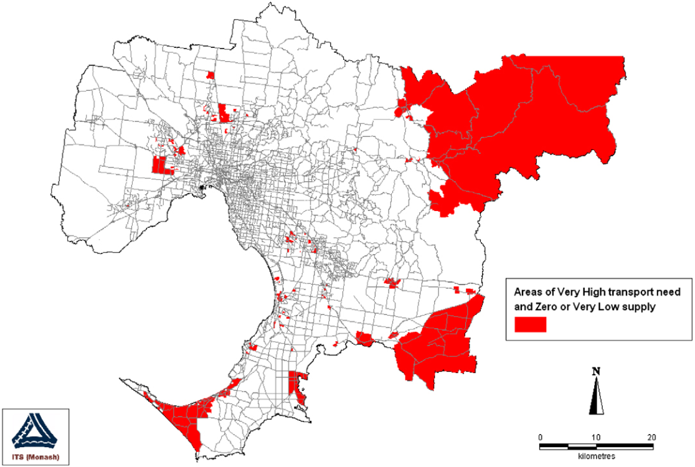

```{r setup, include=FALSE}
library(tidyverse)
library(tidytransit)
library(sp)
library(strayr)
library(ptinpoly)
library(magrittr)
library(ggplot2)
library(sf)
library(ASGS.foyer)
library(raster)
library(ggmap)
library(units)
library(janitor)
library(mapview)
library(ggstatsplot)
library(gtsummary)
library(moments)
library(scales)
library(gtfstools)
library(lubridate)
library(kableExtra)
library(knitr)
library(readxl)
library(readr)
library(dplyr)
library(devtools)
library(gtfssupplyindex)
library(readabs)
library(gglorenz)
library(DescTools)
library(RColorBrewer)
library(lsr)
library(ggpubr)
library(viridis)
library(geosphere)


# invalidate cache when the tufte version changes
#knitr::opts_chunk$set(cache.extra = packageVersion('tufte'))

```


# Introduction
A key reason for providing 
public transport services 
is to providing a basic level of mobility 
for those who cannot otherwise drive themselves.
In many places, 
especially those with 
low-density landuse patterns 
and/or limited transit servcies, 
it may be difficult 
or even impossible 
to get around 
without a private vehicle. 
Disability, 
youth or old age, 
socio-economic status, 
lack of a drivers license, 
and many other factors 
might also mean
someone is
reliant on 
transit services 
for some or all of their travel 
beyond their local neighbourhood. 
Adopting 
social equity-focused approaches 
to transport planning
might therefore suggest targeting 
services 
towards spatial areas 
where there are higher 
social and transport needs 
for transit.  

Approaches for assessing 
spatial gaps between social needs 
and transit supply have 
been reported in previous research 
including @Currie2003Hobart, 
@Currie2004Gap, 
@Currie2007Identifying 
and @currie2010identifying.
These presented a
transit Supply Index (SI), 
which was used to identify geographic areas 
in a few Australian cities 
where there were 
very high social needs for transport, 
but very little transit service 
or none at all. 
This approach suggested 
a new way for planners
to identify 
and prioritise service provision 
towards locations and populations 
more likely to be 
lacking sufficient mobility 
to meet their basic needs 
or fully participate in society. 

However, in almost two decades since the SI was introduced
there does not appear to have been much further use or development 
of this approach. 
As well, it is unclear whether
gaps between social needs and transit supply 
have increased or reduced 
in Australian cities, and 
if the spatial patterns 
identified in Hobart [@Currie2003Hobart; @Currie2004Gap] 
and Melbourne [@Currie2007Identifying; @currie2010identifying] 
are representative.
This may in part be because 
applying such methodologies elsewhere 
would, at the time, 
likely have required 
bespoke data collection, 
cleaning and analysis. 
@Currie2003Hobart, 
@Currie2004Gap, 
@Currie2007Identifying 
and @currie2010identifying 
had data provided  
direct from transit operators 
and authorities, but 
at the time transit schedule data 
was typically only publically available in 
paper or PDF format.  
As well, the volume of spatial and service 
data and bespoke processing 
needed to produce 
a social needs-gap analysis 
may have put such analyses 
beyond reach in most places. 

Nowadays, however, 
the General Transit Feed Specification (GTFS)
and the internet
allows timetable data 
to be published in 
a standardized 
and accessible format, and  
more than 10,000 transit agencies 
publicly release data 
this way. 
Various tools for manipulating such data 
are also now available, 
including software for 
validating, 
analysing 
and visualizating GTFS, 
as well as a separate standard 
(GTFS-Realtime) for sharing 
live vehicle locations [@GTFS].
However, software tools
for examining spatial 
patterns and gaps 
in transit supply 
with respect to 
social needs for transport
appears limited.  

This gap and the lack of 
direct follow up 
to @Currie2003Hobart, 
@Currie2004Gap, 
@Currie2007Identifying 
and @currie2010identifying 
provide the motivation 
for the research reported in this paper.  
The overall aim of this research is to 
apply the developments in spatial data science 
in the intervening years 
to social and transport needs-gaps analysis. 
This encompasses three main objectives: 
(1) to develop tools for needs-gap analysis using GTFS datasets; 
(2) to explore whether such gaps have changed in the intervening years; 
and (3) to better understand whether spatial patterns in 
Melbourne and Hobart are representative of those in other places.

This research included 
the development of a new R package (gtfssupplyindex) 
for calculating SI scores. 
Also presented in this paper 
are results for Australian cities in 2016 and 2021, 
matching the most recent censuses, 
allowing comparison to the 2006 analysis
reported in @currie2010identifying 
and between locations.

The remainder of this paper is structured as follows:
the next section outlines the background to this research,
including the formulation of the Transit Supply Index (SI). 
Section 3 describes the study methodology, 
followed by presentation of results in Section 4 
and discussion in Section 5. 
Limitations of this study, 
directions for future research and 
a brief conclusion are provided in Section 6. 

# Background
## Transit metrics
There are 
many metrics 
available for benchmarking transit services, 
including: those in 
the Transit Cooperative Research Program (TCRP) Report 88 guidebook 
on developing performance-measurement systems [@Ryus:2003aa] 
and in the Transit Capacity and Quality of Service Manual (TCQSM)[@TCQSM:2013]; 
those used across
benchmarking databases and programs 
(e.g. @Florida-Transit-Information-System:2018aa, @UITP:2015aa @Imperial-College-London:2023aa;
and the results available on the .Transit Score website [@WalkScore:2023tg].
The Fielding Triangle [@FieldingGordonJ1987Mpts] 
provides a framework 
for combining indicators of 
service inputs, 
outputs 
and consumption 
to describe cost efficiency, 
cost effectiveness and
service effectiveness. 
More broadly: @Litman:2003ab 
and @Litman:2016aa 
discuss some of the traffic, 
mobility, 
accessibility, 
social equity, 
strategic planning 
and other rational decision-making-based
perspectives underling transport indicators; 
@Reynolds:2017ah extends 
these into models of how 
institutionalism, 
incrementalism 
and other public policy analysis concepts 
might apply to decision-making processes 
relating to transit prioritization; 
@GuzmanLuisA.2017Aeit developed a measure of accessibility 
in the context of policy development 
and social equity 
for Latin American Bus Rapid Transit (BRT) networks; and 
@Creutzig2020streetspaceallocation
introduced street space allocation metrics 
based around ten ethical principles. 

However, 
many of these metrics 
may be difficult to calculate, 
explain or understand, 
especially for those who are not planners, engineers 
or other technical specialists. 
Where pre-calculated transit metrics 
are immediately available, 
such as on a website or 
other online platform, 
it may not be possible
to independently generate scores, 
for instance to assess proposed system changes. 
Contrasting examples are provided by the metrics in the 
TCQSM 
and the Transit Score metric [@WalkScore:2023tg]:

- Transit Scores are readily available on the Transit Score website for locations with a published GTFS feed. 
The meaning of these Transit Scores 
also appears easy to explain, 
with the highest possible score of 100 
representing the sort of transit accessibility that might be xperienced in the center of New York. 
However, 
the Transit Score algorithm 
is a black box, 
and scores cannot be calculated independently
or generated 
for proposed changes to networks. 

- the TCQSM provides a wide range of metrics 
for measuring different aspects of a transit system. 
The TCQSM scores themselves appear easy to understand or explain, 
ranging from A (good) to F (bad), 
although the large number of metrics 
might be somewhat overwhelming for some users.
The scores, however, 
can be calculated independently, given sufficient data. 

@Wong:2013aa provides an example of what can be done 
with GTFS data, 
open metrics and coding by 
reporting the distribution of
various TCQSM metrics 
across 50 USA transit operators. 
Code used in the 
@Wong:2013aa analysis 
is available 
for those who might wish 
to produce a similar study 
for other locations and systems. 
Producing code that 
allows similar calculations 
from GTFS data, 
except for the SI metric, 
is included in the objectives of this study.


## The Transit Suppy Index
A generalized form of the SI equation, adapted from @currie2010identifying, is: 

  $$SI_{area, time} = \sum{\frac{Area_{Bn}}{Area_{area}}*SL_{n, time}}$$

where:

- $SI_{area, time}$ is the Supply Index for the area of interest 
and a given period of time;

- $Area_{Bn}$ is the buffer area for each stop (n) within the area of interest 
(in @currie2010identifying this was based on 
a radius of 400 metres for bus and tram stops, 
and 800 metres for railway stations);

- $Area_{area}$ is the area of the area of interest; and

- $SL_{n,time}$ is the number of transit arrivals for each stop 
for a given time period.

```{r Currie_map_SI, fig.cap = "Distribution of supply measure scores – Metropolitan Melbourne (2006), Source: Currie (2010)",  echo = FALSE, warning=FALSE, message=FALSE, cache=FALSE, out.width='100%'}

knitr::include_graphics("graphics/Currie2010SI.png")

```

@currie2010identifying reported SI scores 
for Census Collection Districts (CCDs) 
across Greater Melbourne in 2006, 
as shown in 
Figure \ref{fig:Currie_map_SI}, 
and identified a general pattern of:
more transit supply 
in the middle and inner suburbs
and along passenger railway lines; and 
outer areas tending to have very low SI scores 
or no transit supply at all. 

## Social need and needs gap

As well as measuring transit supply, @currie2010identifying also 
assessed the social need for transit 
across Greater Melbourne using: 
the Australian Bureaus of Statistics' Index of Related Socio-Economic Advantage/Disadvantage (IRSAD) and 
a transport needs index derived 
from eight weighted indicators.
The spatial distribution of this 
composite social needs index in 2006, 
reproduced in Figure \ref{fig:Currie_maps_needs), 
indicates areas of 
above average, 
high and
very high 
social needs 
in 2006 were located in: 
some outer areas, 
particularly in the east and south-east; 
and in some middle areas in the south-east,
north and west. 
@currie2010identifying also identified 
areas with very high transport needs, 
but very low or no transit supply,  
as reproduced in Figure \ref{fig:Currie_map_gap}. 
This indicated areas 
where service gaps might be of particular concern, 
Most of these were located in outer parts of Melbourne 
in the north-east, south-east and south, 
although there were also some pockets 
in the middle suburbs in the west, north and south east.


```{r Currie_chart_gap, fig.cap = "Log supply score and need index values – Melbourne needs-gap study, Source: Currie (2010)",  echo = FALSE, warning=FALSE, message=FALSE, cache=FALSE, out.width='100%'}

#knitr::include_graphics("graphics/Currie2010chart.png")

```


```{r Currie_map_needs, fig.cap = "Distribution of categories of composite social need index scores in 2006, Source: Currie (2010)",  echo = FALSE, warning=FALSE, message=FALSE, cache=FALSE, out.width='100%'}

knitr::include_graphics("graphics/Currie2010Needs.png")

```


```{r Currie_map_gap, fig.cap = "Melbourne needs-gap in 2006 – very high transport need areas with zero or very low public transport supply, Source: Currie (2010)",  echo = FALSE, warning=FALSE, message=FALSE, cache=FALSE, out.width='100%'}



```
 
Overall @currie2010identifying found that 
"8.2% of Melbourne residents have ‘very high’ needs 
but ‘zero’, ‘low’ or ‘very low’ public transport supply."
Using this methodology in transit planning appraoch was also stated as being 
"substantially more useful than the presentation of anecdotal evidence, 
which is the most common means 
of identifying transport needs 
in local transport studies throughout the world."[@currie2010identifying]

However, it does not appear that this approach 
has been widely adopted 
in practice 
or further developed by researchers. 
Our suspicion is that while the SI has a relatively simple formula 
and requires only geographic and timetable data, 
the lack of a software tool to perform these calculations
may be part of the reason 
that it has not been more widely adopted.
It is also unclear 
whether the patterns in Melbourne 
identified in @currie2010identifying, 
have changed 
since the 2006 analysis. 
Developing a software tool 
to calculate SI tools from GTFS data, 
and then using it to comparing current conditions and other locations 
to the findings of @currie2010identifying, 
therefore, provides motivation 
for this research.


# Methodology
## Code development

This study developed
a package of tools 
for calculating the SI from GTFS data 
using the R programming language [@R-base].
The recommendations of @wickham2023r 
informed the package setup and 
development approach. 
Various existing packages 
and code examples
were relied upon including: 
the sf package [@R-sf] for geospatial analysis; 
the tidyverse [@tidyverse2019]; 
gtfstools [@R-gtfstools]; and 
tidytransit [@R-tidytransit]. 
Australian Bureau of Statistics (ABS) data was also used, sourced via the strayr 
and absmapsdata packages [@r-strayr].

Code was developed and tested on 
the Mornington Peninsula Tourist Railway GTFS feed. 
This was selected primarily for convenience, 
given that the authors are familiar with 
the surrounding geography 
and that the feed covers 
a small number of trips across 
just three stations.  

## Changes since 2006: Greater Melbourne
Much has changed since 2006, 
including the spatial geography used by the 
Australian Bureau of Statistics (ABS) to collect census data. 
To allow direct comparison between 2006 and now, therefore, 
this study first calculated SI scores 
for the week starting the day of the 2021 census
using the same 
Census Collection Districts (CCDs) used by 
@currie2010identifying. 
The Victorian GTFS feed, 
published by Public Transport Victoria (PTV), 
was used, with historical feeds sourced via @transitfeeds_victoria:2023aa. 


```{r fix_ptv_data_Victoria_210805, eval = FALSE, echo = FALSE}

ptv_210805 <- tidytransit::read_gtfs("data/ptv_210805/gtfs.zip")
# This results in "Warning: Duplicated ids found in: stops The returned object is not a tidygtfs object, you can use as_tidygtfs() after fixing the issue."

#So, remove the duplicated stops 
#identify duplicate stops
ptv_210805_duplicated_stops <- tabyl(ptv_210805$stops$stop_id) %>% filter (n>1)
names(ptv_210805_duplicated_stops) <- c("stop_id", "n", "percent")
ptv_210805_duplicated_stops <- left_join(ptv_210805_duplicated_stops, ptv_210805$stops)

##discard duplicates
ptv_210805$stops <- ptv_210805$stops[!duplicated(ptv_210805$stops$stop_id),]

## Write gtfs back to file
ptv_210805 <- as_tidygtfs(ptv_210805)
tidytransit::write_gtfs(ptv_210805, "data/ptv_210805/gtfs_duplicate_stops_removed.zip")

## convert to list of tidygtfs objects
ptv_210805_list_gtfs <- gtfssupplyindex::gtfs_by_route_type("data/ptv_210805/gtfs_duplicate_stops_removed.zip")

```

```{r run_for_all_modes_Victoria_210810_CCD, eval = FALSE, echo = FALSE}
list_gtfs = ptv_210805_list_gtfs

#ccd_vic_2006 <- st_read("data/1259030002_cd06avic_shape/CD06aVIC.shp")

asgc2006 <- st_read("data/asgc2006.gpkg", layer = "census_collection_district_2006")
st_geometry(asgc2006) <- "geometry"

melbourne <- asgc2006 %>% 
  filter(MSR_NAME_2006 == "Melbourne") %>%
  select(CD_CODE_2006)

#Load Greater Melbourne CCD codes
areas_of_interest <- load_areas_of_interest(melbourne,  
  area_id_field = "CD_CODE_2006")

buffer_distance <- gtfssupplyindex:::load_buffer_zones()

stops_in_or_near_areas <- gtfssupplyindex:::stops_in_walk_dist(
  list_gtfs = list_gtfs, 
  areas_of_interest = areas_of_interest,
  EPSG_for_transform = 28355,
  verbose = FALSE
)


si_CCD2006_21_census_week <- SI_by_day_hour_and_route_type(
     list_gtfs = list_gtfs, 
stops_in_or_near_areas = stops_in_or_near_areas,
 start_date_ymd = "2021-08-10", 
 end_date_ymd = "2021-08-16",
verbose = TRUE)

write.csv(si_CCD2006_21_census_week, "results/Greater_Melbourne/si_CCD2006_21_census_week.csv")

si_CCD2006_21_census_week <- read_csv("results/Greater_Melbourne/si_CCD2006_21_census_week.csv")

si_CCD2006_21_census_week_aggregated <- si_CCD2006_21_census_week %>% 
           group_by(area_id) %>%    
           summarize(SI = sum(SI))

write.csv(si_CCD2006_21_census_week_aggregated, "results/Greater_Melbourne/si_CCD2006_21_census_week_aggregated.csv")


```


Unfortunately, it is not possible to obtain 
2016 or 2021 social disadvantage data for 
CCDs, as the ABS now releases data for SA zones only. 
SA1 zones, therefore, are adopted for the comparison of 
social needs-gaps in 2016 and 2021, 
as discussed in the following. 

## Variation in spatial patterns across location. 
SI scores were also calculated  
for the weeks 
starting the day of the 2016 and 2021 censuses 
in Greater Melbourne, 
Greater Brisbane, 
Greater Perth, 
Greater Adelaide and
Greater Hobart. 
Historical GTFS data was again sourced via the Transit Feeds website, 
Unfortunately it was not possible to locate 
historical data for Greater Sydney, 
so the latest data set was sourced directly from Transport for NSW. 


Statistical Area 1 (SA1) zones  
were adopted 
from the Australian Bureau of Statistics [@ABSmaps] 
as the areas of interest,
so as to allow direct comparison 
to ABS-reported values for social needs, 
transport needs, 
population 
and other census data. 
SA3 zones, which are generally similar to Local Government Area (LGA) boundaries, where used when aggregating. 


```{r run_for_all_modes_Greater_Melbourne_210810_SA1, eval = FALSE, echo = FALSE}
list_gtfs = ptv_210805_list_gtfs

areas_of_interest <- load_areas_of_interest(
  absmapsdata::sa12021 %>% 
    filter(gcc_name_2021 == "Greater Melbourne") %>%
    select(sa1_code_2021),  
  area_id_field = "sa1_code_2021")

buffer_distance <- gtfssupplyindex:::load_buffer_zones()

stops_in_or_near_areas <- gtfssupplyindex:::stops_in_walk_dist(
  list_gtfs = list_gtfs, 
  areas_of_interest = areas_of_interest,
  EPSG_for_transform = 28355,
  verbose = FALSE
)


si_SA12021_21_census_week <- SI_by_day_hour_and_route_type(
     list_gtfs = list_gtfs, 
stops_in_or_near_areas = stops_in_or_near_areas,
 start_date_ymd = "2021-08-10", 
 end_date_ymd = "2021-08-16",
verbose = TRUE)

write.csv(si_SA12021_21_census_week, "results/Greater_Melbourne/si_SA12021_21_census_week.csv")

si_SA12021_21_census_week <- read_csv("results/Greater_Melbourne/si_SA12021_21_census_week.csv")

si_SA12021_21_census_week_aggregated <- si_SA12021_21_census_week %>% 
           group_by(area_id) %>%    
           summarize(SI = sum(SI))

write.csv(si_SA12021_21_census_week_aggregated, "results/si_SA12021_21_census_week_aggregated.csv")


```


```{r run_for_all_modes_Greater_Brisbane_210810_SA1, eval = FALSE, echo = FALSE}

###The gtfs agency.txt file has been manually edited to add an agency_id field, so that the tidygtfs functions will worl

## convert to list of tidygtfs objects
translink_seq_210805_list_gtfs <- gtfssupplyindex::gtfs_by_route_type("data/translink_seq_210805/gtfs_edited.zip")


list_gtfs = translink_seq_210805_list_gtfs

areas_of_interest <- load_areas_of_interest(
  absmapsdata::sa12021 %>% 
    filter(gcc_name_2021 == "Greater Brisbane") %>%
    select(sa1_code_2021),  
  area_id_field = "sa1_code_2021")

buffer_distance <- gtfssupplyindex:::load_buffer_zones()

stops_in_or_near_areas <- gtfssupplyindex:::stops_in_walk_dist(
  list_gtfs = list_gtfs, 
  areas_of_interest = areas_of_interest,
  EPSG_for_transform = 28355,
  verbose = FALSE
)


brisbane_si_SA12021_21_census_week <- SI_by_day_hour_and_route_type(
     list_gtfs = list_gtfs, 
stops_in_or_near_areas = stops_in_or_near_areas,
 start_date_ymd = "2021-08-10", 
 end_date_ymd = "2021-08-16",
verbose = TRUE)

write.csv(brisbane_si_SA12021_21_census_week, "results/Greater_Brisbane/brisbane_si_SA12021_21_census_week.csv")

brisbane_si_SA12021_21_census_week <- read_csv("results/Greater_Brisbane/brisbane_si_SA12021_21_census_week")

brisbane_si_SA12021_21_census_week_aggregated <- brisbane_si_SA12021_21_census_week %>% 
           group_by(area_id) %>%    
           summarize(SI = sum(SI))

write.csv(brisbane_si_SA12021_21_census_week_aggregated, "results/Greater_Brisbane/brisbane_si_SA12021_21_census_week_aggregated.csv")


```


```{r run_for_all_modes_Greater_Adelaide_210810_SA1, eval = FALSE, echo = FALSE}

###The gtfs agency.txt file has been manually edited to add an agency_id field, so that the tidygtfs functions will worl

## convert to list of tidygtfs objects
adelaide_metro_210716_list_gtfs <- gtfssupplyindex::gtfs_by_route_type("data/adelaide_metro_210716/gtfs.zip")


list_gtfs = adelaide_metro_210716_list_gtfs

areas_of_interest <- load_areas_of_interest(
  absmapsdata::sa12021 %>% 
    filter(gcc_name_2021 == "Greater Adelaide") %>%
    select(sa1_code_2021),  
  area_id_field = "sa1_code_2021")

buffer_distance <- gtfssupplyindex:::load_buffer_zones()

stops_in_or_near_areas <- gtfssupplyindex:::stops_in_walk_dist(
  list_gtfs = list_gtfs, 
  areas_of_interest = areas_of_interest,
  EPSG_for_transform = 28355,
  verbose = FALSE
)


adelaide_si_SA12021_21_census_week <- SI_by_day_hour_and_route_type(
     list_gtfs = list_gtfs, 
stops_in_or_near_areas = stops_in_or_near_areas,
 start_date_ymd = "2021-08-10", 
 end_date_ymd = "2021-08-16",
verbose = TRUE)

write.csv(adelaide_si_SA12021_21_census_week, "results/Greater_Adelaide/adelaide_si_SA12021_21_census_week.csv")

#adelaide_si_SA12021_21_census_week <- read_csv("results/Greater_Adelaide/adelaide_si_SA12021_21_census_week")

adelaide_si_SA12021_21_census_week_aggregated <- adelaide_si_SA12021_21_census_week %>% 
           group_by(area_id) %>%    
           summarize(SI = sum(SI))

write.csv(adelaide_si_SA12021_21_census_week_aggregated, "results/Greater_Adelaide/adelaide_si_SA12021_21_census_week_aggregated.csv")


```
```{r run_for_all_modes_Greater_Hobart_210810_SA1, eval = FALSE, echo = FALSE}

###The gtfs agency.txt file has been manually edited to add an agency_id field, so that the tidygtfs functions will worl

## convert to list of tidygtfs objects
metrotas_hobart_210726_list_gtfs <- gtfssupplyindex::gtfs_by_route_type("data/metrotas_hobart_210726/gtfs.zip")


list_gtfs = metrotas_hobart_210726_list_gtfs

areas_of_interest <- load_areas_of_interest(
  absmapsdata::sa12021 %>% 
    filter(gcc_name_2021 == "Greater Hobart") %>%
    select(sa1_code_2021),  
  area_id_field = "sa1_code_2021")

buffer_distance <- gtfssupplyindex:::load_buffer_zones()

stops_in_or_near_areas <- gtfssupplyindex:::stops_in_walk_dist(
  list_gtfs = list_gtfs, 
  areas_of_interest = areas_of_interest,
  EPSG_for_transform = 28355,
  verbose = FALSE
)


hobart_si_SA12021_21_census_week <- SI_by_day_hour_and_route_type(
     list_gtfs = list_gtfs, 
stops_in_or_near_areas = stops_in_or_near_areas,
 start_date_ymd = "2021-08-10", 
 end_date_ymd = "2021-08-16",
verbose = TRUE)

write.csv(hobart_si_SA12021_21_census_week, "results/Greater_Hobart/hobart_si_SA12021_21_census_week.csv")

#hobart_si_SA12021_21_census_week <- read_csv("results/Greater_Hobart/hobart_si_SA12021_21_census_week")

hobart_si_SA12021_21_census_week_aggregated <- hobart_si_SA12021_21_census_week %>% 
           group_by(area_id) %>%    
           summarize(SI = sum(SI))

write.csv(hobart_si_SA12021_21_census_week_aggregated, "results/Greater_Hobart/hobart_si_SA12021_21_census_week_aggregated.csv")


```

```{r run_for_all_modes_Greater_Perth_210810_SA1, eval = FALSE, echo = FALSE}

###The gtfs agency.txt file has been manually edited to add an agency_id field, so that the tidygtfs functions will worl

## convert to list of tidygtfs objects
transperth_210805_list_gtfs <- gtfssupplyindex::gtfs_by_route_type("data/transperth_210805/gtfs.zip")


list_gtfs = transperth_210805_list_gtfs

areas_of_interest <- load_areas_of_interest(
  absmapsdata::sa12021 %>% 
    filter(gcc_name_2021 == "Greater Perth") %>%
    select(sa1_code_2021),  
  area_id_field = "sa1_code_2021")

buffer_distance <- gtfssupplyindex:::load_buffer_zones()

stops_in_or_near_areas <- gtfssupplyindex:::stops_in_walk_dist(
  list_gtfs = list_gtfs, 
  areas_of_interest = areas_of_interest,
  EPSG_for_transform = 28355,
  verbose = FALSE
)


perth_si_SA12021_21_census_week <- SI_by_day_hour_and_route_type(
     list_gtfs = list_gtfs, 
stops_in_or_near_areas = stops_in_or_near_areas,
 start_date_ymd = "2021-08-10", 
 end_date_ymd = "2021-08-16",
verbose = TRUE)

write.csv(perth_si_SA12021_21_census_week, "results/Greater_Perth/perth_si_SA12021_21_census_week.csv")

#perth_si_SA12021_21_census_week <- read_csv("results/Greater_Perth/perth_si_SA12021_21_census_week")

perth_si_SA12021_21_census_week_aggregated <- perth_si_SA12021_21_census_week %>% 
           group_by(area_id) %>%    
           summarize(SI = sum(SI))

write.csv(perth_si_SA12021_21_census_week_aggregated, "results/Greater_Perth/perth_si_SA12021_21_census_week_aggregated.csv")


```


```{r run_for_all_modes_Greater_Canberra_210810_SA1, eval = FALSE, echo = FALSE}

#Load gtfs for bus
gtfstools::write_gtfs(canberra_gtfs_merged_2107, "data/canberra_gtfs_merge_2107/gtfs.zip")

## convert to list of tidygtfs objects
action_buses_210701_list_gtfs <- gtfssupplyindex::gtfs_by_route_type("data/action_buses_210701/gtfs.zip")

list_gtfs = canberra_merged_2107_list_gtfs

areas_of_interest <- load_areas_of_interest(
  absmapsdata::sa12021 %>% 
    filter(gcc_name_2021 == "Greater Canberra") %>%
    select(sa1_code_2021),  
  area_id_field = "sa1_code_2021")

buffer_distance <- gtfssupplyindex:::load_buffer_zones()

stops_in_or_near_areas <- gtfssupplyindex:::stops_in_walk_dist(
  list_gtfs = list_gtfs, 
  areas_of_interest = areas_of_interest,
  EPSG_for_transform = 28355,
  verbose = FALSE
)


action_buses_si_SA12021_21_census_week <- SI_by_day_hour_and_route_type(
     list_gtfs = list_gtfs, 
stops_in_or_near_areas = stops_in_or_near_areas,
 start_date_ymd = "2021-08-10", 
 end_date_ymd = "2021-08-16",
verbose = TRUE)

write.csv(action_buses_si_SA12021_21_census_week, "results/Greater_Canberra/action_buses_si_SA12021_21_census_week.csv")

#action_buses_si_SA12021_21_census_week <- read_csv("results/Greater_Canberra/action_buses_si_SA12021_21_census_week")


###Load gtfs for LRT 
## convert to list of tidygtfs objects
canberra_light_rail_210701_list_gtfs <- gtfssupplyindex::gtfs_by_route_type("data/canberra_light_rail_210709/gtfs.zip")

list_gtfs = canberra_light_rail_210701_list_gtfs

areas_of_interest <- load_areas_of_interest(
  absmapsdata::sa12021 %>% 
    filter(gcc_name_2021 == "Greater Canberra") %>%
    select(sa1_code_2021),  
  area_id_field = "sa1_code_2021")

buffer_distance <- gtfssupplyindex:::load_buffer_zones()

stops_in_or_near_areas <- gtfssupplyindex:::stops_in_walk_dist(
  list_gtfs = list_gtfs, 
  areas_of_interest = areas_of_interest,
  EPSG_for_transform = 28355,
  verbose = FALSE
)

canberra_light_rail_si_SA12021_21_census_week <- SI_by_day_hour_and_route_type(
     list_gtfs = list_gtfs, 
stops_in_or_near_areas = stops_in_or_near_areas,
 start_date_ymd = "2021-08-10", 
 end_date_ymd = "2021-08-16",
verbose = TRUE)

write.csv(canberra_light_rail_si_SA12021_21_census_week, "results/Greater_Canberra/canberra_light_rail_si_SA12021_21_census_week.csv")

#action_buses_si_SA12021_21_census_week <- read_csv("results/Greater_Canberra/action_buses_si_SA12021_21_census_week")

###Combine bus and LRT
canberra_si_SA12021_21_census_week %>% add_row(canberra_light_rail_si_SA12021_21_census_week, action_buses_si_SA12021_21_census_week)

canberra_si_SA12021_21_census_week_aggregated <- canberra_si_SA12021_21_census_week %>% 
           group_by(area_id) %>%    
           summarize(SI = sum(SI))

write.csv(canberra_si_SA12021_21_census_week_aggregated, "results/Greater_Canberra/canberra_si_SA12021_21_census_week_aggregated.csv")


```


## Variation in time

SHOULD THIS BE RUN FOR ALL YEARS AS FAR BACK AS THE GTFS DATA GOES??


```{r fix_ptv_data_Victoria_160804, eval = FALSE, echo = FALSE}
 

ptv_160804 <- tidytransit::read_gtfs("data/ptv_160804/gtfs.zip")
# This results in "Warning: Duplicated ids found in: stops The returned object is not a tidygtfs object, you can use as_tidygtfs() after fixing the issue."

#So, remove the duplicated stops 
#identify duplicate stops
ptv_160804_duplicated_stops <- tabyl(ptv_160804$stops$stop_id) %>% filter (n>1)
names(ptv_160804_duplicated_stops) <- c("stop_id", "n", "percent")
ptv_160804_duplicated_stops <- left_join(ptv_160804_duplicated_stops, ptv_160804$stops)

##discard duplicates
ptv_160804$stops <- ptv_160804$stops[!duplicated(ptv_160804$stops$stop_id),]

## Write gtfs back to file
ptv_160804 <- as_tidygtfs(ptv_160804)
tidytransit::write_gtfs(ptv_160804, "data/ptv_160804/gtfs_duplicate_stops_removed.zip")

## convert to list of tidygtfs objects
ptv_160804_list_gtfs <- gtfssupplyindex::gtfs_by_route_type("data/ptv_160804/gtfs_duplicate_stops_removed.zip")

```


```{r run_for_all_modes_Victoria_160809, eval = FALSE, echo = FALSE}
list_gtfs = ptv_160804_list_gtfs

areas_of_interest <- load_areas_of_interest(
  absmapsdata::sa12021 %>% 
    filter(gcc_name_2021 == "Greater Melbourne") %>%
    select(sa1_code_2021),  
  area_id_field = "sa1_code_2021")

stops_in_or_near_areas <- gtfssupplyindex:::stops_in_walk_dist(
  list_gtfs = list_gtfs, 
  areas_of_interest = areas_of_interest,
  EPSG_for_transform = 28355,
  verbose = FALSE
)


si_SA12021_16_census_week <- SI_by_day_hour_and_route_type(
     list_gtfs = list_gtfs, 
stops_in_or_near_areas = stops_in_or_near_areas,
 start_date_ymd = "2016-08-09", 
 end_date_ymd = "2021-08-15",
verbose = TRUE)

write.csv(si_SA12021_16_census_week, "results/Greater_Melbourne/si_SA12021_16_census_week")

```


## Measuring social disadvantage
This study adopts a similar approach to measuring social disadvantage 
as used in @currie2010identifying, using: 
the ABS' Index of Relative Socio-Economic Advantage/Disadvantage (IRSAD); and
a transport needs index^[The same need indicators and weightings used in @currie2010identifying were adopted, although
\$799 or lower per week was used
as the  threshold for low income households 
rather than \$499 
to account for inflation 
(as per Reserve Bank of Australia's online inflation calculator).].
A composite needs indicator was derived 
based on the IRSAD and the transport needs index, 
again as per the @currie2010identifying approach^[  
However, changes to the ABS reporting systems mean
that the composite needs indicator 
had to based on weighting both the IRSAD index and the transport need index 
by the total population of each SA1 zone, 
which were then added, standardised and split into six groups.]. 


```{r read_ABS_data, fig.show="hold", echo = FALSE, warning=FALSE, message=FALSE, cache=TRUE, fig.fullwidth = TRUE, fig.cap="SI scores by SA3, census day 2016 and 2021"}

#read IRSAD 2021 and remove non-data rows
sa1_irsad_2021 <- read_excel("data/Statistical Area Level 1, Indexes, SEIFA 2021.xlsx", 
    sheet = "Table 3", skip = 5)
sa1_irsad_2021 <- sa1_irsad_2021 %>% filter(row_number() <= n()-3)
sa1_irsad_2021 <- sa1_irsad_2021 %>% 
  clean_names()

#read students 2021 and remove non-data rows
sa1_students_2021 <- read_csv("data/sa1_students.csv", 
    skip = 8)
sa1_students_2021 <- sa1_students_2021[-1,]
sa1_students_2021 <- sa1_students_2021 %>% filter(row_number() <= n()-5)

#read not in labour force in 2021 and remove non-data rows
#this dataset contains a single 'wafer', 
# being those people not in the labour force, separated by age and sa1
sa1_not_in_labour_force_2021 <- read_csv("data/sa1_not_in_labour_force_2021.csv", 
    skip = 10)
sa1_not_in_labour_force_2021 <- sa1_not_in_labour_force_2021[-1,]
#not_in_labour_force csv from ABS repeats the entire dataset, hence only read in first set
sa1_not_in_labour_force_2021 <- sa1_not_in_labour_force_2021 %>% filter(row_number() <= n()-61844)


#calculate number of adults not in labour force (ie 18+)
sa1_not_in_labour_force_2021$adult_not_labour_force <- rowSums (sa1_not_in_labour_force_2021[,20:117])
  


#read no car in 2021 and remove non-data rows
#this dataset contains a single 'wafer', 
# being those people living in a household with no car, separated by age and sa1
sa1_no_car_2021 <- read_csv("data/sa1_no_car_2021.csv", 
    skip = 8)
sa1_no_car_2021 <- sa1_no_car_2021[-1,]
sa1_no_car_2021 <- sa1_no_car_2021 %>% filter(row_number() <= n()-5)
#calculate number of adults with no car (ie 18+)
sa1_no_car_2021$adult_no_car <- rowSums(sa1_no_car_2021[,20:117])


#read low income in 2021 and remove non-data rows
sa1_low_income_2021 <- read_csv("data/sa1_low_income.csv", 
    skip = 8)
sa1_low_income_2021 <- sa1_low_income_2021[-1,]
sa1_low_income_2021 <- sa1_low_income_2021 %>% filter(row_number() <= n()-5)

#read disability support pension in 2021 and remove non-data rows
sa1_disability_support_pension_2021 <- read_csv("data/sa1_disability_2021.csv", 
    skip = 8)
sa1_disability_support_pension_2021 <- sa1_disability_support_pension_2021[-1,]
sa1_disability_support_pension_2021 <- sa1_disability_support_pension_2021 %>% filter(row_number() <= n()-5)


#read age in 2021 and remove non-data rows
sa1_age_2021 <- read_csv("data/sa1_age.csv", 
    skip = 8)
sa1_age_2021 <- sa1_age_2021[-1,]
sa1_age_2021 <- sa1_age_2021 %>% filter(row_number() <= n()-5)

#calculate number of people over 60.
sa1_age_2021$over_60 <- rowSums(sa1_age_2021[,63:117])

#calculate number of persons 5 to 9 years old.
sa1_age_2021$persons_5_to_9 <- rowSums(sa1_age_2021[,7:11]) 
#move age-related indicators into social indicators table. 
social_2021_sa1 <- sa1_age_2021 %>% 
  select(`AGEP Age`, over_60, persons_5_to_9)
names(social_2021_sa1) <- c("sa1_code_2021", "over_60", "five_to_nine")

#join Adults without Cars
social_2021_sa1 <- full_join(social_2021_sa1, 
                             sa1_no_car_2021 %>% 
                               select("AGEP Age", "adult_no_car"), 
                             by = join_by( "sa1_code_2021" == "AGEP Age"))

#join disability pension 
sa1_disability_support_pension_2021 <-  sa1_disability_support_pension_2021 %>% 
  clean_names()
  
social_2021_sa1 <- full_join(social_2021_sa1, 
                             sa1_disability_support_pension_2021 %>% 
                               select(
                                 "igap_main_type_of_personal_government_benefit_payment_administrative_data", 
                                      "disability_support_pension"),
                             by = join_by(
                               "sa1_code_2021" == "igap_main_type_of_personal_government_benefit_payment_administrative_data"))


#join low income households
sa1_low_income_2021$low_income_families <- rowSums(sa1_low_income_2021[,2:9])
social_2021_sa1 <- full_join(social_2021_sa1, 
                             sa1_low_income_2021 %>% 
                               select("FINASF Total Family Income as Stated (weekly)", "low_income_families"), 
                             by = join_by( "sa1_code_2021" == "FINASF Total Family Income as Stated (weekly)"))


#join adults not in labour force
social_2021_sa1 <- full_join(social_2021_sa1 %>% na.omit(), 
                             sa1_not_in_labour_force_2021 %>% 
                               select("AGEP Age", "adult_not_labour_force") %>%
                               na.omit(), 
                             by = join_by("sa1_code_2021" == "AGEP Age"))

#join students
sa1_students_2021$students <- sa1_students_2021$Total
social_2021_sa1 <- full_join(social_2021_sa1, 
                             sa1_students_2021 %>% 
                               select("STUP Full-Time/Part-Time Student Status", "students"), 
                             by = join_by( "sa1_code_2021" == "STUP Full-Time/Part-Time Student Status"))

#join IRSAD scores
sa1_irsad_2021$x2021_statistical_area_level_1_sa1 <- sa1_irsad_2021$x2021_statistical_area_level_1_sa1 %>% 
  as.character()
names(sa1_irsad_2021) <- c("sa1_code_2021", 
                           "usual_resident_population",
                           "IRSAD", 
                           "x4", 
                           "rank_in_australia", 
                           "decile_in_australia",
                           "percentile_in_australia", 
                           "x8", 
                           "state", 
                           "rank_in_state",
                           "decile_in_state",
                           "percentile_in_state")

social_2021_sa1 <- full_join(social_2021_sa1, 
                             sa1_irsad_2021 %>% 
                               select("sa1_code_2021", "IRSAD"))


#join SA1 enumerated population
social_2021_sa1 <- full_join(social_2021_sa1, 
                             sa1_age_2021 %>% 
                               select("AGEP Age", "Total"), 
                             by = join_by("sa1_code_2021" == "AGEP Age"))

names(social_2021_sa1) <- c("sa1_code_2021", 
                            "over_60", "age_five_to_nine", 
                            "adult_no_car", 
                            "disability_support_pension",
                            "low_income_families",
                            "adult_not_labour_force",
                            "students", 
                            "IRSAD", 
                            "population")

##Rescaling to 0-100 and adding the accessibility indicator needs to be done on a areas_of_interest by areas_of_interest bias, as which areas are included will matter. 

```


# Results
## The gtfssupplyindex Package
Code developed to calculate SI scores 
is available as an R package on github as @gtfssupplyindex_github. 
Included in the package 
is a vignette that outlines 
the structure of the calculations, 
the developed functions (LINK HERE), 
The vignette also includes step-by-step calculations for the 
Mornington Peninsula Railway 
that provide a worked example 
and comparison to SI scores calculated manually.  

## Changes since 2006: Greater Melbourne


```{r Greater_Melbourne_CCD_2021, fig.show="hold", echo = FALSE, warning=FALSE, message=FALSE, cache=FALSE, fig.fullwidth = TRUE, fig.cap="Transport Supply by CCD, weeks starting the dates of the 2016 and 2021 censuses"}

## FUNCTION to define thresholds and return Very High, High etc. 
# as per Currie2010
set_thresholds <-function(si_by_area_dataframe){ 

## Define Very High, High etc thresholds
cuts <- si_by_area_dataframe %>% 
  st_drop_geometry() %>% 
  filter(SI != 0) %>% 
  select(SI) %>% unlist() %>% 
  as.vector() %>% 
  quantileCut(6)

# Recode factors
allocation <- cuts %>% fct_recode(
  "Very low" = levels(cuts)[1], 
  "Low" = levels(cuts)[2], 
  "Below average" = levels(cuts)[3],
  "Above average" = levels(cuts)[4],
  "High" = levels(cuts)[5],
  "Very high" = levels(cuts)[6]
  )

# Connected levels back to area_id
si_by_area_dataframe_non_zero <- cbind(
  si_by_area_dataframe %>% 
    st_drop_geometry() %>% 
    filter(SI != 0), 
  allocation)

#join back to dataframe, and put "Zero" in N/A
si_by_area_dataframe <- full_join(
  si_by_area_dataframe %>% 
    st_drop_geometry(), 
  si_by_area_dataframe_non_zero[,-2]
)
si_by_area_dataframe$allocation <- si_by_area_dataframe$allocation %>% 
  fct_explicit_na(na_level = "Zero Supply") %>% 
  fct_shift(n = -1)

names(si_by_area_dataframe) <- c("area_id", "SI", "Transit Supply")

#return dataframe and information about level cut offs
si_by_area_dataframe_and_cuts_dataframe <- list(
  si_by_area_dataframe,
  levels(cuts)
  )
return(si_by_area_dataframe_and_cuts_dataframe)
}
# END FUNCTION

## FUNCTION to set thresholds and return tibble, plot output and thresholds
si_thresholds_and_plot_function <- function(si_by_area, areas_of_interest){
# Set column names
names(si_by_area) <- c("area_id", "SI")
names(areas_of_interest) <- c("area_id", "geometry")
  
si_by_area$area_id <- si_by_area$area_id %>% 
  as.character()


##Join to areas_of_interest so as to identify (and enumerate as zero) 
# those areas of interest that have no SI score 

si_by_area <- full_join(
  areas_of_interest,
  si_by_area)
si_by_area[is.na(si_by_area)] <- 0

si_by_area_thresholds <- set_thresholds(si_by_area_dataframe = si_by_area)
si_by_area <- si_by_area_thresholds[[1]]


si_by_area <- left_join(
  areas_of_interest, 
  si_by_area)

output_plot <- ggplot()+ 
  geom_sf(data=si_by_area %>% na.omit(),
          aes(fill = `Transit Supply`), colour=NA) +
  theme(axis.text.x=element_blank(), #remove x axis labels
        axis.ticks.x=element_blank(), #remove x axis ticks
        axis.text.y=element_blank(),  #remove y axis labels
        axis.ticks.y=element_blank(),
        legend.position="bottom") + #remove y axis ticks
  scale_fill_manual(values = c("#FFFFFF", "#F9D8B1", "#F7C387", "#F29C33", "#5DB000", "#53A212", "#407F0B")) #remove y axis ticks


###NEED TO ADD SCALE, NORTH ARROW AND INNER, MIDDLE, OUTER boundaries.  CONSIDER ADDING TRAIN LINES AND 2006 GREATER MELBOURNE BOUNDARY

  outputs <- list("si_by_area" = si_by_area, 
                  "output_plot" = output_plot, 
                  "thresholds" = si_by_area_thresholds[[2]])
  return(outputs)
}

si_by_area <- read.csv("results/Greater_Melbourne/si_CCD2006_21_census_week_aggregated.csv") %>% 
  as_tibble()
si_by_area <- si_by_area[,2:3]

asgc2006 <- st_read("data/asgc2006.gpkg", layer = "census_collection_district_2006")
st_geometry(asgc2006) <- "geometry"

melbourne_CCD <- asgc2006 %>% 
  filter(MSR_NAME_2006 == "Melbourne") %>%
  select(CD_CODE_2006)
areas_of_interest <- melbourne_CCD

si_CCD2006_21_census_week_aggregated <- si_thresholds_and_plot_function(si_by_area, areas_of_interest)

si_CCD2006_21_census_week_aggregated[["output_plot"]]

```

Figure \ref{fig:Greater_Melbourne_CCD_2021} shows SI scores  
for Melbourne in the week of the 2021 census, 
using the same (2006) CCD boundaries as in Figure \ref{fig:Currie_map_SI}. 
In general, the 2021 spatial patterns appear similar to those in 2006, 
with higher levels of transit supply in inner areas and close to railway lines. 
There are still some areas with zero transit supply in outer areas, 
although fewer than in 2006.  
Transit supply also appears to be more spread out in 2021 than in 2006, 
with higher levels of transit supply provided in many middle 
and outer locations. 


Figure \ref{fig:Greater_Melbourne_CCD_2021} shows SI scores  
for Melbourne in the week of the 2021 census and using the same 2006 CCD boundaries as in Figure \ref{fig:Currie_map_SI}.

## Variation in spatial patterns across Australian cities

```{r Australian_cities_2021, fig.show="hold", echo = FALSE, warning=FALSE, message=FALSE, cache=FALSE, fig.fullwidth = TRUE, fig.cap="Transit Supply by SA1, weeks starting the date of 2021 census"}

## 2021 Greater Melbourne
si_by_area <-  read.csv( "results/Greater_Melbourne/si_SA12021_21_census_week_aggregated.csv") %>% 
  as_tibble()
si_by_area <- si_by_area[,2:3]

areas_of_interest <-  absmapsdata::sa12021 %>% 
    filter(gcc_name_2021 == "Greater Melbourne") %>% 
    select(sa1_code_2021)

melbourne_si_SA12021_21_census_week_aggregated <- si_thresholds_and_plot_function(si_by_area, areas_of_interest)

## 2021 Greater Adelaide
si_by_area <-  read.csv( "results/Greater_Adelaide/adelaide_si_SA12021_21_census_week_aggregated.csv") %>% 
  as_tibble()
si_by_area <- si_by_area[,2:3]

areas_of_interest <-  absmapsdata::sa12021 %>% 
    filter(gcc_name_2021 == "Greater Adelaide") %>% 
    select(sa1_code_2021)

adelaide_si_SA12021_21_census_week_aggregated <- si_thresholds_and_plot_function(si_by_area, areas_of_interest)

## 2021 Greater Brisbane
si_by_area <-  read.csv( "results/Greater_Brisbane/brisbane_si_SA12021_21_census_week_aggregated.csv") %>% 
  as_tibble()
si_by_area <- si_by_area[,2:3]

areas_of_interest <-  absmapsdata::sa12021 %>% 
    filter(gcc_name_2021 == "Greater Brisbane") %>% 
    select(sa1_code_2021)

brisbane_si_SA12021_21_census_week_aggregated <- si_thresholds_and_plot_function(si_by_area, areas_of_interest)

## 2021 Greater Hobart
si_by_area <-  read.csv( "results/Greater_Hobart/hobart_si_SA12021_21_census_week_aggregated.csv") %>% 
  as_tibble()
si_by_area <- si_by_area[,2:3]

areas_of_interest <-  absmapsdata::sa12021 %>% 
    filter(gcc_name_2021 == "Greater Hobart") %>% 
    select(sa1_code_2021)

hobart_si_SA12021_21_census_week_aggregated <- si_thresholds_and_plot_function(si_by_area, areas_of_interest)

## 2021 Greater Perth
si_by_area <-  read.csv( "results/Greater_Perth/perth_si_SA12021_21_census_week_aggregated.csv") %>% 
  as_tibble()
si_by_area <- si_by_area[,2:3]

areas_of_interest <-  absmapsdata::sa12021 %>% 
    filter(gcc_name_2021 == "Greater Perth") %>% 
    select(sa1_code_2021)

perth_si_SA12021_21_census_week_aggregated <- si_thresholds_and_plot_function(si_by_area, areas_of_interest)


melbourne_si_SA12021_21_census_week_aggregated[["output_plot"]] 
adelaide_si_SA12021_21_census_week_aggregated[["output_plot"]] 
brisbane_si_SA12021_21_census_week_aggregated[["output_plot"]] 
hobart_si_SA12021_21_census_week_aggregated[["output_plot"]] 
perth_si_SA12021_21_census_week_aggregated[["output_plot"]] 

```


Figure \ref{fig:Australian_cities_2021} shows SI values for the week starting on the day of the 2021 census for all Australian Capital Cities except Greater Sydney, for which the SI values are calculated for the week starting <INSERT WEEK HERE>. 


### Social needs

Figure \ref{fig:Greater_Melbourne_2021_social_needs} shows the distribution of categories of social need index scores across Greater Melbourne for 2021. This figure is analogous to the 2006 value from @currie2010identifying shown in Figure \ref{fig:Currie_map_needs} although, as discussed in the methodology section above, it was not possible to exactly replicate the @currie2010identifying approach as the total number of people within one or more of social need component groups (necessary to calculate the two relative need indicators) are not reported in the 2021 census.    

```{r Greater_Melbourne_2021_social_needs, fig.show="hold", echo = FALSE, warning=FALSE, message=FALSE, cache=FALSE, fig.fullwidth = TRUE, fig.cap="Distribution of categories of composite social need index scores"}

#join to sa1 data, including lat and long of each sa1
social_2021_sa1_greater_melbourne <- left_join(
  absmapsdata::sa12021 %>% 
    filter(gcc_name_2021 == "Greater Melbourne") %>% 
    select(sa1_code_2021, sa3_name_2021, cent_lat, cent_long) %>%
    st_drop_geometry(),
  social_2021_sa1 
)

# from https://stackoverflow.com/questions/36817423/how-to-efficiently-calculate-distance-between-pair-of-coordinates-using-data-tab/42014364#42014364
dt.haversine <- function(lat_from, lon_from, lat_to, lon_to, r = 6378137){
  radians <- pi/180
  lat_to <- lat_to * radians
  lat_from <- lat_from * radians
  lon_to <- lon_to * radians
  lon_from <- lon_from * radians
  dLat <- (lat_to - lat_from)
  dLon <- (lon_to - lon_from)
  a <- (sin(dLat/2)^2) + (cos(lat_from) * cos(lat_to)) * (sin(dLon/2)^2)
  return(2 * atan2(sqrt(a), sqrt(1 - a)) * r)
}

social_2021_sa1_greater_melbourne$distance_m_to_GPO <- 
 dt.haversine(-37.813840, 
              144.963028,
              social_2021_sa1_greater_melbourne$cent_lat,
              social_2021_sa1_greater_melbourne$cent_long)


calculate_IRSAD_and_need_index <- function(social_dataset) {
  # scale all to 0 to 100
  social_dataset$IRSAD_100 <- rescale_max(
     social_dataset$IRSAD, to = c(0, 100))
  social_dataset$adult_no_car_100 <- rescale_max(
    social_dataset$adult_no_car, to = c(0, 100))
   social_dataset$accessibility_100 <- rescale_max(
     social_dataset$distance_m_to_GPO, to = c(0, 100))
   social_dataset$over_60_100 <- rescale_max(
     social_dataset$over_60, to = c(0, 100))
   social_dataset$disability_pension_100 <- rescale_max(
     social_dataset$disability_support_pension, to = c(0, 100))
   social_dataset$low_income_families_100 <- rescale_max(
     social_dataset$low_income_families, to = c(0, 100))
  social_dataset$adult_not_labour_force_100 <- rescale_max(
     social_dataset$adult_not_labour_force, to = c(0, 100))
  social_dataset$students_100 <- rescale_max(
     social_dataset$students, to = c(0, 100))
  social_dataset$age_five_to_nine_100 <- rescale_max(
     social_dataset$age_five_to_nine, to = c(0, 100))
  
  # calculate needs scores and scale to 100
  social_dataset$needs_score <- social_dataset$adult_no_car_100 * 0.19 +
    social_dataset$accessibility_100 * 0.15 + 
    social_dataset$over_60_100 * 0.14 + 
    social_dataset$disability_pension_100 * 0.12 + 
    social_dataset$low_income_families_100 * 0.10 + 
    social_dataset$adult_not_labour_force_100 * 0.09 + 
    social_dataset$students_100 * 0.09 + 
    social_dataset$age_five_to_nine_100 * 0.12
  social_dataset$needs_score_100 <- rescale_max(
     social_dataset$needs_score, to = c(0, 100))
  
  # weight IRSAD and needs score by total population
  social_dataset$total_need_IRSAD <- social_dataset$IRSAD *
    social_dataset$population
  social_dataset$total_transport_need <- social_dataset$needs_score * 
    social_dataset$population
  
  # create combined indicator 0 to 100
  social_dataset$combined_needs_index <- social_dataset$total_need_IRSAD + 
    social_dataset$total_transport_need 
  social_dataset$combined_needs_index <- rescale_max(
     social_dataset$combined_needs_index, to = c(0, 100))
  
  
  return(social_dataset %>% 
           select(sa1_code_2021, combined_needs_index, population, sa3_name_2021)) 
}

combined_needs_index_2021_sa1_greater_melbourne <- calculate_IRSAD_and_need_index(
  social_2021_sa1_greater_melbourne)


cuts <- combined_needs_index_2021_sa1_greater_melbourne %>% 
  na.omit() %>% 
  select(combined_needs_index) %>% 
  unlist()  %>% 
  as.vector() %>% 
  quantileCut(6)


cuts <- sapply(str_extract_all(cuts, "-?[0-9.]+"), function(x) max(as.numeric(x))) %>%
  unique() %>% 
  as.numeric() %>% 
  sort()
  
 combined_needs_index_2021_sa1_greater_melbourne$combined_needs_index_binned <- ifelse(
   combined_needs_index_2021_sa1_greater_melbourne$combined_needs_index == 0, NA, ifelse(
      combined_needs_index_2021_sa1_greater_melbourne$combined_needs_index < cuts[1], "Very low", ifelse(
        combined_needs_index_2021_sa1_greater_melbourne$combined_needs_index < cuts[2], "Low", ifelse(
          combined_needs_index_2021_sa1_greater_melbourne$combined_needs_index < cuts[3], "Below average", ifelse(
            combined_needs_index_2021_sa1_greater_melbourne$combined_needs_index < cuts[4], "Above average", ifelse(
              combined_needs_index_2021_sa1_greater_melbourne$combined_needs_index < cuts[5], "High", ifelse(
                combined_needs_index_2021_sa1_greater_melbourne$combined_needs_index >= cuts[5], "Very high", NA)
             )
           )
         )
       )
     )
   ) 

 combined_needs_index_2021_sa1_greater_melbourne$combined_needs_index_binned <- factor( combined_needs_index_2021_sa1_greater_melbourne$combined_needs_index_binned, 
                                         levels = c(
                                           "Very low", 
                                           "Low", 
                                           "Below average",
                                           "Above average", 
                                           "High", 
                                           "Very high"
                                         ))

 
#join to sa1 geometry data
combined_needs_index_2021_sa1_greater_melbourne <- left_join(
  absmapsdata::sa12021 %>% 
    filter(gcc_name_2021 == "Greater Melbourne") %>% 
    select(sa1_code_2021),
  combined_needs_index_2021_sa1_greater_melbourne 
)

 

ggplot()+ 
  geom_sf(data=combined_needs_index_2021_sa1_greater_melbourne %>% na.omit(),
          aes(fill =  combined_needs_index_binned), colour=NA) +
  theme(axis.text.x=element_blank(), #remove x axis labels
        axis.ticks.x=element_blank(), #remove x axis ticks
        axis.text.y=element_blank(),  #remove y axis labels
        axis.ticks.y=element_blank(),
        legend.position="bottom") + #remove y axis ticks
  scale_fill_manual(values = c("#FFFB07", "#CEE102", "#A3CF07", "#61AE09", "#2EA105", "#0A7B01")) #remove y axis ticks


```
Figure \ref{fig:Greater_Melbourne_2021_social_needs} appears to indicate that there is no clear spatial pattern to the distribution of the categories of the composite need index scores. This appears to contrast to trend, albeit with some exceptions, towards very high social needs scores in outer areas identified by @currie2010identifying (Figure \ref{fig:Currie_map_needs}). This may, however, be an artifact of either the differences in the composite needs scores used in this analysis (due to the lack of data to assess relative needs) compared to the @currie2010identifying analysis. As well, the 2021 census SA1 zones generally appear to smalller than the 2006 Census Collection Districts (CCDs) used in @currie2010identifying, especially in outer areas. This will be associated with the growth of Greater Melbourne's population and spatial dispersment, with many of the large outer 'Very High' CCDs shown in the 2006 map now split into many more SA1 zones.  

### Needs-gap analysis


```{r Greater_Melbourne_2021_needs_gap, fig.show="hold", eval = FALSE, echo = FALSE, warning=FALSE, message=FALSE, cache=FALSE, fig.fullwidth = TRUE, fig.cap="Distribution of categories of composite social need index scores"}

combined_needs_index_2021_sa1_greater_melbourne <- 
  left_join(combined_needs_index_2021_sa1_greater_melbourne %>% 
              st_drop_geometry() %>%
              na.omit(), 
            si_by_area_2016_2021 %>% 
              st_drop_geometry() %>% filter(Year == 2021))

combined_needs_index_2021_sa1_greater_melbourne[is.na(combined_needs_index_2021_sa1_greater_melbourne)] <- "Zero" 

combined_needs_index_2021_sa1_greater_melbourne$combined_needs_index_binned <- 
  fct_rev(combined_needs_index_2021_sa1_greater_melbourne$combined_needs_index_binned)

Greater_Melbourne_2021_needs_gap_SA1_count <- tabyl(combined_needs_index_2021_sa1_greater_melbourne, SI_binned, combined_needs_index_binned)

#Greater_Melbourne_2021_needs_gap_SA1_count %>% 
#  adorn_totals(where = c("row", "col")) %>% 
#  adorn_percentages(denominator = "all") %>% 
#  adorn_pct_formatting() %>%
#  adorn_ns() %>% 
#  kable(caption = "Number of SA1 zones by social/transport need and public transport supply category")


Greater_Melbourne_2021_needs_gap_SA1_count_longer <- Greater_Melbourne_2021_needs_gap_SA1_count %>% 
  pivot_longer( 
    cols = 2:7, 
    values_to = "Zones",
    names_to = "Social/transport needs"
  )

Greater_Melbourne_2021_needs_gap_SA1_count_longer$Year <- 2021

```

```{r Greater_Melbourne_2021_needs_gap_percentage, fig.show="hold", echo = FALSE, warning=FALSE, message=FALSE, cache=FALSE, fig.fullwidth = TRUE, fig.cap="Distribution of categories of composite social need index scores"}

Greater_Melbourne_2021_needs_gap_SA1_population <- tapply(combined_needs_index_2021_sa1_greater_melbourne$population,
       list(combined_needs_index_2021_sa1_greater_melbourne$SI_binned, combined_needs_index_2021_sa1_greater_melbourne$combined_needs_index_binned), 
       sum) %>% 
  as.data.frame() %>%
  rownames_to_column() 

names(Greater_Melbourne_2021_needs_gap_SA1_population) <- c("Supply Index category", "Very high", "High", "Above average", "Below average", 
                "Low", "Very low")

#Greater_Melbourne_2021_needs_gap_SA1_population %>%
#  adorn_totals(where = c("row", "col")) %>%
#  adorn_percentages(denominator = "all") %>% 
#  adorn_pct_formatting() %>%
#  adorn_ns() %>% 
#  kable(caption = "Population of SA1 zones by social/transport need and public transport supply category")


Greater_Melbourne_2021_needs_gap_SA1_population_longer <- Greater_Melbourne_2021_needs_gap_SA1_population %>% 
  pivot_longer( 
    cols = 2:7, 
    values_to = "Population",
    names_to = "Social/transport needs"
  )

Greater_Melbourne_2021_needs_gap_SA1_population_longer$Year <- 2021
          
```


```{r Greater_Melbourne_2006_2021_needs_gap_zones, fig.show="hold", echo = FALSE, warning=FALSE, message=FALSE, cache=FALSE, fig.fullwidth = TRUE, fig.cap="Number of areas by SI and social/transport need category, comparison between 2006 and 2021"}

Greater_Melbourne_2006_needs_gap_SA1_count <- tibble(
  "Supply Index category" = c(
    "Zero", 
    "Very low", 
    "Low", 
    "Below average", 
    "Above average",  
    "High",
    "Very high"), 
  "Very high" = c(89, 190, 209, 189, 74, 53, 53),
  "High" = c(32, 212, 214, 205, 61, 66, 39), 
  "Above average" = c(16, 230, 256, 191, 81, 62, 43), 
  "Below average" = c(18, 245, 221, 261, 121, 92, 75), 
  "Low" = c(25, 218, 217, 237, 116, 98, 146), 
  "Very low" = c(6, 164, 176, 206, 147, 161, 205)
)

#Greater_Melbourne_2006_needs_gap_SA1_count %>% 
#  adorn_totals(where = c("row", "col")) %>%
#  kable()

Greater_Melbourne_2006_needs_gap_SA1_count_longer <- Greater_Melbourne_2006_needs_gap_SA1_count %>% 
  pivot_longer( 
    cols = 2:7, 
    values_to = "Zones",
    names_to = "Social/transport needs"
  )


Greater_Melbourne_2006_needs_gap_SA1_count_longer$Year <- 2006

names(Greater_Melbourne_2021_needs_gap_SA1_count_longer) <- c(
  "Supply Index category",
  "Social/transport needs", 
  "Zones", 
  "Year")

Greater_Melbourne_2006_2021_needs_gap_SA1_count_longer  <- 
  add_row(
    Greater_Melbourne_2006_needs_gap_SA1_count_longer,
    Greater_Melbourne_2021_needs_gap_SA1_count_longer)

Greater_Melbourne_2006_2021_needs_gap_SA1_count_longer$`Supply Index` <- Greater_Melbourne_2006_2021_needs_gap_SA1_count_longer$`Supply Index category` %>% 
  factor(levels = c(
    "Zero", 
    "Very low", 
    "Low", 
    "Below average", 
    "Above average",  
    "High",
    "Very high"
  ))


Greater_Melbourne_2006_2021_needs_gap_SA1_count_longer$`Social/transport needs` <- Greater_Melbourne_2006_2021_needs_gap_SA1_count_longer$`Social/transport needs` %>% 
  factor(levels = c(
    "Very low", 
    "Low", 
    "Below average", 
    "Above average",  
    "High",
    "Very high"
  ))

Greater_Melbourne_2006_2021_needs_gap_SA1_count_longer$`Social/transport needs`

Greater_Melbourne_2006_2021_needs_gap_SA1_count_longer$Year <- Greater_Melbourne_2006_2021_needs_gap_SA1_count_longer$Year %>% as_factor()

grouped_ggbarstats(
  data = Greater_Melbourne_2006_2021_needs_gap_SA1_count_longer,
  x = `Social/transport needs`,
  y = Year,
  counts = Zones,
  grouping.var = `Supply Index category`
)

```


```{r Greater_Melbourne_2006_2021_needs_gap_population, fig.show="hold", echo = FALSE, warning=FALSE, message=FALSE, cache=FALSE, fig.fullwidth = TRUE, fig.cap="Population by SI and social/transport need category, comparison between 2006 and 2021"}


Greater_Melbourne_2006_needs_gap_SA1_population <- tibble(
  "Supply Index category" = c(
    "Zero", 
    "Very low", 
    "Low", 
    "Below average", 
    "Above average",  
    "High",
    "Very high"), 
  "Very high" = c(37699, 101305, 137735, 120934, 41702, 27149, 24691),
  "High" = c(14338, 131554, 141273, 119981, 33000, 33314, 16563), 
  "Above average" = c(7985, 140757, 169648, 113281, 43622, 30694, 20393), 
  "Below average" = c(9416, 154876, 146209, 153874, 62783, 42802, 35865), 
  "Low" = c(13263, 140874, 148078, 140390, 60952, 48912, 61719), 
  "Very low" = c(2722, 118926, 119906, 126061, 79117, 76597, 90181)
)


#Greater_Melbourne_2006_needs_gap_SA1_population %>% 
#  adorn_totals(where = c("row", "col")) %>%
#  adorn_percentages(denominator = "all") %>%
#  adorn_pct_formatting() %>% 
#  adorn_ns() %>%
#  kable()


Greater_Melbourne_2006_needs_gap_SA1_population_longer <- Greater_Melbourne_2006_needs_gap_SA1_population %>% 
  pivot_longer( 
    cols = 2:7, 
    values_to = "Population",
    names_to = "Social/transport needs"
  )

Greater_Melbourne_2006_needs_gap_SA1_population_longer$Year <- 2006

Greater_Melbourne_2006_2021_needs_gap_SA1_population_longer  <- 
  add_row(
    Greater_Melbourne_2006_needs_gap_SA1_population_longer,
    Greater_Melbourne_2021_needs_gap_SA1_population_longer)

Greater_Melbourne_2006_2021_needs_gap_SA1_population_longer$`Supply Index category` <- Greater_Melbourne_2006_2021_needs_gap_SA1_population_longer$`Supply Index category` %>% 
  factor(levels = c(
    "Zero", 
    "Very low", 
    "Low", 
    "Below average", 
    "Above average",  
    "High",
    "Very high"
  ))


Greater_Melbourne_2006_2021_needs_gap_SA1_population_longer$`Social/transport needs` <- Greater_Melbourne_2006_2021_needs_gap_SA1_population_longer$`Social/transport needs` %>% 
  factor(levels = c(
    "Very low", 
    "Low", 
    "Below average", 
    "Above average",  
    "High",
    "Very high"
  ))


Greater_Melbourne_2006_2021_needs_gap_SA1_population_longer$Year <- Greater_Melbourne_2006_2021_needs_gap_SA1_population_longer$Year %>% as_factor()

Greater_Melbourne_2006_2021_needs_gap_SA1_population_longer$`Supply Index category` <- Greater_Melbourne_2006_2021_needs_gap_SA1_population_longer$`Supply Index category`%>% 
  as.character()


grouped_ggbarstats(
  data = Greater_Melbourne_2006_2021_needs_gap_SA1_population_longer,
  x = `Social/transport needs`,
  y = Year,
  counts = Population,
  grouping.var = `Supply Index category`
)


```


Figure \ref{fig:Greater_Melbourne_2006_2021_needs_gap_zones} compares the number of zones^[SA1s in 2021, versus CCD in 2006.] by SI and social/transport need category between 2006 and 2021. Population is compared in Figure \ref{fig:Greater_Melbourne_2006_2021_needs_gap_population} 

These results indicate that, in 2021, `r Greater_Melbourne_2021_needs_gap_SA1_count[1,2]` SA1 zones, (representing `r label_percent(accuracy = 0.1)(Greater_Melbourne_2021_needs_gap_SA1_count[1,2]/ sum(Greater_Melbourne_2021_needs_gap_SA1_count[,2:7]))`of the total `r sum(Greater_Melbourne_2021_needs_gap_SA1_count[,2:7]) %>% formatC(big.mark = ",", format = "d")`SA1 zones in Greater Melbourne) had no public transport, but very 'very high' social/transport needs.  These zones have a combined population of 


`r Greater_Melbourne_2021_needs_gap_SA1_population[1,2]` SA1 zones, representing `r Greater_Melbourne_2021_needs_gap_SA1_population[1,2] %>% formatC(big.mark = ",", format = "d")`(`r label_percent(accuracy = 0.1)(Greater_Melbourne_2021_needs_gap_SA1_population[1,2]/ sum(Greater_Melbourne_2021_needs_gap_SA1_population[,2:7]))` of the total `r sum(Greater_Melbourne_2021_needs_gap_SA1_population[,2:7]) %>% formatC(big.mark = ",", format = "d")  ` population) live in areas with no public transport but have 'very high' social/transport needs. This compares to the 89 CCDs (1.6% of the 5,720 total), representing 37,699 Melbourne residents (1.1% of the population) living in areas with no public transport, but very high social/transport needs reported for 2006 in @currie2010identifying. 


## Variation in spatial patterns across time: 2016 and 2021

INCLUDE GINI COEFFICIENT PLOTS HERE

```{r Greater_Melbourne_2016, fig.show="hold", echo = FALSE, warning=FALSE, message=FALSE, cache=FALSE, eval = FALSE, fig.fullwidth = TRUE, fig.cap="Population by SI and social/transport need category, comparison between 2006 and 2021"}

###2016
###Load results from CSV (Precalculated above) and make first column character
########USE 2021 AS PLACE HOLDER
si_SA12021_16_census_week_aggregated <- read.csv( "results/si_SA12021_21_census_week_aggregated.csv") %>% 
  as_tibble()
si_SA12021_16_census_week_aggregated <- si_SA12021_16_census_week_aggregated[,2:3]

si_SA12021_16_census_week_aggregated$area_id <- si_SA12021_16_census_week_aggregated$area_id %>% 
  as.character()

##Join to absmaps so as to identify (and enumerate as zero) those SA1 zones 
# that have no SI score
si_SA12021_16_census_week_aggregated <- full_join(
  absmapsdata::sa12021 %>% 
    filter(gcc_name_2021 == "Greater Melbourne") %>% 
    select(sa1_code_2021) %>%
    st_drop_geometry(),
  si_SA12021_16_census_week_aggregated, 
  by = join_by(sa1_code_2021  == area_id))
si_SA12021_16_census_week_aggregated[is.na(si_SA12021_16_census_week_aggregated)] <- 0


si_SA12021_16_census_week_aggregated_thresholds <- set_thresholds(sa_by_area_dataframe = si_SA12021_16_census_week_aggregated)
si_SA12021_16_census_week_aggregated <- si_SA12021_16_census_week_aggregated_thresholds[[1]]
si_SA12021_16_census_week_aggregated$Year <- 2016

#Combine and plot
si_by_area_2016_2021 <- add_row(si_SA12021_16_census_week_aggregated, si_SA12021_21_census_week_aggregated)


si_by_area_2016_2021  <- left_join(
  absmapsdata::sa12021 %>% 
    filter(gcc_name_2021 == "Greater Melbourne") %>% 
    select(sa1_code_2021),
  si_by_area_2016_2021)

plot_2016_2021_comparison <- ggplot()+ 
  geom_sf(data=si_by_area_2016_2021 %>% na.omit(),
          aes(fill = `Transit Supply`), colour=NA) +
  facet_wrap(vars(Year), nrow = 1) +
  theme(axis.text.x=element_blank(), #remove x axis labels
        axis.ticks.x=element_blank(), #remove x axis ticks
        axis.text.y=element_blank(),  #remove y axis labels
        axis.ticks.y=element_blank(),
        legend.position="bottom") + #remove y axis ticks
  scale_fill_manual(values = c("#FFFFFF", "#F9D8B1", "#F7C387", "#F29C33", "#5DB000", "#53A212", "#407F0B")) #remove y axis ticks

plot_2016_2021_comparison

###NEED TO ADD SCALE, NORTH ARROW AND INNER, MIDDLE, OUTER boundaries.  CONSIDER ADDING TRAIN LINES AND 2006 GREATER MELBOURNE BOUNDARY


```

# Discussion

## Limitations 

## Directions for furture research

# Conclusions

# References {-}


```{r, include=FALSE}
knitr::write_bib(file = 'packages.bib')
```

