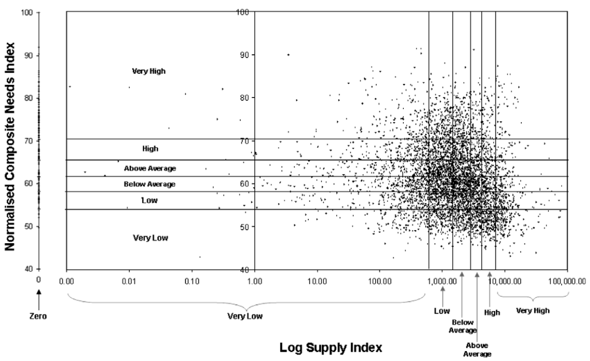

```{r setup, include=FALSE}
library(tidyverse)
library(tidytransit)
library(sp)
library(strayr)
library(ptinpoly)
library(magrittr)
library(ggplot2)
library(sf)
library(ASGS.foyer)
library(raster)
library(ggmap)
library(units)
library(janitor)
library(mapview)
library(ggstatsplot)
library(gtsummary)
library(moments)
library(scales)
library(gtfstools)
library(lubridate)
library(kableExtra)
library(knitr)
library(readxl)
library(readr)
library(dplyr)
library(devtools)
library(gtfssupplyindex)
library(readabs)
library(gglorenz)
library(DescTools)
library(RColorBrewer)
library(lsr)
library(ggpubr)
library(viridis)
library(geosphere)
library(png)
library(absmapsdata)
library(tidytransit)
library(patchwork)

knitr::opts_chunk$set(warning = FALSE, message = FALSE) 

```

# Introduction

A common role for transit is providing some mobility for those who cannot otherwise drive themselves, so they can access activities and services beyond walking distance [@Currie:2016aa]. Age, disability, socio-economic status, lack of a vehicle or many other factors might make someone reliant on transit for some or all of their travel. As well, lower proportions of younger people are obtaining a driving license than was the case previously [@delbosc2013causes], suggesting an increased need for transit coverage in the future.

Vertical social-equity perspectives on transport policy-making relate to supporting those who are disadvantaged [@Litman:2016aa] and might suggest providing at least some transit, and probably more than just a minimum, where there are higher social needs for transport. Along these lines @Currie2003Hobart, @Currie2004Gap; @Currie2007Identifying and @currie2010identifying developed an approach for identifying spatial gaps in transit supply related to social needs for transport, and applied it to a case study of Melbourne in 2006.

However, there does not appear to have been much further use or development of this spatial analysis technique. As well, it is unclear whether the spatial patterns identified for Melbourne in 2006 have changed in the intervening years or are representatvie of other places. This may in part be because, until recently, schedules were not available in a consistent electronic format, meaning that assessing transit supply was a large task requiring bespoke sourcing, cleaning and analysis of data for each operator. Nowadays, however, more than 10,000 transit agencies publicly release timetable data in the General Transit Feed Specification (GTFS) format [@GTFS]. Such standardisation allows Google Maps and other online platforms to provide transit-related outputs for any place publishing a feed, but tools for using GTFS data to examine spatial patterns and gaps in transit supply with respect to social needs for transport do not appear to be readily available. This gap, and the lack of direct follow up to @Currie2003Hobart, @Currie2004Gap, @Currie2007Identifying and @currie2010identifying, provide motivation for this research.

The objectives of this research are: (1) to develop tools for undertaking needs-gap analysis using GTFS datasets; and (2) to better understand spatial patterns of gaps between social needs for transport and transit supply, including whether those reported in @Currie2007Identifying and @currie2010identifying are representative of the current situation in Melbourne and elsewhere. This paper reports the development of a new R package (gtfssupplyindex) with tools for using the @Currie2007Identifying and @currie2010identifying analysis approach with GTFS datasets. Also presented in this paper are results for Melbourne in 2016 and 2021, matching the most recent censuses, for comparison to the 2006 results reported in @currie2010identifying[^1].

[^1]: The wider programme of research includes examination of spatial gaps in other cities, so as to better understand whether patterns in Melbourne are representative of other places. However, this paper is limited to examining Melbourne in 2016 and 2021 only. Results for other cities will be reported elsewhere.

The remainder of this paper is structured as follows: the next section outlines the research context; Section 3 describes the study methodology; results are presented in Section 4 and discussed in Section 5; and limitations of this study and directions for future research are discussed in Section 6, which concludes the paper.

# Research context

There are many metrics available for assessing transit services. Examples include: those in the *Transit Cooperative Research Program (TCRP) Report 88: a guidebook for developing performance-measurement systems* [@Ryus:2003aa]; and those used across benchmarking databases and programs such as by @Florida-Transit-Information-System:2018aa, @UITP:2015aa and @Imperial-College-London:2023aa. The Fielding Triangle [@FieldingGordonJ1987Mpts] provides a framework for combining indicators of service inputs, outputs and consumption to describe cost efficiency, cost effectiveness and service effectiveness. More broadly: @Litman:2003ab and @Litman:2016aa discuss the traffic, mobility, accessibility, social equity, strategic planning and other rational decision-making perspectives underlying many transport indicators; @Reynolds:2017ah extends these into models of how institutionalism, incrementalism and other public policy analysis concepts might apply to transit prioritisation; @GuzmanLuisA.2017Aeit developed a measure of accessibility in the context of policy development and social equity for Latin American Bus Rapid Transit (BRT) networks; and @Creutzig2020streetspaceallocation introduced street space allocation metrics based around ten ethical principles.

Many such metrics, however, may be difficult to calculate, understand or use, especially for those who are not planners, engineers or other technical specialists. Where pre-calculated transit metrics are immediately available, it may not be possible to independently generate scores or assess proposed system changes. Contrasting examples are provided by:

-   *Transit Score* [@WalkScore:2023tg], which are readily available online. The meaning of the metric appears simple, with the highest possible score of 100 representing the sort of transit accessibility experienced in the center of New York. However, the algorithm is secret, and scores cannot be calculated independently.

-   The *Transit Capacity and Quality of Service Manual (TCQSM)* [@TCQSM:2013], which provides metrics for many different aspects of a transit system. Scores are consistently grouped into five categories, providing a simple ranking from very good to not very good, and can be independently calculated (with sufficient data). However, there are many metrics, which may complexity to using TCQSM scores for communication with the public, politicians or other stakeholders.

GTFS datasets have allowed the application of such metrics to many transit systems. The *Transit Score* website provides an example, while @Wong:2013aa provides another in reporting the distribution of various *TCQSM* metrics across 50 USA transit operators. Code used in the @Wong:2013aa analysis is available for those who might wish to produce similar analysis for other locations or time periods. The lack of a similar code base for calculating spatial gaps in transit supply with respect to social needs provides motivation for the research reported in this paper.

## The Transit Suppy Index

A generalized form of the SI equation, adapted from @currie2010identifying, is:

$$SI_{area, time} = \sum{\frac{Area_{Bn}}{Area_{area}}SL_{n, time}}$$

where:

-   $SI_{area, time}$ is the Supply Index for the area of interest and a given period of time;

-   $Area_{Bn}$ is the buffer area for each stop (n) within the area of interest (in @currie2010identifying this was based on a radius of 400 metres for bus and tram stops, and 800 metres for railway stations);

-   $Area_{area}$ is the area of the area of interest; and

-   $SL_{n,time}$ is the number of transit arrivals for each stop for a given time period.

```{r Currie_map_SI, fig.ncol = 2, out.width = "50%", fig.align = "center", fig.cap = "Melbourne 2006 Social Needs-Gap Results. Source: Currie (2010)", fig.subcap = c("Distribution of Transit Supply", "Distibution of Social Need for Transport", "Supply Index and Composite Needs Index scores", "CCDs with Very High needs and Very Low or Zero supply"),  echo = FALSE, warning=FALSE, message=FALSE, cache=FALSE}

knitr::include_graphics("graphics/Currie2010SI.png")
knitr::include_graphics("graphics/Currie2010Needs.png")

knitr::include_graphics("graphics/Currie2010gap.png")
```

@currie2010identifying reported SI scores for Census Collection Districts (CCDs) across Melbourne in 2006. These were used to categorise service levels into seven groups, as shown in Figure \ref{fig:Currie_map_SI}(a). General patterns were identified, being: more transit supply in the inner and middle suburbs, and along passenger railway lines; and outer areas tending to have very low supply or no transit at all.

## Social need and needs-gap

@currie2010identifying assessed the social need for transport across Melbourne using a composite index including: the Australian Bureau of Statistics' (ABS') Index of Related Socio-Economic Advantage/Disadvantage (IRSAD) and a transport needs index derived from eight weighted indicators. The spatial distribution of this composite social needs index, reproduced in Figure \ref{fig:Currie_map_SI}(b), showed that areas of above average, high and very high social needs were located in: some outer suburbs, particularly in the east and south-east; and in some middle suburbs in the south-east, north and west.

@currie2010identifying compared social needs and Supply Index scores (Figure \ref{fig:Currie_map_SI}(c)) and identified areas with very high transport needs, but very low or zero transit supply (Figure \ref{fig:Currie_map_SI}(d)), where service gaps might be of particular concern. Most of these were located in the outer suburbs of Melbourne in the north-east, south-east and south, although there were also some pockets in the middle suburbs in the west, north and south east. Overall,\
"8.2% of Melbourne residents ha(d) ‘very high’ needs but ‘zero’, ‘low’ or ‘very low’ public transport supply"[@currie2010identifying].

This approach does not appear to have been adopted widely in practice or by researchers. Our suspicion is that while the SI has a relatively simple formula and requires only geographic and timetable data to calculate, a lack of software tools to complete the analysis may be partly why it has not been more widely adopted. The case-based methods used in this research to develop such tools are discussed in the following.

# Methodology

Case approaches can be particularly useful when research questions are about 'how' or 'why', but researchers lack control of events (preventing experiments)[@Yin2009aa]. Here research questions relate to: (1) how to use GTFS data to assess gaps between social needs and transit supply, and (2) how and why spatial patterns might have changed since those reported for 2006 in @currie2010identifying. There is no ability here to control events so a case research approach appears well suited to this study.

When using a case research approach there is also a need to address the "duality criterion", being the need to seek generalisable findings while at the same time being grounded in the context of only a small number of cases (allowing the study to go into greater depth)[@Denscombe2007aa; @Ketokivi2014aa]. Here the approach taken has been to develop a package of tools for calculating the SI from GTFS data using the R programming language [@R-base], so that the duality criterion is addressed by developing generic software functions that might be applied to other GTFS feeds, beyond the Melbourne case reported in this paper. The recommendations of @wickham2023r informed the package setup and development approach. Various existing packages and code examples were relied upon including: the sf package [@R-sf] for geospatial analysis; the tidyverse [@tidyverse2019]; gtfstools [@R-gtfstools]; and tidytransit [@R-tidytransit].

There are, however, limitations to the generalisability of this research with respect to changes since 2006 and the patterns reported in @currie2010identifying(research question 2). @Currie2007Identifying and @currie2010identifying reported results for Melbourne only, and while @Currie2003Hobart and @Currie2004Gap reported results for Hobart and Adelaide these used earlier versions of the needs-gap assessment methodology, for which software tools have not been developed here. While this study does seek to findings about changes in spatial patterns of social needs and transit supply that are generalisable to more than just Melbourne, a lack of 2006 results for other cities may limit the extent to which these findings might be confidently considered representative of changes in other places[^2].

[^2]: Other parts of this research programme will examine changes over the last 10-15 years in other cities (where GTFS data is available). The focus of this paper, however, is on Melbourne.

## Code developement

Code was developed and tested on the Mornington Peninsula Tourist Railway GTFS feed. This was selected primarily for convenience, given that the authors are familiar with the surrounding geography and that the feed covers only a small number of trips across just three stations (thereby facilitating hand verification of outputs). ABS data was used to define areas of interest, and was sourced via the absmapsdata package [@R-absmapsdata].

## Melbourne Case Study

The methodological literature provides guidance on case selection and discusses various theoretical sampling approaches, including sampling for critical, particularly revelatory and/or representative cases [@Eisenhardt1989aa; @Yin2009aa; @Denscombe2007aa; @Eisenhardt2007TBfC]. @Yin2009aa notes selection of a case to allow longitudinal study, and this is the primary reason for selecting Melbourne here, so as to facilitate comparison with the 2006 results reported in @currie2010identifying. As such, SI scores were calculated using the same Census Collection Districts (CCDs) used by @currie2010identifying, but for the weeks starting the day of the 2016 and 2021 censuses. The Victorian GTFS feed, published by Public Transport Victoria (PTV), was used, with historical feeds sourced from @transitfeeds_victoria:2023aa.

Unfortunately, it is not possible to obtain 2016 or 2021 social disadvantage data for CCDs, as the ABS no longer releases data using this geographic scheme. Instead, population and other statistics are now released for Statistical Area (SA) zones, under a hierarchical structure ranging from SA1s (\~400 people) to SA4s (parts of a city or region)[@ABSmaps]. As such, SI scores have also been calculated for SA1s, to facilitate use of ABS data to identify needs-gaps.

```{r fix_ptv_data_Victoria_210805, eval = FALSE, echo = FALSE}

ptv_210805 <- tidytransit::read_gtfs("data/ptv_210805/gtfs.zip")
# This results in "Warning: Duplicated ids found in: stops The returned object is not a tidygtfs object, you can use as_tidygtfs() after fixing the issue."

#So, remove the duplicated stops 
#identify duplicate stops
ptv_210805_duplicated_stops <- tabyl(ptv_210805$stops$stop_id) %>% filter (n>1)
names(ptv_210805_duplicated_stops) <- c("stop_id", "n", "percent")
ptv_210805_duplicated_stops <- left_join(ptv_210805_duplicated_stops, ptv_210805$stops)

##discard duplicates
ptv_210805$stops <- ptv_210805$stops[!duplicated(ptv_210805$stops$stop_id),]

## Write gtfs back to file
ptv_210805 <- as_tidygtfs(ptv_210805)
tidytransit::write_gtfs(ptv_210805, "data/ptv_210805/gtfs_duplicate_stops_removed.zip")

## convert to list of tidygtfs objects
ptv_210805_list_gtfs <- gtfssupplyindex::gtfs_by_route_type("data/ptv_210805/gtfs_duplicate_stops_removed.zip")


```

```{r fix_ptv_data_Victoria_160804, eval = FALSE, echo = FALSE}
 

ptv_160804 <- tidytransit::read_gtfs("data/ptv_160804/gtfs.zip")
# This results in "Warning: Duplicated ids found in: stops The returned object is not a tidygtfs object, you can use as_tidygtfs() after fixing the issue."

#So, remove the duplicated stops 
#identify duplicate stops
ptv_160804_duplicated_stops <- tabyl(ptv_160804$stops$stop_id) %>% filter (n>1)
names(ptv_160804_duplicated_stops) <- c("stop_id", "n", "percent")
ptv_160804_duplicated_stops <- left_join(ptv_160804_duplicated_stops, ptv_160804$stops)

##discard duplicates
ptv_160804$stops <- ptv_160804$stops[!duplicated(ptv_160804$stops$stop_id),]

## Write gtfs back to file
ptv_160804 <- as_tidygtfs(ptv_160804)
tidytransit::write_gtfs(ptv_160804, "data/ptv_160804/gtfs_duplicate_stops_removed.zip")

```

```{r run_for_all_modes_Victoria_160809_CCD2006, eval = FALSE, echo = FALSE}

## convert to list of tidygtfs objects
ptv_160804_list_gtfs <- gtfssupplyindex::gtfs_by_route_type("data/ptv_160804/gtfs_duplicate_stops_removed.zip")

list_gtfs = ptv_160804_list_gtfs


asgc2006 <- st_read("data/asgc2006.gpkg", layer = "census_collection_district_2006")
st_geometry(asgc2006) <- "geometry"

melbourne <- asgc2006 %>% 
  filter(MSR_NAME_2006 == "Melbourne") %>%
  select(CD_CODE_2006)

#Load Greater Melbourne CCD codes
areas_of_interest <- load_areas_of_interest(melbourne,  
  area_id_field = "CD_CODE_2006")


stops_in_or_near_areas <- gtfssupplyindex:::stops_in_walk_dist(
  list_gtfs = list_gtfs, 
  areas_of_interest = areas_of_interest,
  EPSG_for_transform = 28355,
  verbose = FALSE
)


si_CCD2006_16_census_week <- SI_by_day_hour_and_route_type(
     list_gtfs = list_gtfs, 
stops_in_or_near_areas = stops_in_or_near_areas,
 start_date_ymd = "2016-08-09", 
 end_date_ymd = "2016-08-15",
verbose = TRUE)

write.csv(si_CCD2006_16_census_week, "results/Greater_Melbourne/si_CCD2006_16_census_week")


si_CCD2006_16_census_week_aggregated <- si_CCD2006_16_census_week %>% 
           group_by(area_id) %>%    
           summarize(SI = sum(SI))

write.csv(si_CCD2006_16_census_week_aggregated, "results/Greater_Melbourne/si_CCD2006_16_census_week_aggregated.csv")


```

```{r run_for_all_modes_Victoria_210810_CCD, eval = FALSE, echo = FALSE}
list_gtfs = ptv_210805_list_gtfs

#ccd_vic_2006 <- st_read("data/1259030002_cd06avic_shape/CD06aVIC.shp")

asgc2006 <- st_read("data/asgc2006.gpkg", layer = "census_collection_district_2006")
st_geometry(asgc2006) <- "geometry"

melbourne <- asgc2006 %>% 
  filter(MSR_NAME_2006 == "Melbourne") %>%
  select(CD_CODE_2006)

#Load Greater Melbourne CCD codes
areas_of_interest <- load_areas_of_interest(melbourne,  
  area_id_field = "CD_CODE_2006")

buffer_distance <- gtfssupplyindex:::load_buffer_zones()

stops_in_or_near_areas <- gtfssupplyindex:::stops_in_walk_dist(
  list_gtfs = list_gtfs, 
  areas_of_interest = areas_of_interest,
  EPSG_for_transform = 28355,
  verbose = FALSE
)


si_CCD2006_21_census_week <- SI_by_day_hour_and_route_type(
     list_gtfs = list_gtfs, 
stops_in_or_near_areas = stops_in_or_near_areas,
 start_date_ymd = "2021-08-10", 
 end_date_ymd = "2021-08-16",
verbose = TRUE)

write.csv(si_CCD2006_21_census_week, "results/Greater_Melbourne/si_CCD2006_21_census_week.csv")

si_CCD2006_21_census_week <- read_csv("results/Greater_Melbourne/si_CCD2006_21_census_week.csv")

si_CCD2006_21_census_week_aggregated <- si_CCD2006_21_census_week %>% 
           group_by(area_id) %>%    
           summarize(SI = sum(SI))

write.csv(si_CCD2006_21_census_week_aggregated, "results/Greater_Melbourne/si_CCD2006_21_census_week_aggregated.csv")

## Add areas north east of Warburton 2190709 and 2190710 ?
## remove water area around French Island (Western Port) this is CCD 2341923. 

```

```{r run_for_all_modes_Greater_Melbourne_210810_SA1, eval = FALSE, echo = FALSE}
list_gtfs = ptv_210805_list_gtfs

areas_of_interest <- load_areas_of_interest(
  absmapsdata::sa12021 %>% 
    filter(gcc_name_2021 == "Greater Melbourne") %>%
    select(sa1_code_2021),  
  area_id_field = "sa1_code_2021")

buffer_distance <- gtfssupplyindex:::load_buffer_zones()

stops_in_or_near_areas <- gtfssupplyindex:::stops_in_walk_dist(
  list_gtfs = list_gtfs, 
  areas_of_interest = areas_of_interest,
  EPSG_for_transform = 28355,
  verbose = FALSE
)


si_SA12021_21_census_week <- SI_by_day_hour_and_route_type(
     list_gtfs = list_gtfs, 
stops_in_or_near_areas = stops_in_or_near_areas,
 start_date_ymd = "2021-08-10", 
 end_date_ymd = "2021-08-16",
verbose = TRUE)

write.csv(si_SA12021_21_census_week, "results/Greater_Melbourne/si_SA12021_21_census_week.csv")

si_SA12021_21_census_week <- read_csv("results/Greater_Melbourne/si_SA12021_21_census_week.csv")

si_SA12021_21_census_week_aggregated <- si_SA12021_21_census_week %>% 
           group_by(area_id) %>%    
           summarize(SI = sum(SI))

write.csv(si_SA12021_21_census_week_aggregated, "results/si_SA12021_21_census_week_aggregated.csv")


```

```{r run_for_all_modes_Victoria_160809_SA12021, eval = FALSE, echo = FALSE}

## convert to list of tidygtfs objects
ptv_160804_list_gtfs <- gtfssupplyindex::gtfs_by_route_type("data/ptv_160804/gtfs_duplicate_stops_removed.zip")


list_gtfs = ptv_160804_list_gtfs

areas_of_interest <- load_areas_of_interest(
  absmapsdata::sa12021 %>% 
    filter(gcc_name_2021 == "Greater Melbourne") %>%
    select(sa1_code_2021),  
  area_id_field = "sa1_code_2021")

stops_in_or_near_areas <- gtfssupplyindex:::stops_in_walk_dist(
  list_gtfs = list_gtfs, 
  areas_of_interest = areas_of_interest,
  EPSG_for_transform = 28355,
  verbose = FALSE
)


si_SA12021_16_census_week <- SI_by_day_hour_and_route_type(
     list_gtfs = list_gtfs, 
stops_in_or_near_areas = stops_in_or_near_areas,
 start_date_ymd = "2016-08-09", 
 end_date_ymd = "2016-08-15",
verbose = TRUE)

write.csv(si_SA12021_16_census_week, "results/Greater_Melbourne/si_SA12021_16_census_week")


si_SA12021_16_census_week_aggregated <- si_SA12021_16_census_week %>% 
           group_by(area_id) %>%    
           summarize(SI = sum(SI))

write.csv(si_SA12021_16_census_week_aggregated, "results/Greater_Melbourne/si_SA12021_16_census_week_aggregated.csv")


```

```{r run_for_all_modes_Victoria_160809_2016SA1s, eval = FALSE, echo = FALSE}
list_gtfs = ptv_160804_list_gtfs

areas_of_interest <- load_areas_of_interest(
  absmapsdata::sa12016 %>% 
    filter(gcc_name_2021 == "Greater Melbourne") %>%
    select(sa1_code_2021),  
  area_id_field = "sa1_code_2021")

stops_in_or_near_areas <- gtfssupplyindex:::stops_in_walk_dist(
  list_gtfs = list_gtfs, 
  areas_of_interest = areas_of_interest,
  EPSG_for_transform = 28355,
  verbose = FALSE
)


si_SA12016_16_census_week <- SI_by_day_hour_and_route_type(
     list_gtfs = list_gtfs, 
stops_in_or_near_areas = stops_in_or_near_areas,
 start_date_ymd = "2016-08-09", 
 end_date_ymd = "2016-08-15",
verbose = TRUE)

write.csv(si_SA12016_16_census_week, "results/Greater_Melbourne/si_SA12016_16_census_week")


si_SA12016_16_census_week_aggregated <- si_SA12016_16_census_week %>% 
           group_by(area_id) %>%    
           summarize(SI = sum(SI))

write.csv(si_SA12016_16_census_week_aggregated, "results/Greater_Melbourne/si_SA12016_16_census_week_aggregated.csv")


```

The same Transport Supply categorizations have been used as in @currie2010identifying[^3]. As well, this study adopts a similar approach to measuring social disadvantage as used in @currie2010identifying, using: the ABS' IRSAD and a transport needs index[^4]. A composite needs indicator was derived based on the IRSAD and the transport needs index, again as per the @currie2010identifying approach. However, changes to ABS reporting means that the composite needs indicator used by @currie2010identifying cannot be exactly replicated. Hence, the approach used here includes only two components in the composite needs index[^5] based on weighting both the IRSAD index and the transport need index by the total population of each SA1. These were then standardised and grouped, as per the six groups used by @currie2010identifying[^6].

[^3]: Zero, Very Low, Low, Below average, Above average, High and Very High.

[^4]: The same need indicators and weightings used in @currie2010identifying were adopted, although \$799 or lower per week was used as the threshold for low income households rather than \$499 to account for inflation (as per the Reserve Bank of Australia's online inflation calculator).

[^5]: In contrast to the four of @currie2010identifying, which included two "relative need" components obtained by weighting the IRSAD and the transport needs indexes by the population within the various needs groups for each area of interest. Current ABS reporting, however, does not allow the total number of people within one or more of the various needs groups to be identified at the SA1 level.

[^6]: Very Low, Low, Below average, Above average, High and Very High.

```{r read_ABS_data_2021, fig.show="hold", echo = FALSE, warning=FALSE, message=FALSE, cache=TRUE, fig.fullwidth = TRUE, fig.cap="SI scores by SA3, census day 2016 and 2021"}

#read IRSAD 2021 and remove non-data rows
sa1_irsad_2021 <- read_excel("data/Statistical Area Level 1, Indexes, SEIFA 2021.xlsx", 
    sheet = "Table 3", skip = 5)
sa1_irsad_2021 <- sa1_irsad_2021 %>% filter(row_number() <= n()-3)
sa1_irsad_2021 <- sa1_irsad_2021 %>% 
  clean_names()

#read students 2021 and remove non-data rows
sa1_students_2021 <- read_csv("data/sa1_students.csv", 
    skip = 8)
sa1_students_2021 <- sa1_students_2021[-1,]
sa1_students_2021 <- sa1_students_2021 %>% filter(row_number() <= n()-5)

#read not in labour force in 2021 and remove non-data rows
#this dataset contains a single 'wafer', 
# being those people not in the labour force, separated by age and sa1
sa1_not_in_labour_force_2021 <- read_csv("data/sa1_not_in_labour_force_2021.csv", 
    skip = 10)
sa1_not_in_labour_force_2021 <- sa1_not_in_labour_force_2021[-1,]
#not_in_labour_force csv from ABS repeats the entire dataset, hence only read in first set
sa1_not_in_labour_force_2021 <- sa1_not_in_labour_force_2021 %>% filter(row_number() <= n()-61844)


#calculate number of adults not in labour force (ie 18+)
sa1_not_in_labour_force_2021$adult_not_labour_force <- rowSums (sa1_not_in_labour_force_2021[,20:117])
  

#read no car in 2021 and remove non-data rows
#this dataset contains a single 'wafer', 
# being those people living in a household with no car, separated by age and sa1
sa1_no_car_2021 <- read_csv("data/sa1_no_car_2021.csv", 
    skip = 8)
sa1_no_car_2021 <- sa1_no_car_2021[-1,]
sa1_no_car_2021 <- sa1_no_car_2021 %>% filter(row_number() <= n()-5)
#calculate number of adults with no car (ie 18+)
sa1_no_car_2021$adult_no_car <- rowSums(sa1_no_car_2021[,20:117])


#read low income in 2021 and remove non-data rows
sa1_low_income_2021 <- read_csv("data/sa1_low_income.csv", 
    skip = 8)
sa1_low_income_2021 <- sa1_low_income_2021[-1,]
sa1_low_income_2021 <- sa1_low_income_2021 %>% filter(row_number() <= n()-5)

#read disability support pension in 2021 and remove non-data rows
sa1_disability_support_pension_2021 <- read_csv("data/sa1_disability_2021.csv", 
    skip = 8)
sa1_disability_support_pension_2021 <- sa1_disability_support_pension_2021[-1,]
sa1_disability_support_pension_2021 <- sa1_disability_support_pension_2021 %>% filter(row_number() <= n()-5)


#read age in 2021 and remove non-data rows
sa1_age_2021 <- read_csv("data/sa1_age.csv", 
    skip = 8)
sa1_age_2021 <- sa1_age_2021[-1,]
sa1_age_2021 <- sa1_age_2021 %>% filter(row_number() <= n()-5)

#calculate number of people over 60.
sa1_age_2021$over_60 <- rowSums(sa1_age_2021[,63:117])

#calculate number of persons 5 to 9 years old.
sa1_age_2021$persons_5_to_9 <- rowSums(sa1_age_2021[,7:11]) 
#move age-related indicators into social indicators table. 
social_2021_sa1 <- sa1_age_2021 %>% 
  select(`AGEP Age`, over_60, persons_5_to_9)
names(social_2021_sa1) <- c("sa1_code_2021", "over_60", "five_to_nine")

#join Adults without Cars
social_2021_sa1 <- full_join(social_2021_sa1, 
                             sa1_no_car_2021 %>% 
                               select("AGEP Age", "adult_no_car"), 
                             by = join_by( "sa1_code_2021" == "AGEP Age"))

#join disability pension 
sa1_disability_support_pension_2021 <-  sa1_disability_support_pension_2021 %>% 
  clean_names()
  
social_2021_sa1 <- full_join(social_2021_sa1, 
                             sa1_disability_support_pension_2021 %>% 
                               select(
                                 "igap_main_type_of_personal_government_benefit_payment_administrative_data", 
                                      "disability_support_pension"),
                             by = join_by(
                               "sa1_code_2021" == "igap_main_type_of_personal_government_benefit_payment_administrative_data"))


#join low income households
sa1_low_income_2021$low_income_families <- rowSums(sa1_low_income_2021[,2:9])
social_2021_sa1 <- full_join(social_2021_sa1, 
                             sa1_low_income_2021 %>% 
                               select("FINASF Total Family Income as Stated (weekly)", "low_income_families"), 
                             by = join_by( "sa1_code_2021" == "FINASF Total Family Income as Stated (weekly)"))


#join adults not in labour force
social_2021_sa1 <- full_join(social_2021_sa1 %>% na.omit(), 
                             sa1_not_in_labour_force_2021 %>% 
                               select("AGEP Age", "adult_not_labour_force") %>%
                               na.omit(), 
                             by = join_by("sa1_code_2021" == "AGEP Age"))

#join students
sa1_students_2021$students <- sa1_students_2021$Total
social_2021_sa1 <- full_join(social_2021_sa1, 
                             sa1_students_2021 %>% 
                               select("STUP Full-Time/Part-Time Student Status", "students"), 
                             by = join_by( "sa1_code_2021" == "STUP Full-Time/Part-Time Student Status"))

#join IRSAD scores
sa1_irsad_2021$x2021_statistical_area_level_1_sa1 <- sa1_irsad_2021$x2021_statistical_area_level_1_sa1 %>% 
  as.character()
names(sa1_irsad_2021) <- c("sa1_code_2021", 
                           "usual_resident_population",
                           "IRSAD", 
                           "x4", 
                           "rank_in_australia", 
                           "decile_in_australia",
                           "percentile_in_australia", 
                           "x8", 
                           "state", 
                           "rank_in_state",
                           "decile_in_state",
                           "percentile_in_state")

social_2021_sa1 <- full_join(social_2021_sa1, 
                             sa1_irsad_2021 %>% 
                               select("sa1_code_2021", "IRSAD"))


#join SA1 enumerated population
social_2021_sa1 <- full_join(social_2021_sa1, 
                             sa1_age_2021 %>% 
                               select("AGEP Age", "Total"), 
                             by = join_by("sa1_code_2021" == "AGEP Age"))

names(social_2021_sa1) <- c("sa1_code_2021", 
                            "over_60", "age_five_to_nine", 
                            "adult_no_car", 
                            "disability_support_pension",
                            "low_income_families",
                            "adult_not_labour_force",
                            "students", 
                            "IRSAD", 
                            "population")

##Rescaling to 0-100 and adding the accessibility indicator needs to be done on a areas_of_interest by areas_of_interest bias, as which areas are included will matter. 

```

```{r read_ABS_data_2016, fig.show="hold", echo = FALSE, warning=FALSE, message=FALSE, cache=TRUE, fig.fullwidth = TRUE, fig.cap="SI scores by SA3, census day 2016 and 2021"}

#read IRSAD 2016 and remove non-data rows
sa1_irsad_2016 <- read_excel("data/2033055001 - sa1 indexes.xls", 
    sheet = "Table 3", skip = 4)
names(sa1_irsad_2016) <- c("sa1_code_2016", 
                           "sa1_code_2016_11_digit", 
                           "usual_resident_population", 
                           "IRSAD",
                           "x4",
                           "rank_in_australia",
                           "decile_in_australia",
                           "percentile_in_australia",
                           "x8",
                           "state", 
                           "rank_in_state", 
                           "decile_in_state", 
                           "percentile_in_state")

sa1_irsad_2016 <- sa1_irsad_2016[-1,]
sa1_irsad_2016 <- sa1_irsad_2016 %>% filter(row_number() <= n()-2)

#read students 2016 and remove non-data rows
sa1_students_2016 <- read_csv("data/sa1_students_ur_2016.csv", 
    skip = 8)
sa1_students_2016 <- sa1_students_2016[-1,]
sa1_students_2016 <- sa1_students_2016 %>% filter(row_number() <= n()-5)

#read not in labour force in 2016 and remove non-data rows
#this dataset contains a single 'wafer', 
# being those people not in the labour force, separated by age and sa1
sa1_not_in_labour_force_2016 <- read_csv("data/sa1_not_in_labour_force_2016.csv", 
    skip = 10)
sa1_not_in_labour_force_2016 <- sa1_not_in_labour_force_2016[-1,]
#not_in_labour_force csv from ABS repeats the entire dataset, hence only read in first set
sa1_not_in_labour_force_2016 <- sa1_not_in_labour_force_2016 %>% filter(row_number() <= n()-5)


#calculate number of adults not in labour force (ie 18+)
sa1_not_in_labour_force_2016$adult_not_labour_force <- rowSums (sa1_not_in_labour_force_2016[,20:117])
  


#read no car in 2016 and remove non-data rows
#this dataset contains a single 'wafer', 
# being those people living in a household with no car, separated by age and sa1
sa1_no_car_2016 <- read_csv("data/sa1_no_vehices_2016.csv", 
    skip = 8)
sa1_no_car_2016 <- sa1_no_car_2016[-1,]
sa1_no_car_2016 <- sa1_no_car_2016 %>% filter(row_number() <= n()-5)
#calculate number of adults with no car (ie 18+)
sa1_no_car_2016$adult_no_car <- rowSums(sa1_no_car_2016[,20:117])


#read low income in 2016 and remove non-data rows
sa1_low_income_2016 <- read_csv("data/sa1_family_income_2016.csv", 
    skip = 8)
sa1_low_income_2016 <- sa1_low_income_2016[-1,]
sa1_low_income_2016 <- sa1_low_income_2016 %>% filter(row_number() <= n()-5)

#read disability support pension DISABILITY SUPPORT PENSION DATA NOT REPORTED IN 2016


#read age in 2016 and remove non-data rows
sa1_age_2016 <- read_csv("data/sa1_ur_agep_2016.csv", 
    skip = 8)
sa1_age_2016 <- sa1_age_2016[-1,]
sa1_age_2016 <- sa1_age_2016 %>% filter(row_number() <= n()-5)

#calculate number of people over 60.
sa1_age_2016$over_60 <- rowSums(sa1_age_2016[,63:117])

#calculate number of persons 5 to 9 years old.
sa1_age_2016$age_five_to_nine <- rowSums(sa1_age_2016[,7:11]) 


## create social indiators table
social_2016_sa1 <- sa1_irsad_2016 %>% 
  select(sa1_code_2016, 
         sa1_code_2016_11_digit,
         usual_resident_population,
         IRSAD)

social_2016_sa1$sa1_code_2016 <- social_2016_sa1$sa1_code_2016 %>% as.character()
social_2016_sa1$sa1_code_2016_11_digit <- social_2016_sa1$sa1_code_2016_11_digit %>% as.character()

#move age-related indicators into social indicators table. 
social_2016_sa1 <- left_join(
  social_2016_sa1,
  sa1_age_2016 %>% 
  select(`AGEP Age`, over_60, age_five_to_nine),
by = join_by( "sa1_code_2016" == "AGEP Age")
)


#join Adults without Cars
social_2016_sa1 <- full_join(social_2016_sa1, 
                             sa1_no_car_2016 %>% 
                               select("AGEP Age", "adult_no_car"), 
                             by = join_by( "sa1_code_2016" == "AGEP Age"))

#join disability pension NOT PRESENT IN THE DATA


#join low income households
sa1_low_income_2016$low_income_families <- rowSums(sa1_low_income_2016[,2:9])
social_2016_sa1 <- full_join(social_2016_sa1, 
                             sa1_low_income_2016 %>% 
                               select("FINASF Total Family Income as Stated (weekly)", "low_income_families"), 
                             by = join_by( "sa1_code_2016" == "FINASF Total Family Income as Stated (weekly)"))


#join adults not in labour force
social_2016_sa1 <- full_join(social_2016_sa1 %>% na.omit(), 
                             sa1_not_in_labour_force_2016 %>% 
                               select("AGEP Age", "adult_not_labour_force") %>%
                               na.omit(), 
                             by = join_by("sa1_code_2016" == "AGEP Age"))

#join students
sa1_students_2016$students <- sa1_students_2016$Total - sa1_students_2016$`Not attending`
social_2016_sa1 <- full_join(social_2016_sa1, 
                             sa1_students_2016 %>% 
                               select("STUP Full-Time/Part-Time Student Status", "students"), 
                             by = join_by( "sa1_code_2016" == "STUP Full-Time/Part-Time Student Status"))


#join SA1 enumerated population
social_2016_sa1 <- full_join(social_2016_sa1, 
                             sa1_age_2016 %>% 
                               select("AGEP Age", "Total"), 
                             by = join_by("sa1_code_2016" == "AGEP Age"))

social_2016_sa1 <- social_2016_sa1 %>% select(
  sa1_code_2016, 
  over_60, 
  age_five_to_nine,
  adult_no_car,
  low_income_families,
  adult_not_labour_force,
  students,
  IRSAD,
  usual_resident_population,
  sa1_code_2016_11_digit
)

names(social_2016_sa1) <- c("sa1_code_2016", 
                            "over_60", "age_five_to_nine", 
                            "adult_no_car", 
                            "low_income_families",
                            "adult_not_labour_force",
                            "students", 
                            "IRSAD", 
                            "population",
                            "sa1_code_2016_11_digit")

social_2016_sa1$IRSAD <- social_2016_sa1$IRSAD %>% as.numeric()

##Rescaling to 0-100 and adding the accessibility indicator needs to be done on a areas_of_interest by areas_of_interest bias, as which areas are included will matter. 

```

# Results

## The gtfssupplyindex package

Code developed to calculate SI scores is available as an R package on github (see @gtfssupplyindex_github). Included in the package is a vignette (see Appendix) that outlines the developed functions and provides step-by-step calculations for the Mornington Peninsula Railway as a worked example.

## Melbourne

### Transport Supply Categories

Table \ref{tab:Greater_Melbourne_CCDs_SA1_table} summarises the distribution of CCDs and SA1s across different Transport Supply categories in 2006, 2016 and 2021. Figure \ref{fig:Greater_Melbourne_population_2021_by_SA4} shows the spatial distribution of Transport Supply by SA1 in 2021. Additional maps showing Transport Supply by CCD and for 2016 are included in the Appendix.

```{r Greater_Melbourne_CCD_2016, fig.show="hold", out.width="100%", echo = FALSE, warning=FALSE, message=FALSE, cache=FALSE}

## FUNCTION to define thresholds and return Very High, High etc. 
# as per Currie2010 Table 3 and page 34. 
# the approach appears to be to first identify zones that have zero supply 
# the remainder are then split into those above and below the average SI value
# these two groups are then each split into three groups of roughly equal size. 
set_thresholds <-function(si_by_area_dataframe){ 

## Define Very High, High etc thresholds
cuts_lower_groups <- si_by_area_dataframe %>% 
  st_drop_geometry() %>% 
  filter(SI !=0) %>%
  filter(SI <= SI %>% mean()) %>% 
  select(SI) %>% unlist() %>% 
  as.vector() %>% 
  quantileCut(3)

cuts_upper_groups <- si_by_area_dataframe %>% 
  st_drop_geometry() %>% 
  filter(SI !=0) %>%
  filter(SI > SI %>% mean()) %>%
  select(SI) %>% unlist() %>% 
  as.vector() %>% 
  quantileCut(3)

# Recode lower_group factors
allocation_lower_groups <- cuts_lower_groups %>% fct_recode(
  "Very Low" = levels(cuts_lower_groups)[1], 
  "Low" = levels(cuts_lower_groups)[2], 
  "Below average" = levels(cuts_lower_groups)[3])

# Recode upper_group factors
allocation_upper_groups <- cuts_upper_groups %>% fct_recode(
  "Above average" = levels(cuts_upper_groups)[1], 
  "High" = levels(cuts_upper_groups)[2], 
  "Very High" = levels(cuts_upper_groups)[3])


# Join back to lower_group SIs and areas_of_interest
si_by_area_dataframe_below_average <- si_by_area_dataframe %>% 
  st_drop_geometry() %>% 
  filter(SI !=0) %>%
  filter(SI <= SI %>% mean()) 
si_by_area_dataframe_below_average$transit_supply <- allocation_lower_groups

# Join back to upper_group SIs and areas_of_interest
si_by_area_dataframe_above_average <- si_by_area_dataframe %>% 
  st_drop_geometry() %>% 
  filter(SI !=0) %>%
  filter(SI > SI %>% mean()) 
si_by_area_dataframe_above_average$transit_supply <- allocation_upper_groups

# combine upper and lower groups
  
si_by_area_dataframe_non_zero <- add_row(si_by_area_dataframe_below_average, 
                                         si_by_area_dataframe_above_average)

#join back to dataframe, and put "Zero" in N/A
si_by_area_dataframe <- full_join(
  si_by_area_dataframe %>% 
    st_drop_geometry(), 
  si_by_area_dataframe_non_zero
)

si_by_area_dataframe$transit_supply <- si_by_area_dataframe$transit_supply %>% 
  fct_explicit_na(na_level = "Zero Supply") %>% 
  fct_shift(n = -1)

#return dataframe and information about level cut offs
si_by_area_dataframe_and_cuts_dataframe <- list(
  si_by_area_dataframe,
  c(levels(cuts_lower_groups), levels(cuts_upper_groups))
  )
return(si_by_area_dataframe_and_cuts_dataframe)
}
# END FUNCTION

## FUNCTION to set thresholds and return tibble, plot output and thresholds
si_thresholds_and_plot_function <- function(si_by_area, areas_of_interest){
# Set column names
names(si_by_area) <- c("area_id", "SI")
names(areas_of_interest) <- c("area_id", "geometry")
  
si_by_area$area_id <- si_by_area$area_id %>% 
  as.character()


##Join to areas_of_interest so as to identify (and enumerate as zero) 
# those areas of interest that have no SI score 

si_by_area <- full_join(
  areas_of_interest,
  si_by_area)
si_by_area[is.na(si_by_area)] <- 0

si_by_area_thresholds <- set_thresholds(si_by_area_dataframe = si_by_area)
si_by_area <- si_by_area_thresholds[[1]]


si_by_area <- left_join(
  areas_of_interest, 
  si_by_area)

output_plot <- ggplot()+ 
  geom_sf(data=si_by_area %>% na.omit(),
          aes(fill = transit_supply), colour=NA) +
  theme(axis.text.x=element_blank(), #remove x axis labels
        axis.ticks.x=element_blank(), #remove x axis ticks
        axis.text.y=element_blank(),  #remove y axis labels
        axis.ticks.y=element_blank(), #remove y axis ticks
        legend.position="none",
#        legend.text = element_text(size = 4), 
#        legend.title = element_text(size = 5), 
#        legend.key.size = unit(0.08, 'cm')
        ) + 
  scale_fill_manual(values = c("white", "#F9D8B1", "#F7C387", "#F29C33", "#5DB000", "#53A212", "#407F0B")) 


  outputs <- list("si_by_area" = si_by_area, 
                  "output_plot" = output_plot, 
                  "thresholds" = si_by_area_thresholds[[2]])
  return(outputs)
}

### Load 2016 CCD results
si_by_area <- read.csv("results/Greater_Melbourne/si_CCD2006_16_census_week_aggregated.csv") %>% 
  as_tibble()
si_by_area <- si_by_area[,2:3]
#Remove Western Port CCD 
si_by_area <- si_by_area %>% filter(area_id != 2341923)
asgc2006 <- st_read("data/asgc2006.gpkg", layer = "census_collection_district_2006", quiet = TRUE)
st_geometry(asgc2006) <- "geometry"

melbourne_CCD <- asgc2006 %>% 
  filter(MSR_NAME_2006 == "Melbourne") %>% 
  filter(CD_CODE_2006 != "2341923") %>% #Remove Western Port water area
  select(CD_CODE_2006)
areas_of_interest <- melbourne_CCD

si_CCD2006_16_census_week_aggregated <- si_thresholds_and_plot_function(si_by_area, areas_of_interest)

# Load 2006 Melbourne boundary
melbourne_sd07aust_region <- st_read("data/1259030001sd07 aust/", quiet = TRUE) %>% 
  filter(SDNAME07 == "Melbourne")

# Load 2006 LGA boundaries
vic_lga07aust_region <- st_read("data/1259030001lga07 aust/", quiet = TRUE) %>% 
                                  filter(STATE07 == 2)

# Set boundaries between around middle suburbs       
middle_lga07aust_region <- vic_lga07aust_region[
  vic_lga07aust_region$LGANAME07 %in% 
    c("Banyule (C)", "Bayside (C)", "Boroondara (C)", "Brimbank (C)", 
      "Darebin (C)", "Glen Eira (C)", "Greater Dandenong (C)", 
      "Hobsons Bay (C)", "Kingston (C)", "Manningham (C)", 
      "Maribyrnong (C)", "Monash (C)", "Moonee Valley (C)", 
      "Moreland (C)", "Stonnington (C)","Whitehorse (C)"), ] 
middle_lga07aust_region <- st_union(middle_lga07aust_region)


### Load 2016 railway locations
# convert to list of tidygtfs objects
#ptv_160804_list_gtfs <- gtfssupplyindex::gtfs_by_route_type("data/ptv_160804/gtfs_duplicate_stops_removed.zip")

#melbourne_railway_trips_shape_2016 <- ptv_160804_list_gtfs [[2]] %>% 
# tidytransit::gtfs_as_sf() %>%
#  tidytransit::get_route_geometry(route_ids = c("2-WMN-N-mjp-1", "2-WBE-O-mjp-1", "2-UFD-I-mjp-1", "2-SYM-F-mjp-1", "2-SPT-G-mjp-1", "2-SDM-G-mjp-1", "2-PKM-D-mjp-1", "2-CRB-E-mjp-1", "2-MER-F-mjp-1", "2-LIL-G-mjp-1", "2-HBG-F-mjp-1", "2-GLW-G-mjp-1", "2-FKN-N-mjp-1", "2-ain-D-mjp-1", "2-B31-G-mjp-1", "2-BEL-G-mjp-1", "2-ALM-F-mjp-1", "2-WBE-E-mjp-1", "2-WMN-E-mjp-1",  "2-UFD-B-mjp-1",  "2-EPP-B-mjp-1", "2-SDM-C-mjp-1", "2-LIL-C-mjp-1", "2-GLW-D-mjp-1", "2-FKN-D-mjp-1", "2-BEL-D-mjp-1", "2-ALM-C-mjp-1", "2-B31-E-mjp-1"))


#st_write(melbourne_railway_trips_shape_2016, "results/melbourne_railway_trips_shape_2016.shp", append = FALSE)

melbourne_railway_trips_shape_2016 <- st_read("results/melbourne_railway_trips_shape_2016.shp", quiet = TRUE)


### Load 2021 railway locations
# convert to list of tidygtfs objects
#ptv_210805_list_gtfs <- gtfssupplyindex::gtfs_by_route_type("data/ptv_210805/gtfs_duplicate_stops_removed.zip")

#melbourne_railway_trips_shape <- ptv_210805_list_gtfs [[2]] %>% 
# tidytransit::gtfs_as_sf() %>%
#  tidytransit::get_route_geometry(route_ids = c("2-WMN-N-mjp-1", "2-WBE-O-mjp-1", "2-UFD-I-mjp-1", "2-SYM-F-mjp-1", "2-SPT-G-mjp-1", "2-SDM-G-mjp-1", "2-PKM-D-mjp-1", "2-CRB-E-mjp-1", "2-MER-F-mjp-1", "2-LIL-G-mjp-1", "2-HBG-F-mjp-1", "2-GLW-G-mjp-1", "2-FKN-N-mjp-1", "2-ain-D-mjp-1", "2-B31-G-mjp-1", "2-BEL-G-mjp-1", "2-ALM-F-mjp-1", "2-WBE-E-mjp-1"))

#st_write(melbourne_railway_trips_shape, "results/melbourne_railway_trips_shape.shp", append = FALSE)

melbourne_railway_trips_shape_2021 <- st_read("results/melbourne_railway_trips_shape.shp", quiet = TRUE)


# plot with inner, middle and outer boundaries
si_CCD2006_16_plot <- si_CCD2006_16_census_week_aggregated$output_plot + 
  geom_sf(data=melbourne_sd07aust_region, fill = NA, linewidth = 0.5) +
  geom_sf(data=middle_lga07aust_region, fill = NA, linewidth = 0.25, colour = "blue") +
  geom_sf(data=melbourne_railway_trips_shape_2016, linetype = "twodash", size = 0.1) 
 

```

```{r Greater_Melbourne_CCD_2021, echo = FALSE, warning=FALSE, message=FALSE, cache=FALSE, fig.dim = c(7.5,7.5), fig.cap="Melbourne (2006 extents), Transport Supply by CCD, week starting the day of the 2016 (top) and 2021 (bottom) censuses, overlayed with inner/middle/outer suburban boundary (blue) and suburban railway lines (black)"}

si_by_area <- read.csv("results/Greater_Melbourne/si_CCD2006_21_census_week_aggregated.csv") %>% 
  as_tibble()
si_by_area <- si_by_area[,2:3]
#Remove Western Port CCD 
si_by_area <- si_by_area %>% filter(area_id != 2341923)
asgc2006 <- st_read("data/asgc2006.gpkg", layer = "census_collection_district_2006", quiet = TRUE)
st_geometry(asgc2006) <- "geometry"

areas_of_interest <- melbourne_CCD

si_CCD2006_21_census_week_aggregated <- si_thresholds_and_plot_function(si_by_area, areas_of_interest)


# plot with inner, middle and outer boundaries
si_CCD2006_21_plot <- si_CCD2006_21_census_week_aggregated$output_plot + 
  geom_sf(data=melbourne_sd07aust_region, fill = NA, linewidth = 0.5) +
  geom_sf(data=middle_lga07aust_region, fill = NA, linewidth = 0.25, colour = "blue") +
  geom_sf(data=melbourne_railway_trips_shape_2021, linetype = "twodash", size = 0.1)  + 
  ggspatial::annotation_scale(location = 'br') + 
  ggspatial::annotation_north_arrow() 


# join into one 
si_CCD2006_16_census_week_aggregated$si_by_area$Year <- 2016
si_CCD2006_21_census_week_aggregated$si_by_area$Year <- 2021

si_by_area_CCD2006_2016_2021 <- add_row(
  si_CCD2006_16_census_week_aggregated$si_by_area, 
  si_CCD2006_21_census_week_aggregated$si_by_area %>% 
    select(area_id, SI, transit_supply, geometry, Year)
)

#plot_CCD2006_2016_2021_comparison <- ggplot()+ 
#  geom_sf(data=si_by_area_CCD2006_2016_2021 %>% na.omit(),
#          aes(fill = transit_supply), colour=NA) +
#  facet_wrap(vars(Year), nrow = 1) +
#  theme(axis.text.x=element_blank(), #remove x axis labels
#        axis.ticks.x=element_blank(), #remove x axis ticks
#        axis.text.y=element_blank(),  #remove y axis labels
#        axis.ticks.y=element_blank(), #remove y axis ticks
#        legend.position="bottom") + 
#  scale_fill_manual(values = c("#FFFFFF", "#F9D8B1", "#F7C387", "#F29C33", "#5DB000", "#53A212", "#407F0B")) +
#  geom_sf(data=melbourne_railway_trips_shape, linetype = "twodash", size = 0.1) 


# plot_CCD2006_2016_2021_comparison + 
#    geom_sf(data=middle_lga07aust_region, fill = NA, linewidth = 0.4) +
# ggspatial::annotation_scale(location = 'br') + 
# ggspatial::annotation_north_arrow() 
 
```

```{r Greater_Melbourne_CCD_2021_rail_extents, fig.show="hold", out.width="100%", echo = FALSE, warning=FALSE, message=FALSE, cache=FALSE, eval = FALSE, fig.cap="Melbourne, extent of suburban rail network (except Stony Point line)), Transport Supply by CCD, week starting the day of the 2016 (left) and 2021 (right) censuses, overlayed with inner/middle/outer suburban boundary (blue) and suburban railway lines (black)"}
 
# generate plot to extents of rail suburban rail network only
si_CCD2006_16_plot +
  coord_sf(ylim = c(-37.590, -38.153), 
           xlim = c(144.670, 145.471)) /
si_CCD2006_21_census_week_aggregated$output_plot + 
  geom_sf(data=melbourne_sd07aust_region, fill = NA, linewidth = 0.5) +
  geom_sf(data=middle_lga07aust_region, fill = NA, linewidth = 0.25) +
  geom_sf(data=melbourne_railway_trips_shape_2021, linetype = "twodash", size = 0.1) +
  coord_sf(ylim = c(-37.590, -38.153), 
           xlim = c(144.670, 145.471)) + 
  ggspatial::annotation_scale(location = 'br') + 
  ggspatial::annotation_north_arrow()


```

```{r Greater_Melbourne_2021_SA1_plot, fig.show="hold", echo = FALSE, warning=FALSE, message=FALSE, cache=FALSE, fig.dim = c(7.5,7.5), fig.cap="Greater Melbourne, Transport Supply by SA1 for the week starting the date of the 2021 census, overlayed with: 2006 Greater Melbourne boundary (black); 2021 SA4 boundaries (blue); and suburban railway lines (black)"}


#obtain SA4 boundaries
sa4_boundaries <- absmapsdata::sa42021 %>% filter(gcc_name_2021 == "Greater Melbourne")


## 2016 SA12016 Greater Melbourne
si_by_area <-  read.csv( "results/Greater_Melbourne/si_SA12016_16_census_week_aggregated.csv") %>% 
  as_tibble()
si_by_area <- si_by_area[,2:3]

areas_of_interest <-  absmapsdata::sa12016 %>% 
    filter(gcc_name_2016 == "Greater Melbourne") %>% 
    select(sa1_code_2016)

melbourne_si_SA12016_16_census_week_aggregated <- si_thresholds_and_plot_function(si_by_area, areas_of_interest)

melbourne_si_SA12016_16_plot <- melbourne_si_SA12016_16_census_week_aggregated$output_plot + 
  geom_sf(data=melbourne_sd07aust_region, fill = NA, linewidth = 0.5) +
  #geom_sf(data=middle_lga07aust_region, fill = NA, linewidth = 0.4) +
  geom_sf(data=sa4_boundaries, fill = NA, colour="blue") +
  geom_sf(data=melbourne_sd07aust_region, 
          colour="black", 
          fill=NA) +
  geom_sf(data=melbourne_railway_trips_shape_2016, linetype = "twodash", size = 0.1) 


## SA12021 2016 Greater Melbourne
si_by_area <-  read.csv( "results/Greater_Melbourne/si_SA12021_16_census_week_aggregated.csv") %>% 
  as_tibble()
si_by_area <- si_by_area[,2:3]

areas_of_interest <-  absmapsdata::sa12021 %>% 
    filter(gcc_name_2021 == "Greater Melbourne") %>% 
    select(sa1_code_2021)

melbourne_si_SA12021_16_census_week_aggregated <- si_thresholds_and_plot_function(si_by_area, areas_of_interest)


## 2021 SA12021 Greater Melbourne
si_by_area <-  read.csv( "results/Greater_Melbourne/si_SA12021_21_census_week_aggregated.csv") %>% 
  as_tibble()
si_by_area <- si_by_area[,2:3]

areas_of_interest <-  absmapsdata::sa12021 %>% 
    filter(gcc_name_2021 == "Greater Melbourne") %>% 
    select(sa1_code_2021)

melbourne_si_SA12021_21_census_week_aggregated <- si_thresholds_and_plot_function(si_by_area, areas_of_interest)


melbourne_si_SA12021_21_plot <- melbourne_si_SA12021_21_census_week_aggregated$output_plot + 
  geom_sf(data=melbourne_sd07aust_region, fill = NA, linewidth = 0.5) +
  #geom_sf(data=middle_lga07aust_region, fill = NA, linewidth = 0.4) +
  geom_sf(data=sa4_boundaries, fill = NA, colour="blue") +
  geom_sf(data=melbourne_sd07aust_region, 
          colour="black", 
          fill=NA) +
  geom_sf(data=melbourne_railway_trips_shape_2021, linetype = "twodash", size = 0.1) 

melbourne_si_SA12021_16_census_week_aggregated$si_by_area$Year <- 2016

melbourne_si_SA12021_21_census_week_aggregated$si_by_area$Year <- 2021


si_by_area_2016_2021 <- add_row(
  melbourne_si_SA12021_16_census_week_aggregated$si_by_area %>% 
    st_drop_geometry(), 
  melbourne_si_SA12021_21_census_week_aggregated$si_by_area %>% 
    st_drop_geometry())
names(si_by_area_2016_2021) <- c("sa1_code_2021", "SI", "transit_supply", "Year")

si_by_area_2016_2021  <- left_join(
  absmapsdata::sa12021 %>% 
    filter(gcc_name_2021 == "Greater Melbourne") %>% 
    select(sa1_code_2021),
  si_by_area_2016_2021)

plot_2016_2021_comparison <- ggplot()+ 
  geom_sf(data=si_by_area_2016_2021 %>% na.omit(),
          aes(fill = transit_supply), colour=NA) +
  facet_wrap(vars(Year), nrow = 1) +
  theme(axis.text.x=element_blank(), #remove x axis labels
        axis.ticks.x=element_blank(), #remove x axis ticks
        axis.text.y=element_blank(),  #remove y axis labels
        axis.ticks.y=element_blank(), #remove y axis ticks
        legend.position="none") + 
  scale_fill_manual(values = c("white", "#F9D8B1", "#F7C387", "#F29C33", "#5DB000", "#53A212", "#407F0B")) 


# plot_2016_2021_comparison + 
#  geom_sf(data=melbourne_sd07aust_region, fill = NA, linewidth = 0.5) +
  #geom_sf(data=middle_lga07aust_region, fill = NA, linewidth = 0.4) +
#  geom_sf(data=melbourne_sd07aust_region, 
#          colour="black", 
#          fill=NA) +
#  geom_sf(data=sa4_boundaries, fill = NA, colour="grey") +
# ggspatial::annotation_scale(location = 'br') + 
# ggspatial::annotation_north_arrow()


  


```

```{r Greater_Melbourne_2016_2021_plot_railway_extents, fig.show="hold", echo = FALSE, warning=FALSE, message=FALSE, cache=FALSE, eval = FALSE, fig.fullwidth = TRUE, fig.cap="Greater Melbourne (extents of suburban railway network), Transport Supply by SA1 for the weeks starting the date of 2016 (top) and 2021 (bottom) census, overlayed with: 2021 SA4 boundaries (blue); and suburban railway lines (dashed)"}


melbourne_si_SA12016_16_plot +
  coord_sf(ylim = c(-37.590, -38.153), 
           xlim = c(144.670, 145.471)) +
  melbourne_si_SA12021_21_plot +
  coord_sf(ylim = c(-37.590, -38.153), 
           xlim = c(144.670, 145.471))


```

```{r Greater_Melbourne_CCDs_SA1_table, fig.show="hold", echo = FALSE, fig.height=8, warning=FALSE, message=FALSE, cache=FALSE, fig.fullwidth = TRUE, fig.cap="Distribution of 2006, 2016 and 2021 Transport Supply to 2006 CCDs. Sources: 2006 values - Currie (2010), 2016  and 2021 values - authors"}

# create comparison table
melbourne_comparison_2006_2021 <- si_CCD2006_21_census_week_aggregated$si_by_area %>% 
  st_drop_geometry() %>%
  tabyl(transit_supply) %>%
  select(transit_supply)

melbourne_comparison_2006_2021$ccds_2006 <- c(
  189, 
  1314, 
  1310,
  1294,
  608,
  535,
  589)

melbourne_comparison_2006_2021$population_2006 <- c(
  85423,
  793046,
  865330, 
  774521,
  324546,
  260411,
  263832)
  
  
melbourne_comparison_2006_2021$ccds_2016 <- 
  si_CCD2006_16_census_week_aggregated$si_by_area %>% 
  st_drop_geometry() %>% 
  select(transit_supply) %>% 
  table() %>% 
  as_tibble() %>%
  select(n) %>%
  unlist() %>%
  as.numeric()
  

melbourne_comparison_2006_2021$ccds_2021 <- 
  si_CCD2006_21_census_week_aggregated$si_by_area %>% 
  st_drop_geometry() %>% 
  select(transit_supply) %>% 
  table() %>% 
  as_tibble() %>%
  select(n) %>%
  unlist() %>%
  as.numeric()
  
names(melbourne_comparison_2006_2021) <- c(
"transit_supply",
"ccds_2006", 
"population_2006", 
"ccds_2016",
"ccds_2021")

melbourne_comparison_2006_2021$sa1s_2016 <- melbourne_si_SA12016_16_census_week_aggregated$si_by_area %>% 
  st_drop_geometry() %>% 
  select(transit_supply) %>% 
  table() %>% 
  as_tibble() %>%
  select(n) %>%
  unlist() %>%
  as.numeric()

melbourne_comparison_2006_2021$sa1s_2021 <- melbourne_si_SA12021_21_census_week_aggregated$si_by_area %>% 
  st_drop_geometry() %>% 
  select(transit_supply) %>% 
  table() %>% 
  as_tibble() %>%
  select(n) %>%
  unlist() %>%
  as.numeric()

names(melbourne_comparison_2006_2021) <- c(
"transit_supply",
"ccds_2006", 
"population_2006", 
"ccds_2016",
"ccds_2021", 
"sa1s_2016",
"sa1s_2021")

#2016 population
# load and cleanup 2016 population by sa1
sa1_ur_agep_2016 <- read_csv("data/sa1_ur_agep_2016.csv", 
    skip = 8)
sa1_ur_agep_2016 <- sa1_ur_agep_2016[-1,]
sa1_ur_agep_2016 <- sa1_ur_agep_2016[1:57523,1:118] 
sa1_ur_agep_2016 <- sa1_ur_agep_2016%>% type.convert(as.is = T)
sa1_ur_agep_2016 <- sa1_ur_agep_2016 %>% clean_names()
colnames(sa1_ur_agep_2016)[colnames(sa1_ur_agep_2016) == "agep_age"] <- "sa1_7dig_2016"
#check variable types
#lapply(sa1_ur_agep_2016, class) %>% as_vector() %>% tabyl()
sa1_ur_agep_2016$sa1_7dig_2016 <- sa1_ur_agep_2016$sa1_7dig_2016 %>%
  as.character()

# Convert to 11 digit SA1 codes 
sa1_ur_agep_2016 <- right_join(absmapsdata::sa12016 %>% 
             st_drop_geometry() %>% 
             select(sa1_code_2016, sa1_7dig_2016), 
           sa1_ur_agep_2016) %>% 
  as_tibble()
    
# connect population to Transport Supply
areas_of_interest <-  absmapsdata::sa12016 %>% 
    filter(gcc_name_2016 == "Greater Melbourne") %>% 
    select(sa1_code_2016)

population_sa1_greater_melbourne_2016 <- left_join(
  areas_of_interest %>% st_drop_geometry(), 
  sa1_ur_agep_2016 %>% select(sa1_code_2016, total))

population_sa1_greater_melbourne_2016 <- left_join(
  melbourne_si_SA12016_16_census_week_aggregated$si_by_area %>% 
    st_drop_geometry() %>%
    select(area_id, transit_supply), 
  population_sa1_greater_melbourne_2016, 
  join_by(area_id == sa1_code_2016)
  )
names(population_sa1_greater_melbourne_2016) <- c("sa1_code_2016", 
                                             "transit_supply", 
                                             "population")


# add to comparison table
melbourne_comparison_2006_2021$population_2016 <- population_sa1_greater_melbourne_2016 %>% aggregate(population ~ transit_supply, sum) %>% 
  select(population) %>% 
  as_tibble() %>%
  unlist() %>%
  as.numeric()

names(melbourne_comparison_2006_2021) <- c(
"transit_supply",
"ccds_2006", 
"population_2006", 
"ccds_2021", 
"sa1s_2021", 
"population_2016")


# load and cleanup 2021 population by sa1
sa1_ur_agep_2021 <- read_csv("data/sa1_ur_agep_2021.csv", 
    skip = 8)
sa1_ur_agep_2021 <- sa1_ur_agep_2021[-1,]
sa1_ur_agep_2021 <- sa1_ur_agep_2021[1:61845,1:118] 
sa1_ur_agep_2021 <- sa1_ur_agep_2021%>% type.convert(as.is = T)
sa1_ur_agep_2021 <- sa1_ur_agep_2021 %>% clean_names()
colnames(sa1_ur_agep_2021)[colnames(sa1_ur_agep_2021) == "agep_age"] <- "sa1_code_2021"
#check variable types
#lapply(sa1_ur_agep_2021, class) %>% as_vector() %>% tabyl()

# connect population to Transport Supply
areas_of_interest <-  absmapsdata::sa12021 %>% 
    filter(gcc_name_2021 == "Greater Melbourne") %>% 
    select(sa1_code_2021)
population_sa1_greater_melbourne_2021 <- left_join(
  areas_of_interest %>% st_drop_geometry(), 
  sa1_ur_agep_2021 %>% select(sa1_code_2021, total))

population_sa1_greater_melbourne_2021 <- left_join(
  melbourne_si_SA12021_21_census_week_aggregated$si_by_area %>% 
    st_drop_geometry() %>%
    select(area_id, transit_supply), 
  population_sa1_greater_melbourne_2021, 
  join_by(area_id == sa1_code_2021)
  )
names(population_sa1_greater_melbourne_2021) <- c("sa1_code_2021", 
                                             "transit_supply", 
                                             "population")


# add to comparison table
melbourne_comparison_2006_2021$population_2021 <- population_sa1_greater_melbourne_2021 %>% aggregate(population ~ transit_supply, sum) %>% 
  select(population) %>% 
  as_tibble() %>%
  unlist() %>%
  as.numeric()

names(melbourne_comparison_2006_2021) <- c(
"transit_supply",
"ccds_2006", 
"population_2006", 
"ccds_2016",
"ccds_2021", 
"sa1s_2016",
"sa1s_2021", 
"population_2016",
"population_2021")


melbourne_comparison_2006_2021 %>% 
  select(transit_supply, ccds_2006, ccds_2016, ccds_2021, sa1s_2016, sa1s_2021) %>%
  as_tibble() %>% 
  adorn_totals() %>%
  adorn_percentages(denominator = "col") %>% 
  adorn_pct_formatting() %>% 
  adorn_ns() %>% 
  kable( 
      caption = "Distribution of 2006, 2016 and 2021 Transport Supply to Melbourne CCDs (2006 boundaries), 2016 Transport Supply to Greater Melbourne (2016 SA1s) and 2021 Transport Supply to Greater Melbourne (2021 SA1s). Sources: 2006 values, Currie (2010); 2016 and 2021 values, authors' analysis",
      align = "lrrrrr",
      col.names = c("Supply", 
                   "2006", "2016", "2021",
                   "2016", "2021")
      ) %>% 
  add_header_above(c("Transport" =1, "CCDs" = 3, "2016 SA1s" = 1, "2021 SA1s" = 1))

ccds_comparison <- melbourne_comparison_2006_2021 %>% 
             select(transit_supply, ccds_2006, ccds_2016, ccds_2021) %>% 
             pivot_longer(
    cols = 2:4,
    names_to = "category", 
    values_to = "counts")

ccds_comparison$category<- factor(
  ccds_comparison$category, levels = c("ccds_2006", "ccds_2016", "ccds_2021"))

ccds_comparison$transit_supply <- ccds_comparison$transit_supply %>% 
  factor(
    levels = c("Very High", 
               "High",
               "Above average", 
               "Below average", 
               "Low", 
               "Very Low",
               "Zero Supply"))


ccds_comparison$transit_supply <- ccds_comparison$transit_supply %>%
  fct_rev()

#ggbarstats(ccds_comparison,
#  x = transit_supply, 
#  y = category, 
#  counts = "counts") +
#  theme(legend.position = "bottom") +
#scale_fill_manual(values = c(
#  "#407F0B", 
#  "#53A212",
#  "#5DB000", 
#  "#F29C33", 
#  "#F7C387", 
#  "#F9D8B1", 
#  "#FFFFFF" 
#  )) 

 
```

```{r Greater_Melbourne_SA1s_bar_stats, fig.show="hold", echo = FALSE, fig.height=8, warning=FALSE, message=FALSE, cache=FALSE, fig.fullwidth = TRUE, fig.cap="Distribution of Transport Supply to 2006 CCDs, 2021 CCDs and 2021 SA1s, population 2006 and 2021. Sources: 2006 values - Currie (2010), 2021 values - authors"}


sa1_comparison <- melbourne_comparison_2006_2021 %>% 
             select(transit_supply, ccds_2006, sa1s_2016, sa1s_2021) %>% 
             pivot_longer(
    cols = 2:4,
    names_to = "category", 
    values_to = "counts")

sa1_comparison$category<- factor(
  sa1_comparison$category, levels = c("ccds_2006", "sa1s_2016", "sa1s_2021"))


sa1_comparison$transit_supply <- sa1_comparison$transit_supply %>% 
  factor(
    levels = c("Very High", 
               "High",
               "Above average", 
               "Below average", 
               "Low", 
               "Very Low",
               "Zero Supply"))


sa1_comparison$transit_supply <- sa1_comparison$transit_supply %>%
  fct_rev()

#ggbarstats(sa1_comparison,
#  x = transit_supply, 
#  y = category, 
#  counts = "counts") +
#  theme(legend.position = "bottom") +
#scale_fill_manual(values = c(
#  "#407F0B", 
#  "#53A212",
#  "#5DB000", 
#  "#F29C33", 
#  "#F7C387", 
#  "#F9D8B1", 
#  "#FFFFFF" 
#  )) 


```

There is a statistically significant difference in the shares of CCDs in each category between 2006, 2016 and 2021 (`r prmisc::print_chi2(melbourne_comparison_2006_2021 %>% select(ccds_2006, ccds_2016, ccds_2021) %>% as.matrix())`)[^7]. Only `r si_CCD2006_21_census_week_aggregated[["si_by_area"]] %>%  filter(transit_supply == "Zero Supply") %>% nrow()` CCDs (`r percent_format(accuracy = 0.1)((si_CCD2006_21_census_week_aggregated[["si_by_area"]] %>%  filter(transit_supply == "Zero Supply") %>% nrow()/si_CCD2006_21_census_week_aggregated[["si_by_area"]] %>% nrow()))`) have Zero Supply in 2021, compared to the 189 (3.2%) reported by @currie2010identifying for 2006. These shares by CCDs, however, are only for 2006 extents of Melbourne. The ABS' statistical boundary of "Greater Melbourne" now includes areas up to around 30 kilometers further to the north. Figure \ref{fig:Greater_Melbourne_population_2021_by_SA4} includes the 2006 boundary as an overlay, indicating that much of the new parts of Greater Melbourne have Very Low or Zero Supply levels.

[^7]: Differences are also statistically significant when comparing 2006 and 2016 (`r prmisc::print_chi2(melbourne_comparison_2006_2021 %>% select(ccds_2006, ccds_2016) %>% as.matrix())`) or 2006 and 2021 `r prmisc::print_chi2(melbourne_comparison_2006_2021 %>% select(ccds_2006, ccds_2021) %>% as.matrix())`), but not between 2016 and 2021 (`r prmisc::print_chi2(melbourne_comparison_2006_2021 %>% select(ccds_2016, ccds_2021) %>% as.matrix())`).

The difference between the share of areas of interest in each category in 2006 (CCDs), 2016 and 2021 (SA1s) is also statistically significant (`r prmisc::print_chi2(melbourne_comparison_2006_2021 %>% select(ccds_2006, sa1s_2016, sa1s_2021) %>% as.matrix())`)[^8]. There is a greater proportion of SA1s with Zero Supply in 2021 (`r percent_format(accuracy = 0.1)((melbourne_si_SA12021_21_census_week_aggregated[["si_by_area"]] %>%  filter(transit_supply == "Zero Supply") %>% nrow()/melbourne_si_SA12021_21_census_week_aggregated[["si_by_area"]] %>% nrow()))`) than there were CCDs in 2006 (3.25%) or SA1s in 2016 (`r percent_format(accuracy = 0.1)((melbourne_si_SA12016_16_census_week_aggregated[["si_by_area"]] %>%  filter(transit_supply == "Zero Supply") %>% nrow()/melbourne_si_SA12016_16_census_week_aggregated[["si_by_area"]] %>% nrow()))`). The share of SA1s with supply below the average (i.e. Zero, Very Low, Low or Below Average) is also larger in 2021 (`r percent_format(accuracy = 0.1)(1-(melbourne_si_SA12021_21_census_week_aggregated[["si_by_area"]] %>%  filter(transit_supply == "Very High" | transit_supply == "High" | transit_supply == "Above average")) %>% nrow()/melbourne_si_SA12021_21_census_week_aggregated[["si_by_area"]] %>% nrow())`) than the share of CCDs in 2006 (70.3%) or share of SA1s in 2016 (`r percent_format(accuracy = 0.1)(1-(melbourne_si_SA12016_16_census_week_aggregated[["si_by_area"]] %>%  filter(transit_supply == "Very High" | transit_supply == "High" | transit_supply == "Above average")) %>% nrow()/melbourne_si_SA12016_16_census_week_aggregated[["si_by_area"]] %>% nrow())`).

[^8]: Differences between 2006 and 2016, as a pair, are not statistically significant (`r prmisc::print_chi2(melbourne_comparison_2006_2021 %>% select(ccds_2006, sa1s_2016) %>% as.matrix())`). Differences between 2006 and 2021 are signficant (`r prmisc::print_chi2(melbourne_comparison_2006_2021 %>% select(ccds_2006, sa1s_2021) %>% as.matrix())`) as are the differences between 2016 and 2021 `r prmisc::print_chi2(melbourne_comparison_2006_2021 %>% select(sa1s_2016, sa1s_2021) %>% as.matrix())`).

```{r Greater_Melbourne_CCDs_SA1_population, fig.show="hold", echo = FALSE, fig.height=8, warning=FALSE, message=FALSE, cache=FALSE, fig.fullwidth = TRUE, fig.cap="Greater Melbourne, Transport Supply by SA1 for the week starting the date of the 2021 census, overlayed with: 2006 Greater Melbourne boundary (black); 2021 SA4 boundaries (blue); and suburban railway lines (black)"}


melbourne_comparison_2006_2021 %>% 
  select(transit_supply, population_2006, population_2016, population_2021) %>%
  as_tibble() %>% 
  adorn_totals() %>%
  adorn_percentages(denominator = "col") %>% 
  adorn_pct_formatting() %>% 
  adorn_ns() %>% 
  kable( 
      caption = "Distribution of 2006, 2016 and 2021 Transport Supply to population in Melbourne. Sources: 2006 values, Currie (2010); 2016 and 2021 values, authors' analysis",
      align = "lrrr",
      col.names = c("Supply", 
                   "2006", "2016", "2021")
  )
      
pop_comparison <- melbourne_comparison_2006_2021 %>% 
             select(transit_supply, population_2006, population_2016, population_2021) %>% 
             pivot_longer(
    cols = 2:4,
    names_to = "category", 
    values_to = "population")

pop_comparison$category<- factor(
  pop_comparison$category, levels = c("population_2006", "population_2016", "population_2021"))

pop_comparison$transit_supply <- pop_comparison$transit_supply %>% 
  factor(
    levels = c("Very High", 
               "High",
               "Above average", 
               "Below average", 
               "Low", 
               "Very Low",
               "Zero Supply"))


pop_comparison$transit_supply <- pop_comparison$transit_supply %>%
  fct_rev()

#ggbarstats(pop_comparison,
#  x = transit_supply, 
#  y = category, 
#  counts = "population") +
#  theme(legend.position = "bottom") +
#scale_fill_manual(values = c(
#  "#407F0B", 
#  "#53A212",
#  "#5DB000", 
#  "#F29C33", 
#  "#F7C387", 
#  "#F9D8B1", 
#  "#FFFFFF" 
#  )) 


  
```

Table \ref{tab:Greater_Melbourne_CCDs_SA1_population} compares the share of resident population in each transport supply category. Greater Melbourne's population increased by `r label_percent(accuracy=1)(sum(melbourne_comparison_2006_2021[,9])/sum(melbourne_comparison_2006_2021[,3])-1)` between 2006 and 2021. However, residents living in areas with Zero Supply rose by `r label_percent(accuracy=1)(sum(melbourne_comparison_2006_2021[1,9])/sum(melbourne_comparison_2006_2021[1,3])-1)` from `r format(sum(melbourne_comparison_2006_2021[1,3]), big.mark = ",")` (`r label_percent(accuracy=0.1)(sum(melbourne_comparison_2006_2021[1,3])/sum(melbourne_comparison_2006_2021[,3]))` of the total population) in 2006 to `r format(sum(melbourne_comparison_2006_2021[1,9]), big.mark = ",")` (`r label_percent(accuracy=0.1)(sum(melbourne_comparison_2006_2021[1,9])/sum(melbourne_comparison_2006_2021[,9]))`) in 2021. Residents with Zero or Very Low Transport Supply rose by `r label_percent(accuracy=1)(sum(melbourne_comparison_2006_2021[1:2,9])/sum(melbourne_comparison_2006_2021[1:2,3])-1)` from `r format(sum(melbourne_comparison_2006_2021[1:2,3]), big.mark = ",")` (`r label_percent(accuracy=0.1)(sum(melbourne_comparison_2006_2021[1:2,3])/sum(melbourne_comparison_2006_2021[,3]))`) in 2006 to `r format(sum(melbourne_comparison_2006_2021[1:2,9]), big.mark = ",")` (`r label_percent(accuracy=0.1)(sum(melbourne_comparison_2006_2021[1:2,9])/sum(melbourne_comparison_2006_2021[,9]))`) in 2021, while those with supply below the average (Zero, Very Low, Low or Below Average) rose by `r label_percent(accuracy=1)(sum(melbourne_comparison_2006_2021[1:4,9])/sum(melbourne_comparison_2006_2021[1:4,3])-1)` from `r format(sum(melbourne_comparison_2006_2021[1:4,3]), big.mark = ",")` (`r label_percent(accuracy=0.1)(sum(melbourne_comparison_2006_2021[1:4,3])/sum(melbourne_comparison_2006_2021[,3]))`) in 2006 to `r format(sum(melbourne_comparison_2006_2021[1:4,9]), big.mark = ",")` (`r label_percent(accuracy=0.1)(sum(melbourne_comparison_2006_2021[1:4,9])/sum(melbourne_comparison_2006_2021[,9]))`) in 2021

Between 2016 and 2021, Greater Melbourne's population increased by `r label_percent(accuracy=1)(sum(melbourne_comparison_2006_2021[,9])/sum(melbourne_comparison_2006_2021[,8])-1)`. However, the number of residents in SA1s with Zero Supply rose by `r label_percent(accuracy=1)(sum(melbourne_comparison_2006_2021[1,9])/sum(melbourne_comparison_2006_2021[1,8])-1)` (from `r format(sum(melbourne_comparison_2006_2021[1,8]), big.mark = ",")` (`r label_percent(accuracy=0.1)(sum(melbourne_comparison_2006_2021[1,8])/sum(melbourne_comparison_2006_2021[,8]))`)). The number of residents with Zero or Very Low Transport Supply rose by `r label_percent(accuracy=1)(sum(melbourne_comparison_2006_2021[1:2,9])/sum(melbourne_comparison_2006_2021[1:2,8])-1)` (from `r format(sum(melbourne_comparison_2006_2021[1:2,8]), big.mark = ",")` (`r label_percent(accuracy=0.1)(sum(melbourne_comparison_2006_2021[1:2,8])/sum(melbourne_comparison_2006_2021[,8]))`)), while residents with supply below the average (Zero, Very Low, Low or Below Average) rose `r label_percent(accuracy=1)(sum(melbourne_comparison_2006_2021[1:4,9])/sum(melbourne_comparison_2006_2021[1:4,8])-1)` (from `r format(sum(melbourne_comparison_2006_2021[1:4,8]), big.mark = ",")` (`r label_percent(accuracy=0.1)(sum(melbourne_comparison_2006_2021[1:4,8])/sum(melbourne_comparison_2006_2021[,8]))`)).

```{r Greater_Melbourne_SA1_2016_by_SA4, fig.show="hold", echo = FALSE, fig.height=8, warning=FALSE, message=FALSE, cache=FALSE, fig.fullwidth = TRUE, fig.cap="Greater Melbourne 2016: Share of SA1s in each Transport Supply category for each SA4 region"}

melbourne_si_SA12016_16_census_week_aggregated$si_by_area <- left_join(
  melbourne_si_SA12016_16_census_week_aggregated$si_by_area,
  absmapsdata::sa12016 %>% 
    st_drop_geometry() %>%
    select(sa1_code_2016, sa4_name_2016),
  by = join_by(area_id == sa1_code_2016))

## Skip table as population more interesting
#melbourne_si_SA12016_16_census_week_aggregated$si_by_area %>%
#  st_drop_geometry() %>%
#  tabyl(sa4_name_2016, transit_supply) %>% 
#  adorn_totals(where = c("row", "col")) %>%
#  adorn_percentages(denominator = "row") %>% 
#  adorn_pct_formatting() %>%
#  adorn_ns() %>%
#  kable( 
#    caption = "Greater Melbourne 2016: Share of SA1s in each Transport Supply category for each SA4 region",
#      align = "lrrrrrrr")
  

melbourne_2016_transit_supply_by_SA4 <- melbourne_si_SA12016_16_census_week_aggregated$si_by_area %>%
  st_drop_geometry() %>%
  tabyl(sa4_name_2016, transit_supply) %>%
  pivot_longer(cols = 2:8,
    names_to = "transit_supply", 
    values_to = "SA1s") 

melbourne_2016_transit_supply_by_SA4$transit_supply <- factor(
  melbourne_2016_transit_supply_by_SA4$transit_supply, 
  levels = c(
    "Zero Supply",
    "Very Low",
    "Low",
    "Below average",
    "Above average",
    "High",
    "Very High")
)  


melbourne_2016_transit_supply_by_SA4$sa4_name_2016 <- if_else(
  melbourne_2016_transit_supply_by_SA4$sa4_name_2016 == "Melbourne - Inner", "Inner", 
  if_else(
    melbourne_2016_transit_supply_by_SA4$sa4_name_2016 == "Melbourne - Inner East", "Inner East",
    if_else(melbourne_2016_transit_supply_by_SA4$sa4_name_2016 == "Melbourne - Inner South", "Inner South", 
            if_else(melbourne_2016_transit_supply_by_SA4$sa4_name_2016 == "Melbourne - North East", 
                    "North East", 
                    if_else(melbourne_2016_transit_supply_by_SA4$sa4_name_2016 == "Melbourne - North West", "North West",
                            if_else(melbourne_2016_transit_supply_by_SA4$sa4_name_2016 == "Melbourne - Outer East", "Outer East", 
                                            if_else(melbourne_2016_transit_supply_by_SA4$sa4_name_2016 == "Melbourne - South East", "South East", 
                                                    if_else(melbourne_2016_transit_supply_by_SA4$sa4_name_2016 == "Melbourne - West", "West", 
                                                            melbourne_2016_transit_supply_by_SA4$sa4_name_2016))))))))


melbourne_2016_transit_supply_by_SA4$sa4_name_2016 <- factor(
  melbourne_2016_transit_supply_by_SA4$sa4_name_2016,
  levels = c("Mornington Peninsula",
             "West",
             "South East", 
             "Outer East", 
             "North West", 
             "North East", 
             "Inner South",
             "Inner East",
             "Inner"))

melbourne_2016_transit_supply_by_SA4$sa4_name_2016 <- melbourne_2016_transit_supply_by_SA4$sa4_name_2016 %>% fct_rev()

melbourne_2016_transit_supply_by_SA4$transit_supply <- melbourne_2016_transit_supply_by_SA4$transit_supply %>% 
  factor(
    levels = c("Very High", 
               "High",
               "Above average", 
               "Below average", 
               "Low", 
               "Very Low",
               "Zero Supply"))


melbourne_2016_transit_supply_by_SA4$transit_supply <-melbourne_2016_transit_supply_by_SA4$transit_supply %>%
  fct_rev()
##Show SA1s by SA4 (not population) in Appendix,
# as this is needed for the statistically comparison.  
# Cannot statistically compare population, as not all are independent 
# People in the same SA1 are not independent of each other in this context.
#ggbarstats(melbourne_2016_transit_supply_by_SA4,
#  x = transit_supply, 
#  y = sa4_name_2016, 
#  counts = SA1s) +
#  theme(legend.position = "bottom") +
#scale_fill_manual(values = c(
#  "#407F0B", 
#  "#53A212",
#  "#5DB000", 
#  "#F29C33", 
#  "#F7C387", 
#  "#F9D8B1", 
#  "#FFFFFF" 
#  )) 


#SHow table by SA1 in appendix
sa1_table_2016 <- melbourne_2016_transit_supply_by_SA4 %>% 
  pivot_wider(names_from = sa4_name_2016, values_from = SA1s) %>%
  select(
    transit_supply, Inner, `Inner East`, `Inner South`, 
    `North East`, `North West`, `Outer East`, `South East`, `West`, 
    `Mornington Peninsula`) %>%
  adorn_totals(where = c("row", "col")) %>%
  adorn_percentages(denominator = "all") %>% 
  adorn_pct_formatting() %>%
  adorn_ns() %>%
  kable( 
    caption = "Greater Melbourne 2016: SA1s in each Transport Supply category by SA4",
      align = "lrrrrrrr", 
    col.names = c("Transport Supply", "Inner", "Inner East", "Inner South",
                   "North East", "North West",
                   "Outer East", "South East", 
                   "West", "M'ton Pen.", "Total")) %>%
  kable_styling(font_size = 8) %>%
  kableExtra::column_spec(1, width = "1.75cm") %>% 
  kableExtra::column_spec(2, width = "1cm") %>%
  kableExtra::column_spec(3, width = "1cm") %>%
  kableExtra::column_spec(4, width = "1cm") %>%
  kableExtra::column_spec(5, width = "1cm") %>%
  kableExtra::column_spec(6, width = "1cm") %>%
  kableExtra::column_spec(7, width = "1cm") %>%
  kableExtra::column_spec(8, width = "1cm") %>%
  kableExtra::column_spec(9, width = "1cm") %>%
  kableExtra::column_spec(10, width = "1cm") %>%
  kableExtra::column_spec(11, width = "1.25cm")

#Check that Chi-Square Test assumptions met
#chisq.test(melbourne_2016_transit_supply_by_SA4 %>% pivot_wider(names_from = sa4_name_2016, values_from = SA1s) %>% select(Inner, "Inner East", "Inner South", "North East", "North West", "Outer East", "South East", "West", "Mornington Peninsula") %>% as.matrix())$expected
#All larger than 5, therefore assumptions met. 
```

```{r Greater_Melbourne_SA1_2021_by_SA4, fig.show="hold", echo = FALSE, fig.height=8, warning=FALSE, message=FALSE, cache=FALSE, fig.fullwidth = TRUE, fig.cap="Greater Melbourne 2021: Share of SA1s in each Transport Supply category for each SA4 region"}


melbourne_si_SA12021_21_census_week_aggregated$si_by_area <- left_join(
  melbourne_si_SA12021_21_census_week_aggregated$si_by_area,
  absmapsdata::sa12021 %>% 
    st_drop_geometry() %>%
    select(sa1_code_2021, sa4_name_2021),
  by = join_by(area_id == sa1_code_2021))

## Skip table as population more interesting
#melbourne_si_SA12021_21_census_week_aggregated$si_by_area %>%
#  st_drop_geometry() %>%
#  tabyl(sa4_name_2021, transit_supply) %>% 
#  adorn_totals(where = c("row", "col")) %>%
#  adorn_percentages(denominator = "row") %>% 
#  adorn_pct_formatting() %>%
#  adorn_ns() %>%
#  kable( 
#    caption = "Greater Melbourne 2021: Share of SA1s in each Transport Supply category for each SA4 region",
#      align = "lrrrrrrr")
  


melbourne_2021_transit_supply_by_SA4 <- melbourne_si_SA12021_21_census_week_aggregated$si_by_area %>%
  st_drop_geometry() %>%
  tabyl(sa4_name_2021, transit_supply) %>%
  pivot_longer(cols = 2:8,
    names_to = "transit_supply", 
    values_to = "SA1s") 

melbourne_2021_transit_supply_by_SA4$transit_supply <- factor(
  melbourne_2021_transit_supply_by_SA4$transit_supply, 
  levels = c(
    "Zero Supply",
    "Very Low",
    "Low",
    "Below average",
    "Above average",
    "High",
    "Very High")
)  

melbourne_2021_transit_supply_by_SA4$sa4_name_2021 <- if_else(
  melbourne_2021_transit_supply_by_SA4$sa4_name_2021 == "Melbourne - Inner", "Inner", 
  if_else(
    melbourne_2021_transit_supply_by_SA4$sa4_name_2021 == "Melbourne - Inner East", "Inner East",
    if_else(melbourne_2021_transit_supply_by_SA4$sa4_name_2021 == "Melbourne - Inner South", "Inner South", 
            if_else(melbourne_2021_transit_supply_by_SA4$sa4_name_2021 == "Melbourne - North East", 
                    "North East", 
                    if_else(melbourne_2021_transit_supply_by_SA4$sa4_name_2021 == "Melbourne - North West", "North West",
                            if_else(melbourne_2021_transit_supply_by_SA4$sa4_name_2021 == "Melbourne - Outer East", "Outer East", 
                                            if_else(melbourne_2021_transit_supply_by_SA4$sa4_name_2021 == "Melbourne - South East", "South East", 
                                                    if_else(melbourne_2021_transit_supply_by_SA4$sa4_name_2021 == "Melbourne - West", "West", 
                                                            melbourne_2021_transit_supply_by_SA4$sa4_name_2021))))))))

melbourne_2021_transit_supply_by_SA4$sa4_name_2021 <- factor(
  melbourne_2021_transit_supply_by_SA4$sa4_name_2021,
  levels = c("Mornington Peninsula",
             "West",
             "South East", 
             "Outer East", 
             "North West", 
             "North East", 
             "Inner South",
             "Inner East",
             "Inner"))

melbourne_2021_transit_supply_by_SA4$sa4_name_2021 <- melbourne_2021_transit_supply_by_SA4$sa4_name_2021 %>% 
  fct_rev()


melbourne_2021_transit_supply_by_SA4$transit_supply <- melbourne_2021_transit_supply_by_SA4$transit_supply %>% 
  factor(
    levels = c("Very High", 
               "High",
               "Above average", 
               "Below average", 
               "Low", 
               "Very Low",
               "Zero Supply"))


melbourne_2021_transit_supply_by_SA4$transit_supply <- melbourne_2021_transit_supply_by_SA4$transit_supply %>%
  fct_rev()


##Don't show SA1s, as population is more interesting

#ggbarstats(melbourne_2021_transit_supply_by_SA4,
#  x = transit_supply, 
#  y = sa4_name_2021, 
#  counts = SA1s) +
#  theme(legend.position = "bottom") +
#scale_fill_manual(values = c(
#  "#407F0B", 
#  "#53A212",
#  "#5DB000", 
#  "#F29C33", 
#  "#F7C387", 
#  "#F9D8B1", 
#  "#FFFFFF" 
#  )) 


sa1_table_2021 <- melbourne_2021_transit_supply_by_SA4 %>% 
  pivot_wider(names_from = sa4_name_2021, values_from = SA1s) %>%
  select(
    transit_supply, Inner, `Inner East`, `Inner South`, 
    `North East`, `North West`, `Outer East`, `South East`, `West`, 
    `Mornington Peninsula`) %>%
  adorn_totals(where = c("row", "col")) %>%
  adorn_percentages(denominator = "all") %>% 
  adorn_pct_formatting() %>%
  adorn_ns() %>%
  kable( 
    caption = "Greater Melbourne 2016: SA1s in each Transport Supply category by SA4",
      align = "lrrrrrrr", 
    col.names = c("Transport Supply", 
                   "Inner", "Inner East", "Inner South",
                   "North East", "North West",
                   "Outer East", "South East", 
                   "West", "M'ton Pen.", "Total")) %>%
  kable_styling(font_size = 8) %>%
  kableExtra::column_spec(1, width = "1.75cm") %>% 
  kableExtra::column_spec(2, width = "1cm") %>%
  kableExtra::column_spec(3, width = "1cm") %>%
  kableExtra::column_spec(4, width = "1cm") %>%
  kableExtra::column_spec(5, width = "1cm") %>%
  kableExtra::column_spec(6, width = "1cm") %>%
  kableExtra::column_spec(7, width = "1cm") %>%
  kableExtra::column_spec(8, width = "1cm") %>%
  kableExtra::column_spec(9, width = "1cm") %>%
  kableExtra::column_spec(10, width = "1cm") %>%
  kableExtra::column_spec(11, width = "1.25cm")


#Check that Chi-Square Test assumptions met
#chisq.test(melbourne_2021_transit_supply_by_SA4 %>% pivot_wider(names_from = sa4_name_2021, values_from = SA1s) %>% select(Inner, "Inner East", "Inner South", "North East", "North West", "Outer East", "South East", "West", "Mornington Peninsula") %>% as.matrix())$expected
#All larger than 5, therefore assumptions met. 

```

```{r Greater_Melbourne_population_2016_by_SA4, fig.show="hold", echo = FALSE, fig.height=8, warning=FALSE, message=FALSE, cache=FALSE, fig.fullwidth = TRUE, fig.cap="Greater Melbourne 2016: Transport Supply by SA1, overlayed with suburban rail network (black), SA4 boundaries (blue) and 2006 Melbourne extents (black)"}

melbourne_si_SA12016_16_census_week_aggregated$si_by_area <- left_join(
  melbourne_si_SA12016_16_census_week_aggregated$si_by_area,
  population_sa1_greater_melbourne_2016 %>% 
    select(sa1_code_2016, population),
  by = join_by(area_id == sa1_code_2016))


melbourne_2016_population_transit_supply_by_SA4 <- 
  melbourne_si_SA12016_16_census_week_aggregated$si_by_area %>% 
  st_drop_geometry() %>% 
  aggregate(population ~ sa4_name_2016  + transit_supply, sum) 


melbourne_2016_population_transit_supply_by_SA4$transit_supply <- factor(
  melbourne_2016_population_transit_supply_by_SA4$transit_supply, 
  levels = c(
    "Zero Supply",
    "Very Low",
    "Low",
    "Below average",
    "Above average",
    "High",
    "Very High")
)  


melbourne_2016_population_transit_supply_by_SA4$sa4_name_2016 <- if_else(
  melbourne_2016_population_transit_supply_by_SA4$sa4_name_2016 == "Melbourne - Inner", "Inner", 
  if_else(
    melbourne_2016_population_transit_supply_by_SA4$sa4_name_2016 == "Melbourne - Inner East", "Inner East",
    if_else(melbourne_2016_population_transit_supply_by_SA4$sa4_name_2016 == "Melbourne - Inner South", "Inner South", 
            if_else(melbourne_2016_population_transit_supply_by_SA4$sa4_name_2016 == "Melbourne - North East", 
                    "North East", 
                    if_else(melbourne_2016_population_transit_supply_by_SA4$sa4_name_2016 == "Melbourne - North West", "North West",
                            if_else(melbourne_2016_population_transit_supply_by_SA4$sa4_name_2016 == "Melbourne - Outer East", "Outer East", 
                                            if_else(melbourne_2016_population_transit_supply_by_SA4$sa4_name_2016 == "Melbourne - South East", "South East", 
                                                    if_else(melbourne_2016_population_transit_supply_by_SA4$sa4_name_2016 == "Melbourne - West", "West", 
                                                            melbourne_2016_population_transit_supply_by_SA4$sa4_name_2016))))))))


melbourne_2016_population_transit_supply_by_SA4$sa4_name_2016 <- factor(
  melbourne_2016_population_transit_supply_by_SA4$sa4_name_2016,
  levels = c("Mornington Peninsula",
             "West",
             "South East", 
             "Outer East", 
             "North West", 
             "North East", 
             "Inner South",
             "Inner East",
             "Inner"))

melbourne_2016_population_transit_supply_by_SA4_wider <- melbourne_2016_population_transit_supply_by_SA4 %>% 
  pivot_wider(names_from = "sa4_name_2016",
              values_from = "population")


melbourne_2016_population_transit_supply_by_SA4_wider[is.na(melbourne_2016_population_transit_supply_by_SA4_wider)] <- 0

melbourne_2016_population_transit_supply_by_SA4_wider %>% 
  select(transit_supply, Inner, `Inner East`, `Inner South`, `North East`, `North West`, `Outer East`, `South East`, `West`, `Mornington Peninsula`) %>%
  adorn_totals(where = c("row", "col")) %>%
  adorn_percentages(denominator = "all") %>% 
  adorn_pct_formatting() %>%
  adorn_ns() %>%
  kable( 
    caption = "Greater Melbourne 2016: Share of population in each Transport Supply category for each SA4 region",
      align = "lrrrrrrr", 
    col.names = c("Transport Supply", 
                   "Inner", "Inner East", "Inner South",
                   "North East", "North West",
                   "Outer East", "South East", 
                   "West", "M'ton Pen.", "Total")) %>%
  kable_styling(font_size = 8) %>%
  kableExtra::column_spec(1, width = "1.75cm") %>% 
  kableExtra::column_spec(2, width = "1cm") %>%
  kableExtra::column_spec(3, width = "1cm") %>%
  kableExtra::column_spec(4, width = "1cm") %>%
  kableExtra::column_spec(5, width = "1cm") %>%
  kableExtra::column_spec(6, width = "1cm") %>%
  kableExtra::column_spec(7, width = "1cm") %>%
  kableExtra::column_spec(8, width = "1cm") %>%
  kableExtra::column_spec(9, width = "1cm") %>%
  kableExtra::column_spec(10, width = "1cm") %>%
  kableExtra::column_spec(11, width = "1.25cm")
  
  


melbourne_2016_population_transit_supply_by_SA4$sa4_name_2016 <- melbourne_2016_population_transit_supply_by_SA4$sa4_name_2016 %>% 
  fct_rev()

melbourne_2016_population_transit_supply_by_SA4$transit_supply <- melbourne_2016_population_transit_supply_by_SA4$transit_supply %>% 
  factor(
    levels = c("Very High", 
               "High",
               "Above average", 
               "Below average", 
               "Low", 
               "Very Low",
               "Zero Supply"))


melbourne_2016_population_transit_supply_by_SA4$transit_supply <- melbourne_2016_population_transit_supply_by_SA4$transit_supply %>%
  fct_rev()


#ggbarstats(melbourne_2016_population_transit_supply_by_SA4,
#  x = transit_supply, 
#  y = sa4_name_2016, 
#  counts = population) +
#  scale_fill_manual(values = c(
#  "#407F0B", 
#  "#53A212",
#  "#5DB000", 
#  "#F29C33", 
#  "#F7C387", 
#  "#F9D8B1", 
#  "#FFFFFF" 
#  )) 


pcol <- pop_comparison %>% 
  filter(category == "population_2016") %>%
  mutate(perc=population/sum(population)) %>% 
  ggplot() + 
 geom_col(aes(transit_supply, perc, fill = transit_supply)) +
  scale_y_continuous(limits = c(0,0.7)) +
  geom_hline(yintercept = 0)  + 
  geom_text(aes(transit_supply, perc+0.15, label = glue::glue("{label_percent(accuracy = 1)(perc)}")), size = 2) +
  coord_flip() +
  scale_fill_manual(values = c("white", "#F9D8B1", "#F7C387", "#F29C33", "#5DB000", "#53A212", "#407F0B")) +
  scale_color_manual(values = c(rep("black", 5), rep("white", 2), "black")) +
  guides(fill = "none", color = "none") +
  labs(
    title = "Population by Transport Supply",
    x = NULL,
    y = NULL
  ) +
  theme_void() +
  theme(
    panel.grid = element_blank(),
    plot.title = element_text(size = 8),
    axis.text.y = element_text(size = 6, hjust = 1),
    axis.text.x = element_blank()
  )

pcol_mornington <- melbourne_2016_population_transit_supply_by_SA4 %>% 
  filter(sa4_name_2016 == "Mornington Peninsula") %>%
  mutate(perc=population/sum(population)) %>% 
  ggplot() + 
  geom_col(aes(transit_supply, perc, fill = transit_supply)) +
  scale_y_continuous(limits = c(0,0.7)) +
  geom_hline(yintercept = 0)  + 
  geom_text(aes(transit_supply, perc+0.05, label = glue::glue("{label_percent(accuracy = 1)(perc)}")), size = 2) +
  coord_flip() +
  scale_fill_manual(values = c("white", "#F9D8B1", "#F7C387", "#F29C33", "#5DB000", "#53A212", "#407F0B")) +
  scale_color_manual(values = c(rep("black", 5), rep("white", 2), "black")) +
  guides(fill = "none", color = "none") +
  labs(
    title = "Mornington Peninsula",
    x = NULL,
    y = NULL
  ) +
  theme_void() +
  theme(
    panel.grid = element_blank(),
    plot.title = element_text(size = 6),
    axis.text.y = element_blank(),
    axis.text.x = element_blank()
  )


pcol_inner_east <- melbourne_2016_population_transit_supply_by_SA4 %>% 
  filter(sa4_name_2016 == "Inner East") %>%
  mutate(perc=population/sum(population)) %>% 
  ggplot() + 
  geom_col(aes(transit_supply, perc, fill = transit_supply)) +
  scale_y_continuous(limits = c(0,0.7)) +
  geom_hline(yintercept = 0)  + 
  geom_text(aes(transit_supply, perc+0.05, label = glue::glue("{label_percent(accuracy = 1)(perc)}")), size = 2) +
  coord_flip() +
  scale_fill_manual(values = c("white", "#F9D8B1", "#F7C387", "#F29C33", "#5DB000", "#53A212", "#407F0B")) +
  scale_color_manual(values = c(rep("black", 5), rep("white", 2), "black")) +
  guides(fill = "none", color = "none") +
  labs(
    title = "Inner East",
    x = NULL,
    y = NULL
  ) +
  theme_void() +
  theme(
    panel.grid = element_blank(),
    plot.title = element_text(size = 6),
    axis.text.y = element_blank(),
    axis.text.x = element_blank()
  )


pcol_inner_south <- melbourne_2016_population_transit_supply_by_SA4 %>% 
  filter(sa4_name_2016 == "Inner South") %>%
  mutate(perc=population/sum(population)) %>% 
  ggplot() + 
  geom_col(aes(transit_supply, perc, fill = transit_supply)) +
  scale_y_continuous(limits = c(0,0.7)) +
  geom_hline(yintercept = 0)  + 
  geom_text(aes(transit_supply, perc+0.05, label = glue::glue("{label_percent(accuracy = 1)(perc)}")), size = 2) +
  coord_flip() +
  scale_fill_manual(values = c("white", "#F9D8B1", "#F7C387", "#F29C33", "#5DB000", "#53A212", "#407F0B")) +
  scale_color_manual(values = c(rep("black", 5), rep("white", 2), "black")) +
  guides(fill = "none", color = "none") +
  labs(
    title = "Inner South",
    x = NULL,
    y = NULL
  ) +
  theme_void() +
  theme(
    panel.grid = element_blank(),
    plot.title = element_text(size = 6),
    axis.text.y = element_blank(),
    axis.text.x = element_blank()
  )


pcol_north_east <- melbourne_2016_population_transit_supply_by_SA4 %>% 
  filter(sa4_name_2016 == "North East") %>%
  mutate(perc=population/sum(population)) %>% 
  ggplot() + 
  geom_col(aes(transit_supply, perc, fill = transit_supply)) +
  scale_y_continuous(limits = c(0,0.7)) +
  geom_hline(yintercept = 0)  + 
  geom_text(aes(transit_supply, perc+0.05, label = glue::glue("{label_percent(accuracy = 1)(perc)}")), size = 2) +
  coord_flip() +
  scale_fill_manual(values = c("white", "#F9D8B1", "#F7C387", "#F29C33", "#5DB000", "#53A212", "#407F0B")) +
  scale_color_manual(values = c(rep("black", 5), rep("white", 2), "black")) +
  guides(fill = "none", color = "none") +
  labs(
    title = "North East",
    x = NULL,
    y = NULL
  ) +
  theme_void() +
  theme(
    panel.grid = element_blank(),
    plot.title = element_text(size = 6),
    axis.text.y = element_blank(),
    axis.text.x = element_blank()
  )


pcol_north_west <- melbourne_2016_population_transit_supply_by_SA4 %>% 
  filter(sa4_name_2016 == "North West") %>%
  mutate(perc=population/sum(population)) %>% 
  ggplot() + 
  geom_col(aes(transit_supply, perc, fill = transit_supply)) +
  scale_y_continuous(limits = c(0,0.7)) +
  geom_hline(yintercept = 0)  + 
  geom_text(aes(transit_supply, perc+0.05, label = glue::glue("{label_percent(accuracy = 1)(perc)}")), size = 2) +
  coord_flip() +
  scale_fill_manual(values = c("white", "#F9D8B1", "#F7C387", "#F29C33", "#5DB000", "#53A212", "#407F0B")) +
  scale_color_manual(values = c(rep("black", 5), rep("white", 2), "black")) +
  guides(fill = "none", color = "none") +
  labs(
    title = "North West",
    x = NULL,
    y = NULL
  ) +
  theme_void() +
  theme(
    panel.grid = element_blank(),
    plot.title = element_text(size = 6),
    axis.text.y = element_blank(),
    axis.text.x = element_blank()
  )


pcol_outer_east <- melbourne_2016_population_transit_supply_by_SA4 %>% 
  filter(sa4_name_2016 == "Outer East") %>%
  mutate(perc=population/sum(population)) %>% 
  ggplot() + 
  geom_col(aes(transit_supply, perc, fill = transit_supply)) +
  scale_y_continuous(limits = c(0,0.7)) +
  geom_hline(yintercept = 0)  + 
  geom_text(aes(transit_supply, perc+0.05, label = glue::glue("{label_percent(accuracy = 1)(perc)}")), size = 2) +
  coord_flip() +
  scale_fill_manual(values = c("white", "#F9D8B1", "#F7C387", "#F29C33", "#5DB000", "#53A212", "#407F0B")) +
  scale_color_manual(values = c(rep("black", 5), rep("white", 2), "black")) +
  guides(fill = "none", color = "none") +
  labs(
    title = "Outer East",
    x = NULL,
    y = NULL
  ) +
  theme_void() +
  theme(
    panel.grid = element_blank(),
    plot.title = element_text(size = 6),
    axis.text.y = element_blank(),
    axis.text.x = element_blank()
  )


pcol_south_east <- melbourne_2016_population_transit_supply_by_SA4 %>% 
  filter(sa4_name_2016 == "South East") %>%
  mutate(perc=population/sum(population)) %>% 
  ggplot() + 
  geom_col(aes(transit_supply, perc, fill = transit_supply)) +
  scale_y_continuous(limits = c(0,0.7)) +
  geom_hline(yintercept = 0)  + 
  geom_text(aes(transit_supply, perc+0.05, label = glue::glue("{label_percent(accuracy = 1)(perc)}")), size = 2) +
  coord_flip() +
  scale_fill_manual(values = c("white", "#F9D8B1", "#F7C387", "#F29C33", "#5DB000", "#53A212", "#407F0B")) +
  scale_color_manual(values = c(rep("black", 5), rep("white", 2), "black")) +
  guides(fill = "none", color = "none") +
  labs(
    title = "South East",
    x = NULL,
    y = NULL
  ) +
  theme_void() +
  theme(
    panel.grid = element_blank(),
    plot.title = element_text(size = 6),
    axis.text.y = element_blank(),
    axis.text.x = element_blank()
  )


pcol_west <- melbourne_2016_population_transit_supply_by_SA4 %>% 
  filter(sa4_name_2016 == "West") %>%
  mutate(perc=population/sum(population)) %>% 
  ggplot() + 
  geom_col(aes(transit_supply, perc, fill = transit_supply)) +
  scale_y_continuous(limits = c(0,0.7)) +
  geom_hline(yintercept = 0)  + 
  geom_text(aes(transit_supply, perc+0.05, label = glue::glue("{label_percent(accuracy = 1)(perc)}")), size = 2) +
  coord_flip() +
  scale_fill_manual(values = c("white", "#F9D8B1", "#F7C387", "#F29C33", "#5DB000", "#53A212", "#407F0B")) +
  scale_color_manual(values = c(rep("black", 5), rep("white", 2), "black")) +
  guides(fill = "none", color = "none") +
  labs(
    title = "West",
    x = NULL,
    y = NULL
  ) +
  theme_void() +
  theme(
    panel.grid = element_blank(),
    plot.title = element_text(size = 6),
    axis.text.y = element_blank(),
    axis.text.x = element_blank()
  )


pcol_inner <- melbourne_2016_population_transit_supply_by_SA4 %>% 
  filter(sa4_name_2016 == "Inner") %>%
  mutate(perc=population/sum(population)) %>% 
  ggplot() + 
  geom_col(aes(transit_supply, perc, fill = transit_supply)) +
  scale_y_continuous(limits = c(0,0.7)) +
  geom_hline(yintercept = 0)  + 
  geom_text(aes(transit_supply, perc+0.05, label = glue::glue("{label_percent(accuracy = 1)(perc)}")), size = 2) +
  coord_flip() +
  scale_fill_manual(values = c("white", "#F9D8B1", "#F7C387", "#F29C33", "#5DB000", "#53A212", "#407F0B")) +
  scale_color_manual(values = c(rep("black", 5), rep("white", 2), "black")) +
  guides(fill = "none", color = "none") +
  labs(
    title = "Inner",
    x = NULL,
    y = NULL
  ) +
  theme_void() +
  theme(
    panel.grid = element_blank(),
    plot.title = element_text(size = 6),
    axis.text.y = element_blank(),
    axis.text.x = element_blank()
  )


melbourne_si_SA12016_16_plot_with_population <- melbourne_si_SA12016_16_plot + 
  ggspatial::annotation_scale(location = 'br') + 
  ggspatial::annotation_north_arrow(location = 'tr') +
inset_element(pcol, left = 0.0, bottom = 0.0, right = 0.45, top =0.31) +
  inset_element(pcol_mornington, left = 0.49, bottom = 0.0, right = 0.73, top =0.12) +
  inset_element(pcol_south_east, left = 0.75, bottom = 0.03, right = 1.0, top =0.17) +
  inset_element(pcol_outer_east, left = 0.80, bottom = 0.686, right = 1.05, top =0.83) +
  inset_element(pcol_north_east, left = 0.58, bottom = 0.85, right = 0.83, top =1.0)  +
  inset_element(pcol_north_west, left = 0.0, bottom = 0.81, right = 0.25, top =0.96) +
  inset_element(pcol_west, left = 0.0, bottom = 0.32, right = 0.25, top =0.47) +
  inset_element(pcol_inner, left = 0.25, bottom = 0.31, right = 0.5, top =0.44) +
  inset_element(pcol_inner_south, left = 0.34, bottom = 0.25, right = 0.59, top =0.38) +
  inset_element(pcol_inner_east, left = 0.55, bottom = 0.59, right = 0.80, top =0.72) 


```

```{r Greater_Melbourne_population_2021_by_SA4, fig.show="hold", echo = FALSE, fig.height=8, warning=FALSE, message=FALSE, cache=FALSE, fig.fullwidth = TRUE, fig.cap="Greater Melbourne 2021: Transport Supply by SA1,  overlayed with suburban rail network (black), SA4 boundaries (blue) and 2006 Melbourne extents (black)"}

melbourne_si_SA12021_21_census_week_aggregated$si_by_area <- left_join(
  melbourne_si_SA12021_21_census_week_aggregated$si_by_area,
  population_sa1_greater_melbourne_2021 %>% 
    select(sa1_code_2021, population),
  by = join_by(area_id == sa1_code_2021))


melbourne_2021_population_transit_supply_by_SA4 <- 
  melbourne_si_SA12021_21_census_week_aggregated$si_by_area %>% 
  st_drop_geometry() %>% 
  aggregate(population ~ sa4_name_2021  + transit_supply, sum) 

melbourne_2021_population_transit_supply_by_SA4$transit_supply <- factor(
  melbourne_2021_population_transit_supply_by_SA4$transit_supply, 
  levels = c(
    "Zero Supply",
    "Very Low",
    "Low",
    "Below average",
    "Above average",
    "High",
    "Very High")
)  


melbourne_2021_population_transit_supply_by_SA4$sa4_name_2021 <- if_else(
  melbourne_2021_population_transit_supply_by_SA4$sa4_name_2021 == "Melbourne - Inner", "Inner", 
  if_else(
    melbourne_2021_population_transit_supply_by_SA4$sa4_name_2021 == "Melbourne - Inner East", "Inner East",
    if_else(melbourne_2021_population_transit_supply_by_SA4$sa4_name_2021 == "Melbourne - Inner South", "Inner South", 
            if_else(melbourne_2021_population_transit_supply_by_SA4$sa4_name_2021 == "Melbourne - North East", 
                    "North East", 
                    if_else(melbourne_2021_population_transit_supply_by_SA4$sa4_name_2021 == "Melbourne - North West", "North West",
                            if_else(melbourne_2021_population_transit_supply_by_SA4$sa4_name_2021 == "Melbourne - Outer East", "Outer East", 
                                            if_else(melbourne_2021_population_transit_supply_by_SA4$sa4_name_2021 == "Melbourne - South East", "South East", 
                                                    if_else(melbourne_2021_population_transit_supply_by_SA4$sa4_name_2021 == "Melbourne - West", "West", 
                                                            melbourne_2021_population_transit_supply_by_SA4$sa4_name_2021))))))))


melbourne_2021_population_transit_supply_by_SA4$sa4_name_2021 <- factor(
  melbourne_2021_population_transit_supply_by_SA4$sa4_name_2021,
  levels = c("Mornington Peninsula",
             "West",
             "South East", 
             "Outer East", 
             "North West", 
             "North East", 
             "Inner South",
             "Inner East",
             "Inner"))

melbourne_2021_population_transit_supply_by_SA4_wider <- melbourne_2021_population_transit_supply_by_SA4 %>% 
  pivot_wider(names_from = "sa4_name_2021",
              values_from = "population")


melbourne_2021_population_transit_supply_by_SA4_wider[is.na(melbourne_2021_population_transit_supply_by_SA4_wider)] <- 0

melbourne_2021_population_transit_supply_by_SA4_wider %>%
  select(transit_supply, Inner, `Inner East`, `Inner South`,
         `North East`, `North West`, `Outer East`, `South East`, West, `Mornington Peninsula`) %>%
  adorn_totals(where = c("row", "col")) %>%
  adorn_percentages(denominator = "all") %>% 
  adorn_pct_formatting() %>%
  adorn_ns() %>%
  kable( 
    caption = "Greater Melbourne 2021: Share of population in each Transport Supply category for each SA4 region",
      align = "lrrrrrrr", 
    col.names = c("Transport Supply", 
                   "Inner", "Inner East", "Inner South",
                   "North East", "North West",
                   "Outer East", "South East", 
                   "West", "M'ton Pen.", "Total"))  %>%
  kable_styling(font_size = 8) %>%
  kableExtra::column_spec(1, width = "1.75cm") %>% 
  kableExtra::column_spec(2, width = "1cm") %>%
  kableExtra::column_spec(3, width = "1cm") %>%
  kableExtra::column_spec(4, width = "1cm") %>%
  kableExtra::column_spec(5, width = "1cm") %>%
  kableExtra::column_spec(6, width = "1cm") %>%
  kableExtra::column_spec(7, width = "1cm") %>%
  kableExtra::column_spec(8, width = "1cm") %>%
  kableExtra::column_spec(9, width = "1cm") %>%
  kableExtra::column_spec(10, width = "1cm") %>%
  kableExtra::column_spec(11, width = "1.25cm")
  
  


melbourne_2021_population_transit_supply_by_SA4$sa4_name_2021 <- melbourne_2021_population_transit_supply_by_SA4$sa4_name_2021 %>% 
  fct_rev()

#melbourne_2021_population_transit_supply_by_SA4 %>%
#  ggbarstats(y = sa4_name_2021,
#             x = transit_supply, 
#             counts = population)  +
#scale_fill_manual(values = c(
#  "#407F0B", 
#  "#53A212",
#  "#5DB000", 
#  "#F29C33", 
#  "#F7C387", 
#  "#F9D8B1", 
#  "#FFFFFF" 
#  )) 
  


pcol <- pop_comparison %>% 
  filter(category == "population_2021") %>%
  mutate(perc=population/sum(population)) %>% 
  ggplot() + 
  geom_col(aes(transit_supply, perc, fill = transit_supply)) +
  scale_y_continuous(limits = c(0,0.7)) +
  geom_hline(yintercept = 0)  + 
  geom_text(aes(transit_supply, perc+0.05, label = glue::glue("{label_percent(accuracy = 1)(perc)}")), size = 2) +
  coord_flip() +
  scale_fill_manual(values = c("white", "#F9D8B1", "#F7C387", "#F29C33", "#5DB000", "#53A212", "#407F0B")) +
  scale_color_manual(values = c(rep("black", 5), rep("white", 2), "black")) +
  guides(fill = "none", color = "none") +
  labs(
    title = "Population by Transport Supply",
    x = NULL,
    y = NULL
  ) +
  theme_void() +
  theme(
    panel.grid = element_blank(),
    plot.title = element_text(size = 8),
    axis.text.y = element_text(size = 6, hjust = 1),
    axis.text.x = element_blank()
  )

pcol_mornington <- melbourne_2021_population_transit_supply_by_SA4 %>% 
  filter(sa4_name_2021 == "Mornington Peninsula") %>%
  mutate(perc=population/sum(population)) %>% 
  ggplot() + 
   geom_col(aes(transit_supply, perc, fill = transit_supply)) +
  scale_y_continuous(limits = c(0,0.7)) +
  geom_hline(yintercept = 0)  + 
  geom_text(aes(transit_supply, perc+0.05, label = glue::glue("{label_percent(accuracy = 1)(perc)}")), size = 2) +
  coord_flip() +
  scale_fill_manual(values = c("white", "#F9D8B1", "#F7C387", "#F29C33", "#5DB000", "#53A212", "#407F0B")) +
  scale_color_manual(values = c(rep("black", 5), rep("white", 2), "black")) +
  guides(fill = "none", color = "none") +
  labs(
    title = "Mornington Peninsula",
    x = NULL,
    y = NULL
  ) +
  theme_void() +
  theme(
    panel.grid = element_blank(),
    plot.title = element_text(size = 6),
    axis.text.y = element_blank(),
    axis.text.x = element_blank()
  )


pcol_inner_east <- melbourne_2021_population_transit_supply_by_SA4 %>% 
  filter(sa4_name_2021 == "Inner East") %>%
  mutate(perc=population/sum(population)) %>% 
  ggplot() + 
   geom_col(aes(transit_supply, perc, fill = transit_supply)) +
  scale_y_continuous(limits = c(0,0.7)) +
  geom_hline(yintercept = 0)  + 
  geom_text(aes(transit_supply, perc+0.05, label = glue::glue("{label_percent(accuracy = 1)(perc)}")), size = 2) +
  coord_flip() +
  scale_fill_manual(values = c("white", "#F9D8B1", "#F7C387", "#F29C33", "#5DB000", "#53A212", "#407F0B")) +
  scale_color_manual(values = c(rep("black", 5), rep("white", 2), "black")) +
  guides(fill = "none", color = "none") +
  labs(
    title = "Inner East",
    x = NULL,
    y = NULL
  ) +
  theme_void() +
  theme(
    panel.grid = element_blank(),
    plot.title = element_text(size = 6),
    axis.text.y = element_blank(),
    axis.text.x = element_blank()
  )


pcol_inner_south <- melbourne_2021_population_transit_supply_by_SA4 %>% 
  filter(sa4_name_2021 == "Inner South") %>%
  mutate(perc=population/sum(population)) %>% 
  ggplot() + 
   geom_col(aes(transit_supply, perc, fill = transit_supply)) +
  scale_y_continuous(limits = c(0,0.7)) +
  geom_hline(yintercept = 0)  + 
  geom_text(aes(transit_supply, perc+0.05, label = glue::glue("{label_percent(accuracy = 1)(perc)}")), size = 2) +
  coord_flip() +
  scale_fill_manual(values = c("white", "#F9D8B1", "#F7C387", "#F29C33", "#5DB000", "#53A212", "#407F0B")) +
  scale_color_manual(values = c(rep("black", 5), rep("white", 2), "black")) +
  guides(fill = "none", color = "none") +
  labs(
    title = "Inner South",
    x = NULL,
    y = NULL
  ) +
  theme_void() +
  theme(
    panel.grid = element_blank(),
    plot.title = element_text(size = 6),
    axis.text.y = element_blank(),
    axis.text.x = element_blank()
  )


pcol_north_east <- melbourne_2021_population_transit_supply_by_SA4 %>% 
  filter(sa4_name_2021 == "North East") %>%
  mutate(perc=population/sum(population)) %>% 
  ggplot() + 
   geom_col(aes(transit_supply, perc, fill = transit_supply)) +
  scale_y_continuous(limits = c(0,0.7)) +
  geom_hline(yintercept = 0)  + 
  geom_text(aes(transit_supply, perc+0.05, label = glue::glue("{label_percent(accuracy = 1)(perc)}")), size = 2) +
  coord_flip() +
  scale_fill_manual(values = c("white", "#F9D8B1", "#F7C387", "#F29C33", "#5DB000", "#53A212", "#407F0B")) +
  scale_color_manual(values = c(rep("black", 5), rep("white", 2), "black")) +
  guides(fill = "none", color = "none") +
  labs(
    title = "North East",
    x = NULL,
    y = NULL
  ) +
  theme_void() +
  theme(
    panel.grid = element_blank(),
    plot.title = element_text(size = 6),
    axis.text.y = element_blank(),
    axis.text.x = element_blank()
  )


pcol_north_west <- melbourne_2021_population_transit_supply_by_SA4 %>% 
  filter(sa4_name_2021 == "North West") %>%
  mutate(perc=population/sum(population)) %>% 
  ggplot() + 
   geom_col(aes(transit_supply, perc, fill = transit_supply)) +
  scale_y_continuous(limits = c(0,0.7)) +
  geom_hline(yintercept = 0)  + 
  geom_text(aes(transit_supply, perc+0.05, label = glue::glue("{label_percent(accuracy = 1)(perc)}")), size = 2) +
  coord_flip() +
  scale_fill_manual(values = c("white", "#F9D8B1", "#F7C387", "#F29C33", "#5DB000", "#53A212", "#407F0B")) +
  scale_color_manual(values = c(rep("black", 5), rep("white", 2), "black")) +
  guides(fill = "none", color = "none") +
  labs(
    title = "North West",
    x = NULL,
    y = NULL
  ) +
  theme_void() +
  theme(
    panel.grid = element_blank(),
    plot.title = element_text(size = 6),
    axis.text.y = element_blank(),
    axis.text.x = element_blank()
  )


pcol_outer_east <- melbourne_2021_population_transit_supply_by_SA4 %>% 
  filter(sa4_name_2021 == "Outer East") %>%
  mutate(perc=population/sum(population)) %>% 
  ggplot() + 
   geom_col(aes(transit_supply, perc, fill = transit_supply)) +
  scale_y_continuous(limits = c(0,0.7)) +
  geom_hline(yintercept = 0)  + 
  geom_text(aes(transit_supply, perc+0.05, label = glue::glue("{label_percent(accuracy = 1)(perc)}")), size = 2) +
  coord_flip() +
  scale_fill_manual(values = c("white", "#F9D8B1", "#F7C387", "#F29C33", "#5DB000", "#53A212", "#407F0B")) +
  scale_color_manual(values = c(rep("black", 5), rep("white", 2), "black")) +
  guides(fill = "none", color = "none") +
  labs(
    title = "Outer East",
    x = NULL,
    y = NULL
  ) +
  theme_void() +
  theme(
    panel.grid = element_blank(),
    plot.title = element_text(size = 6),
    axis.text.y = element_blank(),
    axis.text.x = element_blank()
  )


pcol_south_east <- melbourne_2021_population_transit_supply_by_SA4 %>% 
  filter(sa4_name_2021 == "South East") %>%
  mutate(perc=population/sum(population)) %>% 
  ggplot() + 
   geom_col(aes(transit_supply, perc, fill = transit_supply)) +
  scale_y_continuous(limits = c(0,0.7)) +
  geom_hline(yintercept = 0)  + 
  geom_text(aes(transit_supply, perc+0.05, label = glue::glue("{label_percent(accuracy = 1)(perc)}")), size = 2) +
  coord_flip() +
  scale_fill_manual(values = c("white", "#F9D8B1", "#F7C387", "#F29C33", "#5DB000", "#53A212", "#407F0B")) +
  scale_color_manual(values = c(rep("black", 5), rep("white", 2), "black")) +
  guides(fill = "none", color = "none") +
  labs(
    title = "South East",
    x = NULL,
    y = NULL
  ) +
  theme_void() +
  theme(
    panel.grid = element_blank(),
    plot.title = element_text(size = 6),
    axis.text.y = element_blank(),
    axis.text.x = element_blank()
  )


pcol_west <- melbourne_2021_population_transit_supply_by_SA4 %>% 
  filter(sa4_name_2021 == "West") %>%
  mutate(perc=population/sum(population)) %>% 
  ggplot() + 
   geom_col(aes(transit_supply, perc, fill = transit_supply)) +
  scale_y_continuous(limits = c(0,0.7)) +
  geom_hline(yintercept = 0)  + 
  geom_text(aes(transit_supply, perc+0.05, label = glue::glue("{label_percent(accuracy = 1)(perc)}")), size = 2) +
  coord_flip() +
  scale_fill_manual(values = c("white", "#F9D8B1", "#F7C387", "#F29C33", "#5DB000", "#53A212", "#407F0B")) +
  scale_color_manual(values = c(rep("black", 5), rep("white", 2), "black")) +
  guides(fill = "none", color = "none") +
  labs(
    title = "West",
    x = NULL,
    y = NULL
  ) +
  theme_void() +
  theme(
    panel.grid = element_blank(),
    plot.title = element_text(size = 6),
    axis.text.y = element_blank(),
    axis.text.x = element_blank()
  )


pcol_inner <- melbourne_2021_population_transit_supply_by_SA4 %>% 
  filter(sa4_name_2021 == "Inner") %>%
  mutate(perc=population/sum(population)) %>% 
  ggplot() + 
  geom_col(aes(transit_supply, perc, fill = transit_supply)) +
  scale_y_continuous(limits = c(0,0.7)) +
  geom_hline(yintercept = 0)  + 
  geom_text(aes(transit_supply, perc+0.05, label = glue::glue("{label_percent(accuracy = 1)(perc)}")), size = 2) +
  coord_flip() +
  scale_fill_manual(values = c("white", "#F9D8B1", "#F7C387", "#F29C33", "#5DB000", "#53A212", "#407F0B")) +
  scale_color_manual(values = c(rep("black", 5), rep("white", 2), "black")) +
  guides(fill = "none", color = "none") +
  labs(
    title = "Inner",
    x = NULL,
    y = NULL
  ) +
  theme_void() +
  theme(
    panel.grid = element_blank(),
    plot.title = element_text(size = 6),
    axis.text.y = element_blank(),
    axis.text.x = element_blank()
  )


melbourne_si_SA12021_21_plot + 
  ggspatial::annotation_scale(location = 'br') + 
  ggspatial::annotation_north_arrow(location = 'tr') +
inset_element(pcol, left = 0.0, bottom = 0.0, right = 0.45, top =0.31) +
  inset_element(pcol_mornington, left = 0.49, bottom = 0.0, right = 0.73, top =0.12) +
  inset_element(pcol_south_east, left = 0.75, bottom = 0.03, right = 1.0, top =0.17) +
  inset_element(pcol_outer_east, left = 0.80, bottom = 0.686, right = 1.05, top =0.83) +
  inset_element(pcol_north_east, left = 0.58, bottom = 0.85, right = 0.83, top =1.0)  +
  inset_element(pcol_north_west, left = 0.0, bottom = 0.81, right = 0.25, top =0.96) +
  inset_element(pcol_west, left = 0.0, bottom = 0.32, right = 0.25, top =0.47) +
  inset_element(pcol_inner, left = 0.2, bottom = 0.31, right = 0.45, top =0.44) +
  inset_element(pcol_inner_south, left = 0.34, bottom = 0.25, right = 0.59, top =0.38) +
  inset_element(pcol_inner_east, left = 0.55, bottom = 0.59, right = 0.80, top =0.72) 


```

Variations in the share of SA1s in each Transport Supply category across SA4 zones are statistically significant in both 2016 (`r prmisc::print_chi2(melbourne_2016_transit_supply_by_SA4 %>% pivot_wider(names_from = sa4_name_2016, values_from = SA1s) %>% select(Inner, "Inner East", "Inner South", "North East", "North West", "Outer East", "South East", "West", "Mornington Peninsula") %>% as.matrix())`) and 2021 (`r prmisc::print_chi2(melbourne_2021_transit_supply_by_SA4 %>% pivot_wider(names_from = sa4_name_2021, values_from = SA1s) %>% select(Inner, "Inner East", "Inner South", "North East", "North West", "Outer East", "South East", "West", "Mornington Peninsula") %>% as.matrix())`)[^9]. Tables \ref{tab:Greater_Melbourne_population_2016_by_SA4} and \ref{tab:Greater_Melbourne_population_2021_by_SA4}} show the population in each supply category by SA4 for 2016 and 2021. In general, larger shares of residents have lower than the average supply in outer areas of Greater Melbourne[^10]. In 2016, `r melbourne_2016_population_transit_supply_by_SA4 %>% filter(sa4_name_2016 == "North East" | sa4_name_2016 == "North West" | sa4_name_2016 == "North East" | sa4_name_2016 == "Outer East" | sa4_name_2016 == "South East" | sa4_name_2016 == "West" | sa4_name_2016 == "Mornington Peninsula") %>% filter(transit_supply == "Zero Supply" | transit_supply == "Very Low" | transit_supply == "Low" | transit_supply == "Below average") %>% select(population) %>% sum() %>% format(big.mark = ",")` residents (`r label_percent(accuracy = 0.1)(melbourne_2016_population_transit_supply_by_SA4 %>% filter(sa4_name_2016 == "North East" | sa4_name_2016 == "North West" | sa4_name_2016 == "North East" | sa4_name_2016 == "Outer East" | sa4_name_2016 == "South East" | sa4_name_2016 == "West" | sa4_name_2016 == "Mornington Peninsula") %>% filter(transit_supply == "Zero Supply" | transit_supply == "Very Low" | transit_supply == "Low" | transit_supply == "Below average") %>% select(population) %>% sum() / melbourne_2016_population_transit_supply_by_SA4$population %>% sum())` of the total population of Greater Melbourne) were both living outside of the inner three SA4s and in SA1s with lower than average supply. By 2021 this had increased to `r melbourne_2021_population_transit_supply_by_SA4 %>% filter(sa4_name_2021 == "North East" | sa4_name_2021 == "North West" | sa4_name_2021 == "North East" | sa4_name_2021 == "Outer East" | sa4_name_2021 == "South East" | sa4_name_2021 == "West" | sa4_name_2021 == "Mornington Peninsula") %>% filter(transit_supply == "Zero Supply" | transit_supply == "Very Low" | transit_supply == "Low" | transit_supply == "Below average") %>% select(population) %>% sum() %>% format(big.mark = ",")` residents (`r label_percent(accuracy = 0.1)(melbourne_2021_population_transit_supply_by_SA4 %>% filter(sa4_name_2021 == "North East" | sa4_name_2021 == "North West" | sa4_name_2021 == "North East" | sa4_name_2021 == "Outer East" | sa4_name_2021 == "South East" | sa4_name_2021 == "West" | sa4_name_2021 == "Mornington Peninsula") %>% filter(transit_supply == "Zero Supply" | transit_supply == "Very Low" | transit_supply == "Low" | transit_supply == "Below average") %>% select(population) %>% sum() / melbourne_2021_population_transit_supply_by_SA4$population %>% sum())` of the total population).

[^9]: Tables showing Transport Supply by number of SA1s for each SA4 are included in the Appendix.

[^10]: The North East, North West, Outer East, South East, West and Mornington Peninsula SA4 zones

### Supply Index scores

```{r Greater_Melbourne_CCD_2021_by_suburbs_SI_scores, fig.show="hold", out.width="100%", echo = FALSE, warning=FALSE, message=FALSE, cache=FALSE, fig.cap="Greater Melbourne (2006 extents), SI score by CCD, week starting the day of the 2021 census, inner, middle and outer suburbs"}

#build table with inner, middle and outer
si_CCD2006_21_census_week_aggregated_middle_suburbs <- si_CCD2006_21_census_week_aggregated$si_by_area %>% st_filter(middle_lga07aust_region, .predicate = st_intersects)
si_CCD2006_21_census_week_aggregated_middle_suburbs$suburbs <- "middle"


outer_lga07aust_region <- vic_lga07aust_region[
  vic_lga07aust_region$LGANAME07 %in% c(
    "Cardinia (S)", "Casey (C)", "Frankston (C)", "Hume (C)", "Knox (C)", 
    "Mornington Peninsula (S)", "Maroondah (C)", "Melton (S)", "Nillumbik (S)", 
    "Whittlesea (C)", "Wyndham (C)", "Yarra Ranges (S)"),] 
outer_lga07aust_region <- st_union(outer_lga07aust_region)
si_CCD2006_21_census_week_aggregated_outer_suburbs <- si_CCD2006_21_census_week_aggregated$si_by_area %>% st_filter(outer_lga07aust_region, .predicate = st_intersects)
si_CCD2006_21_census_week_aggregated_outer_suburbs$suburbs <- "outer"

# Set boundaries between around inner suburbs       
inner_lga07aust_region <- vic_lga07aust_region[
  vic_lga07aust_region$LGANAME07 %in% 
    c("Melbourne (C)", "Yarra (C)", "Port Phillip (C)"),]
inner_lga07aust_region <- st_union(inner_lga07aust_region)


inner_lga07aust_region <- st_union(inner_lga07aust_region)
si_CCD2006_21_census_week_aggregated_inner_suburbs <- si_CCD2006_21_census_week_aggregated$si_by_area %>% st_filter(inner_lga07aust_region, .predicate = st_intersects)
si_CCD2006_21_census_week_aggregated_inner_suburbs$suburbs <- "inner"


# combine outer and middle
si_CCD2006_21_census_week_aggregated_outer_and_middle_suburbs <- add_row(
  si_CCD2006_21_census_week_aggregated_outer_suburbs,
  si_CCD2006_21_census_week_aggregated_middle_suburbs)
  
# CCDs that are within both the middle and outer suburbs (ie. on the boundary) 
# Lets assign them to the out
# so drop the duplicated rows
si_CCD2006_21_census_week_aggregated_outer_and_middle_suburbs <- si_CCD2006_21_census_week_aggregated_outer_and_middle_suburbs %>%
  arrange(area_id, rev(suburbs)) %>%
  filter(duplicated(area_id) == FALSE)


# combine inner with outer and middle
si_CCD2006_21_census_week_aggregated$si_by_area <- add_row(
  si_CCD2006_21_census_week_aggregated_outer_and_middle_suburbs,
  si_CCD2006_21_census_week_aggregated_inner_suburbs)
  
# CCDs that are within both the inner and middle suburbs (ie. on the boundary) 
# Lets assign them to the inner
# so drop the duplicated rows
si_CCD2006_21_census_week_aggregated_outer_and_middle_suburbs <- si_CCD2006_21_census_week_aggregated_outer_and_middle_suburbs %>%
  arrange(area_id, suburbs) %>%
  filter(duplicated(area_id) == FALSE)


#ggplot() +
#  geom_sf(data=si_CCD2006_21_census_week_aggregated$si_by_area, 
#aes(fill = suburbs), colour = NA) +
#  geom_sf(data=middle_lga07aust_region, fill = NA, linewidth = 0.75)


#ggbetweenstats(data = si_CCD2006_21_census_week_aggregated$si_by_area,
#             x = suburbs,
#            y = SI) +
#scale_y_continuous(labels=label_number(accuracy = 1, big.mark = ","))
  
```

@currie2010identifying reported an average SI score for CCDs in 2006 of 2,886.9 across Melbourne, with averages of 10,922.7, 2,694.9 and 764.3 across the inner, middle and outer suburbs, respectively. In comparison, the average SI value found here for 2021 (using CCDs and within the 2006 boundary) is `r si_CCD2006_21_census_week_aggregated[["si_by_area"]] %>% select(SI) %>% st_drop_geometry() %>% unlist()%>% mean() %>% format(big.mark = ",", digits = 5)`, and for the inner, middle and outer suburbs `r si_CCD2006_21_census_week_aggregated$si_by_area %>% st_drop_geometry() %>% filter(suburbs == "inner") %>% select(SI) %>% unlist() %>% mean() %>% format(big.mark = ",", digits = 6)` (+`r label_percent(accuracy = 1)(si_CCD2006_21_census_week_aggregated$si_by_area %>% st_drop_geometry() %>% filter(suburbs == "inner") %>% select(SI) %>% unlist() %>% mean() / 10922.7 - 1)`), `r si_CCD2006_21_census_week_aggregated$si_by_area %>% st_drop_geometry() %>% filter(suburbs == "middle") %>% select(SI) %>% unlist() %>% mean() %>% format(big.mark = ",", digits = 5)` (+`r label_percent(accuracy=1)(si_CCD2006_21_census_week_aggregated$si_by_area %>% st_drop_geometry() %>% filter(suburbs == "middle") %>% select(SI) %>% unlist() %>% mean()/2694.9 - 1)`) and `r si_CCD2006_21_census_week_aggregated$si_by_area %>% st_drop_geometry() %>% filter(suburbs == "outer") %>% select(SI) %>% unlist() %>% mean() %>% format(big.mark = ",", digits = 5)` (+`r label_percent(accuracy=1)(si_CCD2006_21_census_week_aggregated$si_by_area %>% st_drop_geometry() %>% filter(suburbs == "outer") %>% select(SI) %>% unlist() %>% mean()/764.3-1)`) respectively[^11]. Results found here might not be exactly comparable to those in @currie2010identifying due to geographic inconsistencies[^12]. Overall, however, the results appear to be consistent with there having been increases in SI scores across all parts of Melbourne since 2006, while the general pattern of higher average SI scores in inner (and then middle) suburbs than in outer suburbs remains unchanged.

[^11]: The same grouping of Local Government Areas (LGAs) to inner, middle and outer suburb groups as used in @currie2010identifying was used for this analysis, although here the City of Stonnington was allocated entirely to the middle grouping, whereas @currie2010identifying allocated part of this LGA to the inner group.

[^12]: The @currie2010identifying results show 5,839 total CCDs within Melbourne, whereas the shape files obtained for this analysis include `r si_CCD2006_16_census_week_aggregated$si_by_area %>% st_drop_geometry() %>% nrow() %>% format(big.mark = ",")` CCDs within the 2006 Melbourne boundary.

```{r Greater_Melbourne_2016_2021_scatterplot_SA12021, fig.show="hold", echo = FALSE, warning=FALSE, message=FALSE, cache=TRUE, include = TRUE, fig.fullwidth = TRUE, fig.height = 8, fig.cap="Greater Melbourne: SI scores in 2016 and 2021 by SA1 (2021 boundaries), adjusted to set those <1 equal to 1 (for visual clarity)"}

si_by_area_2016_2021_wider <- si_by_area_2016_2021 %>% 
  st_drop_geometry() %>%
  na.omit() %>% 
  select(sa1_code_2021, Year, SI) %>%
  pivot_wider(names_from = "Year", 
              values_from = "SI") %>% 
  clean_names()

# Join back to get 2016 Transport Supply categories in tibble
si_by_area_2016_2021_wider <- left_join(
  si_by_area_2016_2021_wider, 
  si_by_area_2016_2021 %>% 
    st_drop_geometry() %>%
    na.omit() %>% 
    filter (Year == 2016) %>%  
    select(sa1_code_2021, transit_supply)
)

names(si_by_area_2016_2021_wider) <- c(
  "sa1_code_2021", 
  "x2016", 
  "x2021", 
  "transit_supply_2016"
)

# Convert SI scores <1 to =1 to clean up graph
si_by_area_2016_2021_wider$x2016_one_plus <- 
  if_else(si_by_area_2016_2021_wider$x2016 < 1, 
          1, 
          si_by_area_2016_2021_wider$x2016)
si_by_area_2016_2021_wider$x2021_one_plus <- 
  if_else(si_by_area_2016_2021_wider$x2021 < 1, 
          1, 
          si_by_area_2016_2021_wider$x2021)


si_by_area_2016_2021_wider$ratio <- si_by_area_2016_2021_wider$x2021_one_plus / 
  si_by_area_2016_2021_wider$x2016_one_plus


si_by_area_2016_2021_wider$ratio_binned <- if_else(
  si_by_area_2016_2021_wider$x2021 == 0, 
  if_else(
    si_by_area_2016_2021_wider$x2016 == 0,
    "Never served (black)", 
    "Service withdrawn (magenta)"),
  if_else(
    si_by_area_2016_2021_wider$x2016 == 0, 
    "New service", 
    if_else(
      si_by_area_2016_2021_wider$ratio < 0.90, 
      "Reduced 10% or more", 
      if_else(si_by_area_2016_2021_wider$ratio < 0.97, 
              "Reduced 3 to 10%", 
              if_else(si_by_area_2016_2021_wider$ratio < 0.99, 
                      "Reduced 1 to 3%", 
                      if_else(si_by_area_2016_2021_wider$ratio <1.01, 
                              "Within 1%", 
                              if_else(si_by_area_2016_2021_wider$ratio < 1.03, 
                                      "Increased 1 to 3%", 
                                      if_else(si_by_area_2016_2021_wider$ratio < 1.05, 
                                              "Increased 3 to 5%", 
                                              if_else(si_by_area_2016_2021_wider$ratio < 1.10, 
                                                      "Increased 5 to 10%", 
                                                  if_else(si_by_area_2016_2021_wider$ratio < 1.30, 
                                                      "Increased 10 to 30%", 
                                                      "Increased 30% or more")
                                              )
                                      )
                              )
                      )
              )
      )
    )
  )
)

si_by_area_2016_2021_wider$ratio_binned <- factor(
  si_by_area_2016_2021_wider$ratio_binned, 
   levels = c("New service",
              "Increased 30% or more",
              "Increased 10 to 30%",
              "Increased 5 to 10%",
              "Increased 3 to 5%",
              "Increased 1 to 3%",
              "Within 1%",
              "Reduced 1 to 3%",
              "Reduced 3 to 10%",
              "Reduced 10% or more",
              "Service withdrawn (magenta)",
              "Never served (black)"
              )
  )
                                                     
  
scatterplot_si_sa12021_2016_2021 <- si_by_area_2016_2021_wider %>% 
  st_drop_geometry() %>% 
  filter(ratio_binned != "Never served (black)") %>%
  ggscatterstats( 
  x = x2016_one_plus, 
  y = x2021_one_plus,
  type = "non-parametric",
  point.args = list(aes(colour = ratio_binned))
  ) +   
  scale_x_continuous(trans = "log", breaks = c(0.0001, 0.001, 0.01, 0.1, 1, 10, 100, 1000, 10000)) +
  scale_y_continuous(trans = "log", breaks = c(0.0001, 0.001, 0.01, 0.1, 1, 10, 100, 1000, 10000)) +
  theme(legend.position = "bottom", 
        text = element_text(size = 10)
        ) + 
  scale_color_brewer(palette = "RdYlBu", direction = 1)

#scatterplot_si_sa12021_2016_2021

#si_by_area_2016_2021_wider$Total <- 1
#si_by_area_2016_2021_wider$ratio_binned <- si_by_area_2016_2021_wider$ratio_binned %>% fct_rev()
#si_by_area_2016_2021_wider$ratio_binned <- si_by_area_2016_2021_wider$ratio_binned  %>% fct_shift(-1)
#si_by_area_2016_2021_wider %>% 
#  st_drop_geometry() %>% 
#  na.omit() %>%
#    ggbarstats(
#    x = ratio_binned,
#    y = Total
#  ) + 
#  theme(legend.position="bottom") +
#  scale_fill_manual(values = c("#5C66A0", "#3A65A3", "#6D9DC4", "#A6CFE1", "#DDEFF5", "#FFFBB5", "#F9D785", "#EFA15C", "#DC6446", "#BA3832", "#852128", "#FFFFFF"))
#si_by_area_2016_2021_wider$ratio_binned <- si_by_area_2016_2021_wider$ratio_binned  %>% fct_shift(1)
#si_by_area_2016_2021_wider$ratio_binned <- si_by_area_2016_2021_wider$ratio_binned %>% fct_rev()

```

```{r Greater_Melbourne_2016_2021_ratio_population_table, fig.show="hold", out.width = "90%", echo = FALSE, warning=FALSE, message=FALSE, cache = FALSE, include = TRUE, fig.height = 8, fig.cap="Greater Melbourne: changes in SI between 2016 and 2021, Population by SA4"}

# Join to 2021 population
si_by_area_2016_2021_wider <- left_join(
  si_by_area_2016_2021_wider,
  population_sa1_greater_melbourne_2021 %>% 
    select(sa1_code_2021, population))


# Join to SA4 names
si_by_area_2016_2021_wider <- left_join(
  si_by_area_2016_2021_wider,
  absmapsdata::sa12021 %>% 
    st_drop_geometry() %>%
    select(sa1_code_2021, sa4_name_2021))


greater_melbourne_ratio_population <- 
  si_by_area_2016_2021_wider %>% 
  aggregate(population ~ sa4_name_2021  + ratio_binned, sum) 


greater_melbourne_ratio_population$ratio_binned <- factor(
  greater_melbourne_ratio_population$ratio_binned, 
   levels = c("New service",
              "Increased 30% or more",
              "Increased 10 to 30%",
              "Increased 5 to 10%",
              "Increased 3 to 5%",
              "Increased 1 to 3%",
              "Within 1%",
              "Reduced 1 to 3%",
              "Reduced 3 to 10%",
              "Reduced 10% or more",
              "Service withdrawn (magenta)",
              "Never served (black)"
              )
  )
                        


greater_melbourne_ratio_population$sa4_name_2021 <- if_else(
  greater_melbourne_ratio_population$sa4_name_2021 == "Melbourne - Inner", "Inner", 
  if_else(
    greater_melbourne_ratio_population$sa4_name_2021 == "Melbourne - Inner East", "Inner East",
    if_else(greater_melbourne_ratio_population$sa4_name_2021 == "Melbourne - Inner South", "Inner South", 
            if_else(greater_melbourne_ratio_population$sa4_name_2021 == "Melbourne - North East", 
                    "North East", 
                    if_else(greater_melbourne_ratio_population$sa4_name_2021 == "Melbourne - North West", "North West",
                            if_else(greater_melbourne_ratio_population$sa4_name_2021 == "Melbourne - Outer East", "Outer East", 
                                            if_else(greater_melbourne_ratio_population$sa4_name_2021 == "Melbourne - South East", "South East", 
                                                    if_else(greater_melbourne_ratio_population$sa4_name_2021 == "Melbourne - West", "West", 
                                                            greater_melbourne_ratio_population$sa4_name_2021))))))))


greater_melbourne_ratio_population$sa4_name_2021 <- factor(
  greater_melbourne_ratio_population$sa4_name_2021,
  levels = c("Mornington Peninsula",
             "West",
             "South East", 
             "Outer East", 
             "North West", 
             "North East", 
             "Inner South",
             "Inner East",
             "Inner"))

greater_melbourne_ratio_population_wider <- greater_melbourne_ratio_population %>% 
  pivot_wider(names_from = "sa4_name_2021",
              values_from = "population")


greater_melbourne_ratio_population_wider[is.na(greater_melbourne_ratio_population_wider)] <- 0

#greater_melbourne_ratio_population$sa4_name_2021 <- greater_melbourne_ratio_population$sa4_name_2021 %>%
#  fct_rev()
#greater_melbourne_ratio_population$ratio_binned <- greater_melbourne_ratio_population$ratio_binned %>%
#  fct_rev()
#greater_melbourne_ratio_population$ratio_binned <- greater_melbourne_ratio_population$ratio_binned %>%
#  fct_shift(-1)
#greater_melbourne_ratio_population %>% 
#    ggbarstats(
#    x = ratio_binned,
#    y = sa4_name_2021,
#    counts = population,
#    palette = "RdYlBu",
#    direction = -1
#  ) + 
#  theme(legend.position="bottom") + 
#  scale_fill_manual(values = c("#5C66A0", "#3A65A3", "#6D9DC4", "#A6CFE1", "#DDEFF5", "#FFFBB5", "#F9D785", "#EFA15C", "#DC6446", "#BA3832", "#852128", "#FFFFFF"))

#greater_melbourne_ratio_population$Total <- 1
#greater_melbourne_ratio_population %>% 
#    ggbarstats(
#    x = ratio_binned,
#    y = Total,
#    counts = population,
#    palette = "RdYlBu",
#    direction = -1
#  ) + 
#  theme(legend.position="bottom") + 
#  scale_fill_manual(values = c("#5C66A0", "#3A65A3", "#6D9DC4", "#A6CFE1", "#DDEFF5", "#FFFBB5", "#F9D785", "#EFA15C", "#DC6446", "#BA3832", "#852128", "#FFFFFF"))
#greater_melbourne_ratio_population$ratio_binned <- greater_melbourne_ratio_population$ratio_binned %>%
#  fct_shift(1)

# shift factor back
si_by_area_2016_2021_wider$ratio_binned <- si_by_area_2016_2021_wider$ratio_binned %>% fct_shift(-1)

# Check expected values in chi-square
#janitor::chisq.test(si_by_area_2016_2021_wider %>% 
#  st_drop_geometry() %>% 
# tabyl(ratio_binned, sa4_name_2021))$expected
# <20% are less than 5, but "Service withdrawn (magenta)" is all less than 5. So check without sevice withdrawn 

# drop Service withdrawn (magenta)
#si_by_area_2016_2021_wider_no_withdrawn <- si_by_area_2016_2021_wider %>% filter(ratio_binned != "Service withdrawn (magenta)")
#si_by_area_2016_2021_wider_no_withdrawn$ratio_binned <- #si_by_area_2016_2021_wider_no_withdrawn$ratio_binned %>% fct_drop()

#janitor::chisq.test(si_by_area_2016_2021_wider_no_withdrawn %>% 
#  st_drop_geometry() %>% 
#  tabyl(ratio_binned, sa4_name_2021))
# obtain effectively the same result, so all good


```

```{r Greater_Melbourne_2016_2021_ratio_SA1_table, fig.show="hold", fig.dim = c(7.5,7.5),  echo = FALSE, warning=FALSE, message=FALSE, cache = TRUE, include = TRUE, fig.cap="Greater Melbourne: changes in SI between 2016 and 2021, by 2021 SA1, overlayed with 2006 Greater Melbourne boundary (black); 2021 SA4 boundaries (blue); and suburban railway lines (black)"}

greater_melbourne_ratio_SA1 <- si_by_area_2016_2021_wider

greater_melbourne_ratio_SA1$ratio_binned <- factor(
  greater_melbourne_ratio_SA1$ratio_binned, 
   levels = c("New service",
              "Increased 30% or more",
              "Increased 10 to 30%",
              "Increased 5 to 10%",
              "Increased 3 to 5%",
              "Increased 1 to 3%",
              "Within 1%",
              "Reduced 1 to 3%",
              "Reduced 3 to 10%",
              "Reduced 10% or more",
              "Service withdrawn (magenta)",
              "Never served (black)"
              )
  )

greater_melbourne_ratio_SA1 <- 
  greater_melbourne_ratio_SA1 %>% 
  tabyl(ratio_binned, sa4_name_2021) 


greater_melbourne_ratio_SA1$ratio_binned <- factor(
  greater_melbourne_ratio_SA1$ratio_binned, 
   levels = c("New service",
              "Increased 30% or more",
              "Increased 10 to 30%",
              "Increased 5 to 10%",
              "Increased 3 to 5%",
              "Increased 1 to 3%",
              "Within 1%",
              "Reduced 1 to 3%",
              "Reduced 3 to 10%",
              "Reduced 10% or more",
              "Service withdrawn (magenta)",
              "Never served (black)"
              )
  )
                        

greater_melbourne_ratio_SA1_table <- greater_melbourne_ratio_SA1 %>%
  adorn_totals(where = c("row", "col")) %>%
  adorn_percentages(denominator = "all") %>% 
  adorn_pct_formatting() %>%
  adorn_ns() %>%
  kable( 
    caption = "Greater Melbourne: Share of 2021 SA1s by change in transit service (2016 vs 2021) by SA4 region",
      align = "lrrrrrrr",
      col.names = c("Change", 
                   "Inner", "Inner East", "Inner South",
                   "North East", "North West",
                   "Outer East", "South East", 
                   "West", "M'ton Pen.", "Total")
      ) %>%
  kable_styling(font_size = 8) %>%
  kableExtra::column_spec(1, width = "1.75cm") %>% 
  kableExtra::column_spec(2, width = "1cm") %>%
  kableExtra::column_spec(3, width = "1cm") %>%
  kableExtra::column_spec(4, width = "1cm") %>%
  kableExtra::column_spec(5, width = "1cm") %>%
  kableExtra::column_spec(6, width = "1cm") %>%
  kableExtra::column_spec(7, width = "1cm") %>%
  kableExtra::column_spec(8, width = "1cm") %>%
  kableExtra::column_spec(9, width = "1cm") %>%
  kableExtra::column_spec(10, width = "1cm") %>%
  kableExtra::column_spec(11, width = "1.25cm")
  


#janitor::chisq.test(greater_melbourne_ratio_SA1)
#janitor::chisq.test(greater_melbourne_ratio_SA1)$expected
# 12 rows, 9 columns so 108 cells. 
# 9 have expected values below 5
# So 8% have expected value below 5, which is less than 20%. 
# Assumptions of chi-square hold. 
# But all below 5 values are in "Service withdawn (magenta)" 
#so run chi-square without that for comparison
#janitor::chisq.test(greater_melbourne_ratio_SA1 %>% filter(ratio_binned != "Service withdrawn (magenta)"))
#Result largely the same, so no problem
#janitor::chisq.test(greater_melbourne_ratio_SA1 %>% filter(ratio_binned != "Service withdrawn (magenta)"))$expected
# No expected values below 5, assumptions met. 
```

```{r Greater_Melbourne_2016_2021_ratio_map, fig.show="hold", fig.dim = c(7.5,7.5),  echo = FALSE, warning=FALSE, message=FALSE, cache = FALSE, include = TRUE, fig.cap="Greater Melbourne: changes in SI between 2016 and 2021, by 2021 SA1, overlayed with 2006 Greater Melbourne boundary (black); 2021 SA4 boundaries (blue); and suburban railway lines (black)"}


greater_melbourne_ratio_population_wider %>%
  select(ratio_binned, Inner, `Inner East`, `Inner South`, `North East`, `North West`, `Outer East`, `South East`, `West`, `Mornington Peninsula`) %>%
  adorn_totals(where = c("row", "col")) %>%
  adorn_percentages(denominator = "all") %>% 
  adorn_pct_formatting() %>%
  adorn_ns() %>%
  kable( 
    caption = "Greater Melbourne: Share of 2021 population living in SA1s by change in transit service (2016 vs 2021) by SA4 region",
      align = "lrrrrrrr",
      col.names = c("Change", 
                   "Inner", "Inner East", "Inner South",
                   "North East", "North West",
                   "Outer East", "South East", 
                   "West", "M'ton Pen.", "Total")
      ) %>%
  kable_styling(font_size = 8) %>%
  kableExtra::column_spec(1, width = "1.75cm") %>% 
  kableExtra::column_spec(2, width = "1cm") %>%
  kableExtra::column_spec(3, width = "1cm") %>%
  kableExtra::column_spec(4, width = "1cm") %>%
  kableExtra::column_spec(5, width = "1cm") %>%
  kableExtra::column_spec(6, width = "1cm") %>%
  kableExtra::column_spec(7, width = "1cm") %>%
  kableExtra::column_spec(8, width = "1cm") %>%
  kableExtra::column_spec(9, width = "1cm") %>%
  kableExtra::column_spec(10, width = "1cm") %>%
  kableExtra::column_spec(11, width = "1.25cm")
  
si_by_area_2016_2021_wider <- left_join(
  absmapsdata::sa12021 %>%
    select(sa1_code_2021),
   si_by_area_2016_2021_wider, 
)

si_by_area_2016_2021_wider$ratio_binned <- si_by_area_2016_2021_wider$ratio_binned %>% fct_shift(+1)

Greater_Melbourne_2016_2021_ratio_map <- ggplot()+ 
  geom_sf(data=si_by_area_2016_2021_wider %>% 
            na.omit() %>%
            filter(ratio_binned != "Never served (black)"),
          aes(fill = ratio_binned), colour=NA) +  scale_fill_manual(values = c("#3A65A3", "#6D9DC4", "#A6CFE1", "#DDEFF5", "#FFFBB5", "#F9D785", "#EFA15C", "#DC6446", "#BA3832", "#852128", "magenta", "black")) +
  theme(axis.text.x=element_blank(), #remove x axis labels
        axis.ticks.x=element_blank(), #remove x axis ticks
        axis.text.y=element_blank(),  #remove y axis labels
        axis.ticks.y=element_blank(), #remove y axis ticks
        legend.position="none",
        legend.text = element_text(size = 10), 
        legend.title = element_text(size = 10),
        legend.key.size = unit(0.15, 'cm')) + 
  guides(fill=guide_legend(nrow = 4)) +
  #geom_sf(data=melbourne_sd07aust_region, fill = NA, linewidth = 0.5) +
  #geom_sf(data=middle_lga07aust_region, fill = NA, linewidth = 0.4) +
  geom_sf(data=melbourne_sd07aust_region, 
          colour="black", 
          fill=NA) +
  geom_sf(data=melbourne_railway_trips_shape_2021, linetype = "twodash", size = 0.1) + 
  geom_sf(data=sa4_boundaries, fill = NA, colour="blue") 


pcol <- si_by_area_2016_2021_wider %>%
  st_drop_geometry() %>%
  aggregate(population ~ ratio_binned, sum) %>%
  mutate(perc=population/sum(population)) %>% 
  ggplot() + 
  geom_col(aes(ratio_binned, perc, fill = ratio_binned)) +
  scale_y_continuous(limits = c(0,0.6)) +
  geom_hline(yintercept = 0)  + 
  geom_text(aes(ratio_binned, perc+0.03, label = glue::glue("{label_percent(accuracy = 1)(perc)}")), size = 2) +
  coord_flip() + 
  scale_fill_manual(values = c( "#3A65A3", "#6D9DC4", "#A6CFE1", "#DDEFF5", "#FFFBB5", "#F9D785", "#EFA15C", "#DC6446", "#BA3832", "#852128", "magenta", "black"))  +
  scale_color_manual(values = c(rep("black", 5), rep("white", 2), "black")) +
  guides(fill = "none", color = "none") +
  labs(
    title = "2021 Population by SI change",
    x = NULL,
    y = NULL
  ) +
  theme_void() +
  theme(
    panel.grid = element_blank(),
    plot.title = element_text(size = 8.5),
    axis.text.y = element_text(size = 6, hjust = 1),
    axis.text.x = element_blank()
  )


pcol_mornington <- left_join(data.frame(ratio_binned=levels(si_by_area_2016_2021_wider$ratio_binned)),
  si_by_area_2016_2021_wider %>%   st_drop_geometry() %>% 
  filter(sa4_name_2021 == "Mornington Peninsula") %>% 
  aggregate(population ~ ratio_binned, sum)) %>%
  mutate_all(~replace(., is.na(.), 0)) %>%
  mutate(ratio_binned = factor(ratio_binned, 
   levels = c("New service",
              "Increased 30% or more",
              "Increased 10 to 30%",
              "Increased 5 to 10%",
              "Increased 3 to 5%",
              "Increased 1 to 3%",
              "Within 1%",
              "Reduced 1 to 3%",
              "Reduced 3 to 10%",
              "Reduced 10% or more",
              "Service withdrawn (magenta)",
              "Never served (black)"
   ))) %>%
  mutate(perc=population/sum(population)) %>% 
  ggplot() + 
  geom_col(aes(ratio_binned, perc, fill = ratio_binned)) +
  scale_y_continuous(limits = c(0,0.6)) +
  geom_hline(yintercept = 0)  + 
  geom_text(aes(ratio_binned, perc+0.04, label = glue::glue("{label_percent(accuracy = 1)(perc)}")), size = 2) +
  coord_flip() +
  scale_fill_manual(values = c( "#3A65A3", "#6D9DC4", "#A6CFE1", "#DDEFF5", "#FFFBB5", "#F9D785", "#EFA15C", "#DC6446", "#BA3832", "#852128", "magenta", "black"))  +
  scale_color_manual(values = c(rep("black", 5), rep("white", 2), "black")) +
  guides(fill = "none", color = "none") +
  labs(
    title = "Mornington Peninsula",
    x = NULL,
    y = NULL
  ) +
  theme_void() +
  theme(
    panel.grid = element_blank(),
    plot.title = element_text(size = 6),
    axis.text.y = element_blank(),
    axis.text.x = element_blank()
  )


si_by_area_2016_2021_wider$sa4_name_2021 <- if_else(
  si_by_area_2016_2021_wider$sa4_name_2021 == "Melbourne - Inner", "Inner", 
  if_else(
    si_by_area_2016_2021_wider$sa4_name_2021 == "Melbourne - Inner East", "Inner East",
    if_else(si_by_area_2016_2021_wider$sa4_name_2021 == "Melbourne - Inner South", "Inner South", 
            if_else(si_by_area_2016_2021_wider$sa4_name_2021 == "Melbourne - North East", 
                    "North East", 
                    if_else(si_by_area_2016_2021_wider$sa4_name_2021 == "Melbourne - North West", "North West",
                            if_else(si_by_area_2016_2021_wider$sa4_name_2021 == "Melbourne - Outer East", "Outer East", 
                                            if_else(si_by_area_2016_2021_wider$sa4_name_2021 == "Melbourne - South East", "South East", 
                                                    if_else(si_by_area_2016_2021_wider$sa4_name_2021 == "Melbourne - West", "West", 
                                                            si_by_area_2016_2021_wider$sa4_name_2021))))))))


si_by_area_2016_2021_wider$sa4_name_2021 <- factor(
  si_by_area_2016_2021_wider$sa4_name_2021,
  levels = c("Mornington Peninsula",
             "West",
             "South East", 
             "Outer East", 
             "North West", 
             "North East", 
             "Inner South",
             "Inner East",
             "Inner"))


pcol_inner_east <-left_join(data.frame(ratio_binned=levels(si_by_area_2016_2021_wider$ratio_binned)),
  si_by_area_2016_2021_wider %>%   st_drop_geometry() %>% 
  filter(sa4_name_2021 == "Inner East") %>% 
  aggregate(population ~ ratio_binned, sum)) %>%
  mutate_all(~replace(., is.na(.), 0)) %>%   mutate(ratio_binned = factor(ratio_binned,     levels = c("New service",               "Increased 30% or more",               "Increased 10 to 30%",               "Increased 5 to 10%",               "Increased 3 to 5%",               "Increased 1 to 3%",               "Within 1%",               "Reduced 1 to 3%",               "Reduced 3 to 10%",               "Reduced 10% or more",               "Service withdrawn (magenta)",               "Never served (black)"    ))) %>%
  mutate(perc=population/sum(population)) %>% 
  ggplot() + 
  geom_col(aes(ratio_binned, perc, fill = ratio_binned)) +
  scale_y_continuous(limits = c(0,0.6)) +
  geom_hline(yintercept = 0)  + 
  geom_text(aes(ratio_binned, perc+0.04, label = glue::glue("{label_percent(accuracy = 1)(perc)}")), size = 2) +
  coord_flip() +
  scale_fill_manual(values = c( "#3A65A3", "#6D9DC4", "#A6CFE1", "#DDEFF5", "#FFFBB5", "#F9D785", "#EFA15C", "#DC6446", "#BA3832", "#852128", "magenta", "black"))  +
  scale_color_manual(values = c(rep("black", 5), rep("white", 2), "black")) +
  guides(fill = "none", color = "none") +
  labs(
    title = "Inner East",
    x = NULL,
    y = NULL
  ) +
  theme_void() +
  theme(
    panel.grid = element_blank(),
    plot.title = element_text(size = 6),
    axis.text.y = element_blank(),
    axis.text.x = element_blank()
  )


pcol_inner_south <- left_join(data.frame(ratio_binned=levels(si_by_area_2016_2021_wider$ratio_binned)),
  si_by_area_2016_2021_wider %>%   st_drop_geometry() %>% 
  filter(sa4_name_2021 == "Inner South") %>% 
  aggregate(population ~ ratio_binned, sum)) %>%
  mutate_all(~replace(., is.na(.), 0)) %>%   mutate(ratio_binned = factor(ratio_binned,     levels = c("New service",               "Increased 30% or more",               "Increased 10 to 30%",               "Increased 5 to 10%",               "Increased 3 to 5%",               "Increased 1 to 3%",               "Within 1%",               "Reduced 1 to 3%",               "Reduced 3 to 10%",               "Reduced 10% or more",               "Service withdrawn (magenta)",               "Never served (black)"    ))) %>%
  mutate(perc=population/sum(population)) %>% 
  ggplot() + 
  geom_col(aes(ratio_binned, perc, fill = ratio_binned)) +
  scale_y_continuous(limits = c(0,0.6)) +
  geom_hline(yintercept = 0)  + 
  geom_text(aes(ratio_binned, perc+0.04, label = glue::glue("{label_percent(accuracy = 1)(perc)}")), size = 2) +
  coord_flip() +
  scale_fill_manual(values = c( "#3A65A3", "#6D9DC4", "#A6CFE1", "#DDEFF5", "#FFFBB5", "#F9D785", "#EFA15C", "#DC6446", "#BA3832", "#852128", "magenta", "black"))  +
  scale_color_manual(values = c(rep("black", 5), rep("white", 2), "black")) +
  guides(fill = "none", color = "none") +
  labs(
    title = "Inner South",
    x = NULL,
    y = NULL
  ) +
  theme_void() +
  theme(
    panel.grid = element_blank(),
    plot.title = element_text(size = 6),
    axis.text.y = element_blank(),
    axis.text.x = element_blank()
  )


pcol_north_east <- left_join(data.frame(ratio_binned=levels(si_by_area_2016_2021_wider$ratio_binned)),
  si_by_area_2016_2021_wider %>%   st_drop_geometry() %>% 
  filter(sa4_name_2021 == "North East") %>% 
  aggregate(population ~ ratio_binned, sum)) %>%
  mutate_all(~replace(., is.na(.), 0)) %>%   mutate(ratio_binned = factor(ratio_binned,     levels = c("New service",               "Increased 30% or more",               "Increased 10 to 30%",               "Increased 5 to 10%",               "Increased 3 to 5%",               "Increased 1 to 3%",               "Within 1%",               "Reduced 1 to 3%",               "Reduced 3 to 10%",               "Reduced 10% or more",               "Service withdrawn (magenta)",               "Never served (black)"    ))) %>%
  mutate(perc=population/sum(population)) %>% 
  ggplot() + 
  geom_col(aes(ratio_binned, perc, fill = ratio_binned)) +
  scale_y_continuous(limits = c(0,0.6)) +
  geom_hline(yintercept = 0)  + 
  geom_text(aes(ratio_binned, perc+0.04, label = glue::glue("{label_percent(accuracy = 1)(perc)}")), size = 2) +
  coord_flip() +
  scale_fill_manual(values = c( "#3A65A3", "#6D9DC4", "#A6CFE1", "#DDEFF5", "#FFFBB5", "#F9D785", "#EFA15C", "#DC6446", "#BA3832", "#852128", "magenta", "black"))  +
  scale_color_manual(values = c(rep("black", 5), rep("white", 2), "black")) +
  guides(fill = "none", color = "none") +
  labs(
    title = "North East",
    x = NULL,
    y = NULL
  ) +
  theme_void() +
  theme(
    panel.grid = element_blank(),
    plot.title = element_text(size = 6),
    axis.text.y = element_blank(),
    axis.text.x = element_blank()
  )


pcol_north_west <- left_join(data.frame(ratio_binned=levels(si_by_area_2016_2021_wider$ratio_binned)),
  si_by_area_2016_2021_wider %>%   st_drop_geometry() %>% 
  filter(sa4_name_2021 == "North West") %>% 
  aggregate(population ~ ratio_binned, sum)) %>%
  mutate_all(~replace(., is.na(.), 0)) %>%   mutate(ratio_binned = factor(ratio_binned,     levels = c("New service",               "Increased 30% or more",               "Increased 10 to 30%",               "Increased 5 to 10%",               "Increased 3 to 5%",               "Increased 1 to 3%",               "Within 1%",               "Reduced 1 to 3%",               "Reduced 3 to 10%",               "Reduced 10% or more",               "Service withdrawn (magenta)",               "Never served (black)"    ))) %>%
  mutate(perc=population/sum(population)) %>% 
  ggplot() + 
  geom_col(aes(ratio_binned, perc, fill = ratio_binned)) +
  scale_y_continuous(limits = c(0,0.6)) +
  geom_hline(yintercept = 0)  + 
  geom_text(aes(ratio_binned, perc+0.04, label = glue::glue("{label_percent(accuracy = 1)(perc)}")), size = 2) +
  coord_flip() +
  scale_fill_manual(values = c( "#3A65A3", "#6D9DC4", "#A6CFE1", "#DDEFF5", "#FFFBB5", "#F9D785", "#EFA15C", "#DC6446", "#BA3832", "#852128", "magenta", "black"))  +
  scale_color_manual(values = c(rep("black", 5), rep("white", 2), "black")) +
  guides(fill = "none", color = "none") +
  labs(
    title = "North West",
    x = NULL,
    y = NULL
  ) +
  theme_void() +
  theme(
    panel.grid = element_blank(),
    plot.title = element_text(size = 6),
    axis.text.y = element_blank(),
    axis.text.x = element_blank()
  )


pcol_outer_east <- left_join(data.frame(ratio_binned=levels(si_by_area_2016_2021_wider$ratio_binned)),
  si_by_area_2016_2021_wider %>%   st_drop_geometry() %>% 
  filter(sa4_name_2021 == "Outer East") %>% 
  aggregate(population ~ ratio_binned, sum)) %>%
  mutate_all(~replace(., is.na(.), 0)) %>%   mutate(ratio_binned = factor(ratio_binned,     levels = c("New service",               "Increased 30% or more",               "Increased 10 to 30%",               "Increased 5 to 10%",               "Increased 3 to 5%",               "Increased 1 to 3%",               "Within 1%",               "Reduced 1 to 3%",               "Reduced 3 to 10%",               "Reduced 10% or more",               "Service withdrawn (magenta)",               "Never served (black)"    ))) %>%
  mutate(perc=population/sum(population)) %>% 
  ggplot() + 
  geom_col(aes(ratio_binned, perc, fill = ratio_binned)) +
  scale_y_continuous(limits = c(0,0.6)) +
  geom_hline(yintercept = 0)  + 
  geom_text(aes(ratio_binned, perc+0.04, label = glue::glue("{label_percent(accuracy = 1)(perc)}")), size = 2) +
  coord_flip() +
  scale_fill_manual(values = c( "#3A65A3", "#6D9DC4", "#A6CFE1", "#DDEFF5", "#FFFBB5", "#F9D785", "#EFA15C", "#DC6446", "#BA3832", "#852128", "magenta", "black"))  +
  scale_color_manual(values = c(rep("black", 5), rep("white", 2), "black")) +
  guides(fill = "none", color = "none") +
  labs(
    title = "Outer East",
    x = NULL,
    y = NULL
  ) +
  theme_void() +
  theme(
    panel.grid = element_blank(),
    plot.title = element_text(size = 6),
    axis.text.y = element_blank(),
    axis.text.x = element_blank()
  )


pcol_south_east <- left_join(data.frame(ratio_binned=levels(si_by_area_2016_2021_wider$ratio_binned)),
  si_by_area_2016_2021_wider %>%   st_drop_geometry() %>% 
  filter(sa4_name_2021 == "South East") %>% 
  aggregate(population ~ ratio_binned, sum)) %>%
  mutate_all(~replace(., is.na(.), 0)) %>%   mutate(ratio_binned = factor(ratio_binned,     levels = c("New service",               "Increased 30% or more",               "Increased 10 to 30%",               "Increased 5 to 10%",               "Increased 3 to 5%",               "Increased 1 to 3%",               "Within 1%",               "Reduced 1 to 3%",               "Reduced 3 to 10%",               "Reduced 10% or more",               "Service withdrawn (magenta)",               "Never served (black)"    ))) %>%
  mutate(perc=population/sum(population)) %>% 
  ggplot() + 
  geom_col(aes(ratio_binned, perc, fill = ratio_binned)) +
  scale_y_continuous(limits = c(0,0.6)) +
  geom_hline(yintercept = 0)  + 
  geom_text(aes(ratio_binned, perc+0.04, label = glue::glue("{label_percent(accuracy = 1)(perc)}")), size = 2) +
  coord_flip() +
  scale_fill_manual(values = c( "#3A65A3", "#6D9DC4", "#A6CFE1", "#DDEFF5", "#FFFBB5", "#F9D785", "#EFA15C", "#DC6446", "#BA3832", "#852128", "magenta", "black"))  +
  scale_color_manual(values = c(rep("black", 5), rep("white", 2), "black")) +
  guides(fill = "none", color = "none") +
  labs(
    title = "South East",
    x = NULL,
    y = NULL
  ) +
  theme_void() +
  theme(
    panel.grid = element_blank(),
    plot.title = element_text(size = 6),
    axis.text.y = element_blank(),
    axis.text.x = element_blank()
  )


pcol_west <- left_join(data.frame(ratio_binned=levels(si_by_area_2016_2021_wider$ratio_binned)),
  si_by_area_2016_2021_wider %>%   st_drop_geometry() %>% 
  filter(sa4_name_2021 == "West") %>% 
  aggregate(population ~ ratio_binned, sum)) %>%
  mutate_all(~replace(., is.na(.), 0)) %>%   mutate(ratio_binned = factor(ratio_binned,     levels = c("New service",               "Increased 30% or more",               "Increased 10 to 30%",               "Increased 5 to 10%",               "Increased 3 to 5%",               "Increased 1 to 3%",               "Within 1%",               "Reduced 1 to 3%",               "Reduced 3 to 10%",               "Reduced 10% or more",               "Service withdrawn (magenta)",               "Never served (black)"    ))) %>%
  mutate(perc=population/sum(population)) %>% 
  ggplot() + 
  geom_col(aes(ratio_binned, perc, fill = ratio_binned)) +
  scale_y_continuous(limits = c(0,0.6)) +
  geom_hline(yintercept = 0)  + 
  geom_text(aes(ratio_binned, perc+0.04, label = glue::glue("{label_percent(accuracy = 1)(perc)}")), size = 2) +
  coord_flip() +
  scale_fill_manual(values = c( "#3A65A3", "#6D9DC4", "#A6CFE1", "#DDEFF5", "#FFFBB5", "#F9D785", "#EFA15C", "#DC6446", "#BA3832", "#852128", "magenta", "black"))  +
  scale_color_manual(values = c(rep("black", 5), rep("white", 2), "black")) +
  guides(fill = "none", color = "none") +
  labs(
    title = "West",
    x = NULL,
    y = NULL
  ) +
  theme_void() +
  theme(
    panel.grid = element_blank(),
    plot.title = element_text(size = 6),
    axis.text.y = element_blank(),
    axis.text.x = element_blank()
  )


pcol_inner <- left_join(data.frame(ratio_binned=levels(si_by_area_2016_2021_wider$ratio_binned)),
  si_by_area_2016_2021_wider %>%   st_drop_geometry() %>% 
  filter(sa4_name_2021 == "Inner") %>% 
  aggregate(population ~ ratio_binned, sum)) %>%
  mutate_all(~replace(., is.na(.), 0)) %>%   mutate(ratio_binned = factor(ratio_binned,     levels = c("New service",               "Increased 30% or more",               "Increased 10 to 30%",               "Increased 5 to 10%",               "Increased 3 to 5%",               "Increased 1 to 3%",               "Within 1%",               "Reduced 1 to 3%",               "Reduced 3 to 10%",               "Reduced 10% or more",               "Service withdrawn (magenta)",               "Never served (black)"    ))) %>%
  mutate(perc=population/sum(population)) %>% 
  ggplot() + 
  geom_col(aes(ratio_binned, perc, fill = ratio_binned)) +
  scale_y_continuous(limits = c(0,0.6)) +
  geom_hline(yintercept = 0)  + 
  geom_text(aes(ratio_binned, perc+0.04, label = glue::glue("{label_percent(accuracy = 1)(perc)}")), size = 2) +
  coord_flip() +
  scale_fill_manual(values = c( "#3A65A3", "#6D9DC4", "#A6CFE1", "#DDEFF5", "#FFFBB5", "#F9D785", "#EFA15C", "#DC6446", "#BA3832", "#852128", "magenta", "black"))  +
  scale_color_manual(values = c(rep("black", 5), rep("white", 2), "black")) +
  guides(fill = "none", color = "none") +
  labs(
    title = "Inner",
    x = NULL,
    y = NULL
  ) +
  theme_void() +
  theme(
    panel.grid = element_blank(),
    plot.title = element_text(size = 6),
    axis.text.y = element_blank(),
    axis.text.x = element_blank()
  )


Greater_Melbourne_2016_2021_ratio_map +
  ggspatial::annotation_scale(location = 'br') + 
  ggspatial::annotation_north_arrow(location = 'tr') + 
  inset_element(pcol, left = 0.0, bottom = 0.0, right = 0.45, top =0.4) +
  inset_element(pcol_mornington, left = 0.58, bottom = 0.03, right = 0.88, top =0.18) +
  inset_element(pcol_south_east, left = 0.8, bottom = 0.05, right = 1.1, top =0.20) +
  inset_element(pcol_outer_east, left = 0.7, bottom = 0.80, right = 1.0, top =0.95) +
  inset_element(pcol_north_east, left = 0.53, bottom = 0.85, right = 0.83, top =1.0)  +
  inset_element(pcol_north_west, left = 0.0, bottom = 0.85, right = 0.3, top =1) +
  inset_element(pcol_west, left = 0.0, bottom = 0.5, right = 0.3, top =0.65) +
  inset_element(pcol_inner, left = 0.34, bottom = 0.39, right = 0.64, top =0.51) +
  inset_element(pcol_inner_south, left = 0.351, bottom = 0.25, right = 0.651, top =0.38) +
  inset_element(pcol_inner_east, left = 0.7, bottom = 0.72, right = 1, top =0.84)  

```

Average SI scores for SA1s across all of Greater Melbourne increased from `r si_by_area_2016_2021_wider$x2016 %>% na.omit() %>% mean() %>% format(big.mark = ",", digits = 5)` (2016) to `r si_by_area_2016_2021_wider$x2021 %>% na.omit() %>% mean() %>% format(big.mark = ",", digits = 5)` (2021, +`r percent_format(accuracy = 0.1)(si_by_area_2016_2021_wider$x2021 %>% na.omit() %>% mean()/si_by_area_2016_2021_wider$x2016 %>% na.omit() %>%  mean()-1)`). There is a statistically significant and strong correlation between the 2016 and 2021 SI scores (`r prmisc::print_cortest(cor.test(si_by_area_2016_2021_wider$x2016, si_by_area_2016_2021_wider$x2021, method = "pearson"))`, `r prmisc::print_cortest(cor.test(si_by_area_2016_2021_wider$x2016, si_by_area_2016_2021_wider$x2021, method = "spearman", exact = FALSE))`). Figure \ref{fig:Greater_Melbourne_2016_2021_ratio_map} shows changes in SI scores between 2016 and 2021, categorised into those SA1s where service levels have reduces (3 groups), stayed within 1% (1 group), increased (5 groups), and where transit services have been introduced, were withdrawn or were not provided in either 2016 or 2021. There is a statistically significant difference in the proportion of SA1s in each service level change category across SA4 areas (`r prmisc::print_chi2(chisq.test(greater_melbourne_ratio_SA1[c(1:10,12),2:10] %>% na.omit() %>% as.matrix()))`)[^13].

[^13]: Service withdrawn category removed due to low numbers. See Appendix for table

Table \ref{tab:Greater_Melbourne_2016_2021_ratio_map} shows changes in SI score between 2016 and 2021 (column 1) by the 2021 population, summarised for each SA4 zone (columns 2 to 10) and Greater Melbourne as a whole (column 11). In 2021, slightly more than half of the population across Greater Melbourne were living in SA1s where the SI scores were at least one percent higher than they were in 2016 (`r label_percent(accuracy = 0.1)(greater_melbourne_ratio_population_wider[1:6,2:10] %>% sum() / greater_melbourne_ratio_population_wider[,2:10] %>% sum())`, `r greater_melbourne_ratio_population_wider[1:6,2:10] %>% sum() %>% format(big.mark = ",")` people). The share of population for whom the SI increased by at least one percent was highest in the North-West (`r label_percent(accuracy = 0.1)(greater_melbourne_ratio_population_wider[1:6,3] %>% sum() / greater_melbourne_ratio_population_wider[,3] %>% sum())`, `r greater_melbourne_ratio_population_wider[1:6,3] %>% sum() %>% format(big.mark = ",")` people) and West (`r label_percent(accuracy = 0.1)(greater_melbourne_ratio_population_wider[1:6,6] %>% sum() / greater_melbourne_ratio_population_wider[,6] %>% sum())`, `r greater_melbourne_ratio_population_wider[1:6,6] %>% sum() %>% format(big.mark = ",")` people) SA4s, but lowest in the Inner East (`r label_percent(accuracy = 0.1)(greater_melbourne_ratio_population_wider[1:6,9] %>% sum() / greater_melbourne_ratio_population_wider[,9] %>% sum())`, `r greater_melbourne_ratio_population_wider[1:6,9] %>% sum() %>% format(big.mark = ",")` people) and Outer East (`r label_percent(accuracy = 0.1)(greater_melbourne_ratio_population_wider[1:6,4] %>% sum() / greater_melbourne_ratio_population_wider[,4] %>% sum())`, `r greater_melbourne_ratio_population_wider[1:6,4] %>% sum() %>% format(big.mark = ",")` people) SA4s. Service levels stayed within one percent of the level in 2016 for `r greater_melbourne_ratio_population_wider[7,2:10] %>% sum() %>% format(big.mark = ",")` people living in Greater Melbourne in 2021 (`r label_percent(accuracy = 0.1)(greater_melbourne_ratio_population_wider[7,2:10] %>% sum() /sum(greater_melbourne_ratio_population_wider[,2:10]))`). The share of population for whom the SI stayed within one percent was highest in the Outer East (`r label_percent(accuracy = 0.1)(greater_melbourne_ratio_population_wider[7,4] %>% sum() /sum(greater_melbourne_ratio_population_wider[,4]))`, `r greater_melbourne_ratio_population_wider[7,4] %>% sum() %>% format(big.mark = ",")` people) and Inner East (`r label_percent(accuracy = 0.1)(greater_melbourne_ratio_population_wider[7,9] %>% as.numeric() /sum(greater_melbourne_ratio_population_wider[,9]))`, `r greater_melbourne_ratio_population_wider[7,9] %>% sum() %>% format(big.mark = ",")` people). The SI was more than one percent lower than it had been in 2016 for `r greater_melbourne_ratio_population_wider[8:11,2:10] %>% sum() %>% format(big.mark = ",")` people (`r label_percent(accuracy = 0.1)(sum(greater_melbourne_ratio_population_wider[8:11,2:10]) /sum(greater_melbourne_ratio_population_wider[,2:10]))`) in 2021 across all of Greater Melbourne. The share of the population living in areas where the SI had dropped by more than one percent was largest in the Inner (`r label_percent(accuracy = 0.1)(sum(greater_melbourne_ratio_population_wider[8:11,8])/sum(greater_melbourne_ratio_population_wider[,8]))`, `r greater_melbourne_ratio_population_wider[8:11,8] %>% sum() %>% format(big.mark = ",")` people), Inner South (`r label_percent(accuracy = 0.1)(sum(greater_melbourne_ratio_population_wider[8:11,10]) /sum(greater_melbourne_ratio_population_wider[,10]))`, `r greater_melbourne_ratio_population_wider[8:11,10] %>% sum() %>% format(big.mark = ",")` people) and Outer East (`r label_percent(accuracy = 0.1)(sum(greater_melbourne_ratio_population_wider[8:11,4]) /sum(greater_melbourne_ratio_population_wider[,4]))`, `r greater_melbourne_ratio_population_wider[8:11,4] %>% sum() %>% format(big.mark = ",")` people) SA4s. Those living in SA1s that did not have transit service in 2021 and had not had service in 2016 either numbered `r greater_melbourne_ratio_population_wider[12,2:10] %>% sum() %>% format(big.mark = ",")` people (`r label_percent(accuracy = 0.1)(sum(greater_melbourne_ratio_population_wider[12,2:10]) /sum(greater_melbourne_ratio_population_wider[,2:10]))`) in 2021 across all of Greater Melbourne. The share of the population without transit in either 2016 or 2021 was highest amongst the Mornington Peninsula (`r label_percent(accuracy = 0.1)(sum(greater_melbourne_ratio_population_wider[12,"Mornington Peninsula"]) /sum(greater_melbourne_ratio_population_wider[,"Mornington Peninsula"]))`, `r greater_melbourne_ratio_population_wider[12,"Mornington Peninsula"] %>% sum() %>% format(big.mark = ",")` people) and South East (`r label_percent(accuracy = 0.1)(sum(greater_melbourne_ratio_population_wider[12,"South East"]) /sum(greater_melbourne_ratio_population_wider[,"South East"]))`, `r greater_melbourne_ratio_population_wider[12,"South East"] %>% sum() %>% format(big.mark = ",")`, people) SA4s, whereas no one at all in the Inner SA4 was living in a SA1 without at least a Very Low service level. Service had been withdrawn since 2016 `r greater_melbourne_ratio_population_wider[11,2:10] %>% sum() %>% format(big.mark = ",")` residents in 2021 across all of Greater Melbourne (`r label_percent(accuracy = 0.1)(sum(greater_melbourne_ratio_population_wider[11,2:10]) /sum(greater_melbourne_ratio_population_wider[,2:10]))`). The share of the population living where transit service had been withdrawn was largest in the Mornington Peninsula (`r label_percent(accuracy = 0.1)(sum(greater_melbourne_ratio_population_wider[11,"Mornington Peninsula"]) /sum(greater_melbourne_ratio_population_wider[,"Mornington Peninsula"]))`, `r greater_melbourne_ratio_population_wider[12,"Mornington Peninsula"] %>% sum() %>% format(big.mark = ",")`) and South East (`r label_percent(accuracy = 0.1)(sum(greater_melbourne_ratio_population_wider[12,"South East"]) /sum(greater_melbourne_ratio_population_wider[,"South East"]))`, `r greater_melbourne_ratio_population_wider[12,"South East"] %>% sum() %>% format(big.mark = ",")`) SA4s, whereas no one at all in the Inner SA4 was living in a SA1 without at least a Very Low service level.

### Social needs

```{r Greater_Melbourne_2021_social_needs, fig.dim = c(7.5,7.5), echo = FALSE, warning=FALSE, message=FALSE, cache=FALSE,  fig.cap="Greater Melbourne 2021: Distribution of categories of composite social need index scores, overlayed with: 2006 Greater Melbourne boundary (black); SA4 boundaries (blue); and suburban railway lines (dashed)."}

#join to sa1 data, including lat and long of each sa1
social_2021_sa1_greater_melbourne <- left_join(
  absmapsdata::sa12021 %>% 
    filter(gcc_name_2021 == "Greater Melbourne") %>% 
    select(sa1_code_2021, sa3_name_2021, cent_lat, cent_long) %>%
    st_drop_geometry(),
  social_2021_sa1 
)

# from https://stackoverflow.com/questions/36817423/how-to-efficiently-calculate-distance-between-pair-of-coordinates-using-data-tab/42014364#42014364
dt.haversine <- function(lat_from, lon_from, lat_to, lon_to, r = 6378137){
  radians <- pi/180
  lat_to <- lat_to * radians
  lat_from <- lat_from * radians
  lon_to <- lon_to * radians
  lon_from <- lon_from * radians
  dLat <- (lat_to - lat_from)
  dLon <- (lon_to - lon_from)
  a <- (sin(dLat/2)^2) + (cos(lat_from) * cos(lat_to)) * (sin(dLon/2)^2)
  return(2 * atan2(sqrt(a), sqrt(1 - a)) * r)
}

social_2021_sa1_greater_melbourne$distance_m_to_GPO <- 
 dt.haversine(-37.813840, 
              144.963028,
              social_2021_sa1_greater_melbourne$cent_lat,
              social_2021_sa1_greater_melbourne$cent_long)


calculate_IRSAD_and_need_index <- function(social_dataset) {
  # scale all to 0 to 100
  social_dataset$IRSAD_100 <- rescale_max(
     social_dataset$IRSAD, to = c(0, 100))
  social_dataset$adult_no_car_100 <- rescale_max(
    social_dataset$adult_no_car, to = c(0, 100))
   social_dataset$accessibility_100 <- rescale_max(
     social_dataset$distance_m_to_GPO, to = c(0, 100))
   social_dataset$over_60_100 <- rescale_max(
     social_dataset$over_60, to = c(0, 100))
   social_dataset$disability_pension_100 <- rescale_max(
     social_dataset$disability_support_pension, to = c(0, 100))
   social_dataset$low_income_families_100 <- rescale_max(
     social_dataset$low_income_families, to = c(0, 100))
  social_dataset$adult_not_labour_force_100 <- rescale_max(
     social_dataset$adult_not_labour_force, to = c(0, 100))
  social_dataset$students_100 <- rescale_max(
     social_dataset$students, to = c(0, 100))
  social_dataset$age_five_to_nine_100 <- rescale_max(
     social_dataset$age_five_to_nine, to = c(0, 100))
  
  # calculate needs scores and scale to 100
  social_dataset$needs_score <- social_dataset$adult_no_car_100 * 0.19 +
    social_dataset$accessibility_100 * 0.15 + 
    social_dataset$over_60_100 * 0.14 + 
    social_dataset$disability_pension_100 * 0.12 + 
    social_dataset$low_income_families_100 * 0.10 + 
    social_dataset$adult_not_labour_force_100 * 0.09 + 
    social_dataset$students_100 * 0.09 + 
    social_dataset$age_five_to_nine_100 * 0.12
  social_dataset$needs_score_100 <- rescale_max(
     social_dataset$needs_score, to = c(0, 100))
  
  # weight IRSAD and needs score by total population
  social_dataset$total_need_IRSAD <- social_dataset$IRSAD *
    social_dataset$population
  social_dataset$total_transport_need <- social_dataset$needs_score * 
    social_dataset$population
  
  # create combined indicator 0 to 100
  social_dataset$combined_needs_index <- social_dataset$total_need_IRSAD + 
    social_dataset$total_transport_need 
  social_dataset$combined_needs_index <- rescale_max(
     social_dataset$combined_needs_index, to = c(0, 100))
  
  
  return(social_dataset %>% 
           select(sa1_code_2021, combined_needs_index, population, sa3_name_2021)) 
}

combined_needs_index_2021_sa1_greater_melbourne <- calculate_IRSAD_and_need_index(
  social_2021_sa1_greater_melbourne)

# Reuse the set thresholds function (but cheat by switching name of column two to SIs)
thresholds_holding <- combined_needs_index_2021_sa1_greater_melbourne %>%
  st_drop_geometry() %>% 
  select(sa1_code_2021, combined_needs_index) 
names(thresholds_holding) <- c("area_id", "SI")  

thresholds_holding <- set_thresholds(thresholds_holding)
names(thresholds_holding[[1]]) <- c("sa1_code_2021", "combined_needs_index", "composite_needs")
thresholds_holding[[1]]$composite_needs <- thresholds_holding[[1]]$composite_needs %>% fct_other(keep = c("Very Low", "Low", "Below average", "Above average", "High", "Very High"), other_level = "NA")

#join to sa1 geometry data
combined_needs_index_2021_sa1_greater_melbourne <- left_join(
  absmapsdata::sa12021 %>% 
    filter(gcc_name_2021 == "Greater Melbourne") %>% 
    select(sa1_code_2021),
  thresholds_holding[[1]] 
)


combined_needs_2021_plot <- ggplot()+ 
  geom_sf(data=combined_needs_index_2021_sa1_greater_melbourne %>% na.omit(),
          aes(fill =  composite_needs), colour=NA) +
  theme(axis.text.x=element_blank(), #remove x axis labels
        axis.ticks.x=element_blank(), #remove x axis ticks
        axis.text.y=element_blank(),  #remove y axis labels
        axis.ticks.y=element_blank(), #remove y axis ticks
        legend.position="none"
  ) +
    #    legend.text = element_text(size = 4), 
    #    legend.title = element_text(size = 5)) + 
  scale_fill_manual(values = c("#FFFB07", "#CEE102", "#A3CF07", "#61AE09", "#2EA105", "#0A7B01")) + 
   geom_sf(data=melbourne_sd07aust_region, fill = NA, linewidth = 0.5) +
  #geom_sf(data=middle_lga07aust_region, fill = NA, linewidth = 0.4) +
  geom_sf(data=sa4_boundaries, fill = NA, colour="blue") +
  geom_sf(data=melbourne_sd07aust_region, 
          colour="black", 
          fill=NA) +
  geom_sf(data=melbourne_railway_trips_shape_2021, linetype = "twodash", size = 0.1) +
  ggspatial::annotation_scale(location = 'br') + 
  ggspatial::annotation_north_arrow()


combined_needs_index_2021_sa1_greater_melbourne_sa4 <- combined_needs_index_2021_sa1_greater_melbourne %>%
  st_drop_geometry() %>% 
  na.omit() %>%
  left_join(population_sa1_greater_melbourne_2021) %>%
  left_join(sa12021 %>% st_drop_geometry() %>% select(sa1_code_2021, sa4_name_2021)) 


combined_needs_index_2021_sa1_greater_melbourne_sa4$sa4_name_2021 <- if_else(
  combined_needs_index_2021_sa1_greater_melbourne_sa4$sa4_name_2021 == "Melbourne - Inner", "Inner", 
  if_else(
    combined_needs_index_2021_sa1_greater_melbourne_sa4$sa4_name_2021 == "Melbourne - Inner East", "Inner East",
    if_else(combined_needs_index_2021_sa1_greater_melbourne_sa4$sa4_name_2021 == "Melbourne - Inner South", "Inner South", 
            if_else(combined_needs_index_2021_sa1_greater_melbourne_sa4$sa4_name_2021 == "Melbourne - North East", 
                    "North East", 
                    if_else(combined_needs_index_2021_sa1_greater_melbourne_sa4$sa4_name_2021 == "Melbourne - North West", "North West",
                            if_else(combined_needs_index_2021_sa1_greater_melbourne_sa4$sa4_name_2021 == "Melbourne - Outer East", "Outer East", 
                                            if_else(combined_needs_index_2021_sa1_greater_melbourne_sa4$sa4_name_2021 == "Melbourne - South East", "South East", 
                                                    if_else(combined_needs_index_2021_sa1_greater_melbourne_sa4$sa4_name_2021 == "Melbourne - West", "West", 
                                                            combined_needs_index_2021_sa1_greater_melbourne_sa4$sa4_name_2021))))))))

combined_needs_index_2021_sa1_greater_melbourne_sa4$sa4_name_2021 <- factor(
  combined_needs_index_2021_sa1_greater_melbourne_sa4$sa4_name_2021,
  levels = c("Mornington Peninsula",
             "West",
             "South East", 
             "Outer East", 
             "North West", 
             "North East", 
             "Inner South",
             "Inner East",
             "Inner"))


pcol <- combined_needs_index_2021_sa1_greater_melbourne_sa4 %>%
  aggregate(population ~ composite_needs, sum) %>%
  mutate(perc=population/sum(population)) %>% 
  ggplot() + 
  geom_col(aes(composite_needs, perc, fill = composite_needs)) +
  scale_y_continuous(limits = c(0,0.4)) +
  geom_hline(yintercept = 0)  + 
  geom_text(aes(composite_needs, perc+0.02, label = glue::glue("{label_percent(accuracy = 1)(perc)}")), size = 2) +
  coord_flip() + 
    scale_fill_manual(values = c("#FFFB07", "#CEE102", "#A3CF07", "#61AE09", "#2EA105", "#0A7B01")) + 
 guides(fill = "none", color = "none") +
  labs(
    title = "Population by Transport Supply",
    x = NULL,
    y = NULL
  ) +
  theme_void() +
  theme(
    panel.grid = element_blank(),
    plot.title = element_text(size = 10),
    axis.text.y = element_text(size = 6, hjust = 1),
    axis.text.x = element_blank()

  )


pcol_mornington <- combined_needs_index_2021_sa1_greater_melbourne_sa4 %>% 
  filter(sa4_name_2021 == "Mornington Peninsula") %>%
  aggregate(population ~ composite_needs, sum) %>%
  mutate(perc=population/sum(population)) %>% 
  ggplot() + 
  geom_col(aes(composite_needs, perc, fill = composite_needs)) +
  scale_y_continuous(limits = c(0,0.4)) +
  geom_hline(yintercept = 0)  + 
  geom_text(aes(composite_needs, perc+0.02, label = glue::glue("{label_percent(accuracy = 1)(perc)}")), size = 2) +
  coord_flip() +
  scale_fill_manual(values = c("#FFFB07", "#CEE102", "#A3CF07", "#61AE09", "#2EA105", "#0A7B01"))  +
  scale_color_manual(values = c(rep("black", 5), rep("white", 2), "black")) +
  guides(fill = "none", color = "none") +
  labs(
    title = "Mornington Peninsula",
    x = NULL,
    y = NULL
  ) +
  theme_void() +
  theme(
    panel.grid = element_blank(),
    plot.title = element_text(size = 6),
    axis.text.y = element_blank(),
    axis.text.x = element_blank()
  )


pcol_inner_east <- combined_needs_index_2021_sa1_greater_melbourne_sa4 %>% 
  filter(sa4_name_2021 == "Inner East") %>%
  aggregate(population ~ composite_needs, sum) %>%
  mutate(perc=population/sum(population)) %>% 
  ggplot() + 
  geom_col(aes(composite_needs, perc, fill = composite_needs)) +
  scale_y_continuous(limits = c(0,0.4)) +
  geom_hline(yintercept = 0)  + 
  geom_text(aes(composite_needs, perc+0.02, label = glue::glue("{label_percent(accuracy = 1)(perc)}")), size = 2) +
  coord_flip() +
  scale_fill_manual(values = c("#FFFB07", "#CEE102", "#A3CF07", "#61AE09", "#2EA105", "#0A7B01"))  +
  scale_color_manual(values = c(rep("black", 5), rep("white", 2), "black")) +
  guides(fill = "none", color = "none") +
  labs(
    title = "Inner East",
    x = NULL,
    y = NULL
  ) +
  theme_void() +
  theme(
    panel.grid = element_blank(),
    plot.title = element_text(size = 6),
    axis.text.y = element_blank(),
    axis.text.x = element_blank()
  )


pcol_inner_south <- combined_needs_index_2021_sa1_greater_melbourne_sa4 %>% 
  filter(sa4_name_2021 == "Inner South") %>%
  aggregate(population ~ composite_needs, sum) %>%
  mutate(perc=population/sum(population)) %>% 
  ggplot() + 
  geom_col(aes(composite_needs, perc, fill = composite_needs)) +
  scale_y_continuous(limits = c(0,0.4)) +
  geom_hline(yintercept = 0)  + 
  geom_text(aes(composite_needs, perc+0.02, label = glue::glue("{label_percent(accuracy = 1)(perc)}")), size = 2) +
  coord_flip() +
  scale_fill_manual(values = c("#FFFB07", "#CEE102", "#A3CF07", "#61AE09", "#2EA105", "#0A7B01"))  +
  scale_color_manual(values = c(rep("black", 5), rep("white", 2), "black")) +
  guides(fill = "none", color = "none") +
  labs(
    title = "Inner South",
    x = NULL,
    y = NULL
  ) +
  theme_void() +
  theme(
    panel.grid = element_blank(),
    plot.title = element_text(size = 6),
    axis.text.y = element_blank(),
    axis.text.x = element_blank()
  )


pcol_north_east <- combined_needs_index_2021_sa1_greater_melbourne_sa4 %>% 
  filter(sa4_name_2021 == "North East") %>%
  aggregate(population ~ composite_needs, sum) %>%
  mutate(perc=population/sum(population)) %>% 
  ggplot() + 
  geom_col(aes(composite_needs, perc, fill = composite_needs)) +
  scale_y_continuous(limits = c(0,0.4)) +
  geom_hline(yintercept = 0)  + 
  geom_text(aes(composite_needs, perc+0.02, label = glue::glue("{label_percent(accuracy = 1)(perc)}")), size = 2) +
  coord_flip() +
  scale_fill_manual(values = c("#FFFB07", "#CEE102", "#A3CF07", "#61AE09", "#2EA105", "#0A7B01"))  +
  scale_color_manual(values = c(rep("black", 5), rep("white", 2), "black")) +
  guides(fill = "none", color = "none") +
  labs(
    title = "North East",
    x = NULL,
    y = NULL
  ) +
  theme_void() +
  theme(
    panel.grid = element_blank(),
    plot.title = element_text(size = 6),
    axis.text.y = element_blank(),
    axis.text.x = element_blank()
  )


pcol_north_west <- combined_needs_index_2021_sa1_greater_melbourne_sa4 %>% 
  filter(sa4_name_2021 == "North West") %>%
  aggregate(population ~ composite_needs, sum) %>%
  mutate(perc=population/sum(population)) %>% 
  ggplot() + 
  geom_col(aes(composite_needs, perc, fill = composite_needs)) +
  scale_y_continuous(limits = c(0,0.4)) +
  geom_hline(yintercept = 0)  + 
  geom_text(aes(composite_needs, perc+0.02, label = glue::glue("{label_percent(accuracy = 1)(perc)}")), size = 2) +
  coord_flip() +
  scale_fill_manual(values = c("#FFFB07", "#CEE102", "#A3CF07", "#61AE09", "#2EA105", "#0A7B01"))  +
  scale_color_manual(values = c(rep("black", 5), rep("white", 2), "black")) +
  guides(fill = "none", color = "none") +
  labs(
    title = "North West",
    x = NULL,
    y = NULL
  ) +
  theme_void() +
  theme(
    panel.grid = element_blank(),
    plot.title = element_text(size = 6),
    axis.text.y = element_blank(),
    axis.text.x = element_blank()
  )


pcol_outer_east <- combined_needs_index_2021_sa1_greater_melbourne_sa4 %>% 
  filter(sa4_name_2021 == "Outer East") %>%
  aggregate(population ~ composite_needs, sum) %>%
  mutate(perc=population/sum(population)) %>% 
  ggplot() + 
  geom_col(aes(composite_needs, perc, fill = composite_needs)) +
  scale_y_continuous(limits = c(0,0.4)) +
  geom_hline(yintercept = 0)  + 
  geom_text(aes(composite_needs, perc+0.02, label = glue::glue("{label_percent(accuracy = 1)(perc)}")), size = 2) +
  coord_flip() +
  scale_fill_manual(values = c("#FFFB07", "#CEE102", "#A3CF07", "#61AE09", "#2EA105", "#0A7B01"))  +
  scale_color_manual(values = c(rep("black", 5), rep("white", 2), "black")) +
  guides(fill = "none", color = "none") +
  labs(
    title = "Outer East",
    x = NULL,
    y = NULL
  ) +
  theme_void() +
  theme(
    panel.grid = element_blank(),
    plot.title = element_text(size = 6),
    axis.text.y = element_blank(),
    axis.text.x = element_blank()
  )


pcol_south_east <- combined_needs_index_2021_sa1_greater_melbourne_sa4 %>% 
  filter(sa4_name_2021 == "South East") %>%
  aggregate(population ~ composite_needs, sum) %>%
  mutate(perc=population/sum(population)) %>% 
  ggplot() + 
  geom_col(aes(composite_needs, perc, fill = composite_needs)) +
  scale_y_continuous(limits = c(0,0.4)) +
  geom_hline(yintercept = 0)  + 
  geom_text(aes(composite_needs, perc+0.02, label = glue::glue("{label_percent(accuracy = 1)(perc)}")), size = 2) +
  coord_flip() +
  scale_fill_manual(values = c("#FFFB07", "#CEE102", "#A3CF07", "#61AE09", "#2EA105", "#0A7B01"))  +
  scale_color_manual(values = c(rep("black", 5), rep("white", 2), "black")) +
  guides(fill = "none", color = "none") +
  labs(
    title = "South East",
    x = NULL,
    y = NULL
  ) +
  theme_void() +
  theme(
    panel.grid = element_blank(),
    plot.title = element_text(size = 6),
    axis.text.y = element_blank(),
    axis.text.x = element_blank()
  )


pcol_west <- combined_needs_index_2021_sa1_greater_melbourne_sa4 %>% 
  filter(sa4_name_2021 == "West") %>%
  aggregate(population ~ composite_needs, sum) %>%
  mutate(perc=population/sum(population)) %>% 
  ggplot() + 
  geom_col(aes(composite_needs, perc, fill = composite_needs)) +
  scale_y_continuous(limits = c(0,0.4)) +
  geom_hline(yintercept = 0)  + 
  geom_text(aes(composite_needs, perc+0.02, label = glue::glue("{label_percent(accuracy = 1)(perc)}")), size = 2) +
  coord_flip() +
  scale_fill_manual(values = c("#FFFB07", "#CEE102", "#A3CF07", "#61AE09", "#2EA105", "#0A7B01"))  +
  scale_color_manual(values = c(rep("black", 5), rep("white", 2), "black")) +
  guides(fill = "none", color = "none") +
  labs(
    title = "West",
    x = NULL,
    y = NULL
  ) +
  theme_void() +
  theme(
    panel.grid = element_blank(),
    plot.title = element_text(size = 6),
    axis.text.y = element_blank(),
    axis.text.x = element_blank()
  )


pcol_inner <- combined_needs_index_2021_sa1_greater_melbourne_sa4 %>% 
  filter(sa4_name_2021 == "Inner") %>%
  aggregate(population ~ composite_needs, sum) %>%
  mutate(perc=population/sum(population)) %>% 
  ggplot() + 
  geom_col(aes(composite_needs, perc, fill = composite_needs)) +
  scale_y_continuous(limits = c(0,0.4)) +
  geom_hline(yintercept = 0)  + 
  geom_text(aes(composite_needs, perc+0.02, label = glue::glue("{label_percent(accuracy = 1)(perc)}")), size = 2) +
  coord_flip() +
  scale_fill_manual(values = c("#FFFB07", "#CEE102", "#A3CF07", "#61AE09", "#2EA105", "#0A7B01"))  +
  scale_color_manual(values = c(rep("black", 5), rep("white", 2), "black")) +
  guides(fill = "none", color = "none") +
  labs(
    title = "Inner",
    x = NULL,
    y = NULL
  ) +
  theme_void() +
  theme(
    panel.grid = element_blank(),
    plot.title = element_text(size = 6),
    axis.text.y = element_blank(),
    axis.text.x = element_blank()
  )


melbourne_si_SA12021_21_plot +
  ggspatial::annotation_scale(location = 'br') + 
  ggspatial::annotation_north_arrow(location = 'tr') + 
  inset_element(pcol, left = 0.0, bottom = 0.0, right = 0.3, top =0.3) +
  inset_element(pcol_mornington, left = 0.45, bottom = 0.0, right = 0.75, top =0.12) +
  inset_element(pcol_south_east, left = 0.7, bottom = 0.03, right = 1.0, top =0.17) +
  inset_element(pcol_outer_east, left = 0.7, bottom = 0.686, right = 1.0, top =0.83) +
  inset_element(pcol_north_east, left = 0.5, bottom = 0.85, right = 0.8, top =1.0)  +
  inset_element(pcol_north_west, left = 0.0, bottom = 0.81, right = 0.3, top =0.96) +
  inset_element(pcol_west, left = 0.0, bottom = 0.32, right = 0.3, top =0.47) +
  inset_element(pcol_inner, left = 0.325, bottom = 0.34, right = 0.625, top =0.47) +
  inset_element(pcol_inner_south, left = 0.40, bottom = 0.27, right = 0.70, top =0.40) +
  inset_element(pcol_inner_east, left = 0.56, bottom = 0.59, right = 0.85, top =0.72) 


```

Figure \ref{fig:Greater_Melbourne_2021_social_needs} shows the distribution of categories of social need index scores across Greater Melbourne for 2021[^14]. This is analogous to the 2006 map shown in Figure \ref{fig:Currie_map_SI}(b) although, as discussed in the methodology section above, it was not possible to exactly replicate the @currie2010identifying social needs scoring approach due to changes in the way census results are reported. In general, the spatial grouping of different levels of social need appears less consistently grouped in 2021 than in 2006, although this may be an artifact of the shift to SA1s from CCDs[^15].

[^14]: A map for 2016 is included in the Appendix as Figure \ref{fig:Greater_Melbourne_2016_social_needs_appendix}

[^15]: CCDs were originally devised to group the approximately 200 dwellings allocated to each individual census collector, whereas SA1s were introduced to be consistent in population (200 to 800 people, averaging 400) and character [@ABS_SA1s_CCDs].

```{r Greater_Melbourne_2016_social_needs, out.width="90%", echo = FALSE, warning=FALSE, message=FALSE, cache=FALSE,  fig.cap="Distribution of categories of composite social need index scores in 2016 (left) and 2021 (right), overlayed with: 2006 Greater Melbourne boundary (black); middle/outer and inner/middle suburb boundaries (grey); and suburban railway lines (dashed)."}

#join to sa1 data, including lat and long of each sa1
social_2016_sa1_greater_melbourne <- left_join(
  absmapsdata::sa12016 %>% 
    filter(gcc_name_2016 == "Greater Melbourne") %>% 
    select(sa1_code_2016, sa3_name_2016, cent_lat, cent_long) %>%
    st_drop_geometry(),
  social_2016_sa1,
  by = join_by(sa1_code_2016 == sa1_code_2016_11_digit)
  
)

# from https://stackoverflow.com/questions/36817423/how-to-efficiently-calculate-distance-between-pair-of-coordinates-using-data-tab/42014364#42014364

social_2016_sa1_greater_melbourne$distance_m_to_GPO <- 
 dt.haversine(-37.813840, 
              144.963028,
              social_2016_sa1_greater_melbourne$cent_lat,
              social_2016_sa1_greater_melbourne$cent_long)


calculate_IRSAD_and_need_index_no_disability_pension <- function(social_dataset, areas_of_interest) {
  # scale all to 0 to 100
  social_dataset$IRSAD_100 <- rescale_max(
     social_dataset$IRSAD, to = c(0, 100))
  social_dataset$adult_no_car_100 <- rescale_max(
    social_dataset$adult_no_car, to = c(0, 100))
   social_dataset$accessibility_100 <- rescale_max(
     social_dataset$distance_m_to_GPO, to = c(0, 100))
   social_dataset$over_60_100 <- rescale_max(
     social_dataset$over_60, to = c(0, 100))
   social_dataset$low_income_families_100 <- rescale_max(
     social_dataset$low_income_families, to = c(0, 100))
  social_dataset$adult_not_labour_force_100 <- rescale_max(
     social_dataset$adult_not_labour_force, to = c(0, 100))
  social_dataset$students_100 <- rescale_max(
     social_dataset$students, to = c(0, 100))
  social_dataset$age_five_to_nine_100 <- rescale_max(
     social_dataset$age_five_to_nine, to = c(0, 100))
  
  # calculate needs scores and scale to 100
  social_dataset$needs_score <- social_dataset$adult_no_car_100 * 0.19 +
    social_dataset$accessibility_100 * 0.15 + 
    social_dataset$over_60_100 * 0.14 + 
    social_dataset$low_income_families_100 * 0.10 + 
    social_dataset$adult_not_labour_force_100 * 0.09 + 
    social_dataset$students_100 * 0.09 + 
    social_dataset$age_five_to_nine_100 * 0.12
  social_dataset$needs_score_100 <- rescale_max(
     social_dataset$needs_score, to = c(0, 100))
  
  # weight IRSAD and needs score by total population
  social_dataset$total_need_IRSAD <- social_dataset$IRSAD *
    social_dataset$population
  social_dataset$total_transport_need <- social_dataset$needs_score * 
    social_dataset$population
  
  # create combined indicator 0 to 100
  social_dataset$combined_needs_index <- social_dataset$total_need_IRSAD + 
    social_dataset$total_transport_need 
  social_dataset$combined_needs_index <- rescale_max(
     social_dataset$combined_needs_index, to = c(0, 100))
  
  
  return(social_dataset %>% 
           select(areas_of_interest, combined_needs_index, population)) 
}

combined_needs_index_2021_sa1_greater_melbourne <- calculate_IRSAD_and_need_index_no_disability_pension(
  social_2021_sa1_greater_melbourne, areas_of_interest = "sa1_code_2021")

combined_needs_index_2016_sa1_greater_melbourne <- calculate_IRSAD_and_need_index_no_disability_pension(
  social_2016_sa1_greater_melbourne, areas_of_interest = "sa1_code_2016")


# 2021 Reuse the set thresholds function (but cheat by switching name of column two to SIs)
thresholds_holding <- combined_needs_index_2021_sa1_greater_melbourne %>%
  st_drop_geometry() %>% 
  select(sa1_code_2021, combined_needs_index) 
names(thresholds_holding) <- c("area_id", "SI")  

thresholds_holding <- set_thresholds(thresholds_holding)
names(thresholds_holding[[1]]) <- c("sa1_code_2021", "combined_needs_index", "composite_needs")
thresholds_holding[[1]]$composite_needs <- thresholds_holding[[1]]$composite_needs %>% fct_other(keep = c("Very Low", "Low", "Below average", "Above average", "High", "Very High"), other_level = "NA")

#join to sa1 geometry data
combined_needs_index_2021_sa1_greater_melbourne <- left_join(
  absmapsdata::sa12021 %>% 
    filter(gcc_name_2021 == "Greater Melbourne") %>% 
    select(sa1_code_2021),
  thresholds_holding[[1]] 
)


# 2016 Reuse the set thresholds function (but cheat by switching name of column two to SIs)
thresholds_holding <- combined_needs_index_2016_sa1_greater_melbourne %>%
  st_drop_geometry() %>% 
  select(sa1_code_2016, combined_needs_index) 
names(thresholds_holding) <- c("area_id", "SI")  

thresholds_holding <- set_thresholds(thresholds_holding)
names(thresholds_holding[[1]]) <- c("sa1_code_2016", "combined_needs_index", "composite_needs")
thresholds_holding[[1]]$composite_needs <- thresholds_holding[[1]]$composite_needs %>% fct_other(keep = c("Very Low", "Low", "Below average", "Above average", "High", "Very High"), other_level = "NA")

#join to sa1 geometry data
combined_needs_index_2016_sa1_greater_melbourne <- left_join(
  absmapsdata::sa12016 %>% 
    filter(gcc_name_2016 == "Greater Melbourne") %>% 
    select(sa1_code_2016),
  thresholds_holding[[1]] 
)


combined_needs_2016_plot <- ggplot()+ 
  geom_sf(data=combined_needs_index_2016_sa1_greater_melbourne %>% na.omit(),
          aes(fill =  composite_needs), colour=NA) +
  theme(axis.text.x=element_blank(), #remove x axis labels
        axis.ticks.x=element_blank(), #remove x axis ticks
        axis.text.y=element_blank(),  #remove y axis labels
        axis.ticks.y=element_blank(), #remove y axis ticks
        legend.position="none") +
#        legend.text = element_text(size = 4), 
 #       legend.title = element_text(size = 5)) + 
  scale_fill_manual(values = c("#FFFB07", "#CEE102", "#A3CF07", "#61AE09", "#2EA105", "#0A7B01")) + 
   geom_sf(data=melbourne_sd07aust_region, fill = NA, linewidth = 0.5) +
  #geom_sf(data=middle_lga07aust_region, fill = NA, linewidth = 0.4) +
  geom_sf(data=sa4_boundaries, fill = NA, colour="blue") +
  geom_sf(data=melbourne_sd07aust_region, 
          colour="black", 
          fill=NA) +
  geom_sf(data=melbourne_railway_trips_shape_2021, linetype = "twodash", size = 0.1) +
  ggspatial::annotation_scale(location = 'br') + 
  ggspatial::annotation_north_arrow(location = "tr")

#combined_needs_2016_plot + combined_needs_2021_plot 


```

```{r Greater_Melbourne_2016_social_needs_scatterplot, out.width="100%", echo = FALSE, eval = FALSE, warning=FALSE, message=FALSE, cache=FALSE,  fig.cap="Changes between social need index scores in 2016 and 2021."}

# join 2016 to correspondence file 
combined_needs_index_2016_2021_comparison <- left_join(
  combined_needs_index_2016_sa1_greater_melbourne %>% 
    st_drop_geometry(), 
  CG_SA1_2016_SA1_2021
) 
combined_needs_index_2016_2021_comparison$Year <- "x2016"

# join 2021 to correspondence file and add to comparison dataframe
combined_needs_index_2016_2021_comparison <- add_row(
  combined_needs_index_2016_2021_comparison, 
  left_join(
    combined_needs_index_2021_sa1_greater_melbourne %>% 
      st_drop_geometry(), 
    CG_SA1_2016_SA1_2021
    ) 
)
# set 2021 as year
combined_needs_index_2016_2021_comparison <- combined_needs_index_2016_2021_comparison %>%
  mutate(Year=replace_na(Year, "x2021"))

# filter to only compare those with good quality
combined_needs_index_2016_2021_comparison_wider <- pivot_wider( data = combined_needs_index_2016_2021_comparison %>% 
  filter(indiv_to_region_qlty_indicator == "Good") %>% 
    filter(ratio_from_to == 1) %>%
    select(sa1_code_2016, combined_needs_index, Year) %>% 
    distinct(), 
  values_from = "combined_needs_index",
  names_from = "Year")

# join to SA3 and SA4
combined_needs_index_2016_2021_comparison_wider <- left_join(
  combined_needs_index_2016_2021_comparison_wider, 
  absmapsdata::sa12016 %>% 
    st_drop_geometry() %>%
    filter(gcc_name_2016 == "Greater Melbourne") %>%
    select(sa1_code_2016, sa3_name_2016, sa4_name_2016)
)

# join to 2016 categories
combined_needs_index_2016_2021_comparison_wider <- left_join(
  combined_needs_index_2016_2021_comparison_wider, 
  combined_needs_index_2016_sa1_greater_melbourne %>% 
    select(sa1_code_2016, composite_needs)
)

combined_needs_index_2016_2021_scatterstats <- combined_needs_index_2016_2021_comparison_wider %>% 
  ggscatterstats(
  x = "x2016", 
  y = "x2021",
  point.args = list(aes(colour = sa4_name_2016, shape = composite_needs))
) + 
  theme(legend.position="bottom", 
        text = element_text(size = 6))

```

### Needs-gap

```{r Greater_Melbourne_2021_needs_gap_scatterplot, fig.show="hold", eval = TRUE, echo = FALSE, warning=FALSE, message=FALSE, cache=FALSE, fig.fullwidth = TRUE, fig.height=8, fig.cap="Greater Melbourne 2021, SI and Combined Needs Index scores. SI scores < 10 rounded up to equal 10 to improve legibility."}

melbourne_needs_gap_sa1_2021 <- 
  left_join(combined_needs_index_2021_sa1_greater_melbourne %>% 
              st_drop_geometry() %>%
              na.omit(), 
            melbourne_si_SA12021_21_census_week_aggregated$si_by_area %>% 
              st_drop_geometry() %>% 
              na.omit(),
            by = join_by(sa1_code_2021 == area_id)
  )


#join to sa2 sa3 and sa4 names to identify locations

melbourne_needs_gap_sa1_2021 <- left_join(
  melbourne_needs_gap_sa1_2021, 
  absmapsdata::sa12021 %>% 
    st_drop_geometry() %>% 
    filter(gcc_name_2021 == "Greater Melbourne") %>%
    select(sa1_code_2021, sa2_name_2021, sa3_name_2021, sa4_name_2021)
)

melbourne_needs_gap_sa1_2021$SI_greater_than_one <- ifelse(
  melbourne_needs_gap_sa1_2021$SI < 1, 
  1, 
  melbourne_needs_gap_sa1_2021$SI
)

#ggscatterstats(data = melbourne_needs_gap_sa1_2021, 
#               y = "combined_needs_index", 
#               x = "SI_greater_than_one"
               #label.var = sa2_name_2021, 
               #label.expression = combined_needs_index > 40 & SI_greater_than_one < 575 |
               #  combined_needs_index < 4.5 & SI_greater_than_one > 7000,
  #point.args = list(aes(colour = transit_supply, shape = composite_needs))
#  ) + 
#  theme(
#  legend.position="bottom",
#        legend.text = element_text(size = 8), 
#        legend.title = element_text(size = 8)) +
#  scale_x_log10() + 
#  scale_y_log10()


melbourne_needs_gap_sa1_2021$SI_greater_than_ten <- ifelse(
  melbourne_needs_gap_sa1_2021$SI < 10, 
  10, 
  melbourne_needs_gap_sa1_2021$SI
)

melbourne_needs_gap_scatterplot_2021 <- ggscatterstats(data = melbourne_needs_gap_sa1_2021, 
               y = "combined_needs_index", 
               x = "SI_greater_than_ten",
               type = "non_parametric",
               results.subtitle = FALSE,
               label.var = sa2_name_2021, 
               label.expression = combined_needs_index > 40 & SI_greater_than_one < 575 |
                 combined_needs_index < 4.5 & SI_greater_than_one > 7000,
  point.args = list(aes(colour = transit_supply, shape = composite_needs))) +
  scale_color_manual(values = c("grey", "#F9D8B1", "#F7C387", 
                               "#F29C33", "#5DB000", "#53A212", "#407F0B")) + 
  theme(
  legend.position="bottom",
  legend.text = element_text(size = 4), 
  legend.title = element_text(size = 5), 
  text = element_text(size = 9)
  ) +
  scale_x_log10() + 
  scale_y_log10()

```

```{r Greater_Melbourne_2021_needs_gap_zones, fig.show="hold", eval = TRUE, echo = FALSE, warning=FALSE, message=FALSE, cache=FALSE, fig.fullwidth = TRUE, fig.cap="Greater Melbourne 2021, SA1s within each SI and Combined Needs Index grouping"}


melbourne_sa1_need_gap_crosstable_2021 <- melbourne_needs_gap_sa1_2021 %>% 
  tabyl(transit_supply,composite_needs) %>% 
  untabyl() %>% 
  select(transit_supply, `Very Low`, Low, `Below average`, `Above average`, High, `Very High`)


melbourne_sa1_need_gap_crosstable_2021_longer <- melbourne_sa1_need_gap_crosstable_2021[,1:7] %>% 
  as_tibble() %>%
  pivot_longer(cols = 2:7, 
               names_to = "composite_needs", 
               values_to = "SA1s") 
melbourne_sa1_need_gap_crosstable_2021_longer$composite_needs <- factor(
  melbourne_sa1_need_gap_crosstable_2021_longer$composite_needs, 
  levels = c("Very Low", "Low", "Below average", "Above average", "High", "Very High"))

#Show only table in paper
#melbourne_sa1_need_gap_crosstable_2021_longer %>%
#  ggbarstats(x = transit_supply, 
#             y = composite_needs, 
#            counts = "SA1s"
#             ) + 
#  theme(legend.position="bottom")

Greater_Melbourne_2021_needs_gap_zones_table <- melbourne_sa1_need_gap_crosstable_2021[,1:7] %>% as_tibble() %>%
  adorn_totals(where = c("row", "col")) %>%
  adorn_percentages(denominator = "col") %>%
  adorn_pct_formatting() %>% 
  adorn_ns() %>% 
  kable(align = "lrrrrrrr", 
        caption = "Greater Melbourne 2021, SA1s within each SI and Combined Needs Index grouping") %>% 
  add_header_above(c(" " = 1, "Combined Needs Index Category" = 6, " " = 1)) %>%
  kable_styling(font_size = 8) %>%
  kableExtra::column_spec(1, width = "2.0cm") %>% 
  kableExtra::column_spec(2, width = "1.25cm") %>%
  kableExtra::column_spec(3, width = "1.25cm") %>%
  kableExtra::column_spec(4, width = "1.25cm") %>%
  kableExtra::column_spec(5, width = "1.25cm") %>%
  kableExtra::column_spec(6, width = "1.25cm") %>%
  kableExtra::column_spec(7, width = "1.25cm") %>%
  kableExtra::column_spec(8, width = "1.5cm")
  
  


```

```{r Greater_Melbourne_2021_needs_gap_population, fig.show="hold", eval = TRUE, echo = FALSE, warning=FALSE, message=FALSE, cache=FALSE, fig.fullwidth = TRUE, fig.cap="Greater Melbourne 2021, Populations within each SI and Combined Needs Index grouping"}

melbourne_needs_gap_sa1_2021 <- left_join(melbourne_needs_gap_sa1_2021, 
          population_sa1_greater_melbourne_2021 %>% 
            select(sa1_code_2021, population))

melbourne_sa1_need_gap_population_crosstable_2021 <- melbourne_needs_gap_sa1_2021 %>% aggregate(population ~ transit_supply + composite_needs, sum)


Greater_Melbourne_2021_needs_gap_population_table <- melbourne_sa1_need_gap_population_crosstable_2021 %>% 
  pivot_wider(names_from = composite_needs, values_from = population) %>%
  adorn_totals(where = c("row", "col")) %>%
  adorn_percentages(denominator = "all") %>%
  adorn_pct_formatting() %>% 
  adorn_ns() %>% 
  select(transit_supply, `Very High`, `High`, `Above average`, `Below average`, Low, `Very Low`, Total) %>%
  kable(align = "lrrrrrrr", 
        caption = "Greater Melbourne 2021, Population in each SI and Combined Needs Index grouping",
        col.names = c("Supply", 
                   "Very High", "High", 
                   "Above Average", "Below Average",
                   "Low", "Very Low", "Total")) %>% 
  add_header_above(c(" " = 1, "Combined Needs Index Category" = 6, " " = 1)) %>%
  kable_styling(font_size = 8) %>%
  kableExtra::column_spec(1, width = "2.5cm") %>% 
  kableExtra::column_spec(2, width = "1.25cm") %>%
  kableExtra::column_spec(3, width = "1.25cm") %>%
  kableExtra::column_spec(4, width = "1.25cm") %>%
  kableExtra::column_spec(5, width = "1.25cm") %>%
  kableExtra::column_spec(6, width = "1.25cm") %>%
  kableExtra::column_spec(7, width = "1.25cm") %>%
  kableExtra::column_spec(8, width = "1.5cm")


melbourne_sa1_need_gap_population_crosstable_2021$composite_needs <- factor(
  melbourne_sa1_need_gap_population_crosstable_2021$composite_needs, 
  levels = c("Very Low", "Low", "Below average", "Above average", "High", "Very High"))
melbourne_sa1_need_gap_population_crosstable_2021$transit_supply <- factor(
  melbourne_sa1_need_gap_population_crosstable_2021$transit_supply, 
  levels = c("Zero Supply", "Very Low", "Low", "Below average", "Above average", "High", "Very High"))

#show only table in paper 
#melbourne_sa1_need_gap_population_crosstable_2021 %>%
#    ggbarstats(x = transit_supply, 
#             y = composite_needs, 
#             counts = "population"
#             ) + 
#  scale_fill_manual(values = c("#407F0B","#53A212", "#5DB000", "#F29C33","#F7C387", "#F9D8B1", "#FFFFFF" )) + 
#  theme(legend.position="bottom")


  
```

```{r Greater_Melbourne_2021_needs_gap_map, fig.show="hold", eval = TRUE, echo = FALSE, warning=FALSE, message=FALSE, cache=TRUE, out.width="100%", fig.cap="Greater Melbourne 2021 SI groupings, overlayed with SA1s with very high transport need areas with zero or very low Transport Supply (red)."}

very_high_needs_very_low_zero_supply_2021 <- melbourne_needs_gap_sa1_2021 %>% filter(transit_supply %in% c("Zero Supply","Very Low")) %>% filter(composite_needs == "Very High") 

areas_of_interest <-  absmapsdata::sa12021 %>% 
    filter(gcc_name_2021 == "Greater Melbourne") %>% 
    select(sa1_code_2021)

very_high_needs_very_low_zero_supply_2021 <- right_join(areas_of_interest, very_high_needs_very_low_zero_supply_2021)

melbourne_2021_needs_gap_no_suburbs <-  melbourne_si_SA12021_21_plot + 
  geom_sf(data=very_high_needs_very_low_zero_supply_2021, fill = "red") 
 
very_high_needs_very_low_zero_supply_2021$very_high_needs_very_low_zero_supply_2021 <- TRUE

melbourne_needs_gap_sa1_2021 <- left_join(
  melbourne_needs_gap_sa1_2021, 
  very_high_needs_very_low_zero_supply_2021 %>%
    st_drop_geometry() %>% 
    select(sa1_code_2021, very_high_needs_very_low_zero_supply_2021) 
)


melbourne_needs_gap_sa1_2021$very_high_needs_very_low_zero_supply_2021[is.na(melbourne_needs_gap_sa1_2021$very_high_needs_very_low_zero_supply_2021)] <- FALSE


melbourne_needs_gap_sa1_2021$sa4_name_2021 <- if_else(
  melbourne_needs_gap_sa1_2021$sa4_name_2021 == "Melbourne - Inner", "Inner", 
  if_else(
    melbourne_needs_gap_sa1_2021$sa4_name_2021 == "Melbourne - Inner East", "Inner East",
    if_else(melbourne_needs_gap_sa1_2021$sa4_name_2021 == "Melbourne - Inner South", "Inner South", 
            if_else(melbourne_needs_gap_sa1_2021$sa4_name_2021 == "Melbourne - North East", 
                    "North East", 
                    if_else(melbourne_needs_gap_sa1_2021$sa4_name_2021 == "Melbourne - North West", "North West",
                            if_else(melbourne_needs_gap_sa1_2021$sa4_name_2021 == "Melbourne - Outer East", "Outer East", 
                                            if_else(melbourne_needs_gap_sa1_2021$sa4_name_2021 == "Melbourne - South East", "South East", 
                                                    if_else(melbourne_needs_gap_sa1_2021$sa4_name_2021 == "Melbourne - West", "West", 
                                                            melbourne_needs_gap_sa1_2021$sa4_name_2021))))))))


melbourne_needs_gap_sa1_2021$sa4_name_2021 <- factor(
  melbourne_needs_gap_sa1_2021$sa4_name_2021,
  levels = c("Mornington Peninsula",
             "West",
             "South East", 
             "Outer East", 
             "North West", 
             "North East", 
             "Inner South",
             "Inner East",
             "Inner"))

melbourne_needs_gap_sa1_2021$sa4_name_2021 <- melbourne_needs_gap_sa1_2021$sa4_name_2021 %>% fct_rev()

#melbourne_needs_gap_sa1_2021 %>% 
#  st_drop_geometry() %>%
#  ggbarstats(
#    x = very_high_needs_very_low_zero_supply_2021,
#    y = sa4_name_2021,
#    count = population
#  ) +
#  scale_fill_manual(values = c("#E83F33", "#F9D785")) +
#  theme(legend.position = "bottom")


```

```{r Greater_Melbourne_2016_needs_gap_scatterplot, fig.show="hold", eval = TRUE, echo = FALSE, warning=FALSE, message=FALSE, cache=FALSE, fig.fullwidth = TRUE, fig.height=8, fig.cap="Greater Melbourne 2016, SI and Combined Needs Index scores, with SI scores < 1 rounded up to equal 1. "}


melbourne_needs_gap_sa1_2016 <- 
  left_join(combined_needs_index_2016_sa1_greater_melbourne %>% 
              st_drop_geometry() %>%
              na.omit(), 
            melbourne_si_SA12016_16_census_week_aggregated$si_by_area %>% 
              st_drop_geometry() %>% 
              na.omit(),
            by = join_by(sa1_code_2016 == area_id)
  )


#join to sa2 sa3 and sa4 names to identify locations

melbourne_needs_gap_sa1_2016 <- left_join(
  melbourne_needs_gap_sa1_2016, 
  absmapsdata::sa12016 %>% 
    st_drop_geometry() %>% 
    filter(gcc_name_2016 == "Greater Melbourne") %>%
    select(sa1_code_2016, sa2_name_2016, sa3_name_2016, sa4_name_2016)
)


melbourne_needs_gap_sa1_2016$SI_greater_than_one <- ifelse(
  melbourne_needs_gap_sa1_2016$SI < 1, 
  1, 
  melbourne_needs_gap_sa1_2016$SI
)

melbourne_needs_gap_sa1_2016$SI_greater_than_ten <- ifelse(
  melbourne_needs_gap_sa1_2016$SI < 10, 
  10, 
  melbourne_needs_gap_sa1_2016$SI
)


melbourne_needs_gap_scatterplot_2016 <- ggscatterstats(data = melbourne_needs_gap_sa1_2016, 
               y = "combined_needs_index", 
               x = "SI_greater_than_ten",
               type = "non_parametric",
               results.subtitle = FALSE,
               label.var = sa2_name_2016, 
               label.expression = combined_needs_index > 40 & SI_greater_than_one < 562 |
               combined_needs_index < 4.5 & SI_greater_than_one > 6200,
   point.args = list(aes(colour = transit_supply, shape = composite_needs))) +
  scale_color_manual(values = c("grey", "#F9D8B1", "#F7C387", 
                               "#F29C33", "#5DB000", "#53A212", "#407F0B"))+
  theme(
  legend.position="bottom",
  legend.text = element_text(size = 4), 
  legend.title = element_text(size = 5), 
  text = element_text(size = 6)) +
  scale_x_log10() + 
  scale_y_log10()

```

```{r Greater_Melbourne_2016_needs_gap_zones, fig.show="hold", eval = TRUE, echo = FALSE, warning=FALSE, message=FALSE, cache=FALSE, fig.fullwidth = TRUE, fig.cap="Greater Melbourne 2016, SA1s within each SI and Combined Needs Index grouping"}


melbourne_sa1_need_gap_crosstable_2016 <- melbourne_needs_gap_sa1_2016 %>% 
  tabyl(transit_supply,composite_needs) %>% 
  untabyl() %>% 
  select(transit_supply, `Very Low`, Low, `Below average`, `Above average`, High, `Very High`)

Greater_Melbourne_2016_needs_gap_zones_table <- melbourne_sa1_need_gap_crosstable_2016[,1:7] %>% as_tibble() %>%
  adorn_totals(where = c("row", "col")) %>%
  adorn_percentages(denominator = "col") %>%
  adorn_pct_formatting() %>% 
  adorn_ns() %>% 
  kable(align = "lrrrrrrr", caption = "Greater Melbourne 2016, SA1s within each SI and Combined Needs Index grouping") %>%
  kable_styling(font_size = 7)

melbourne_sa1_need_gap_crosstable_2016_longer <- melbourne_sa1_need_gap_crosstable_2016[,1:7] %>% 
  as_tibble() %>%
  pivot_longer(cols = 2:7, 
               names_to = "composite_needs", 
               values_to = "SA1s") 
melbourne_sa1_need_gap_crosstable_2016_longer$composite_needs <- factor(
  melbourne_sa1_need_gap_crosstable_2016_longer$composite_needs, 
  levels = c("Very Low", "Low", "Below average", "Above average", "High", "Very High"))

#melbourne_sa1_need_gap_crosstable_2016_longer %>%
#  ggbarstats(x = transit_supply, 
#             y = composite_needs, 
#             counts = "SA1s"
#             ) + 
#  theme(legend.position="bottom")

```

```{r Greater_Melbourne_2016_needs_gap_population, fig.show="hold", eval = TRUE, echo = FALSE, warning=FALSE, message=FALSE, cache=FALSE, fig.fullwidth = TRUE, fig.cap="Greater Melbourne 2016, Populations within each SI and Combined Needs Index grouping"}

melbourne_sa1_need_gap_population_crosstable_2016 <- melbourne_needs_gap_sa1_2016 %>% aggregate(population ~ transit_supply + composite_needs, sum)


Greater_Melbourne_2016_needs_gap_population_table <- melbourne_sa1_need_gap_population_crosstable_2016 %>% 
 pivot_wider(names_from = composite_needs, values_from = population) %>%
  adorn_totals(where = c("row", "col")) %>%
  adorn_percentages(denominator = "all") %>%
  adorn_pct_formatting() %>% 
  adorn_ns() %>% 
  select(transit_supply, `Very High`, `High`, `Above average`, `Below average`, Low, `Very Low`, Total) %>%
  kable(align = "lrrrrrrr", 
        caption = "Greater Melbourne 2016, Population in each SI and Combined Needs Index grouping",
        col.names = c("Supply", 
                   "Very High", "High", 
                   "Above Average", "Below Average",
                   "Low", "Very Low", "Total")) %>% 
 add_header_above(c(" " = 1, "Combined Needs Index Category" = 6, " " = 1)) %>%
  kable_styling(font_size = 8) %>%
  kableExtra::column_spec(1, width = "2.5cm") %>% 
  kableExtra::column_spec(2, width = "1.25cm") %>%
  kableExtra::column_spec(3, width = "1.25cm") %>%
  kableExtra::column_spec(4, width = "1.25cm") %>%
  kableExtra::column_spec(5, width = "1.25cm") %>%
  kableExtra::column_spec(6, width = "1.25cm") %>%
  kableExtra::column_spec(7, width = "1.25cm") %>%
  kableExtra::column_spec(8, width = "1.5cm")


melbourne_sa1_need_gap_population_crosstable_2016$composite_needs <- factor(
  melbourne_sa1_need_gap_population_crosstable_2016$composite_needs, 
  levels = c("Very Low", "Low", "Below average", "Above average", "High", "Very High"))
melbourne_sa1_need_gap_population_crosstable_2016$transit_supply <- factor(
  melbourne_sa1_need_gap_population_crosstable_2016$transit_supply, 
  levels = c("Zero Supply", "Very Low", "Low", "Below average", "Above average", "High", "Very High"))

#melbourne_sa1_need_gap_population_crosstable_2016 %>%
#  ggbarstats(x = transit_supply, 
#             y = composite_needs, 
#             counts = "population"
#             ) + 
#  scale_fill_manual(values = c("#407F0B","#53A212", "#5DB000", "#F29C33", "#F7C387", "#F9D8B1", "#FFFFFF")) + 
#  theme(legend.position="bottom")

```

```{r Greater_Melbourne_2016_needs_gap_map, fig.show="hold", eval = TRUE, echo = FALSE, warning=FALSE, message=FALSE, cache=TRUE, out.width="100%", fig.cap="Greater Melbourne 2016 SI groupings, overlayed with SA1s with very high transport need areas with zero or very low public Transport Supply (red)."}

very_high_needs_very_low_zero_supply_2016 <- melbourne_needs_gap_sa1_2016 %>% filter(transit_supply %in% c("Zero Supply","Very Low")) %>% filter(composite_needs == "Very High") 

areas_of_interest <-  absmapsdata::sa12016 %>% 
    filter(gcc_name_2016 == "Greater Melbourne") %>% 
    select(sa1_code_2016)

very_high_needs_very_low_zero_supply_2016 <- right_join(areas_of_interest, very_high_needs_very_low_zero_supply_2016)

melbourne_2016_needs_gap_no_suburbs <- melbourne_si_SA12016_16_plot +  
  geom_sf(data=very_high_needs_very_low_zero_supply_2016, fill = "red") 


very_high_needs_very_low_zero_supply_2016$very_high_needs_very_low_zero_supply_2016 <- TRUE

melbourne_needs_gap_sa1_2016 <- left_join(
  melbourne_needs_gap_sa1_2016, 
  very_high_needs_very_low_zero_supply_2016 %>%
    st_drop_geometry() %>% 
    select(sa1_code_2016, very_high_needs_very_low_zero_supply_2016) 
)


melbourne_needs_gap_sa1_2016$very_high_needs_very_low_zero_supply_2016[is.na(melbourne_needs_gap_sa1_2016$very_high_needs_very_low_zero_supply_2016)] <- FALSE


melbourne_needs_gap_sa1_2016$sa4_name_2016 <- if_else(
  melbourne_needs_gap_sa1_2016$sa4_name_2016 == "Melbourne - Inner", "Inner", 
  if_else(
    melbourne_needs_gap_sa1_2016$sa4_name_2016 == "Melbourne - Inner East", "Inner East",
    if_else(melbourne_needs_gap_sa1_2016$sa4_name_2016 == "Melbourne - Inner South", "Inner South", 
            if_else(melbourne_needs_gap_sa1_2016$sa4_name_2016 == "Melbourne - North East", 
                    "North East", 
                    if_else(melbourne_needs_gap_sa1_2016$sa4_name_2016 == "Melbourne - North West", "North West",
                            if_else(melbourne_needs_gap_sa1_2016$sa4_name_2016 == "Melbourne - Outer East", "Outer East", 
                                            if_else(melbourne_needs_gap_sa1_2016$sa4_name_2016 == "Melbourne - South East", "South East", 
                                                    if_else(melbourne_needs_gap_sa1_2016$sa4_name_2016 == "Melbourne - West", "West", 
                                                            melbourne_needs_gap_sa1_2016$sa4_name_2016))))))))


melbourne_needs_gap_sa1_2016$sa4_name_2016 <- factor(
  melbourne_needs_gap_sa1_2016$sa4_name_2016,
  levels = c("Mornington Peninsula",
             "West",
             "South East", 
             "Outer East", 
             "North West", 
             "North East", 
             "Inner South",
             "Inner East",
             "Inner"))

melbourne_needs_gap_sa1_2016$sa4_name_2016 <- melbourne_needs_gap_sa1_2016$sa4_name_2016 %>% fct_rev()

#melbourne_needs_gap_sa1_2016 %>% 
#  st_drop_geometry() %>%
#  ggbarstats(
#    x = very_high_needs_very_low_zero_supply_2016,
#    y = sa4_name_2016,
#    count = population
#  ) +
#  scale_fill_manual(values = c("#E83F33", "#F9D785")) +
#  theme(legend.position = "bottom")


```

```{r Greater_Melbourne_2021_needs_gap_scatterplot_figure, fig.show="hold", eval = TRUE, echo = FALSE, warning=FALSE, message=FALSE, cache=FALSE, fig.fullwidth = TRUE, fig.height=8, fig.cap="Greater Melbourne 2021, SI and Combined Needs Index scores, with SI scores < 10 rounded up to equal 10 to improve clarity. "}

melbourne_needs_gap_scatterplot_2021


```


Figure \ref{fig:Greater_Melbourne_2021_needs_gap_scatterplot_figure} shows social needs and SI scores for 2021[^16]. 
This is analogous to the 2006 plot shown in Figure 1(c). 
There is a significant, but only weakly positive correlation between the SI and Combined Needs Index scores for both 2016 
(`r prmisc::print_cortest(cor.test(melbourne_needs_gap_sa1_2021$combined_needs_index, melbourne_needs_gap_sa1_2021$SI, method = "pearson"))`, 
`r prmisc::print_cortest(cor.test(melbourne_needs_gap_sa1_2021$combined_needs_index, melbourne_needs_gap_sa1_2021$SI, method = "spearman", exact = FALSE))`) 
and 2021 
(`r prmisc::print_cortest(cor.test(melbourne_needs_gap_sa1_2021$combined_needs_index, melbourne_needs_gap_sa1_2021$SI, method = "pearson"))`, 
`r prmisc::print_cortest(cor.test(melbourne_needs_gap_sa1_2021$combined_needs_index, melbourne_needs_gap_sa1_2021$SI, method = "spearman", exact = FALSE))`) 

[^16]: To improve the clarity of the figure, SI scores less than 10 have been adjusted to equal 10. As well, those SA1s with combinations of Zero or Very Low Transport Supply and (especially) high needs scores (more than 40); or Very High supply and Very Low needs scores (less than 4.5) have been labelled with their SA2 name, so as to given an indication of which suburbs of Melbourne are at each of the extremes. A similar plot for 2016 is shown in the Appendix. 

Differences in the share of SA1s in each Transport Supply category across different Combined Needs Index categories are statistically significant in 2016 (`r prmisc::print_chi2(melbourne_sa1_need_gap_crosstable_2016[,2:7] %>% as.matrix())` and 2021 (`r prmisc::print_chi2(melbourne_sa1_need_gap_crosstable_2021[,2:7] %>% as.matrix())`)^[See Appendix for tables by SA1.]. Tables \ref{tab:Greater_Melbourne_2016_needs_gap_population_table} and \ref{tab:Greater_Melbourne_2021_needs_gap_population_table} compare the populations within each Transport Supply and Combined Needs Index grouping for 2016 and 2021. In 2016 `r format(melbourne_sa1_need_gap_population_crosstable_2016 %>% filter(transit_supply %in% c("Zero Supply","Very Low")) %>% filter(composite_needs == "Very High") %>% select(population) %>% sum(), big.mark = ",")` people lived within SA1s that have Zero or Very Low Transport Supply, but Very High social needs (`r label_percent(accuracy = 0.1)((melbourne_sa1_need_gap_population_crosstable_2016 %>% filter(transit_supply %in% c("Zero Supply","Very Low")) %>% filter(composite_needs == "Very High") %>% select(population) %>% sum())/(melbourne_sa1_need_gap_population_crosstable_2016 %>% select(population) %>% sum()))` of the total population). By 2021 this had increased to `r format(melbourne_sa1_need_gap_population_crosstable_2021 %>% filter(transit_supply %in% c("Zero Supply","Very Low")) %>% filter(composite_needs == "Very High") %>% select(population) %>% sum(), big.mark = ",")` people (+`r label_percent(accuracy = 1)(melbourne_sa1_need_gap_population_crosstable_2021 %>% filter(transit_supply %in% c("Zero Supply","Very Low")) %>% filter(composite_needs == "Very High") %>% select(population) %>% sum() / melbourne_sa1_need_gap_population_crosstable_2016 %>% filter(transit_supply %in% c("Zero Supply","Very Low")) %>% filter(composite_needs == "Very High") %>% select(population) %>% sum()-1)`, `r label_percent(accuracy = 0.1)((melbourne_sa1_need_gap_population_crosstable_2016 %>% filter(transit_supply %in% c("Zero Supply","Very Low")) %>% filter(composite_needs == "Very High") %>% select(population) %>% sum())/(melbourne_sa1_need_gap_population_crosstable_2016 %>% select(population) %>% sum()))` of the total population). These compare to the 139,004 people reported in @currie2010identifying for 2006 (4.2% of the population).


```{r Greater_Melbourne_2016_needs_gap_population_table, echo = FALSE, eval = FALSE}

Greater_Melbourne_2016_needs_gap_population_table

```


```{r Greater_Melbourne_2021_needs_gap_population_table, echo = FALSE, eval = FALSE}

Greater_Melbourne_2021_needs_gap_population_table

```


```{r Greater_Melbourne_2016_needs_gap_map_figure, eval = TRUE, echo = FALSE, warning=FALSE, message=FALSE, cache=FALSE, fig.cap="Greater Melbourne Transport Supply groupings overlayed with SA1s with very high transport need areas with zero or very low public Transport Supply (red).", fig.ncol = 2, out.width = "50%", fig.align = "center", fig.subcap = c("2016", "2021")}

pcol_vhigh_vlow_zero <- melbourne_needs_gap_sa1_2016  %>%
  st_drop_geometry() %>%
  filter(composite_needs == "Very High") %>%
  aggregate(population ~ transit_supply, sum) %>%
  mutate(perc=population/sum(population)) %>% 
  ggplot() + 
  geom_col(aes(transit_supply, population, fill = transit_supply)) +
  geom_hline(yintercept = 0)  + 
  geom_text(aes(transit_supply, population + 30000, label = glue::glue("{label_percent(accuracy = 1)(perc)}")), size = 2) +
  coord_flip() +
  scale_fill_manual(values = c("red", "red", "#F7C387", "#F29C33", "#5DB000", "#53A212", "#407F0B")) +
  scale_color_manual(values = c(rep("black", 5), rep("white", 2), "black")) +
  guides(fill = "none", color = "none") +
  labs(
    title = "Very High Needs population",
    x = NULL,
    y = NULL
  ) +
  theme_void() +
  theme(
    panel.grid = element_blank(),
    plot.title = element_text(size = 6),
    axis.text.y = element_text(size = 6, hjust = 1),
    axis.text.x = element_blank()
  )


pcol <- melbourne_needs_gap_sa1_2016  %>%
  st_drop_geometry() %>%
  filter(composite_needs != "Very High") %>%
  aggregate(population ~ transit_supply, sum) %>%
  mutate(perc=population/sum(population)) %>% 
  ggplot() + 
  geom_col(aes(transit_supply, population, fill = transit_supply)) +
  geom_hline(yintercept = 0)  + 
  geom_text(aes(transit_supply, population + 110000, label = glue::glue("{label_percent(accuracy = 1)(perc)}")), size = 2) +
  coord_flip() +
  scale_fill_manual(values = c("white", "#F9D8B1", "#F7C387", "#F29C33", "#5DB000", "#53A212", "#407F0B")) +
  scale_color_manual(values = c(rep("black", 5), rep("white", 2), "black")) +
  guides(fill = "none", color = "none") +
  labs(
    title = "Rest of population",
    x = NULL,
    y = NULL
  ) +
  theme_void() +
  theme(
    panel.grid = element_blank(),
    plot.title = element_text(size = 6),
    axis.text.y = element_text(size = 6, hjust = 1),
    axis.text.x = element_blank()
  )

#melbourne_2016_needs_gap_no_suburbs + 
 # theme(legend.position = "none") + 
#  ggspatial::annotation_scale(location = 'br') +
#  ggspatial::annotation_north_arrow(location = 'tl') +
#  inset_element(pcol, left = 0.0, bottom = 0.18, right = 0.45, top =0.38) +
#  inset_element(pcol_vhigh_vlow_zero, left = 0.50, bottom = 0.8, right = 0.95, top =1) 
  
  


pcol_vhigh_vlow_zero <- melbourne_needs_gap_sa1_2021  %>%
  st_drop_geometry() %>%
  filter(composite_needs == "Very High") %>%
  aggregate(population ~ transit_supply, sum) %>%
  mutate(perc=population/sum(population)) %>% 
  ggplot() + 
  geom_col(aes(transit_supply, population, fill = transit_supply)) +
  geom_hline(yintercept = 0)  + 
  geom_text(aes(transit_supply, population + 32000, label = glue::glue("{label_percent(accuracy = 1)(perc)}")), size = 1.8) +
  coord_flip() +
  scale_fill_manual(values = c("red", "red", "#F7C387", "#F29C33", "#5DB000", "#53A212", "#407F0B")) +
  scale_color_manual(values = c(rep("black", 5), rep("white", 2), "black")) +
  guides(fill = "none", color = "none") +
  labs(
    title = "Very High Needs population",
    x = NULL,
    y = NULL
  ) +
  theme_void() +
  theme(
    panel.grid = element_blank(),
    plot.title = element_text(size = 6),
    axis.text.y = element_text(size = 6, hjust = 1),
    axis.text.x = element_blank()
  )


pcol <- melbourne_needs_gap_sa1_2021  %>%
  st_drop_geometry() %>%
  filter(composite_needs != "Very High") %>%
  aggregate(population ~ transit_supply, sum) %>%
  mutate(perc=population/sum(population)) %>% 
  ggplot() + 
  geom_col(aes(transit_supply, population, fill = transit_supply)) +
  geom_hline(yintercept = 0)  + 
  geom_text(aes(transit_supply, population + 110000, label = glue::glue("{label_percent(accuracy = 1)(perc)}")), size = 1.8) +
  coord_flip() +
  scale_fill_manual(values = c("white", "#F9D8B1", "#F7C387", "#F29C33", "#5DB000", "#53A212", "#407F0B")) +
  scale_color_manual(values = c(rep("black", 5), rep("white", 2), "black")) +
  guides(fill = "none", color = "none") +
  labs(
    title = "Rest of population",
    x = NULL,
    y = NULL
  ) +
  theme_void() +
  theme(
    panel.grid = element_blank(),
    plot.title = element_text(size = 6),
    axis.text.y = element_text(size = 6, hjust = 1),
    axis.text.x = element_blank()
  )

#melbourne_2021_needs_gap_no_suburbs + 
#  theme(legend.position = "none") +
#  inset_element(pcol, left = 0.0, bottom = 0.18, right = 0.45, top =0.38) +
#  inset_element(pcol_vhigh_vlow_zero, left = 0.55, bottom = 0.8, right = 1.0, top =1) 


```

```{r Greater_Melbourne_2021_needs_gap_map_figure, eval = TRUE, echo = FALSE, warning=FALSE, message=FALSE, cache=FALSE, fig.cap="Greater Melbourne 2021: Very High needs SA1s (only) Transport Supply groupings,", out.width = "100%"}


pcol <- melbourne_needs_gap_sa1_2021 %>% st_drop_geometry() %>% na.omit() %>% 
  aggregate(population ~ transit_supply, sum) %>%
  mutate(perc=population/sum(population)) %>% 
  ggplot() + 
  geom_col(aes(transit_supply, perc, fill = transit_supply)) +
  scale_y_continuous(limits = c(0,0.7)) +
  geom_hline(yintercept = 0)  + 
  geom_text(aes(transit_supply, perc+0.07, label = glue::glue("{label_percent(accuracy = 1)(perc)}")), size = 1.5) +
  coord_flip() +
scale_fill_manual(values = c("darkred", "red", "#F7C387", "#F29C33", "#5DB000", "#53A212", "#407F0B")) + 
  scale_color_manual(values = c(rep("black", 5), rep("white", 2), "black")) +
  guides(fill = "none", color = "none") +
  labs(
    title = "Population by Transport Supply",
    x = NULL,
    y = NULL
  ) +
  theme_void() +
  theme(
    panel.grid = element_blank(),
    plot.title = element_text(size = 6),
    axis.text.y = element_text(size = 5, hjust = 1),
    axis.text.x = element_blank()
  )

pcol_mornington <- melbourne_needs_gap_sa1_2021 %>% st_drop_geometry() %>% 
  filter(sa4_name_2021 == "Mornington Peninsula") %>%
  aggregate(population ~ transit_supply, sum) %>%
  mutate(perc=population/sum(population)) %>% 
  ggplot() + 
   geom_col(aes(transit_supply, perc, fill = transit_supply)) +
  scale_y_continuous(limits = c(0,0.7)) +
  geom_hline(yintercept = 0)  + 
  geom_text(aes(transit_supply, perc+0.1, label = glue::glue("{label_percent(accuracy = 1)(perc)}")), size = 1.5) +
  coord_flip() +
scale_fill_manual(values = c("darkred", "red", "#F7C387", "#F29C33", "#5DB000", "#53A212", "#407F0B")) + 
  scale_color_manual(values = c(rep("black", 5), rep("white", 2), "black")) +
  guides(fill = "none", color = "none") +
  labs(
    title = "Mornington Peninsula",
    x = NULL,
    y = NULL
  ) +
  theme_void() +
  theme(
    panel.grid = element_blank(),
    plot.title = element_text(size = 6),
    axis.text.y = element_blank(),
    axis.text.x = element_blank()
  )


pcol_inner_east <- melbourne_needs_gap_sa1_2021 %>% st_drop_geometry() %>% 
  filter(sa4_name_2021 == "Inner East") %>%
  aggregate(population ~ transit_supply, sum) %>%
  mutate(perc=population/sum(population)) %>% 
  ggplot() + 
   geom_col(aes(transit_supply, perc, fill = transit_supply)) +
  scale_y_continuous(limits = c(0,0.7)) +
  geom_hline(yintercept = 0)  + 
  geom_text(aes(transit_supply, perc+0.1, label = glue::glue("{label_percent(accuracy = 1)(perc)}")), size = 1.2) +
  coord_flip() +
scale_fill_manual(values = c("darkred", "red", "#F7C387", "#F29C33", "#5DB000", "#53A212", "#407F0B")) + 
  scale_color_manual(values = c(rep("black", 5), rep("white", 2), "black")) +
  guides(fill = "none", color = "none") +
  labs(
    title = "Inner East",
    x = NULL,
    y = NULL
  ) +
  theme_void() +
  theme(
    panel.grid = element_blank(),
    plot.title = element_text(size = 6),
    axis.text.y = element_blank(),
    axis.text.x = element_blank()
  )


pcol_inner_south <- melbourne_needs_gap_sa1_2021 %>% st_drop_geometry() %>% 
  filter(sa4_name_2021 == "Inner South") %>%
  aggregate(population ~ transit_supply, sum) %>%
  mutate(perc=population/sum(population)) %>% 
  ggplot() + 
   geom_col(aes(transit_supply, perc, fill = transit_supply)) +
  scale_y_continuous(limits = c(0,0.7)) +
  geom_hline(yintercept = 0)  + 
  geom_text(aes(transit_supply, perc+0.1, label = glue::glue("{label_percent(accuracy = 1)(perc)}")), size = 1.2) +
  coord_flip() +
scale_fill_manual(values = c("darkred", "red", "#F7C387", "#F29C33", "#5DB000", "#53A212", "#407F0B")) + 
  scale_color_manual(values = c(rep("black", 5), rep("white", 2), "black")) +
  guides(fill = "none", color = "none") +
  labs(
    title = "Inner South",
    x = NULL,
    y = NULL
  ) +
  theme_void() +
  theme(
    panel.grid = element_blank(),
    plot.title = element_text(size = 6),
    axis.text.y = element_blank(),
    axis.text.x = element_blank()
  )


pcol_north_east <- melbourne_needs_gap_sa1_2021 %>% st_drop_geometry() %>% 
  filter(sa4_name_2021 == "North East") %>%
  aggregate(population ~ transit_supply, sum) %>%
  mutate(perc=population/sum(population)) %>% 
  ggplot() + 
   geom_col(aes(transit_supply, perc, fill = transit_supply)) +
  scale_y_continuous(limits = c(0,0.7)) +
  geom_hline(yintercept = 0)  + 
  geom_text(aes(transit_supply, perc+0.1, label = glue::glue("{label_percent(accuracy = 1)(perc)}")), size = 1.2) +
  coord_flip() +
scale_fill_manual(values = c("darkred", "red", "#F7C387", "#F29C33", "#5DB000", "#53A212", "#407F0B")) + 
  scale_color_manual(values = c(rep("black", 5), rep("white", 2), "black")) +
  guides(fill = "none", color = "none") +
  labs(
    title = "North East",
    x = NULL,
    y = NULL
  ) +
  theme_void() +
  theme(
    panel.grid = element_blank(),
    plot.title = element_text(size = 6),
    axis.text.y = element_blank(),
    axis.text.x = element_blank()
  )


pcol_north_west <- melbourne_needs_gap_sa1_2021 %>% st_drop_geometry() %>% 
  filter(sa4_name_2021 == "North West") %>%
  aggregate(population ~ transit_supply, sum) %>%
  mutate(perc=population/sum(population)) %>% 
  ggplot() + 
   geom_col(aes(transit_supply, perc, fill = transit_supply)) +
  scale_y_continuous(limits = c(0,0.7)) +
  geom_hline(yintercept = 0)  + 
  geom_text(aes(transit_supply, perc+0.1, label = glue::glue("{label_percent(accuracy = 1)(perc)}")), size = 1.5) +
  coord_flip() +
  scale_fill_manual(values = c("darkred", "red", "#F7C387", "#F29C33", "#5DB000", "#53A212", "#407F0B")) + 
  scale_color_manual(values = c(rep("black", 5), rep("white", 2), "black")) +
  guides(fill = "none", color = "none") +
  labs(
    title = "North West",
    x = NULL,
    y = NULL
  ) +
  theme_void() +
  theme(
    panel.grid = element_blank(),
    plot.title = element_text(size = 6),
    axis.text.y = element_blank(),
    axis.text.x = element_blank()
  )


pcol_outer_east <- melbourne_needs_gap_sa1_2021 %>% st_drop_geometry() %>% 
  filter(sa4_name_2021 == "Outer East") %>%
  aggregate(population ~ transit_supply, sum) %>%
  mutate(perc=population/sum(population)) %>% 
  ggplot() + 
   geom_col(aes(transit_supply, perc, fill = transit_supply)) +
  scale_y_continuous(limits = c(0,0.7)) +
  geom_hline(yintercept = 0)  + 
  geom_text(aes(transit_supply, perc+0.1, label = glue::glue("{label_percent(accuracy = 1)(perc)}")), size = 1.5) +
  coord_flip() +
  scale_fill_manual(values = c("darkred", "red", "#F7C387", "#F29C33", "#5DB000", "#53A212", "#407F0B")) + 
  scale_color_manual(values = c(rep("black", 5), rep("white", 2), "black")) +
  guides(fill = "none", color = "none") +
  labs(
    title = "Outer East",
    x = NULL,
    y = NULL
  ) +
  theme_void() +
  theme(
    panel.grid = element_blank(),
    plot.title = element_text(size = 6),
    axis.text.y = element_blank(),
    axis.text.x = element_blank()
  )


pcol_south_east <- melbourne_needs_gap_sa1_2021 %>% st_drop_geometry() %>%  
  filter(sa4_name_2021 == "South East") %>%
  aggregate(population ~ transit_supply, sum) %>%
  mutate(perc=population/sum(population)) %>% 
  ggplot() + 
   geom_col(aes(transit_supply, perc, fill = transit_supply)) +
  scale_y_continuous(limits = c(0,0.7)) +
  geom_hline(yintercept = 0)  + 
  geom_text(aes(transit_supply, perc+0.1, label = glue::glue("{label_percent(accuracy = 1)(perc)}")), size = 1.5) +
  coord_flip() +
  scale_fill_manual(values = c("darkred", "red", "#F7C387", "#F29C33", "#5DB000", "#53A212", "#407F0B")) + 
  scale_color_manual(values = c(rep("black", 5), rep("white", 2), "black")) +
  guides(fill = "none", color = "none") +
  labs(
    title = "South East",
    x = NULL,
    y = NULL
  ) +
  theme_void() +
  theme(
    panel.grid = element_blank(),
    plot.title = element_text(size = 6),
    axis.text.y = element_blank(),
    axis.text.x = element_blank()
  )


pcol_west <- melbourne_needs_gap_sa1_2021 %>% st_drop_geometry() %>% 
  filter(sa4_name_2021 == "West") %>%
  aggregate(population ~ transit_supply, sum) %>%
  mutate(perc=population/sum(population)) %>% 
  ggplot() + 
   geom_col(aes(transit_supply, perc, fill = transit_supply)) +
  scale_y_continuous(limits = c(0,0.7)) +
  geom_hline(yintercept = 0)  + 
  geom_text(aes(transit_supply, perc+0.1, label = glue::glue("{label_percent(accuracy = 1)(perc)}")), size = 1.5) +
  coord_flip() +
  scale_fill_manual(values = c("darkred", "red", "#F7C387", "#F29C33", "#5DB000", "#53A212", "#407F0B")) + 
  scale_color_manual(values = c(rep("black", 5), rep("white", 2), "black")) +
  guides(fill = "none", color = "none") +
  labs(
    title = "West",
    x = NULL,
    y = NULL
  ) +
  theme_void() +
  theme(
    panel.grid = element_blank(),
    plot.title = element_text(size = 6),
    axis.text.y = element_blank(),
    axis.text.x = element_blank()
  )


pcol_inner <- melbourne_needs_gap_sa1_2021 %>% st_drop_geometry() %>% 
  filter(sa4_name_2021 == "Inner") %>%
  aggregate(population ~ transit_supply, sum) %>%
  mutate(perc=population/sum(population)) %>% 
  ggplot() + 
  geom_col(aes(transit_supply, perc, fill = transit_supply)) +
  scale_y_continuous(limits = c(0,0.7)) +
  geom_hline(yintercept = 0)  + 
  geom_text(aes(transit_supply, perc+0.1, label = glue::glue("{label_percent(accuracy = 1)(perc)}")), size = 1.2) +
  coord_flip() +
  scale_fill_manual(values = c("darkred", "red", "#F7C387", "#F29C33", "#5DB000", "#53A212", "#407F0B")) + 
  scale_color_manual(values = c(rep("black", 5), rep("white", 2), "black")) +
  guides(fill = "none", color = "none") +
  labs(
    title = "Inner",
    x = NULL,
    y = NULL
  ) +
  theme_void() +
  theme(
    panel.grid = element_blank(),
    plot.title = element_text(size = 6),
    axis.text.y = element_blank(),
    axis.text.x = element_blank()
  )

melbourne_needs_gap_sa1_2021 <- left_join(
  absmapsdata::sa12021 %>% 
    filter(gcc_name_2021 == "Greater Melbourne") %>%
    select(sa1_code_2021), 
  melbourne_needs_gap_sa1_2021
)


ggplot()+ 
  geom_sf(data=melbourne_needs_gap_sa1_2021 %>% 
          filter(composite_needs == "Very High"),
          aes(fill = transit_supply), colour=NA) +
  theme(axis.text.x=element_blank(), #remove x axis labels
        axis.ticks.x=element_blank(), #remove x axis ticks
        axis.text.y=element_blank(),  #remove y axis labels
        axis.ticks.y=element_blank(), #remove y axis ticks
        legend.position="none",
#        legend.text = element_text(size = 4), 
#        legend.title = element_text(size = 5), 
#        legend.key.size = unit(0.08, 'cm')
        ) + 
  scale_fill_manual(values = c("darkred", "red", "#F7C387", "#F29C33", "#5DB000", "#53A212", "#407F0B")) + 
  geom_sf(data=melbourne_sd07aust_region, fill = NA, linewidth = 0.5) +
  #geom_sf(data=middle_lga07aust_region, fill = NA, linewidth = 0.4) +
  geom_sf(data=melbourne_sd07aust_region, 
          colour="black", 
          fill=NA) +
  geom_sf(data=sa4_boundaries, fill = NA, colour="blue") +
  geom_sf(data=melbourne_railway_trips_shape_2021, linetype = "twodash", size = 0.1)  + 
  ggspatial::annotation_scale(location = 'br') + 
  ggspatial::annotation_north_arrow(location = 'tr') +
inset_element(pcol, left = 0.0, bottom = 0.0, right = 0.45, top =0.31) +
  inset_element(pcol_mornington, left = 0.6, bottom = 0.05, right = 0.85, top =0.3) +
  inset_element(pcol_south_east, left = 0.85, bottom = 0.1, right = 1.1, top =0.25) +
  inset_element(pcol_outer_east, left = 0.80, bottom = 0.686, right = 1.05, top =0.83) +
  inset_element(pcol_north_east, left = 0.58, bottom = 0.85, right = 0.83, top =1.0)  +
  inset_element(pcol_north_west, left = 0.05, bottom = 0.81, right = 0.3, top =0.96) +
  inset_element(pcol_west, left = 0.0, bottom = 0.45, right = 0.25, top =0.6) +
  inset_element(pcol_inner, left = 0.20, bottom = 0.31, right = 0.45, top =0.44) +
  inset_element(pcol_inner_south, left = 0.30, bottom = 0.15, right = 0.60, top =0.3) +
  inset_element(pcol_inner_east, left = 0.80, bottom = 0.55, right = 1.1, top =0.70) 


```


Figure \ref{fig:Greater_Melbourne_2016_needs_gap_map_figure} show SA1 zones in Greater Melbourne with Very High transport needs, but Very Low or Zero Transport Supply for 2016 and 2021, which is analogous to the 2006 distribution shown in Figure \ref{fig:Currie_map_SI}(d). Comparison suggests that areas with large gaps between social needs and Transport Supply continue to be mostly in the outer areas of Melbourne, but such comparisons appear complicated by the larger number of SA1s than CCDs. Figure \ref{fig:Greater_Melbourne_2016_needs_gap_map_figure} appears to show more (smaller) areas with Very High transport needs, but Very Low or Zero Transport Supply. This includes areas in the West, North West, North East and South East SA4s, whereas in 2006 these parts of Melbourne did not appear to have large gaps between need and supply. As well the south-west parts of the Morning Peninsula (around Blairgowrie) drop out of the category of having the largest needs-gaps in 2016, but are back in this category again in 2021.

### Needs-gap and service level changes

```{r Greater_Melbourne_2016_needs_gap_SA4_service_change, fig.show="hold", eval = TRUE, echo = FALSE, warning=FALSE, message=FALSE, cache=TRUE, out.width="100%", fig.cap="Greater Melbourne: change in transit supply between 2016 and 2021 for SA1s with Very High needs but Very Low or Zero supply in 2016"}

melbourne_si_SA12016_16_census_week_aggregated$si_by_area$Year <- 2016

## 2021 SA12016 Greater Melbourne
si_by_area <-  read.csv( "results/Greater_Melbourne/si_SA12016_21_census_week_aggregated.csv") %>% 
  as_tibble()
si_by_area <- si_by_area[,2:3]

areas_of_interest <-  absmapsdata::sa12016 %>% 
    filter(gcc_name_2016 == "Greater Melbourne") %>% 
    select(sa1_code_2016)

melbourne_si_SA12016_21_census_week_aggregated <- si_thresholds_and_plot_function(si_by_area, areas_of_interest)

melbourne_si_SA12016_16_census_week_aggregated$si_by_area$Year <- 2016
melbourne_si_SA12016_21_census_week_aggregated$si_by_area$Year <- 2021

si_by_areaSA12016_2016_2021 <- add_row(
  melbourne_si_SA12016_16_census_week_aggregated$si_by_area %>% 
    st_drop_geometry() %>% 
    select(area_id, SI, Year), 
  melbourne_si_SA12016_21_census_week_aggregated$si_by_area %>% 
    st_drop_geometry() %>% 
    select(area_id, SI, Year))
names(si_by_areaSA12016_2016_2021) <- c("sa1_code_2016", "SI", "Year")

very_high_needs_very_low_zero_supply_2016$very_high_needs_zero_or_very_low_supply <- TRUE

si_by_areaSA12016_2016_2021_wider <- si_by_areaSA12016_2016_2021 %>% 
  na.omit() %>% 
  pivot_wider(names_from = "Year", 
              values_from = "SI") %>% 
  clean_names()

si_by_areaSA12016_2016_2021_wider$ratio <- si_by_areaSA12016_2016_2021_wider$x2021 / si_by_areaSA12016_2016_2021_wider$x2016

si_by_areaSA12016_2016_2021_wider$ratio_binned <- if_else(
  si_by_areaSA12016_2016_2021_wider$x2021 == 0, 
  if_else(
    si_by_areaSA12016_2016_2021_wider$x2016 == 0,
    "Never served (black)", 
    "Service withdrawn (magenta)"),
  if_else(
    si_by_areaSA12016_2016_2021_wider$x2016 == 0, 
    "New service", 
    if_else(
      si_by_areaSA12016_2016_2021_wider$ratio < 0.90, 
      "Reduced 10% or more", 
      if_else(si_by_areaSA12016_2016_2021_wider$ratio < 0.97, 
              "Reduced 3 to 10%", 
              if_else(si_by_areaSA12016_2016_2021_wider$ratio < 0.99, 
                      "Reduced 1 to 3%", 
                      if_else(si_by_areaSA12016_2016_2021_wider$ratio <1.01, 
                              "Within 1%", 
                              if_else(si_by_areaSA12016_2016_2021_wider$ratio < 1.03, 
                                      "Increased 1 to 3%", 
                                      if_else(si_by_areaSA12016_2016_2021_wider$ratio < 1.05, 
                                              "Increased 3 to 5%", 
                                              if_else(si_by_areaSA12016_2016_2021_wider$ratio < 1.10, 
                                                      "Increased 5 to 10%", 
                                                  if_else(si_by_areaSA12016_2016_2021_wider$ratio < 1.30, 
                                                      "Increased 10 to 30%", 
                                                      "Increased 30% or more")
                                              )
                                      )
                              )
                      )
              )
      )
    )
  )
)

si_by_areaSA12016_2016_2021_wider$ratio_binned <- factor(
  si_by_areaSA12016_2016_2021_wider$ratio_binned, 
   levels = c("New service",
              "Increased 30% or more",
              "Increased 10 to 30%",
              "Increased 5 to 10%",
              "Increased 3 to 5%",
              "Increased 1 to 3%",
              "Within 1%",
              "Reduced 1 to 3%",
              "Reduced 3 to 10%",
              "Reduced 10% or more",
              "Service withdrawn (magenta)",
              "Never served (black)"
              )
  )
                                                    

si_by_areaSA12016_2016_2021_wider <- left_join(
  si_by_areaSA12016_2016_2021_wider, 
  very_high_needs_very_low_zero_supply_2016 %>% 
    st_drop_geometry() %>%
    select(sa1_code_2016, very_high_needs_zero_or_very_low_supply)
)

si_by_areaSA12016_2016_2021_wider$very_high_needs_zero_or_very_low_supply[is.na(si_by_areaSA12016_2016_2021_wider$very_high_needs_zero_or_very_low_supply)] <- FALSE

si_by_areaSA12016_2016_2021_wider$ratio_binned <- si_by_areaSA12016_2016_2021_wider$ratio_binned %>%
  fct_rev()


areas_of_interest <-  absmapsdata::sa12016 %>% 
  st_drop_geometry() %>%
  filter(gcc_name_2016 == "Greater Melbourne") %>% 
  select(sa1_code_2016, sa4_name_2016)

si_by_areaSA12016_2016_2021_wider <- left_join(
  si_by_areaSA12016_2016_2021_wider, 
  areas_of_interest
)

si_by_areaSA12016_2016_2021_wider$sa4_name_2016 <- if_else(
  si_by_areaSA12016_2016_2021_wider$sa4_name_2016 == "Melbourne - Inner", "Inner", 
  if_else(
    si_by_areaSA12016_2016_2021_wider$sa4_name_2016 == "Melbourne - Inner East", "Inner East",
    if_else(si_by_areaSA12016_2016_2021_wider$sa4_name_2016 == "Melbourne - Inner South", "Inner South", 
            if_else(si_by_areaSA12016_2016_2021_wider$sa4_name_2016 == "Melbourne - North East", 
                    "North East", 
                    if_else(si_by_areaSA12016_2016_2021_wider$sa4_name_2016 == "Melbourne - North West", "North West",
                            if_else(si_by_areaSA12016_2016_2021_wider$sa4_name_2016 == "Melbourne - Outer East", "Outer East", 
                                            if_else(si_by_areaSA12016_2016_2021_wider$sa4_name_2016 == "Melbourne - South East", "South East", 
                                                    if_else(si_by_areaSA12016_2016_2021_wider$sa4_name_2016 == "Melbourne - West", "West", 
                                                            si_by_areaSA12016_2016_2021_wider$sa4_name_2016))))))))


si_by_areaSA12016_2016_2021_wider$sa4_name_2016 <- factor(
  si_by_areaSA12016_2016_2021_wider$sa4_name_2016,
  levels = c("Mornington Peninsula",
             "West",
             "South East", 
             "Outer East", 
             "North West", 
             "North East", 
             "Inner South",
             "Inner East",
             "Inner"))


si_by_areaSA12016_2016_2021_wider$ratio_binned <- si_by_areaSA12016_2016_2021_wider$ratio_binned %>% fct_shift(-1)  

si_by_areaSA12016_2016_2021_wider <- left_join(
  si_by_areaSA12016_2016_2021_wider,
  population_sa1_greater_melbourne_2016 %>% 
    select(sa1_code_2016, population)
)

#### BY SA1


si_by_areaSA12016_2016_2021_wider$ratio_binned_collapsed <- factor(
  if_else(si_by_areaSA12016_2016_2021_wider$ratio_binned == "New service" | 
           si_by_areaSA12016_2016_2021_wider$ratio_binned == "Increased 30% or more", "New or 30%+", 
          if_else(si_by_areaSA12016_2016_2021_wider$ratio_binned == "Increased 30% or more", "Increased 30% or more", 
                  if_else(si_by_areaSA12016_2016_2021_wider$ratio_binned ==  "Increased 10 to 30%" | 
                            si_by_areaSA12016_2016_2021_wider$ratio_binned == "Increased 5 to 10%" |
                            si_by_areaSA12016_2016_2021_wider$ratio_binned == "Increased 3 to 5%" | 
                            si_by_areaSA12016_2016_2021_wider$ratio_binned == "Increased 1 to 3%", "Increased 1 to 30%", 
                                  if_else(si_by_areaSA12016_2016_2021_wider$ratio_binned == "Within 1%", "Within 1%", 
                                          if_else(si_by_areaSA12016_2016_2021_wider$ratio_binned == "Reduced 1 to 3%" |
                                                  si_by_areaSA12016_2016_2021_wider$ratio_binned == "Reduced 3 to 10%" | 
                                                  si_by_areaSA12016_2016_2021_wider$ratio_binned == "Reduced 10% or more" |
                                                  si_by_areaSA12016_2016_2021_wider$ratio_binned == "Service withdrawn (magenta)" |
                                                  si_by_areaSA12016_2016_2021_wider$ratio_binned == "Never served (black)",
                                                  "Reduced, withdrawn, never", 
                                                  NA)
                                  )
                  )
          )
  ), 
  levels = 
    c("New or 30%+", 
      "Increased 1 to 30%", 
      "Within 1%",
      "Reduced, withdrawn, never"))

#si_by_areaSA12016_2016_2021_wider %>% tabyl(ratio_binned, ratio_binned_collapsed)

#si_by_areaSA12016_2016_2021_wider$ratio_binned_collapsed <- si_by_areaSA12016_2016_2021_wider$ratio_binned_collapsed %>%
#  fct_rev()
#si_by_areaSA12016_2016_2021_wider$sa4_name_2016 <- si_by_areaSA12016_2016_2021_wider$sa4_name_2016 %>%
#  fct_rev()
    
#si_by_areaSA12016_2016_2021_wider %>% 
#  st_drop_geometry() %>%
#  filter(very_high_needs_zero_or_very_low_supply == TRUE) %>%
#  filter(sa4_name_2016 != "Inner South" & 
#         sa4_name_2016 != "Inner East" &
#         sa4_name_2016 != "Inner") %>%
#ggbarstats(
#    x = ratio_binned_collapsed,
#    y = sa4_name_2016,
#    counts = population) +
#  theme(
#  legend.position="bottom") +
#  scale_fill_manual(values = c("#3A65A3", "#C2DFEB", "#EFA15C", "#BA3832", "black")) 

 

si_by_areaSA12016_2016_2021_wider_table_sa1_appendix_table <- si_by_areaSA12016_2016_2021_wider %>%
  st_drop_geometry() %>%
  filter(very_high_needs_zero_or_very_low_supply == TRUE) %>% 
  tabyl(ratio_binned_collapsed, sa4_name_2016) %>%
  adorn_totals(where = c("row", "col")) %>%
  adorn_percentages(denominator = "all") %>% 
  adorn_pct_formatting() %>%
  adorn_ns() %>%
  kable(caption = "Greater Melbourne: SA1s with Very High needs but Very Low or Zero supply in 2016, by SA4 and change in SI by 2021",
      align = "lrrrrrrrrrr",
      col.names = c("Change", 
                   "Inner", "Inner South", "Inner East",
                   "North East", "North West",
                   "Outer East", "South East", 
                   "West", "M'ton Pen.", "Total")
      ) %>%
  kable_styling(font_size = 8) %>%
  kableExtra::column_spec(1, width = "2.5cm") %>% 
  kableExtra::column_spec(2, width = "1cm") %>%
  kableExtra::column_spec(3, width = "1cm") %>%
  kableExtra::column_spec(4, width = "1cm") %>%
  kableExtra::column_spec(5, width = "1cm") %>%
  kableExtra::column_spec(6, width = "1cm") %>%
  kableExtra::column_spec(7, width = "1cm") %>%
  kableExtra::column_spec(8, width = "1cm") %>%
  kableExtra::column_spec(9, width = "1cm") %>%
  kableExtra::column_spec(10, width = "1cm") %>%
  kableExtra::column_spec(11, width = "1cm")

# Check expected values in chi-square
#janitor::chisq.test(si_by_areaSA12016_2016_2021_wider_table_sa1)$expected
#wliminate Inner, Inner Easzt and Inner south as all <5
#collapse other groupings


smaller_table <- si_by_areaSA12016_2016_2021_wider %>%
  st_drop_geometry() %>%
  filter(very_high_needs_zero_or_very_low_supply == TRUE) %>% 
  filter(sa4_name_2016 != "Inner South" & 
         sa4_name_2016 != "Inner East" &
         sa4_name_2016 != "Inner") %>%
    mutate(sa4_name_2016 = fct_drop(sa4_name_2016)) %>%
    mutate(ratio_binned_collapsed = fct_drop(ratio_binned_collapsed)) %>%
  tabyl(ratio_binned_collapsed, sa4_name_2016)
#  chisq.test(smaller_table)$expected
# 0 cells <5. 


#### BY Population
#si_by_areaSA12016_2016_2021_wider %>% 
#  st_drop_geometry() %>%
#  na.omit() %>% 
#  filter(very_high_needs_zero_or_very_low_supply == TRUE) %>%
#    filter(sa4_name_2016 != "Inner South" & 
#         sa4_name_2016 != "Inner East" &
#         sa4_name_2016 != "Inner") %>%
#  ggbarstats(
#    x = ratio_binned_collapsed,
#    y = sa4_name_2016,
#    counts = population
#    ) +
#  theme(
#  legend.position="bottom") +
#    scale_fill_manual(values = c("#3A65A3", "#C2DFEB", "#EFA15C", "#BA3832", "black"))


#si_by_areaSA12016_2016_2021_wider$ratio_binned_collapsed <- si_by_areaSA12016_2016_2021_wider$ratio_binned_collapsed %>%
#  fct_rev()
#si_by_areaSA12016_2016_2021_wider$sa4_name_2016 <- si_by_areaSA12016_2016_2021_wider$sa4_name_2016 %>%
#  fct_rev()
 
si_by_areaSA12016_2016_2021_wider_table <- si_by_areaSA12016_2016_2021_wider %>% 
  st_drop_geometry() %>%
  filter(very_high_needs_zero_or_very_low_supply == TRUE) %>% 
  select(sa4_name_2016, ratio_binned_collapsed, population) %>% 
  aggregate(population ~ sa4_name_2016  + ratio_binned_collapsed, sum) %>%
  pivot_wider(names_from = sa4_name_2016, values_from = population) %>%
  select(ratio_binned_collapsed, Inner, `Inner South`, `North East`, `North West`, `Outer East`, `South East`, `West`, `Mornington Peninsula`)

si_by_areaSA12016_2016_2021_wider_table[is.na(si_by_areaSA12016_2016_2021_wider_table)] <- 0

si_by_areaSA12016_2016_2021_wider_table %>%
  adorn_totals(where = c("row", "col")) %>%
  adorn_percentages(denominator = "all") %>% 
  adorn_pct_formatting() %>%
  adorn_ns() %>%
  kable(caption = "Greater Melbourne: 2016 residents living in areas with Very High needs but Very Low or Zero supply, by SA4 and change in SI by 2021",
      align = "lrrrrrrr",
      col.names = c("Change", 
                   "Inner", "Inner South",
                   "North East", "North West",
                   "Outer East", "South East", 
                   "West", "M'ton Pen.", "Total")
      ) %>%
  kable_styling(font_size = 8) %>%
  kableExtra::column_spec(1, width = "2.5cm") %>% 
  kableExtra::column_spec(2, width = "1cm") %>%
  kableExtra::column_spec(3, width = "1cm") %>%
  kableExtra::column_spec(4, width = "1cm") %>%
  kableExtra::column_spec(5, width = "1cm") %>%
  kableExtra::column_spec(6, width = "1cm") %>%
  kableExtra::column_spec(7, width = "1cm") %>%
  kableExtra::column_spec(8, width = "1cm") %>%
  kableExtra::column_spec(9, width = "1cm") %>%
  #kableExtra::column_spec(10, width = "1cm") %>%
  kableExtra::column_spec(10, width = "1.25cm")
  
si_by_areaSA12016_2016_2021_wider <- left_join(
  absmapsdata::sa12016 %>% 
  filter(gcc_name_2016 == "Greater Melbourne") %>% 
  select(sa1_code_2016),
  si_by_areaSA12016_2016_2021_wider %>% st_drop_geometry(),
)


Greater_MelbourneSA12016_2016_2021_ratio_map <- ggplot() + 
  geom_sf(data=si_by_areaSA12016_2016_2021_wider %>% 
            filter(very_high_needs_zero_or_very_low_supply == TRUE),
          aes(fill = ratio_binned_collapsed), colour=NA) +  
  scale_fill_manual(values = c("#3A65A3", "#C2DFEB", "#EFA15C", "#BA3832", "black"))  +
  theme(axis.text.x=element_blank(), #remove x axis labels
        axis.ticks.x=element_blank(), #remove x axis ticks
        axis.text.y=element_blank(),  #remove y axis labels
        axis.ticks.y=element_blank(), #remove y axis ticks
        legend.position="none",
        legend.text = element_text(size = 10), 
        legend.title = element_text(size = 10),
        legend.key.size = unit(0.15, 'cm')) + 
  guides(fill=guide_legend(nrow = 4)) +
  #geom_sf(data=melbourne_sd07aust_region, fill = NA, linewidth = 0.5) +
  #geom_sf(data=middle_lga07aust_region, fill = NA, linewidth = 0.4) +
  geom_sf(data=melbourne_sd07aust_region, 
          colour="black", 
          fill=NA) +
  geom_sf(data=melbourne_railway_trips_shape_2021, linetype = "twodash", size = 0.1) + 
  geom_sf(data=sa4_boundaries, fill = NA, colour="blue") 


Greater_Melbourne_2016_2021_ratio_map <- ggplot() + 
  geom_sf(data=si_by_areaSA12016_2016_2021_wider %>% 
            filter(very_high_needs_zero_or_very_low_supply == TRUE),
          aes(fill = si_by_areaSA12016_2016_2021_wider$ratio_binned_collapsed), colour=NA) +  
 scale_fill_manual(values = c("#3A65A3", "#C2DFEB", "#EFA15C", "#BA3832", "black")) +
  theme(axis.text.x=element_blank(), #remove x axis labels
        axis.ticks.x=element_blank(), #remove x axis ticks
        axis.text.y=element_blank(),  #remove y axis labels
        axis.ticks.y=element_blank(), #remove y axis ticks
        legend.position="none",
        legend.text = element_text(size = 10), 
        legend.title = element_text(size = 10),
        legend.key.size = unit(0.15, 'cm')) + 
  guides(fill=guide_legend(nrow = 4)) +
  #geom_sf(data=melbourne_sd07aust_region, fill = NA, linewidth = 0.5) +
  #geom_sf(data=middle_lga07aust_region, fill = NA, linewidth = 0.4) +
  geom_sf(data=melbourne_sd07aust_region, 
          colour="black", 
          fill=NA) +
  geom_sf(data=melbourne_railway_trips_shape_2016, linetype = "twodash", size = 0.1) + 
  geom_sf(data=sa4_boundaries, fill = NA, colour="blue") 


pcol <- si_by_areaSA12016_2016_2021_wider %>%
  st_drop_geometry() %>%
   filter(very_high_needs_zero_or_very_low_supply == TRUE) %>%
  aggregate(population ~ ratio_binned_collapsed, sum) %>%
  mutate(perc=population/sum(population)) %>% 
  ggplot() + 
  geom_col(aes(ratio_binned_collapsed, perc, fill = ratio_binned_collapsed)) +
  scale_y_continuous(limits = c(0,0.7)) +
  geom_hline(yintercept = 0)  + 
  geom_text(aes(ratio_binned_collapsed, perc+0.07, label = glue::glue("{label_percent(accuracy = 1)(perc)}")), size = 1.5) +
  coord_flip() + 
  scale_fill_manual(values = c("#3A65A3", "#C2DFEB", "#EFA15C", "#BA3832", "black")) +
  scale_color_manual(values = c(rep("black", 5), rep("white", 2), "black")) +
  guides(fill = "none", color = "none") +
  labs(
    title = "2016 population by SI change",
    x = NULL,
    y = NULL
  ) +
  theme_void() +
  theme(
    panel.grid = element_blank(),
    plot.title = element_text(size = 6),
    axis.text.y = element_text(size = 5, hjust = 1),
    axis.text.x = element_blank()
  )


pcol_north_east <- left_join(data.frame(ratio_binned_collapsed=levels(si_by_areaSA12016_2016_2021_wider$ratio_binned_collapsed)),
  si_by_areaSA12016_2016_2021_wider %>%   st_drop_geometry() %>% 
  filter(sa4_name_2016 == "North East") %>% 
  filter(very_high_needs_zero_or_very_low_supply == TRUE) %>%
    aggregate(population ~ ratio_binned_collapsed, sum)) %>%
  mutate_all(~replace(., is.na(.), 0)) %>%
  mutate(ratio_binned_collapsed = factor(ratio_binned_collapsed, 
   levels =     c("New or 30%+", 
      "Increased 1 to 30%", 
      "Within 1%",
      "Reduced, withdrawn, never"))
   ) %>%
  mutate(perc=population/sum(population)) %>% 
  ggplot() + 
  geom_col(aes(ratio_binned_collapsed, perc, fill = ratio_binned_collapsed)) +
  scale_y_continuous(limits = c(0,0.7)) +
  geom_hline(yintercept = 0)  + 
  geom_text(aes(ratio_binned_collapsed, perc+0.1, label = glue::glue("{label_percent(accuracy = 1)(perc)}")), size = 1.5) +
  coord_flip() +
  scale_fill_manual(values = c("#3A65A3", "#C2DFEB", "#EFA15C", "#BA3832", "black")) +
  scale_color_manual(values = c(rep("black", 5), rep("white", 2), "black")) +
  guides(fill = "none", color = "none") +
  labs(
    title = "North East",
    x = NULL,
    y = NULL
  ) +
  theme_void() +
  theme(
    panel.grid = element_blank(),
    plot.title = element_text(size = 5),
    axis.text.y = element_blank(),
    axis.text.x = element_blank()
  )


pcol_north_west <- left_join(data.frame(ratio_binned_collapsed=levels(si_by_areaSA12016_2016_2021_wider$ratio_binned_collapsed)),
  si_by_areaSA12016_2016_2021_wider %>%   st_drop_geometry() %>% 
  filter(sa4_name_2016 == "North West") %>% 
  filter(very_high_needs_zero_or_very_low_supply == TRUE) %>%
    aggregate(population ~ ratio_binned_collapsed, sum)) %>%
  mutate_all(~replace(., is.na(.), 0)) %>%
  mutate(ratio_binned_collapsed = factor(ratio_binned_collapsed, 
   levels =     c("New or 30%+", 
      "Increased 1 to 30%", 
      "Within 1%",
      "Reduced, withdrawn, never"))
   ) %>%
  mutate(perc=population/sum(population)) %>% 
  ggplot() + 
  geom_col(aes(ratio_binned_collapsed, perc, fill = ratio_binned_collapsed)) +
  scale_y_continuous(limits = c(0,0.7)) +
  geom_hline(yintercept = 0)  + 
  geom_text(aes(ratio_binned_collapsed, perc+0.1, label = glue::glue("{label_percent(accuracy = 1)(perc)}")), size = 2) +
  coord_flip() +
   scale_fill_manual(values = c("#3A65A3", "#C2DFEB", "#EFA15C", "#BA3832", "black")) +
  scale_color_manual(values = c(rep("black", 5), rep("white", 2), "black")) +
  guides(fill = "none", color = "none") +
  labs(
    title = "North West",
    x = NULL,
    y = NULL
  ) +
  theme_void() +
  theme(
    panel.grid = element_blank(),
    plot.title = element_text(size = 5),
    axis.text.y = element_blank(),
    axis.text.x = element_blank()
  )


pcol_outer_east <- left_join(data.frame(ratio_binned_collapsed=levels(si_by_areaSA12016_2016_2021_wider$ratio_binned_collapsed)),
  si_by_areaSA12016_2016_2021_wider %>%   st_drop_geometry() %>% 
  filter(sa4_name_2016 == "Outer East") %>% 
  filter(very_high_needs_zero_or_very_low_supply == TRUE) %>%
    aggregate(population ~ ratio_binned_collapsed, sum)) %>%
  mutate_all(~replace(., is.na(.), 0)) %>%
  mutate(ratio_binned_collapsed = factor(ratio_binned_collapsed, 
    levels =     c("New or 30%+", 
      "Increased 1 to 30%", 
      "Within 1%",
      "Reduced, withdrawn, never"))
   ) %>%
  mutate(perc=population/sum(population)) %>% 
  ggplot() + 
  geom_col(aes(ratio_binned_collapsed, perc, fill = ratio_binned_collapsed)) +
  scale_y_continuous(limits = c(0,0.7)) +
  geom_hline(yintercept = 0)  + 
  geom_text(aes(ratio_binned_collapsed, perc+0.1, label = glue::glue("{label_percent(accuracy = 1)(perc)}")), size = 1.5) +
  coord_flip() +
  scale_fill_manual(values = c("#3A65A3", "#C2DFEB", "#EFA15C", "#BA3832", "black")) +
  scale_color_manual(values = c(rep("black", 5), rep("white", 2), "black")) +
  guides(fill = "none", color = "none") +
  labs(
    title = "Outer East",
    x = NULL,
    y = NULL
  ) +
  theme_void() +
  theme(
    panel.grid = element_blank(),
    plot.title = element_text(size = 5),
    axis.text.y = element_blank(),
    axis.text.x = element_blank()
  )


pcol_south_east <- left_join(data.frame(ratio_binned_collapsed=levels(si_by_areaSA12016_2016_2021_wider$ratio_binned_collapsed)),
  si_by_areaSA12016_2016_2021_wider %>%   st_drop_geometry() %>% 
  filter(sa4_name_2016 == "South East") %>% 
  filter(very_high_needs_zero_or_very_low_supply == TRUE) %>%
    aggregate(population ~ ratio_binned_collapsed, sum)) %>%
  mutate_all(~replace(., is.na(.), 0)) %>%
  mutate(ratio_binned_collapsed = factor(ratio_binned_collapsed, 
     levels =     c("New or 30%+", 
      "Increased 1 to 30%", 
      "Within 1%",
      "Reduced, withdrawn, never"))
   ) %>%
  mutate(perc=population/sum(population)) %>% 
  ggplot() + 
  geom_col(aes(ratio_binned_collapsed, perc, fill = ratio_binned_collapsed)) +
  scale_y_continuous(limits = c(0,0.7)) +
  geom_hline(yintercept = 0)  + 
  geom_text(aes(ratio_binned_collapsed, perc+0.1, label = glue::glue("{label_percent(accuracy = 1)(perc)}")), size = 1.5) +
  coord_flip() +
  scale_fill_manual(values = c("#3A65A3", "#C2DFEB", "#EFA15C", "#BA3832", "black")) +
  scale_color_manual(values = c(rep("black", 5), rep("white", 2), "black")) +
  guides(fill = "none", color = "none") +
  labs(
    title = "South East",
    x = NULL,
    y = NULL
  ) +
  theme_void() +
  theme(
    panel.grid = element_blank(),
    plot.title = element_text(size = 5),
    axis.text.y = element_blank(),
    axis.text.x = element_blank()
  )


pcol_west <- left_join(data.frame(ratio_binned_collapsed=levels(si_by_areaSA12016_2016_2021_wider$ratio_binned_collapsed)),
  si_by_areaSA12016_2016_2021_wider %>%   st_drop_geometry() %>% 
  filter(sa4_name_2016 == "West") %>% 
  filter(very_high_needs_zero_or_very_low_supply == TRUE) %>%
    aggregate(population ~ ratio_binned_collapsed, sum)) %>%
  mutate_all(~replace(., is.na(.), 0)) %>%
  mutate(ratio_binned_collapsed = factor(ratio_binned_collapsed, 
   levels =     c("New or 30%+", 
      "Increased 1 to 30%", 
      "Within 1%",
      "Reduced, withdrawn, never"))
   ) %>%
  mutate(perc=population/sum(population)) %>% 
  ggplot() + 
  geom_col(aes(ratio_binned_collapsed, perc, fill = ratio_binned_collapsed)) +
  scale_y_continuous(limits = c(0,0.7)) +
  geom_hline(yintercept = 0)  + 
  geom_text(aes(ratio_binned_collapsed, perc+0.1, label = glue::glue("{label_percent(accuracy = 1)(perc)}")), size = 1.5) +
  coord_flip() +
  scale_fill_manual(values = c("#3A65A3", "#C2DFEB", "#EFA15C", "#BA3832", "black")) +
  scale_color_manual(values = c(rep("black", 5), rep("white", 2), "black")) + 
  guides(fill = "none", color = "none") +
  labs(
    title = "West",
    x = NULL,
    y = NULL
  ) +
  theme_void() +
  theme(
    panel.grid = element_blank(),
    plot.title = element_text(size = 5),
    axis.text.y = element_blank(),
    axis.text.x = element_blank()
  )


pcol_mornington <- left_join(data.frame(ratio_binned_collapsed=levels(si_by_areaSA12016_2016_2021_wider$ratio_binned_collapsed)),
  si_by_areaSA12016_2016_2021_wider %>%   st_drop_geometry() %>% 
  filter(sa4_name_2016 == "Mornington Peninsula") %>% 
  filter(very_high_needs_zero_or_very_low_supply == TRUE) %>%
    aggregate(population ~ ratio_binned_collapsed, sum)) %>%
  mutate_all(~replace(., is.na(.), 0)) %>%
  mutate(ratio_binned_collapsed = factor(ratio_binned_collapsed, 
   levels =     c("New or 30%+", 
      "Increased 1 to 30%", 
      "Within 1%",
      "Reduced, withdrawn, never"))
   ) %>%
  mutate(perc=population/sum(population)) %>% 
  ggplot() + 
  geom_col(aes(ratio_binned_collapsed, perc, fill = ratio_binned_collapsed)) +
  scale_y_continuous(limits = c(0,0.7)) +
  geom_hline(yintercept = 0)  + 
  geom_text(aes(ratio_binned_collapsed, perc+0.1, label = glue::glue("{label_percent(accuracy = 1)(perc)}")), size = 1.5) +
  coord_flip() +
   scale_fill_manual(values = c("#3A65A3", "#C2DFEB", "#EFA15C", "#BA3832", "black")) +
  scale_color_manual(values = c(rep("black", 5), rep("white", 2), "black")) +
  guides(fill = "none", color = "none") +
  labs(
    title = "Mornington Peninsula",
    x = NULL,
    y = NULL
  ) +
  theme_void() +
  theme(
    panel.grid = element_blank(),
    plot.title = element_text(size = 5),
    axis.text.y = element_blank(),
    axis.text.x = element_blank()
  )


Greater_Melbourne_2016_2021_ratio_map_very_high_very_low_zero_2016 <- Greater_MelbourneSA12016_2016_2021_ratio_map +
  ggspatial::annotation_scale(location = 'br') + 
  ggspatial::annotation_north_arrow(location = 'tr') + 
  inset_element(pcol, left = 0.00, bottom = 0.0, right = 0.4, top =0.25) +
  inset_element(pcol_mornington, left = 0.25, bottom = 0.25, right = 0.55, top =0.4) +
  inset_element(pcol_south_east, left = 0.63, bottom = 0.07, right = 0.93, top =0.22) +
  inset_element(pcol_outer_east, left = 0.72, bottom = 0.5, right = 1.02, top =0.65) +
  inset_element(pcol_north_east, left = 0.58, bottom = 0.85, right = 0.83, top =1.0)  +
  inset_element(pcol_north_west, left = 0.0, bottom = 0.85, right = 0.3, top =1) +
  inset_element(pcol_west, left = 0.00, bottom = 0.35, right = 0.3, top =0.5) 
  #inset_element(pcol_inner, left = 0.327, bottom = 0.35, right = 0.427, top =0.48) +
  #inset_element(pcol_inner_south, left = 0.40, bottom = 0.24, right = 0.50, top =0.37) +
  #inset_element(pcol_inner_east, left = 0.56, bottom = 0.6, right = 0.69, top =0.73)  


Greater_Melbourne_2016_2021_ratio_map_very_high_very_low_zero_2016

```


Figure \ref{fig:Greater_Melbourne_needs_gap_map_figure} shows the change in transit supply between 2016 and 2021 for SA1s with Very High needs but Very Low or Zero supply in 2016. There is a statistically significant variation across the non-Inner SA4s^[Categories of change in service level collapsed and the Inner, Inner East and Inner South SA4s removed to meet assumption of the chi-square test.] 
`r prmisc::print_chi2(chisq.test(si_by_areaSA12016_2016_2021_wider %>% st_drop_geometry() %>% filter(very_high_needs_zero_or_very_low_supply == TRUE) %>%  filter(sa4_name_2016 != "Inner South" & sa4_name_2016 != "Inner East" & sa4_name_2016 != "Inner") %>% mutate(sa4_name_2016 = fct_drop(sa4_name_2016)) %>% mutate(ratio_binned_collapsed = fct_drop(ratio_binned_collapsed)) %>% tabyl(ratio_binned_collapsed, sa4_name_2016)))`. Table \ref{tab:Greater_Melbourne_2016_needs_gap_SA4_service_change} shows how much the transit service level changed for populations living in SA1s with Very High needs but Very Low or Zero supply in 2016 by SA4. Service levels had increased by 2021 for most of those living in Very High needs but Very Low or Zero supply SA1s in 2016 in the North West 
(`r label_percent(accuracy = 1)(si_by_areaSA12016_2016_2021_wider_table[1:2,"North West"] %>% sum()/si_by_areaSA12016_2016_2021_wider_table[,"North West"] %>% sum())`, 
`r si_by_areaSA12016_2016_2021_wider_table[1:2,"North West"] %>% sum() %>% format(big.mark = ",")` people), South East 
(`r label_percent(accuracy = 1)(si_by_areaSA12016_2016_2021_wider_table[1:2,"South East"] %>% sum()/si_by_areaSA12016_2016_2021_wider_table[,"South East"] %>% sum())`, 
`r si_by_areaSA12016_2016_2021_wider_table[1:2,"South East"] %>% sum() %>% format(big.mark = ",")` people), 
the West (`r label_percent(accuracy = 1)(si_by_areaSA12016_2016_2021_wider_table[1:2, "West"] %>% sum()/si_by_areaSA12016_2016_2021_wider_table[,"West"] %>% sum())`, 
`r si_by_areaSA12016_2016_2021_wider_table[1:2,"West"] %>% sum() %>% format(big.mark = ",")` people) and 
North East (`r label_percent(accuracy = 1)(si_by_areaSA12016_2016_2021_wider_table[1:2,"North East"] %>% sum()/si_by_areaSA12016_2016_2021_wider_table[,"North East"] %>% sum())`, 
`r si_by_areaSA12016_2016_2021_wider_table[1:2,"North East"] %>% sum() %>% format(big.mark = ",")` people). 
However, services had been reduced or withdrawn, or were never present for `r label_percent(accuracy = 1)(si_by_areaSA12016_2016_2021_wider_table[4,"North East"] %>% sum()/si_by_areaSA12016_2016_2021_wider_table[,"North East"] %>% sum())` of people living in SA1s with Very High needs and Very Low or Zero supply in 2016 in the North East 
(`r si_by_areaSA12016_2016_2021_wider_table[4,"North East"] %>% sum() %>% format(big.mark = ",")`people), `r label_percent(accuracy = 1)(si_by_areaSA12016_2016_2021_wider_table[4,"Mornington Peninsula"] %>% sum()/si_by_areaSA12016_2016_2021_wider_table[,"Mornington Peninsula"] %>% sum())` of people living in SA1s with Very High needs and Very Low or Zero supply in 2016 in the Mornington Peninsula 
(`r si_by_areaSA12016_2016_2021_wider_table[4,"Mornington Peninsula"] %>% sum() %>% format(big.mark = ",")` people), `r label_percent(accuracy = 1)(si_by_areaSA12016_2016_2021_wider_table[4,"West"] %>% sum()/si_by_areaSA12016_2016_2021_wider_table[,"West"] %>% sum())` in the West 
(`r si_by_areaSA12016_2016_2021_wider_table[4,"West"] %>% sum() %>% format(big.mark = ",")` people) and `r label_percent(accuracy = 1)(si_by_areaSA12016_2016_2021_wider_table[4,"Outer East"] %>% sum()/si_by_areaSA12016_2016_2021_wider_table[,"Outer East"] %>% sum())` of people living in SA1s with Very High needs and Very Low or Zero supply in 2016 in the Outer East 
(`r si_by_areaSA12016_2016_2021_wider_table[4,"Outer East"] %>% sum() %>% format(big.mark = ",")` people).


# Discussion

This research was motivated by a lack of software tools to analyse gaps between social needs for transport and the amount of transit provided, and a need to better understand how spatial patterns might have changed since the original development of this methodology in the early 2000s. The needs-gaps approach was suggested to be "substantially more useful than the presentation of anecdotal evidence, which is the most common means of identifying transport needs in local transport studies throughout the world" [@currie2010identifying], yet this technique does not appear to have been adopted in practice or received much further attention from researchers. The research reported in this paper, therefore, is important because it may help bridge gaps between research (where the needs-gap approach and SI formulation was developed) and the real world of transport planning, advocacy, professional practice and politics (where decisions are made about where transit services are needed or need improving).

As discussed in Section 2, there are many transit metrics available, but these may be impossible to calculate independently or complicated to use for the purposes of communicating with the public, decision-makers or other stakeholders. The SI has the advantage of combining accessibility and service frequency into a single measure, which is relatively simple to understand and can even be calculated by hand for smaller networks. The gtfstools R package developed in this research may make it possible for practitioners to apply the SI calculation across even relatively large transit networks, such as that of Greater Melbourne, with a GTFS feed and some computer time. While the tool is not yet at a download, point and click level of usability, it is open source and publicly available and so may make assessing transit service levels and network change proposals with respect to social needs for transport more widely achievable.

The maps, graphs, tables and other outputs presented in this paper also demonstrate the range of analysis that might be possible using this package. Longitudinal comparison of transit service levels has been shown in aggregate (Table \ref{tab:Greater_Melbourne_CCDs_SA1_population}), by population across sub-areas (in comparing Tables \ref{tab:Greater_Melbourne_population_2016_by_SA4} and \ref{tab:Greater_Melbourne_population_2021_by_SA4}) and mapped (Figure \ref{fig:Greater_Melbourne_2016_2021_ratio_map}). Visual display of gaps between social needs and Transport Supply how also been shown through scatterplots (Figures \ref{fig:Greater_Melbourne_2016_needs_gap_scatterplot} and \ref{fig:Greater_Melbourne_2021_needs_gap_scatterplot}) and mapping (Figures \ref{fig:Greater_Melbourne_2016_needs_gap_map} and \ref{fig:Greater_Melbourne_2021_needs_gap_map}). Such outputs, especially if produced at the spatial level of a neighbourhood, council ward or electoral division, might provide an opportunity for advocates and professionals within transport planning to identify and easily demonstrate to the public, politician and other stakeholders which spatial areas might benefit from increasing transit funding and where funds might best be directed. The map shown in Figure \ref{fig:Greater_Melbourne_2016_needs_gap_SA4_service_change} demonstrates how the needs-gap analysis approach, in conjunction with a comparison of service levels through time, cam be used to show how things have changed for those residents who had Very High transport needs, but Very Low or Zero Supply. Such maps might provide evidence for those living in areas with high needs, but where service levels have moved in the wrong direction, such as appears to be the case for 
`r si_by_areaSA12016_2016_2021_wider_table[4,"North East"] %>% sum() %>% format(big.mark = ",")`people living in the North East (`r label_percent(accuracy = 1)(si_by_areaSA12016_2016_2021_wider_table[4,"Mornington Peninsula"] %>% sum()/si_by_areaSA12016_2016_2021_wider_table[,"Mornington Peninsula"] %>% sum())`) and `r si_by_areaSA12016_2016_2021_wider_table[4,"Mornington Peninsula"] %>% sum() %>% format(big.mark = ",")` people living in the Mornington Peninsula in SA1s with Very High needs and Very Low or Zero supply in 2016 who saw their transit service reduced or withdrawn by 2021, or who never had any transit at all.   
  
The changes by 2021, however, appear to have been mostly positive for the `r si_by_areaSA12016_2016_2021_wider_table[,"North East"] %>% sum() %>% format(big.mark = ",")`people living in the South East SA4 in 2016 in SA1s with Very High needs and Very Low or Zero supply. Table \ref{tab:Greater_Melbourne_2016_needs_gap_SA4_service_change} indicates that `r label_percent(accuracy = 1)(si_by_areaSA12016_2016_2021_wider_table[1:2,"South East"] %>% sum()/si_by_areaSA12016_2016_2021_wider_table[,"South East"] %>% sum())`) of them would have received at least a one percent increase in transit service levels, while Figure \ref{fig:Greater_Melbourne_2016_needs_gap_SA4_service_change} suggests that areas around Cranbourne have seen substaintial service increases (30%+) or the introduction of new services (dark blue). This part of Greater Melbourne has received attention from previous research reported in @delbosc2015impact, which looked at bus services in new developments and included a case study of the Selandra Rise planned estate, east of Cranbourne. This study explored the impact of the, then newly introduced, 798 bus route (Figure \ref{fig:Bus_798}. The route was reported as having around 2,500 boardings per week and being used by at least one person in 35 percent of households within the Selandra Rise Estate, despite it not penetrating fully into the development and only 20 percent of the estate's footprint being within 400 metres of the route. Findings suggested that: the route was "performing an important 'social transit' function"; that "those who do use the bus use it very frequently (88 percent (of riders) at least a few days a week)"; "Most bus riders were young and could not drive or had no car available, making them quite reliant on the bus", and that it "frees up the time of other household members who would have had to provide lifts" [@delbosc2015impact, p.10]. Figure \ref{fig:Selandra_rise} revisits the Selandra Rise Estate, showing Transport Supply in 2016 and 2021, and changes in SI score for those SA1s that had Very High social needs, but Very Low or Zero Transport Supply in 2016. 

```{r Bus_798, fig.show="hold", eval = TRUE, echo = FALSE, warning=FALSE, message=FALSE, cache=TRUE, fig.ncol = 1, out.width = "100%", fig.align = "center", fig.show="hold", fig.cap="Cranbourne and Selandra Rise", fig.subcap=c("Bus Route 798 as originally introduced in 2014 (Source: Delbosc et al (2015))", "Current transit network")}

knitr::include_graphics("graphics/Route798.png")

```

```{r Selandra_rise, fig.show="hold", eval = TRUE, echo = FALSE, warning=FALSE, message=FALSE, cache=TRUE, fig.ncol = 2, out.width = "50%", fig.align = "center", fig.show="hold", fig.cap="Cranbourne and the Selandra Rise Estate (colours as per previous figures, transit routes in purple, 2016 and 2021 SA1 boundaries in grey.)", fig.subcap = c("Transport Supply categories in 2016", "Transport Supply categories in 2021", "Transport Supply categories for Very High needs SA1s, 2016", "Transport Supply categories for Very High needs SA1s, 2021", "Current (2024) route map", "Change in SI score between 2016 and 2021 (2021 SA1 boundaries)")}

# import ptv feeds
ptv_160804_gtfs <- tidytransit::read_gtfs("data/ptv_160804/gtfs_duplicate_stops_removed.zip") 
ptv_210805_gtfs <- tidytransit::read_gtfs("data/ptv_210805/gtfs_duplicate_stops_removed.zip") 


###2021
## filter feed to only include South SA4s
south_east_sa4 <- sa42021 %>% filter(sa4_name_2021 == "Melbourne - South East")
ptv_210805_gtfs_south_east <- tidytransit::filter_feed_by_area(ptv_210805_gtfs, south_east_sa4)
#convert to sf
ptv_210805_gtfs_south_east <- tidytransit::gtfs_as_sf(ptv_210805_gtfs_south_east)
ptv_210805_gtfs_south_east <- tidytransit::get_route_geometry(ptv_210805_gtfs_south_east)


###2016
## filter feed to only include North East SA4s
ptv_160804_gtfs_south_east <- tidytransit::filter_feed_by_area(ptv_160804_gtfs, south_east_sa4)
#convert to sf
ptv_160804_gtfs_south_east <- tidytransit::gtfs_as_sf(ptv_160804_gtfs_south_east)
ptv_160804_gtfs_south_east <- tidytransit::get_route_geometry(ptv_160804_gtfs_south_east)


#Plot 
melbourne_si_SA12016_16_plot + 
  geom_sf(data=sa12016, fill=NA, colour = "grey") +
  coord_sf(ylim = c(-38.09, -38.13), 
           xlim = c(145.25, 145.388)) +
  geom_sf(data=ptv_160804_gtfs_south_east, colour="purple") + 
  geom_sf(data=melbourne_railway_trips_shape_2016, linetype = "twodash", size = 0.1) + 
  theme(legend.position = "none", 
        axis.text.x=element_blank(), #remove x axis labels
        axis.ticks.x=element_blank(), #remove x axis ticks
        axis.text.y=element_blank(),  #remove y axis labels
        axis.ticks.y=element_blank(), #remove y axis ticks
        ) + 
 coord_sf(ylim = c(-38.09, -38.12), 
           xlim = c(145.25, 145.385)) +
  ggspatial::annotation_scale(location = 'tr') 
  

  
  
melbourne_si_SA12021_21_plot + 
    geom_sf(data=sa12021, fill=NA, colour = "grey") +
  geom_sf(data=ptv_210805_gtfs_south_east, colour="purple") +
  geom_sf(data=melbourne_railway_trips_shape_2021, linetype = "twodash", size = 0.1) +
#ggrepel::geom_label_repel(
#  data = si_by_area_2016_2021_wider %>% 
#      na.omit() %>% 
#      filter(very_high_needs_zero_or_very_low_supply == TRUE),
#    aes(label = population, geometry = geometry),
#    stat = "sf_coordinates",
#    min.segment.length = 0 )  +
  theme(legend.position = "none", 
        axis.text.x=element_blank(), #remove x axis labels
        axis.ticks.x=element_blank(), #remove x axis ticks
        axis.text.y=element_blank(),  #remove y axis labels
        axis.ticks.y=element_blank(), #remove y axis ticks
        ) + 
 coord_sf(ylim = c(-38.09, -38.12), 
           xlim = c(145.25, 145.385)) +
  ggspatial::annotation_north_arrow(location = 'tr')


ggplot()+ 
  geom_sf(data=combined_needs_index_2016_sa1_greater_melbourne %>% na.omit(),
          aes(fill =  composite_needs), colour=NA) +
  theme(axis.text.x=element_blank(), #remove x axis labels
        axis.ticks.x=element_blank(), #remove x axis ticks
        axis.text.y=element_blank(),  #remove y axis labels
        axis.ticks.y=element_blank(), #remove y axis ticks
        legend.position="none") +
#        legend.text = element_text(size = 4), 
 #       legend.title = element_text(size = 5)) + 
  scale_fill_manual(values = c("#FFFB07", "#CEE102", "#A3CF07", "#61AE09", "#2EA105", "#0A7B01")) +
  #geom_sf(data=melbourne_sd07aust_region, fill = NA, linewidth = 0.5) +
  #geom_sf(data=middle_lga07aust_region, fill = NA, linewidth = 0.4) +
  geom_sf(data=sa4_boundaries, fill = NA, colour="blue") +
  geom_sf(data=melbourne_sd07aust_region, 
          colour="black", 
          fill=NA) +
  geom_sf(data=ptv_210805_gtfs_south_east, colour="purple") +
  geom_sf(data=melbourne_railway_trips_shape_2021, linetype = "twodash", size = 0.1) + 
 coord_sf(ylim = c(-38.09, -38.12), 
           xlim = c(145.25, 145.385)) +
  ggspatial::annotation_scale(location = 'br') + 
  ggspatial::annotation_north_arrow(location = "tr")


ggplot()+ 
  geom_sf(data=combined_needs_index_2021_sa1_greater_melbourne %>% na.omit(),
          aes(fill =  composite_needs), colour=NA) +
  theme(axis.text.x=element_blank(), #remove x axis labels
        axis.ticks.x=element_blank(), #remove x axis ticks
        axis.text.y=element_blank(),  #remove y axis labels
        axis.ticks.y=element_blank(), #remove y axis ticks
        legend.position="none") +
#        legend.text = element_text(size = 4), 
 #       legend.title = element_text(size = 5)) + 
  scale_fill_manual(values = c("#FFFB07", "#CEE102", "#A3CF07", "#61AE09", "#2EA105", "#0A7B01")) +
  #geom_sf(data=melbourne_sd07aust_region, fill = NA, linewidth = 0.5) +
  #geom_sf(data=middle_lga07aust_region, fill = NA, linewidth = 0.4) +
  geom_sf(data=sa4_boundaries, fill = NA, colour="blue") +
  geom_sf(data=melbourne_sd07aust_region, 
          colour="black", 
          fill=NA) +
  geom_sf(data=ptv_160804_gtfs_south_east, colour="purple") + 
  geom_sf(data=melbourne_railway_trips_shape_2021, linetype = "twodash", size = 0.1) + 
 coord_sf(ylim = c(-38.09, -38.12), 
           xlim = c(145.25, 145.385)) +
  ggspatial::annotation_scale(location = 'br') + 
  ggspatial::annotation_north_arrow(location = "tr")


  
ggplot()+ 
  geom_sf(data=melbourne_needs_gap_sa1_2021 %>% 
          filter(composite_needs == "Very High"),
          aes(fill = transit_supply), colour=NA) +
  theme(axis.text.x=element_blank(), #remove x axis labels
        axis.ticks.x=element_blank(), #remove x axis ticks
        axis.text.y=element_blank(),  #remove y axis labels
        axis.ticks.y=element_blank(), #remove y axis ticks
        legend.position="none",
#        legend.text = element_text(size = 4), 
#        legend.title = element_text(size = 5), 
#        legend.key.size = unit(0.08, 'cm')
        ) + 
  scale_fill_manual(values = c("darkred", "red", "#F7C387", "#F29C33", "#5DB000", "#53A212", "#407F0B")) + 
  geom_sf(data=melbourne_sd07aust_region, fill = NA, linewidth = 0.5) +
  #geom_sf(data=middle_lga07aust_region, fill = NA, linewidth = 0.4) +
  geom_sf(data=sa4_boundaries, fill = NA, colour="blue") +
  geom_sf(data=melbourne_sd07aust_region, 
          colour="black", 
          fill=NA) +
  geom_sf(data=ptv_210805_gtfs_south_east, colour="purple") + 
  geom_sf(data=melbourne_railway_trips_shape_2021, linetype = "twodash", size = 0.1) + 
  coord_sf(ylim = c(-38.09, -38.12), 
           xlim = c(145.25, 145.385))

knitr::include_graphics("graphics/Selandra_Rise.png")


ggplot()+ 
  geom_sf(data=si_by_area_2016_2021_wider %>% 
            na.omit() %>%
            filter(ratio_binned != "Never served (black)"),
          aes(fill = ratio_binned), colour=NA) +  scale_fill_manual(values = c("#3A65A3", "#6D9DC4", "#A6CFE1", "#DDEFF5", "#FFFBB5", "#F9D785", "#EFA15C", "#DC6446", "#BA3832", "#852128", "magenta", "black")) +
  theme(axis.text.x=element_blank(), #remove x axis labels
        axis.ticks.x=element_blank(), #remove x axis ticks
        axis.text.y=element_blank(),  #remove y axis labels
        axis.ticks.y=element_blank(), #remove y axis ticks
        legend.position="none",
        legend.text = element_text(size = 10), 
        legend.title = element_text(size = 10),
        legend.key.size = unit(0.15, 'cm')) + 
  guides(fill=guide_legend(nrow = 4)) +
  #geom_sf(data=melbourne_sd07aust_region, fill = NA, linewidth = 0.5) +
  #geom_sf(data=middle_lga07aust_region, fill = NA, linewidth = 0.4) +
  geom_sf(data=melbourne_sd07aust_region, 
          colour="black", 
          fill=NA) +
  geom_sf(data=ptv_210805_gtfs_south_east, colour="purple") +
  geom_sf(data=melbourne_railway_trips_shape_2021, linetype = "twodash", size = 0.1) + 
  geom_sf(data=sa4_boundaries, fill = NA, colour="blue") + 
 coord_sf(ylim = c(-38.09, -38.12), 
           xlim = c(145.25, 145.385))


```

Various transit routes appear to have been added to the area surrounding the Selandra Rise Estate between 2016 (Figure \ref{fig:Selandra_rise}(a), 2021 (b) and 2024 (d)^[After 2016 Route 798 was adjusted to penetrate into the estate, and Route 888 was added to provide a north-south connection along Berwick-Cranbourne Road.]. This appears to have been sufficient to shift some of the estate into the Low Transport Supply category in 2021, up from Very Low category in 2016. 

Figure \ref{fig:Selandra_rise}(c), however, indicates that some of the surrounding SA1s, however, still fall into the Very High needs and Very Low or Zero supply social needs-gap category, including some SA1s that have over 700 residents but did not have a transit service within 400 metres in either 2016 and 2021.^[It appears that Route 898 has been added between 2021 and 2024, providing an additional east-west connection and coverage, suggesting that the ultimate transit network for the area was not yet implemented in 2021.]. Such mapping of SI change, needs-gaps and route information, as in  Figure \ref{fig:Selandra_rise}, might provide an example of how social needs could be given greater consideration in the planning of transit networks in new subdivisions^[For example, the maps suggest that areas in the vicinity of Casey Fields remain underserved. Revising Route 795 so as to service areas north of Ballarto Rd, perhaps instead of duplicating parts of Route 796, might be one option to increase coverage and provide some stops for residents living in areas that did not have an transit within 400 metres in either 2016 or 2021.]. 

# Conclusions

This paper has reported the development of a new R package containing tools for identifying gaps between the social need for transport and the service provided based on GTFS data. It has also demonstrated how this package might be applied to the case of Greater Melbourne in 2016 and 2021, in the same manner in which @currie2010identifying applied the analysis approach to Melbourne in 2006.

A motivation for this study was explore how spatial patterns related to Transport Supply, need and gaps have changed in Melbourne since 2006. To some extent the results indicate the challenges of making longitudinal comparisons when there are changes in statistical geography. The shift from CCDs to SA1s by the ABS appears to have allowed results to be output here are a finer scale than in 2006, due to the generally smaller size of SA1s and the way in which they are focused towards containing consistent land use patterns within each zone. This contrasts to the CCDs, which instead denoted the areas within which one census collector operated. Unfortunately, this limits the extend to which the 2016 and 2021 results can be directly compared to those for 2006. However, it is notable that the share of the population living in areas wtih Zero Transport Supply grew with time from `r label_percent(accuracy=0.1)(sum(melbourne_comparison_2006_2021[1,3])/sum(melbourne_comparison_2006_2021[,3]))` (`r format(sum(melbourne_comparison_2006_2021[1,3]), big.mark = ",")` residents) in 2006 to `r label_percent(accuracy=0.1)(sum(melbourne_comparison_2006_2021[1,8])/sum(melbourne_comparison_2006_2021[,8]))` (`r format(sum(melbourne_comparison_2006_2021[1,8]), big.mark = ",")` residents) in 2016, and then again to `r label_percent(accuracy=0.1)(sum(melbourne_comparison_2006_2021[1,9])/sum(melbourne_comparison_2006_2021[,9]))` (`r format(sum(melbourne_comparison_2006_2021[1,9]), big.mark = ",")` residents) in 2021. How much of the change between 2006 and 2016 relates to the switch in statistical geography is unclear, but the difference between 2016 and 2021 suggests that as time marches on more people and a greater proportion of the population are living in areas where transit stops are beyond typical walking access distance.

Compared to the 8.2% (276,739) of Melbourne residents having Very High needs but Low, Very Low or Zero Transport Supply in 2006 reported by @currie2010identifying this study found equivalents of `r label_percent(accuracy = 0.1)((melbourne_sa1_need_gap_population_crosstable_2016 %>% filter(transit_supply %in% c("Zero Supply","Very Low", "Low")) %>% filter(composite_needs == "Very High") %>% select(population) %>% sum())/(melbourne_sa1_need_gap_population_crosstable_2016 %>% select(population) %>% sum()))` (`r format(melbourne_sa1_need_gap_population_crosstable_2016 %>% filter(transit_supply %in% c("Zero Supply","Very Low", "Low")) %>% filter(composite_needs == "Very High") %>% select(population) %>% sum(), big.mark = ",")` residents) in 2016 and `r label_percent(accuracy = 0.1)((melbourne_sa1_need_gap_population_crosstable_2016 %>% filter(transit_supply %in% c("Zero Supply","Very Low", "Low")) %>% filter(composite_needs == "Very High") %>% select(population) %>% sum())/(melbourne_sa1_need_gap_population_crosstable_2016 %>% select(population) %>% sum()))` ( `r format(melbourne_sa1_need_gap_population_crosstable_2016 %>% filter(transit_supply %in% c("Zero Supply","Very Low")) %>% filter(composite_needs == "Very High") %>% select(population) %>% sum(), big.mark = ",")` residents) in 2021. Again, the 2016 and 2021 values may not directly comparable to those from 2006 because of the statistical geography changes. However, these findings might again suggest that the situation is moving in the wrong direction, at least in Greater Melbourne.

## Limitations and future research directions

The extent to which the findings about Greater Melbourne can be confidently generalised to other places (relating to the duality criterion of case research) is a key question, which is not yet fully answered. Fortunately, the widespread availability of GTFS datasets together with the new gtfssupplyindex package means that it will be easier to analyse other cases so as to better understand whether Melbourne is representative. Exploring social needs-gaps in other Australian cities is an immediate direction for future efforts associated with this program of research. In the meantime, it would seem prudent to be cautious as to making assumptions about whether shifts in Melbourne are representative of everywhere else. The almost 50 percent growth in population in Greater Melbourne between 2006 (3.4m) and 2021 (4.9m) may be more than is typical, although the low-density development patterns in Greater Melbourne appear common elsewhere within and beyond Australia, suggesting that the study's findings about widening gaps in outer areas are likely to be generalisable. Melbourne is currently building a new subway connection through the CBD and a second freeway connection of its largest river, and various other rail and road mega-projects are either in planning or recently completed. As such, Melbourne might be an outlier as far as the share of government spending going towards transport that is not focused on providing basic coverage for those who cannot otherwise drive or increasing service levels for those with the greatest social need for transit. That said, the challenges related to building business cases, increasing subsidies and otherwise introducing or increasing transit service in outer areas would appear likely to be similar in Melbourne as to other places. Hence, it might be confidentially expected that the overall patterns, of the largest gaps between the social need for transport and the transit supplied being in outer suburbs and away from suburban railway lines, might be reasonably expected in other cities.

As well as making comparisons of Melbourne across 2006, 2016 and 2021, this paper has expanded on the analysis approach developed in @Currie2003Hobart, @Currie2004Gap, @Currie2007Identifying and @currie2010identifying. The mapping of changes in SI scores (Figure \ref{fig:Greater_Melbourne_2016_2021_ratio_map}) and how these changes relate to transit routes and areas with large needs-gaps at a neighbourhood (Figure \ref{fig:Selandra_rise}) might be of use to transport planners, advocates, politicians and other decision-makers, and others seeking to build legitimacy for the improvement or introduction of basic transit service levels. It is heartening that the Selandra Rise Estate, where @delbosc2015impact found that what transit was initially implemented provided a very important social function and that there was a community desire for greater levels of service, now has more routes and higher service levels. However, Figure \ref{fig:Selandra_rise} shows that there were similarly under-or-never-served communities nearby in 2021, suggesting that the timely introduction of transit service to new development areas continues to be a challenge in parts of Melbourne. Further research might seek to confirm the extent to which similar issues are evident in other cities.

Overall, the research reported in this paper may help practitioners and decision-makers more easily identify gaps between the social need for transport and the transit supplied. @currie2010identifying suggested that using the Supply Index and needs-gap analysis techniques would be much preferable to anecdotal or other informal inputs to decision-making, which are common in practice. The software package and analysis approaches reported in this paper, enabling GTFS data to be directly used as an input, may allow the social needs-gap approach to be used more easily and more widely to target new and improved services to where they are most needed by the community.

# References {.unnumbered}

```{r, include=FALSE}
knitr::write_bib(file = 'packages.bib')
```

# Appendix

```{r Greater_Melbourne_CCD_2016_appendix, fig.ncol = 2, out.width = "50%", fig.align = "center", fig.cap = "Transport Supply Categories. Source: Currie (2010)", fig.subcap = c("Melbourne (2006 extents), Transport Supply by CCD for the week starting the date of the 2016 census, overlayed with suburban railway lines (black) and inner, middle and outer suburban boundary", "Melbourne (2006 extents), Transport Supply by CCD for the week starting the date of the 2021 census, overlayed with suburban railway lines (black) and inner, middle and outer suburban boundary"),  echo = FALSE, warning=FALSE, message=FALSE, cache=FALSE}

si_CCD2006_16_plot
si_CCD2006_21_plot

```

```{r Greater_Melbourne_SA12016_plot_appendix, fig.show="hold", echo = FALSE, warning=FALSE, message=FALSE, cache=FALSE, fig.dim = c(7.5,7.5), fig.cap="Greater Melbourne 2016: Transport Supply by SA1, overlayed with suburban rail network (black), SA4 boundaries (blue) and 2006 Melbourne extents (black)"}

melbourne_si_SA12016_16_plot_with_population

sa1_table_2016

```

```{r Greater_Melbourne_2021_sa1_supply_table, echo = FALSE, warning=FALSE, message=FALSE, cache=FALSE}


sa1_table_2021

```

```{r Greater_Melbourne_ratio_sa1_table, echo = FALSE, warning=FALSE, message=FALSE, cache=FALSE}
greater_melbourne_ratio_SA1_table

```

```{r Greater_Melbourne_2016_social_needs_appendix, out.width="90%", echo = FALSE, warning=FALSE, message=FALSE, cache=FALSE,  fig.cap="Distribution of categories of composite social need index scores in 2016 (left) and 2021 (right), overlayed with: 2006 Greater Melbourne boundary (black); middle/outer and inner/middle suburb boundaries (grey); and suburban railway lines (dashed)."}


pcol <- combined_needs_index_2016_sa1_greater_melbourne %>%
  st_drop_geometry() %>% 
  na.omit() %>%
  left_join(population_sa1_greater_melbourne_2016) %>%
  aggregate(population ~ composite_needs, sum) %>%
  mutate(perc=population/sum(population)) %>% 
  ggplot() + 
  geom_col(aes(composite_needs, perc, fill = composite_needs)) +
  scale_y_continuous(limits = c(0,0.4)) +
  geom_hline(yintercept = 0)  + 
  geom_text(aes(composite_needs, perc+0.02, label = glue::glue("{label_percent(accuracy = 1)(perc)}")), size = 2) + 
  coord_flip() + 
    scale_fill_manual(values = c("#FFFB07", "#CEE102", "#A3CF07", "#61AE09", "#2EA105", "#0A7B01")) + 
  labs(
    title = "2016 population by Composite Needs",
    x = NULL,
    y = NULL
  ) +
  theme_void() +
  theme(
    panel.grid = element_blank(),
    plot.title = element_text(size = 10),
    axis.text.y = element_text(size = 6, hjust = 1),
    axis.text.x = element_blank(),
    legend.position = "none"
  )

combined_needs_index_2016_sa1_greater_melbourne_sa4 <- combined_needs_index_2016_sa1_greater_melbourne %>%
  st_drop_geometry() %>% 
  na.omit() %>%
  left_join(population_sa1_greater_melbourne_2016) %>%
  left_join(sa12016 %>% st_drop_geometry() %>% select(sa1_code_2016, sa4_name_2016)) 


combined_needs_index_2016_sa1_greater_melbourne_sa4$sa4_name_2016 <- if_else(
  combined_needs_index_2016_sa1_greater_melbourne_sa4$sa4_name_2016 == "Melbourne - Inner", "Inner", 
  if_else(
    combined_needs_index_2016_sa1_greater_melbourne_sa4$sa4_name_2016 == "Melbourne - Inner East", "Inner East",
    if_else(combined_needs_index_2016_sa1_greater_melbourne_sa4$sa4_name_2016 == "Melbourne - Inner South", "Inner South", 
            if_else(combined_needs_index_2016_sa1_greater_melbourne_sa4$sa4_name_2016 == "Melbourne - North East", 
                    "North East", 
                    if_else(combined_needs_index_2016_sa1_greater_melbourne_sa4$sa4_name_2016 == "Melbourne - North West", "North West",
                            if_else(combined_needs_index_2016_sa1_greater_melbourne_sa4$sa4_name_2016 == "Melbourne - Outer East", "Outer East", 
                                            if_else(combined_needs_index_2016_sa1_greater_melbourne_sa4$sa4_name_2016 == "Melbourne - South East", "South East", 
                                                    if_else(combined_needs_index_2016_sa1_greater_melbourne_sa4$sa4_name_2016 == "Melbourne - West", "West", 
                                                            combined_needs_index_2016_sa1_greater_melbourne_sa4$sa4_name_2016))))))))

combined_needs_index_2016_sa1_greater_melbourne_sa4$sa4_name_2016 <- factor(
  combined_needs_index_2016_sa1_greater_melbourne_sa4$sa4_name_2016,
  levels = c("Mornington Peninsula",
             "West",
             "South East", 
             "Outer East", 
             "North West", 
             "North East", 
             "Inner South",
             "Inner East",
             "Inner"))


pcol <- combined_needs_index_2016_sa1_greater_melbourne_sa4 %>%
  aggregate(population ~ composite_needs, sum) %>%
  mutate(perc=population/sum(population)) %>% 
  ggplot() + 
  geom_col(aes(composite_needs, perc, fill = composite_needs)) +
  scale_y_continuous(limits = c(0,0.4)) +
  geom_hline(yintercept = 0)  + 
  geom_text(aes(composite_needs, perc+0.02, label = glue::glue("{label_percent(accuracy = 1)(perc)}")), size = 2) +
  coord_flip() + 
    scale_fill_manual(values = c("#FFFB07", "#CEE102", "#A3CF07", "#61AE09", "#2EA105", "#0A7B01")) + 
 guides(fill = "none", color = "none") +
  labs(
    title = "Population by Transport Supply",
    x = NULL,
    y = NULL
  ) +
  theme_void() +
  theme(
    panel.grid = element_blank(),
    plot.title = element_text(size = 10),
    axis.text.y = element_text(size = 6, hjust = 1),
    axis.text.x = element_blank()

  )


pcol_mornington <- combined_needs_index_2016_sa1_greater_melbourne_sa4 %>% 
  filter(sa4_name_2016 == "Mornington Peninsula") %>%
  aggregate(population ~ composite_needs, sum) %>%
  mutate(perc=population/sum(population)) %>% 
  ggplot() + 
  geom_col(aes(composite_needs, perc, fill = composite_needs)) +
  scale_y_continuous(limits = c(0,0.4)) +
  geom_hline(yintercept = 0)  + 
  geom_text(aes(composite_needs, perc+0.02, label = glue::glue("{label_percent(accuracy = 1)(perc)}")), size = 2) +
  coord_flip() +
  scale_fill_manual(values = c("#FFFB07", "#CEE102", "#A3CF07", "#61AE09", "#2EA105", "#0A7B01"))  +
  scale_color_manual(values = c(rep("black", 5), rep("white", 2), "black")) +
  guides(fill = "none", color = "none") +
  labs(
    title = "Mornington Peninsula",
    x = NULL,
    y = NULL
  ) +
  theme_void() +
  theme(
    panel.grid = element_blank(),
    plot.title = element_text(size = 6),
    axis.text.y = element_blank(),
    axis.text.x = element_blank()
  )


pcol_inner_east <- combined_needs_index_2016_sa1_greater_melbourne_sa4 %>% 
  filter(sa4_name_2016 == "Inner East") %>%
  aggregate(population ~ composite_needs, sum) %>%
  mutate(perc=population/sum(population)) %>% 
  ggplot() + 
  geom_col(aes(composite_needs, perc, fill = composite_needs)) +
  scale_y_continuous(limits = c(0,0.4)) +
  geom_hline(yintercept = 0)  + 
  geom_text(aes(composite_needs, perc+0.02, label = glue::glue("{label_percent(accuracy = 1)(perc)}")), size = 2) +
  coord_flip() +
  scale_fill_manual(values = c("#FFFB07", "#CEE102", "#A3CF07", "#61AE09", "#2EA105", "#0A7B01"))  +
  scale_color_manual(values = c(rep("black", 5), rep("white", 2), "black")) +
  guides(fill = "none", color = "none") +
  labs(
    title = "Inner East",
    x = NULL,
    y = NULL
  ) +
  theme_void() +
  theme(
    panel.grid = element_blank(),
    plot.title = element_text(size = 6),
    axis.text.y = element_blank(),
    axis.text.x = element_blank()
  )


pcol_inner_south <- combined_needs_index_2016_sa1_greater_melbourne_sa4 %>% 
  filter(sa4_name_2016 == "Inner South") %>%
  aggregate(population ~ composite_needs, sum) %>%
  mutate(perc=population/sum(population)) %>% 
  ggplot() + 
  geom_col(aes(composite_needs, perc, fill = composite_needs)) +
  scale_y_continuous(limits = c(0,0.4)) +
  geom_hline(yintercept = 0)  + 
  geom_text(aes(composite_needs, perc+0.02, label = glue::glue("{label_percent(accuracy = 1)(perc)}")), size = 2) +
  coord_flip() +
  scale_fill_manual(values = c("#FFFB07", "#CEE102", "#A3CF07", "#61AE09", "#2EA105", "#0A7B01"))  +
  scale_color_manual(values = c(rep("black", 5), rep("white", 2), "black")) +
  guides(fill = "none", color = "none") +
  labs(
    title = "Inner South",
    x = NULL,
    y = NULL
  ) +
  theme_void() +
  theme(
    panel.grid = element_blank(),
    plot.title = element_text(size = 6),
    axis.text.y = element_blank(),
    axis.text.x = element_blank()
  )


pcol_north_east <- combined_needs_index_2016_sa1_greater_melbourne_sa4 %>% 
  filter(sa4_name_2016 == "North East") %>%
  aggregate(population ~ composite_needs, sum) %>%
  mutate(perc=population/sum(population)) %>% 
  ggplot() + 
  geom_col(aes(composite_needs, perc, fill = composite_needs)) +
  scale_y_continuous(limits = c(0,0.4)) +
  geom_hline(yintercept = 0)  + 
  geom_text(aes(composite_needs, perc+0.02, label = glue::glue("{label_percent(accuracy = 1)(perc)}")), size = 2) +
  coord_flip() +
  scale_fill_manual(values = c("#FFFB07", "#CEE102", "#A3CF07", "#61AE09", "#2EA105", "#0A7B01"))  +
  scale_color_manual(values = c(rep("black", 5), rep("white", 2), "black")) +
  guides(fill = "none", color = "none") +
  labs(
    title = "North East",
    x = NULL,
    y = NULL
  ) +
  theme_void() +
  theme(
    panel.grid = element_blank(),
    plot.title = element_text(size = 6),
    axis.text.y = element_blank(),
    axis.text.x = element_blank()
  )


pcol_north_west <- combined_needs_index_2016_sa1_greater_melbourne_sa4 %>% 
  filter(sa4_name_2016 == "North West") %>%
  aggregate(population ~ composite_needs, sum) %>%
  mutate(perc=population/sum(population)) %>% 
  ggplot() + 
  geom_col(aes(composite_needs, perc, fill = composite_needs)) +
  scale_y_continuous(limits = c(0,0.4)) +
  geom_hline(yintercept = 0)  + 
  geom_text(aes(composite_needs, perc+0.02, label = glue::glue("{label_percent(accuracy = 1)(perc)}")), size = 2) +
  coord_flip() +
  scale_fill_manual(values = c("#FFFB07", "#CEE102", "#A3CF07", "#61AE09", "#2EA105", "#0A7B01"))  +
  scale_color_manual(values = c(rep("black", 5), rep("white", 2), "black")) +
  guides(fill = "none", color = "none") +
  labs(
    title = "North West",
    x = NULL,
    y = NULL
  ) +
  theme_void() +
  theme(
    panel.grid = element_blank(),
    plot.title = element_text(size = 6),
    axis.text.y = element_blank(),
    axis.text.x = element_blank()
  )


pcol_outer_east <- combined_needs_index_2016_sa1_greater_melbourne_sa4 %>% 
  filter(sa4_name_2016 == "Outer East") %>%
  aggregate(population ~ composite_needs, sum) %>%
  mutate(perc=population/sum(population)) %>% 
  ggplot() + 
  geom_col(aes(composite_needs, perc, fill = composite_needs)) +
  scale_y_continuous(limits = c(0,0.4)) +
  geom_hline(yintercept = 0)  + 
  geom_text(aes(composite_needs, perc+0.02, label = glue::glue("{label_percent(accuracy = 1)(perc)}")), size = 2) +
  coord_flip() +
  scale_fill_manual(values = c("#FFFB07", "#CEE102", "#A3CF07", "#61AE09", "#2EA105", "#0A7B01"))  +
  scale_color_manual(values = c(rep("black", 5), rep("white", 2), "black")) +
  guides(fill = "none", color = "none") +
  labs(
    title = "Outer East",
    x = NULL,
    y = NULL
  ) +
  theme_void() +
  theme(
    panel.grid = element_blank(),
    plot.title = element_text(size = 6),
    axis.text.y = element_blank(),
    axis.text.x = element_blank()
  )


pcol_south_east <- combined_needs_index_2016_sa1_greater_melbourne_sa4 %>% 
  filter(sa4_name_2016 == "South East") %>%
  aggregate(population ~ composite_needs, sum) %>%
  mutate(perc=population/sum(population)) %>% 
  ggplot() + 
  geom_col(aes(composite_needs, perc, fill = composite_needs)) +
  scale_y_continuous(limits = c(0,0.4)) +
  geom_hline(yintercept = 0)  + 
  geom_text(aes(composite_needs, perc+0.02, label = glue::glue("{label_percent(accuracy = 1)(perc)}")), size = 2) +
  coord_flip() +
  scale_fill_manual(values = c("#FFFB07", "#CEE102", "#A3CF07", "#61AE09", "#2EA105", "#0A7B01"))  +
  scale_color_manual(values = c(rep("black", 5), rep("white", 2), "black")) +
  guides(fill = "none", color = "none") +
  labs(
    title = "South East",
    x = NULL,
    y = NULL
  ) +
  theme_void() +
  theme(
    panel.grid = element_blank(),
    plot.title = element_text(size = 6),
    axis.text.y = element_blank(),
    axis.text.x = element_blank()
  )


pcol_west <- combined_needs_index_2016_sa1_greater_melbourne_sa4 %>% 
  filter(sa4_name_2016 == "West") %>%
  aggregate(population ~ composite_needs, sum) %>%
  mutate(perc=population/sum(population)) %>% 
  ggplot() + 
  geom_col(aes(composite_needs, perc, fill = composite_needs)) +
  scale_y_continuous(limits = c(0,0.4)) +
  geom_hline(yintercept = 0)  + 
  geom_text(aes(composite_needs, perc+0.02, label = glue::glue("{label_percent(accuracy = 1)(perc)}")), size = 2) +
  coord_flip() +
  scale_fill_manual(values = c("#FFFB07", "#CEE102", "#A3CF07", "#61AE09", "#2EA105", "#0A7B01"))  +
  scale_color_manual(values = c(rep("black", 5), rep("white", 2), "black")) +
  guides(fill = "none", color = "none") +
  labs(
    title = "West",
    x = NULL,
    y = NULL
  ) +
  theme_void() +
  theme(
    panel.grid = element_blank(),
    plot.title = element_text(size = 6),
    axis.text.y = element_blank(),
    axis.text.x = element_blank()
  )


pcol_inner <- combined_needs_index_2016_sa1_greater_melbourne_sa4 %>% 
  filter(sa4_name_2016 == "Inner") %>%
  aggregate(population ~ composite_needs, sum) %>%
  mutate(perc=population/sum(population)) %>% 
  ggplot() + 
  geom_col(aes(composite_needs, perc, fill = composite_needs)) +
  scale_y_continuous(limits = c(0,0.4)) +
  geom_hline(yintercept = 0)  + 
  geom_text(aes(composite_needs, perc+0.02, label = glue::glue("{label_percent(accuracy = 1)(perc)}")), size = 2) +
  coord_flip() +
  scale_fill_manual(values = c("#FFFB07", "#CEE102", "#A3CF07", "#61AE09", "#2EA105", "#0A7B01"))  +
  scale_color_manual(values = c(rep("black", 5), rep("white", 2), "black")) +
  guides(fill = "none", color = "none") +
  labs(
    title = "Inner",
    x = NULL,
    y = NULL
  ) +
  theme_void() +
  theme(
    panel.grid = element_blank(),
    plot.title = element_text(size = 6),
    axis.text.y = element_blank(),
    axis.text.x = element_blank()
  )


combined_needs_2016_plot + 
  inset_element(pcol, left = 0.0, bottom = 0.0, right = 0.3, top =0.3) +
  inset_element(pcol_mornington, left = 0.49, bottom = 0.0, right = 0.72, top =0.12) +
  inset_element(pcol_south_east, left = 0.75, bottom = 0.04, right = 1.0, top =0.1) +
  inset_element(pcol_outer_east, left = 0.78, bottom = 0.686, right = 1.0, top =0.83) +
  inset_element(pcol_north_east, left = 0.58, bottom = 0.85, right = 0.83, top =1.0)  +
  inset_element(pcol_north_west, left = 0.0, bottom = 0.81, right = 0.22, top =0.96) +
  inset_element(pcol_west, left = 0.0, bottom = 0.32, right = 0.25, top =0.47) +
  inset_element(pcol_inner, left = 0.325, bottom = 0.34, right = 0.425, top =0.47) +
  inset_element(pcol_inner_south, left = 0.40, bottom = 0.27, right = 0.50, top =0.40) +
  inset_element(pcol_inner_east, left = 0.56, bottom = 0.59, right = 0.69, top =0.72)  


```


```{r Greater_Melbourne_2016_needs_gap_scatterplot_figure, fig.show="hold", eval = TRUE, echo = FALSE, warning=FALSE, message=FALSE, cache=FALSE, fig.fullwidth = TRUE, fig.height=8, fig.cap="Greater Melbourne 2016, SI and Combined Needs Index scores, with SI scores < 10 rounded up to equal 10. "}

melbourne_needs_gap_scatterplot_2016  
  
Greater_Melbourne_2016_needs_gap_zones_table


Greater_Melbourne_2021_needs_gap_zones_table

```


```

```{r Greater_Melbourne_si_by_area_2016_2021_wider_table_sa1_appendix_table,eval = TRUE, echo = FALSE, warning=FALSE, message=FALSE, cache=FALSE}

si_by_areaSA12016_2016_2021_wider_table_sa1_appendix_table


```
