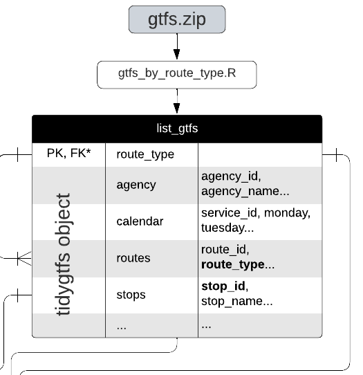
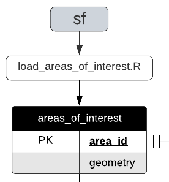
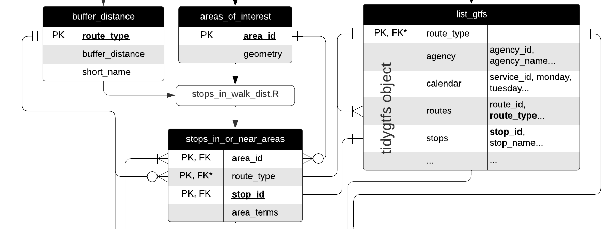
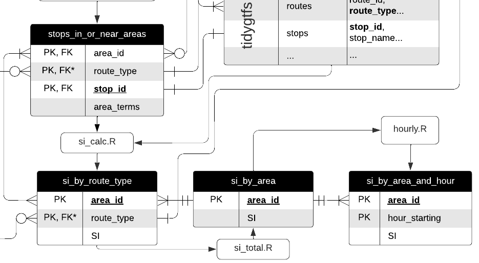
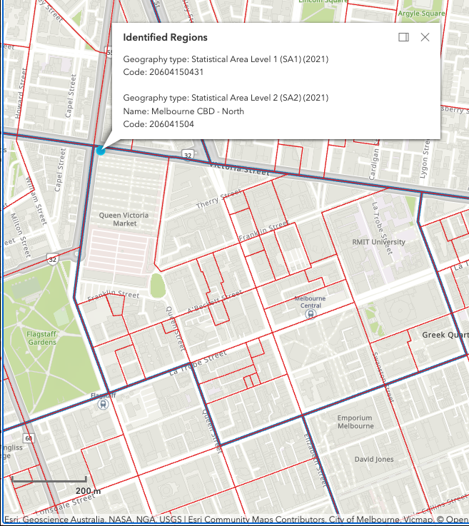
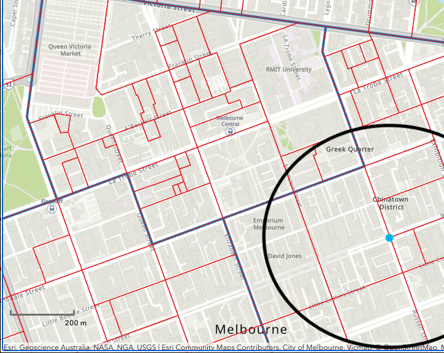

---
title: "Leveraging GTFS data to assess transit supply"
runningheader: "Reynolds (2024)" # only for pdf output
author: "James Reynolds"
date: "`r Sys.Date()`"
output:
  tufte::tufte_html:
    citation_package: natbib
    latex_engine: xelatex
bibliography: [packages.bib, References.bib]
link-citations: yes
header-includes:
  - \usepackage{titling}
  - \pretitle{\begin{center}
    \includegraphics[width=2in,height=2in]{ptrg-logo-s.png}\LARGE\\}
  - \posttitle{\end{center}}

---

<!--- Header to produce this as a PDF Book instead
output:
  tufte::tufte_book:
    citation_package: natbib
    latex_engine: xelatex
    includes:
      in_header: "preamble.tex"
bibliography: [packages.bib, References.bib]
link-citations: yes
header-includes:
  - \usepackage{titling}
  - \pretitle{\begin{center}
    \includegraphics[width=2in,height=2in]{ptrg-logo-s.png}\LARGE\\}
  - \posttitle{\end{center}}
--->


```{r setup, include=FALSE}
library(tufte)

library(tidyverse)
library(tidytransit)
library(sp)
library(strayr)
library(ptinpoly)
library(magrittr)
library(ggplot2)
library(sf)
library(ASGS.foyer)
library(raster)
library(ggmap)
library(units)
library(janitor)
library(mapview)
library(ggstatsplot)
library(gtsummary)
library(moments)
library(scales)
library(gtfstools)
library(lubridate)
library(kableExtra)
library(knitr)
library(readxl)
library(dplyr)
library(devtools)
library(gtfssupplyindex)
# invalidate cache when the tufte version changes
#knitr::opts_chunk$set(cache.extra = packageVersion('tufte'))
```

# Introduction
"If you can't measure it, you can't manage it" 
is often miss-attributed to @Deming1993new, 
who was actually trying to
make the opposite point [@Berenson2016]. 
Regardless, 
service level indicators 
are an important part of 
researching, 
managing 
and seeking to improve transit operations 
[@FieldingGordonJ1987Mpts; @Ryus:2003aa]. 
A wide range of indicators already exist. 
Examples include: 
those in the Transit Capacity and Quality of Service Manual (TCQSM)[@TCQSM:2013], 
the Transit Score metric [@WalkScore:2023tg] 
and many more.

Practitioners, 
researchers 
and advocates 
seeking to use such metrics 
may face two inter-related challenges: 
(1) 
there is the problem of calculating the metrics themselves 
for a specific location 
and service pattern; and
(2) 
is the challenge of explaining the metrics, 
their meaning 
and importance 
to those who are not specialists in transit, 
such as to politicians 
or the general public^[
Of the examples above, 
the metrics in the TCQSM appear: 
difficult to calculate in practice, 
and difficult to explain 
because there are a multitude of indicators 
(although there is an entire guidebook explaining them, which might help somewhat); 
while,
in contrast, 
Transit Scores can be obtained 
simply by typing an address into a website, 
but cannot be calculated independently 
and lack a detailed 
(and open source) 
description of the methodolgy / algorithm.].
However, 
a relatively simple transit Supply Index (SI) 
has been previous developed [@currie2007identifying], 
This reduces service levels to a single score 
(like the Transit Score), 
but is open 
and can be independently calculated by anyone.
It is obtained by calculating 
the number of transit arrivals 
at stops within an area of interest, 
with an adjustment made to account for the typical walk-access catchment for each stop. 
Hence, 
higher SI scores indicate 
areas with higher frequency 
and/or better coverage. 

Unfortunately, 
the SI does not appear to have been widely used, 
perhaps in part because at the time it was first published 
timetable data was not typically publicly available 
in a standardized 
and machine-readable format. 
The scores reported in Currie and Senbergs (2007)
has been calculated directly from a database of services 
provided by the transit authority 
in Melbourne, Australia. 
However, this database appears to have been 
in a format specific to Victoria 
and the agency itself^[
Public Transport Victoria (PTV)],
and so if SI scores for a different location were desired^[Or perhaps even for Melbourne again, 
but at a different time 
given that the database format has likely changed 
and the Currie and Senbergs (2007) analysis algorithms are not readily available.] 
considerable work would be required to wrangle the data and calculate scores.  

However, 
since the widespread adoption 
of the General Transit Feed Specification (GTFS), 
timetable data 
and tools for processing it 
are now much more widely available 
than they were in 2007.
More than 10,000 agencies 
are now providing GTFS feeds^[There are two forms: 
GTFS-static consisting of the timetable data (the scheduled services); 
and GTFS-realtime, which includes vehicle arrivals and departure times based on real-world position data. 
This paper and project uses only the GTFS-static (timetable) format.][@GTFS],
suggesting that the development of code 
to calculate SI scores directly from GTFS 
might allow it to be used more widely 
in research and practice.  
Previous work undertaken 
by Monash University's Public Transport Research Group (PRTG), 
available on Github [@SI_github], 
developed R functions to calculate SI scores 
from the Victorian PTV GTFS feed. 
However, 
the code was inefficient^[
To calculate SI scores for the Victorian GTFS feed 
would take the original code base approximately as long as it the service delivery itself took 
i.e. (SI scores fora whole week of transit service would take a whole week to compute!).] 
and untidy, 
and only allowed scores to be calculated for a whole day of transit service. 

More recently, 
PTRG has commenced a project which requires SI scores by hour of the day. 
Unfortunately, 
the current code does not have this capability, 
and major changes will be needed to calculate stop arrivals on an hourly, rather than daily, basis. 
However, 
this also provides an opportunity to revise and improve the code 
so that it is more readily accessible, 
usable and 
understandable for others, 
and quicker. 

This document reports 
the development of code to calculate SI scores 
from GTFS datasets 
as an R package [@gtfssupplyindex_github]. 
Structuring the code as an R package^[
Rather than as scripts within a R Markdown file, 
as for the original Transit_Supply_Index_GTFS efforts] 
provides various advantages as far as 
adhering to standardised conventions, 
accessibility and sharing, 
testing 
and so on [@wickham2023r]. 
More broadly, 
the motivation for this research is 
to better understand how GTFS data might be used 
to produce benchmarking metrics that can be calculated using open-source code. 
Such metrics might then be able to be used 
to assess proposed network changes 
or other analyses 
without the need for specialist software 
or bespoke calculation^[
More formally, 
the (null) hypothesis tested in this research is 
that the Supply Index cannot be calculated directly from a GTFS feed.]. 
A related objective is 
to increase the availability of metrics that are relatively easy to understand and use 
when making decisions about 
or advocating for changes to existing services, 
including for those who may not 
be technical specialists 
in transit planning and scheduling. 

The rest of this document 
is structured as follows: 
the next section discusses the research context 
of transit metrics 
and the the Supply Index. 
In the third section 
the methodology adopted for the code development is outlined, 
including discussion of the case studies 
(GTFS feeds) 
used to test and verify the code output. 
In the fourth section 
results are presented, 
including SI scores for SA1s across Greater Melbourne on an hour-by-hour basis. 
Results are then discussed, 
followed by a brief conclusion 
that includes the identification of directions for future research.  


# Research context

Even a brief search shows 
that there is a very large number of metrics 
available for benchmarking transit services. 
Examples include: 
(1) those in the Transit Cooperative Research Program (TCRP) Report 88, which is an extensive guidebook on developing a performance-measurement system [@Ryus:2003aa]; 
(2) online databases provided by 
the Florida Transit Information System (FTIS) [@Florida-Transit-Information-System:2018aa] 
and @UITP:2015aa; 
(3) those used in the extensive annual benchmarking programme 
undertaken yearly by the Transport Strategy Centre, 
which includes over 100 transit providers around the world [@Imperial-College-London:2023aa]; and
(4) a recently developed methodology to calculate 'blank spots' within an area, 
being those places beyond 400/800 metre walking distances to/from bus and tram stops/train stations [@AlamriSultan2023GAoA]. 
  
  
The Fielding Triangle [@FieldingGordonJ1987Mpts] provides a framework 
for understanding how such metrics combine 
service inputs, 
service outputs 
and service consumption 
to describe cost efficiency, 
cost effectiveness 
or service effectiveness. 
At a larger scale, 
@Litman:2003ab 
and @Litman:2016aa 
discuss some of the traffic, 
mobility, 
accessibility, 
social equity, 
strategic planning 
and other rational decision-making frames 
that might underlie such transit metrics, 
while @Reynolds:2017ah extends this into models of how 
institutionalism, 
incrementalism 
and other public policy models 
might apply to decision-making processes. 
Further examples include:
(1) @GuzmanLuisA.2017Aeit, 
who develop a measure of accessibility 
in the context of policy development 
and social equity 
for Latin American Bus Rapid Transit (BRT) based networks; and 
(2) the street space allocation metrics 
based around 10 ethical principles 
introduced by @Creutzig2020streetspaceallocation. 

However, 
many of these metrics appear difficult to calculate, 
complex to explain or understand, 
and likely not well suited to communication 
with those who are not transit planners or engineers, or otherwise technical specialists. 
Where pre-calculated metrics 
are immediately available 
it may not be possible for  practitioners, 
researchers 
or advocates 
to independently generate metrics for proposed system changes 
or to even know exactly how scores for the existing services levels are calculated. 
For example, 
Transit Scores 
for locations with a published GTFS feed 
are readily available on a website, 
eliminating the need for any calculations. 
The meaning of these Transit Scores 
appears easy to explain, 
as the highest possible score of 100 
represents what might be experienced in the centre of New York[@WalkScore:2023tg]]. 
However, 
the Transit Score algorithm 
is patented 
and effectively a black box. 
It is not possible to calculate scores independently 
or understand how the metric might change 
with alteration to the transit system or services, 
or the surrounding environment. 
Transit Score, therefore, 
fails the first of the aforementioned challenges, 
as practitioners, researchers and advocates 
can only use those scores provided by @WalkScore:2023tg
While the metric is simple to explain, 
as the closer to 100, the better, 
because it is based on 
a patented algorithm it may not be easy to understand or explain 
the connection between real-world conditions 
and the Transit Score, 
or what might need to be done 
to improve the score and service levels. 
Nor does it appear to be possible 
for Transit Scores to be generated for proposed changes to networks. 

Another example is the TCQSM, 
which specifies Levels of Service (LOS) between A and F 
across a range of factors^[
Including service span, 
frequency, 
speed, 
the proportion of the population serviced, 
competitiveness of travel times to car-based travel, 
and many more.]. 
This scoring scheme appears relatively simple to explain^[
A is good and F is bad. 
Also this scoring system matches the A to F LOS scoring used in many traffic capacity analysis software and manuals.], 
and the detail within @TCQSM:2013 
provides a resource for anyone wanting to better understand what the scores mean. 
However, 
calculation of many of TCQSM metrics may need specialised software 
and datasets^[
For example, 
the Service Coverage Area metric in the TCQSM (pp. 5-8 to 5-21) 
may require GIS or other analysis, 
on top of accurate data about population densities, 
stop locations 
and service schedules.] 
and it might be challenging to explain 
the detail of these measures 
or how to improve them 
to non-technical decision-makers, 
stakeholders 
or others involved in transit management or advocacy. 

The introduction of the General Transit Feed Specification (GTFS) 
and widespread release of schedule data in this format, 
however, 
has helped towards making transit metrics more broadly available and useable. 
GTFS is an open, 
text-based format 
that was developed originally to allow transit information to be included in the Google Maps navigation platform [@GTFS]. 
The data structure is shown in the below figure. 

```{r GTFS_ERD, fig.width = 10, fig.height = 2, fig.fullwidth = TRUE, fig.cap = "GTFS entity relationship diagram. Source: adapted by author from Alamri et al (2023) and the GTFS Schedule Reference (16/11/2023 revision).", echo = FALSE, warning=FALSE, message=FALSE, cache=TRUE, out.width='100%'}
knitr::include_graphics("graphics/GTFS.png")

```

In the Entity Relationship Diargram (ERD) shown above, each box represents a database table in the GTFS, with table rows indicating the variables (columns) included in each^[For example, each record in the 'stops' table includes a value for stop_id, stop_name, stop_lat and stop_lon.]. Relationships between the tables are indicated by the connecting lines, and Primary Key (PK) and Foreign Key (FK) designations^[For example, stop_id also appears in the 'stop_times' table as a Primary Key and Foreign Key.]. `Crow's feet' indicate the relationships between each table^[See https://i.stack.imgur.com/fxaAq.png for guide to the symbols. But, for example, the stops table is required, with the stop_id field providing a unique (primary) key for every stop. Within the stop_times table (which is also required) the stop_id field is a foreign key. Each unique stop_id can appear many times in the stop_times table, but must appear only once in the stops table. In the stop_times table each combination of trip_id, stop_id and arrival time must be unique (But, see note 2!) meaning that these fields represent a composite key.].

GTFS now provides a mechanism 
for including individual transit systems 
in many online products and analyseses, 
including the Transit Score metric itself. 
@Wong:2013aa provides another example of what can be done with GTFS data, 
having developed code to calculate of some of the TCQSM metrics^[
Daily average headways, 
route length 
and stop numbers 
for 50 transit operators.]. 
While the @Wong:2013aa open-source code is readily available^[
https://github.com/jcwong86/GTFS_Explore_Tool] 
this is now 11 years old 
and does not appear to be currently maintained. 
Future research may involve 
reviewing this code 
and using it to analyse modern GTFS feeds. 
However, 
in this paper the aim is more modest, 
being to use GTFS data to calculate Currie and Senbergs' (2007) SI.   


## The Suppy Index

```{marginfigure}
\begin{equation}
  SI_{area, time} = \sum{\frac{Area_{Bn}}{Area_{area}}*SL_{n, time}}
  \end{equation}
```

The Supply Index (SI) equation 
is shown in the margin figure^[
Minor adjustments have been made 
to generalise the equation, 
as Currie and Senbergs (2007) focus 
was the context of Melbourne's Census Collection Districts (CCD) 
and calculations based on a week of transit service. 
CCDs predate the introduction of 
Statistical Areas 1, 2, 3, and 4 (SA1, SA2, SA3, SA4), 
and other geographical divisions 
currently used by the Australian Bureau of Statistics (ABS), 
which may be more familiar to readers.], 
in which:
(1) $SI_{area, time}$ is the Supply Index for the area of interest 
and a given period of time;
(2) $Area_{Bn}$ is the buffer area for each stop (n) within the area of interest. 
In Currie and Senbergs (2007) this was based on 
a radius of 400 metres for bus and tram stops, 
and 800 metres for railway stations;
(3) $Area_{area}$ is the area of the area of interest; and
(4) $SL_{n,time}$ is the number of transit arrivals for each stop 
for a given time period.

An advantage of the SI is 
that it is a relatively simple number 
to calculate, 
understand 
and explain. 
It describes 
the number of transit arrivals 
at stops within 
an area of interest 
and time frame, 
multiplied by a factor 
accounting for the proportion of the area of interest that is within typical walking distance of each stop. 
Hence, 
more services, 
more stops 
and higher frequencies 
would all increase the SI score. 
The SI does not incorporate 
service span, 
speed 
or other elements of a transit service. 
These may be important 
to passenger experience, 
but might add considerable complexity. 
Simplicity is also helped 
by the way 
that the Index is additive, 
in that $SI_{area, time}$ scores can be aggregated 
to calculate an overall score 
across multiple time periods 
or for a region encompassing multiple areas of interest. 


# Methodology
R [@R-base], a widely used and readily available  statistical programming language, was adopted for code development. The package development setup and workflow described by @wickham2023r 
was adopted in this study. 

Various existing packages were relied upon including: the sf package [@R-sf] for geospatial analysis; the tidyverse [@tidyverse2019]; gtfstools [@R-gtfstools]; and tidytransit [@R-tidytransit]. Some code was adapted from the tidytransit, gtfstools and other package's examples, vignettes and other documentation.
Tidytransit is licensed under GPL-2 | GPL-3, 
while gtfstools is lincensed under the more permissive MIT license. 
For simplicity, 
the gtfssupplyindex package developed here 
is licensed under GPL-3 
so as to match tidytransit. 

## Cases

```{r mornington_map, fig.margin = TRUE, fig.cap = "Mornington Penninsula SA1 zones and location of Mornington Tourist Rail stops.", echo = FALSE, warning=FALSE, message=FALSE, cache=TRUE}
### ---------------- get abs data for Mornington Peninsula
#options(timeout = 1000)
#remotes::install_github("wfmackey/absmapsdata")

#get_mornington_sa1 <- function(){
#  mornington_sa12021 <- absmapsdata::sa12021 %>% filter(sa3_name_2021 == "Mornington Peninsula") %>% select(sa1_code_2021)
#  sf::st_write(mornington_sa12021, "inst/extdata/mornington_sa12021.geojson", append=FALSE)
#  return(mornington_sa12021)
#}
#get_mornington_sa3 <- function(){
#  mornington_sa32021 <- absmapsdata::sa32021 %>% filter(sa3_name_2021 == "Mornington Peninsula") %>% select(sa3_code_2021)
#  sf::st_write(mornington_sa32021, "inst/extdata/mornington_sa32021.geojson", append=FALSE)
#  return(mornington_sa32021)
#}

### ---------------- load SA3 abs maps data for just mornington peninsula
areas_of_interest <- load_areas_of_interest(areas_of_interest = absmapsdata::sa12021 %>% filter(sa3_name_2021 == "Mornington Peninsula") %>% select(sa1_code_2021), 
  area_id_field = "sa1_code_2021")

# map the areas_of_interest
map <- areas_of_interest %>% 
  ggplot() +
  geom_sf(aes(geometry = geometry))
#map
#set the EPSG to transform from lat/lon to metres
EPSG_for_transform = 28355

#load the revised mornington GTFS data
list_gtfs = gtfssupplyindex:::gtfs_by_route_type(system.file(
  "extdata/mornington180109",
  "gtfs.zip", 
  package = "gtfssupplyindex", 
  mustWork = TRUE))
stops_as_sf_mornington <-  list_gtfs[[1]]$stops %>% 
  tidytransit::stops_as_sf()

#map the stops on the ABS data
map + 
  geom_sf(data = stops_as_sf_mornington, aes(geometry = geometry))

stops_in_or_near_areas <- gtfssupplyindex:::stops_in_walk_dist(
  list_gtfs = list_gtfs, 
  areas_of_interest = areas_of_interest,
  EPSG_for_transform = 28355
)

```

Code development was undertaken using a number of cases for testing purposes, being: the  Mornington Penninsula Tourist Railway, the New York subway, and Melbourne. 


The Morning Penninsula Tourist Railway runs on Sundays and Wednesdays between Moorooduc and Mornington, with an intermediate stop at Tanti Park^[https://transitfeeds.com/p/mornington-railway/806/latest/stops]. A GTFS feed from 2018 was selected. ABS data was also used, 
primarily through the strayr 
and absmapsdata packages [@r-strayr].
The Mornington Peninsular SA3 zone and the SA1 zones contained within were adopted as the areas_of_interest. 

Tidytransit includes a sample GTFS feed from New York's MTA
(including the subway!), 
and so this was used for code tests were appropriate. 
<MORE DETAILS ABOUT THIS>

Larger scale testing was performed using the Victorian GTFS feed, 
published by Public Transport Victoria (PTV), 
sourced via @transitfeeds_victoria:2023aa for historical feeds. 
Again, ABS data was used for the areas_of_interest. 


# Results
## Code structure and output
Developed code is available and documented on github [@gtfssupplyindex_github]. 
The structure and functions used to generate each table are shown in the below Entity Relationship Diagram (ERD). 

```{r SI_ERD, fig.width = 10, fig.height = 2, fig.fullwidth = TRUE, fig.cap = "Entity Relationship Diagram (ERD) showing the data structure and functions", echo = FALSE, warning=FALSE, message=FALSE, cache=TRUE, out.width='100%'}
knitr::include_graphics("graphics/SI_data_structure.png")

```

The package takes input from three files: 

- a gtfs feed (gtfs.zip)
- a sf object describing the geometry of the areas for which the SI is to be calculated
- a csv file defining the buffer zone distances (in metres) for each route_type - a version of this file is included in the package. 

It outputs the si_by_area_and_hour table (bottom right), which reports the SI score for each hour of the day across dates specified by the user. 


```{r SI_mornington_20181230_output, echo = FALSE, warning=FALSE, message=FALSE, cache=TRUE}
####-----first load all the inputs

#load the revised mornington GTFS data
list_gtfs = gtfssupplyindex:::gtfs_by_route_type(system.file(
  "extdata/mornington180109",
  "gtfs.zip", 
  package = "gtfssupplyindex", 
  mustWork = TRUE))

areas_of_interest <- load_areas_of_interest(absmapsdata::sa22021 %>% filter(sa3_name_2021 == "Mornington Peninsula") %>% select(sa2_code_2021),  area_id_field = "sa2_code_2021")

buffer_distance <- gtfssupplyindex:::load_buffer_zones()

stops_in_or_near_areas <- gtfssupplyindex:::stops_in_walk_dist(
  list_gtfs = list_gtfs, 
  areas_of_interest = areas_of_interest,
  EPSG_for_transform = 28355,
  verbose = FALSE
)

si_by_area_and_hour_wider <- hourly(list_gtfs, stops_in_or_near_areas, "2018-12-30")

si_by_area_and_hour_wider %>% kable(caption = "Mornington Penninsula Tourist Railway hourly SI values for December 30, 2018, for SA1 zones")

```

## Functions

This section briefly describes each of the functions shown in the above ERD, and how these facilitate the calculation of the SI scores. 

### gtfs_by_route_type function


```{r SI_ERD_gtfs_by_route_type, fig.width = 10, fig.height = 2, fig.margin = TRUE, fig.cap = "Entity Relationship Diagram (ERD) excerpt, gtfs_by_route_type function", echo = FALSE, warning=FALSE, message=FALSE, cache=TRUE, out.width='100%'}


```


GTFS data is first loaded, with the gtfs_by_route_type function splitting this into a list (by route_type) of tidygtfs objects. This is achieved using the filter_by_route_type function from the gtfstools package [@filter_GTFS_by_mode].

```{r load_mornington_GTFS data, echo = TRUE, warning=FALSE, message=FALSE, cache=TRUE, out.width='100%'}
#load the revised mornington GTFS data
list_gtfs = gtfssupplyindex:::gtfs_by_route_type(system.file(
  "extdata/mornington180109",
  "gtfs.zip", 
  package = "gtfssupplyindex", 
  mustWork = TRUE))

names(list_gtfs) %>% kable(caption = "tidygtfs objects within list_gtfs")
names(list_gtfs[[1]]) %>% kable(caption = "tidygtfs structure of first element of list_gtfs")
```


### load_areas_of_interest function

```{r SI_ERD_load_areas_of_interest_function, fig.width = 10, fig.height = 2, fig.margin = TRUE, fig.cap = "Entity Relationship Diagram (ERD) excerpt, load_areas_of_interest function", echo = FALSE, warning=FALSE, message=FALSE, cache=TRUE, out.width='100%'}


```


Geographical data about the areas of interest are first loaded by the load_areas_of_interest.R function into an sf object using the @R-sf package. The resultant areas_of_interest table contains each area_id and its associated geometry.   

```{r load_ABS data, echo = FALSE, warning=FALSE, message=FALSE, cache=TRUE, out.width='100%'}
areas_of_interest <- load_areas_of_interest(areas_of_interest = sf::st_read(system.file(
  "extdata",
  "mornington_sa12021.geojson", 
  package = "gtfssupplyindex", 
  mustWork = TRUE)), 
  area_id_field = "sa1_code_2021")
head(areas_of_interest) %>% kable(caption = "First 6 entries in areas_of_interest table")

```

Data about buffer zones, specifically the walking distance threshold assigned to each route_type (mode) is then loaded, again through a function (load_buffer_zone.R). The package includes this information in a csv file, in which it is assumed that the buffer zone is definied in metres. 

```{r load_buffer_distance_data, echo = FALSE, warning=FALSE, message=FALSE, cache=TRUE, out.width='100%'}
buffer_distance <- gtfssupplyindex:::load_buffer_zones()
head(buffer_distance) %>% kable(caption = "First six entries in buffer_distance definitions")
```

### stops_in_walk_dist function

```{r SI_ERD_stops_in_walk_dist, fig.width = 10, fig.height = 2, fig.margin = FALSE, fig.cap = "Entity Relationship Diagram (ERD) excerpt, stops_in_walk_dist function", echo = FALSE, warning=FALSE, message=FALSE, cache=TRUE, out.width='100%'}


```

The stops_in_walk_dist function then generates a list (by route_type) in which each element is a datea table describing which stops are within walking distance of which areas of interest. Each table entry includes a stop_id, an area_id that is within the buffer_distance threshold of that stop, and the corresponding area related terms in the SI calculation^[This is the $Area_{Bn} / Area_{Area}$ bit]. 

```{r calculate_stop_in_or_near_areas, echo = FALSE, warning=FALSE, message=FALSE, cache=TRUE, out.width='100%'}
stops_in_or_near_areas <- gtfssupplyindex:::stops_in_walk_dist(
  list_gtfs = list_gtfs, 
  areas_of_interest = areas_of_interest,
  EPSG_for_transform = 28355, 
  verbose = FALSE
)

head(stops_in_or_near_areas[[1]]) %>% kable(caption = "'Rail' element of the stops_in_or_near_areas list for the Mornington Pennisula datasets, first six entries")
```

The variables passed to the stop_in_or_near_areas function are list_gtfs^[The list of tidygtfs objects ouput by the gtfs_by_route_type function], the areas_of_interest table^[Which is the output of the load_areas_of_interest function], the buffer_distance table^[Output by the load_buffer_zones function], and an EPSG_for_transform variable. This last variable is the Coordinate Reference System (CRS) value relevant to the geographic location. It is used to project the latitude and longitude values included in the GTFS data and area_of_interest data into metres, in this case relating to the GDA94 / MGA zone 55 relevant to Australia^[https://epsg.io/28355].  

The stops_in_walk_dist function is complicated by the need to have different buffer distances for each route_type, and to only include those parts of the walking catchment that are within each area of interest. It is structured as follows:  

(1) The first part of the stops_in_walk_dist function looks up the buffer_distance_length specific to each route_type in the list (by route_type) of tidygtfs objects. This value is appended to each tidygtfs object as an additional element (named buffer_distance). 

(2) Next the areas_of interest are transformed from latitude and longitude into metres, and the area is calculated. 

(3) The stops_in_walking_distance function then applies a sub-function, stops_in_walk_dist_one_route, to the list_gtfs (list of tidygtfs objects), in which: 

(4) A list of stops is extracted from the tidygtfs, using the stops_as_sf function from @R-tidytransit. 

(5) Circles are then drawn around each stop, with the radius equal to the buffer distance.  Intersecting these circles with the areas_of_interest then outputs an sf showing the catchment of each stop within each area of interest

(6) Finally, the $area_{Bn}$ terms are calculated for each combination of stop_id and area_id, 

The stops_in_walk_dist function includes a mode with output printed at each intermediate step (verbose = TRUE). The below shows the Morington Penninsula railway calculations again (as per the previous table), but run with verbose = TRUE so that intermediate steps are printed.  


```{r calculate_stop_in_or_near_areas_verbose, echo = TRUE, warning=FALSE, message=FALSE, cache=TRUE, out.width='100%', fig.cap= c( "Step 5, circles around each stop, showing the intersections with the areas_of_interest, all stops", "as above, but from each stop individually")}
stops_in_or_near_areas <- gtfssupplyindex:::stops_in_walk_dist(
  list_gtfs = list_gtfs, 
  areas_of_interest = areas_of_interest,
  EPSG_for_transform = 28355, 
  verbose = TRUE
)

```


### Calculating stop arrivals and the SI, SI_total and hourly


```{r SI_ERD_Si_calc_function, fig.width = 10, fig.height = 2, fig.margin = FALSE, fig.cap = "Entity Relationship Diagram (ERD) excerpt, si_calc, si_total and hourly functions", echo = FALSE, warning=FALSE, message=FALSE, cache=TRUE, out.width='100%'}


```


The si_calc.R function takes the stops_in_or_near_areas list (by route_type) of dataframes and the list_gtfs list (by route_type) of tidygtfs objects and calculates the si_by_route_type^[Which, again, is a list (by route_type) of dataframes, each containing a record for each area_id and combination of date, start_time and end_time specified by the user, and the corresponding (calculated) SI value.]

The tidytransit package includes an article about generating a departure timetable from a gtfs dataset [@tidytransit_departure_timetable]. Code from that article was adapted from this example to create functions to calculate the number of departures and arrivals from (a vector of) stop_ids within a given time period. These functions are included in the package^[See departures_and_arrivals.R] and called by the si_calc function^[Although this is not shown on the ERD].  Output from the arrivals function is shown in the bellow table. 

```{r arrivals_mornington_20181230, echo = TRUE, warning=FALSE, message=FALSE, cache=TRUE}

stop_ids <- list_gtfs[[1]]$stops %>%
 dplyr::select(stop_id)

arrivals_by_stop_id <- gtfssupplyindex::arrivals(
 gtfs = list_gtfs[[1]],
 stop_ids = stop_ids,
 date_ymd = "2018-12-30",
 start_hms = lubridate::hms("10:30:00"),
 end_hms = lubridate::hms("16:00:00")
)

arrivals_by_stop_id %>% kable(caption = "Arrivals at each stop for Sunday December 30th 2018, Mornington Peninsula tourist railway.")

```
This matches the number of trips shown in the Mornington Railway GTFS feed, being 4 in each direction^[https://transitfeeds.com/p/mornington-railway/806/latest/stop/1388695887/20181230]. 

```{r SI_Mornington_arrivals, fig.width = 10, fig.height = 2, fig.margin = FALSE, fig.cap = "Arrivals at Mornington Station (stop_id 1388695887) for 30/12/2018", echo = FALSE, warning=FALSE, message=FALSE, cache=TRUE, out.width='100%'}
knitr::include_graphics("graphics/1388695887_inbound.png")

```

All the inputs to calculate the si are now available. Hence, the SI.calc function can be run, resulting in the si_by_route_type list (by route_type) of tables showing the area_id corresponding SI values

```{r SI_mornington_20181230, echo = FALSE, warning=FALSE, message=FALSE, cache=TRUE}
####-----first load all the inputs

#load the revised mornington GTFS data
list_gtfs = gtfssupplyindex:::gtfs_by_route_type(system.file(
  "extdata/mornington180109",
  "gtfs.zip", 
  package = "gtfssupplyindex", 
  mustWork = TRUE))

areas_of_interest <- load_areas_of_interest(absmapsdata::sa22021 %>% filter(sa3_name_2021 == "Mornington Peninsula") %>% select(sa2_code_2021),  area_id_field = "sa2_code_2021")

buffer_distance <- gtfssupplyindex:::load_buffer_zones()

stops_in_or_near_areas <- gtfssupplyindex:::stops_in_walk_dist(
  list_gtfs = list_gtfs, 
  areas_of_interest = areas_of_interest,
  EPSG_for_transform = 28355,
  verbose = FALSE
)

####----run SI.calc function to build si_by_mode_and_time list (by route_type) of tables

si_by_route_type <- si_calc(
    list_gtfs = list_gtfs,
    stops_in_or_near_areas = stops_in_or_near_areas, 
    date_ymd = lubridate::ymd("2018-12-30"), 
    start_hms = lubridate::hms("10:30:00"),
    end_hms = lubridate::hms("16:00:00"),
    verbose = TRUE)

si_by_route_type %>% kable(caption = "SI values for Mornington Penninsula Railway services on 30/12/2018 (full day)")

```

The si_total function aggregates the si_by_route_type tables so that values are no longer separated by mode. Although in the case of the Mornington Penninsula Railway there is only one route_type.  

Finally, the hourly function runs the si_calc and si_total functions for every hour in a single day. It outputs a table showing the SI scores for each area for each hour of the day^[Across the service span]. The below table shows this output, together with row and column totals.  

```{r SI_hourly_mornington_20181230, echo = FALSE, warning=FALSE, message=FALSE, cache=TRUE}

si_by_area_and_hour_wider <- hourly(list_gtfs, stops_in_or_near_areas, "2018-12-30")

si_by_area_and_hour_wider %>% adorn_totals(where = c("row", "col")) %>% kable(caption = "Mornington Penninsula Tourist Railway hourly SI values for December 30, 2018, for SA1 zones")

```


## Testing the package on the Mornington Peninsula Tourist Railway and (just) the Mornington Peninsula SA3 zone 

In the previous sections the code structure, output and functions were described.  Results the Mornington Peninsula Tourist Railway's GTFS data set and the SA1 zones were also presented as an example case.  

In this section the same GTFS data is used, but with the areas of interest set instead to be the entire Mornington Peninsula SA3 area.  As all three of the Mornington Peninsula Raiway's stops are located within this SA3 zone the calculation of the SI scores by hand is relatively simple, and is used here as a check on the results. 

```{r mornington_SA3_test data, echo = TRUE, warning=FALSE, message=FALSE, cache=TRUE, fig.margin = TRUE, fig.cap = "Mornington Penninsula Tourist Railway catchments within the Mornington Penninsula SA3 zone"}

#load the revised mornington GTFS data
list_gtfs = gtfssupplyindex:::gtfs_by_route_type(system.file(
  "extdata/mornington180109",
  "gtfs.zip", 
  package = "gtfssupplyindex", 
  mustWork = TRUE))

areas_of_interest <- load_areas_of_interest(absmapsdata::sa32021 %>% filter(sa3_name_2021 == "Mornington Peninsula") %>% select(sa3_code_2021),  area_id_field = "sa3_code_2021")

buffer_distance <- gtfssupplyindex:::load_buffer_zones()

stops_in_or_near_areas <- gtfssupplyindex:::stops_in_walk_dist(
  list_gtfs = list_gtfs, 
  areas_of_interest = areas_of_interest,
  EPSG_for_transform = 28355,
  verbose = TRUE
)

kable(stops_in_or_near_areas, caption = "Catchment of each stop within Mornington Penninsula SA3 zone")

```
As shown in the figures and above tables, the area terms for each of the combinations of stop_id and area_id are ~ 0.0028.  All of the catchment areas of each stop fall within the single area_of_interest, being the Mornington Penninsula SA3^[area_id 21402]. 

Checking the area terms calculation is relatively trivial for this case, as the ABS maps data comes with an areasqkm_2021 field. Dividing the catchment area of the stop^[$Area_{Bn} = \pi0.8^2$] by the area of the area_of_interest^[$Area_{area} = 724.19$] as follows:


```{marginfigure}
\begin{equation}
  SI_{area, time} = \sum{\frac{Area_{Bn}}{Area_{area}}*SL_{n, time}}
  \end{equation}
```


```{r mornington_SA3_check_area, echo = TRUE, warning=FALSE, message=FALSE, cache=TRUE, out.width='100%'}
absmapsdata::sa32021 %>% filter(sa3_name_2021 == "Mornington Peninsula")

pi * .8^2 / 
  (as.numeric(
    absmapsdata::sa32021 %>% 
      st_drop_geometry() %>% 
      filter(
        sa3_name_2021 == "Mornington Peninsula") %>% 
      select(areasqkm_2021)
  ))
```

The calculated area_terms match, albeit with what appears to be some minor rounding errors. This appears to related to the ABS reported square_km (724.1681) being slightly different from the m2 reported by the st_area function used within the package (724,272,059). Likely this is related to the ABS having a slightly different methodology for calculating the area, and the error is approximately 0.015%. 


Completing the calculations by hand gives: 

stop_id 1388695887:

- $Area_{Bn} = \pi0.8^2$ 
- $Area_{area} = 724.19$
- $SL_{1388695887, 10-11am} = 1$, $SI_{stop1388695887, 10-11am}$ = `r pi * 0.8^2 / 724.19 * 1`
- $SL_{1388695887, 11-12noon} = 0$, $SI_{stop1388695887, 11-12noon}$ = 0
- $SL_{1388695887, 12-1pm} = 1$, $SI_{stop1388695887, 12-1pm}$ = `r pi * 0.8^2 / 724.19 * 1`
- $SL_{1388695887, 1-2pm} = 0$, $SI_{stop1388695887, 1pm-2pm}$ = 0
- $SL_{1388695887, 2-3pm} = 1$, $SI_{stop1388695887, 2pm-3pm}$ = `r pi * 0.8^2 / 724.19 * 1`
- $SL_{1388695887, 3-4pm} = 1$, $SI_{stop1388695887, 3pm-4pm}$ = `r pi * 0.8^2 / 724.19 * 1`

stop_id 1452182324 

- $Area_{Bn} = \pi0.8^2$ 
- $Area_{area} = 724.19$
- $SL_{1452182324, 10-11am} = 1$, $SI_{stop1452182324, 10-11am}$ = `r pi * 0.8^2 / 724.19 * 1`
- $SL_{1452182324, 11-12noon} = 1$, $SI_{stop1452182324, 11-12noon}$ = `r pi * 0.8^2 / 724.19 * 1`
- $SL_{1452182324, 12-1pm} = 2$, $SI_{stop1452182324, 12-1pm}$ = `r pi * 0.8^2 / 724.19 * 2`
- $SL_{1452182324, 1-2pm} = 1$, $SI_{stop1452182324, 1pm-2pm}$ = `r pi * 0.8^2 / 724.19 * 1`
- $SL_{1452182324, 2-3pm} = 1$, $SI_{stop1452182324, 2pm-3pm}$ = `r pi * 0.8^2 / 724.19 * 1`
- $SL_{1452182324, 3-4pm} = 2$, $SI_{stop1452182324, 3pm-4pm}$ = `r pi * 0.8^2 / 724.19 * 2`

stop_id 479306570

- $Area_{Bn} = \pi0.8^2$ 
- $Area_{area} = 724.19$
- $SL_{479306570, 10-11am} = 0$, $SI_{stop479306570, 10-11am}$ = 0
- $SL_{479306570, 11-12noon} = 1$, $SI_{stop479306570, 11-12noon}$ = `r pi * 0.8^2 / 724.19 * 1`
- $SL_{479306570, 12-1pm} = 1$, $SI_{stop479306570, 12-1pm}$ = `r pi * 0.8^2 / 724.19 * 2`
- $SL_{479306570, 1-2pm} = 0$, $SI_{stop479306570, 1pm-2pm}$ = 0
- $SL_{479306570, 2-3pm} = 1$, $SI_{stop479306570, 2pm-3pm}$ = `r pi * 0.8^2 / 724.19 * 1`
- $SL_{479306570, 3-4pm} = 1$, $SI_{stop479306570, 3pm-4pm}$ = `r pi * 0.8^2 / 724.19 * 1`

totals

- $SI_{10-11am}$ = `r pi * 0.8^2 / 724.19 * 1 + pi * 0.8^2 / 724.19 * 1 + 0 `
-$SI_{11-12noon}$ = `r 0 + pi * 0.8^2 / 724.19 * 1 + pi * 0.8^2 / 724.19 * 1`
- $SI_{12-1pm}$ = `r pi * 0.8^2 / 724.19 * 1 + pi * 0.8^2 / 724.19 * 2 + pi * 0.8^2 / 724.19 * 2`
- $SI_{1pm-2pm}$ = `r 0 + pi * 0.8^2 / 724.19 * 1 + 0`
- $SI_{2pm-3pm}$ = `r pi * 0.8^2 / 724.19 * 1 + pi * 0.8^2 / 724.19 * 1 +  pi * 0.8^2 / 724.19 * 1`
- $SI_{3pm-4pm}$ = `r pi * 0.8^2 / 724.19 * 1 +  pi * 0.8^2 / 724.19 * 2 + pi * 0.8^2 / 724.19 * 1`


Completing the calculations using the package gives:

```{r SI_mornington_20181230_full_calc, echo = TRUE, warning=FALSE, message=FALSE, cache=TRUE}

si_by_route_type <- si_calc(
    list_gtfs = list_gtfs,
    stops_in_or_near_areas = stops_in_or_near_areas, 
    date_ymd = lubridate::ymd("2018-12-30"), 
    start_hms = lubridate::hms("10:30:00"),
    end_hms = lubridate::hms("16:00:00"),
    verbose = TRUE)

si_by_route_type %>% kable(caption = "SI values for Mornington Penninsula Railway services on 30/12/2018 (full day)")


si_by_area_and_hour_wider <- hourly(list_gtfs, stops_in_or_near_areas, "2018-12-30")

si_by_area_and_hour_wider %>% adorn_totals(where = "col") %>% kable(caption = "Mornington Penninsula Tourist Railway hourly SI values for December 30, 2018, for SA1 zones")


```

Again, the results largely match^[Accounting again for the minor difference between the ABS and function-calculated areas of the Mornington Peninsula SA3.]  


## A larger test: the Victorian GTFS and SA1 zones within the Melbourne CBD - North SA2 zone

The north of the Melbourne CBD was selected for testing the code as it is may be familiar to readers, and has three different transit modes. The SA1 and SA2 zone boundaries are shown below. 

```{r Melbourne_cbd_north_sa2, fig.width = 10, fig.height = 2, fig.fullwidth = TRUE, fig.cap = "SA1 zone boundaries within the Melbourne CBD - North SA2, Source: ABS ", echo = FALSE, warning=FALSE, message=FALSE, cache=TRUE, out.width='100%'}


```

Trains stop at Melbourne Central and Flagstaff stations. Trams run along Elizabeth, Swanston, William, La Trobe and other streets. There are also bus services throughout the area, including along Queen Street. 

First step is to load the PTV GTFS data.  Some data wrangling is required as there are duplicate stop_ids in the stop definitions. 


```{r fix_ptv_data, eval = FALSE, echo = TRUE}
##-----THIS CHUNK ONLY NEEDS TO BE RUN ONCE TO CREATE THE gtfs_duplicate_stops_removed.zip file-----HENCE EVAL = FALSE ABOVE


ptv_231228 <- tidytransit::read_gtfs("data/ptv_231228/gtfs.zip")
# This results in "Warning: Duplicated ids found in: stops The returned object is not a tidygtfs object, you can use as_tidygtfs() after fixing the issue."

#So, remove the duplicated stops 
#identify duplicate stops
ptv_231228_duplicated_stops <- tabyl(ptv_231228$stops$stop_id) %>% filter (n>1)
names(ptv_231228_duplicated_stops) <- c("stop_id", "n", "percent")
ptv_231228_duplicated_stops <- left_join(ptv_231228_duplicated_stops, ptv_231228$stops)

##discard duplicates
ptv_231228$stops <- ptv_231228$stops[!duplicated(ptv_231228$stops$stop_id),]

## Write gtfs back to file
ptv_231228 <- as_tidygtfs(ptv_231228)
tidytransit::write_gtfs(ptv_231228, "data/ptv_231228/gtfs_duplicate_stops_removed.zip")

```

Now that the duplicate stop_ids have been removed and the gtfs feed written back to file ("data/ptv_231228/gtfs_duplicate_stops_removed.zip"), the gtfs_by_route_type function can be run.

```{r load_ptv_data, eval = TRUE, echo = TRUE}

## convert to list of tidygtfs objects
ptv_231228_list_gtfs <- gtfssupplyindex::gtfs_by_route_type("data/ptv_231228/gtfs_duplicate_stops_removed.zip")

```

### Trams only 
Looking first at the trams only, running the stops_in_walk_dist function with verbose = TRUE gives the following output 

```{r Melbourne_CBD_north_trams_stops_in_walk_dist, echo = FALSE, warning=FALSE, message=FALSE, cache=TRUE, fig.margin = FALSE, fig.cap = c("Catchment of each stop within each area of interest, Melbourne CBD - North SA1 zones, trams", "Catchment of each stop within each area of interest, Melbourne CBD - North SA1 zones, trams, by stop, first six stops")}

#load only the trams as a list of tidygtfs objects
ptv_231228_trams_only_list_gtfs <- ptv_231228_list_gtfs[1]
list_gtfs = ptv_231228_trams_only_list_gtfs

areas_of_interest <- load_areas_of_interest(absmapsdata::sa12021 %>% filter(sa2_name_2021 == "Melbourne CBD - North") %>% select(sa1_code_2021),  area_id_field = "sa1_code_2021")

buffer_distance <- gtfssupplyindex:::load_buffer_zones()

stops_in_or_near_areas <- gtfssupplyindex:::stops_in_walk_dist(
  list_gtfs = ptv_231228_trams_only_list_gtfs, 
  areas_of_interest = areas_of_interest,
  EPSG_for_transform = 28355,
  verbose = TRUE
)
```
In general, the results appear to meet expectations. The first stop has a stop id of 17591. This stop is located at Russell and Bourke Street^[https://transitfeeds.com/p/ptv/497/latest/stops?q=17591]. A 400 metres catchment overlaid on this stop is shown in the margin^[Note: Roughly drawn from the ABS maps.].  This matches the code output shown above (top left of figure).


```{r Russell_bourke_catchment, fig.width = 10, fig.height = 2, fig.margin = TRUE, fig.cap = "SA1 zone boundaries within the Melbourne CBD - North SA2, overlayed with 400m radius from Russell and Bourke Street. Source: ABS and author", echo = FALSE, warning=FALSE, message=FALSE, cache=TRUE, out.width='100%'}


```

Running the hourly function for January 16, 2024 gives the following output:


```{r Melbourne_CBD_north_trams_si_hourly, echo = FALSE, warning=FALSE, message=FALSE, cache=TRUE}


#si_by_route_type <- si_calc(
#    list_gtfs = ptv_231228_trams_only_list_gtfs,
#    stops_in_or_near_areas = stops_in_or_near_areas, 
#    date_ymd = lubridate::ymd("2024-01-16"), 
#    start_hms = lubridate::hms("10:30:00"),
#    end_hms = lubridate::hms("16:00:00"),
#    verbose = TRUE)

#si_by_route_type %>% head() %>% kable(caption = "SI values for SA1 zones with the Melbourne CBD - North SA2 for 10:30am to 4pm on January 16, 2024, first 6 SA1 zones")


si_by_area_and_hour <- hourly(
  list_gtfs = ptv_231228_trams_only_list_gtfs, 
  stops_in_or_near_areas = stops_in_or_near_areas, 
  date_ymd = "2024-01-16",
  verbose = TRUE)

#pivot to wider for display as table
si_by_area_and_hour_wider <- si_by_area_and_hour %>% pivot_wider(names_from = hour_starting, values_from = SI)

si_by_area_and_hour_wider %>% select(1, 6:26) %>% head() %>% adorn_rounding(digits = 0) %>% kable(caption = "Victorian Trams and SA1 zones within the Melbourne CBD - North SA2 zone, hourly SI values for January 16, 2024, first 6 SA1 zones, zeroed columns excluded." )


```

This appears to meet expectations, with SI scores peaking in the morning (8-9) and evening (17-18). 

The below figure maps this output. 


```{r Melbourne_CBD_north_trams_map, echo = FALSE, warning=FALSE, message=FALSE, cache=TRUE, fig.fullwidth = TRUE, fig.cap="Victorian Trams and SA1 zones within the Melbourne CBD - North SA2 zone,SI values for January 16, 2024, by hour"}

#Join SI to map data
si_by_area_and_hour <- left_join(areas_of_interest, si_by_area_and_hour)

si_by_area_and_hour$hour_starting <- as_factor(si_by_area_and_hour$hour_starting)

ggplot() + 
  geom_sf(data=si_by_area_and_hour,
          aes(fill = SI)) +
            facet_wrap(vars(hour_starting)) +
  theme(axis.text.x=element_blank(), #remove x axis labels
        axis.ticks.x=element_blank(), #remove x axis ticks
        axis.text.y=element_blank(),  #remove y axis labels
        axis.ticks.y=element_blank()  #remove y axis ticks
  )

```

In general, the results match expectations, with higher SI scores for SA1 zones that area closer to the Swanston, Elizabeth and Latrobe St corridors (which are where the trams are!)


### Rail only


Looking next at the rail only, running the stops_in_walk_dist function with verbose = TRUE gives the following output 

```{r Melbourne_CBD_north_rail_stops_in_walk_dist, echo = FALSE, warning=FALSE, message=FALSE, cache=TRUE, fig.margin = FALSE, fig.cap = c("Catchment of each stop within each area of interest, Melbourne CBD - North SA1 zones, rail", "Catchment of each stop within each area of interest, Melbourne CBD - North SA1 zones, rail, by stop, first six stops")}

#load only the rail as a list of tidygtfs objects
ptv_231228_rail_only_list_gtfs <- ptv_231228_list_gtfs[2]
list_gtfs = ptv_231228_rail_only_list_gtfs

areas_of_interest <- load_areas_of_interest(absmapsdata::sa12021 %>% filter(sa2_name_2021 == "Melbourne CBD - North") %>% select(sa1_code_2021),  area_id_field = "sa1_code_2021")

buffer_distance <- gtfssupplyindex:::load_buffer_zones()

stops_in_or_near_areas <- gtfssupplyindex:::stops_in_walk_dist(
  list_gtfs = ptv_231228_rail_only_list_gtfs, 
  areas_of_interest = areas_of_interest,
  EPSG_for_transform = 28355,
  verbose = TRUE
)
```
In general, the results appear to meet expectations: 

- Flagstaff Railway Station (stop_id 19841) is roughly 800m from the intersection of Swanston Street and Lonsdale Street, which is where the arc shown in the bottom right of the top left figure terminates^[https://transitfeeds.com/p/ptv/497/latest/stop/19841];
- The entire SA2 is within the 800m catchment of Melbourne Central Station (stop_id 19842);
- Only a small part of the SA2 is within 800m of Parliament Station (to the south east, stop_id 19843). 
- Only a small part of the SA2 is within 800m of Flinders Street Station (to the south, stop_ids 19854 and 22238).  There are two stops related to Flinders Street because there are both Vline and Metro Trains services, which each have a different stop_id^[https://transitfeeds.com/p/ptv/497/latest/stop/19854 and https://transitfeeds.com/p/ptv/497/latest/stop/22238].  


Running the hourly function for January 16, 2024 gives the following output:


```{r Melbourne_CBD_north_rail_si_hourly, echo = FALSE, warning=FALSE, message=FALSE, cache=TRUE}


#si_by_route_type <- si_calc(
#    list_gtfs = ptv_231228_rail_only_list_gtfs,
#    stops_in_or_near_areas = stops_in_or_near_areas, 
#    date_ymd = lubridate::ymd("2024-01-16"), 
#    start_hms = lubridate::hms("10:30:00"),
#    end_hms = lubridate::hms("16:00:00"),
#    verbose = TRUE)

#si_by_route_type %>% head() %>% kable(caption = "SI values for SA1 zones with the Melbourne CBD - North SA2 for 10:30am to 4pm on January 16, 2024, first 6 SA1 zones")


si_by_area_and_hour <- hourly(
  list_gtfs = ptv_231228_rail_only_list_gtfs, 
  stops_in_or_near_areas = stops_in_or_near_areas, 
  date_ymd = "2024-01-16")

#pivot to wider for display as table
si_by_area_and_hour_wider <- si_by_area_and_hour %>% pivot_wider(names_from = hour_starting, values_from = SI)

si_by_area_and_hour_wider %>% select(1, 4:24) %>% head(n=75) %>% adorn_rounding(digits = 0) %>% kable(caption = "Victorian rail and SA1 zones within the Melbourne CBD - North SA2 zone, hourly SI values for January 16, 2024, first 75 SA1 zones, zeroed columns excluded." )


```


This appears to meet expectations, with SI scores peaking in the morning (8-9) and evening (17-18). A lot of the SA1 zones have identical SI scores because ALL of their area is within the 800m buffer distance of a railway station, meaning that the area terms cancel out and are equal to one.  

The below figure maps this output. 


```{r Melbourne_CBD_north_rail_map, echo = FALSE, warning=FALSE, message=FALSE, cache=TRUE, fig.fullwidth = TRUE, fig.cap="Victorian rail and SA1 zones within the Melbourne CBD - North SA2 zone,SI values for January 16, 2024, by hour"}

#Join SI to map data
si_by_area_and_hour <- left_join(areas_of_interest, si_by_area_and_hour)

si_by_area_and_hour$hour_starting <- as_factor(si_by_area_and_hour$hour_starting)

ggplot() + 
  geom_sf(data=si_by_area_and_hour,
          aes(fill = SI)) +
            facet_wrap(vars(hour_starting)) +
  theme(axis.text.x=element_blank(), #remove x axis labels
        axis.ticks.x=element_blank(), #remove x axis ticks
        axis.text.y=element_blank(),  #remove y axis labels
        axis.ticks.y=element_blank()  #remove y axis ticks
  )

```

In general, the SI scores appear to match expectations. SA1 zones closer to Melbourne Central and Flagstaff have higher scores.


### Full SI calculation

This section runs the SI calculation for all modes (lrt, rail, bus) on SA1 zones within the Melbourne CBD - North SA2 zone. Here verbose is set as FALSE to cut down on the amount of output displayed. 

```{r Melbourne_CBD_north_all_stops_in_walk_dist, echo = FALSE, warning=FALSE, message=FALSE, cache=TRUE, fig.margin = FALSE, fig.cap = c("Catchment of each stop within each area of interest, Melbourne CBD - North SA1 zones, rail", "Catchment of each stop within each area of interest, Melbourne CBD - North SA1 zones, rail, by stop, first six stops")}


list_gtfs = ptv_231228_list_gtfs

areas_of_interest <- load_areas_of_interest(absmapsdata::sa12021 %>% filter(sa2_name_2021 == "Melbourne CBD - North") %>% select(sa1_code_2021),  area_id_field = "sa1_code_2021")

buffer_distance <- gtfssupplyindex:::load_buffer_zones()

stops_in_or_near_areas <- gtfssupplyindex:::stops_in_walk_dist(
  list_gtfs = list_gtfs, 
  areas_of_interest = areas_of_interest,
  EPSG_for_transform = 28355,
  verbose = FALSE
)

#si_by_route_type <- si_calc(
#    list_gtfs = list_gtfs,
#    stops_in_or_near_areas = stops_in_or_near_areas, 
#    date_ymd = lubridate::ymd("2024-01-16"), 
#    start_hms = lubridate::hms("10:30:00"),
#    end_hms = lubridate::hms("16:00:00"),
#    verbose = TRUE)

#si_by_route_type %>% head() %>% kable(caption = "SI values for SA1 zones with the Melbourne CBD - North SA2 for 10:30am to 4pm on January 16, 2024, first 6 SA1 zones")


si_by_area_and_hour <- hourly(
  list_gtfs = list_gtfs, 
  stops_in_or_near_areas = stops_in_or_near_areas, 
  date_ymd = "2024-01-16")

#pivot to wider for display as table
si_by_area_and_hour_wider <- si_by_area_and_hour %>% pivot_wider(names_from = hour_starting, values_from = SI)

si_by_area_and_hour_wider %>% select(1, 4:24) %>% head(n=75) %>% adorn_rounding(digits = 0) %>% kable(caption = "Victorian GTFS and SA1 zones within the Melbourne CBD - North SA2 zone, hourly SI values for January 16, 2024, first 75 SA1 zones, zeroed columns excluded." )


```


This appears to meet expectations, with SI scores peaking in the morning (8-9) and evening (17-18).

The below figure maps this output. 


```{r Melbourne_CBD_north_all_map, echo = FALSE, warning=FALSE, message=FALSE, cache=TRUE, fig.fullwidth = TRUE, fig.cap="Victorian rail and SA1 zones within the Melbourne CBD - North SA2 zone,SI values for January 16, 2024, by hour"}

#Join SI to map data
si_by_area_and_hour <- left_join(areas_of_interest, si_by_area_and_hour)

si_by_area_and_hour$hour_starting <- as_factor(si_by_area_and_hour$hour_starting)

ggplot() + 
  geom_sf(data=si_by_area_and_hour,
          aes(fill = SI)) +
            facet_wrap(vars(hour_starting)) +
  theme(axis.text.x=element_blank(), #remove x axis labels
        axis.ticks.x=element_blank(), #remove x axis ticks
        axis.text.y=element_blank(),  #remove y axis labels
        axis.ticks.y=element_blank()  #remove y axis ticks
  )

```

In general, the SI scores appear to match expectations. SA1 zones closer to Melbourne Central and Flagstaff have higher scores.

## Melbourne, Victoria

This section presents hourly SI values for all SA1 zones in Greater Melbourne for a typical weekday and weekend. The selected days are Tuesday 10th, Saturday 14th and Sunday 15th of October 2023.  These days were selected so as to match the typical timing of the Australian Census (a Tuesday in early October), even though 2023 is not a census year.  

```{r fix_ptv_data_Victoria_231006, eval = FALSE, echo = TRUE}
##-----THIS CHUNK ONLY NEEDS TO BE RUN ONCE TO CREATE THE gtfs_duplicate_stops_removed.zip file-----HENCE EVAL = FALSE ABOVE

ptv_231006 <- tidytransit::read_gtfs("data/ptv_231006/gtfs.zip")
# This results in "Warning: Duplicated ids found in: stops The returned object is not a tidygtfs object, you can use as_tidygtfs() after fixing the issue."

#So, remove the duplicated stops 
#identify duplicate stops
ptv_231006_duplicated_stops <- tabyl(ptv_231006$stops$stop_id) %>% filter (n>1)
names(ptv_231006_duplicated_stops) <- c("stop_id", "n", "percent")
ptv_231006_duplicated_stops <- left_join(ptv_231006_duplicated_stops, ptv_231006$stops)

##discard duplicates
ptv_231006$stops <- ptv_231006$stops[!duplicated(ptv_231006$stops$stop_id),]

## Write gtfs back to file
ptv_231006 <- as_tidygtfs(ptv_231006)
tidytransit::write_gtfs(ptv_231006, "data/ptv_231006/gtfs_duplicate_stops_removed.zip")

```
Again, there are duplicate stop_ids in the PTV GTFS dataset.  These have been removed and the gtfs feed written back to file ("data/ptv_231006/gtfs_duplicate_stops_removed.zip"), on which the gtfs_by_route_type function can be run.

```{r load_ptv_data_231006, eval = TRUE, echo = TRUE}

## convert to list of tidygtfs objects
ptv_231006_list_gtfs <- gtfssupplyindex::gtfs_by_route_type("data/ptv_231006/gtfs_duplicate_stops_removed.zip")
```


```{r Melbourne_all_stops_in_walk_dist_231006, echo = FALSE, warning=FALSE, message=FALSE, cache=TRUE, fig.margin = FALSE, fig.cap = c("Catchment of each stop within each area of interest, Melbourne CBD - North SA1 zones, rail", "Catchment of each stop within each area of interest, Melbourne CBD - North SA1 zones, rail, by stop, first six stops")}


list_gtfs = ptv_231006_list_gtfs

areas_of_interest <- load_areas_of_interest(absmapsdata::sa12021 %>% filter(gcc_name_2021 == "Greater Melbourne") %>% select(sa1_code_2021),  area_id_field = "sa1_code_2021")

buffer_distance <- gtfssupplyindex:::load_buffer_zones()

stops_in_or_near_areas <- gtfssupplyindex:::stops_in_walk_dist(
  list_gtfs = list_gtfs, 
  areas_of_interest = areas_of_interest,
  EPSG_for_transform = 28355,
  verbose = FALSE
)

```


### Tuesday 10th October, 2023

```{r Melbourne_231010, echo = FALSE, warning=FALSE, message=FALSE, cache=TRUE}

####COMMENT OUT CALCULATION AND SAVE TO FILE, SO IT DOES NOT RUN WHILE KNITTING RMARKDOWN
#si_by_area_and_hour_231010 <- hourly(
#  list_gtfs = list_gtfs, 
#  stops_in_or_near_areas = stops_in_or_near_areas, 
#  date_ymd = "2023-10-10",
#  verbose = TRUE)

#write.csv(si_by_area_and_hour_231010, "results/Greater_Melbourne/si_by_SA12021area_and_hour_231010")


###Load results from CSV (Precalculated above) and make first column character
si_by_area_and_hour_231010 <- read.csv("results/Greater_Melbourne/si_by_SA12021area_and_hour_231010")
si_by_area_and_hour_231010 <- si_by_area_and_hour_231010[,2:4]
si_by_area_and_hour_231010$area_id <- as.character(si_by_area_and_hour_231010$area_id)

#pivot to wider for display as table
si_by_area_and_hour_231010_wider <- si_by_area_and_hour_231010 %>% pivot_wider(names_from = hour_starting, values_from = SI)

si_by_area_and_hour_231010_wider %>% select(1, 6:25) %>% head() %>% adorn_rounding(digits = 0) %>% kable(caption = "Victorian GTFS and SA1 zones within the Greater Melbourne GCCSA, hourly SI values for October 10, 2023, first 6 SA1 zones, 4am to 11pm only" )


```


This appears to meet expectations, with SI scores peaking in the morning (8-9) and evening (17-18). The below figure maps this output for just the SA1 zones within the Melbourne CBD - North SA2 zone. 


```{r Melbourne_CBD_north_all_map_231010, echo = FALSE, warning=FALSE, message=FALSE, cache=TRUE, fig.fullwidth = TRUE, fig.cap="Victorian rail and SA1 zones within the Melbourne CBD - North SA2 zone,SI values for October 10, 2023, by hour between 5am and 1am"}

map_areas_of_interest <- load_areas_of_interest(absmapsdata::sa12021 %>% filter(sa2_name_2021 == "Melbourne CBD - North") %>% select(sa1_code_2021),  area_id_field = "sa1_code_2021")

#Join SI to map data
map_si_by_area_and_hour_231010 <- inner_join(map_areas_of_interest, si_by_area_and_hour_231010)

#convert hour starting to numeric
map_si_by_area_and_hour_231010$hour_starting <- hm(map_si_by_area_and_hour_231010$hour_starting)
map_si_by_area_and_hour_231010$hour_starting <- hour(map_si_by_area_and_hour_231010$hour_starting)

#plot only 5am to 1am
ggplot() + 
  geom_sf(data=map_si_by_area_and_hour_231010 %>% filter(hour_starting %in% (5:24)),
          aes(fill = SI)) +
            facet_wrap(vars(hour_starting)) +
  theme(axis.text.x=element_blank(), #remove x axis labels
        axis.ticks.x=element_blank(), #remove x axis ticks
        axis.text.y=element_blank(),  #remove y axis labels
        axis.ticks.y=element_blank()  #remove y axis ticks
  )

```

Again, this appears to match expectations and is largely similar to the results shown above in the test using the PTV data for January 16, 2024.  

The following shows calculated SI values for SA1 zones within the Clayton (North) - Notting Hill SA2 zone.  

```{r Clayton_campus_all_map_231010, echo = FALSE, warning=FALSE, message=FALSE, cache=TRUE, fig.fullwidth = TRUE, fig.cap="Victorian rail and SA1 zones within the Clayton (North) - NOtting Hill SA2 zone,SI values for January 16, 2024, by hour between 5am and 1am"}

map_areas_of_interest <- load_areas_of_interest(absmapsdata::sa12021 %>% filter(sa2_name_2021 == "Clayton (North) - Notting Hill") %>% select(sa1_code_2021),  area_id_field = "sa1_code_2021")

#Join SI to map data
map_si_by_area_and_hour_231010 <- inner_join(map_areas_of_interest, si_by_area_and_hour_231010)

#convert hour starting to numeric
map_si_by_area_and_hour_231010$hour_starting <- hm(map_si_by_area_and_hour_231010$hour_starting)
map_si_by_area_and_hour_231010$hour_starting <- hour(map_si_by_area_and_hour_231010$hour_starting)

#plot only 5am to 1am
ggplot() + 
  geom_sf(data=map_si_by_area_and_hour_231010 %>% filter(hour_starting %in% (5:24)),
          aes(fill = SI)) +
            facet_wrap(vars(hour_starting)) +
  theme(axis.text.x=element_blank(), #remove x axis labels
        axis.ticks.x=element_blank(), #remove x axis ticks
        axis.text.y=element_blank(),  #remove y axis labels
        axis.ticks.y=element_blank()  #remove y axis ticks
  )


```
These results appear to largely match expectations.  SI values are much lower than in the Melbourne CBD. The highest SI scores are generally in the SA1 zones that are closest to the bus interchange at Monash University (south-west area of the SA2 area). 

### Saturday 14th October, 2023

SI calculations have also been run for Saturday 14th October, 2023.  The following shows the results, again for SA1 zones within the Melbourne CBD - North SA2 zone. 

```{r Melbourne_231014, echo = FALSE, warning=FALSE, message=FALSE, cache=TRUE}

####COMMENT OUT CALCULATION AND SAVE TO FILE, SO IT DOES NOT RUN WHILE KNITTING RMARKDOWN
#si_by_area_and_hour_231014 <- hourly(
#  list_gtfs = list_gtfs, 
#  stops_in_or_near_areas = stops_in_or_near_areas, 
#  date_ymd = "2023-10-14",
#  verbose = TRUE)

#write.csv(si_by_area_and_hour_231014, "results/Greater_Melbourne/si_by_SA12021area_and_hour_231014")

###Load results from CSV (Precalculated above) and make first column character
si_by_area_and_hour_231014 <- read.csv("results/Greater_Melbourne/si_by_SA12021area_and_hour_231014")
si_by_area_and_hour_231014 <- si_by_area_and_hour_231014[,2:4]
si_by_area_and_hour_231014$area_id <- as.character(si_by_area_and_hour_231014$area_id)

#pivot to wider for display as table
si_by_area_and_hour_231014_wider <- si_by_area_and_hour_231014 %>% pivot_wider(names_from = hour_starting, values_from = SI)

##Skip printing table
#si_by_area_and_hour_231014_wider %>% select(1, 6:28) %>% head(n=75) %>% adorn_rounding(digits = 0) %>% kable(caption = "Victorian GTFS and SA1 zones within the Greater Melbourne GCCSA, hourly SI values for October 10, 2023, first 75 SA1 zones, 4am to 2am only" )


```


```{r Melbourne_CBD_north_all_map_231014, echo = FALSE, warning=FALSE, message=FALSE, cache=TRUE, fig.fullwidth = TRUE, fig.cap="Victorian GTFS and SA1 zones within the Melbourne CBD - North SA2 zone,SI values for Saturday 14th October 2023, by hour between 5am and 1am"}

map_areas_of_interest <- load_areas_of_interest(absmapsdata::sa12021 %>% filter(sa2_name_2021 == "Melbourne CBD - North") %>% select(sa1_code_2021),  area_id_field = "sa1_code_2021")

#Join SI to map data
map_si_by_area_and_hour_231014 <- inner_join(map_areas_of_interest, si_by_area_and_hour_231014)

#convert hour starting to numeric
map_si_by_area_and_hour_231014$hour_starting <- hm(map_si_by_area_and_hour_231014$hour_starting)
map_si_by_area_and_hour_231014$hour_starting <- hour(map_si_by_area_and_hour_231014$hour_starting)

#plot only 5am to 1am
ggplot() + 
  geom_sf(data=map_si_by_area_and_hour_231014 %>% filter(hour_starting %in% (5:24)),
          aes(fill = SI)) +
            facet_wrap(vars(hour_starting)) +
  theme(axis.text.x=element_blank(), #remove x axis labels
        axis.ticks.x=element_blank(), #remove x axis ticks
        axis.text.y=element_blank(),  #remove y axis labels
        axis.ticks.y=element_blank()  #remove y axis ticks
  )

```
These results generally meet expectations.  SI scores are in the order of half of the Tuesday scores, reflecting the lower service levels on Saturdays.  


### Sunday 15th October, 2023

```{r Melbourne_231015, echo = FALSE, warning=FALSE, message=FALSE, cache=TRUE}

####COMMENT OUT CALCULATION AND SAVE TO FILE, SO IT DOES NOT RUN WHILE KNITTING RMARKDOWN
#si_by_area_and_hour_231015 <- hourly(
#  list_gtfs = list_gtfs, 
#  stops_in_or_near_areas = stops_in_or_near_areas, 
#  date_ymd = "2023-10-15",
#  verbose = TRUE)

#write.csv(si_by_area_and_hour_231015, "results/Greater_Melbourne/si_by_SA12021area_and_hour_231015")


###Load results from CSV (Precalculated above) and make first column character
si_by_area_and_hour_231015 <- read.csv("results/Greater_Melbourne/si_by_SA12021area_and_hour_231010")
si_by_area_and_hour_231015 <- si_by_area_and_hour_231015[,2:4]
si_by_area_and_hour_231015$area_id <- as.character(si_by_area_and_hour_231015$area_id)

#pivot to wider for display as table
si_by_area_and_hour_231015_wider <- si_by_area_and_hour_231015 %>% pivot_wider(names_from = hour_starting, values_from = SI)

## Skip table
#si_by_area_and_hour_231015_wider %>% select(1, 6:28) %>% head(n=75) %>% adorn_rounding(digits = 0) %>% kable(caption = "Victorian GTFS and SA1 zones within the Greater Melbourne GCCSA, hourly SI values for October 10, 2023, first 75 SA1 zones, 4am to 2am only" )


```


```{r Melbourne_CBD_north_all_map_231015, echo = FALSE, warning=FALSE, message=FALSE, cache=TRUE, fig.fullwidth = TRUE, fig.cap="Victorian GTFS and SA1 zones within the Melbourne CBD - North SA2 zone,SI values for Sunday 15th October 2023, by hour between 5am and 1am"}

map_areas_of_interest <- load_areas_of_interest(absmapsdata::sa12021 %>% filter(sa2_name_2021 == "Melbourne CBD - North") %>% select(sa1_code_2021),  area_id_field = "sa1_code_2021")

#Join SI to map data
map_si_by_area_and_hour_231015 <- inner_join(map_areas_of_interest, si_by_area_and_hour_231015)

#convert hour starting to numeric
map_si_by_area_and_hour_231015$hour_starting <- hm(map_si_by_area_and_hour_231015$hour_starting)
map_si_by_area_and_hour_231015$hour_starting <- hour(map_si_by_area_and_hour_231015$hour_starting)

#plot only 5am to 1am
ggplot() + 
  geom_sf(data=map_si_by_area_and_hour_231015 %>% filter(hour_starting %in% (5:24)),
          aes(fill = SI)) +
            facet_wrap(vars(hour_starting)) +
  theme(axis.text.x=element_blank(), #remove x axis labels
        axis.ticks.x=element_blank(), #remove x axis ticks
        axis.text.y=element_blank(),  #remove y axis labels
        axis.ticks.y=element_blank()  #remove y axis ticks
  )


```


# Discussion and conclusions


# References {#references }


```{r, include=FALSE}
knitr::write_bib(file = 'packages.bib')
```


